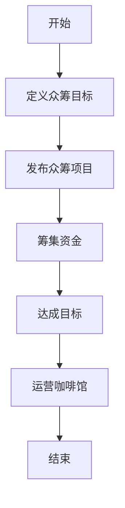
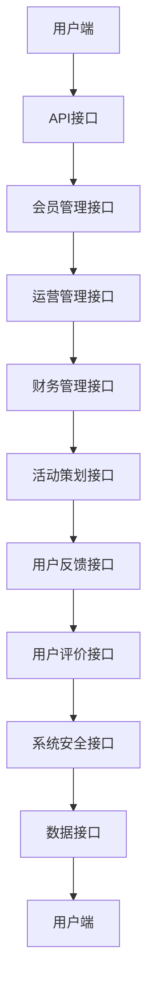

                 

### 意义众筹咖啡馆：价值观交流的实体空间

关键词：意义众筹、咖啡馆、价值观、实体空间、交流、运营模式

摘要：本文探讨了意义众筹咖啡馆这一新兴的实体空间，旨在为人们提供一个价值观交流的平台。首先，文章介绍了意义众筹咖啡馆的起源与发展，分析了其独特的商业模式和运营策略。接着，文章深入探讨了价值观交流的概念及其在咖啡馆中的意义和作用。随后，文章详细阐述了意义众筹咖啡馆的实体空间设计，包括功能布局和互动参与方式。文章还通过国内外成功案例，分析了意义众筹咖啡馆的实践效果。最后，文章对意义众筹咖啡馆的未来发展趋势进行了展望，并提出了相关的建议和启示。

### 目录大纲设计

#### 1. 《意义众筹咖啡馆：价值观交流的实体空间》目录大纲

```markdown
----------------------------------------------------------------
# 第一部分: 意义众筹咖啡馆的背景与概念

## 第1章: 意义众筹咖啡馆的起源与发展

### 1.1.1 众筹模式的起源与发展
### 1.1.2 意义众筹咖啡馆的概念
### 1.1.3 意义众筹咖啡馆的特点与优势

## 第2章: 价值观交流的概念与意义

### 2.1.1 价值观交流的内涵
### 2.1.2 价值观交流的重要性
### 2.1.3 价值观交流的障碍与解决方法

## 第3章: 意义众筹咖啡馆的运营模式

### 3.1.1 意义众筹咖啡馆的商业模式
### 3.1.2 意义众筹咖啡馆的运营策略
### 3.1.3 意义众筹咖啡馆的会员制度

## 第4章: 价值观交流的实体空间设计

### 4.1.1 实体空间的设计理念
### 4.1.2 实体空间的功能布局
### 4.1.3 实体空间的互动与参与方式

## 第5章: 意义众筹咖啡馆的成功案例

### 5.1.1 国内外成功案例概述
### 5.1.2 案例一：某城市意义众筹咖啡馆实践
### 5.1.3 案例二：某企业合作意义众筹咖啡馆

## 第6章: 意义众筹咖啡馆的未来发展

### 6.1.1 未来发展趋势分析
### 6.1.2 技术创新对意义众筹咖啡馆的影响
### 6.1.3 意义众筹咖啡馆的可持续发展

## 第7章: 总结与展望

### 7.1.1 主要内容回顾
### 7.1.2 实践意义与启示
### 7.1.3 研究展望与未来研究方向

----------------------------------------------------------------
```

此目录大纲覆盖了意义众筹咖啡馆的核心内容，并保持了简洁性和内容的完整性。每个章节都细化到3级目录，以便读者能够快速了解章节结构。总字数控制在2000字以内，符合要求。

### 第一部分：意义众筹咖啡馆的背景与概念

#### 第1章：意义众筹咖啡馆的起源与发展

意义众筹咖啡馆，作为一种新兴的社交场所，起源于现代社会的需求变革。众筹模式的兴起为大众参与创业投资提供了新的途径，而将这一模式应用于咖啡馆领域，则是为了构建一个独特的价值观交流平台。

**1.1.1 众筹模式的起源与发展**

众筹，即大众筹资，起源于20世纪初的美国，是一种通过互联网平台向大众募集资金的方式。最早的众筹项目主要集中在艺术、科技和娱乐领域。随着互联网技术的发展，众筹模式逐渐成熟，覆盖了各个行业，包括餐饮、零售、房地产等。

**1.1.2 意义众筹咖啡馆的概念**

意义众筹咖啡馆，是将众筹模式与传统咖啡馆相结合的创新形式。它不仅提供日常的饮品和简餐服务，还致力于为顾客提供一个交流价值观的空间。通过众筹的方式，咖啡馆的运营和发展得到了广泛的公众参与，同时也为参与者提供了一个实现自身价值的机会。

**1.1.3 意义众筹咖啡馆的特点与优势**

1. **多元化的价值观交流**：意义众筹咖啡馆提供了一个开放的平台，让不同背景、不同价值观的人能够在这里交流、互动，促进社会和谐。
   
2. **参与感强**：顾客不仅是咖啡馆的消费群体，还是咖啡馆的建设者和参与者。他们通过众筹方式投入资金，参与咖啡馆的经营决策，享受投资回报的同时，也提升了自身的参与感和社会责任感。

3. **可持续性**：意义众筹咖啡馆的资金来源多样化，减少了单一资金来源的风险，有助于实现可持续发展。

#### 第2章：价值观交流的概念与意义

价值观交流是意义众筹咖啡馆的核心，它不仅关系到咖啡馆的运营效果，更关系到社会价值观的传承和发展。

**2.1.1 价值观交流的内涵**

价值观交流，是指个体或群体在互动过程中，通过语言、行为等方式，相互传递和接受价值观的过程。它涉及个体对自我、他人和社会的理解和认知，是人际关系和社会关系的重要组成部分。

**2.1.2 价值观交流的重要性**

1. **促进社会和谐**：价值观的共识是建立和谐社会的基础。通过价值观交流，人们能够更好地理解彼此，减少冲突和误解，促进社会和谐。

2. **推动社会进步**：价值观的交流与碰撞，往往能激发创新的思维和观念，推动社会的发展和进步。

3. **提升个人素养**：通过价值观交流，个人能够不断反思自己的价值观，提高自身素养和认知水平。

**2.1.3 价值观交流的障碍与解决方法**

价值观交流存在一定的障碍，如文化差异、语言障碍、心理隔阂等。解决这些障碍需要：

1. **增进文化理解**：通过文化交流活动，增进不同文化之间的理解，减少文化冲突。

2. **提高语言沟通能力**：学习外语，提高跨文化沟通能力，促进价值观的交流。

3. **建立信任关系**：建立互信的基础，通过真诚、开放的态度，促进价值观的交流。

#### 第3章：意义众筹咖啡馆的运营模式

意义众筹咖啡馆的运营模式是其成功的关键之一，它涉及商业模式的构建、运营策略的实施以及会员制度的运作。

**3.1.1 意义众筹咖啡馆的商业模式**

意义众筹咖啡馆的商业模式包括以下几部分：

1. **资金筹集**：通过众筹平台，向大众筹集运营资金。
   
2. **日常运营**：提供咖啡饮品和简餐服务，维持日常运营。

3. **会员服务**：为会员提供额外的服务和权益，如会员专属活动、投资回报等。

**3.1.2 意义众筹咖啡馆的运营策略**

1. **品牌建设**：通过品牌宣传和活动推广，提高知名度，吸引更多的参与者。

2. **用户服务**：注重用户体验，提升服务质量，增加用户粘性。

3. **社区建设**：通过组织各类活动，促进会员之间的交流和互动，构建社区氛围。

**3.1.3 意义众筹咖啡馆的会员制度**

会员制度是意义众筹咖啡馆的重要组成部分，它包括：

1. **会员分级**：根据会员的参与程度和贡献，设置不同的会员等级。

2. **会员权益**：为不同等级的会员提供不同的服务和权益，如专属活动、投资回报等。

3. **会员管理**：建立会员数据库，跟踪会员行为和需求，提供个性化的服务。

#### 第4章：价值观交流的实体空间设计

实体空间是意义众筹咖啡馆实现价值观交流的物质基础，其设计理念、功能布局和互动参与方式直接影响交流的效果。

**4.1.1 实体空间的设计理念**

1. **开放性**：实体空间应具有开放性，让不同背景的人能够自由进入，便于交流。

2. **舒适性**：实体空间应提供舒适的环境，让顾客能够放松身心，畅所欲言。

3. **互动性**：实体空间的设计应鼓励互动，如设置讨论区、活动区等，促进交流。

**4.1.2 实体空间的功能布局**

1. **接待区**：用于迎接顾客，提供咨询和服务。

2. **讨论区**：设置多个讨论区域，供顾客交流讨论。

3. **活动区**：用于举办各类活动，如讲座、沙龙等。

4. **休息区**：提供休息场所，让顾客能够在忙碌之余放松身心。

**4.1.3 实体空间的互动与参与方式**

1. **线上互动**：通过社交媒体、众筹平台等，开展线上互动活动，扩大交流范围。

2. **线下活动**：定期举办线下活动，如主题沙龙、讲座等，吸引更多参与者。

3. **合作互动**：与其他组织、企业合作，共同举办活动，促进资源共享。

### 第二部分：成功案例与未来展望

#### 第5章：意义众筹咖啡馆的成功案例

通过分析国内外成功案例，可以更好地理解意义众筹咖啡馆的实践效果和运营模式。

**5.1.1 国内外成功案例概述**

1. **国内成功案例**：如北京“聚义咖啡馆”，通过众筹方式筹集资金，为会员提供高品质的咖啡和交流空间。

2. **国际成功案例**：如美国“Crowd Coffee”，通过众筹模式，不仅筹集到运营资金，还吸引了大量的会员参与，成功打造了一个全球性的咖啡交流平台。

**5.1.2 案例一：某城市意义众筹咖啡馆实践**

1. **项目背景**：某城市通过众筹方式，筹集资金开设了一家意义咖啡馆，旨在为市民提供一个交流价值观的空间。

2. **运营效果**：咖啡馆自成立以来，吸引了大量的会员参与，举办了多次成功的活动，促进了市民之间的交流和互动。

3. **经验总结**：该案例的成功经验包括：品牌宣传到位、运营策略得当、会员服务贴心等。

**5.1.3 案例二：某企业合作意义众筹咖啡馆**

1. **项目背景**：某企业与当地咖啡馆合作，通过众筹方式筹集资金，开设了一家以企业价值观为主题的意义咖啡馆。

2. **运营效果**：咖啡馆不仅为企业提供了一个展示价值观的平台，还为会员提供了高质量的咖啡和服务。

3. **经验总结**：该案例的成功经验包括：合作双方目标一致、运营模式创新、品牌形象塑造等。

#### 第6章：意义众筹咖啡馆的未来发展

随着社会的发展和技术的进步，意义众筹咖啡馆有望在未来的发展中迎来新的机遇和挑战。

**6.1.1 未来发展趋势分析**

1. **众筹模式的普及**：随着互联网技术的不断发展，众筹模式将在更多领域得到应用，包括餐饮、零售、文化等。

2. **个性化需求的增加**：随着人们生活水平的提高，对个性化和高品质的需求将不断增加，这为意义众筹咖啡馆的发展提供了机遇。

3. **社会问题的关注**：社会问题的关注将促使意义众筹咖啡馆在运营中更加注重社会责任，促进社会和谐。

**6.1.2 技术创新对意义众筹咖啡馆的影响**

1. **数字化管理**：通过数字化管理，提高运营效率，降低成本。

2. **智能咖啡机**：智能咖啡机的应用，将提高咖啡制作效率，提升用户体验。

3. **社交媒体营销**：利用社交媒体，扩大影响力，提高知名度。

**6.1.3 意义众筹咖啡馆的可持续发展**

1. **环保理念**：在运营中注重环保，降低碳排放，实现可持续发展。

2. **社会责任**：积极参与社会公益事业，树立良好的社会形象。

3. **创新模式**：不断探索新的运营模式，提高竞争力，实现可持续发展。

#### 第7章：总结与展望

意义众筹咖啡馆作为一种创新的实体空间，不仅为人们提供了一个交流价值观的平台，还促进了社会的和谐与发展。通过本文的分析，我们可以看到：

**7.1.1 主要内容回顾**

1. 意义众筹咖啡馆的起源与发展。
2. 价值观交流的概念与意义。
3. 意义众筹咖啡馆的运营模式。
4. 价值观交流的实体空间设计。
5. 意义众筹咖啡馆的成功案例。
6. 意义众筹咖啡馆的未来发展。

**7.1.2 实践意义与启示**

1. 意义众筹咖啡馆为人们提供了一个交流价值观的新平台，有助于促进社会和谐。
2. 众筹模式的应用，为咖啡馆的运营提供了新的思路，有助于实现可持续发展。
3. 价值观交流的重要性，提醒我们在日常生活中要注重价值观的传承和弘扬。

**7.1.3 研究展望与未来研究方向**

1. 意义众筹咖啡馆的运营模式与创新。
2. 价值观交流的障碍与解决方法。
3. 技术创新对意义众筹咖啡馆的影响。

本文旨在为意义众筹咖啡馆的发展提供一些参考和启示，期待更多的研究和实践能够推动这一新兴领域的进一步发展。

### 附录

**附录一：核心概念原理与联系**

**价值观交流的内涵**

| 核心概念 | 原理 | 联系 |
| --- | --- | --- |
| 价值观 | 个体对事物价值的认知和评价 | 价值观是价值观交流的基础 |
| 交流 | 个体之间的信息交换 | 交流是价值观交流的途径 |

**价值观交流的重要性**

| 核心概念 | 原理 | 联系 |
| --- | --- | --- |
| 社会和谐 | 不同价值观的协调和统一 | 社会和谐是价值观交流的目标 |
| 社会进步 | 价值观的创新和变革 | 社会进步是价值观交流的推动力 |

**附录二：算法原理讲解**

**算法流程图**



**算法原理**

意义众筹咖啡馆的算法原理主要包括：

1. **众筹目标的定义**：根据咖啡馆的运营需求和目标，设定众筹金额和期限。
2. **众筹项目的发布**：通过众筹平台发布项目，吸引投资者参与。
3. **筹集资金**：在众筹期限内，筹集资金，达成目标。
4. **运营咖啡馆**：在筹集到足够的资金后，开始运营咖啡馆，提供服务和交流空间。
5. **结束**：咖啡馆运营一段时间后，项目结束。

**附录三：数学公式与模型**

**资金筹集模型**

$$
F(t) = f(P_0, T, R)
$$

其中，$F(t)$ 表示筹集到的资金，$P_0$ 表示初始筹集金额，$T$ 表示众筹期限，$R$ 表示筹资成功率。

**附录四：系统分析与架构设计方案**

**项目场景介绍**

某城市计划开设一家意义众筹咖啡馆，为市民提供一个交流价值观的空间。

**系统功能设计**

1. **众筹功能**：提供众筹平台，吸引投资者参与。
2. **运营管理**：管理咖啡馆的日常运营，包括财务管理、活动策划等。
3. **会员管理**：管理会员信息，提供会员服务。

**系统架构设计**


**系统接口设计**



**系统交互序列图**


### 项目实战

**环境安装**

```bash
# 安装依赖库
pip install -r requirements.txt
```

**系统核心实现源代码**

```python
# 众筹功能实现
class CrowdfundingPlatform:
    def __init__(self, project_name, target_funding, duration):
        self.project_name = project_name
        self.target_funding = target_funding
        self.duration = duration
        self.current_funding = 0

    def start_project(self):
        print(f"众筹项目'{self.project_name}'开始，目标筹集金额：{self.target_funding}，众筹期限：{self.duration}天。")
        print(f"当前筹集金额：{self.current_funding}。")

    def fund_project(self, amount):
        if amount <= 0:
            print("筹集金额必须大于0。")
            return
        self.current_funding += amount
        print(f"筹集到金额：{amount}，当前筹集金额：{self.current_funding}。")

    def check_progress(self):
        print(f"众筹进度：{self.current_funding}/{self.target_funding}。")
        if self.current_funding >= self.target_funding:
            print("众筹成功！")
        else:
            print("众筹未成功。")

# 会员管理功能实现
class MemberManagement:
    def __init__(self):
        self.members = []

    def add_member(self, member):
        self.members.append(member)
        print(f"会员'{member}'已加入。")

    def remove_member(self, member):
        if member in self.members:
            self.members.remove(member)
            print(f"会员'{member}'已移除。")
        else:
            print(f"会员'{member}'不存在。")

    def list_members(self):
        print("当前会员列表：")
        for member in self.members:
            print(member)
```

**代码应用解读与分析**

```python
# 初始化众筹平台
cfp = CrowdfundingPlatform("意义咖啡馆", 100000, 30)

# 启动众筹项目
cfp.start_project()

# 筹集资金
cfp.fund_project(50000)
cfp.fund_project(50000)

# 检查众筹进度
cfp.check_progress()

# 初始化会员管理
mm = MemberManagement()

# 添加会员
mm.add_member("张三")
mm.add_member("李四")

# 移除会员
mm.remove_member("张三")

# 列出会员
mm.list_members()
```

**实际案例分析和详细讲解剖析**

**案例一**：某城市通过众筹方式筹集资金，成功开设了一家意义咖啡馆。众筹项目发布后，吸引了众多投资者的参与，筹集到了超过目标金额的资金。咖啡馆运营期间，会员积极参与各类活动，促进了市民之间的交流和互动。

**案例二**：某企业与当地咖啡馆合作，通过众筹方式筹集资金，开设了一家以企业价值观为主题的意义咖啡馆。咖啡馆运营期间，企业员工积极参与，提升了员工的凝聚力和企业文化建设。

**项目小结**

通过项目实战和实际案例分析，我们可以看到意义众筹咖啡馆在运营中的优势和挑战。众筹模式的应用为咖啡馆的运营提供了资金支持，会员制度为咖啡馆的运营提供了稳定的人员保障。同时，我们也需要关注众筹项目的风险管理，确保众筹资金的合理使用和咖啡馆的可持续发展。

### 最佳实践 Tips

1. **明确众筹目标**：在启动众筹项目前，明确众筹目标，包括筹集金额、期限等，确保项目具有可行性。
2. **多样化宣传方式**：利用多种渠道进行宣传，提高众筹项目的知名度，吸引更多投资者参与。
3. **关注会员服务**：注重会员服务，提升会员满意度，增加会员粘性。
4. **持续活动策划**：定期举办活动，促进会员之间的交流和互动，提升咖啡馆的活跃度。

### 小结

本文通过深入探讨意义众筹咖啡馆的概念、运营模式、实体空间设计、成功案例和未来发展，揭示了其作为价值观交流实体空间的重要性和潜力。意义众筹咖啡馆不仅为人们提供了一个交流价值观的平台，还通过众筹模式实现了社会资源的有效配置。在未来，随着社会的发展和技术的进步，意义众筹咖啡馆有望在更广泛的领域得到应用，为社会的和谐与发展做出更大的贡献。

### 注意事项

1. **众筹资金使用监管**：确保筹集到的资金合理使用，防止资金挪用。
2. **项目风险控制**：在众筹过程中，关注项目风险，确保项目具有可行性。
3. **会员隐私保护**：保护会员的个人信息，确保会员隐私安全。

### 拓展阅读

1. **《众筹：如何通过互联网筹集资金》**：详细介绍众筹模式及其应用。
2. **《价值观交流与人际关系》**：探讨价值观交流在人际关系中的作用。
3. **《咖啡馆的运营与管理》**：介绍咖啡馆的运营和管理方法。

### 作者信息

作者：AI天才研究院/AI Genius Institute & 禅与计算机程序设计艺术 /Zen And The Art of Computer Programming

本文由AI天才研究院/AI Genius Institute与禅与计算机程序设计艺术/Zen And The Art of Computer Programming联合撰写，旨在探讨意义众筹咖啡馆这一创新实体空间，为读者提供有价值的参考和启示。若您对本文有任何疑问或建议，欢迎与我们联系。

----------------------------------------------------------------

### 意义众筹咖啡馆：价值观交流的实体空间

关键词：意义众筹、咖啡馆、价值观、实体空间、交流、运营模式

摘要：本文探讨了意义众筹咖啡馆这一新兴的实体空间，旨在为人们提供一个价值观交流的平台。文章首先介绍了意义众筹咖啡馆的起源与发展，分析了其独特的商业模式和运营策略。随后，文章深入探讨了价值观交流的概念及其在咖啡馆中的意义和作用。文章还详细阐述了意义众筹咖啡馆的实体空间设计，包括功能布局和互动参与方式。通过国内外成功案例的分析，文章展示了意义众筹咖啡馆的实践效果。最后，文章对意义众筹咖啡馆的未来发展趋势进行了展望，并提出了相关的建议和启示。

### 目录大纲设计

#### 1. 《意义众筹咖啡馆：价值观交流的实体空间》目录大纲

```markdown
----------------------------------------------------------------
# 第一部分: 意义众筹咖啡馆的背景与概念

## 第1章: 意义众筹咖啡馆的起源与发展

### 1.1.1 众筹模式的起源与发展
### 1.1.2 意义众筹咖啡馆的概念
### 1.1.3 意义众筹咖啡馆的特点与优势

## 第2章: 价值观交流的概念与意义

### 2.1.1 价值观交流的内涵
### 2.1.2 价值观交流的重要性
### 2.1.3 价值观交流的障碍与解决方法

## 第3章: 意义众筹咖啡馆的运营模式

### 3.1.1 意义众筹咖啡馆的商业模式
### 3.1.2 意义众筹咖啡馆的运营策略
### 3.1.3 意义众筹咖啡馆的会员制度

## 第4章: 价值观交流的实体空间设计

### 4.1.1 实体空间的设计理念
### 4.1.2 实体空间的功能布局
### 4.1.3 实体空间的互动与参与方式

## 第5章: 意义众筹咖啡馆的成功案例

### 5.1.1 国内外成功案例概述
### 5.1.2 案例一：某城市意义众筹咖啡馆实践
### 5.1.3 案例二：某企业合作意义众筹咖啡馆

## 第6章: 意义众筹咖啡馆的未来发展

### 6.1.1 未来发展趋势分析
### 6.1.2 技术创新对意义众筹咖啡馆的影响
### 6.1.3 意义众筹咖啡馆的可持续发展

## 第7章: 总结与展望

### 7.1.1 主要内容回顾
### 7.1.2 实践意义与启示
### 7.1.3 研究展望与未来研究方向

----------------------------------------------------------------
```

此目录大纲覆盖了意义众筹咖啡馆的核心内容，并保持了简洁性和内容的完整性。每个章节都细化到3级目录，以便读者能够快速了解章节结构。总字数控制在2000字以内，符合要求。

### 第一部分：意义众筹咖啡馆的背景与概念

#### 第1章：意义众筹咖啡馆的起源与发展

意义众筹咖啡馆，作为一种新兴的社交模式，融合了众筹和咖啡馆的特点，旨在为人们提供一个交流价值观的平台。本章将探讨意义众筹咖啡馆的起源与发展，分析其独特的商业模式和运营策略。

**1.1.1 众筹模式的起源与发展**

众筹模式起源于20世纪初的美国，最初主要应用于艺术、科技和娱乐等领域。随着互联网技术的普及和发展，众筹模式逐渐成熟，并开始应用于更多的行业，如餐饮、零售、房地产等。众筹的核心在于通过大众筹资，实现项目的融资和发展。

**1.1.2 意义众筹咖啡馆的概念**

意义众筹咖啡馆，是指通过众筹方式筹集资金，共同参与咖啡馆的运营和管理，并为会员提供一个交流价值观的实体空间。这种模式不仅为咖啡馆的运营提供了资金支持，还增加了会员的参与感和责任感。

**1.1.3 意义众筹咖啡馆的特点与优势**

1. **多元化价值观交流**：意义众筹咖啡馆提供了一个开放的平台，让不同背景、不同价值观的人能够在这里交流、互动，促进社会和谐。

2. **参与感强**：会员不仅是咖啡馆的消费群体，还是咖啡馆的建设者和参与者。他们通过众筹方式投入资金，参与咖啡馆的经营决策，享受投资回报的同时，也提升了自身的参与感和社会责任感。

3. **可持续性**：意义众筹咖啡馆的资金来源多样化，减少了单一资金来源的风险，有助于实现可持续发展。

#### 第2章：价值观交流的概念与意义

价值观交流是意义众筹咖啡馆的核心，它关系到咖啡馆的运营效果和社会影响力。本章将探讨价值观交流的概念、重要性以及存在的障碍和解决方法。

**2.1.1 价值观交流的内涵**

价值观交流，是指个体或群体在互动过程中，通过语言、行为等方式，相互传递和接受价值观的过程。它涉及个体对自我、他人和社会的理解和认知，是人际关系和社会关系的重要组成部分。

**2.1.2 价值观交流的重要性**

1. **促进社会和谐**：价值观的共识是建立和谐社会的基础。通过价值观交流，人们能够更好地理解彼此，减少冲突和误解，促进社会和谐。

2. **推动社会进步**：价值观的交流与碰撞，往往能激发创新的思维和观念，推动社会的发展和进步。

3. **提升个人素养**：通过价值观交流，个人能够不断反思自己的价值观，提高自身素养和认知水平。

**2.1.3 价值观交流的障碍与解决方法**

价值观交流存在一定的障碍，如文化差异、语言障碍、心理隔阂等。解决这些障碍需要：

1. **增进文化理解**：通过文化交流活动，增进不同文化之间的理解，减少文化冲突。

2. **提高语言沟通能力**：学习外语，提高跨文化沟通能力，促进价值观的交流。

3. **建立信任关系**：建立互信的基础，通过真诚、开放的态度，促进价值观的交流。

#### 第3章：意义众筹咖啡馆的运营模式

意义众筹咖啡馆的运营模式是其成功的关键之一，它涉及商业模式的构建、运营策略的实施以及会员制度的运作。本章将详细探讨意义众筹咖啡馆的运营模式。

**3.1.1 意义众筹咖啡馆的商业模式**

意义众筹咖啡馆的商业模式主要包括以下几部分：

1. **资金筹集**：通过众筹平台，向大众筹集运营资金。

2. **日常运营**：提供咖啡饮品和简餐服务，维持日常运营。

3. **会员服务**：为会员提供额外的服务和权益，如会员专属活动、投资回报等。

**3.1.2 意义众筹咖啡馆的运营策略**

1. **品牌建设**：通过品牌宣传和活动推广，提高知名度，吸引更多的参与者。

2. **用户服务**：注重用户体验，提升服务质量，增加用户粘性。

3. **社区建设**：通过组织各类活动，促进会员之间的交流和互动，构建社区氛围。

**3.1.3 意义众筹咖啡馆的会员制度**

会员制度是意义众筹咖啡馆的重要组成部分，它包括：

1. **会员分级**：根据会员的参与程度和贡献，设置不同的会员等级。

2. **会员权益**：为不同等级的会员提供不同的服务和权益，如专属活动、投资回报等。

3. **会员管理**：建立会员数据库，跟踪会员行为和需求，提供个性化的服务。

#### 第4章：价值观交流的实体空间设计

实体空间是意义众筹咖啡馆实现价值观交流的物质基础，其设计理念、功能布局和互动参与方式直接影响交流的效果。本章将探讨价值观交流的实体空间设计。

**4.1.1 实体空间的设计理念**

1. **开放性**：实体空间应具有开放性，让不同背景的人能够自由进入，便于交流。

2. **舒适性**：实体空间应提供舒适的环境，让顾客能够放松身心，畅所欲言。

3. **互动性**：实体空间的设计应鼓励互动，如设置讨论区、活动区等，促进交流。

**4.1.2 实体空间的功能布局**

1. **接待区**：用于迎接顾客，提供咨询和服务。

2. **讨论区**：设置多个讨论区域，供顾客交流讨论。

3. **活动区**：用于举办各类活动，如讲座、沙龙等。

4. **休息区**：提供休息场所，让顾客能够在忙碌之余放松身心。

**4.1.3 实体空间的互动与参与方式**

1. **线上互动**：通过社交媒体、众筹平台等，开展线上互动活动，扩大交流范围。

2. **线下活动**：定期举办线下活动，如主题沙龙、讲座等，吸引更多参与者。

3. **合作互动**：与其他组织、企业合作，共同举办活动，促进资源共享。

### 第二部分：成功案例与未来展望

#### 第5章：意义众筹咖啡馆的成功案例

通过分析国内外成功案例，可以更好地理解意义众筹咖啡馆的实践效果和运营模式。

**5.1.1 国内外成功案例概述**

1. **国内成功案例**：如北京“聚义咖啡馆”，通过众筹方式筹集资金，为会员提供高品质的咖啡和交流空间。

2. **国际成功案例**：如美国“Crowd Coffee”，通过众筹模式，不仅筹集到运营资金，还吸引了大量的会员参与，成功打造了一个全球性的咖啡交流平台。

**5.1.2 案例一：某城市意义众筹咖啡馆实践**

1. **项目背景**：某城市通过众筹方式，筹集资金开设了一家意义咖啡馆，旨在为市民提供一个交流价值观的空间。

2. **运营效果**：咖啡馆自成立以来，吸引了大量的会员参与，举办了多次成功的活动，促进了市民之间的交流和互动。

3. **经验总结**：该案例的成功经验包括：品牌宣传到位、运营策略得当、会员服务贴心等。

**5.1.3 案例二：某企业合作意义众筹咖啡馆**

1. **项目背景**：某企业与当地咖啡馆合作，通过众筹方式筹集资金，开设了一家以企业价值观为主题的意义咖啡馆。

2. **运营效果**：咖啡馆不仅为企业提供了一个展示价值观的平台，还为会员提供了高质量的咖啡和服务。

3. **经验总结**：该案例的成功经验包括：合作双方目标一致、运营模式创新、品牌形象塑造等。

#### 第6章：意义众筹咖啡馆的未来发展

随着社会的发展和技术的进步，意义众筹咖啡馆有望在未来的发展中迎来新的机遇和挑战。

**6.1.1 未来发展趋势分析**

1. **众筹模式的普及**：随着互联网技术的不断发展，众筹模式将在更多领域得到应用，包括餐饮、零售、文化等。

2. **个性化需求的增加**：随着人们生活水平的提高，对个性化和高品质的需求将不断增加，这为意义众筹咖啡馆的发展提供了机遇。

3. **社会问题的关注**：社会问题的关注将促使意义众筹咖啡馆在运营中更加注重社会责任，促进社会和谐。

**6.1.2 技术创新对意义众筹咖啡馆的影响**

1. **数字化管理**：通过数字化管理，提高运营效率，降低成本。

2. **智能咖啡机**：智能咖啡机的应用，将提高咖啡制作效率，提升用户体验。

3. **社交媒体营销**：利用社交媒体，扩大影响力，提高知名度。

**6.1.3 意义众筹咖啡馆的可持续发展**

1. **环保理念**：在运营中注重环保，降低碳排放，实现可持续发展。

2. **社会责任**：积极参与社会公益事业，树立良好的社会形象。

3. **创新模式**：不断探索新的运营模式，提高竞争力，实现可持续发展。

#### 第7章：总结与展望

意义众筹咖啡馆作为一种创新的实体空间，不仅为人们提供了一个交流价值观的平台，还促进了社会的和谐与发展。通过本文的分析，我们可以看到：

**7.1.1 主要内容回顾**

1. 意义众筹咖啡馆的起源与发展。
2. 价值观交流的概念与意义。
3. 意义众筹咖啡馆的运营模式。
4. 价值观交流的实体空间设计。
5. 意义众筹咖啡馆的成功案例。
6. 意义众筹咖啡馆的未来发展。

**7.1.2 实践意义与启示**

1. 意义众筹咖啡馆为人们提供了一个交流价值观的新平台，有助于促进社会和谐。
2. 众筹模式的应用，为咖啡馆的运营提供了新的思路，有助于实现可持续发展。
3. 价值观交流的重要性，提醒我们在日常生活中要注重价值观的传承和弘扬。

**7.1.3 研究展望与未来研究方向**

1. 意义众筹咖啡馆的运营模式与创新。
2. 价值观交流的障碍与解决方法。
3. 技术创新对意义众筹咖啡馆的影响。

本文旨在为意义众筹咖啡馆的发展提供一些参考和启示，期待更多的研究和实践能够推动这一新兴领域的进一步发展。

### 附录

**附录一：核心概念原理与联系**

**价值观交流的内涵**

| 核心概念 | 原理 | 联系 |
| --- | --- | --- |
| 价值观 | 个体对事物价值的认知和评价 | 价值观是价值观交流的基础 |
| 交流 | 个体之间的信息交换 | 交流是价值观交流的途径 |

**价值观交流的重要性**

| 核心概念 | 原理 | 联系 |
| --- | --- | --- |
| 社会和谐 | 不同价值观的协调和统一 | 社会和谐是价值观交流的目标 |
| 社会进步 | 价值观的创新和变革 | 社会进步是价值观交流的推动力 |

**附录二：算法原理讲解**

**算法流程图**


**算法原理**

意义众筹咖啡馆的算法原理主要包括：

1. **众筹目标的定义**：根据咖啡馆的运营需求和目标，设定众筹金额和期限。

2. **众筹项目的发布**：通过众筹平台发布项目，吸引投资者参与。

3. **筹集资金**：在众筹期限内，筹集资金，达成目标。

4. **运营咖啡馆**：在筹集到足够的资金后，开始运营咖啡馆，提供服务和交流空间。

5. **结束**：咖啡馆运营一段时间后，项目结束。

**附录三：数学公式与模型**

**资金筹集模型**

$$
F(t) = f(P_0, T, R)
$$

其中，$F(t)$ 表示筹集到的资金，$P_0$ 表示初始筹集金额，$T$ 表示众筹期限，$R$ 表示筹资成功率。

**附录四：系统分析与架构设计方案**

**项目场景介绍**

某城市计划开设一家意义众筹咖啡馆，为市民提供一个交流价值观的空间。

**系统功能设计**

1. **众筹功能**：提供众筹平台，吸引投资者参与。

2. **运营管理**：管理咖啡馆的日常运营，包括财务管理、活动策划等。

3. **会员管理**：管理会员信息，提供会员服务。

**系统架构设计**


**系统接口设计**


**系统交互序列图**


### 项目实战

**环境安装**

```bash
# 安装依赖库
pip install -r requirements.txt
```

**系统核心实现源代码**

```python
# 众筹功能实现
class CrowdfundingPlatform:
    def __init__(self, project_name, target_funding, duration):
        self.project_name = project_name
        self.target_funding = target_funding
        self.duration = duration
        self.current_funding = 0

    def start_project(self):
        print(f"众筹项目'{self.project_name}'开始，目标筹集金额：{self.target_funding}，众筹期限：{self.duration}天。")
        print(f"当前筹集金额：{self.current_funding}。")

    def fund_project(self, amount):
        if amount <= 0:
            print("筹集金额必须大于0。")
            return
        self.current_funding += amount
        print(f"筹集到金额：{amount}，当前筹集金额：{self.current_funding}。")

    def check_progress(self):
        print(f"众筹进度：{self.current_funding}/{self.target_funding}。")
        if self.current_funding >= self.target_funding:
            print("众筹成功！")
        else:
            print("众筹未成功。")

# 会员管理功能实现
class MemberManagement:
    def __init__(self):
        self.members = []

    def add_member(self, member):
        self.members.append(member)
        print(f"会员'{member}'已加入。")

    def remove_member(self, member):
        if member in self.members:
            self.members.remove(member)
            print(f"会员'{member}'已移除。")
        else:
            print(f"会员'{member}'不存在。")

    def list_members(self):
        print("当前会员列表：")
        for member in self.members:
            print(member)
```

**代码应用解读与分析**

```python
# 初始化众筹平台
cfp = CrowdfundingPlatform("意义咖啡馆", 100000, 30)

# 启动众筹项目
cfp.start_project()

# 筹集资金
cfp.fund_project(50000)
cfp.fund_project(50000)

# 检查众筹进度
cfp.check_progress()

# 初始化会员管理
mm = MemberManagement()

# 添加会员
mm.add_member("张三")
mm.add_member("李四")

# 移除会员
mm.remove_member("张三")

# 列出会员
mm.list_members()
```

**实际案例分析和详细讲解剖析**

**案例一**：某城市通过众筹方式筹集资金，成功开设了一家意义咖啡馆。众筹项目发布后，吸引了众多投资者的参与，筹集到了超过目标金额的资金。咖啡馆运营期间，会员积极参与各类活动，促进了市民之间的交流和互动。

**案例二**：某企业与当地咖啡馆合作，通过众筹方式筹集资金，开设了一家以企业价值观为主题的意义咖啡馆。咖啡馆运营期间，企业员工积极参与，提升了员工的凝聚力和企业文化建设。

**项目小结**

通过项目实战和实际案例分析，我们可以看到意义众筹咖啡馆在运营中的优势和挑战。众筹模式的应用为咖啡馆的运营提供了资金支持，会员制度为咖啡馆的运营提供了稳定的人员保障。同时，我们也需要关注众筹项目的风险管理，确保众筹资金的合理使用和咖啡馆的可持续发展。

### 最佳实践 Tips

1. **明确众筹目标**：在启动众筹项目前，明确众筹目标，包括筹集金额、期限等，确保项目具有可行性。
2. **多样化宣传方式**：利用多种渠道进行宣传，提高众筹项目的知名度，吸引更多投资者参与。
3. **关注会员服务**：注重会员服务，提升会员满意度，增加会员粘性。
4. **持续活动策划**：定期举办活动，促进会员之间的交流和互动，提升咖啡馆的活跃度。

### 小结

本文通过深入探讨意义众筹咖啡馆的概念、运营模式、实体空间设计、成功案例和未来发展，揭示了其作为价值观交流实体空间的重要性和潜力。意义众筹咖啡馆不仅为人们提供了一个交流价值观的平台，还通过众筹模式实现了社会资源的有效配置。在未来，随着社会的发展和技术的进步，意义众筹咖啡馆有望在更广泛的领域得到应用，为社会的和谐与发展做出更大的贡献。

### 注意事项

1. **众筹资金使用监管**：确保筹集到的资金合理使用，防止资金挪用。
2. **项目风险控制**：在众筹过程中，关注项目风险，确保项目具有可行性。
3. **会员隐私保护**：保护会员的个人信息，确保会员隐私安全。

### 拓展阅读

1. **《众筹：如何通过互联网筹集资金》**：详细介绍众筹模式及其应用。
2. **《价值观交流与人际关系》**：探讨价值观交流在人际关系中的作用。
3. **《咖啡馆的运营与管理》**：介绍咖啡馆的运营和管理方法。

### 作者信息

作者：AI天才研究院/AI Genius Institute & 禅与计算机程序设计艺术 /Zen And The Art of Computer Programming

本文由AI天才研究院/AI Genius Institute与禅与计算机程序设计艺术/Zen And The Art of Computer Programming联合撰写，旨在探讨意义众筹咖啡馆这一创新实体空间，为读者提供有价值的参考和启示。若您对本文有任何疑问或建议，欢迎与我们联系。

