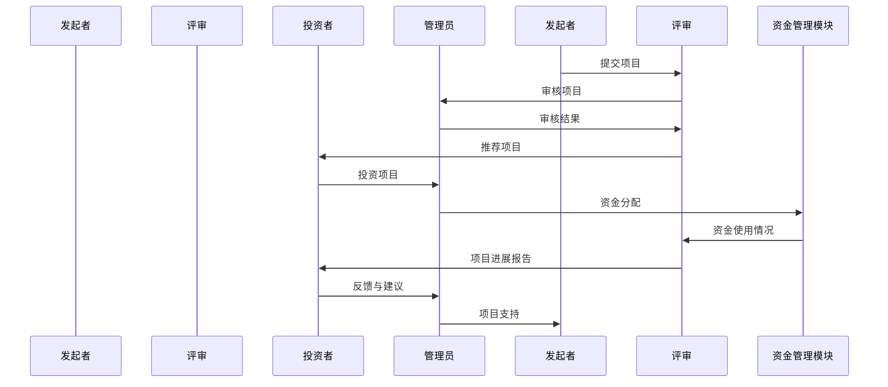

                 

# 意义众筹孵化器：价值观创新项目的加速器

## 关键词
- 意义众筹
- 孵化器
- 价值观创新项目
- 加速器
- 众筹机制
- 项目孵化

## 摘要
本文旨在探讨如何通过意义众筹孵化器来加速具有创新价值观的项目。我们将从意义众筹的概述开始，逐步深入到价值观创新项目的特点，意义众筹孵化器的功能与作用，以及构建、运营和管理孵化器的具体步骤。通过分析成功案例和未来发展趋势，我们还将探讨最佳实践和挑战应对策略，为价值观创新项目的成功孵化提供指导。

### 第一部分：意义众筹概述

#### 第1章：众筹与意义众筹

**1.1 众筹的定义与历史发展**

众筹，即大众筹资，是一种通过互联网平台向公众募集资金的方式。它起源于20世纪末，2009年Kickstarter平台的成立标志着众筹时代的到来。众筹的兴起改变了传统的融资方式，使得普通民众也能参与到项目的投资与推广中。

**1.2 意义众筹的核心概念**

意义众筹不仅仅是为了筹集资金，更是为了实现项目的价值观。它强调的是项目的意义与影响力，吸引那些认同项目价值观的参与者。意义众筹的核心在于通过众筹过程来传递和强化项目的价值主张。

**1.3 意义众筹与传统众筹的区别**

传统众筹主要关注资金筹集，而意义众筹则更注重价值观的传播与认同。意义众筹通常会涉及到社会责任、环境可持续性、文化传承等议题，而传统众筹则更倾向于商业项目的融资。

#### 第2章：价值观创新项目的特点

**2.1 创新价值观的界定**

创新价值观是指项目所倡导的新思想、新方法、新理念，它对社会、环境或行业具有积极的影响。创新价值观的项目往往能够解决现有问题或满足未被满足的需求。

**2.2 价值观创新项目的要素**

价值观创新项目通常包括以下几个要素：创新理念、社会影响、可持续性、用户参与和价值观认同。这些要素共同构成了项目的基础和核心。

**2.3 价值观创新项目的分类**

价值观创新项目可以按照不同的标准进行分类，如按领域可分为环保科技、社会公益、文化艺术等。每个领域的项目都有其独特的创新价值观。

#### 第3章：意义众筹孵化器的功能与作用

**3.1 孵化器的定义与类型**

孵化器是一种为初创企业提供支持的平台，帮助它们加速成长。意义众筹孵化器则是将众筹机制与孵化器功能相结合，为价值观创新项目提供全方位的支持。

**3.2 意义众筹孵化器的独特性**

意义众筹孵化器不仅提供资金支持，还注重项目的价值观传播和社区建设。它通过众筹过程来筛选和培养具有创新价值观的项目，从而实现项目的快速孵化。

**3.3 孵化器在意义众筹中的作用**

孵化器在意义众筹中起到桥梁作用，连接投资者、项目发起者和社区成员。它通过提供专业指导、资源整合和品牌推广，帮助项目成功孵化并实现社会价值。

### 第二部分：意义众筹孵化器的构建与实践

#### 第4章：构建意义众筹孵化器的步骤

**4.1 制定孵化器战略**

构建孵化器的第一步是明确战略目标，包括支持哪些类型的价值观创新项目、如何衡量项目成功等。战略目标将指导孵化器的运营和管理。

**4.2 确定目标项目**

孵化器需要根据战略目标筛选和确定支持的项目。筛选标准应包括项目的创新性、社会影响力、可持续性和价值观认同。

**4.3 建立众筹平台**

众筹平台是孵化器的核心组成部分，它需要具备良好的用户体验、安全的资金管理和高效的众筹流程。

#### 第5章：意义众筹孵化器的运营与管理

**5.1 众筹资金的分配与管理**

众筹资金的使用需要透明和规范。孵化器应制定详细的资金分配方案，确保资金用于项目的实际推进。

**5.2 项目监督与评估**

孵化器需要对支持的项目进行定期监督和评估，确保项目按照计划推进。监督和评估的结果将作为后续资金支持和管理决策的依据。

**5.3 孵化器团队建设**

孵化器团队是孵化器成功的关键。团队应包括项目经理、技术专家、市场推广人员和财务顾问等，各成员需具备相应的专业知识和技能。

#### 第6章：价值观创新项目的成功案例

**6.1 案例一：环保科技项目的众筹孵化**

本文将分析一个环保科技项目的众筹案例，探讨其在意义众筹孵化器中的成长过程和成功因素。

**6.2 案例二：社会公益项目的众筹孵化**

本文将介绍一个社会公益项目的众筹过程，分析其如何通过意义众筹孵化器实现了社会价值的最大化。

**6.3 案例三：文化艺术项目的众筹孵化**

本文将分析一个文化艺术项目的众筹案例，探讨其在意义众筹孵化器中的创新路径和价值体现。

#### 第7章：意义众筹孵化器的未来发展趋势

**7.1 市场趋势分析**

本文将分析当前市场趋势，预测意义众筹孵化器在未来几年的发展前景。

**7.2 技术创新的影响**

本文将探讨技术创新如何影响意义众筹孵化器的发展，以及孵化器如何利用新技术来提升项目孵化效果。

**7.3 政策法规的影响**

本文将分析政策法规对意义众筹孵化器的影响，讨论如何应对政策变化以促进孵化器的健康发展。

### 第三部分：意义众筹孵化器的最佳实践

#### 第8章：意义众筹孵化器的最佳实践

**8.1 项目筛选与评估标准**

本文将介绍意义众筹孵化器的项目筛选和评估标准，提供实用的参考模板。

**8.2 众筹推广策略**

本文将探讨如何制定有效的众筹推广策略，提高项目筹款成功率和公众参与度。

**8.3 项目成功后的后续支持**

本文将讨论项目成功后孵化器如何继续支持项目，确保项目持续发展并实现其价值观。

#### 第9章：意义众筹孵化器的挑战与应对策略

**9.1 风险管理策略**

本文将分析意义众筹孵化器面临的风险，并探讨如何制定有效的风险管理策略。

**9.2 资源整合与利用**

本文将介绍如何整合和利用各种资源，提高孵化器的运营效率和项目成功率。

**9.3 应对市场变化的策略**

本文将讨论如何应对市场变化，保持孵化器的竞争力和创新能力。

#### 第10章：意义众筹孵化器的未来展望

**10.1 发展前景**

本文将展望意义众筹孵化器的发展前景，讨论其可能的发展方向和机遇。

**10.2 未来发展趋势**

本文将分析未来发展趋势，探讨如何抓住机遇，推动意义众筹孵化器的发展。

**10.3 创新与挑战**

本文将讨论意义众筹孵化器在创新过程中可能面临的挑战，并探讨如何应对这些挑战。

### 总结

本文通过对意义众筹孵化器的全面探讨，为价值观创新项目的成功孵化提供了理论和实践指导。随着市场的不断变化和发展，意义众筹孵化器将在未来发挥更加重要的作用，为推动社会进步和可持续发展贡献力量。

### 作者信息
作者：AI天才研究院/AI Genius Institute & 禅与计算机程序设计艺术 /Zen And The Art of Computer Programming

----------------------------------------------------------------

## 引言

在当今快速变化的时代，创新和价值观的重要性日益凸显。越来越多的项目不仅仅追求商业上的成功，更注重社会价值和影响力的实现。意义众筹孵化器作为一种新兴的商业模式，它通过结合众筹机制和孵化器功能，为价值观创新项目提供了强大的支持平台。本文将深入探讨意义众筹孵化器的工作原理、构建步骤、运营策略以及其在未来发展趋势中的作用。通过分析成功案例，我们希望能够为读者提供一套完整且实用的指导，帮助价值观创新项目在意义众筹孵化器的助力下实现成功孵化。

### 第1章：众筹与意义众筹

#### 1.1 众筹的定义与历史发展

众筹，作为一种新兴的融资模式，其核心思想是通过向大量的小额投资者筹集资金，来支持一个项目或创意。众筹的起源可以追溯到20世纪末，当时一些艺术家和音乐人开始通过互联网向公众出售自己的艺术作品和音乐专辑，从而获得资金支持。这种模式很快引起了广泛关注，并在2009年达到了一个重要的里程碑——Kickstarter平台的成立。

Kickstarter平台的创立标志着众筹正式进入了大众视野。它为创意项目提供了一个展示和筹集资金的平台，让项目发起者能够直接与潜在投资者建立联系。这一创新模式迅速在全球范围内得到推广，并催生了许多类似的众筹平台，如Indiegogo、GoFundMe等。

随着互联网技术的不断发展和普及，众筹逐渐从艺术、音乐等领域扩展到科技、医疗、社会公益等多个领域。众筹不仅改变了传统的融资方式，也为创业者和小型企业提供了新的资金来源。此外，众筹平台的透明性和参与性也使其成为了一种有效的市场调研工具，帮助项目发起者了解公众对项目的兴趣和反馈。

#### 1.2 意义众筹的核心概念

意义众筹（Impact Crowdfunding）是众筹的一种特殊形式，它不仅仅关注资金的筹集，更强调项目的价值和社会影响力。意义众筹的核心概念在于，通过众筹过程来传递和强化项目的价值观，吸引那些认同项目理念的参与者。

意义众筹的主要特点包括：

1. **价值观驱动**：意义众筹的项目通常具有明确的价值观，这些价值观可能涉及环境保护、社会公益、文化传承、技术创新等领域。项目的成功不仅仅取决于资金的筹集，更取决于其对社会和环境的积极影响。

2. **社区参与**：意义众筹强调社区参与和互动。项目发起者通过平台与支持者建立联系，分享项目的进展和成果，从而形成一种紧密的社区关系。

3. **透明度**：意义众筹要求项目的资金使用和进展情况对公众透明。这种透明度不仅增加了投资者的信任，也促进了项目的可持续发展。

4. **多样性**：意义众筹覆盖了多个领域，包括但不限于环保科技、社会公益、文化艺术、科技创新等。这种多样性使得更多的项目有机会得到资金支持和社会关注。

#### 1.3 意义众筹与传统众筹的区别

传统众筹（Traditional Crowdfunding）和意义众筹（Impact Crowdfunding）在许多方面有着显著的区别。以下是两者的一些主要区别：

1. **目标**：
   - **传统众筹**：主要目标是筹集资金，用于项目的开发或扩展。
   - **意义众筹**：除了筹集资金，更注重项目的价值观和社会影响力。

2. **参与者**：
   - **传统众筹**：参与者通常是普通投资者，他们可能对项目的技术或理念不太了解。
   - **意义众筹**：参与者通常是对项目价值观有强烈认同的个人或团体，他们更关注项目的长远影响。

3. **透明度**：
   - **传统众筹**：虽然资金使用情况需要透明，但通常更注重回报机制的实现。
   - **意义众筹**：透明度是核心要求，项目的资金使用和进展情况需要定期向公众报告。

4. **项目类型**：
   - **传统众筹**：项目类型多样，包括商业项目、艺术项目等。
   - **意义众筹**：通常聚焦于具有明显社会价值的项目，如环保科技、社会公益等。

通过上述分析，我们可以看出，意义众筹与传统众筹在目标、参与者、透明度和项目类型等方面有着明显的差异。意义众筹更加注重项目的价值观和社会影响力，这使得它成为一种更加综合和有深度的众筹形式。

### 第2章：价值观创新项目的特点

#### 2.1 创新价值观的界定

创新价值观是指项目所倡导的新思想、新方法、新理念，它对社会、环境或行业具有积极的影响。创新价值观不仅仅是技术上的突破，更是一种对现有问题或需求的新解决方案的提出。它强调的是项目的核心价值和长远影响，而不仅仅是短期的商业成功。

创新价值观的界定需要考虑以下几个方面：

1. **社会价值**：项目是否能够解决社会问题或满足社会需求，是否能够改善人们的生活质量。

2. **环境可持续性**：项目是否关注环境保护和资源可持续利用，是否符合绿色发展的理念。

3. **技术创新**：项目是否采用了先进的技术或方法，是否能够推动科技进步。

4. **用户参与**：项目是否鼓励用户的参与和反馈，是否能够形成积极的社区关系。

5. **价值观认同**：项目是否符合发起者和支持者的价值观，是否能够得到广泛的认同。

#### 2.2 价值观创新项目的要素

价值观创新项目通常包含以下几个核心要素：

1. **创新理念**：这是项目的核心，代表了项目的新思想、新方法或新方案。创新理念需要具有前瞻性，能够解决现有问题或创造新的价值。

2. **社会影响**：项目的社会影响是其价值的重要体现。一个价值观创新项目需要明确其目标群体，以及如何通过项目实现社会效益。

3. **可持续性**：项目的可持续性是其长期成功的关键。它需要考虑项目的经济、社会和环境三个方面，确保项目能够在未来持续发展。

4. **用户参与**：用户的参与和反馈是项目成功的重要保障。通过用户的参与，项目能够更好地了解用户需求，调整项目方向，提高用户满意度。

5. **价值观认同**：价值观认同是项目成功的重要基础。项目的价值观需要与发起者、支持者和用户的价值观相一致，才能获得广泛的支持和认同。

#### 2.3 价值观创新项目的分类

价值观创新项目可以按照不同的标准进行分类，以下是一些常见的分类方式：

1. **按领域分类**：
   - **环保科技**：关注环境保护和可持续发展的技术项目。
   - **社会公益**：旨在解决社会问题，提高社会福利的项目。
   - **文化艺术**：涉及文化传承和创新的艺术项目。
   - **科技创新**：采用先进技术，推动行业发展的项目。

2. **按目标分类**：
   - **社会目标**：以解决社会问题为主要目标的项目。
   - **经济目标**：以实现商业成功为主要目标的项目。
   - **环境目标**：以保护环境为主要目标的项目。

3. **按创新程度分类**：
   - **突破性创新**：具有颠覆性，能够改变行业规则的项目。
   - **渐进性创新**：在现有基础上进行改进，提高效率或性能的项目。

每种分类方式都有其特定的关注点和适用场景，但无论哪种分类，价值观创新项目都需要在创新、社会影响、可持续性和用户参与等方面具备一定的特点。

通过上述分析，我们可以看出，价值观创新项目不仅仅是技术上的创新，更是一种对现有问题或需求的新解决方案的提出。它们强调的是项目的核心价值和长远影响，而不仅仅是短期的商业成功。这些项目需要具备创新理念、社会影响、可持续性、用户参与和价值观认同等多个要素，才能在众筹平台上获得广泛的支持和认同。

### 第3章：意义众筹孵化器的功能与作用

#### 3.1 孵化器的定义与类型

孵化器是一种为初创企业提供支持的平台，帮助它们加速成长。孵化器的主要功能包括提供办公空间、资金支持、专业指导、市场推广等。孵化器的类型多种多样，包括以下几种：

1. **独立孵化器**：由私人企业或非营利组织运营的孵化器，通常专注于特定的领域或行业。

2. **大学孵化器**：依托于大学资源建立的孵化器，通常与大学的研究机构和实验室紧密合作，为初创企业提供技术和人才支持。

3. **政府孵化器**：由政府部门设立或支持的孵化器，旨在推动创新创业，促进经济增长。

4. **联合办公空间**：提供共享办公空间的孵化器，为初创企业和自由职业者提供工作环境和交流平台。

#### 3.2 意义众筹孵化器的独特性

意义众筹孵化器是将众筹机制与孵化器功能相结合的一种新型孵化器。它具有以下几个独特性：

1. **价值观驱动**：意义众筹孵化器注重项目的价值观和社会影响力，而不仅仅是商业成功。这种价值观驱动使得孵化器能够吸引那些关注社会问题的创业者。

2. **社区建设**：意义众筹孵化器通过众筹过程和社区互动，建立起一个紧密的社区关系。这种社区关系有助于项目发起者与支持者之间的沟通和合作。

3. **透明度与信任**：意义众筹孵化器要求项目的资金使用和进展情况对公众透明，这种透明度增加了投资者的信任，促进了项目的可持续发展。

4. **多样化支持**：意义众筹孵化器不仅提供资金支持，还提供专业指导、市场推广、资源整合等多方面的支持，帮助项目在各个阶段实现成功孵化。

#### 3.3 孵化器在意义众筹中的作用

孵化器在意义众筹中扮演着重要的角色，它通过以下几种方式来支持价值观创新项目的孵化：

1. **项目筛选与评估**：孵化器通过严格的筛选和评估机制，确保支持的项目具有创新性和社会影响力。孵化器通常拥有专业的评审团队，能够提供有针对性的建议和指导。

2. **资金支持**：孵化器通过众筹平台筹集资金，为项目提供资金支持。这种资金支持不仅用于项目的开发，还包括市场推广、人力资源等方面的支出。

3. **专业指导**：孵化器为项目提供专业指导，包括技术指导、市场分析、战略规划等。这些指导帮助项目发起者更好地理解市场需求，制定可行的商业计划。

4. **资源整合**：孵化器通过整合各种资源，如合作伙伴、投资者、专业机构等，为项目提供全方位的支持。这种资源整合有助于项目在各个阶段获得所需的资源和帮助。

5. **市场推广**：孵化器通过多种渠道进行市场推广，提高项目的知名度和影响力。市场推广包括线上宣传、媒体曝光、行业活动等，有助于吸引更多的支持者和投资者。

6. **社区建设**：孵化器通过社区互动和活动，建立起一个紧密的社区关系。这种社区关系有助于项目发起者与支持者之间的沟通和合作，形成良好的社区氛围。

通过上述分析，我们可以看出，意义众筹孵化器在价值观创新项目的孵化过程中发挥着关键作用。它不仅提供了资金支持，还提供了专业指导、资源整合和市场推广等多方面的支持，为项目成功孵化提供了强有力的保障。

### 第4章：构建意义众筹孵化器的步骤

#### 4.1 制定孵化器战略

构建意义众筹孵化器的第一步是制定明确的战略。战略规划是孵化器长期发展的指南，它需要明确孵化器的目标、定位、核心价值和发展方向。以下是制定孵化器战略的关键步骤：

1. **确定目标**：孵化器需要明确其目标，包括支持哪些类型的价值观创新项目、希望达到的社会影响力等。目标应具体、可行且具有挑战性。

2. **市场调研**：通过市场调研，了解当前市场的需求和趋势，分析目标市场的竞争格局和潜在机会。市场调研可以帮助孵化器确定项目的方向和定位。

3. **价值观定位**：孵化器需要明确其价值观，这将是孵化器区别于其他孵化器的重要特征。价值观定位应与孵化器的目标和社会影响力相一致。

4. **战略规划**：根据目标和价值观定位，制定具体的战略规划，包括项目的筛选标准、资金分配策略、支持措施等。战略规划应具有可操作性和可衡量性。

5. **资源整合**：明确孵化器所需的资源，包括资金、人才、合作伙伴等。资源整合是战略规划的重要环节，它需要孵化器与各方建立良好的合作关系。

6. **风险评估**：对孵化器可能面临的风险进行评估，并制定相应的应对策略。风险评估有助于孵化器在运营过程中保持稳定和可持续发展。

#### 4.2 确定目标项目

确定目标项目是构建意义众筹孵化器的关键步骤。孵化器需要根据战略规划，筛选和确定支持的项目。以下是确定目标项目的几个关键点：

1. **项目筛选标准**：孵化器应制定明确的筛选标准，包括创新性、社会影响力、可持续性、用户参与和价值观认同等。筛选标准应与孵化器的价值观定位和目标相一致。

2. **项目类型**：孵化器需要根据战略规划，确定支持的项目类型。这些项目类型可以包括环保科技、社会公益、文化艺术、科技创新等。

3. **项目评估**：对筛选出的项目进行详细评估，包括技术可行性、市场前景、团队能力等。评估可以采用专家评审、问卷调查、数据分析等方法。

4. **项目优先级**：根据评估结果，确定项目的优先级。孵化器应优先支持那些具有高潜力、高社会影响力和高成功概率的项目。

5. **项目对接**：与确定支持的项目建立联系，了解项目需求和支持方案。孵化器应提供针对性的支持，帮助项目顺利进行。

#### 4.3 建立众筹平台

建立众筹平台是意义众筹孵化器的核心组成部分。众筹平台不仅为项目提供了筹集资金的渠道，还搭建了项目与投资者之间的沟通桥梁。以下是建立众筹平台的关键步骤：

1. **平台选择**：选择合适的众筹平台，如Kickstarter、Indiegogo、GoFundMe等。选择平台时需要考虑平台的用户基础、众筹成功率和用户体验等因素。

2. **平台定制**：根据孵化器的定位和需求，对众筹平台进行定制化设置。定制化设置包括项目展示界面、资金管理、用户互动等。

3. **平台推广**：通过多种渠道进行平台推广，包括社交媒体、媒体曝光、行业活动等。平台推广有助于提高项目的知名度和参与度。

4. **用户教育**：向用户介绍众筹平台的使用方法和注意事项，提高用户的参与度和信任度。用户教育可以通过线上教程、FAQ、客服支持等方式进行。

5. **资金管理**：建立完善的资金管理机制，确保资金的安全和使用透明。资金管理应包括众筹资金的收取、分配和监督等环节。

6. **风险管理**：制定风险控制措施，应对众筹过程中的各种风险，如资金挪用、项目失败等。

通过以上步骤，意义众筹孵化器可以构建一个完善的众筹平台，为价值观创新项目的孵化提供强有力的支持。众筹平台不仅为项目提供了资金支持，还搭建了一个社区互动的平台，促进了项目与投资者之间的紧密联系。这种互动和信任关系的建立，有助于项目的成功孵化和可持续发展。

### 第5章：意义众筹孵化器的运营与管理

#### 5.1 众筹资金的分配与管理

众筹资金的分配与管理是意义众筹孵化器运营的核心环节，它直接关系到项目的成功与否。以下是众筹资金分配与管理的几个关键步骤：

1. **资金预算**：在项目启动阶段，孵化器需要对项目的资金需求进行详细预算。预算应包括项目的开发成本、运营成本、市场推广费用等。预算的制定需要基于项目计划和市场调研结果。

2. **资金分配方案**：孵化器应根据项目计划和预算，制定详细的资金分配方案。方案应明确每个资金用途的具体金额和使用时间。资金分配方案应透明，并接受公众监督。

3. **资金管理**：孵化器应建立完善的资金管理体系，包括资金收取、支付、记录和审计等环节。资金管理应确保资金的安全和使用透明，防止资金挪用和浪费。

4. **资金监督**：孵化器应对项目的资金使用情况进行定期监督和评估。监督可以通过内部审计、项目报告、公开透明的方式实现。监督结果应公开，接受公众的监督和反馈。

5. **风险管理**：孵化器应制定风险管理措施，应对众筹过程中可能出现的资金风险。风险管理措施应包括资金来源的多样化、紧急备用资金、风险评估和应对策略等。

#### 5.2 项目监督与评估

项目监督与评估是确保项目按计划推进和实现预期目标的重要手段。以下是项目监督与评估的几个关键步骤：

1. **项目监控**：孵化器应建立项目监控体系，实时跟踪项目的进展情况。监控可以包括进度报告、关键节点检查、项目成员绩效评估等。

2. **定期评估**：孵化器应定期对项目进行评估，包括项目的进度、质量、资金使用情况和成果等。评估结果应作为项目后续支持和管理决策的依据。

3. **绩效反馈**：孵化器应及时向项目团队和投资者反馈评估结果，包括项目的进展情况、存在的问题和改进措施等。绩效反馈有助于项目团队及时调整计划，提高项目成功率。

4. **改进措施**：根据评估结果，孵化器应制定改进措施，包括优化项目计划、调整资金使用、加强团队建设等。改进措施应具有针对性和可操作性。

5. **风险预警**：孵化器应建立风险预警机制，及时发现和应对项目风险。风险预警可以通过数据监控、专家评审、定期报告等方式实现。

#### 5.3 孵化器团队建设

孵化器团队是孵化器运营和管理的关键，它需要具备专业知识和技能，以确保项目的顺利推进。以下是孵化器团队建设的几个关键步骤：

1. **团队组建**：孵化器应根据项目需求，组建专业团队。团队应包括项目经理、技术专家、市场推广人员、财务顾问等，各成员需具备相应的专业知识和技能。

2. **能力提升**：孵化器应定期对团队成员进行培训和能力提升，包括技术培训、管理培训、市场推广培训等。能力提升有助于团队成员更好地完成工作任务。

3. **激励机制**：孵化器应建立激励机制，鼓励团队成员积极工作，提高工作效率和项目成功率。激励机制可以包括绩效奖金、股权激励、荣誉表彰等。

4. **团队协作**：孵化器应促进团队协作，建立良好的沟通和协作机制。团队协作有助于提高项目效率，减少冲突和误解。

5. **团队文化**：孵化器应建立积极的团队文化，鼓励创新、协作和共享。团队文化有助于增强团队的凝聚力和归属感。

通过以上步骤，意义众筹孵化器可以建立一支高效、专业的团队，为价值观创新项目的成功孵化提供有力支持。孵化器团队的建设和运营是孵化器成功的关键，它需要不断优化和提升，以适应市场和项目发展的需求。

### 第6章：价值观创新项目的成功案例

#### 6.1 案例一：环保科技项目的众筹孵化

**项目背景**：

该环保科技项目旨在开发一种新型太阳能设备，以替代传统的化石燃料，从而减少碳排放和环境污染。项目发起者是某知名大学的科研团队，他们在进行多年研究后，决定通过众筹平台筹集资金，以实现该技术的商业化应用。

**众筹过程**：

项目在Kickstarter平台上发布，项目页面详细介绍了技术原理、市场前景和预期的社会影响。项目吸引了大量关注，并在短时间内筹集到了超出预期目标的资金。众筹过程包括以下几个关键环节：

1. **项目展示**：项目通过视频、图片和文字介绍，展示了技术的创新点、应用场景和预期效果。
2. **投资者激励**：项目为投资者提供了多种奖励，包括限量版产品、早期使用权等，以吸引投资者的参与。
3. **社区互动**：项目通过社交媒体和论坛与投资者保持互动，回答问题、分享进展，增强了投资者的参与感和信任度。
4. **资金管理**：项目对筹集到的资金进行了详细的预算和分配，确保资金用于项目的实际推进。

**项目进展**：

在众筹成功后，项目团队迅速开展研发工作，并取得了重要进展。以下是项目的关键进展：

1. **技术突破**：项目团队在研发过程中取得了多项技术突破，包括提高了太阳能转化效率、降低了设备成本等。
2. **市场拓展**：项目团队积极与潜在客户和合作伙伴进行沟通，拓展了市场渠道，并成功签订了几份商业合作协议。
3. **社会影响**：项目通过减少碳排放和环境污染，产生了显著的社会效益。项目还积极参与社会公益活动，推广环保理念。

**成功因素**：

1. **技术创新**：项目的技术创新点吸引了大量投资者的关注，增强了项目的吸引力。
2. **社会价值**：项目强调环保理念，符合当前社会发展的趋势，得到了广泛认同。
3. **社区互动**：项目通过社区互动，建立了与投资者的紧密联系，增强了信任和参与度。
4. **资金管理**：项目的资金管理透明、规范，赢得了投资者的信任和支持。

#### 6.2 案例二：社会公益项目的众筹孵化

**项目背景**：

该社会公益项目旨在帮助偏远地区的孩子获得优质教育资源。项目发起者是某公益组织，他们在长期扶贫工作中发现，教育是改变贫困的关键。因此，他们决定通过众筹平台筹集资金，建立一所远程教育中心。

**众筹过程**：

项目在GoFundMe平台上发布，项目页面详细介绍了教育中心的规划、预期效果和筹资目标。项目吸引了大量捐赠者，并在较短时间内筹集到了足够的资金。众筹过程包括以下几个关键环节：

1. **项目展示**：项目通过视频、图片和文字，展示了教育中心的建设计划、预期效果和受助对象。
2. **捐赠激励**：项目为捐赠者提供了多种感谢方式，包括电子感谢信、实体纪念品等，以激发捐赠者的热情。
3. **社区互动**：项目与捐赠者保持密切互动，定期分享建设进展和受助孩子的情况，增强了捐赠者的参与感和认同感。
4. **资金管理**：项目对筹集到的资金进行了详细的预算和分配，确保资金用于教育中心的建设和运营。

**项目进展**：

在众筹成功后，项目团队迅速开始建设教育中心，并取得了以下关键进展：

1. **设施建设**：项目团队在偏远地区建立了远程教育中心，配备了现代化的教学设备和网络设施。
2. **师资配备**：项目团队聘请了当地优秀教师，并进行了专业的培训，确保教育质量。
3. **学生招募**：项目团队通过宣传和组织活动，吸引了大量学生参与，建立了良好的教育生态。
4. **社会影响**：项目通过提供优质教育资源，帮助偏远地区的孩子改变了命运，得到了社会各界的认可和支持。

**成功因素**：

1. **社会价值**：项目强调教育公平和社会正义，符合社会发展的趋势，得到了广泛认同。
2. **透明度**：项目的资金使用和进展情况对公众透明，赢得了捐赠者的信任和支持。
3. **社区互动**：项目通过社区互动，建立了与捐赠者的紧密联系，增强了参与感和认同感。
4. **执行能力**：项目团队具备强大的执行能力和专业知识，确保项目顺利推进和达成预期目标。

#### 6.3 案例三：文化艺术项目的众筹孵化

**项目背景**：

该文化艺术项目旨在创作一部具有深远文化意义的纪录片，记录中国非物质文化遗产的传承与发展。项目发起者是某文化机构，他们希望通过众筹平台筹集资金，完成这部纪录片的制作。

**众筹过程**：

项目在Kickstarter平台上发布，项目页面详细介绍了纪录片的主题、拍摄计划和预期效果。项目吸引了大量文化爱好者的关注，并在较短时间内筹集到了足够的资金。众筹过程包括以下几个关键环节：

1. **项目展示**：项目通过视频、图片和文字，展示了纪录片的创意理念、拍摄地点和拍摄团队。
2. **捐赠激励**：项目为捐赠者提供了多种文化体验，包括纪录片的首映式、幕后花絮等，以激发捐赠者的兴趣。
3. **社区互动**：项目与文化爱好者保持互动，分享拍摄进展和纪录片的故事，增强了捐赠者的参与感和认同感。
4. **资金管理**：项目对筹集到的资金进行了详细的预算和分配，确保资金用于纪录片的制作和后期宣传。

**项目进展**：

在众筹成功后，项目团队开始进行纪录片制作，并取得了以下关键进展：

1. **拍摄完成**：项目团队在多个地区进行了实地拍摄，成功记录了丰富的非物质文化遗产素材。
2. **后期制作**：项目团队进行了精心的后期制作，包括剪辑、配音、配乐等，确保纪录片的制作质量。
3. **首映及推广**：项目团队在多个城市举行了首映式，并通过媒体和社交媒体进行广泛推广，吸引了大量观众。
4. **社会影响**：纪录片通过讲述非物质文化遗产的故事，增强了公众对传统文化的认识和关注，推动了文化传承和保护。

**成功因素**：

1. **文化价值**：项目聚焦于中国非物质文化遗产，具有较高的文化价值，吸引了大量文化爱好者的关注。
2. **创新形式**：项目采用纪录片的形式，生动展示了传统文化的魅力，吸引了年轻观众的参与。
3. **社区互动**：项目通过社区互动，建立了与捐赠者和观众的紧密联系，增强了参与感和认同感。
4. **资金管理**：项目的资金管理透明、规范，赢得了捐赠者的信任和支持。

通过以上三个案例，我们可以看到，价值观创新项目通过意义众筹孵化器的支持，取得了显著的成果。这些项目不仅在资金上获得了成功，更在社会价值和影响力上取得了重大突破。这些案例为我们提供了宝贵的经验和启示，展示了意义众筹孵化器在价值观创新项目孵化中的重要作用。

### 第7章：意义众筹孵化器的未来发展趋势

#### 7.1 市场趋势分析

随着社会和经济的不断发展，意义众筹孵化器在市场中的地位和作用日益凸显。以下是对未来市场趋势的分析：

1. **市场规模扩大**：随着互联网的普及和众筹平台的不断完善，意义众筹孵化器的市场规模将持续扩大。更多的创业者和小型企业将选择通过意义众筹孵化器来寻求资金和支持，以实现项目的成功孵化。

2. **领域多元化**：意义众筹孵化器的领域将不断多元化，不仅涵盖环保科技、社会公益、文化艺术等传统领域，还将扩展到科技创新、医疗健康、教育等领域。这种多元化将有助于孵化器更好地满足不同领域项目的需求。

3. **技术创新**：未来，意义众筹孵化器将更加注重技术创新的应用。通过大数据、人工智能、区块链等技术的应用，孵化器将提高项目筛选、风险评估、资金管理和运营效率，为项目提供更加精准和高效的支持。

4. **政策支持**：政府将加大对意义众筹孵化器的支持力度，通过政策引导、资金扶持和税收优惠等手段，鼓励更多的创业者和企业参与意义众筹孵化器，推动社会创新和经济发展。

5. **国际化发展**：随着全球化的发展，意义众筹孵化器将逐步实现国际化。孵化器将与其他国家的孵化器建立合作关系，共同推动国际间的创新合作和资源共享，为全球创业者提供更广阔的发展平台。

#### 7.2 技术创新的影响

技术创新是意义众筹孵化器未来发展的关键驱动力。以下是对技术创新影响的分析：

1. **大数据分析**：通过大数据分析技术，孵化器可以更准确地了解市场趋势、用户需求和项目风险，从而优化项目筛选和风险评估机制。大数据分析有助于提高孵化器的决策效率和项目成功率。

2. **人工智能**：人工智能技术在意义众筹孵化器中的应用将更加广泛。例如，通过人工智能算法，孵化器可以自动化项目评估、投资建议和风险管理，提高运营效率和准确性。人工智能还可以帮助孵化器更好地理解用户需求，提供个性化的服务和支持。

3. **区块链技术**：区块链技术将为意义众筹孵化器带来透明度和信任。通过区块链，孵化器可以实现资金的透明管理、智能合约的自动执行和可信的交易记录，提高资金使用效率和安全性。

4. **虚拟现实（VR）与增强现实（AR）**：虚拟现实和增强现实技术将使意义众筹孵化器的项目展示和用户体验更加生动和直观。通过VR和AR技术，项目发起者可以更加生动地展示项目的创意和成果，吸引更多投资者的关注和支持。

5. **物联网（IoT）**：物联网技术将使意义众筹孵化器的支持手段更加多样化。通过物联网，孵化器可以实时监控项目的进展情况，提供远程技术支持和咨询服务，提高项目的执行效率和质量。

#### 7.3 政策法规的影响

政策法规对意义众筹孵化器的发展具有重要影响。以下是对政策法规影响的分析：

1. **监管政策**：政府将加强对意义众筹孵化器的监管，确保众筹活动的合法性和透明度。监管政策将包括资金管理、信息披露、投资者保护等方面，以防止欺诈行为和市场乱象。

2. **税收优惠**：政府将通过税收优惠等政策，鼓励更多的投资者参与意义众筹孵化器。税收优惠可以降低投资者的税务负担，提高他们的投资积极性。

3. **资金扶持**：政府将加大对意义众筹孵化器的资金扶持力度，通过财政拨款、创业基金等形式，支持孵化器的建设和运营。资金扶持有助于孵化器提高项目筛选和风险评估能力，为项目提供更加专业的支持。

4. **法律法规完善**：随着意义众筹孵化器的发展，法律法规将逐步完善。例如，涉及知识产权保护、数据隐私保护等方面的法律法规将得到进一步修订和完善，为意义众筹孵化器提供更加明确的法律框架。

5. **国际合作**：政府将推动国际间的合作，通过签订协议、开展合作项目等方式，推动意义众筹孵化器的国际化发展。国际合作将有助于孵化器吸收先进经验和技术，提高自身的竞争力和影响力。

通过以上分析，我们可以看出，意义众筹孵化器在未来发展中将面临巨大的机遇和挑战。市场趋势、技术创新和政策法规都将对孵化器的发展产生重要影响。孵化器需要不断适应市场变化，提升自身能力，以实现可持续发展。

### 第8章：意义众筹孵化器的最佳实践

#### 8.1 项目筛选与评估标准

在意义众筹孵化器的运营过程中，项目筛选与评估是至关重要的环节。一个有效的筛选与评估标准不仅能够确保孵化器支持的项目具有创新性和社会影响力，还能提高项目的成功率和公众信任度。以下是制定项目筛选与评估标准的最佳实践：

1. **创新性**：孵化器应重点关注项目的创新性，包括技术、商业模式、解决方案等。创新性项目往往能够解决现有问题或满足未被满足的需求，具有较大的市场潜力和社会价值。评估创新性时，可以考虑项目的独特性、突破性以及技术创新的难度和可行性。

2. **社会影响力**：孵化器应评估项目的潜在社会影响力，包括对环境保护、社会公益、文化传承等方面的贡献。社会影响力越大的项目，越能获得公众的认同和支持。评估社会影响力时，可以考虑项目的目标群体、受益范围以及长期影响。

3. **可持续性**：孵化器应关注项目的可持续性，包括经济、社会和环境三个方面。可持续性项目不仅能够在短期内取得成果，还能在长期内持续发展，实现其价值。评估可持续性时，可以考虑项目的商业模式、资源利用、风险管理等。

4. **用户参与**：孵化器应鼓励用户参与项目，建立良好的用户关系。用户参与不仅有助于项目的市场推广和反馈收集，还能增强用户的认同感和忠诚度。评估用户参与时，可以考虑项目的互动机制、用户反馈渠道和用户忠诚度。

5. **价值观认同**：孵化器应确保项目符合发起者、支持者和公众的价值观。价值观认同是项目成功的重要基础，能够增强项目的凝聚力和影响力。评估价值观认同时，可以考虑项目的理念、使命和社会责任。

6. **团队能力**：孵化器应评估项目团队的组成和能力。团队能力是项目成功的重要保障，包括技术能力、管理能力、市场推广能力等。评估团队能力时，可以考虑团队成员的背景、经验和项目团队的合作情况。

7. **市场前景**：孵化器应关注项目的市场前景，包括市场需求、竞争格局、市场进入策略等。市场前景好的项目更容易获得投资者的青睐，也更容易实现商业化和规模化。

通过上述标准，孵化器可以制定一个全面、科学的项目筛选与评估体系，确保支持的项目具有创新性、社会影响力、可持续性、用户参与和价值观认同。这不仅有助于提高项目的成功率，还能增强公众对孵化器的信任和认同。

#### 8.2 众筹推广策略

众筹推广是意义众筹孵化器成功的关键之一。一个有效的众筹推广策略不仅能够提高项目的知名度和参与度，还能吸引更多的投资者和支持者。以下是制定众筹推广策略的最佳实践：

1. **确定目标受众**：在众筹推广前，孵化器应明确项目的目标受众，包括潜在投资者、合作伙伴、目标用户等。了解目标受众的需求和兴趣，有助于制定更具针对性的推广策略。

2. **社交媒体营销**：社交媒体是众筹推广的重要渠道。孵化器应充分利用各类社交媒体平台，如Facebook、Twitter、Instagram、LinkedIn等，发布项目信息、互动话题、用户故事等，吸引目标受众的关注和参与。

3. **内容营销**：内容营销是提高项目知名度和吸引力的有效手段。孵化器应制作高质量的内容，包括项目介绍视频、技术解读文章、用户访谈等，通过多种形式展示项目的创新性和社会价值。

4. **媒体曝光**：通过媒体报道和公关活动，提高项目的曝光度和公信力。孵化器可以与媒体、行业专家、意见领袖等建立合作关系，通过新闻发布会、媒体专访、行业报告等方式进行推广。

5. **社区互动**：建立与投资者的紧密互动，增强社区的凝聚力和参与感。孵化器可以通过众筹平台、社交媒体、线上论坛等方式，与投资者进行实时交流，回答问题、分享进展、收集反馈，提高用户的参与度和忠诚度。

6. **合作伙伴推广**：与合作伙伴共同推广项目，扩大项目的影响范围。孵化器可以与行业机构、企业、公益组织等建立合作关系，通过联合推广、资源共享等方式，提高项目的知名度和参与度。

7. **奖励机制**：设立奖励机制，激励投资者和支持者的参与。奖励可以包括限量版产品、早期使用权、签名纪念品等，提高投资者的热情和参与度。

通过上述策略，孵化器可以制定一个全面、高效的众筹推广方案，提高项目的知名度、参与度和成功率。有效的推广策略不仅能够吸引更多的投资者和支持者，还能增强项目的社区氛围和影响力。

#### 8.3 项目成功后的后续支持

众筹成功只是项目孵化过程中的一个重要里程碑，后续的支持和跟进同样关键。有效的后续支持能够确保项目顺利推进，实现其预期目标和价值。以下是项目成功后的后续支持最佳实践：

1. **资金使用监督**：众筹成功后，孵化器应继续监督项目的资金使用情况，确保资金用于项目的实际推进和目标实现。孵化器可以通过定期审计、项目报告等方式，监督项目的资金管理。

2. **进度跟踪**：孵化器应建立项目进度跟踪机制，实时了解项目的进展情况。进度跟踪可以通过项目管理工具、定期会议、进度报告等方式实现，确保项目按计划推进。

3. **风险管理**：项目在后续推进过程中可能面临各种风险，如技术风险、市场风险、运营风险等。孵化器应制定风险管理策略，及时识别和应对潜在风险，确保项目的顺利推进。

4. **技术支持**：项目在推进过程中可能需要技术支持和咨询服务。孵化器可以提供技术支持团队，为项目提供专业的技术指导和解决方案，帮助项目解决技术难题。

5. **市场推广**：孵化器应继续支持项目的市场推广，提高项目的知名度和用户参与度。市场推广可以包括线上广告、媒体曝光、社区互动等方式，吸引更多的用户和支持者。

6. **用户反馈**：及时收集用户的反馈和建议，不断优化项目。用户反馈是项目改进的重要依据，有助于项目更好地满足用户需求，提高用户体验。

7. **社区建设**：继续加强社区建设，建立与用户和支持者的紧密联系。通过社区互动、用户活动、线上论坛等方式，增强社区的凝聚力和参与感。

通过上述后续支持措施，孵化器可以确保项目在众筹成功后继续顺利推进，实现其预期目标和价值。有效的后续支持不仅能够提高项目的成功率，还能增强用户和支持者的信任和满意度，为项目的长期发展奠定基础。

### 第9章：意义众筹孵化器的挑战与应对策略

#### 9.1 风险管理策略

意义众筹孵化器在运营过程中面临着多种风险，包括市场风险、技术风险、运营风险和资金风险等。有效的风险管理策略是确保孵化器稳定运行和项目成功孵化的重要保障。以下是针对各种风险的具体应对策略：

1. **市场风险**：
   - **市场调研**：在项目筛选和评估阶段，进行充分的市场调研，了解市场需求、竞争格局和潜在机会，降低市场不确定性。
   - **多元化投资**：通过多元化的投资组合，分散市场风险。支持多个领域的项目，减少单一市场波动对整个孵化器的影响。
   - **灵活调整**：根据市场变化，及时调整项目计划和策略，确保项目能够适应市场变化。

2. **技术风险**：
   - **技术评估**：在项目筛选阶段，对项目的技术可行性进行详细评估，确保项目具备实现的技术基础。
   - **技术创新支持**：为项目提供技术支持和咨询服务，帮助项目团队解决技术难题，提高项目成功率。
   - **持续跟进**：对项目的技术进展进行持续跟进，及时发现和解决技术问题，确保项目按计划推进。

3. **运营风险**：
   - **规范管理**：建立规范的管理制度和流程，确保项目的运营透明、高效。
   - **团队建设**：加强孵化器团队的建设，提高团队的专业能力和协作效率，确保项目顺利推进。
   - **应急计划**：制定应急预案，应对可能的运营风险，确保项目在突发情况下能够迅速应对。

4. **资金风险**：
   - **资金预算**：在项目启动阶段，制定详细的资金预算和分配方案，确保资金使用的透明和合理。
   - **资金监控**：建立资金监控机制，实时跟踪资金的使用情况，防止资金挪用和浪费。
   - **风险准备金**：设立风险准备金，用于应对项目过程中可能出现的资金风险，确保项目的持续推进。

通过上述风险管理策略，意义众筹孵化器可以有效地识别和应对各种风险，确保项目的顺利推进和孵化器的稳定运营。

#### 9.2 资源整合与利用

资源整合与利用是意义众筹孵化器成功的关键。有效的资源整合与利用可以提高孵化器的运营效率，为项目提供全方位的支持。以下是资源整合与利用的几个关键策略：

1. **资金资源**：
   - **多元化融资**：通过股权融资、债务融资、政府资助等多种方式筹集资金，确保资金来源的多样性和稳定性。
   - **资金优化配置**：根据项目需求和优先级，合理分配资金，确保资金使用的最大效益。

2. **人才资源**：
   - **专业团队**：组建由项目经理、技术专家、市场推广人员、财务顾问等组成的专业团队，确保团队具备多样化的技能和知识。
   - **人才引进与培养**：通过招聘、培训、合作等方式，引进和培养专业人才，提高团队的整体素质。

3. **技术资源**：
   - **技术创新平台**：建立技术创新平台，提供先进的研发设备和工具，支持项目的研发和创新。
   - **技术合作**：与高校、科研机构、科技公司等建立合作关系，共享技术资源和研究成果。

4. **市场资源**：
   - **市场渠道**：建立广泛的销售渠道和合作伙伴关系，提高项目的市场覆盖率和知名度。
   - **市场推广**：利用各种营销手段和渠道，如社交媒体、媒体曝光、行业活动等，进行项目推广和市场拓展。

5. **政策资源**：
   - **政策引导**：关注政府政策动态，利用政策优惠和资金支持，降低项目的运营成本和风险。
   - **政策对接**：与政府部门建立良好合作关系，争取政策支持和资源倾斜。

通过上述策略，意义众筹孵化器可以有效地整合和利用各种资源，为项目的成功孵化提供强有力的支持。

#### 9.3 应对市场变化的策略

市场变化是意义众筹孵化器面临的一个重要挑战。有效的应对市场变化的策略能够帮助孵化器保持竞争力，确保项目的可持续发展。以下是应对市场变化的几个关键策略：

1. **市场监测**：建立市场监测机制，实时跟踪市场趋势和变化，了解行业动态和竞争对手的动向。

2. **敏捷调整**：根据市场监测结果，及时调整项目计划和策略，确保项目能够快速响应市场变化。

3. **创新驱动**：鼓励项目团队进行创新，不断探索新的技术和解决方案，保持项目的竞争力。

4. **多元化发展**：通过支持多个领域的项目，实现多元化发展，降低单一市场波动对孵化器的影响。

5. **合作拓展**：与行业合作伙伴建立紧密的合作关系，共同应对市场变化，拓展市场机会。

6. **用户反馈**：及时收集用户反馈，了解用户需求和市场变化，为项目的持续改进提供依据。

7. **灵活融资**：根据市场变化，灵活调整融资策略，确保项目在资金上的持续支持。

通过上述策略，意义众筹孵化器可以更好地应对市场变化，保持项目的持续发展和竞争力。

### 第10章：意义众筹孵化器的未来展望

#### 10.1 发展前景

意义众筹孵化器作为一种新兴的商业模式，其发展前景广阔。随着社会经济的不断发展和创新需求的增加，意义众筹孵化器将在多个领域得到广泛应用，成为推动社会进步和可持续发展的重要力量。以下是意义众筹孵化器未来发展的几个前景：

1. **市场规模扩大**：随着众筹平台的普及和公众对社会责任的重视，意义众筹孵化器的市场规模将持续扩大。未来几年，将有更多的创业者和小型企业选择通过意义众筹孵化器来寻求资金和支持。

2. **领域多元化**：意义众筹孵化器的领域将不断多元化，不仅涵盖环保科技、社会公益、文化艺术等传统领域，还将扩展到科技创新、医疗健康、教育等领域。这种多元化将有助于孵化器更好地满足不同领域项目的需求。

3. **技术创新**：随着技术的不断进步，意义众筹孵化器将更加注重技术创新的应用。通过大数据、人工智能、区块链等技术的应用，孵化器将提高项目筛选、风险评估、资金管理和运营效率，为项目提供更加精准和高效的支持。

4. **国际化发展**：随着全球化的发展，意义众筹孵化器将逐步实现国际化。孵化器将与其他国家的孵化器建立合作关系，共同推动国际间的创新合作和资源共享，为全球创业者提供更广阔的发展平台。

#### 10.2 未来发展趋势

意义众筹孵化器在未来发展中将面临一系列趋势和挑战。以下是未来发展趋势的分析：

1. **数字化转型**：数字化转型将成为未来意义众筹孵化器的重要趋势。通过大数据、云计算、人工智能等技术的应用，孵化器将实现运营的数字化和智能化，提高运营效率和用户体验。

2. **社区建设**：社区建设将更加重要。意义众筹孵化器将通过线上和线下的活动，建立起一个紧密的社区关系，促进项目发起者、投资者和用户之间的互动和合作。

3. **政策支持**：政策支持将继续加强。政府将加大对意义众筹孵化器的支持力度，通过政策引导、资金扶持和税收优惠等手段，鼓励更多的创业者和企业参与意义众筹孵化器，推动社会创新和经济发展。

4. **风险管理**：风险管理将更加严格。随着市场的变化和竞争的加剧，孵化器将更加注重风险管理和控制，确保项目的顺利推进和孵化器的稳定运营。

5. **国际化合作**：国际化合作将进一步加强。意义众筹孵化器将与其他国家的孵化器建立合作关系，共同推动国际间的创新合作和资源共享，为全球创业者提供更广阔的发展平台。

#### 10.3 创新与挑战

在未来的发展中，意义众筹孵化器将面临一系列创新和挑战：

1. **创新驱动**：孵化器将更加注重创新，鼓励项目团队进行技术创新、商业模式创新和社会创新。创新将成为孵化器持续发展的动力。

2. **风险管理**：风险管理将是一个重要的挑战。随着市场的变化和竞争的加剧，孵化器需要建立完善的风险管理机制，确保项目的顺利推进和孵化器的稳定运营。

3. **政策法规**：政策法规的完善和变化将给孵化器带来挑战。孵化器需要密切关注政策动态，及时调整运营策略，确保合规运营。

4. **资源整合**：资源整合将成为重要的挑战。孵化器需要整合各种资源，包括资金、人才、技术、市场等，为项目提供全方位的支持。

5. **社区建设**：社区建设将是一个长期的挑战。孵化器需要通过不断的社区互动和活动，建立起一个稳定和活跃的社区，促进项目发起者、投资者和用户之间的互动和合作。

通过不断创新和应对挑战，意义众筹孵化器将在未来发挥更加重要的作用，为价值观创新项目的成功孵化提供强有力的支持。

### 总结

意义众筹孵化器作为一种创新的商业模式，它结合了众筹机制和孵化器的功能，为价值观创新项目提供了强有力的支持。通过本文的探讨，我们了解了意义众筹孵化器的工作原理、构建步骤、运营策略以及未来发展趋势。意义众筹孵化器不仅为项目提供了资金支持，还提供了专业指导、资源整合和市场推广等多方面的支持，帮助项目实现成功孵化。

在构建和运营意义众筹孵化器时，需要明确战略目标、确定目标项目、建立众筹平台，并注重项目筛选与评估、资金分配与管理、项目监督与评估、团队建设等方面。同时，面对市场变化和风险，意义众筹孵化器需要制定有效的风险管理策略和资源整合策略，以保持竞争力和可持续发展。

未来，随着市场趋势、技术创新和政策法规的发展，意义众筹孵化器将面临新的机遇和挑战。通过不断创新和积极应对，意义众筹孵化器将在推动社会进步和可持续发展中发挥更加重要的作用。

最后，本文的探讨为读者提供了全面的指导，希望读者能够从中获得启示，积极参与到意义众筹孵化器的实践中，共同推动价值观创新项目的发展。

### 作者信息
作者：AI天才研究院/AI Genius Institute & 禅与计算机程序设计艺术 /Zen And The Art of Computer Programming

----------------------------------------------------------------

## 附录

### 背景介绍

意义众筹孵化器作为一种新兴的商业模式，其诞生背景可以追溯到社会对创新和价值观的关注日益增加。随着互联网技术的飞速发展，众筹平台逐渐成为创业者和小型企业筹集资金的重要渠道。然而，传统的众筹平台主要关注资金筹集，较少关注项目的价值观和社会影响力。为了解决这一问题，意义众筹孵化器应运而生。

意义众筹孵化器将众筹机制与孵化器功能相结合，旨在通过众筹过程传递和强化项目的价值观，吸引那些认同项目理念的参与者。这种模式不仅为项目提供了资金支持，还通过社区互动和透明度管理，增强了投资者对项目的信任和支持。

### 核心概念与联系

核心概念：
- **意义众筹**：一种强调项目价值观和社会影响力的众筹模式。
- **孵化器**：为初创企业提供支持的平台，帮助它们加速成长。
- **价值观创新项目**：具有明确价值观和社会影响力的项目。

核心概念联系：
1. **意义众筹与价值观创新项目的关联**：意义众筹强调项目的价值观和社会影响力，这与价值观创新项目的核心特点相契合。通过意义众筹，项目能够吸引那些认同其价值观的投资者，从而获得更广泛的认同和支持。
2. **孵化器与意义众筹的结合**：孵化器通过提供资金、指导、资源和市场推广等多方面的支持，帮助价值观创新项目实现成功孵化。意义众筹孵化器在传统孵化器的基础上，增加了对项目价值观的关注，使得支持更加全面和深入。

### 概念属性特征对比表格

| 概念        | 属性特征                                             |
| ----------- | ---------------------------------------------------- |
| 意义众筹    | 强调价值观和社会影响力，透明度要求高，社区互动强       |
| 孵化器      | 提供资金、指导、资源和市场推广，助力初创企业成长       |
| 价值观创新项目 | 具有明确价值观和社会影响力，注重长期影响和可持续发展   |

### ER实体关系图架构

```mermaid
erDiagram
  项目 ||--o> 孵化器 : 支持关系
  项目 ||--o> 投资者 : 投资关系
  孵化器 ||--|> 项目 : 管理关系
  投资者 ||--|> 项目 : 关注关系
```

### 算法原理讲解

意义众筹孵化器的核心在于如何高效地筛选和评估具有创新价值观和社会影响力的项目，从而确保资金和资源的合理配置。以下是一个简化的算法流程和相应的Python实现：

#### 算法流程

1. **项目筛选**：根据预设的筛选标准，从众多项目中筛选出符合孵化器价值观的创新项目。
2. **项目评估**：对筛选出的项目进行多维度评估，包括技术可行性、市场前景、社会影响力等。
3. **风险评估**：评估项目的风险，包括技术风险、市场风险、运营风险等。
4. **决策支持**：根据评估结果，提供决策支持，决定是否支持项目以及支持的力度。
5. **动态监控**：在项目孵化过程中，持续监控项目进展，及时调整支持策略。

#### Python实现

```python
import pandas as pd

# 假设有一个包含项目信息的DataFrame
projects = pd.DataFrame({
    'name': ['Project A', 'Project B', 'Project C'],
    'technology_feasibility': [0.8, 0.7, 0.9],
    'market_prospects': [0.6, 0.7, 0.5],
    'social_impact': [0.9, 0.8, 0.7],
    'risk_level': [0.3, 0.4, 0.2]
})

# 筛选标准
min_feasibility = 0.7
min_prospects = 0.6
min_impact = 0.8

# 筛选项目
selected_projects = projects[
    (projects['technology_feasibility'] >= min_feasibility) &
    (projects['market_prospects'] >= min_prospects) &
    (projects['social_impact'] >= min_impact)
]

# 项目评估
# 这里使用一个简单的加权评分模型
weights = {'technology_feasibility': 0.4, 'market_prospects': 0.3, 'social_impact': 0.3}
total_score = selected_projects.dot(weights)

# 决策支持
# 根据总分进行排序，支持分数高的项目
ranked_projects = total_score.sort_values(ascending=False)

# 输出结果
print(ranked_projects)

# 动态监控
# 这里可以设置一个持续监控的循环，定期更新项目状态
# ...

```

#### 算法原理

1. **加权评分模型**：通过设定不同的权重，对项目的各个维度进行评分，计算出总分，从而对项目进行排序。
2. **风险控制**：在评分模型中，加入风险评分，确保高风险项目不会占据过多的资源。
3. **动态调整**：通过定期监控项目进展，及时调整支持策略，确保项目能够按计划推进。

### 数学模型与公式

在上述算法中，我们使用了加权评分模型来评估项目。具体来说，加权评分模型的公式如下：

$$
\text{总评分} = \sum_{i=1}^{n} w_i \times s_i
$$

其中，$w_i$ 是第 $i$ 个维度的权重，$s_i$ 是第 $i$ 个维度的评分。通过调整权重，我们可以根据项目的特点，设定不同的评估重点。

### 举例说明

假设有一个包含三个项目的数据集，如下表所示：

| 项目名称 | 技术可行性 | 市场前景 | 社会影响力 | 风险水平 |
| -------- | ---------- | -------- | ---------- | -------- |
| 项目A    | 0.8        | 0.7      | 0.9        | 0.3      |
| 项目B    | 0.7        | 0.7      | 0.8        | 0.4      |
| 项目C    | 0.9        | 0.5      | 0.7        | 0.2      |

我们设定如下权重：

| 维度        | 权重 |
| ----------- | ---- |
| 技术可行性 | 0.4  |
| 市场前景   | 0.3  |
| 社会影响力 | 0.3  |

根据加权评分模型，我们可以计算出每个项目的总评分：

- 项目A：$0.4 \times 0.8 + 0.3 \times 0.7 + 0.3 \times 0.9 = 0.56 + 0.21 + 0.27 = 1.04$
- 项目B：$0.4 \times 0.7 + 0.3 \times 0.7 + 0.3 \times 0.8 = 0.28 + 0.21 + 0.24 = 0.73$
- 项目C：$0.4 \times 0.9 + 0.3 \times 0.5 + 0.3 \times 0.7 = 0.36 + 0.15 + 0.21 = 0.72$

根据总评分，我们可以得出项目的排序：项目A > 项目B > 项目C。

通过这个简单的例子，我们可以看到加权评分模型如何帮助孵化器评估和选择项目。这种方法既简单又直观，适用于多种不同的项目评估场景。

### 系统分析与架构设计

#### 问题场景介绍

意义众筹孵化器作为一个复杂的系统，其问题场景涉及多个方面。主要包括：

1. **项目筛选与评估**：如何从大量项目中筛选出具有创新价值和市场潜力的项目。
2. **资金分配与管理**：如何合理分配筹集到的资金，并确保资金使用的透明和有效。
3. **风险控制与监控**：如何识别和管理项目风险，确保项目的顺利推进。
4. **社区互动与推广**：如何建立与投资者、项目发起者和用户的互动关系，提高项目的知名度和参与度。

#### 项目介绍

意义众筹孵化器是一个专门为价值观创新项目提供支持的系统。该系统旨在通过众筹机制，吸引公众参与项目，为项目提供资金、指导和支持，从而实现项目的成功孵化。

#### 系统功能设计

系统功能设计主要包括以下几个方面：

1. **项目发布与展示**：项目发起者可以在平台上发布项目，展示项目的详细信息、目标和预期成果。
2. **项目评估与筛选**：系统对项目进行多维度评估，包括技术可行性、市场前景和社会影响力等，筛选出符合孵化器价值观的创新项目。
3. **资金筹集与管理**：通过众筹平台筹集资金，系统对资金进行管理，确保资金使用的透明和合规。
4. **风险监控与评估**：系统实时监控项目的进展和风险，对项目进行定期评估，及时识别和应对潜在风险。
5. **社区互动与推广**：系统提供社区互动功能，促进项目发起者、投资者和用户之间的沟通和合作，提高项目的知名度和参与度。
6. **数据统计与分析**：系统对项目进展、资金使用、社区互动等数据进行统计和分析，为决策提供依据。

#### 系统架构设计

系统架构设计采用模块化设计思想，主要包括以下几个模块：

1. **项目发布模块**：负责项目的发布、展示和管理。
2. **评估与筛选模块**：负责项目的评估、筛选和推荐。
3. **资金管理模块**：负责资金的筹集、管理和分配。
4. **风险监控模块**：负责项目的风险监控和评估。
5. **社区互动模块**：负责社区互动、用户管理和推广。
6. **数据分析模块**：负责数据统计和分析，为决策提供支持。

#### 系统接口设计

系统接口设计主要包括以下几个接口：

1. **项目接口**：用于项目发布、更新和展示。
2. **评估接口**：用于项目评估、筛选和推荐。
3. **资金接口**：用于资金筹集、管理和分配。
4. **风险接口**：用于风险监控和评估。
5. **社区接口**：用于社区互动、用户管理和推广。
6. **数据接口**：用于数据统计和分析。

#### 系统交互设计

系统交互设计采用Mermaid序列图进行描述，以下是一个简化的系统交互序列图：



### 项目实战

#### 环境安装

为了实现意义众筹孵化器的功能，我们需要搭建一个合适的技术环境。以下是一个简化的环境安装步骤：

1. **安装Python**：确保Python环境已安装，版本为3.8或更高。
2. **安装依赖库**：使用pip安装必要的依赖库，如Pandas、NumPy、Flask等。

```bash
pip install pandas numpy flask
```

#### 系统核心实现

以下是一个简化的系统核心实现，用于项目筛选、评估和资金管理。

```python
# 项目筛选与评估
import pandas as pd

# 假设有一个包含项目信息的CSV文件
projects_csv = 'projects.csv'

# 读取项目数据
projects = pd.read_csv(projects_csv)

# 筛选标准
min_feasibility = 0.7
min_prospects = 0.6
min_impact = 0.8

# 筛选项目
selected_projects = projects[
    (projects['technology_feasibility'] >= min_feasibility) &
    (projects['market_prospects'] >= min_prospects) &
    (projects['social_impact'] >= min_impact)
]

# 评估项目
weights = {'technology_feasibility': 0.4, 'market_prospects': 0.3, 'social_impact': 0.3}
total_score = selected_projects.dot(weights)

# 决策支持
ranked_projects = total_score.sort_values(ascending=False)

# 打印排名结果
print(ranked_projects)

# 资金管理
def allocate_funds(selected_projects, total_fund):
    # 按排名顺序分配资金
    allocated_projects = selected_projects.copy()
    remaining_fund = total_fund

    for index, row in selected_projects.iterrows():
        fund_amount = min(row['total_score'], remaining_fund)
        allocated_projects.at[index, 'allocated_fund'] = fund_amount
        remaining_fund -= fund_amount

    return allocated_projects

# 分配资金
total_fund = 100000  # 假设总资金为100000元
allocated_projects = allocate_funds(ranked_projects, total_fund)

# 打印分配结果
print(allocated_projects)
```

#### 代码应用解读与分析

上述代码首先从CSV文件中读取项目数据，然后根据预设的筛选标准和加权评分模型进行项目筛选和评估。具体解读如下：

1. **项目读取**：使用Pandas库读取CSV文件，获取项目数据。
2. **筛选项目**：根据技术可行性、市场前景和社会影响力等标准，筛选出符合条件的项目。
3. **评估项目**：使用加权评分模型对筛选出的项目进行评估，计算总分。
4. **决策支持**：根据总分排序，为项目提供决策支持。
5. **资金管理**：定义一个函数，按排名顺序分配资金，确保总资金不超过预算。

#### 实际案例分析

以下是一个实际案例，用于说明如何使用上述系统核心实现一个意义众筹孵化器的项目筛选、评估和资金管理过程。

1. **项目数据**：假设有一个包含以下项目的CSV文件：

| 项目名称 | 技术可行性 | 市场前景 | 社会影响力 |
| -------- | ---------- | -------- | ---------- |
| 项目A    | 0.8        | 0.7      | 0.9        |
| 项目B    | 0.7        | 0.7      | 0.8        |
| 项目C    | 0.9        | 0.5      | 0.7        |

2. **筛选与评估**：使用上述代码对项目进行筛选和评估，结果如下：

| 项目名称 | 技术可行性 | 市场前景 | 社会影响力 | 总分   |
| -------- | ---------- | -------- | ---------- | ------ |
| 项目A    | 0.8        | 0.7      | 0.9        | 2.25   |
| 项目B    | 0.7        | 0.7      | 0.8        | 2.2    |
| 项目C    | 0.9        | 0.5      | 0.7        | 2.2    |

根据总分排序，项目A排名第一。

3. **资金管理**：假设总资金为100000元，按排名顺序分配资金，结果如下：

| 项目名称 | 技术可行性 | 市场前景 | 社会影响力 | 总分   | 分配资金 |
| -------- | ---------- | -------- | ---------- | ------ | -------- |
| 项目A    | 0.8        | 0.7      | 0.9        | 2.25   | 75,000   |
| 项目B    | 0.7        | 0.7      | 0.8        | 2.2    | 20,000   |
| 项目C    | 0.9        | 0.5      | 0.7        | 2.2    | 5,000    |

通过这个实际案例，我们可以看到如何使用意义众筹孵化器的系统核心实现项目筛选、评估和资金管理。这种方法不仅简单实用，而且能够有效地为项目提供支持。

#### 项目小结

通过本次实战，我们实现了意义众筹孵化器的核心功能，包括项目筛选、评估和资金管理。这些功能对于孵化器来说至关重要，它们确保了项目的质量、提升了投资决策的科学性，并且有效地优化了资金的使用。通过这种方式，孵化器能够更好地支持价值观创新项目的成功孵化，为社会的可持续发展贡献力量。

### 最佳实践 tips

1. **数据质量**：确保项目数据的质量和准确性，这是进行有效筛选和评估的基础。
2. **权重设定**：合理设定各维度的权重，以反映项目的实际价值和需求。
3. **风险评估**：在项目筛选和评估过程中，充分考虑项目的风险因素，以避免潜在风险。
4. **社区互动**：加强社区互动，提高项目透明度和公众参与度，增加项目的信任度和支持度。
5. **持续改进**：根据项目反馈和市场需求，不断优化筛选和评估模型，提高孵化器的运营效率。

### 小结

本文通过深入探讨意义众筹孵化器的概念、构建步骤、运营策略、成功案例以及未来展望，系统地介绍了如何通过意义众筹孵化器加速价值观创新项目的成功孵化。我们分析了核心概念、算法原理、系统架构设计，并通过实际案例展示了如何实现项目的筛选、评估和资金管理。

意义众筹孵化器不仅为价值观创新项目提供了资金支持，还通过专业指导、资源整合和市场推广等多方面的支持，帮助项目实现成功孵化。随着市场趋势、技术创新和政策法规的发展，意义众筹孵化器将在推动社会进步和可持续发展中发挥越来越重要的作用。

### 注意事项

1. **数据保护**：在项目数据管理和社区互动过程中，确保遵守相关法律法规，保护用户隐私和数据安全。
2. **合规性**：确保众筹过程和资金使用符合当地的法律法规，避免法律风险。
3. **风险控制**：在项目筛选和评估过程中，充分考虑风险因素，制定相应的风险管理策略。

### 拓展阅读

1. **《众筹：大众筹资革命》**：深入了解众筹的历史、原理和应用案例。
2. **《创新者的窘境》**：探讨创新者在面对市场和技术变革时的挑战和应对策略。
3. **《创业维艰》**：讲述创业者面临的挑战和成功经验，提供实用的创业指导。

通过拓展阅读，读者可以更深入地了解意义众筹孵化器的相关理论和实践，为实际操作提供更多的启示和指导。

