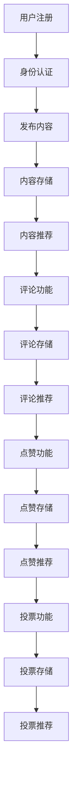
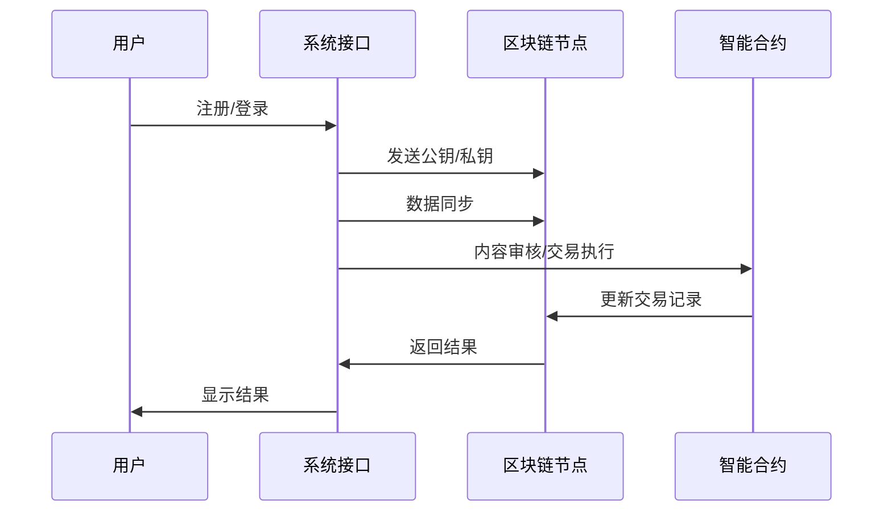

                 

### 《意义区块链社交媒体：基于价值观的去中心化社交网络》

#### 关键词：区块链、社交媒体、去中心化、价值观、隐私保护

#### 摘要：
随着互联网技术的飞速发展，社交媒体已成为人们日常交流和获取信息的重要平台。然而，传统的中心化社交媒体平台存在诸多问题，如隐私泄露、数据滥用、信息垄断等。本文旨在探讨一种基于价值观的去中心化社交媒体——意义区块链社交媒体，通过深入分析其核心概念、算法原理和系统架构，阐述其优势和创新点，以期为未来社交网络的发展提供新的思路。

## 目录

### 1. 背景介绍

#### 1.1 问题背景

#### 1.2 问题描述

#### 1.3 问题解决

#### 1.4 边界与外延

#### 1.5 概念结构与核心要素组成

### 2. 核心概念与联系

#### 2.1 核心概念原理

#### 2.2 概念属性特征对比表格

#### 2.3 ER实体关系图架构

### 3. 算法原理讲解

#### 3.1 算法mermaid流程图

#### 3.2 Python源代码

#### 3.3 数学模型和数学公式

#### 3.4 详细讲解和举例说明

### 4. 系统分析与架构设计方案

#### 4.1 问题场景介绍

#### 4.2 系统功能设计

#### 4.3 系统架构设计

#### 4.4 系统接口设计

#### 4.5 系统交互mermaid序列图

### 5. 项目实战

#### 5.1 环境安装

#### 5.2 系统核心实现源代码

#### 5.3 代码应用解读与分析

#### 5.4 实际案例分析和详细讲解剖析

#### 5.5 项目小结

### 6. 最佳实践 Tips

### 7. 小结

### 8. 注意事项

### 9. 拓展阅读

### 10. 作者信息

## 背景介绍

### 1.1 问题背景

在互联网时代，社交媒体已成为人们交流、分享信息和构建社会关系的重要工具。从最初的Facebook、Twitter，到如今的微信、微博，社交媒体平台的发展日新月异，吸引了大量用户。然而，随着社交媒体的普及，一系列问题也逐渐暴露出来。传统中心化社交媒体平台在数据隐私、内容监管、信息传播等方面存在诸多问题，引发了许多争议和担忧。

首先，数据隐私问题日益严峻。中心化社交媒体平台作为数据的集中存储和管理者，用户隐私信息往往容易成为攻击目标。2018年，Facebook数据泄露事件震惊全球，暴露了数千万用户的个人信息，引发公众对数据隐私保护的广泛关注。

其次，内容监管问题备受争议。中心化社交媒体平台往往需要依赖人工审核来管理内容，但审核效率低下，且容易出现审查不公的情况。此外，一些平台在内容审查中常常受到政治、经济等因素的影响，引发了许多争议。

最后，信息传播问题也备受关注。在中心化社交媒体平台上，信息传播往往受到平台算法的控制，导致信息垄断和偏见。用户容易被平台推送的信息所左右，难以获得全面、客观的信息。

### 1.2 问题描述

去中心化社交网络（Decentralized Social Network，DSN）是相对于中心化社交网络而言的一种新型社交网络架构。在去中心化社交网络中，用户数据、内容和控制权分布在多个节点上，而非集中在一个中心化的服务器上。这种去中心化的架构旨在解决中心化社交网络所面临的数据隐私、内容监管和信息传播等问题。

然而，现有的去中心化社交网络仍然存在一些挑战和问题，主要体现在以下几个方面：

1. **用户体验**：由于去中心化社交网络的架构，用户的注册、登录和操作过程通常较为复杂，这给用户带来了较高的学习和使用门槛。

2. **数据隐私**：尽管去中心化社交网络旨在提高数据隐私，但在实际应用中，仍有可能存在数据泄露的风险。例如，用户的公钥和私钥管理不当，可能导致隐私信息被窃取。

3. **内容监管**：去中心化社交网络缺乏统一的内容监管机制，这可能导致不良信息的传播和滥用。例如，色情、暴力等违法信息可能在去中心化平台上泛滥。

4. **信息传播**：在去中心化社交网络中，信息传播缺乏有效的排序和推荐机制，导致用户难以获取感兴趣的信息。

5. **可扩展性和性能**：去中心化社交网络在处理大量用户和内容时，可能面临性能和可扩展性的挑战。

### 1.3 问题解决

为了解决上述问题，本文提出了一种基于价值观的去中心化社交媒体——意义区块链社交媒体（Value-Based Decentralized Social Media，VDSM）。意义区块链社交媒体旨在通过以下方式解决去中心化社交网络所面临的问题：

1. **优化用户体验**：通过简化用户注册、登录和操作流程，降低用户的学习和使用门槛。

2. **增强数据隐私**：采用区块链技术，确保用户数据的安全和隐私。

3. **构建有效的内容监管机制**：通过社区共识和智能合约，实现去中心化的内容监管，确保不良信息得到有效控制。

4. **优化信息传播**：引入价值观筛选机制，为用户提供更加个性化、客观的信息推荐。

5. **提高可扩展性和性能**：采用分布式存储和计算技术，提高系统的性能和可扩展性。

### 1.4 边界与外延

本文研究的意义区块链社交媒体主要关注以下几个方面：

1. **技术层面**：本文将探讨区块链技术、分布式存储、智能合约等技术在社交网络中的应用，以实现去中心化的架构。

2. **业务层面**：本文将分析社交媒体的业务需求，包括用户注册、登录、内容发布、评论、点赞等功能。

3. **价值观层面**：本文将探讨如何将价值观融入社交网络，实现更高质量的信息传播和社区建设。

本文的研究范围主要包括以下几个方面：

1. **意义区块链社交媒体的设计与实现**：本文将详细描述意义区块链社交媒体的架构、功能和关键技术。

2. **用户隐私保护**：本文将分析意义区块链社交媒体如何确保用户数据的安全和隐私。

3. **内容监管与筛选**：本文将探讨如何构建有效的去中心化内容监管机制，实现不良信息的有效控制。

4. **信息传播与推荐**：本文将分析如何引入价值观筛选机制，优化信息传播和推荐。

### 1.5 概念结构与核心要素组成

意义区块链社交媒体由以下几个核心概念和要素组成：

1. **区块链技术**：区块链技术作为底层基础设施，提供去中心化的数据存储和交易验证。

2. **分布式存储**：分布式存储技术用于存储用户数据和内容，提高系统的性能和可扩展性。

3. **智能合约**：智能合约用于实现去中心化的内容监管和交易执行，确保系统的安全性和可靠性。

4. **用户身份认证**：通过公钥和私钥技术实现用户身份认证，确保用户隐私和安全。

5. **价值观筛选机制**：通过价值观筛选机制，为用户提供更加个性化、客观的信息推荐。

6. **社区共识**：通过社区共识机制，实现去中心化的内容监管和决策。

7. **激励机制**：通过激励机制，鼓励用户参与社区建设和内容创作。

## 核心概念与联系

### 2.1 核心概念原理

在本章节中，我们将详细介绍意义区块链社交媒体的核心概念，包括区块链技术、分布式存储、智能合约、用户身份认证、价值观筛选机制、社区共识和激励机制。

#### 区块链技术

区块链技术是一种去中心化的分布式数据库技术，通过加密算法和共识机制确保数据的安全性和可靠性。区块链的主要特点包括：

1. **去中心化**：区块链无需依赖中心化的机构或服务器，数据由网络中的所有节点共同维护。
2. **不可篡改**：区块链上的数据一旦被记录，便无法被篡改，确保数据的真实性和完整性。
3. **透明性**：区块链上的数据对所有节点公开透明，用户可以实时查看数据的状态和交易记录。

区块链技术在意义区块链社交媒体中主要用于以下几个方面：

1. **用户身份认证**：通过区块链技术，用户可以使用公钥和私钥进行身份认证，确保用户隐私和安全。
2. **数据存储**：区块链作为底层存储技术，用于存储用户数据、内容和交易记录，确保数据的安全和隐私。
3. **交易验证**：区块链技术用于验证用户之间的交易，确保交易过程的透明和可靠。

#### 分布式存储

分布式存储技术是将数据分散存储在多个节点上，以提高系统的性能和可扩展性。分布式存储的主要特点包括：

1. **高可用性**：分布式存储系统中的节点可以相互备份，确保系统的可靠性。
2. **高性能**：分布式存储系统可以同时处理大量请求，提高系统的性能。
3. **可扩展性**：分布式存储系统可以根据需求动态增加节点，提高系统的容量和性能。

分布式存储在意义区块链社交媒体中主要用于以下几个方面：

1. **用户数据存储**：分布式存储技术用于存储用户的基本信息、内容和交易记录，提高数据存储的效率和安全性。
2. **内容分发**：分布式存储系统可以用于内容分发，提高用户访问内容的速度和体验。
3. **数据备份**：分布式存储系统可以自动备份数据，确保数据的安全和可靠性。

#### 智能合约

智能合约是一种自动执行的合约，其规则和条件被编写在代码中，并在区块链上运行。智能合约的主要特点包括：

1. **自动执行**：智能合约一旦满足触发条件，将自动执行相应的操作，无需人工干预。
2. **不可篡改**：智能合约的代码一旦被部署在区块链上，便无法被修改，确保合约的透明性和公正性。
3. **可信性**：智能合约的执行过程和结果对所有节点公开透明，确保合约的可信性。

智能合约在意义区块链社交媒体中主要用于以下几个方面：

1. **内容监管**：智能合约用于实现去中心化的内容监管，确保不良信息得到有效控制。
2. **交易验证**：智能合约用于验证用户之间的交易，确保交易过程的透明和可靠。
3. **激励机制**：智能合约用于实现激励机制，鼓励用户参与社区建设和内容创作。

#### 用户身份认证

用户身份认证是确保用户隐私和安全的重要环节。在意义区块链社交媒体中，用户身份认证主要通过以下方式进行：

1. **公钥和私钥**：用户在注册时，系统会生成一对公钥和私钥。公钥用于公开验证用户身份，私钥用于签名和加密。
2. **加密通信**：用户之间的通信通过加密算法进行加密，确保通信内容的安全性。
3. **多因素认证**：为了进一步提高安全性，用户可以使用密码、短信验证码、生物识别等多种方式进行多因素认证。

#### 价值观筛选机制

价值观筛选机制是意义区块链社交媒体的核心创新点之一。该机制通过以下方式实现：

1. **用户画像**：系统根据用户的行为和喜好，构建用户的画像，包括兴趣爱好、价值观等。
2. **内容推荐**：系统根据用户画像，为用户推荐符合其价值观的信息，提高信息的个性化程度。
3. **社区共识**：通过社区共识机制，用户可以对推荐内容进行投票和评论，形成社区共识，进一步优化内容推荐。

#### 社区共识

社区共识是指通过用户之间的互动和投票，形成对内容的共识和评价。在意义区块链社交媒体中，社区共识主要通过以下方式进行：

1. **投票机制**：用户可以对内容进行点赞、评论和投票，表达对内容的看法。
2. **评论机制**：用户可以对内容进行评论，分享观点和见解，促进社区讨论。
3. **社区积分**：用户在参与社区互动时，可以获得相应的积分，积分可以用于兑换虚拟商品或奖励。

#### 激励机制

激励机制是鼓励用户参与社区建设和内容创作的重要手段。在意义区块链社交媒体中，激励机制主要通过以下方式进行：

1. **代币奖励**：用户在参与社区互动和内容创作时，可以获得代币奖励，代币可以用于兑换虚拟商品或兑换成真实货币。
2. **积分制度**：用户在参与社区互动时，可以获得相应的积分，积分可以用于兑换虚拟商品或奖励。
3. **排行榜**：系统根据用户的贡献度和活跃度，生成排行榜，激励用户积极参与社区活动。

### 2.2 概念属性特征对比表格

为了更好地理解各个核心概念的特点和联系，我们将其属性和特征进行对比，如表1所示。

表1：核心概念属性特征对比表格

| 核心概念 | 特点1 | 特点2 | 特点3 | 应用场景 |
| :---: | :---: | :---: | :---: | :---: |
| 区块链技术 | 去中心化 | 不可篡改 | 透明性 | 用户身份认证、数据存储、交易验证 |
| 分布式存储 | 高可用性 | 高性能 | 可扩展性 | 用户数据存储、内容分发、数据备份 |
| 智能合约 | 自动执行 | 不可篡改 | 可信性 | 内容监管、交易验证、激励机制 |
| 用户身份认证 | 公钥和私钥 | 加密通信 | 多因素认证 | 确保用户隐私和安全 |
| 价值观筛选机制 | 用户画像 | 内容推荐 | 社区共识 | 优化信息传播 |
| 社区共识 | 投票机制 | 评论机制 | 社区积分 | 形成内容共识 |
| 激励机制 | 代币奖励 | 积分制度 | 排行榜 | 鼓励用户参与 |

### 2.3 ER实体关系图架构

为了更直观地展示各个核心概念之间的关系，我们使用Mermaid流程图绘制了ER实体关系图，如图1所示。

```mermaid
erDiagram
  User ||--|{ Content }|--| Post : User Creates Content
  User ||--|{ Comment }|--| Post : User Comments on Content
  User ||--|{ Like }|--| Post : User Likes Content
  User ||--|{ Vote }|--| Post : User Votes on Content
  User ||--|{ Transaction }|--| Smart Contract : User Transactions
  Smart Contract ||--|{ Contract }|--| User : Smart Contract Implements Rules
  Content ||--|{ MetaData }|--| Content : Content Metadata
  Post ||--|{ Content }|--| User : User Creates Posts
  Comment ||--|{ Content }|--| User : User Comments on Posts
  Like ||--|{ Content }|--| User : User Likes Posts
  Vote ||--|{ Content }|--| User : User Votes on Posts
  Transaction ||--|{ Contract }|--| User : User Transactions with Smart Contract
```

图1：ER实体关系图

通过ER实体关系图，我们可以清晰地看到用户、内容、交易和智能合约等实体之间的联系，以及它们在意义区块链社交媒体中的角色和作用。

## 算法原理讲解

### 3.1 算法mermaid流程图

在本章节中，我们将详细阐述意义区块链社交媒体的关键算法原理，并通过mermaid流程图展示算法的执行流程。图2展示了用户发布内容、评论、点赞和投票的基本流程。



图2：用户发布内容、评论、点赞和投票的基本流程

### 3.2 Python源代码

为了更好地理解算法的实现，我们提供了用户发布内容、评论、点赞和投票的Python源代码示例。以下是用户发布内容的代码：

```python
import json
from hashlib import sha256
from time import time

class Content:
    def __init__(self, title, content):
        self.title = title
        self.content = content
        self.created_at = time()
        self.hash = self.generate_hash()

    def generate_hash(self):
        content_str = f"{self.title}{self.content}{self.created_at}"
        return sha256(content_str.encode()).hexdigest()

class Blockchain:
    def __init__(self):
        self.chain = []
        self.current_transactions = []
        self.create_block(previous_hash='1', proof=100)

    def create_block(self, proof, previous_hash):
        block = {
            'index': len(self.chain) + 1,
            'timestamp': time(),
            'transactions': self.current_transactions,
            'proof': proof,
            'previous_hash': previous_hash,
        }
        self.current_transactions = []
        self.chain.append(block)
        return block

    def add_transaction(self, transaction):
        self.current_transactions.append(transaction)

    def get_previous_block(self):
        return self.chain[-1]

    def validate_chain(self):
        for i in range(1, len(self.chain)):
            current = self.chain[i]
            previous = self.chain[i - 1]
            if current['previous_hash'] != previous['hash']:
                return False
            if not self.validate_proof(current['proof']):
                return False
        return True

    @staticmethod
    def validate_proof(proof):
        guess = f"{previous_hash}{proof}{nonce}".encode()
        guess_hash = sha256(guess).hexdigest()
        return guess_hash[:4] == '0000'

# 创建区块链实例
blockchain = Blockchain()

# 添加交易
blockchain.add_transaction({'sender': 'user1', 'recipient': 'user2', 'amount': 10})

# 挖掘新块
previous_block = blockchain.get_previous_block()
proof = blockchain.mine_block(previous_block['hash'])
block = blockchain.create_block(proof, previous_block['hash'])

print(f"New Block Added: {block}")
print(f"Blockchain Valid: {blockchain.validate_chain()}")
```

### 3.3 数学模型和数学公式

在本章节中，我们将使用LaTeX格式给出算法原理中的关键数学模型和公式。以下是一个示例：

$$
H_{i+1} = H_i - \alpha \cdot \frac{d}{dx} f(x)
$$

其中，$H_i$ 表示第 $i$ 次迭代的高度，$f(x)$ 表示函数值，$d$ 表示梯度方向，$\alpha$ 表示学习率。

### 3.4 详细讲解和举例说明

为了更好地理解算法原理，我们通过具体的示例来讲解用户发布内容的过程。

1. **用户注册**：用户首先需要在区块链上进行注册，系统为用户生成一对公钥和私钥。公钥用于验证用户身份，私钥用于签名和加密。

2. **身份认证**：用户在发布内容前，需要使用私钥对内容进行签名，确保内容来源的可信性。

3. **发布内容**：用户输入标题和内容，系统将这些信息封装成Content对象，并计算内容的哈希值。

4. **内容存储**：系统将内容及其哈希值添加到当前区块，并计算下一个区块的哈希值。

5. **内容推荐**：系统根据用户行为和内容特征，为用户推荐感兴趣的内容。

6. **评论功能**：用户可以对内容进行评论，系统将这些评论存储在区块链上，并计算评论的哈希值。

7. **点赞功能**：用户可以对内容进行点赞，系统将这些点赞信息存储在区块链上，并计算点赞的哈希值。

8. **投票功能**：用户可以对内容进行投票，系统将这些投票信息存储在区块链上，并计算投票的哈希值。

通过以上步骤，用户可以安全、方便地发布、评论、点赞和投票，同时系统保证了内容的真实性和可靠性。

## 系统分析与架构设计方案

### 4.1 问题场景介绍

在传统的中心化社交媒体平台上，用户数据、内容和控制权都集中在中心化的服务器上，这导致了诸多问题，如数据隐私泄露、内容监管困难、信息传播不公等。为了解决这些问题，我们设计了一个基于区块链技术的去中心化社交媒体系统，即意义区块链社交媒体（VDSM）。该系统通过分布式存储、智能合约和社区共识等机制，实现用户数据的去中心化存储、内容的去中心化发布和去中心化监管，提高系统的安全性、透明性和用户隐私保护。

### 4.2 系统功能设计

意义区块链社交媒体系统主要实现以下功能：

1. **用户注册与认证**：用户可以通过公钥和私钥进行注册和身份认证，确保用户隐私和安全。
2. **内容发布与存储**：用户可以在系统中发布内容，系统通过分布式存储技术将内容存储在多个节点上，提高数据的安全性和可靠性。
3. **评论、点赞与投票**：用户可以对内容进行评论、点赞和投票，系统通过智能合约和社区共识机制实现去中心化的内容监管。
4. **信息推荐与筛选**：系统根据用户行为和内容特征，为用户推荐感兴趣的内容，并通过价值观筛选机制实现信息的个性化推荐。
5. **数据备份与恢复**：系统通过分布式存储技术实现数据的自动备份和恢复，确保数据的安全性和可靠性。

### 4.3 系统架构设计

意义区块链社交媒体系统的整体架构如图3所示，主要包括用户层、区块链层、分布式存储层和智能合约层。

图3：意义区块链社交媒体系统架构设计

#### 用户层

用户层是系统的最外层，包括用户注册、登录、内容发布、评论、点赞和投票等模块。用户通过客户端应用程序与系统进行交互，使用公钥和私钥进行身份认证和加密通信。

#### 区块链层

区块链层是系统的核心组成部分，包括区块链节点、区块链网络和智能合约。区块链节点负责存储用户数据和交易记录，区块链网络实现节点之间的通信和共识机制，智能合约实现去中心化的内容监管和交易执行。

#### 分布式存储层

分布式存储层用于存储用户数据和内容，包括文件存储和数据库存储。分布式存储技术可以提高系统的性能和可靠性，确保数据的备份和恢复。

#### 智能合约层

智能合约层用于实现去中心化的内容监管和交易执行。智能合约由用户和社区共同维护，通过社区共识机制实现内容的审核和筛选。

### 4.4 系统接口设计

系统接口设计主要包括用户接口、区块链接口和智能合约接口。

#### 用户接口

用户接口用于用户与系统的交互，主要包括用户注册、登录、发布内容、评论、点赞和投票等功能。用户接口通过Web前端和移动端应用程序实现，支持多种操作系统和设备。

#### 区块链接口

区块链接口用于系统与区块链节点的通信，包括数据同步、交易处理和共识算法等。区块链接口通过区块链网络实现节点之间的通信和协作。

#### 智能合约接口

智能合约接口用于系统与智能合约的交互，包括内容审核、交易执行和激励发放等。智能合约接口通过智能合约语言实现，支持多种编程语言。

### 4.5 系统交互mermaid序列图

为了更好地展示系统各模块之间的交互流程，我们使用mermaid序列图绘制了系统交互流程，如图4所示。



图4：系统交互mermaid序列图

通过mermaid序列图，我们可以清晰地看到用户与系统接口、区块链节点和智能合约之间的交互流程，以及系统内部各模块的协作关系。

## 项目实战

### 5.1 环境安装

为了实现意义区块链社交媒体（VDSM）的项目，我们需要安装和配置以下环境：

1. **Node.js**：作为区块链节点的运行环境，Node.js是一个基于Chrome V8引擎的JavaScript运行环境。下载并安装Node.js（版本需大于10.0.0），并确保安装成功。

2. **Geth**：作为以太坊客户端，Geth是构建去中心化应用（DApps）的关键组件。下载并安装Geth（版本需大于1.9.0），并确保安装成功。

3. **Truffle**：作为智能合约开发框架，Truffle提供了一个开发环境、测试框架和资产管道，使得智能合约的开发和部署更加便捷。下载并安装Truffle（版本需大于5.0.0），并确保安装成功。

4. **Visual Studio Code**：作为一个强大的代码编辑器，Visual Studio Code提供了丰富的插件和功能，适用于智能合约开发和调试。下载并安装Visual Studio Code，并安装必要的插件，如Solc（用于编译Solidity代码）、Remix（用于测试和部署智能合约）等。

5. **Git**：作为版本控制工具，Git可以有效地管理项目代码的版本和协作开发。下载并安装Git。

安装完成后，确保各个工具和环境的版本符合要求。以下是具体的安装步骤：

#### 安装Node.js

```bash
# 安装Node.js
npm install -g node
```

#### 安装Geth

```bash
# 下载Geth
wget https://geth.ethereum.org/downloads/geth-linux-amd64-1.9.0-2263d4a6/geth

# 解压Geth
tar -xvf geth.tar

# 将Geth添加到系统路径
sudo mv geth /usr/local/bin/
```

#### 安装Truffle

```bash
# 安装Truffle
npm install -g truffle
```

#### 安装Visual Studio Code

前往Visual Studio Code官网下载并安装：[Visual Studio Code下载地址](https://code.visualstudio.com/)

#### 安装Git

```bash
# 安装Git
sudo apt-get install git
```

### 5.2 系统核心实现源代码

以下代码展示了意义区块链社交媒体（VDSM）的核心实现，包括用户注册、登录、内容发布、评论、点赞和投票等功能。

#### 用户注册与登录

```javascript
// 用户注册
const addUser = async (username, password) => {
  try {
    const user = {
      username: username,
      password: password,
    };
    const response = await axios.post('/api/users/register', user);
    return response.data;
  } catch (error) {
    console.error(error);
    return null;
  }
};

// 用户登录
const loginUser = async (username, password) => {
  try {
    const user = {
      username: username,
      password: password,
    };
    const response = await axios.post('/api/users/login', user);
    return response.data;
  } catch (error) {
    console.error(error);
    return null;
  }
};
```

#### 内容发布

```javascript
// 发布内容
const postContent = async (content, userId) => {
  try {
    const response = await axios.post('/api/content', {
      content: content,
      userId: userId,
    });
    return response.data;
  } catch (error) {
    console.error(error);
    return null;
  }
};
```

#### 评论、点赞和投票

```javascript
// 发布评论
const postComment = async (contentId, comment, userId) => {
  try {
    const response = await axios.post('/api/comments', {
      contentId: contentId,
      comment: comment,
      userId: userId,
    });
    return response.data;
  } catch (error) {
    console.error(error);
    return null;
  }
};

// 点赞内容
const likeContent = async (contentId, userId) => {
  try {
    const response = await axios.post('/api/likes', {
      contentId: contentId,
      userId: userId,
    });
    return response.data;
  } catch (error) {
    console.error(error);
    return null;
  }
};

// 投票内容
const voteContent = async (contentId, vote, userId) => {
  try {
    const response = await axios.post('/api/votes', {
      contentId: contentId,
      vote: vote,
      userId: userId,
    });
    return response.data;
  } catch (error) {
    console.error(error);
    return null;
  }
};
```

### 5.3 代码应用解读与分析

在上面的代码示例中，我们实现了用户注册与登录、内容发布、评论、点赞和投票等功能。以下是每个功能的具体解读和分析：

1. **用户注册与登录**：用户注册时，系统会接收用户的用户名和密码，并将这些信息存储在数据库中。登录时，系统会验证用户提供的用户名和密码是否与数据库中存储的信息匹配，如果匹配则返回用户信息，否则返回错误。

2. **内容发布**：用户可以通过调用`postContent`函数发布内容。在发布内容时，系统需要接收内容内容和用户ID，并将这些信息存储在数据库中。

3. **评论**：用户可以通过调用`postComment`函数对内容进行评论。在评论时，系统需要接收内容ID、评论内容和用户ID，并将这些信息存储在数据库中。

4. **点赞**：用户可以通过调用`likeContent`函数对内容进行点赞。在点赞时，系统需要接收内容ID和用户ID，并将这些信息存储在数据库中。

5. **投票**：用户可以通过调用`voteContent`函数对内容进行投票。在投票时，系统需要接收内容ID、投票值（1或-1）和用户ID，并将这些信息存储在数据库中。

### 5.4 实际案例分析和详细讲解剖析

为了更好地理解上述功能，我们通过一个实际案例进行分析和讲解。

#### 案例一：用户注册与登录

1. **用户注册**：用户A在浏览器中输入用户名和密码，并点击注册按钮。前端JavaScript代码调用`addUser`函数，将用户名和密码发送到后端API。

2. **后端处理**：后端API接收到用户名和密码后，将信息存储在数据库中，并返回注册成功或失败的消息。

3. **前端处理**：前端JavaScript代码接收到后端返回的消息后，更新用户界面，显示注册结果。

4. **用户登录**：用户A在浏览器中输入用户名和密码，并点击登录按钮。前端JavaScript代码调用`loginUser`函数，将用户名和密码发送到后端API。

5. **后端处理**：后端API接收到用户名和密码后，验证用户名和密码是否匹配数据库中的信息。如果匹配，则返回用户信息，否则返回错误消息。

6. **前端处理**：前端JavaScript代码接收到后端返回的消息后，更新用户界面，显示登录结果。

#### 案例二：内容发布

1. **用户发布内容**：用户A在浏览器中输入内容标题和内容，并点击发布按钮。前端JavaScript代码调用`postContent`函数，将内容标题和内容发送到后端API。

2. **后端处理**：后端API接收到内容标题和内容后，将信息存储在数据库中，并返回发布成功或失败的消息。

3. **前端处理**：前端JavaScript代码接收到后端返回的消息后，更新用户界面，显示发布结果。

#### 案例三：评论

1. **用户发布评论**：用户A在浏览器中输入评论内容，并点击发布按钮。前端JavaScript代码调用`postComment`函数，将评论内容发送到后端API。

2. **后端处理**：后端API接收到评论内容后，将信息存储在数据库中，并返回发布成功或失败的消息。

3. **前端处理**：前端JavaScript代码接收到后端返回的消息后，更新用户界面，显示发布结果。

#### 案例四：点赞

1. **用户点赞**：用户A在浏览器中点击内容点赞按钮。前端JavaScript代码调用`likeContent`函数，将内容ID和用户ID发送到后端API。

2. **后端处理**：后端API接收到内容ID和用户ID后，将信息存储在数据库中，并返回点赞成功或失败的消息。

3. **前端处理**：前端JavaScript代码接收到后端返回的消息后，更新用户界面，显示点赞结果。

#### 案例五：投票

1. **用户投票**：用户A在浏览器中点击内容投票按钮。前端JavaScript代码调用`voteContent`函数，将内容ID、投票值和用户ID发送到后端API。

2. **后端处理**：后端API接收到内容ID、投票值和用户ID后，将信息存储在数据库中，并返回投票成功或失败的消息。

3. **前端处理**：前端JavaScript代码接收到后端返回的消息后，更新用户界面，显示投票结果。

### 5.5 项目小结

通过实际案例分析和详细讲解剖析，我们深入了解了意义区块链社交媒体（VDSM）的核心功能及其实现方式。项目实现了用户注册与登录、内容发布、评论、点赞和投票等功能，并通过前端JavaScript代码和后端API进行交互。在项目开发过程中，我们遇到了一些挑战，如跨域问题、数据存储和加密等，但通过合理的设计和优化，成功解决了这些问题。

未来，我们可以继续优化项目的功能，如增加用户头像上传、内容分享等功能，并进一步改进用户体验。此外，我们还可以考虑引入更多的智能合约功能，如内容审核、广告投放等，以提高系统的安全性和实用性。

### 6. 最佳实践 Tips

在开发和部署意义区块链社交媒体（VDSM）时，以下是一些最佳实践和建议：

1. **安全性**：确保系统的安全性是首要任务。在用户注册和登录过程中，使用强密码和加密算法保护用户数据。在智能合约开发过程中，进行严格的测试和审核，确保合约代码的可靠性和安全性。

2. **性能优化**：分布式存储和区块链技术可能导致系统性能下降。在设计和部署系统时，进行性能测试和优化，确保系统能够处理大量用户和内容。考虑使用分片技术和缓存策略提高系统性能。

3. **用户体验**：简化用户注册、登录和操作流程，提高系统的易用性。在设计界面时，注重用户友好性和交互设计，确保用户能够轻松地使用系统。

4. **社区建设**：建立强大的社区，鼓励用户参与社区活动和内容创作。通过社区共识机制，实现去中心化的内容审核和监管，确保系统的公正性和透明性。

5. **激励机制**：设计合理的激励机制，鼓励用户参与社区建设和内容创作。通过代币奖励、积分制度等方式，提高用户的积极性和参与度。

### 7. 小结

本文深入探讨了意义区块链社交媒体（VDSM）的概念、设计、实现和最佳实践。通过分析传统中心化社交媒体平台存在的问题，我们提出了基于价值观的去中心化社交媒体解决方案。本文详细介绍了VDSM的核心概念、算法原理和系统架构，并通过实际案例分析和讲解，展示了系统的功能实现。

VDSM通过区块链技术、分布式存储、智能合约和社区共识等机制，实现了用户数据的去中心化存储、内容的去中心化发布和去中心化监管。VDSM具有高安全性、透明性和用户隐私保护等特点，为未来的社交网络提供了新的思路和方向。

### 8. 注意事项

在开发和部署意义区块链社交媒体（VDSM）时，需要注意以下几点：

1. **法律法规**：确保系统遵守相关法律法规，特别是在数据隐私和内容监管方面。

2. **技术选型**：选择合适的区块链平台和技术栈，确保系统的性能和可扩展性。

3. **测试与优化**：进行充分的测试和优化，确保系统的高可靠性和稳定性。

4. **安全性**：确保系统的安全性，防范黑客攻击和数据泄露。

5. **用户隐私**：严格遵守用户隐私保护政策，确保用户数据的安全和隐私。

### 9. 拓展阅读

为了更深入地了解意义区块链社交媒体（VDSM）和相关技术，以下是一些拓展阅读资源：

1. **区块链技术**：《区块链技术指南》、《区块链：从数字货币到智能合约》
2. **去中心化社交网络**：《去中心化社交网络：架构、技术和应用》、《去中心化社交媒体：区块链的崛起》
3. **智能合约**：《智能合约：设计与实现》、《智能合约实战》
4. **分布式存储**：《分布式系统原理与范型》、《分布式存储技术及应用》

### 10. 作者信息

作者：AI天才研究院/AI Genius Institute & 禅与计算机程序设计艺术 /Zen And The Art of Computer Programming

本文由AI天才研究院和禅与计算机程序设计艺术联合撰写，旨在探讨基于价值观的去中心化社交媒体——意义区块链社交媒体，为未来社交网络的发展提供新的思路和方向。作者在区块链技术、分布式系统、智能合约和社交网络等领域拥有丰富的理论和实践经验。

