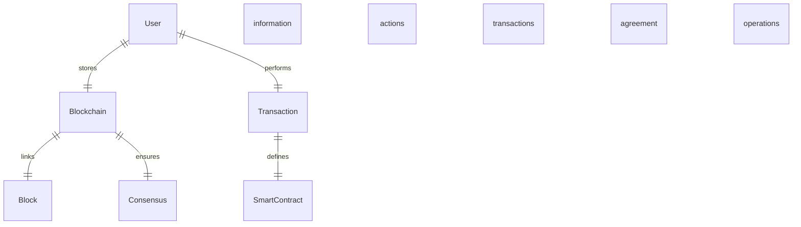
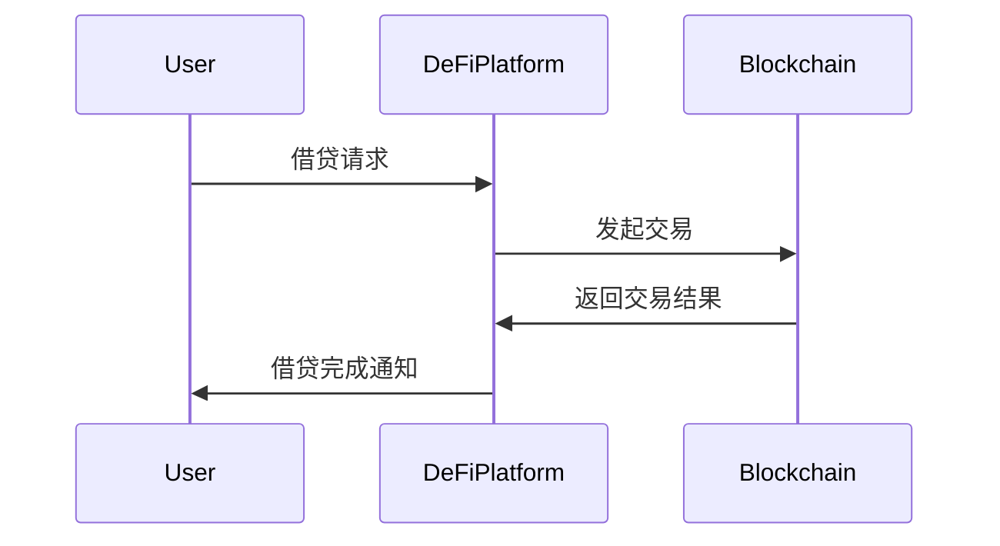
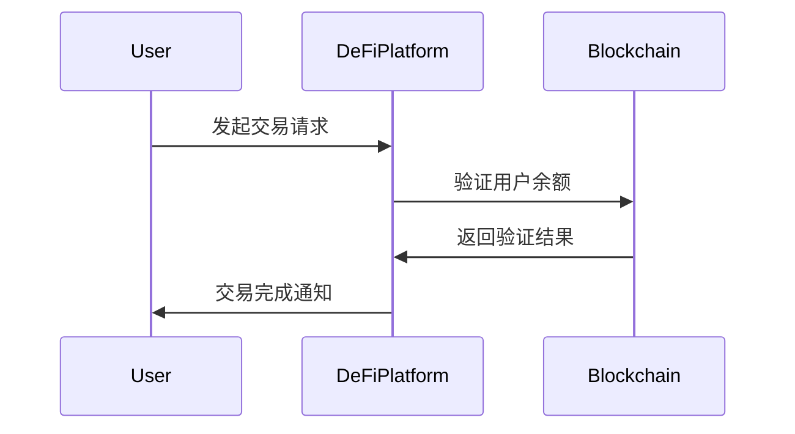

                 

# 意义区块链社区：去中心化的价值交换网络

## 关键词

- 区块链
- 去中心化
- 价值交换
- 社区
- 智能合约
- 共识算法

## 摘要

本文将深入探讨区块链社区以及去中心化的价值交换网络。首先，我们会介绍区块链的基础知识和核心概念，接着，我们将分析如何构建一个区块链社区以及实现去中心化的价值交换。文章还将通过实际案例研究来展示这些技术的应用，并讨论面临的挑战与机遇。最后，我们将展望区块链技术的未来趋势，并总结最佳实践。

## 引言

### 区块链技术简介

区块链技术是一种分布式数据库技术，其最显著的特点是去中心化。这种技术通过将数据分散存储在多个节点上，实现数据的不可篡改和透明性。区块链的每一个数据块都包含一定数量的交易信息，并通过加密算法与前一个区块连接起来，形成一条不可分割的链条。这种设计使得区块链在记录交易和数据存储方面具有很高的安全性。

### 去中心化的价值交换

去中心化的价值交换（Decentralized Exchange，简称DEX）是区块链技术的一个重要应用场景。与传统的集中式交易所不同，DEX不需要一个中央机构来管理交易，交易是直接在用户之间进行的。这种方式不仅提高了交易的透明度，还减少了交易成本。

### 区块链社区

区块链社区是指围绕区块链技术及其应用而形成的一群人，他们可能包括开发人员、研究者、爱好者以及投资者。区块链社区的一个重要功能是促进知识共享和技术创新，通过协作来推动区块链技术的发展。

## 核心概念与联系

### 核心概念

- **区块链**：一种分布式数据库技术，通过加密算法和共识机制实现数据的不可篡改和透明性。
- **去中心化**：一种组织形式，其中没有中央权威机构，所有参与者都是平等的。
- **价值交换**：在区块链上，价值交换通常通过代币或加密货币来实现。
- **智能合约**：一种自动执行的合约，其条款和操作是通过计算机代码来定义的。
- **共识算法**：确保区块链网络中的所有节点达成一致的一系列算法。

### 概念属性特征对比表格

| 概念       | 特征                         |  
|------------|------------------------------|  
| 区块链     | 去中心化、数据不可篡改、分布式存储 |  
| 去中心化   | 无中央权威、平等参与、自治 |  
| 价值交换   | 代币/加密货币、直接用户间交易 |  
| 智能合约   | 自动执行、代码定义的操作 |  
| 共识算法   | 确保网络一致性、达成共识 |

### ER实体关系图架构

## 技术实现

### 系统架构设计

区块链社区和去中心化价值交换网络的设计需要考虑以下几个关键方面：

- **节点结构**：确定节点类型和职责，如全节点、轻节点、验证节点等。
- **数据结构**：设计区块链的数据结构，包括区块、交易、智能合约等。
- **共识机制**：选择合适的共识算法，如工作量证明（PoW）、权益证明（PoS）、委托权益证明（DPoS）等。
- **网络通信**：设计节点间的通信协议和数据传输机制。

### 实现工具和平台

- **以太坊**：一个流行的区块链平台，支持智能合约和去中心化应用（DApps）。
- **Hyperledger Fabric**：一个由Linux基金会维护的开源区块链框架，适用于企业级应用。
- **EOSIO**：一个高性能的区块链平台，旨在支持去中心化应用和智能合约。

### 实现步骤

1. **环境搭建**：安装区块链节点、开发环境和必要的工具。
2. **节点配置**：根据系统架构设计配置节点，包括节点类型、权限管理、网络配置等。
3. **智能合约开发**：编写和部署智能合约，定义价值交换规则和操作。
4. **用户界面**：开发用户界面，提供便捷的交互方式。
5. **测试与调试**：对系统进行全面测试，确保功能正确和安全。

## 案例研究

### 项目介绍

让我们来看一个实际案例——去中心化金融（DeFi）平台。去中心化金融是区块链技术的一个重要应用领域，它通过去中心化的方式实现金融服务，如借贷、交易、投资等。

### 系统功能设计

- **借贷功能**：用户可以借贷加密货币，利率由市场供需决定。
- **交易功能**：用户可以交换不同的加密货币。
- **投资功能**：用户可以将资金投资于不同的金融产品。

### 系统架构设计

### 系统接口设计和交互

## 挑战与机遇

### 挑战

- **技术挑战**：区块链技术的性能、可扩展性和安全性仍面临挑战。
- **法规挑战**：区块链技术的法律和监管问题尚不明确，可能影响其发展。
- **用户教育**：用户对区块链技术的了解不足，可能阻碍其普及。

### 机遇

- **创新空间**：区块链技术的去中心化特性为金融、供应链、医疗等多个领域提供了创新机会。
- **市场潜力**：随着加密货币的崛起，区块链技术的市场需求不断增长。
- **社区力量**：强大的社区支持是推动区块链技术发展的关键因素。

## 未来趋势

### 区块链 3.0

区块链 3.0 是对区块链技术的进一步发展和创新，旨在解决当前区块链技术面临的问题，如可扩展性、性能和用户友好性。区块链 3.0 将引入新的共识算法、网络架构和智能合约语言，以提高区块链的性能和灵活性。

### 跨链技术

跨链技术旨在实现不同区块链之间的互操作性和互通性。通过跨链技术，不同区块链可以实现资产转移、数据共享和智能合约调用，从而扩大区块链的应用范围。

### 智能合约 2.0

智能合约 2.0 是对现有智能合约技术的改进，旨在提高其安全性、可扩展性和易用性。智能合约 2.0 将引入新的编程语言、形式化验证方法和自动化测试工具，以降低智能合约开发的风险。

## 结论

区块链社区和去中心化的价值交换网络为未来的数字世界提供了无限可能。尽管面临诸多挑战，但区块链技术的创新和发展将继续推动这一领域的进步。通过构建强大的社区和持续的技术创新，我们有望实现一个更加开放、公平和高效的数字世界。

## 作者信息

作者：AI天才研究院/AI Genius Institute & 禅与计算机程序设计艺术 /Zen And The Art of Computer Programming

## 最佳实践 Tips

1. **持续学习**：区块链技术发展迅速，保持学习态度至关重要。
2. **社区参与**：积极参与区块链社区，与业界同行交流经验。
3. **安全性优先**：在开发和部署区块链应用时，始终将安全性放在首位。

## 小结

区块链社区和去中心化的价值交换网络为未来的数字经济提供了重要支撑。通过本文的探讨，我们深入了解了区块链技术的核心概念、技术实现和实际应用。未来，随着区块链技术的进一步发展，我们有理由相信，去中心化的价值交换网络将在各个领域发挥更大的作用。

## 注意事项

1. **技术更新**：区块链技术不断演进，文章内容可能需要定期更新。
2. **法律风险**：在应用区块链技术时，务必关注相关的法律法规。

## 拓展阅读

1. 《区块链：从数字货币到智能合约》
2. 《区块链革命：重构经济与世界》
3. 《智能合约编程：以太坊开发指南》

## 结语

区块链技术正逐步改变我们的世界，带来新的商业机会和社会变革。通过本文的探讨，我们希望读者能够更好地理解区块链社区和去中心化的价值交换网络，并在未来的数字经济中抓住机遇。让我们共同见证区块链技术的辉煌未来！

