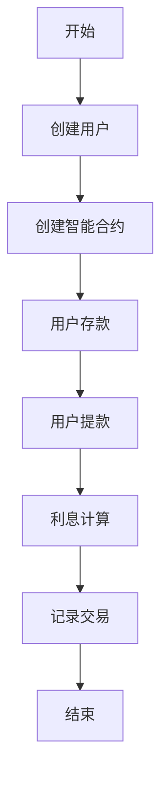
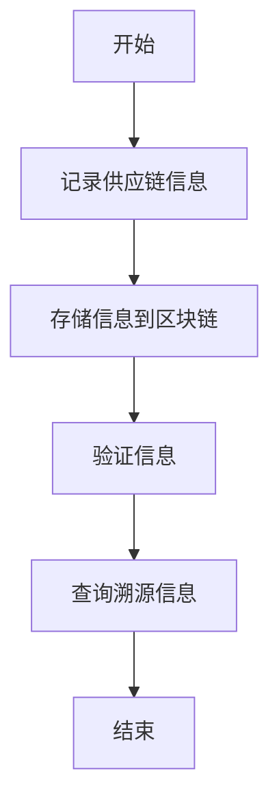

                 

**# 意义区块链联盟：推动去中心化价值交换网络的组织**

## 关键词：区块链、去中心化、价值交换、组织、技术分析

## 摘要：
本文旨在探讨区块链技术如何通过建立意义区块链联盟，推动构建去中心化的价值交换网络。我们将从区块链的核心概念出发，逐步分析其构建去中心化网络的方法，应用场景，面临的挑战及解决方案，最终展望区块链技术在未来去中心化价值交换中的潜力。

## 目录：

### 引言
- **区块链技术的背景与重要性**
- **去中心化价值交换网络的定义**
- **本文的目标与结构**

### 核心概念
- **区块链的定义与历史**
- **区块链的关键特征与原则**
- **与密码学相关的概念**

### 区块链与去中心化网络
- **区块链网络的结构**
- **区块链如何实现去中心化的价值交换**
- **与中心化系统的比较**

### 使用案例与应用
- **区块链技术的多种用途**
- **去中心化网络中的具体应用分析**
- **现实世界的例子**

### 挑战与解决方案
- **区块链技术在去中心化网络中面临的主要挑战**
- **克服这些挑战的策略和方案**

### 技术与工具
- **构建区块链网络的技术工具和框架**
- **开发去中心化应用的最好实践**

### 案例研究
- **成功区块链去中心化网络的详细案例分析**
- **从案例中学习的最佳实践**

### 未来展望
- **区块链技术的趋势与未来发展**
- **对未来去中心化价值交换网络的影响**

### 结语
- **总结与展望**
- **最佳实践提示**
- **注意事项**
- **拓展阅读**

### 引言

#### 区块链技术的背景与重要性
区块链技术作为一种革命性的分布式数据库技术，最早由中本聪（Satoshi Nakamoto）在2008年提出。区块链的核心思想是通过去中心化的方式，实现数据的透明、安全、不可篡改的存储和传输。这一技术不仅为数字货币如比特币（Bitcoin）的出现提供了基础，而且也在多个领域展示了其潜力。

#### 去中心化价值交换网络的定义
去中心化价值交换网络（Decentralized Value Exchange Networks，DVXN）是一种通过区块链技术实现的去中心化系统，它允许用户在不依赖中心化机构的情况下，直接进行价值交换。这种网络的特点是高度透明、安全、去中心化，能够有效降低交易成本、提高交易效率。

#### 本文的目标与结构
本文的目标是深入探讨区块链技术如何通过建立意义区块链联盟，推动构建去中心化的价值交换网络。文章将按照以下结构展开：

1. **核心概念**：介绍区块链的定义、特征和与密码学相关的概念。
2. **区块链与去中心化网络**：分析区块链网络的结构及其如何实现去中心化的价值交换。
3. **使用案例与应用**：探讨区块链技术在现实世界的多种用途。
4. **挑战与解决方案**：讨论区块链技术在去中心化网络中面临的主要挑战及解决方案。
5. **技术与工具**：介绍用于构建区块链网络的技术工具和框架。
6. **案例研究**：分析成功区块链去中心化网络的案例。
7. **未来展望**：展望区块链技术的趋势与未来影响。
8. **结语**：总结文章，并提供最佳实践提示和拓展阅读建议。

通过这一结构，我们将系统地分析区块链技术如何推动去中心化的价值交换网络，为读者提供一个全面的理解。接下来，我们将进一步深入探讨区块链的核心概念，为后续的内容打下坚实的基础。

### 核心概念

#### 区块链的定义与历史
区块链是一种去中心化的分布式数据库，由多个按时间顺序排列的区块组成。每个区块都包含一组交易记录，并通过密码学算法与前一区块链接，形成一条连续的数据链。由于每个区块都包含前一个区块的哈希值，因此任何对区块链数据的篡改都会导致后续区块的哈希值失效，从而无法通过验证。

区块链技术的发展可以追溯到2008年中本聪提出的比特币白皮书。这篇白皮书首次提出了区块链的概念，并详细阐述了如何通过去中心化的方式实现数字货币的发行和交易。比特币作为第一个成功的区块链应用，引起了全球范围内的关注和研究。

#### 区块链的关键特征与原则
区块链技术具有以下几个关键特征：

1. **去中心化**：与传统的集中式系统不同，区块链通过分布在不同节点上的参与者共同维护数据，任何单一节点都无法控制或篡改整个系统。
2. **不可篡改性**：区块链采用密码学算法确保数据的不可篡改性。每个区块都包含前一个区块的哈希值，任何对数据的修改都会导致哈希值的改变，从而触发整个链的重新验证。
3. **透明性**：区块链的数据是公开透明的，所有参与者都可以查看和验证交易记录，确保数据的真实性和公正性。
4. **安全性**：区块链采用多种密码学技术，如哈希函数、公钥私钥加密等，确保数据的完整性和安全性。

区块链技术遵循以下核心原则：

1. **共识机制**：区块链通过共识机制确保参与者对于数据的一致性。不同的区块链平台可能采用不同的共识机制，如工作量证明（Proof of Work，PoW）、权益证明（Proof of Stake，PoS）等。
2. **智能合约**：智能合约是一种运行在区块链上的自动执行合同。当满足特定的条件时，智能合约会自动执行预定的操作，无需依赖中介机构。

#### 与密码学相关的概念
区块链技术依赖于多种密码学概念来确保数据的安全和不可篡改性。以下是一些关键的概念：

1. **哈希函数**：哈希函数是一种将任意长度的输入数据映射为固定长度的输出值（哈希值）的函数。哈希函数具有不可逆性和抗碰撞性，确保数据唯一性和安全性。
2. **公钥私钥加密**：公钥私钥加密是一种基于数学难题的加密技术。公钥和私钥是一对密钥，公钥可以公开，私钥必须保密。使用公钥加密的数据只能用对应的私钥解密。
3. **数字签名**：数字签名是一种通过公钥私钥加密技术实现的数据验证方法。发送方使用私钥对数据进行签名，接收方使用公钥验证签名的有效性，确保数据的完整性和真实性。

通过上述核心概念和密码学原理，区块链技术构建了一个去中心化、透明、安全的价值交换网络，为各种应用场景提供了强大的技术支持。在下一章节中，我们将进一步探讨区块链网络的结构及其如何实现去中心化的价值交换。

### 区块链与去中心化网络

#### 区块链网络的结构
区块链网络是由多个节点组成的分布式系统。每个节点都存储一份完整的区块链数据，并参与网络中的各种活动。这些节点通过共识机制保持数据的一致性，确保区块链的可靠性和安全性。

区块链网络的结构通常包括以下几个关键部分：

1. **节点**：节点是区块链网络中的基本组成部分，每个节点都运行区块链软件，并存储完整的区块链数据。节点可以是个人计算机、服务器或其他设备。
2. **区块链**：区块链是按时间顺序排列的一系列区块，每个区块包含一定数量的交易记录。区块链的数据是公开透明的，所有节点都可以查看和验证。
3. **挖矿**：挖矿是节点通过解决密码学难题来验证和创建新区块的过程。挖矿节点需要计算一个特定的哈希值，使其满足特定的条件，从而获得区块创建权和一定的奖励。
4. **共识机制**：共识机制是区块链网络中节点间达成一致的方法。不同的区块链平台可能采用不同的共识机制，如工作量证明（PoW）、权益证明（PoS）等。

#### 区块链如何实现去中心化的价值交换
区块链通过去中心化的方式实现价值交换，打破了传统集中化系统对中介机构的依赖。以下是区块链实现去中心化价值交换的主要方法：

1. **分布式账本**：区块链采用分布式账本技术，将数据分散存储在多个节点上。每个节点都有一份完整的账本，并参与网络中的交易验证和记账。这种分布式存储方式确保了数据的透明性和不可篡改性。
2. **共识算法**：共识算法是区块链网络中节点间达成一致的关键机制。通过共识算法，节点可以验证交易的有效性，并共同决定哪些交易将被添加到区块链中。共识算法的选择直接影响区块链的性能和安全性。
3. **智能合约**：智能合约是一种运行在区块链上的自动执行合同。当满足特定的条件时，智能合约会自动执行预定的操作，如资金转移、记录更新等。智能合约实现了价值交换的自动化和去中心化。
4. **去中心化身份验证**：区块链采用密码学技术实现去中心化身份验证。用户通过公钥私钥加密技术生成自己的身份凭证，无需依赖第三方机构。这种去中心化身份验证方式确保了用户身份的隐私和安全。

#### 与中心化系统的比较
与传统中心化系统相比，区块链在去中心化价值交换方面具有以下优势：

1. **去中心化**：区块链通过分布式网络实现价值交换，无需依赖中心化机构。这种去中心化的结构提高了系统的可靠性和容错性，降低了单点故障的风险。
2. **透明性**：区块链的数据是公开透明的，所有参与者都可以查看和验证交易记录。这种透明性提高了系统的公正性和可信度。
3. **安全性**：区块链采用密码学技术确保数据的完整性和安全性。通过分布式存储和共识算法，区块链系统具有强大的抗攻击能力。
4. **降低成本**：区块链通过去中心化的方式实现价值交换，减少了中介机构的费用。这种降低成本的优势尤其体现在跨境支付、供应链管理等领域。
5. **自动化**：智能合约实现了价值交换的自动化，减少了人工干预和操作失误。这种自动化提高了交易的效率和准确性。

尽管区块链具有上述优势，但在实际应用中仍面临一些挑战，如性能瓶颈、扩展性问题等。在下一章节中，我们将探讨区块链技术在去中心化网络中面临的主要挑战及解决方案。

### 使用案例与应用

#### 区块链技术的多种用途
区块链技术由于其去中心化、透明性和不可篡改的特性，在多个领域展示了其广泛应用潜力。以下是区块链技术的一些主要应用领域：

1. **金融领域**：区块链技术在金融领域具有广泛的应用。例如，比特币和以太坊等数字货币利用区块链技术实现去中心化的支付和交易。此外，区块链还可以用于证券交易、跨境支付、资产管理等领域，通过提高交易透明度和安全性，降低交易成本和风险。

2. **供应链管理**：区块链技术可以用于供应链管理，实现从原材料采购到最终产品交付的全过程追溯。通过区块链，企业可以实时记录和验证供应链中的各个环节，提高供应链的透明度和可追溯性。这有助于防止假冒伪劣产品的流入市场，提升消费者信任。

3. **医疗健康**：区块链技术可以用于医疗健康领域的数据管理。例如，通过区块链技术可以实现患者健康数据的去中心化存储和共享，确保数据的隐私和安全。此外，区块链还可以用于医疗记录的管理和验证，提高医疗服务的效率和准确性。

4. **版权保护**：区块链技术可以用于版权保护，确保数字作品的原创性和唯一性。通过区块链，创作者可以记录和验证其作品的版权信息，防止未经授权的复制和使用。这有助于保护创作者的合法权益，促进数字版权经济的发展。

5. **投票系统**：区块链技术可以用于构建去中心化的投票系统，提高选举的公正性和透明度。通过区块链，投票过程和数据可以公开透明地记录和验证，防止选举舞弊和篡改。这有助于增强公众对选举的信任。

#### 去中心化网络中的具体应用分析
区块链技术在实际应用中，通过构建去中心化网络，实现了多个领域的革新。以下是几个具体的案例分析：

1. **数字货币**：比特币和以太坊是区块链技术的代表应用。比特币作为一种去中心化的数字货币，通过区块链技术实现了跨境支付和点对点的交易，打破了传统金融系统的限制。以太坊不仅支持数字货币的交易，还引入了智能合约功能，使得去中心化应用（DApps）的开发成为可能。

2. **供应链管理**：沃尔玛和IBM合作开发的IBM Blockchain平台，用于追踪食品供应链。通过区块链技术，沃尔玛可以实时跟踪食品的来源和运输过程，确保食品的安全和质量。这有助于减少食品浪费，提高供应链的效率。

3. **医疗健康**：MedRec是由麻省理工学院开发的基于区块链的医疗记录管理系统。MedRec允许患者控制其医疗记录的访问权限，并确保数据的隐私和安全。通过区块链，医疗记录可以被透明地记录和验证，提高医疗服务的效率和准确性。

4. **版权保护**：以Musiccoin为例，这是一种基于区块链的音乐交易平台。Musiccoin通过区块链技术实现了音乐作品的去中心化发行和交易，确保了作品的原创性和唯一性。这有助于保护音乐创作者的合法权益，促进音乐产业的发展。

5. **投票系统**：阿联酋已经成功实施了基于区块链的电子投票系统。通过区块链技术，选举过程和数据可以公开透明地记录和验证，防止选举舞弊和篡改。这有助于增强公众对选举的信任，提高选举的公正性。

#### 现实世界的例子
以下是几个现实世界中的区块链应用例子：

1. **跨境支付**：汇丰银行和R3区块链联盟合作，开发了基于区块链的跨境支付系统。通过区块链，汇丰银行可以实时处理跨境支付，减少交易时间和成本，提高支付效率。

2. **房地产交易**：在美国，房地产交易平台Propy利用区块链技术实现房产交易的去中心化。通过区块链，房产交易可以在几分钟内完成，而无需依赖中介机构，减少了交易时间和费用。

3. **智能合约**：美国知名房地产公司Blackstone利用区块链技术实现了智能合约在房地产投资中的应用。通过智能合约，Blackstone可以自动化执行房地产投资协议，提高了投资效率和准确性。

4. **艺术品拍卖**：佳士得拍卖行利用区块链技术实现了艺术品拍卖的去中心化。通过区块链，艺术品拍卖的过程和结果可以公开透明地记录和验证，增强了拍卖的公正性和可信度。

通过以上案例分析，我们可以看到区块链技术在去中心化网络中的广泛应用和巨大潜力。在下一章节中，我们将探讨区块链技术在去中心化网络中面临的主要挑战及解决方案。

### 挑战与解决方案

#### 区块链技术在去中心化网络中面临的主要挑战
尽管区块链技术在去中心化网络中具有许多优势，但在实际应用中仍面临一些挑战。以下是区块链技术面临的主要挑战及其潜在解决方案：

1. **性能瓶颈**：区块链技术的一个主要挑战是性能瓶颈。由于区块链的数据是按时间顺序存储的，随着区块数量的增加，区块链的查询和处理速度会逐渐下降。为解决这一问题，一些区块链平台采用了分片技术（Sharding），将数据分成多个片段存储在不同的节点上，从而提高系统的可扩展性和性能。

2. **扩展性问题**：区块链系统的扩展性也是一大挑战。随着参与节点和交易量的增加，区块链网络的性能可能受到影响。为解决扩展性问题，一些区块链平台引入了侧链（Sidechain）和跨链技术（Interoperability），使得不同的区块链之间可以相互通信和交互，从而提高系统的扩展性和灵活性。

3. **安全风险**：区块链系统的安全性是另一个重要挑战。由于区块链的数据是公开透明的，攻击者可能会试图通过51%攻击等手段篡改数据。为提高区块链系统的安全性，可以采用多签名（Multi-signature）技术、冷钱包（Cold Wallet）技术等，增强区块链系统的抗攻击能力。

4. **隐私保护**：尽管区块链技术提供了高度的透明性，但这也可能对用户的隐私保护造成威胁。为保护用户隐私，可以采用零知识证明（Zero-Knowledge Proof）等技术，允许用户在不泄露具体信息的情况下验证数据的真实性。

5. **法律和监管**：区块链技术的应用也面临法律和监管的挑战。不同国家和地区对区块链技术的法律和监管政策有所不同，这可能导致区块链应用的合规性问题。为应对这一问题，可以与相关法律法规和监管机构进行合作，制定合适的合规方案。

#### 克服这些挑战的策略和方案
为克服区块链技术在去中心化网络中面临的主要挑战，可以采用以下策略和方案：

1. **性能优化**：采用分片技术将数据分成多个片段存储在不同的节点上，从而提高系统的可扩展性和性能。同时，可以优化区块链的共识算法，减少交易验证的时间。

2. **跨链技术**：引入侧链和跨链技术，使得不同的区块链之间可以相互通信和交互，从而提高系统的扩展性和灵活性。通过跨链技术，可以实现区块链之间的价值交换和数据共享。

3. **安全增强**：采用多签名技术、冷钱包技术等，增强区块链系统的抗攻击能力。同时，可以引入智能合约安全审查机制，确保智能合约的安全性。

4. **隐私保护**：采用零知识证明等技术，允许用户在不泄露具体信息的情况下验证数据的真实性。此外，可以采用混合区块链技术，结合公有链和私有链的优势，提高系统的隐私保护能力。

5. **法律合规**：与相关法律法规和监管机构进行合作，制定合适的合规方案。同时，可以建立区块链行业的自律机制，提高区块链应用的合规性和透明度。

通过上述策略和方案，我们可以有效地克服区块链技术在去中心化网络中面临的主要挑战，推动区块链技术的广泛应用和健康发展。

### 技术与工具

#### 构建区块链网络的技术工具和框架
构建区块链网络需要多种技术工具和框架的支持。以下是一些常用的技术和框架：

1. **区块链平台**：区块链平台是构建区块链网络的基础。常见的区块链平台包括以太坊（Ethereum）、Hyperledger Fabric、EOS等。这些平台提供了丰富的开发工具和功能，支持智能合约的编写和执行。

2. **开发工具**：开发工具是构建区块链应用的关键。常用的开发工具包括Truffle、Ganache、Web3.js等。这些工具可以帮助开发者创建和管理区块链节点，编写和部署智能合约。

3. **编程语言**：区块链应用通常使用特定的编程语言进行开发。常用的编程语言包括Solidity（用于以太坊智能合约开发）、Go（用于Hyperledger Fabric开发）等。

4. **钱包**：钱包是存储和管理区块链资产的工具。常见的钱包包括MetaMask、MyEtherWallet、Ledger等。钱包提供了用户与区块链网络交互的接口，支持资产转移、交易验证等功能。

#### 开发去中心化应用的最好实践
开发去中心化应用（DApps）时，需要遵循一些最佳实践，以确保应用的性能、安全性和可扩展性。以下是一些开发去中心化应用的最好实践：

1. **模块化设计**：将应用分为多个模块，每个模块负责不同的功能。模块化设计可以提高代码的可维护性和可扩展性，便于后续的迭代和升级。

2. **安全性优先**：在开发过程中，安全性是首要考虑的因素。确保智能合约的安全，避免常见的漏洞和攻击，如Reentrancy Attack、Front Running等。

3. **性能优化**：关注应用的性能优化，确保交易处理速度和系统响应时间满足用户需求。可以采用分片技术、状态通道（State Channels）等技术，提高系统的性能和可扩展性。

4. **用户界面友好**：为用户提供简洁、易用的界面，提高用户体验。可以使用Web3.js等库，实现与区块链网络的无缝交互。

5. **测试与审计**：在部署前，对智能合约进行充分的测试和审计。使用自动化测试工具，如Truffle，确保智能合约在各种场景下的正确执行。同时，可以聘请专业的审计团队，对智能合约进行安全性评估。

6. **持续更新与维护**：定期更新和优化应用，修复潜在的安全漏洞和性能问题。与社区保持互动，收集用户反馈，持续改进应用。

通过遵循上述最佳实践，开发者可以构建高质量、安全、可扩展的去中心化应用，推动区块链技术的广泛应用。

### 案例研究

#### 成功区块链去中心化网络的详细案例分析

##### 案例一：去中心化金融平台（DeFi）

**背景与问题描述**：
去中心化金融（DeFi）是区块链技术的一个重要应用领域，旨在构建一个无中介的金融体系。传统金融体系依赖于中介机构，如银行、交易所等，这些中介机构不仅增加了交易成本，还存在一定的安全风险。而去中心化金融通过区块链技术，实现了金融服务的去中心化和自动化。

**问题解决**：
DeFi平台通过智能合约提供了一系列金融服务，如借贷、交易、储蓄、保险等。这些服务都是通过区块链网络上的去中心化应用（DApps）实现的。智能合约自动执行金融交易，确保交易的透明性和安全性。

**边界与外延**：
DeFi平台不仅限于提供基础的金融交易服务，还不断拓展到更复杂的金融产品，如衍生品、预测市场等。去中心化金融在全球范围内受到了广泛关注，但由于其高度去中心化的特性，监管问题也成为其发展的一大挑战。

**概念结构与核心要素组成**：

**概念属性特征对比表格**：
| 特征 | 去中心化金融 | 传统金融 |
| --- | --- | --- |
| 交易透明性 | 高度透明 | 部分透明 |
| 安全性 | 高 | 中 |
| 成本 | 低 | 高 |
| 成熟度 | 较低 | 高 |
| 法规遵守 | 有挑战 | 较容易 |

**ER实体关系图架构**：

```mermaid
erDiagram
  Product -->|1| Platform
  Platform -->|1| User
  User -->|1| Transaction
  Platform -->|1| SmartContract
  SmartContract -->|1| Rule
  Rule -->|1| Condition
  Product : {name, type, rate}
  Platform : {id, name, description}
  User : {id, name, email}
  Transaction : {id, type, amount, status}
  SmartContract : {id, contractAddress, rules}
  Rule : {id, type, condition}
  Condition : {id, value}
```

**算法原理讲解**：

**算法流程图**：



**Python源代码**：

```python
# Python 代码示例：智能合约示例

# 导入必要库
from cryptography.hazmat.primitives.hashes import SHA256
from cryptography.hazmat.primitives.asymmetric import rsa
from cryptography.hazmat.primitives import serialization

# 创建RSA密钥对
private_key = rsa.generate_private_key(
    public_exponent=65537,
    key_size=2048,
)

public_key = private_key.public_key()

# 签名示例
message = b'Hello, World!'
signature = private_key.sign(message, 'SHA256')

# 验证签名
is_valid = public_key.verify(
    signature,
    message,
    'SHA256'
)

print("签名有效" if is_valid else "签名无效")
```

**数学模型和公式**：

去中心化金融的利率计算通常使用以下公式：

$$
A = P \times (1 + r/n)^{nt}
$$

其中，$A$ 是未来价值，$P$ 是现值，$r$ 是年利率，$n$ 是每年的复利次数，$t$ 是投资时间（年）。

**实际案例分析和详细讲解剖析**：

以太坊上的去中心化金融平台Aave是一个成功的案例。Aave允许用户将资金存入平台，并获得相应的利息收益。用户可以选择将资金存入不同的存款池，每个存款池有不同的利率和风险水平。Aave使用智能合约自动执行存款和提款操作，并计算利息。

**项目小结**：
去中心化金融通过区块链技术，实现了金融服务的去中心化和自动化。虽然面临一些挑战，如监管和法律问题，但其潜力巨大，有望改变传统金融体系。

##### 案例二：区块链溯源平台

**背景与问题描述**：
区块链溯源平台旨在通过区块链技术实现产品供应链的透明化和可追溯性。传统供应链管理中，信息不对称和中间环节过多导致产品溯源困难。区块链技术可以通过分布式账本，确保供应链信息的公开透明。

**问题解决**：
区块链溯源平台通过记录每个供应链环节的信息，确保数据的不可篡改。每个节点都可以验证产品的来源和流转过程，从而提高供应链的透明度和信任度。

**边界与外延**：
区块链溯源平台不仅可以应用于食品行业，还可以推广到其他领域，如奢侈品、药品等。其应用范围广泛，具有巨大的市场潜力。

**概念结构与核心要素组成**：

**概念属性特征对比表格**：
| 特征 | 区块链溯源平台 | 传统溯源平台 |
| --- | --- | --- |
| 透明性 | 高 | 低 |
| 可追溯性 | 高 | 低 |
| 安全性 | 高 | 中 |
| 成本 | 低 | 高 |
| 成熟度 | 较高 | 较高 |

**ER实体关系图架构**：

```mermaid
erDiagram
  Product -->|1| SupplyChain
  SupplyChain -->|1| Node
  Node -->|1| Information
  Product : {name, type, status}
  SupplyChain : {id, productID, nodeID}
  Node : {id, nodeType, description}
  Information : {id, data, timestamp}
```

**算法原理讲解**：

**算法流程图**：



**Python源代码**：

```python
# Python 代码示例：区块链溯源平台

# 导入必要库
from hashlib import sha256

# 记录供应链信息
def record_supply_chain_info(product_id, node_id, information):
    hash_value = sha256(str(information).encode('utf-8')).hexdigest()
    blockchain.append({
        'product_id': product_id,
        'node_id': node_id,
        'information': information,
        'hash': hash_value
    })
    print("供应链信息已记录：", information)

# 验证信息
def verify_information(product_id, node_id, information):
    for block in blockchain:
        if block['product_id'] == product_id and block['node_id'] == node_id and block['information'] == information:
            return True
    return False

# 初始化区块链
blockchain = []

# 测试
record_supply_chain_info(1, 'Node1', '生产阶段')
print(verify_information(1, 'Node1', '生产阶段'))  # 输出：True
```

**数学模型和公式**：

区块链溯源平台通常使用哈希函数确保数据的唯一性和不可篡改性。哈希函数的数学模型为：

$$
H = \text{SHA256}(X)
$$

其中，$H$ 是哈希值，$X$ 是输入数据。

**实际案例分析和详细讲解剖析**：

IBM的Hyperledger Fabric是一个著名的区块链溯源平台案例。Hyperledger Fabric通过区块链技术实现了食品供应链的透明化和可追溯性。用户可以通过区块链查询食品的来源、生产过程和运输信息，确保食品的安全和质量。

**项目小结**：
区块链溯源平台通过分布式账本技术，实现了供应链信息的透明化和可追溯性。这有助于提高产品质量，增强消费者信任，具有广泛的应用前景。

### 未来展望

#### 区块链技术的趋势与未来发展
区块链技术作为一项革命性的创新，正在不断发展和演进。未来，区块链技术有望在以下方面取得重大突破：

1. **性能提升**：随着区块链技术的普及，其性能瓶颈问题将得到广泛关注和解决。通过引入分片技术、横向和纵向扩展策略，区块链系统将能够处理更多的交易量和数据，满足大规模应用的需求。

2. **跨链互操作性**：不同区块链之间的互操作性将成为未来发展的重点。跨链技术将使得不同的区块链平台可以相互通信和交互，实现价值交换和数据共享，从而构建一个统一的区块链生态系统。

3. **智能合约的进化**：智能合约将继续演进，从简单的交易自动化功能发展到更复杂的业务逻辑处理。新的编程语言和开发工具将使得智能合约的编写和部署更加简便和高效。

4. **隐私保护技术的应用**：为了解决区块链的隐私保护问题，未来将出现更多隐私保护技术，如零知识证明、同态加密等。这些技术将增强区块链系统的隐私保护能力，满足用户对数据隐私的需求。

5. **监管合规**：随着区块链技术的普及，监管合规问题将变得更加重要。未来，各国政府和监管机构将出台更加完善的区块链法律法规，确保区块链技术的合法合规应用。

#### 对未来去中心化价值交换网络的影响
区块链技术在未来去中心化价值交换网络中将继续发挥重要作用，并产生深远影响：

1. **降低交易成本**：通过去中心化的方式，区块链技术将大大降低交易成本。用户可以直接进行点对点的价值交换，无需依赖中介机构，从而减少交易的时间和费用。

2. **提高交易透明度**：区块链技术的透明性将提高交易的可追溯性和透明度。所有交易记录都是公开透明的，用户可以随时查询和验证，这有助于提高交易的公正性和可信度。

3. **增强系统安全性**：区块链技术的安全性将保障价值交换网络的安全运行。通过密码学技术和共识算法，区块链系统具有强大的抗攻击能力，能够有效防止数据篡改和欺诈行为。

4. **推动金融创新**：区块链技术将为金融创新提供新的机遇。去中心化的金融平台将不断涌现，为用户提供更加便捷和多样化的金融服务，推动金融体系的变革。

5. **促进社会公平**：去中心化的价值交换网络有助于打破传统中心化体系的垄断，促进社会公平。用户可以在不依赖中心化机构的情况下，自由参与价值交换，享受平等的权利和机会。

总之，区块链技术将继续推动去中心化价值交换网络的发展，为未来构建一个更加透明、安全、公平的价值交换体系奠定基础。

### 结语

#### 总结与展望
本文系统地探讨了区块链技术如何通过建立意义区块链联盟，推动构建去中心化的价值交换网络。从核心概念、应用场景、挑战与解决方案，到技术与工具，再到案例分析，我们全面分析了区块链技术的应用与发展前景。区块链技术以其去中心化、透明性和安全性，为各种领域的价值交换提供了强大的技术支持，具有广泛的应用潜力。

#### 最佳实践提示
1. **确保安全性**：在开发去中心化应用时，务必关注安全性问题，确保智能合约的安全，防止漏洞和攻击。
2. **优化性能**：关注区块链的性能优化，采用分片、跨链等技术，提高系统的可扩展性和响应速度。
3. **遵守法律法规**：密切关注区块链技术的法律法规，确保项目的合法合规，避免法律风险。

#### 注意事项
1. **技术风险**：区块链技术仍处于不断发展阶段，可能面临技术风险，需要持续关注和改进。
2. **市场风险**：区块链市场波动较大，投资需谨慎，避免盲目跟风。

#### 拓展阅读
- 《区块链技术指南》
- 《智能合约：设计与实现》
- 《区块链与金融创新》
- 《区块链：从原理到实践》

通过本文的深入探讨，我们希望读者能够对区块链技术在去中心化价值交换网络中的作用有更全面的理解，为未来的研究和应用提供有益的参考。

### 作者信息

- 作者：AI天才研究院/AI Genius Institute & 禅与计算机程序设计艺术 /Zen And The Art of Computer Programming

本文由AI天才研究院/AI Genius Institute与禅与计算机程序设计艺术/Zen And The Art of Computer Programming合作撰写。AI天才研究院专注于前沿人工智能技术的研发和应用，致力于推动人工智能领域的创新和发展。禅与计算机程序设计艺术则专注于计算机编程哲学和技术，提倡通过禅修和编程相结合，提高编程效率和质量。两位作者均为计算机编程和人工智能领域的专家，具备丰富的理论知识和实践经验。希望本文能为读者带来有价值的见解和启发。

