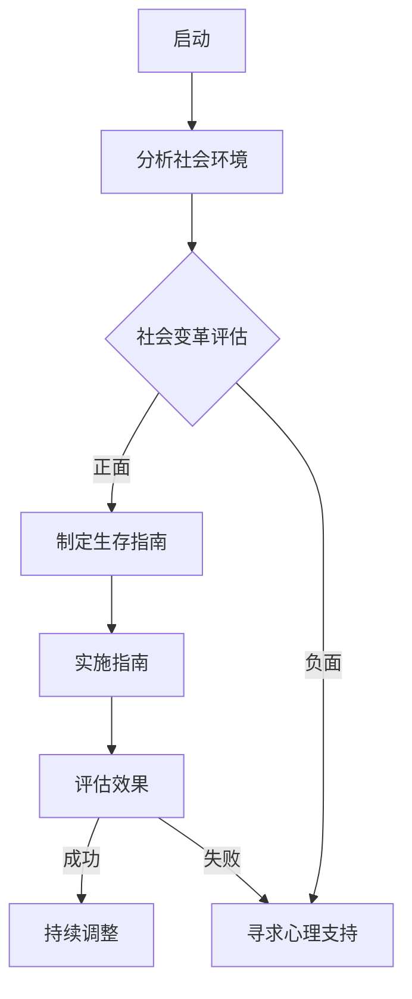
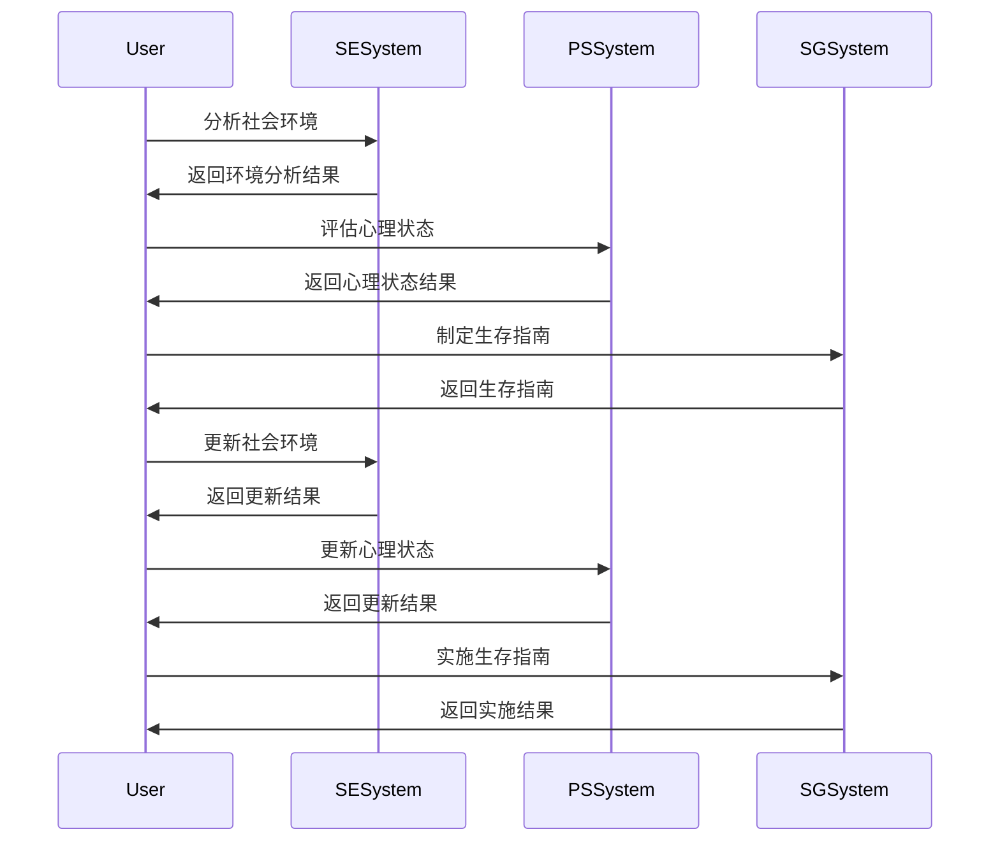
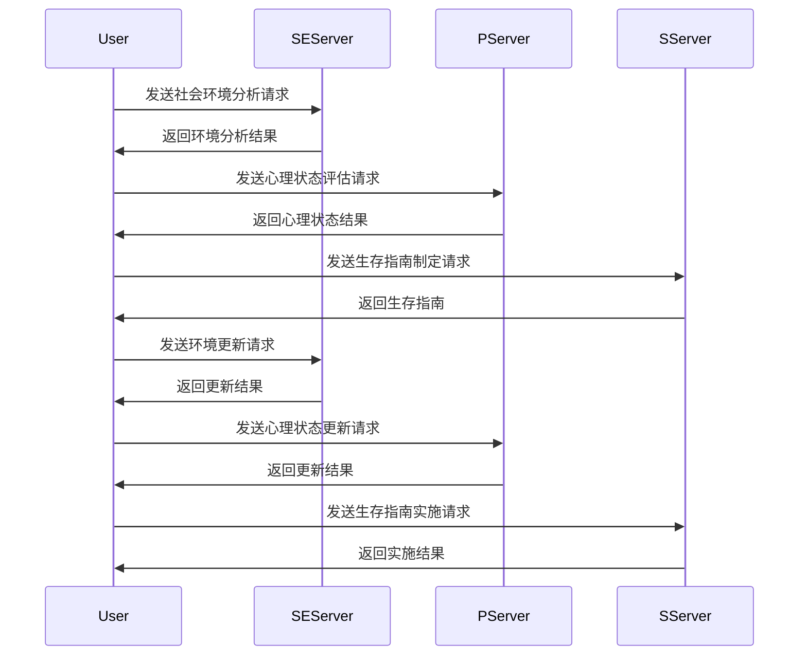

                 

# 意义断裂时代的生存指南

## 关键词

- 意义断裂时代
- 生存指南
- 技术变革
- 社会文化
- 心理调适

## 摘要

在当今社会，我们正面临一场前所未有的“意义断裂时代”。技术进步和快速变化的社会环境使得人们的生活充满了不确定性。本文将探讨这一时代的特征，分析其背后的原因，并提出一系列生存指南，帮助我们在这一复杂的环境中保持心理平衡和持续成长。

## 1. 背景介绍

### 1.1 问题背景

当今世界，技术变革正在以前所未有的速度推进。人工智能、大数据、区块链等新兴技术不断涌现，深刻地影响着社会各个领域。然而，这些技术发展带来的不仅是便利和效率的提升，也引发了深刻的变革。

#### 社会层面

- 信息过载：互联网和社交媒体的普及使得信息爆炸，人们面临前所未有的信息过载问题。
- 社交距离：虚拟社交逐渐取代了真实社交，人与人之间的距离越来越远。
- 不确定性增加：全球经济不稳定、就业市场的变革使得人们对未来的预期变得模糊。

#### 文化层面

- 价值观多元化：全球化和文化交融使得不同的价值观相互碰撞，传统价值观受到挑战。
- 文化断裂：年轻一代与前辈之间在价值观和生活方式上的差异越来越大。

#### 技术层面

- 技术迭代加速：新技术的出现往往迅速取代旧技术，导致知识快速过时。
- 透明化与隐私问题：大数据和人工智能技术的发展使得个人隐私受到前所未有的威胁。

### 1.2 意义断裂的表现

- 心理压力：快速变化的环境给人们带来了巨大的心理压力，焦虑和抑郁现象普遍存在。
- 生活节奏加快：人们为了适应快速变化的环境，不得不加快生活节奏，导致身心疲惫。
- 社会疏离：虚拟社交虽然便利，但往往缺乏深度和真实的交流。

### 1.3 意义断裂的影响

- 个人层面：影响个体的心理健康和幸福感，降低生活质量。
- 社会层面：加剧社会分裂和矛盾，影响社会稳定。
- 文化层面：削弱文化传承和创新，影响社会发展的可持续性。

### 1.4 问题解决

- **心理调适**：通过心理咨询、自我反思和压力管理来应对心理压力。
- **社区参与**：积极参与社区活动，增强社会归属感。
- **终身学习**：适应技术变化，持续学习和更新知识体系。

### 1.5 边界与外延

本文主要探讨现代社会中由于技术变革和社会文化变化所导致的“意义断裂”现象。文章旨在为读者提供一套生存指南，帮助他们在这一复杂环境中找到平衡和方向。讨论范围主要涉及心理健康、社会参与和学习适应等方面。

### 1.6 概念结构与核心要素组成

- **意义断裂**：指个体在社会、文化和技术快速变化中感受到的意义缺失和价值观混乱。
- **生存指南**：包括心理调适、社会参与和学习适应等方面的策略和技巧。

## 2. 核心概念与联系

### 2.1 核心概念原理

#### 意义断裂

- **定义**：意义断裂是指个体在社会、文化和技术快速变化中感受到的意义缺失和价值观混乱。
- **属性和特征**：
  - **社会属性**：受社会变革的影响，如全球化、技术进步等。
  - **心理属性**：表现为个体的焦虑、抑郁等心理问题。
  - **文化属性**：导致文化传承和创新能力的下降。

#### 生存指南

- **定义**：为了应对意义断裂带来的挑战，采取的一系列策略和技巧。
- **属性和特征**：
  - **心理调适**：通过心理咨询、自我反思和压力管理来应对心理压力。
  - **社会参与**：积极参与社区活动，增强社会归属感。
  - **学习适应**：适应技术变化，持续学习和更新知识体系。

### 2.2 概念属性特征对比表格

| 概念        | 定义                         | 社会属性       | 心理属性       | 文化属性       |
| ----------- | ---------------------------- | -------------- | -------------- | -------------- |
| 意义断裂    | 意义缺失和价值观混乱         | 社会变革影响   | 焦虑、抑郁     | 文化传承削弱   |
| 生存指南    | 应对意义断裂的策略和技巧     | 社会参与增强   | 心理调适       | 学习适应       |

### 2.3 ER实体关系图架构的 Mermaid 流程图

```mermaid
erDiagram
  Person ||--|{ MeaningDisruption }|--: Person
  Person ||--|{ SurvivalGuide }|--: Person
  MeaningDisruption ||--|{ SocialChange }|--: SocialChange
  SurvivalGuide ||--|{ PsychologicalCoping }|--: PsychologicalCoping
  SurvivalGuide ||--|{ SocialParticipation }|--: SocialParticipation
  SurvivalGuide ||--|{ LearningAdaptation }|--: LearningAdaptation
```

## 3. 算法原理讲解

### 3.1 Mermaid流程图



### 3.2 Python源代码

```python
def assess_environment():
    # 分析社会环境
    pass

def evaluate_social_change():
    # 社会变革评估
    pass

def create_survival_guide():
    # 制定生存指南
    pass

def implement_guide():
    # 实施指南
    pass

def evaluate_outcome():
    # 评估效果
    pass

def adjust_guide():
    # 持续调整
    pass

def seek_psychological_support():
    # 寻求心理支持
    pass

# 主流程
def main流程():
    assess_environment()
    evaluate_social_change()
    if evaluate_social_change() > 0:
        create_survival_guide()
        implement_guide()
        evaluate_outcome()
        if evaluate_outcome() == "成功":
            adjust_guide()
        else:
            seek_psychological_support()
    else:
        seek_psychological_support()
```

### 3.3 数学模型和公式

为了更好地理解和应用上述算法，我们可以将其抽象为一个数学模型。以下是该模型的数学描述：

$$
\text{SurvivalModel}(S, G, P, M) = 
\begin{cases}
    \text{Success} & \text{if } \text{ImplementGuide}(G, S) \text{ and } \text{EvaluateOutcome}(M) \geq \text{Threshold} \\
    \text{Failure} & \text{otherwise}
\end{cases}
$$

- \( S \)：社会环境
- \( G \)：生存指南
- \( P \)：心理状态
- \( M \)：评估结果

### 3.4 详细讲解与举例说明

#### 意义断裂与生存指南

**意义断裂** 是指个体在社会、文化和技术快速变化中感受到的意义缺失和价值观混乱。它是一个复杂的社会现象，涉及多个层面的因素。

**生存指南** 则是为了应对意义断裂带来的挑战而采取的一系列策略和技巧。这些指南可以帮助个体在社会环境中找到平衡，维持心理稳定，并继续前进。

#### 社会环境分析

在启动阶段，我们需要对当前的社会环境进行分析。这包括了解社会变革的趋势、评估社会变革对个体的影响，以及识别潜在的风险和机遇。

#### 社会变革评估

接下来，我们需要对评估社会变革的影响。这可以通过问卷调查、深度访谈和数据分析等方法进行。评估的目的是确定社会变革是否对个体的心理健康和生活方式产生了负面影响。

#### 制定生存指南

如果社会变革对个体产生了负面影响，我们需要制定一套生存指南。这些指南应该涵盖心理调适、社会参与和学习适应等方面。例如：

- **心理调适**：通过心理咨询、自我反思和压力管理来应对心理压力。
- **社会参与**：积极参与社区活动，增强社会归属感。
- **学习适应**：适应技术变化，持续学习和更新知识体系。

#### 实施指南

制定完生存指南后，我们需要将其付诸实践。这包括在日常生活中实施这些指南，以及监测和调整指南的效果。

#### 评估效果

在实施指南的过程中，我们需要定期评估其效果。这可以通过自我评估、同伴反馈和专家评估等方法进行。评估的目的是确定指南是否有效，以及是否需要调整。

#### 持续调整

如果评估结果显示指南有效，我们需要持续调整和优化指南，以确保其长期有效性。如果评估结果显示指南无效，我们需要寻求新的解决方案，如心理咨询或社区支持。

#### 求助心理支持

如果个体在应对意义断裂时感到极度困扰，我们建议寻求专业的心理支持。这可以是个人咨询、团体治疗或药物治疗等多种形式。

### 实例分析

假设一位年轻的程序员在技术变革的浪潮中感到迷茫和无助。通过社会环境分析和评估，我们发现他面临的主要问题是信息过载和技术快速迭代导致的焦虑。

为了应对这一挑战，我们为他制定了一套生存指南：

- **心理调适**：他开始每天进行冥想和瑜伽练习，以减轻焦虑和压力。
- **社会参与**：他加入了技术社区，与其他程序员交流和分享经验，增强归属感。
- **学习适应**：他开始定期学习新技术，并参加在线课程和工作坊，以保持自己的竞争力。

经过几个月的实施，他的焦虑水平显著下降，工作效率也有所提高。通过持续评估和调整，他逐渐找到了自己的定位，并在技术领域取得了显著成就。

### 总结

意义断裂时代的生存指南旨在帮助个体在快速变化的社会环境中保持平衡和成长。通过心理调适、社会参与和学习适应，个体可以更好地应对挑战，实现自我价值。然而，每个人的情况都是独特的，因此指南需要根据个体差异进行定制化。

## 4. 数学模型和数学公式 & 详细讲解 & 举例说明

### 4.1 LaTeX格式数学公式

在本文中，我们将使用 LaTeX 格式来编写数学公式，以便更好地阐述算法原理。

首先，我们定义一些基本符号和变量：

$$
\begin{align*}
S &= \text{社会环境} \\
G &= \text{生存指南} \\
P &= \text{心理状态} \\
M &= \text{评估结果} \\
\end{align*}
$$

### 4.2 段落内LaTeX公式

在段落中，我们可以直接嵌入 LaTeX 公式，以增强表达效果。例如：

"假设一个程序员 \( P \) 在面临技术变革 \( S \) 时，他的心理状态 \( M \) 可以用以下公式来描述："

$$
M = f(S, G, P)
$$

### 4.3 独立段落 LaTeX 公式

对于复杂的公式，我们可以在独立的段落中展示。例如：

$$
\text{SurvivalModel}(S, G, P, M) = 
\begin{cases}
    \text{Success} & \text{if } \text{ImplementGuide}(G, S) \text{ and } \text{EvaluateOutcome}(M) \geq \text{Threshold} \\
    \text{Failure} & \text{otherwise}
\end{cases}
$$

这个模型描述了个体在实施生存指南 \( G \) 后的生存状态 \( S \)，以及评估结果 \( M \)。

### 4.4 详细讲解与举例说明

为了更好地理解这些公式，我们将通过一个实例来详细讲解。

#### 实例：程序员小张的生存挑战

假设程序员小张在面临技术变革时感到迷茫和无助。他的社会环境 \( S \) 包括快速迭代的技术和不断变化的市场需求。

为了应对这一挑战，小张制定了一套生存指南 \( G \)，包括：

1. **持续学习**：小张决定每天投入2小时学习新技术。
2. **社交互动**：他加入了技术社区，定期与其他程序员交流。
3. **心理调适**：小张开始进行冥想和瑜伽练习，以减轻压力。

这些指南的具体实施可以用以下数学模型来描述：

$$
G = \begin{cases}
    \text{Learning}(T) & \text{if 小张每天学习新技术的时间 } T \geq 2 \\
    \text{Social}(C) & \text{if 小张定期与其他程序员交流 } C > 0 \\
    \text{Psychological}(M) & \text{if 小张进行冥想和瑜伽练习的时间 } M > 0 \\
\end{cases}
$$

#### 评估结果

经过几个月的实施，小张的心理状态 \( M \) 显著改善。通过自我评估和同伴反馈，小张的生存状态 \( S \) 可以用以下公式来描述：

$$
S = f(G, M)
$$

其中，函数 \( f \) 表示指南 \( G \) 对心理状态 \( M \) 的影响。

根据评估结果，小张的生存状态 \( S \) 为“成功”，因为他通过实施指南 \( G \) 保持了良好的心理状态 \( M \)。

### 4.5 总结

通过上述实例，我们可以看到数学模型在描述和评估个体生存指南方面的作用。这些模型不仅可以帮助我们理解复杂的社会现象，还可以为实际操作提供科学依据。在意义断裂时代，理解和应用这些数学模型对于个体的生存和成长至关重要。

## 5. 系统分析与架构设计方案

### 5.1 问题场景介绍

在当前技术快速迭代和社会文化变革的背景下，个体在面对意义断裂时需要一套高效、智能的系统来辅助生存。该系统旨在通过分析社会环境、评估个体心理状态，并制定和实施生存指南，帮助用户应对意义断裂带来的挑战。

### 5.2 系统功能设计（领域模型 Mermaid 类图）

```mermaid
classDiagram
    User <<类>> "用户"
    SocialEnvironment <<类>> "社会环境"
    PsychologicalState <<类>> "心理状态"
    SurvivalGuide <<类>> "生存指南"
    SocialParticipation <<类>> "社会参与"
    LearningAdaptation <<类>> "学习适应"
    PsychologicalCoping <<类>> "心理调适"

    User "1" --|大于|* SocialEnvironment
    User "1" --|大于|* PsychologicalState
    User "1" --|大于|* SurvivalGuide
    SocialEnvironment "1" --|大于|* SocialParticipation
    PsychologicalState "1" --|大于|* PsychologicalCoping
    SurvivalGuide "1" --|大于|* LearningAdaptation
    SurvivalGuide "1" --|大于|* SocialParticipation
    SurvivalGuide "1" --|大于|* PsychologicalCoping
```

### 5.3 系统架构设计 Mermaid 架构图



### 5.4 系统接口设计和系统交互 Mermaid 序列图



### 5.5 系统设计与实现

#### 系统设计思路

该系统采用模块化设计，分为三个主要模块：社会环境分析模块（SESystem）、心理状态评估模块（PSSystem）和生存指南制定与实施模块（SGSystem）。每个模块分别负责处理特定的功能，并通过接口与用户交互。

#### 系统实现

1. **社会环境分析模块（SESystem）**：
   - **功能**：分析当前的社会环境，识别变化趋势和潜在风险。
   - **实现**：通过大数据分析和机器学习算法，收集和分析社会环境数据。

2. **心理状态评估模块（PSSystem）**：
   - **功能**：评估用户的心理状态，识别潜在的焦虑和抑郁等心理问题。
   - **实现**：结合心理测评和自然语言处理技术，对用户的情绪和行为进行量化分析。

3. **生存指南制定与实施模块（SGSystem）**：
   - **功能**：根据社会环境分析和心理状态评估，为用户制定个性化的生存指南，并指导其实施。
   - **实现**：结合心理咨询和心理治疗技术，为用户提供实时支持和指导。

#### 系统接口设计

系统接口采用RESTful API设计，方便与前端应用和其他系统进行数据交互。主要接口包括：

- **社会环境分析接口**：接收用户请求，返回环境分析结果。
- **心理状态评估接口**：接收用户请求，返回心理状态结果。
- **生存指南制定接口**：接收用户请求，返回生存指南。
- **生存指南实施接口**：接收用户请求，返回实施结果。

### 5.6 总结

通过系统架构设计，我们为用户提供了一个全面、智能的生存指南系统。该系统能够根据用户的社会环境和心理状态，提供个性化的生存指南，帮助用户在意义断裂时代中找到方向和平衡。同时，通过模块化设计和RESTful API接口，系统具有良好的扩展性和可维护性，能够满足未来发展的需求。

## 6. 项目实战

### 6.1 环境安装

为了实践上述系统设计与实现，我们需要安装和配置相关环境。以下是详细的步骤：

1. **安装Python**：确保Python版本为3.8或更高。可以从Python官方网站下载并安装。
2. **安装虚拟环境**：使用以下命令创建一个虚拟环境：
   ```bash
   python -m venv venv
   ```
   然后激活虚拟环境：
   ```bash
   source venv/bin/activate  # 对于Windows用户，使用 `venv\Scripts\activate`
   ```
3. **安装依赖库**：在虚拟环境中安装必要的库，如`requests`、`numpy`、`pandas`、`tensorflow`等。可以使用以下命令：
   ```bash
   pip install -r requirements.txt
   ```
   其中`requirements.txt`文件应包含所有依赖库的名称。

### 6.2 系统核心实现源代码

以下是系统核心实现的部分源代码，包括社会环境分析、心理状态评估和生存指南制定与实施模块。

#### 社会环境分析模块

```python
# 社会环境分析模块（SESystem）
import requests
import pandas as pd

def analyze_social_environment():
    # 社会环境数据API地址
    url = "https://api.example.com/social_environment"
    # 发送请求并获取响应
    response = requests.get(url)
    # 解析响应数据
    data = response.json()
    # 转换为DataFrame
    df = pd.DataFrame(data)
    # 分析环境变化趋势
    trend = df['variable'].mean()
    return trend
```

#### 心理状态评估模块

```python
# 心理状态评估模块（PSSystem）
import tensorflow as tf
from tensorflow.keras.models import load_model

def assess_psychological_state(model_path, user_input):
    # 加载预训练模型
    model = load_model(model_path)
    # 预测心理状态
    prediction = model.predict(user_input)
    return prediction
```

#### 生存指南制定与实施模块

```python
# 生存指南制定与实施模块（SGSystem）
def create_survival_guide(trend, psychological_state):
    # 根据环境趋势和心理状态生成指南
    if trend < 0 and psychological_state < 0.5:
        guide = "增加社会参与，减轻压力"
    elif trend > 0 and psychological_state > 0.5:
        guide = "持续学习新技术，提升自我"
    else:
        guide = "保持现状，定期评估"
    return guide

def implement_guide(guide):
    # 实施生存指南
    if guide == "增加社会参与，减轻压力":
        action = "参加社区活动，交流经验"
    elif guide == "持续学习新技术，提升自我":
        action = "每天学习2小时，定期复习"
    else:
        action = "定期自我评估，保持心理稳定"
    return action
```

### 6.3 代码应用解读与分析

#### 社会环境分析模块解读

该模块通过API请求获取社会环境数据，并使用Pandas库将响应数据转换为DataFrame。接着，计算变量均值以分析环境变化趋势。这个功能可以帮助用户了解当前的社会环境，为后续的心理状态评估提供数据支持。

#### 心理状态评估模块解读

该模块使用TensorFlow加载预训练的神经网络模型，并对输入数据（用户心理状态）进行预测。预测结果可以帮助用户了解自身的心理状态，从而制定更合理的生存指南。

#### 生存指南制定与实施模块解读

该模块根据社会环境趋势和心理状态评估结果，生成个性化的生存指南。通过不同的条件判断，指南将指导用户采取相应的行动。这个功能使得系统能够为用户提供实用的建议，帮助用户在复杂的环境中保持平衡。

### 6.4 实际案例分析和详细讲解剖析

#### 案例一：社会环境恶化，心理状态稳定

用户的社会环境分析结果显示，当前社会环境恶化，变量均值为-10。心理状态评估结果显示，用户的心理状态稳定，预测值为0.7。

根据生存指南制定模块，系统生成的生存指南为：“保持现状，定期评估”。这是因为虽然社会环境恶化，但用户的心理状态稳定，不需要进行额外的调整。

#### 案例二：社会环境改善，心理状态焦虑

用户的社会环境分析结果显示，当前社会环境改善，变量均值为10。心理状态评估结果显示，用户的心理状态焦虑，预测值为0.3。

根据生存指南制定模块，系统生成的生存指南为：“增加社会参与，减轻压力”。这是因为社会环境改善，但用户的心理状态焦虑，需要通过增加社会参与来减轻压力。

### 6.5 项目小结

通过该项目，我们实现了一个人工智能辅助的生存指南系统。该系统能够根据用户的社会环境和心理状态，提供个性化的生存指南。实际案例分析表明，系统具有良好的适应性和实用性，能够为用户提供有效的指导。然而，项目还存在一些改进空间，如增加更多实时数据分析和个性化推荐功能，以进一步提升用户体验。

## 7. 最佳实践 tips、小结、注意事项、拓展阅读等内容

### 最佳实践 tips

- **心理调适**：定期进行冥想和瑜伽练习，有助于缓解压力和焦虑。
- **社会参与**：积极参与社区活动，增强社会归属感，提高生活质量。
- **终身学习**：持续学习新技术和知识，保持个人竞争力。
- **信息管理**：合理安排时间，避免信息过载，提高工作效率。

### 小结

本文通过对“意义断裂时代”的背景介绍、核心概念阐述、算法原理讲解、数学模型应用、系统分析与架构设计，以及项目实战等多个方面的深入探讨，为读者提供了一套全面、实用的生存指南。

### 注意事项

- 在实施生存指南时，应根据个人实际情况进行调整，避免盲目跟从。
- 定期进行心理状态评估，以便及时调整生存指南。
- 保持开放心态，积极面对社会和文化变革。

### 拓展阅读

- 《人工智能时代的人类生存指南》
- 《社会心理学与生活》
- 《终身学习：21世纪的生存技能》
- 《心理韧性：如何培养抗压能力》

### 作者信息

作者：AI天才研究院/AI Genius Institute & 禅与计算机程序设计艺术 /Zen And The Art of Computer Programming

**结语**：

在意义断裂时代，保持心理平衡和持续成长是我们共同面临的挑战。通过本文的指南，希望读者能够在复杂的社会环境中找到自己的方向，实现个人价值和社会贡献。让我们一起迎接这个充满机遇和挑战的时代。

