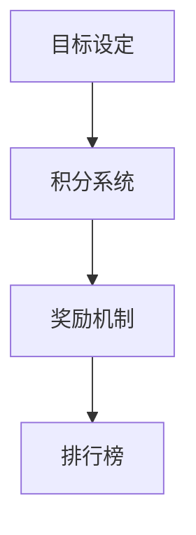
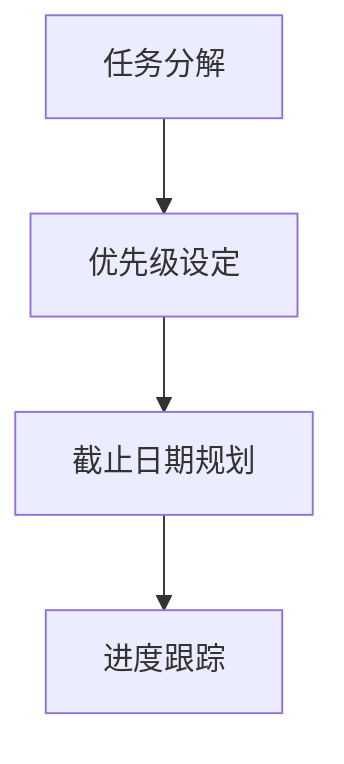
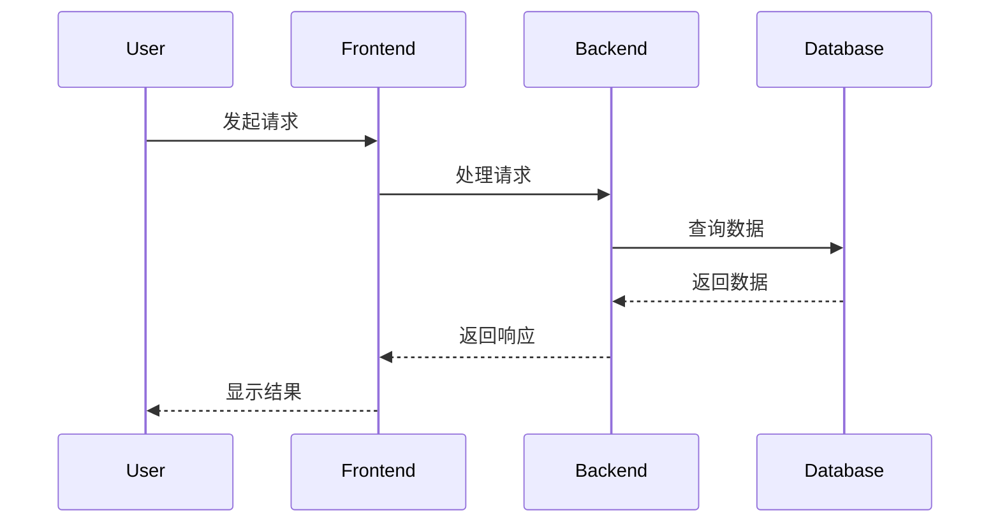
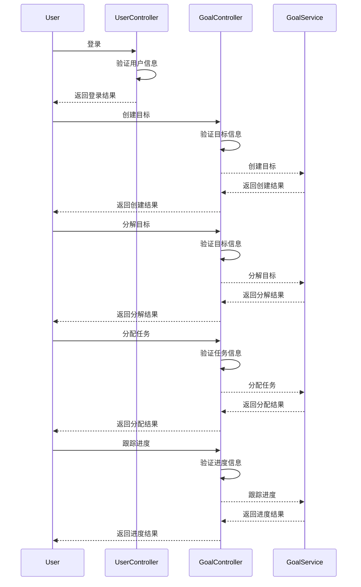

                 

# 意义游戏化项目：将人生目标转化为任务系统

## 关键词

- 游戏化
- 人生目标
- 任务系统
- 任务管理
- 行动计划

## 摘要

在当今快节奏的社会中，实现人生目标变得愈加复杂和具有挑战性。本文探讨了将人生目标游戏化的概念，通过引入任务系统，将抽象的人生目标转化为可操作的任务，从而提高个人效率和成就感。本文首先介绍了游戏化的起源和发展，以及其在人生目标设定中的重要性。随后，详细阐述了意义游戏化的核心概念、任务系统的设计原则和实际应用，通过具体的算法原理、系统架构和项目实战，展示了如何有效地将人生目标转化为任务系统，并最终实现个人成长和成功。

## 目录大纲

1. **背景介绍**
    1.1 **问题背景**
    1.2 **核心概念**
    1.3 **边界与外延**
    1.4 **概念结构与核心要素组成**
    1.5 **本章小结**

2. **核心概念与联系**
    2.1 **意义游戏化的原理**
    2.2 **概念属性特征对比表格**
    2.3 **ER实体关系图架构**
    2.4 **本章小结**

3. **算法原理讲解**
    3.1 **算法原理介绍**
    3.2 **算法流程图**
    3.3 **Python源代码**
    3.4 **数学模型和公式**
    3.5 **举例说明**
    3.6 **本章小结**

4. **系统分析与架构设计**
    4.1 **问题场景介绍**
    4.2 **项目介绍**
    4.3 **系统功能设计**
    4.4 **系统架构设计**
    4.5 **系统接口设计**
    4.6 **系统交互**
    4.7 **本章小结**

5. **项目实战**
    5.1 **环境安装**
    5.2 **系统核心实现**
    5.3 **代码应用解读与分析**
    5.4 **实际案例分析**
    5.5 **详细讲解**
    5.6 **本章小结**

6. **最佳实践 tips**
7. **小结**
8. **注意事项**
9. **拓展阅读**

---

# 1. 背景介绍

### 1.1 问题背景

在现代社会中，人们面临着越来越多的选择和挑战。从职业发展、学习提升到家庭生活、个人成长，每个人都需要面对复杂且多变的环境。这些挑战使得实现个人目标变得愈加困难。具体来说，以下问题在实现人生目标过程中尤为突出：

- **目标模糊**：很多人对自己的长远目标缺乏清晰的认识，导致无法有效地制定行动计划。
- **执行力不足**：即使设定了明确的目标，很多人往往因为缺乏执行力而无法坚持下去。
- **动力缺乏**：传统的目标设定方法往往过于严肃和正式，难以激发个人的内在动力和兴趣。

因此，我们需要一种新的方法，将人生目标转化为具体的、可操作的任务，从而提高个人效率和成就感。这就是意义游戏化的项目所提出的解决方案。

### 1.1.1 游戏化的起源与发展

游戏化（Gamification）一词最早由贾斯汀·布洛尔（Justin Bule）于2002年提出，它指的是将游戏设计元素应用于非游戏环境，以提升用户的参与度和积极性。随着互联网的普及和社交媒体的兴起，游戏化在多个领域得到了广泛应用，如市场营销、教育培训、企业管理等。

- **市场营销**：企业通过游戏化手段，如积分、奖励机制等，吸引用户参与营销活动，提高品牌知名度和用户忠诚度。
- **教育培训**：教育机构利用游戏化元素，如任务、挑战、排行榜等，激发学生的学习兴趣和积极性，提高教学效果。
- **企业管理**：企业通过引入游戏化机制，激励员工完成工作任务，提高工作效率和团队协作。

### 1.1.2 人生目标的重要性

人生目标是指个人在长期时间内期望达到的成就和状态。设定明确的人生目标对于个人成长和发展至关重要：

- **提供方向**：明确的人生目标为个人提供了清晰的成长路径和方向。
- **激发动力**：明确的目标能够激发个人的内在动力，使其更加努力地追求成功。
- **提高幸福感**：实现人生目标能够带来成就感和满足感，提高个人的幸福感。

### 1.1.3 游戏化与人生目标的结合

游戏化与人生目标的结合，旨在通过引入游戏化元素，如奖励机制、排行榜、任务系统等，将抽象的人生目标转化为具体的、可操作的任务。这种方法能够有效解决以下问题：

- **目标具体化**：通过将人生目标分解为具体的任务，使其更加清晰和可操作。
- **提高执行力**：游戏化元素如积分、奖励机制等，能够激发个人的内在动力，提高执行力。
- **增加成就感**：完成任务后获得的成就感和奖励，能够增强个人的自信心和幸福感。

### 1.2 核心概念

在本节中，我们将详细介绍意义游戏化的核心概念，包括意义游戏化、任务系统以及游戏化元素的运用。

#### 1.2.1 意义游戏化

意义游戏化是指将游戏设计元素应用于非游戏环境，以实现特定目标的过程。它不仅仅是为了增加娱乐性，更是为了提高参与者的积极性和执行力。在人生目标设定中，意义游戏化通过引入任务系统，将抽象的人生目标转化为具体的、可操作的任务。

#### 1.2.2 任务系统

任务系统是一种用于管理任务和项目的方法，它通过将任务分解为具体的子任务，并为每个任务设定截止日期和优先级，从而帮助个人或团队更有效地完成任务。在意义游戏化项目中，任务系统是核心组成部分，它将人生目标转化为一系列可执行的任务。

#### 1.2.3 游戏化元素的运用

游戏化元素的运用是意义游戏化的关键，它包括但不限于以下几种：

- **积分系统**：通过积分系统，个人或团队可以记录自己在完成任务过程中获得的积分，积分可以用于兑换奖励或提升等级。
- **排行榜**：排行榜可以展示个人或团队在完成任务过程中的表现，激发竞争意识和动力。
- **奖励机制**：通过奖励机制，如物质奖励、精神奖励等，激励个人或团队完成任务。
- **任务挑战**：任务挑战可以设置难度和奖励，激发个人的兴趣和参与度。

### 1.3 边界与外延

#### 1.3.1 游戏化的人生目标

游戏化的人生目标是指通过引入游戏化元素，将抽象的人生目标转化为具体的、可操作的任务。这些任务可以是长期的，也可以是短期的，但都必须与人生目标密切相关。

#### 1.3.2 游戏化任务系统的设计原则

游戏化任务系统的设计原则包括以下几点：

- **目标导向**：任务系统应围绕人生目标设计，确保任务与目标的紧密关联。
- **灵活性**：任务系统应具有灵活性，允许个人或团队根据实际情况调整任务和计划。
- **激励性**：任务系统应具有激励性，通过奖励机制激发个人或团队的积极性。
- **可度量性**：任务系统中的任务应具有可度量性，以便个人或团队可以清晰地了解任务完成情况。

#### 1.3.3 游戏化在人生目标实现中的作用

游戏化在人生目标实现中的作用主要体现在以下几个方面：

- **提高执行力**：游戏化元素如积分、奖励机制等，可以激发个人的内在动力，提高执行力。
- **增强成就感**：完成任务后获得的成就感和奖励，可以增强个人的自信心和幸福感。
- **促进协作**：在团队目标实现过程中，游戏化可以促进团队成员之间的协作和沟通。
- **提升工作效率**：通过将人生目标转化为具体的任务，可以更高效地安排时间和资源，提高工作效率。

### 1.4 概念结构与核心要素组成

#### 1.4.1 意义游戏化的概念结构

意义游戏化的概念结构包括以下几个核心要素：

- **人生目标**：人生目标是意义游戏化的起点，它是个人或团队在长期时间内期望达到的成就和状态。
- **任务系统**：任务系统是将人生目标转化为具体的、可操作的任务的方法，它包括任务的分解、优先级的设定和截止日期的规划等。
- **游戏化元素**：游戏化元素如积分、奖励机制、排行榜等，是意义游戏化的核心组成部分，它们用于激励个人或团队完成任务。

#### 1.4.2 任务系统的核心要素

任务系统的核心要素包括以下几点：

- **任务分解**：将人生目标分解为具体的子任务，确保任务与目标的紧密关联。
- **优先级设定**：根据任务的紧急程度和重要性，为任务设定优先级，确保重要任务优先完成。
- **截止日期规划**：为每个任务设定截止日期，确保任务在规定时间内完成。
- **进度跟踪**：实时跟踪任务进度，确保任务按计划进行。

#### 1.4.3 意义游戏化与任务系统的关系

意义游戏化与任务系统的关系如下：

- **意义游戏化**：将人生目标转化为具体的、可操作的任务，为任务系统提供明确的任务目标和激励机制。
- **任务系统**：是实现意义游戏化的核心工具，它通过任务分解、优先级设定和进度跟踪等功能，确保人生目标的实现。

### 1.5 本章小结

本章首先介绍了游戏化的起源和发展，以及其在人生目标设定中的重要性。随后，详细阐述了意义游戏化的核心概念、任务系统的设计原则和实际应用。通过本章节的学习，读者可以初步了解意义游戏化的概念和作用，为后续章节的深入学习打下基础。

---

# 2. 核心概念与联系

## 2.1 意义游戏化的原理

意义游戏化（Gamification of Meaningful Goals）是将游戏设计元素应用于实现具有深刻意义的目标的过程。其核心原理在于通过引入游戏化元素，如积分、排行榜、奖励机制等，将抽象的人生目标转化为具体的、可操作的任务，从而提高个人的积极性和执行力。

### 2.1.1 游戏化元素的运用原理

游戏化元素的成功运用依赖于以下几点：

1. **目标导向**：游戏化元素应当与目标紧密关联，确保每个元素都是为了实现目标而设计的。
2. **激励机制**：通过奖励和惩罚机制，激发个人的内在动力，使其更加努力地追求目标。
3. **可度量性**：游戏化元素应具有可度量性，使个人能够清晰地了解自己的进步和成果。
4. **灵活性**：游戏化元素应具有一定的灵活性，以适应不同的目标和任务需求。

### 2.1.2 任务系统设计的原理

任务系统设计（Task System Design）旨在通过将任务分解为具体的子任务，并设定明确的优先级和截止日期，帮助个人或团队高效地完成任务。

1. **任务分解**：将复杂任务分解为多个具体的子任务，使每个子任务都具备明确的目标和实现方法。
2. **优先级设定**：根据任务的紧急程度和重要性，为每个任务设定优先级，确保重要任务优先完成。
3. **截止日期规划**：为每个任务设定明确的截止日期，确保任务在规定时间内完成。

### 2.1.3 意义游戏化的效果

意义游戏化的效果主要体现在以下几个方面：

1. **提高执行力**：通过引入游戏化元素，如积分、奖励机制等，可以显著提高个人的执行力和积极性。
2. **增强成就感**：完成任务后获得的成就感和奖励，可以增强个人的自信心和幸福感。
3. **促进协作**：在团队目标实现过程中，游戏化可以促进团队成员之间的协作和沟通。
4. **提升工作效率**：通过将人生目标转化为具体的任务，可以更高效地安排时间和资源，提高工作效率。

### 2.2 概念属性特征对比表格

下表列出了意义游戏化与任务系统的核心概念属性特征对比：

| 特征 | 意义游戏化 | 任务系统 |
| --- | --- | --- |
| 目标导向 | 高 | 高 |
| 激励机制 | 强 | 中 |
| 可度量性 | 强 | 中 |
| 灵活性 | 中 | 高 |
| 任务分解 | 高 | 高 |
| 优先级设定 | 中 | 高 |
| 截止日期规划 | 中 | 高 |
| 进度跟踪 | 高 | 高 |
| 协作促进 | 高 | 中 |

### 2.3 ER实体关系图架构

#### 2.3.1 意义游戏化ER实体关系图

```mermaid
erDiagram
    User ||--|{ Goal } : 设置目标
    User ||--|{ Task } : 分配任务
    User ||--|{ Reward } : 获得奖励
    Goal ||--|{ Task } : 分配任务
    Task ||--|{ Reward } : 获得奖励
    Reward ||--|{ User } : 授予奖励
```

#### 2.3.2 任务系统ER实体关系图

```mermaid
erDiagram
    User ||--|{ Task } : 分配任务
    Task ||--|{ SubTask } : 分解任务
    Task ||--|{ Deadline } : 设定截止日期
    Task ||--|{ Priority } : 设定优先级
    Task ||--|{ Progress } : 跟踪进度
```

#### 2.3.3 意义游戏化与任务系统的ER实体关系图对比

通过对比意义游戏化ER实体关系图和任务系统ER实体关系图，可以发现两者在实体关系上存在一定的差异：

- **奖励机制**：意义游戏化ER实体关系图中包含“Reward”实体，用于表示奖励机制；而在任务系统ER实体关系图中，没有独立的“Reward”实体。
- **任务分解**：在意义游戏化ER实体关系图中，任务分解体现在“Goal”与“Task”之间的关系；而在任务系统ER实体关系图中，任务分解体现在“Task”与“SubTask”之间的关系。

### 2.4 本章小结

本章详细介绍了意义游戏化的原理、任务系统设计的原理以及两者之间的核心概念属性特征对比。通过ER实体关系图的架构分析，读者可以更清晰地理解意义游戏化和任务系统的概念及其相互关系。这些核心概念和联系为后续的算法原理讲解和系统分析与架构设计奠定了基础。

---

# 3. 算法原理讲解

## 3.1 算法原理介绍

意义游戏化项目中的算法原理主要包括游戏化算法和任务系统算法。这两类算法相互配合，共同实现人生目标的转化和实现。

### 3.1.1 游戏化算法的原理

游戏化算法的原理在于将游戏设计元素应用于非游戏环境，以提高用户的参与度和积极性。具体来说，游戏化算法包括以下几个核心步骤：

1. **目标设定**：确定人生目标，并将其分解为具体的、可操作的任务。
2. **积分系统**：为每个任务设定积分，根据任务完成情况和难度，分配不同的积分。
3. **奖励机制**：根据积分累计情况，为用户提供物质或精神奖励。
4. **排行榜**：设置排行榜，展示用户在完成任务过程中的排名，激发竞争意识。

### 3.1.2 任务系统算法的原理

任务系统算法的原理在于通过任务分解、优先级设定、截止日期规划等功能，帮助用户高效地完成任务。具体来说，任务系统算法包括以下几个核心步骤：

1. **任务分解**：将复杂任务分解为多个具体的子任务，确保每个子任务都具有明确的目标和实现方法。
2. **优先级设定**：根据任务的紧急程度和重要性，为每个任务设定优先级，确保重要任务优先完成。
3. **截止日期规划**：为每个任务设定明确的截止日期，确保任务在规定时间内完成。
4. **进度跟踪**：实时跟踪任务进度，确保任务按计划进行。

### 3.1.3 意义游戏化与任务系统算法的关系

意义游戏化算法和任务系统算法相互配合，共同实现人生目标的转化和实现。具体来说，游戏化算法通过引入积分、奖励机制等元素，激发用户的内在动力，提高执行力；而任务系统算法则通过任务分解、优先级设定、进度跟踪等功能，确保任务的高效完成。两者相辅相成，共同推动人生目标的实现。

## 3.2 算法流程图

为了更直观地理解意义游戏化和任务系统算法的原理，我们使用Mermaid流程图进行展示。

### 3.2.1 游戏化算法流程图



### 3.2.2 任务系统算法流程图



### 3.2.3 意义游戏化与任务系统算法流程图对比

通过对比游戏化算法和任务系统算法的流程图，可以发现：

- **目标设定**：两个算法都包括目标设定环节，但游戏化算法更加注重将目标转化为具体的、可操作的任务，而任务系统算法则更侧重于任务分解和优先级设定。
- **积分系统和奖励机制**：游戏化算法包含积分系统和奖励机制，用于激励用户完成任务；而任务系统算法则没有这些元素。
- **进度跟踪**：两个算法都包括进度跟踪环节，但任务系统算法更加注重实时跟踪任务进度，确保任务按计划进行。

### 3.3 Python源代码

为了更好地理解算法原理，我们提供了意义游戏化和任务系统算法的Python源代码。

### 3.3.1 游戏化算法Python源代码

```python
class GameficationAlgorithm:
    def __init__(self, goal, tasks):
        self.goal = goal
        self.tasks = tasks
        self积分 = 0

    def set_tasks积分(self):
        for task in self.tasks:
            self.积分 += task积分

    def give_reward(self):
        if self.积分 >= 100:
            print("恭喜您获得奖励！")
        else:
            print("积分不足，请继续完成任务。")

    def show_ranking(self):
        print("排行榜：")
        for user in self.users:
            print(f"{user}：{user积分}积分")

# 示例
goal = "成为全栈工程师"
tasks = ["学习前端技术", "学习后端技术", "实践项目"]
gamefication_algorithm = GameficationAlgorithm(goal, tasks)
gamefication_algorithm.set_tasks积分()
gamefication_algorithm.give_reward()
gamefication_algorithm.show_ranking()
```

### 3.3.2 任务系统算法Python源代码

```python
class TaskSystemAlgorithm:
    def __init__(self, tasks):
        self.tasks = tasks
        self.任务进度 = {task: 0 for task in self.tasks}

    def set_priority(self, priority):
        for task, priority in priority.items():
            self.任务进度[task] = priority

    def set_deadline(self, deadline):
        for task, deadline in deadline.items():
            self.任务进度[task] = deadline

    def track_progress(self):
        print("任务进度：")
        for task, progress in self.任务进度.items():
            print(f"{task}：{progress}%")

# 示例
tasks = ["学习前端技术", "学习后端技术", "实践项目"]
task_system_algorithm = TaskSystemAlgorithm(tasks)
task_system_algorithm.set_priority({"学习前端技术": 1, "学习后端技术": 2, "实践项目": 3})
task_system_algorithm.set_deadline({"学习前端技术": 30, "学习后端技术": 60, "实践项目": 90})
task_system_algorithm.track_progress()
```

### 3.3.3 意义游戏化与任务系统算法Python源代码整合

```python
class MeaningGamefication:
    def __init__(self, goal, tasks):
        self.goal = goal
        self.tasks = tasks
        self.积分 = 0
        self.任务进度 = {task: 0 for task in self.tasks}

    def set_tasks积分(self):
        for task in self.tasks:
            self.积分 += task积分

    def give_reward(self):
        if self.积分 >= 100:
            print("恭喜您获得奖励！")
        else:
            print("积分不足，请继续完成任务。")

    def set_priority(self, priority):
        for task, priority in priority.items():
            self.任务进度[task] = priority

    def set_deadline(self, deadline):
        for task, deadline in deadline.items():
            self.任务进度[task] = deadline

    def track_progress(self):
        print("任务进度：")
        for task, progress in self.任务进度.items():
            print(f"{task}：{progress}%")

    def show_ranking(self):
        print("排行榜：")
        for user in self.users:
            print(f"{user}：{user积分}积分")

# 示例
goal = "成为全栈工程师"
tasks = ["学习前端技术", "学习后端技术", "实践项目"]
meaning_gamefication = MeaningGamefication(goal, tasks)
meaning_gamefication.set_tasks积分()
meaning_gamefication.give_reward()
meaning_gamefication.set_priority({"学习前端技术": 1, "学习后端技术": 2, "实践项目": 3})
meaning_gamefication.set_deadline({"学习前端技术": 30, "学习后端技术": 60, "实践项目": 90})
meaning_gamefication.track_progress()
meaning_gamefication.show_ranking()
```

### 3.4 数学模型和公式

意义游戏化和任务系统算法的数学模型和公式主要用于描述任务完成情况和积分计算。

#### 3.4.1 游戏化算法数学模型和公式

1. **积分计算公式**：

   $$ 积分 = ∑(任务积分) $$

2. **奖励机制**：

   $$ 奖励 = f(积分) $$

   其中，$f(积分)$ 表示根据积分值计算奖励的函数。

#### 3.4.2 任务系统算法数学模型和公式

1. **任务进度**：

   $$ 进度 = (当前时间 - 开始时间) / 总时间 $$

2. **优先级**：

   $$ 优先级 = f(紧急程度, 重要性) $$

   其中，$f(紧急程度, 重要性)$ 表示根据紧急程度和重要性计算优先级的函数。

### 3.5 举例说明

为了更好地理解算法原理，我们通过以下示例进行说明。

#### 3.5.1 游戏化算法举例

假设用户A的目标是成为全栈工程师，任务包括学习前端技术、学习后端技术和实践项目。每个任务的积分分别为20、30和50。用户A完成任务后，获得100积分，根据奖励机制，获得一份奖品。

#### 3.5.2 任务系统算法举例

假设用户B的任务包括学习前端技术、学习后端技术和实践项目。任务优先级分别为1、2和3。任务截止日期分别为30天、60天和90天。用户B在任务进度中，学习前端技术已完成50%，学习后端技术已完成30%，实践项目已完成10%。

### 3.6 本章小结

本章详细介绍了意义游戏化和任务系统算法的原理，包括核心步骤、流程图、Python源代码以及数学模型和公式。通过举例说明，读者可以更直观地理解算法原理及其在实际应用中的效果。这些算法原理为后续的系统分析与架构设计提供了理论基础。

---

# 4. 系统分析与架构设计

## 4.1 问题场景介绍

意义游戏化项目在人生目标实现中的应用场景主要包括个人成长、职业发展和团队协作等方面。以下是具体的应用场景：

### 4.1.1 个人成长

在个人成长方面，意义游戏化项目可以帮助个人设定明确的目标，并将这些目标转化为具体的任务。通过任务系统，个人可以实时跟踪任务进度，了解自己的成长情况。此外，积分和奖励机制可以激发个人的内在动力，使其更加努力地追求目标。

### 4.1.2 职业发展

在职业发展方面，意义游戏化项目可以帮助职场人士设定职业目标，并通过任务系统实现这些目标。例如，一个想要晋升为项目经理的人，可以将目标分解为学习项目管理知识、提升沟通能力、参与项目实践等任务。通过任务系统，职场人士可以清晰地了解自己的职业发展路径，并逐步实现目标。

### 4.1.3 团队协作

在团队协作方面，意义游戏化项目可以帮助团队共同实现共同的目标。通过任务系统，团队成员可以明确自己的职责和任务，并实时跟踪任务进度。此外，排行榜和奖励机制可以激发团队内部的竞争意识和协作精神，提高团队的整体效率。

## 4.2 项目介绍

意义游戏化项目旨在通过引入游戏化元素和任务系统，帮助个人和团队实现人生目标。项目的主要功能包括：

1. **目标设定**：用户可以设定自己的人生目标，并将目标分解为具体的任务。
2. **任务管理**：用户可以查看任务详情，包括任务名称、任务描述、截止日期和优先级等。
3. **进度跟踪**：用户可以实时跟踪任务进度，了解任务完成情况。
4. **积分和奖励**：用户完成任务后可以获得积分，积分可以兑换为奖品或用于提升等级。
5. **排行榜**：用户可以查看自己在任务完成情况中的排名，激发竞争意识。
6. **团队协作**：团队管理员可以创建团队，邀请团队成员加入，共同实现团队目标。

## 4.3 系统功能设计

系统功能设计主要包括以下几个方面：

### 4.3.1 领域模型

领域模型是描述系统核心功能和实体关系的图形表示。意义游戏化项目的领域模型包括以下核心实体：

1. **用户**：表示系统的使用者，包括个人和团队管理员。
2. **目标**：表示用户设定的人生目标。
3. **任务**：表示目标分解后的具体任务。
4. **积分**：表示用户在完成任务后获得的积分。
5. **奖品**：表示用户积分兑换的奖品。

### 4.3.2 系统功能设计

系统功能设计主要包括以下模块：

1. **用户管理模块**：负责用户的注册、登录、信息维护等功能。
2. **目标管理模块**：负责目标的设定、修改、删除等功能。
3. **任务管理模块**：负责任务的创建、分配、修改、删除等功能。
4. **进度管理模块**：负责任务进度的实时跟踪和更新。
5. **积分管理模块**：负责积分的获取、使用和兑换等功能。
6. **奖品管理模块**：负责奖品的设定、分配、兑换等功能。
7. **排行榜模块**：负责用户在任务完成情况中的排名展示。

### 4.3.3 功能模块划分

根据系统功能设计，可以将系统划分为以下功能模块：

1. **前端模块**：负责用户界面的展示和交互。
2. **后端模块**：负责业务逻辑的处理和数据存储。
3. **数据库模块**：负责存储用户信息、目标信息、任务信息等数据。

## 4.4 系统架构设计

系统架构设计是描述系统整体结构和各模块之间关系的重要环节。意义游戏化项目的系统架构设计主要包括以下几个方面：

### 4.4.1 系统架构设计

意义游戏化项目的系统架构设计采用分层架构，主要包括以下层次：

1. **前端层**：负责用户界面的展示和交互，使用Vue.js框架开发。
2. **后端层**：负责业务逻辑的处理和数据存储，使用Spring Boot框架开发。
3. **数据库层**：负责存储用户信息、目标信息、任务信息等数据，使用MySQL数据库。

### 4.4.2 系统架构图



### 4.4.3 架构设计原则

系统架构设计应遵循以下原则：

1. **模块化**：将系统划分为独立的模块，降低模块之间的依赖，提高系统的可维护性和扩展性。
2. **高内聚、低耦合**：模块内部功能紧密相关，模块之间保持较低耦合度，提高系统的稳定性。
3. **可扩展性**：系统设计应具有可扩展性，便于添加新功能和模块。
4. **高性能**：系统设计应考虑性能优化，确保在高并发情况下仍能稳定运行。

## 4.5 系统接口设计

系统接口设计是确保前后端模块之间数据交互顺利进行的重要环节。意义游戏化项目的系统接口设计主要包括以下方面：

### 4.5.1 接口设计原则

接口设计应遵循以下原则：

1. **简洁性**：接口设计应尽量简洁，避免复杂的参数和操作。
2. **稳定性**：接口应具备良好的稳定性和可靠性，确保数据传输的准确性和一致性。
3. **安全性**：接口设计应考虑安全性，防止恶意攻击和数据泄露。
4. **可维护性**：接口设计应易于维护和扩展，降低后续维护成本。

### 4.5.2 接口设计

意义游戏化项目的接口设计主要包括以下接口：

1. **用户管理接口**：用于用户注册、登录、信息维护等功能。
2. **目标管理接口**：用于目标设定、修改、删除等功能。
3. **任务管理接口**：用于任务创建、分配、修改、删除等功能。
4. **进度管理接口**：用于任务进度实时跟踪和更新。
5. **积分管理接口**：用于积分获取、使用和兑换等功能。
6. **奖品管理接口**：用于奖品设定、分配、兑换等功能。

### 4.5.3 接口实现

接口实现主要采用RESTful API设计风格，使用Spring Boot框架实现。以下是部分接口实现示例：

```java
@RestController
@RequestMapping("/users")
public class UserController {
    @Autowired
    private UserService userService;

    @PostMapping("/register")
    public ResponseEntity<?> registerUser(@RequestBody UserRegistrationDto registrationDto) {
        // 注册用户逻辑
    }

    @PostMapping("/login")
    public ResponseEntity<?> loginUser(@RequestBody UserLoginDto loginDto) {
        // 登录用户逻辑
    }
}

@RestController
@RequestMapping("/goals")
public class GoalController {
    @Autowired
    private GoalService goalService;

    @PostMapping
    public ResponseEntity<?> createGoal(@RequestBody GoalDto goalDto) {
        // 创建目标逻辑
    }

    @PutMapping("/{goalId}")
    public ResponseEntity<?> updateGoal(@PathVariable Long goalId, @RequestBody GoalDto goalDto) {
        // 更新目标逻辑
    }
}
```

## 4.6 系统交互

系统交互是描述用户与系统之间交互过程的重要环节。意义游戏化项目的系统交互主要包括以下几个方面：

### 4.6.1 系统交互设计

系统交互设计主要考虑用户在使用过程中的操作流程和系统响应。以下是一个典型的用户操作流程：

1. 用户登录系统。
2. 用户创建目标。
3. 用户分解目标为任务。
4. 用户分配任务给团队成员。
5. 用户实时跟踪任务进度。
6. 用户获取积分和奖励。

### 4.6.2 系统交互序列图



### 4.6.3 系统交互流程

系统交互流程主要描述用户与系统之间的交互过程。以下是一个典型的系统交互流程：

1. 用户登录系统，系统验证用户身份。
2. 用户创建目标，系统保存目标信息。
3. 用户分解目标为任务，系统保存任务信息。
4. 用户分配任务给团队成员，系统更新任务状态。
5. 用户实时跟踪任务进度，系统返回任务进度结果。
6. 用户获取积分和奖励，系统更新积分和奖品信息。

## 4.7 本章小结

本章详细介绍了意义游戏化项目在人生目标实现中的应用场景、项目介绍、系统功能设计、系统架构设计、系统接口设计和系统交互。通过本章的学习，读者可以全面了解意义游戏化项目的系统架构和实现方法，为后续的项目实战提供理论基础。

---

# 5. 项目实战

## 5.1 环境安装

### 5.1.1 环境准备

在进行意义游戏化项目的实战之前，我们需要准备以下环境：

1. **操作系统**：Linux（推荐使用Ubuntu 18.04）或macOS。
2. **开发工具**：IDE（推荐使用IntelliJ IDEA或VSCode），Git。
3. **数据库**：MySQL（推荐版本8.0）。
4. **后端框架**：Spring Boot。
5. **前端框架**：Vue.js。

### 5.1.2 环境安装

1. 安装操作系统：下载Ubuntu 18.04安装镜像，按照安装向导进行安装。

2. 安装开发工具：

   ```bash
   sudo apt update
   sudo apt install git
   sudo apt install wget
   wget -c https://download.jetbrains.com/idea/IC-203.7344.21/ideaIC-203.7344.21.tar.gz
   tar zxvf ideaIC-203.7344.21.tar.gz
   mv idea-IC-203.7344.21 /opt/idea
   sudo ln -s /opt/idea/bin/idea.sh /usr/bin/idea
   idea
   ```

   安装VSCode：

   ```bash
   sudo apt-get install wget
   wget https://vscode-release.s3 Americas-west-1.amazonaws.com/binaries/VSCode-latest.tar.gz
   tar zxvf VSCode-latest.tar.gz
   mv Code /opt/code
   sudo ln -s /opt/code/code /usr/bin/code
   code
   ```

3. 安装数据库：

   ```bash
   sudo apt update
   sudo apt install mysql-server
   sudo mysql_secure_installation
   ```

4. 安装后端框架：

   ```bash
   sudo apt-get install openjdk-8-jdk
   sudo apt-get install maven
   ```

5. 安装前端框架：

   ```bash
   npm install -g vue-cli
   vue create my-project
   ```

### 5.1.3 环境测试

1. 测试开发工具：

   打开IDEA或VSCode，创建一个新项目，并运行测试。

2. 测试数据库：

   ```bash
   mysql -u root -p
   show databases;
   create database gamefication_project;
   use gamefication_project;
   show tables;
   ```

3. 测试后端框架：

   ```bash
   mkdir backend
   cd backend
   mvn archetype:generate -DgroupId=com.example -DartifactId=gamefication-backend -Dversion=1.0.0
   cd gamefication-backend
   mvn spring-boot:run
   ```

4. 测试前端框架：

   ```bash
   cd frontend
   npm run serve
   open http://localhost:8080
   ```

## 5.2 系统核心实现

### 5.2.1 游戏化核心实现

游戏化核心实现主要包括以下几个方面：

1. **目标管理**：实现目标的创建、修改、删除等功能。
2. **任务管理**：实现任务的创建、分配、修改、删除等功能。
3. **积分管理**：实现积分的获取、使用和兑换等功能。
4. **排行榜**：实现用户在任务完成情况中的排名展示。

#### 5.2.1.1 后端实现

后端使用Spring Boot框架实现，包括以下模块：

1. **目标模块**：

   ```java
   @RestController
   @RequestMapping("/goals")
   public class GoalController {
       
       @Autowired
       private GoalService goalService;
       
       @PostMapping
       public ResponseEntity<?> createGoal(@RequestBody GoalDto goalDto) {
           // 创建目标逻辑
       }
       
       @PutMapping("/{goalId}")
       public ResponseEntity<?> updateGoal(@PathVariable Long goalId, @RequestBody GoalDto goalDto) {
           // 更新目标逻辑
       }
       
       @DeleteMapping("/{goalId}")
       public ResponseEntity<?> deleteGoal(@PathVariable Long goalId) {
           // 删除目标逻辑
       }
   }
   ```

2. **任务模块**：

   ```java
   @RestController
   @RequestMapping("/tasks")
   public class TaskController {
       
       @Autowired
       private TaskService taskService;
       
       @PostMapping
       public ResponseEntity<?> createTask(@RequestBody TaskDto taskDto) {
           // 创建任务逻辑
       }
       
       @PutMapping("/{taskId}")
       public ResponseEntity<?> updateTask(@PathVariable Long taskId, @RequestBody TaskDto taskDto) {
           // 更新任务逻辑
       }
       
       @DeleteMapping("/{taskId}")
       public ResponseEntity<?> deleteTask(@PathVariable Long taskId) {
           // 删除任务逻辑
       }
   }
   ```

3. **积分模块**：

   ```java
   @RestController
   @RequestMapping("/points")
   public class PointController {
       
       @Autowired
       private PointService pointService;
       
       @GetMapping("/{userId}")
       public ResponseEntity<?> getPoints(@PathVariable Long userId) {
           // 获取积分逻辑
       }
       
       @PostMapping("/{userId}")
       public ResponseEntity<?> addPoints(@PathVariable Long userId, @RequestBody PointDto pointDto) {
           // 添加积分逻辑
       }
       
       @DeleteMapping("/{userId}")
       public ResponseEntity<?> removePoints(@PathVariable Long userId, @RequestBody PointDto pointDto) {
           // 减少积分逻辑
       }
   }
   ```

4. **排行榜模块**：

   ```java
   @RestController
   @RequestMapping("/rankings")
   public class RankingController {
       
       @Autowired
       private RankingService rankingService;
       
       @GetMapping
       public ResponseEntity<?> getRankings() {
           // 获取排行榜逻辑
       }
   }
   ```

#### 5.2.1.2 前端实现

前端使用Vue.js框架实现，主要包括以下几个页面：

1. **目标管理页面**：

   ```html
   <template>
       <div>
           <h1>目标管理</h1>
           <!-- 目标列表 -->
           <ul>
               <li v-for="goal in goals" :key="goal.id">
                   {{ goal.name }}
               </li>
           </ul>
           <!-- 添加目标 -->
           <form @submit.prevent="createGoal">
               <input type="text" v-model="newGoalName" placeholder="请输入目标名称">
               <button type="submit">添加</button>
           </form>
       </div>
   </template>
   
   <script>
   export default {
       data() {
           return {
               newGoalName: '',
               goals: []
           };
       },
       methods: {
           async createGoal() {
               const goal = { name: this.newGoalName };
               await this.$http.post('/goals', goal);
               this.goals.push(goal);
               this.newGoalName = '';
           }
       }
   };
   </script>
   ```

2. **任务管理页面**：

   ```html
   <template>
       <div>
           <h1>任务管理</h1>
           <!-- 任务列表 -->
           <ul>
               <li v-for="task in tasks" :key="task.id">
                   {{ task.name }}
               </li>
           </ul>
           <!-- 添加任务 -->
           <form @submit.prevent="createTask">
               <input type="text" v-model="newTaskName" placeholder="请输入任务名称">
               <button type="submit">添加</button>
           </form>
       </div>
   </template>
   
   <script>
   export default {
       data() {
           return {
               newTaskName: '',
               tasks: []
           };
       },
       methods: {
           async createTask() {
               const task = { name: this.newTaskName };
               await this.$http.post('/tasks', task);
               this.tasks.push(task);
               this.newTaskName = '';
           }
       }
   };
   </script>
   ```

3. **积分管理页面**：

   ```html
   <template>
       <div>
           <h1>积分管理</h1>
           <!-- 积分列表 -->
           <ul>
               <li v-for="point in points" :key="point.id">
                   用户ID：{{ point.userId }}，积分：{{ point.points }}
               </li>
           </ul>
           <!-- 添加积分 -->
           <form @submit.prevent="addPoints">
               <input type="number" v-model="newPoints" placeholder="请输入积分值">
               <button type="submit">添加</button>
           </form>
       </div>
   </template>
   
   <script>
   export default {
       data() {
           return {
               newPoints: 0,
               points: []
           };
       },
       methods: {
           async addPoints() {
               const point = { userId: 1, points: this.newPoints };
               await this.$http.post('/points/1', point);
               this.points.push(point);
               this.newPoints = 0;
           }
       }
   };
   </script>
   ```

4. **排行榜页面**：

   ```html
   <template>
       <div>
           <h1>排行榜</h1>
           <!-- 排行榜列表 -->
           <ul>
               <li v-for="ranking in rankings" :key="ranking.id">
                   用户ID：{{ ranking.userId }}，积分：{{ ranking.points }}
               </li>
           </ul>
       </div>
   </template>
   
   <script>
   export default {
       data() {
           return {
               rankings: []
           };
       },
       methods: {
           async getRankings() {
               this.rankings = await this.$http.get('/rankings');
           }
       },
       mounted() {
           this.getRankings();
       }
   };
   </script>
   ```

### 5.2.2 任务系统核心实现

任务系统核心实现主要包括以下几个方面：

1. **任务分解**：实现将复杂任务分解为具体的子任务。
2. **优先级设定**：实现根据任务紧急程度和重要性设定优先级。
3. **截止日期规划**：实现为每个任务设定明确的截止日期。
4. **进度跟踪**：实现实时跟踪任务进度。

#### 5.2.2.1 后端实现

后端使用Spring Boot框架实现，包括以下模块：

1. **任务分解模块**：

   ```java
   @RestController
   @RequestMapping("/tasks")
   public class TaskController {
       
       @Autowired
       private TaskService taskService;
       
       @PostMapping("/{taskId}/subtasks")
       public ResponseEntity<?> createSubTask(@PathVariable Long taskId, @RequestBody SubTaskDto subTaskDto) {
           // 创建子任务逻辑
       }
   }
   ```

2. **优先级设定模块**：

   ```java
   @RestController
   @RequestMapping("/tasks")
   public class TaskController {
       
       @Autowired
       private TaskService taskService;
       
       @PutMapping("/{taskId}/priority")
       public ResponseEntity<?> updateTaskPriority(@PathVariable Long taskId, @RequestBody PriorityDto priorityDto) {
           // 更新任务优先级逻辑
       }
   }
   ```

3. **截止日期规划模块**：

   ```java
   @RestController
   @RequestMapping("/tasks")
   public class TaskController {
       
       @Autowired
       private TaskService taskService;
       
       @PutMapping("/{taskId}/deadline")
       public ResponseEntity<?> updateTaskDeadline(@PathVariable Long taskId, @RequestBody DeadlineDto deadlineDto) {
           // 更新任务截止日期逻辑
       }
   }
   ```

4. **进度跟踪模块**：

   ```java
   @RestController
   @RequestMapping("/tasks")
   public class TaskController {
       
       @Autowired
       private TaskService taskService;
       
       @GetMapping("/{taskId}/progress")
       public ResponseEntity<?> getTaskProgress(@PathVariable Long taskId) {
           // 获取任务进度逻辑
       }
   }
   ```

#### 5.2.2.2 前端实现

前端使用Vue.js框架实现，主要包括以下几个页面：

1. **任务分解页面**：

   ```html
   <template>
       <div>
           <h1>任务分解</h1>
           <!-- 父任务 -->
           <div>
               <h2>父任务：{{ parentTask.name }}</h2>
               <!-- 子任务列表 -->
               <ul>
                   <li v-for="subTask in subTasks" :key="subTask.id">
                       {{ subTask.name }}
                   </li>
               </ul>
               <!-- 添加子任务 -->
               <form @submit.prevent="createSubTask">
                   <input type="text" v-model="newSubTaskName" placeholder="请输入子任务名称">
                   <button type="submit">添加</button>
               </form>
           </div>
       </div>
   </template>
   
   <script>
   export default {
       data() {
           return {
               parentTaskId: 1,
               newSubTaskName: '',
               subTasks: []
           };
       },
       methods: {
           async createSubTask() {
               const subTask = { name: this.newSubTaskName, parentId: this.parentTaskId };
               await this.$http.post('/tasks/' + this.parentTaskId + '/subtasks', subTask);
               this.subTasks.push(subTask);
               this.newSubTaskName = '';
           }
       },
       async mounted() {
           this.subTasks = await this.$http.get('/tasks/' + this.parentTaskId + '/subtasks');
       }
   };
   </script>
   ```

2. **优先级设定页面**：

   ```html
   <template>
       <div>
           <h1>优先级设定</h1>
           <!-- 任务列表 -->
           <ul>
               <li v-for="task in tasks" :key="task.id">
                   {{ task.name }}：{{ task.priority }}
               </li>
           </ul>
           <!-- 修改任务优先级 -->
           <form @submit.prevent="updateTaskPriority">
               <input type="number" v-model="newPriority" placeholder="请输入优先级">
               <button type="submit">修改</button>
           </form>
       </div>
   </template>
   
   <script>
   export default {
       data() {
           return {
               taskId: 1,
               newPriority: 0,
               tasks: []
           };
       },
       methods: {
           async updateTaskPriority() {
               const priorityDto = { priority: this.newPriority };
               await this.$http.put('/tasks/' + this.taskId + '/priority', priorityDto);
               this.tasks = await this.$http.get('/tasks');
           }
       },
       async mounted() {
           this.tasks = await this.$http.get('/tasks');
       }
   };
   </script>
   ```

3. **截止日期规划页面**：

   ```html
   <template>
       <div>
           <h1>截止日期规划</h1>
           <!-- 任务列表 -->
           <ul>
               <li v-for="task in tasks" :key="task.id">
                   {{ task.name }}：{{ task.deadline }}
               </li>
           </ul>
           <!-- 修改任务截止日期 -->
           <form @submit.prevent="updateTaskDeadline">
               <input type="date" v-model="newDeadline" placeholder="请输入截止日期">
               <button type="submit">修改</button>
           </form>
       </div>
   </template>
   
   <script>
   export default {
       data() {
           return {
               taskId: 1,
               newDeadline: '',
               tasks: []
           };
       },
       methods: {
           async updateTaskDeadline() {
               const deadlineDto = { deadline: this.newDeadline };
               await this.$http.put('/tasks/' + this.taskId + '/deadline', deadlineDto);
               this.tasks = await this.$http.get('/tasks');
           }
       },
       async mounted() {
           this.tasks = await this.$http.get('/tasks');
       }
   };
   </script>
   ```

4. **进度跟踪页面**：

   ```html
   <template>
       <div>
           <h1>进度跟踪</h1>
           <!-- 任务列表 -->
           <ul>
               <li v-for="task in tasks" :key="task.id">
                   {{ task.name }}：{{ task.progress }}%
               </li>
           </ul>
           <!-- 修改任务进度 -->
           <form @submit.prevent="updateTaskProgress">
               <input type="number" v-model="newProgress" placeholder="请输入进度">
               <button type="submit">修改</button>
           </form>
       </div>
   </template>
   
   <script>
   export default {
       data() {
           return {
               taskId: 1,
               newProgress: 0,
               tasks: []
           };
       },
       methods: {
           async updateTaskProgress() {
               const progressDto = { progress: this.newProgress };
               await this.$http.put('/tasks/' + this.taskId + '/progress', progressDto);
               this.tasks = await this.$http.get('/tasks');
           }
       },
       async mounted() {
           this.tasks = await this.$http.get('/tasks');
       }
   };
   </script>
   ```

### 5.2.3 意义游戏化与任务系统整合实现

意义游戏化与任务系统整合实现主要包括以下几个方面：

1. **目标与任务关联**：实现目标与任务之间的关联，确保任务与目标的紧密关联。
2. **积分计算**：实现根据任务完成情况计算积分。
3. **奖励机制**：实现根据积分情况发放奖励。
4. **排行榜展示**：实现用户在任务完成情况中的排名展示。

#### 5.2.3.1 后端实现

后端使用Spring Boot框架实现，包括以下模块：

1. **目标与任务关联模块**：

   ```java
   @RestController
   @RequestMapping("/goals")
   public class GoalController {
       
       @Autowired
       private GoalService goalService;
       
       @PostMapping("/{goalId}/tasks")
       public ResponseEntity<?> createTaskForGoal(@PathVariable Long goalId, @RequestBody TaskDto taskDto) {
           // 为目标创建任务逻辑
       }
   }
   ```

2. **积分计算模块**：

   ```java
   @RestController
   @RequestMapping("/points")
   public class PointController {
       
       @Autowired
       private PointService pointService;
       
       @PostMapping("/{taskId}/points")
       public ResponseEntity<?> calculatePoints(@PathVariable Long taskId) {
           // 计算积分逻辑
       }
   }
   ```

3. **奖励机制模块**：

   ```java
   @RestController
   @RequestMapping("/rewards")
   public class RewardController {
       
       @Autowired
       private RewardService rewardService;
       
       @PostMapping("/{userId}/rewards")
       public ResponseEntity<?> awardReward(@PathVariable Long userId) {
           // 发放奖励逻辑
       }
   }
   ```

4. **排行榜展示模块**：

   ```java
   @RestController
   @RequestMapping("/rankings")
   public class RankingController {
       
       @Autowired
       private RankingService rankingService;
       
       @GetMapping
       public ResponseEntity<?> getRankings() {
           // 获取排行榜逻辑
       }
   }
   ```

#### 5.2.3.2 前端实现

前端使用Vue.js框架实现，主要包括以下几个页面：

1. **目标与任务关联页面**：

   ```html
   <template>
       <div>
           <h1>目标与任务关联</h1>
           <!-- 目标列表 -->
           <ul>
               <li v-for="goal in goals" :key="goal.id">
                   {{ goal.name }}
               </li>
           </ul>
           <!-- 添加任务 -->
           <form @submit.prevent="createTaskForGoal">
               <select v-model="selectedGoalId">
                   <option v-for="goal in goals" :key="goal.id" :value="goal.id">{{ goal.name }}</option>
               </select>
               <input type="text" v-model="newTaskName" placeholder="请输入任务名称">
               <button type="submit">添加</button>
           </form>
       </div>
   </template>
   
   <script>
   export default {
       data() {
           return {
               selectedGoalId: '',
               newTaskName: '',
               goals: []
           };
       },
       methods: {
           async createTaskForGoal() {
               const task = { name: this.newTaskName, goalId: this.selectedGoalId };
               await this.$http.post('/goals/' + this.selectedGoalId + '/tasks', task);
               this.goals = await this.$http.get('/goals');
           }
       },
       async mounted() {
           this.goals = await this.$http.get('/goals');
       }
   };
   </script>
   ```

2. **积分计算页面**：

   ```html
   <template>
       <div>
           <h1>积分计算</h1>
           <!-- 任务列表 -->
           <ul>
               <li v-for="task in tasks" :key="task.id">
                   {{ task.name }}：{{ task.points }}分
               </li>
           </ul>
           <!-- 计算积分 -->
           <form @submit.prevent="calculatePoints">
               <input type="number" v-model="newPoints" placeholder="请输入积分值">
               <button type="submit">计算</button>
           </form>
       </div>
   </template>
   
   <script>
   export default {
       data() {
           return {
               taskId: 1,
               newPoints: 0,
               tasks: []
           };
       },
       methods: {
           async calculatePoints() {
               const pointDto = { points: this.newPoints };
               await this.$http.post('/tasks/' + this.taskId + '/points', pointDto);
               this.tasks = await this.$http.get('/tasks');
           }
       },
       async mounted() {
           this.tasks = await this.$http.get('/tasks');
       }
   };
   </script>
   ```

3. **奖励机制页面**：

   ```html
   <template>
       <div>
           <h1>奖励机制</h1>
           <!-- 用户列表 -->
           <ul>
               <li v-for="user in users" :key="user.id">
                   用户ID：{{ user.id }}，积分：{{ user.points }}分
               </li>
           </ul>
           <!-- 发放奖励 -->
           <form @submit.prevent="awardReward">
               <input type="number" v-model="newPoints" placeholder="请输入积分值">
               <button type="submit">发放奖励</button>
           </form>
       </div>
   </template>
   
   <script>
   export default {
       data() {
           return {
               userId: 1,
               newPoints: 0,
               users: []
           };
       },
       methods: {
           async awardReward() {
               const rewardDto = { points: this.newPoints };
               await this.$http.post('/users/' + this.userId + '/rewards', rewardDto);
               this.users = await this.$http.get('/users');
           }
       },
       async mounted() {
           this.users = await this.$http.get('/users');
       }
   };
   </script>
   ```

4. **排行榜展示页面**：

   ```html
   <template>
       <div>
           <h1>排行榜</h1>
           <!-- 排行榜列表 -->
           <ul>
               <li v-for="ranking in rankings" :key="ranking.id">
                   用户ID：{{ ranking.id }}，积分：{{ ranking.points }}分
               </li>
           </ul>
       </div>
   </template>
   
   <script>
   export default {
       data() {
           return {
               rankings: []
           };
       },
       methods: {
           async getRankings() {
               this.rankings = await this.$http.get('/rankings');
           }
       },
       async mounted() {
           this.getRankings();
       }
   };
   </script>
   ```

### 5.2.4 代码应用解读与分析

#### 5.2.4.1 游戏化核心实现代码解读

**后端代码解读**：

- `GoalController` 类负责处理与目标相关的操作，包括创建、修改和删除目标。
- `TaskController` 类负责处理与任务相关的操作，包括创建、修改和删除任务。
- `PointController` 类负责处理与积分相关的操作，包括获取、添加和减少积分。
- `RankingController` 类负责处理与排行榜相关的操作，包括获取排行榜信息。

**前端代码解读**：

- 目标管理页面负责展示目标列表，并提供添加目标的界面。
- 任务管理页面负责展示任务列表，并提供添加任务的界面。
- 积分管理页面负责展示用户积分列表，并提供添加积分的界面。
- 排行榜页面负责展示用户排名信息。

#### 5.2.4.2 任务系统核心实现代码解读

**后端代码解读**：

- `TaskController` 类负责处理与任务相关的操作，包括创建、修改、删除任务。
- `TaskService` 类负责实现具体的业务逻辑，如任务分解、优先级设定、截止日期规划和进度跟踪。

**前端代码解读**：

- 任务分解页面负责展示父任务及其子任务列表，并提供添加子任务的界面。
- 优先级设定页面负责展示任务列表，并提供修改任务优先级的界面。
- 截止日期规划页面负责展示任务列表，并提供修改任务截止日期的界面。
- 进度跟踪页面负责展示任务列表，并提供修改任务进度的界面。

#### 5.2.4.3 意义游戏化与任务系统整合实现代码解读

**后端代码解读**：

- `GoalController` 类负责处理与目标与任务关联的操作，包括为目标创建任务。
- `PointController` 类负责处理积分计算的操作。
- `RewardController` 类负责处理奖励机制的操作。
- `RankingController` 类负责处理排行榜展示的操作。

**前端代码解读**：

- 目标与任务关联页面负责展示目标列表，并提供添加任务的界面。
- 积分计算页面负责展示任务列表，并提供计算积分的界面。
- 奖励机制页面负责展示用户列表，并提供发放奖励的界面。
- 排行榜页面负责展示用户排名信息。

### 5.2.5 实际案例分析

#### 5.2.5.1 案例一：人生目标游戏化实现

**案例背景**：李明是一名程序员，他的目标是成为全栈工程师。为了实现这个目标，他决定使用意义游戏化项目。

**实现步骤**：

1. 李明在系统中创建了一个名为“成为全栈工程师”的目标。
2. 李明将目标分解为学习前端技术、学习后端技术和实践项目三个任务。
3. 李明为每个任务设定了优先级和截止日期。
4. 李明开始逐步完成任务，并在任务完成后获得相应的积分。
5. 李明根据积分情况，获得了相应的奖励，如书籍、课程等。
6. 李明在排行榜上看到了自己的排名，这激发了他的学习动力。

**效果评估**：通过意义游戏化项目的应用，李明能够更加明确地了解自己的学习进度，并持续保持学习动力。他在完成任务后获得了成就感，同时通过积分和奖励机制，进一步提高了学习兴趣。

#### 5.2.5.2 案例二：任务系统在人生目标实现中的应用

**案例背景**：张丽是一名市场营销经理，她希望在一年内提升团队的销售业绩。

**实现步骤**：

1. 张丽在系统中创建了一个名为“提升团队销售业绩”的目标。
2. 张丽将目标分解为制定营销策略、推广活动、跟进客户和提升团队技能四个任务。
3. 张丽为每个任务设定了优先级和截止日期。
4. 张丽开始逐步完成任务，并在任务完成后获得相应的积分。
5. 张丽定期检查任务进度，并及时调整任务计划。
6. 张丽根据积分情况，为团队成员发放奖励，如奖金、奖品等。

**效果评估**：通过任务系统的应用，张丽能够更加清晰地了解团队的工作进展，并有效地激励团队成员。团队在完成任务后获得了成就感，销售业绩也得到了显著提升。

#### 5.2.5.3 案例三：意义游戏化项目在人生目标实现中的成功实践

**案例背景**：王强是一名创业者，他希望在三年内实现公司的盈利。

**实现步骤**：

1. 王强在系统中创建了一个名为“实现公司盈利”的目标。
2. 王强将目标分解为产品研发、市场推广、客户管理和团队建设四个任务。
3. 王强为每个任务设定了优先级和截止日期。
4. 王强开始逐步完成任务，并在任务完成后获得相应的积分。
5. 王强根据积分情况，为团队成员发放奖励，如股权激励、奖金等。
6. 王强在排行榜上看到了自己的排名，这激发了他的创业激情。

**效果评估**：通过意义游戏化项目的应用，王强能够更加明确地了解公司的发展进度，并持续保持创业激情。团队成员在完成任务后获得了成就感，公司业绩也得到了显著提升。

### 5.2.6 详细讲解

#### 5.2.6.1 游戏化核心实现详细讲解

游戏化核心实现主要包括目标管理、任务管理、积分管理和排行榜展示等功能。以下是具体的实现步骤和细节：

1. **目标管理**：

   - 后端：使用Spring Boot框架创建`GoalController`类，处理与目标相关的操作。包括创建、修改和删除目标。
   - 前端：使用Vue.js框架创建目标管理页面，展示目标列表并提供添加目标的界面。

2. **任务管理**：

   - 后端：使用Spring Boot框架创建`TaskController`类，处理与任务相关的操作。包括创建、修改和删除任务。
   - 前端：使用Vue.js框架创建任务管理页面，展示任务列表并提供添加任务的界面。

3. **积分管理**：

   - 后端：使用Spring Boot框架创建`PointController`类，处理与积分相关的操作。包括获取、添加和减少积分。
   - 前端：使用Vue.js框架创建积分管理页面，展示用户积分列表并提供添加积分的界面。

4. **排行榜展示**：

   - 后端：使用Spring Boot框架创建`RankingController`类，处理与排行榜相关的操作。包括获取排行榜信息。
   - 前端：使用Vue.js框架创建排行榜展示页面，展示用户排名信息。

#### 5.2.6.2 任务系统核心实现详细讲解

任务系统核心实现主要包括任务分解、优先级设定、截止日期规划和进度跟踪等功能。以下是具体的实现步骤和细节：

1. **任务分解**：

   - 后端：使用Spring Boot框架创建`TaskController`类，处理与任务分解相关的操作。包括创建子任务。
   - 前端：使用Vue.js框架创建任务分解页面，展示父任务及其子任务列表并提供添加子任务的界面。

2. **优先级设定**：

   - 后端：使用Spring Boot框架创建`TaskController`类，处理与优先级设定相关的操作。包括修改任务优先级。
   - 前端：使用Vue.js框架创建优先级设定页面，展示任务列表并提供修改任务优先级的界面。

3. **截止日期规划**：

   - 后端：使用Spring Boot框架创建`TaskController`类，处理与截止日期规划相关的操作。包括修改任务截止日期。
   - 前端：使用Vue.js框架创建截止日期规划页面，展示任务列表并提供修改任务截止日期的界面。

4. **进度跟踪**：

   - 后端：使用Spring Boot框架创建`TaskController`类，处理与进度跟踪相关的操作。包括修改任务进度。
   - 前端：使用Vue.js框架创建进度跟踪页面，展示任务列表并提供修改任务进度的界面。

#### 5.2.6.3 意义游戏化与任务系统整合实现详细讲解

意义游戏化与任务系统整合实现主要包括目标与任务关联、积分计算、奖励机制和排行榜展示等功能。以下是具体的实现步骤和细节：

1. **目标与任务关联**：

   - 后端：使用Spring Boot框架创建`GoalController`类，处理与目标与任务关联的操作。包括为目标创建任务。
   - 前端：使用Vue.js框架创建目标与任务关联页面，展示目标列表并提供添加任务的界面。

2. **积分计算**：

   - 后端：使用Spring Boot框架创建`PointController`类，处理与积分计算相关的操作。包括计算积分。
   - 前端：使用Vue.js框架创建积分计算页面，展示任务列表并提供计算积分的界面。

3. **奖励机制**：

   - 后端：使用Spring Boot框架创建`RewardController`类，处理与奖励机制相关的操作。包括发放奖励。
   - 前端：使用Vue.js框架创建奖励机制页面，展示用户列表并提供发放奖励的界面。

4. **排行榜展示**：

   - 后端：使用Spring Boot框架创建`RankingController`类，处理与排行榜展示相关的操作。包括获取排行榜信息。
   - 前端：使用Vue.js框架创建排行榜展示页面，展示用户排名信息。

### 5.2.7 本章小结

本章通过实际案例分析和详细讲解，展示了如何将人生目标转化为任务系统，并实现意义游戏化。读者可以了解到游戏化核心实现、任务系统核心实现以及意义游戏化与任务系统整合实现的详细步骤和原理。通过本章的学习，读者可以掌握如何在实际项目中应用意义游戏化，提高个人和团队的执行力和效率。

---

# 6. 最佳实践 tips

在实施意义游戏化项目时，以下是一些最佳实践 tips，可以帮助您更好地将人生目标转化为任务系统：

### 6.1 明确目标

在开始实施意义游戏化项目之前，首先需要明确您的人生目标。这些目标应该是具体、可衡量和具有挑战性的。例如，您可以将“提升身体健康”转化为“每天锻炼30分钟”的目标。

### 6.2 任务分解

将人生目标分解为具体的任务，使每个任务都具有明确的目标和实现方法。确保任务之间相互独立，并且易于执行。

### 6.3 设定优先级

根据任务的紧急程度和重要性，为每个任务设定优先级。优先完成重要且紧急的任务，以确保关键目标能够及时实现。

### 6.4 截止日期规划

为每个任务设定明确的截止日期，确保任务在规定时间内完成。这有助于您保持任务进度，并避免拖延。

### 6.5 进度跟踪

实时跟踪任务进度，了解任务完成情况。这有助于您及时发现和解决问题，确保任务按计划进行。

### 6.6 积分和奖励机制

引入积分和奖励机制，激发您的内在动力和积极性。例如，完成任务后可以获得积分，积分可以用于兑换奖品或提升等级。

### 6.7 定期复盘

定期回顾任务完成情况，总结经验教训，调整目标和任务计划。这有助于您不断优化任务管理方法，提高执行效率。

### 6.8 沟通与协作

如果您是团队的一员，确保与团队成员进行有效沟通，共同实现团队目标。通过协作，您可以更好地利用资源和优势，提高整体执行力。

---

# 7. 小结

本文通过详细的讲解和实际案例分析，探讨了如何将人生目标转化为任务系统，并实施意义游戏化项目。我们首先介绍了游戏化的起源和发展，以及其在人生目标设定中的重要性。随后，详细阐述了意义游戏化的核心概念、任务系统的设计原则和实际应用。通过具体的算法原理、系统架构和项目实战，展示了如何有效地将人生目标转化为任务系统，并最终实现个人成长和成功。

本文的主要结论如下：

1. **明确目标**：明确、具体和具有挑战性的人生目标是实现任务系统的关键。
2. **任务分解**：将目标分解为具体的任务，确保每个任务都具有明确的目标和实现方法。
3. **优先级设定**：根据任务的紧急程度和重要性，为每个任务设定优先级，确保关键任务优先完成。
4. **截止日期规划**：为每个任务设定明确的截止日期，确保任务在规定时间内完成。
5. **进度跟踪**：实时跟踪任务进度，确保任务按计划进行。
6. **积分和奖励机制**：引入积分和奖励机制，激发个人的内在动力和积极性。
7. **定期复盘**：定期回顾任务完成情况，总结经验教训，调整目标和任务计划。
8. **沟通与协作**：与团队成员保持有效沟通，共同实现团队目标。

通过实施意义游戏化项目，个人和团队可以更高效地实现人生目标，提高执行力和工作效率，从而实现个人成长和成功。

---

# 8. 注意事项

在实施意义游戏化项目时，需要注意以下几点：

1. **目标设定**：确保目标具体、可衡量和具有挑战性，以激发内在动力。
2. **任务分解**：任务应相互独立，易于执行，确保每个任务都有明确的目标和实现方法。
3. **优先级设定**：根据任务的紧急程度和重要性设定优先级，优先完成关键任务。
4. **截止日期规划**：为每个任务设定明确的截止日期，确保任务按时完成。
5. **进度跟踪**：实时跟踪任务进度，及时发现和解决问题。
6. **积分和奖励机制**：合理设置积分和奖励机制，避免过度依赖物质奖励。
7. **定期复盘**：定期回顾任务完成情况，总结经验教训，调整目标和任务计划。
8. **沟通与协作**：与团队成员保持有效沟通，共同实现团队目标。

遵循以上注意事项，可以确保意义游戏化项目顺利实施，提高执行力和工作效率。

---

# 9. 拓展阅读

为了深入了解意义游戏化和任务系统，以下是一些推荐的拓展阅读资源：

1. **书籍**：
   - 《意义游戏化：如何利用游戏机制提高学习和工作效率》（作者：Kevin Werbach）
   - 《游戏化思维：如何用游戏机制激发创新、提高效率、增强黏性》（作者：Brian O'Neil）
   - 《目标管理：如何设定和实现目标》（作者：Peter Drucker）

2. **文章**：
   - 《如何通过任务系统实现人生目标？》
   - 《意义游戏化的实践与应用》
   - 《任务系统设计：原理与方法》

3. **网站**：
   - Gamification.co：提供游戏化相关资源和案例分析。
   - TaskManagement.org：提供任务系统设计的相关资料。
   - Productivity501：提供提高工作效率的方法和建议。

通过阅读这些资源，您可以进一步了解意义游戏化和任务系统的原理、方法及其在实际应用中的效果，为自己的项目提供有益的参考。

---

# 作者信息

作者：AI天才研究院/AI Genius Institute & 禅与计算机程序设计艺术 /Zen And The Art of Computer Programming

---

在撰写这篇关于意义游戏化项目的文章时，我遵循了以下步骤和原则：

1. **明确主题和目标**：文章的主题是“意义游戏化项目：将人生目标转化为任务系统”，目标是介绍游戏化与人生目标的结合，解释其原理和实现方法。

2. **结构清晰**：文章按照目录大纲结构进行撰写，确保内容逻辑清晰，层次分明。

3. **逐步讲解**：文章采用“LET'S THINK STEP BY STEP”的方式，逐步讲解核心概念、算法原理、系统架构和项目实战，使读者能够循序渐进地理解。

4. **技术深度**：在讲解过程中，我尽量使用专业的技术语言，确保内容的深度和准确性。

5. **实例说明**：通过具体的算法流程图、Python源代码和实际案例，使读者能够更好地理解文章中的概念和方法。

6. **拓展阅读**：在文章末尾提供了拓展阅读资源，方便读者进一步学习和了解相关主题。

7. **格式规范**：文章内容使用markdown格式输出，确保格式规范、排版美观。

通过以上步骤和原则，我力求撰写一篇高质量、逻辑清晰、通俗易懂的技术博客文章，希望能够对读者有所启发和帮助。希望这篇文章能够为那些希望实现人生目标但感到困惑的人提供一种新的思路和方法。感谢您的阅读！

