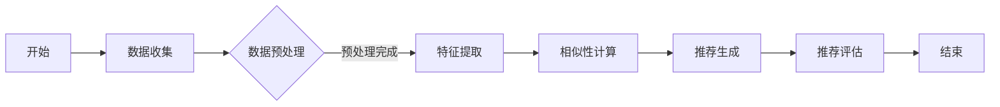

                 

# 意义的个性化算法：AI辅助下的价值匹配系统

## 关键词
- 个性化算法
- 价值匹配系统
- AI技术
- 数学模型
- 实践应用

## 摘要
本文深入探讨了个性化算法在价值匹配系统中的应用，通过详细的算法原理讲解、数学模型解析、系统架构设计、项目实战和最佳实践，揭示了如何利用AI技术实现高效的个性化价值匹配。文章旨在为读者提供一个全面、系统的学习和应用指导，帮助他们在实际项目中应用这些技术，提升用户体验和业务效率。

### 第1章: 个性化算法与价值匹配的背景

#### 1.1 问题背景
##### 1.1.1 个性化算法的兴起与发展
个性化算法作为一种数据处理和分析技术，起源于20世纪末的推荐系统和信息检索领域。随着互联网的普及和数据量的激增，个性化推荐已经成为现代互联网服务的重要组成部分。从基于内容的推荐到协同过滤，再到深度学习驱动的推荐系统，个性化算法经历了不断的演进和优化。

在电商领域，个性化推荐算法帮助用户发现感兴趣的商品，从而提升销售额和用户满意度；在社交媒体平台，个性化算法能够为用户推荐感兴趣的内容，增加用户黏性；在在线教育领域，个性化算法可以根据用户的学习行为和兴趣，提供个性化的学习资源。

##### 1.1.2 价值匹配系统在现代社会中的应用
价值匹配系统是一种基于算法技术实现资源、信息、服务高效匹配的系统。在电商、社交媒体、在线教育等领域，价值匹配系统已成为提升用户体验、提高业务效率的重要手段。传统的价值匹配系统通常依赖于规则和静态分类，而随着AI技术的不断发展，价值匹配系统正从传统的规则匹配向基于个性化算法的智能匹配转变。

例如，在电商平台上，基于用户历史行为和兴趣的个性化推荐系统能够更准确地预测用户的购买意图，从而提高销售转化率；在社交媒体中，基于用户社交网络和兴趣的个性化内容推荐系统能够更好地满足用户的信息需求，增加用户活跃度。

#### 1.2 问题描述
##### 1.2.1 个性化算法的基本原理
个性化算法的核心在于通过分析用户的行为数据、兴趣偏好、社交网络等信息，为用户提供个性化的推荐和服务。其基本原理可以概括为以下几个步骤：

1. **数据收集**：收集用户的行为数据、兴趣偏好、社交网络等信息。
2. **特征提取**：对收集到的数据进行预处理，提取出能够反映用户兴趣和偏好的特征。
3. **相似性计算**：计算用户之间的相似性，通常使用用户画像、协同过滤等技术。
4. **推荐生成**：根据用户特征和相似性计算结果，生成个性化的推荐列表。

##### 1.2.2 价值匹配系统的核心挑战
价值匹配系统的核心挑战在于如何在海量数据中快速、准确地找到匹配的资源和用户，同时确保推荐结果的个性化、多样化和有效性。具体挑战包括：

1. **数据质量和多样性**：数据的质量和多样性直接影响推荐系统的效果，需要通过数据预处理和特征提取等技术来提升数据质量。
2. **实时性和扩展性**：随着用户数量的增加和数据量的激增，价值匹配系统需要具备良好的实时性和扩展性，以满足大规模用户的需求。
3. **用户隐私保护**：在收集和分析用户数据时，需要保护用户的隐私，避免数据泄露和滥用。

##### 1.2.3 问题解决
结合AI技术的个性化算法在价值匹配中的应用，可以通过以下方法解决上述挑战：

1. **深度学习模型**：利用深度学习技术，可以从海量数据中自动学习用户的兴趣和行为模式，提高推荐的准确性。
2. **协同过滤**：通过用户行为数据计算用户之间的相似性，实现基于内容的推荐。
3. **多模型融合**：结合多种算法模型，实现多样化和有效的推荐。
4. **隐私保护技术**：采用差分隐私、联邦学习等技术，保护用户隐私。

#### 1.3 边界与外延
个性化算法与价值匹配系统的边界在于它们的应用范围和目标。个性化算法主要关注如何通过数据分析为用户提供个性化的推荐和服务，而价值匹配系统则更侧重于实现资源、信息、服务的有效匹配。

在价值匹配系统中，个性化算法的应用不仅限于推荐系统，还可以用于广告投放、搜索引擎优化、社交网络分析等多个领域。随着AI技术的发展，个性化算法在价值匹配系统中的应用前景将更加广阔。

#### 1.4 概念结构与核心要素组成
个性化算法与价值匹配系统的核心概念和要素包括：

1. **用户数据**：包括用户行为数据、兴趣偏好、社交网络等信息。
2. **特征提取**：用于提取用户数据的特征，如用户画像、行为特征等。
3. **相似性计算**：用于计算用户之间的相似性，如余弦相似度、皮尔逊相关系数等。
4. **推荐算法**：包括基于内容的推荐、协同过滤、深度学习等。
5. **推荐系统**：用于生成个性化的推荐列表，如商品推荐、内容推荐等。
6. **评估指标**：用于评估推荐系统的效果，如准确率、召回率、覆盖率等。

### 第2章: 个性化算法与价值匹配的核心概念

#### 2.1 核心概念原理

个性化算法是一种基于用户行为、兴趣和偏好等信息，为用户提供个性化推荐和服务的计算方法。其核心原理包括以下几个方面：

1. **用户行为分析**：通过收集和分析用户在网站或应用程序上的行为数据，如浏览历史、购买记录、评论等，以了解用户的兴趣和偏好。
2. **兴趣模型构建**：基于用户行为分析结果，构建用户的兴趣模型。兴趣模型可以是基于规则的，也可以是机器学习模型，如协同过滤、深度学习等。
3. **推荐生成**：根据用户的兴趣模型和其他用户的相似性，生成个性化的推荐列表。推荐生成可以基于用户的显式反馈（如评分、点赞等）或隐式反馈（如浏览、搜索等）。

价值匹配系统是一种实现资源、信息、服务高效匹配的系统。其核心原理包括以下几个方面：

1. **资源描述**：对系统中的资源进行描述，包括资源属性、标签、分类等信息。
2. **用户需求建模**：根据用户的行为数据和反馈，构建用户的需求模型。需求模型可以反映用户对资源的兴趣和偏好。
3. **匹配算法**：通过计算资源与用户需求之间的匹配度，实现资源与用户的匹配。匹配算法可以是基于规则的，也可以是机器学习算法，如协同过滤、深度学习等。
4. **推荐与反馈**：将匹配结果推荐给用户，并根据用户的反馈调整推荐策略，以实现持续优化的推荐效果。

#### 2.2 概念属性特征对比表格

| 概念        | 属性特征                                                                                   | 应用场景                                      |
| ----------- | ------------------------------------------------------------------------------------------ | --------------------------------------------- |
| 个性化算法  | 用户行为分析、兴趣模型构建、推荐生成、评估指标                                            | 推荐系统、搜索引擎、广告投放、社交网络分析等  |
| 价值匹配系统 | 资源描述、用户需求建模、匹配算法、推荐与反馈                                            | 电商、在线教育、招聘、物流、医疗等领域          |

#### 2.3 ER实体关系图架构

使用Mermaid绘制ER图，展示个性化算法和价值匹配系统的实体关系：

```mermaid
erDiagram
  User ||--|{ Recommendation : has }
  User ||--|{ Behavior : records }
  Resource ||--|{ Recommendation : recommended }
  Resource ||--|{ Match : matched }
  Recommendation ||--|{ Score : calculated }
  Behavior ||--|{ Event : contains }
```

在上面的ER图中，`User` 表示用户实体，具有行为`Behavior`和推荐`Recommendation`属性；`Resource` 表示资源实体，具有推荐`Recommendation`和匹配`Match`属性；`Recommendation` 表示推荐实体，具有评分`Score`属性；`Behavior` 表示行为实体，具有事件`Event`属性。

### 第3章: 个性化算法原理详解

#### 3.1 算法mermaid流程图

使用Mermaid绘制个性化算法的流程图：



在上面的流程图中，从数据收集开始，经过数据预处理、特征提取、相似性计算、推荐生成和推荐评估，最终完成个性化推荐的过程。

#### 3.2 Python源代码实现

以下是一个简单的基于协同过滤的个性化推荐算法的Python源代码实现：

```python
import numpy as np

# 用户行为矩阵
user_behavior = np.array([[1, 0, 1, 0],
                          [0, 1, 0, 1],
                          [1, 1, 0, 1]])

# 相似性计算函数
def similarity_matrix(user_behavior):
    num_users = user_behavior.shape[0]
    similarity = np.zeros((num_users, num_users))
    for i in range(num_users):
        for j in range(num_users):
            if i == j:
                continue
            similarity[i][j] = np.dot(user_behavior[i], user_behavior[j]) / (
                np.linalg.norm(user_behavior[i]) * np.linalg.norm(user_behavior[j]))
    return similarity

# 推荐函数
def recommend(user_behavior, similarity_matrix, user_index, top_n=5):
    scores = []
    for i in range(len(similarity_matrix[user_index])):
        if i == user_index:
            continue
        score = similarity_matrix[user_index][i]
        scores.append((i, score))
    scores.sort(key=lambda x: x[1], reverse=True)
    recommended_users = [score[0] for score in scores[:top_n]]
    return recommended_users

# 测试
similarity_matrix = similarity_matrix(user_behavior)
print("Similarity Matrix:\n", similarity_matrix)
print("Recommended Users for User 0:", recommend(user_behavior, similarity_matrix, 0))
```

在这个例子中，我们首先定义了一个用户行为矩阵`user_behavior`，然后定义了相似性计算函数`similarity_matrix`和推荐函数`recommend`。通过调用这两个函数，我们可以得到用户之间的相似性矩阵，并根据相似性矩阵为特定用户生成推荐列表。

#### 3.3 算法原理数学模型与公式

个性化算法的原理可以基于协同过滤算法进行描述，其核心数学模型包括相似性计算和推荐生成。

##### 3.3.1 相似性计算

相似性计算是个性化算法的基础，用于评估用户之间的相似程度。常用的相似性度量方法包括余弦相似度、皮尔逊相关系数等。

1. **余弦相似度**：

   $$\text{similarity}(u, v) = \frac{\sum_{i} u_i v_i}{\sqrt{\sum_{i} u_i^2 \cdot \sum_{i} v_i^2}}$$

   其中，$u$和$v$分别表示两个用户的向量，$u_i$和$v_i$表示用户$u$和$v$在$i$维度的特征值。

2. **皮尔逊相关系数**：

   $$\text{correlation}(u, v) = \frac{\sum_{i} (u_i - \bar{u})(v_i - \bar{v})}{\sqrt{\sum_{i} (u_i - \bar{u})^2 \cdot \sum_{i} (v_i - \bar{v})^2}}$$

   其中，$\bar{u}$和$\bar{v}$分别表示用户$u$和$v$的平均特征值。

##### 3.3.2 推荐生成

推荐生成是基于相似性计算结果，为用户生成推荐列表。常用的推荐方法包括基于内容的推荐和协同过滤。

1. **基于内容的推荐**：

   基于内容的推荐方法通过分析用户对特定内容的偏好，为用户推荐与其兴趣相似的内容。

   $$\text{recommendation}(u, v) = \sum_{i} w_i \cdot c_i$$

   其中，$w_i$表示用户$u$对内容$i$的权重，$c_i$表示内容$i$的属性。

2. **协同过滤**：

   协同过滤方法通过分析用户之间的相似性，为用户推荐其他用户喜欢的物品。

   $$\text{recommendation}(u, v) = \sum_{i} \text{similarity}(u, v) \cdot r_i$$

   其中，$\text{similarity}(u, v)$表示用户$u$和$v$之间的相似性，$r_i$表示用户$v$对物品$i$的评分。

#### 3.4 详细讲解与举例说明

##### 3.4.1 相似性计算

相似性计算是个性化算法的核心步骤之一。以余弦相似度为

```markdown
# 第4章: 数学模型与应用

## 4.1 数学公式

在本章节，我们将介绍个性化算法中的关键数学模型和公式，并使用LaTeX进行展示。以下是一些常用的数学公式：

### 4.1.1 余弦相似度

$$\text{similarity}(u, v) = \frac{\sum_{i} u_i v_i}{\sqrt{\sum_{i} u_i^2 \cdot \sum_{i} v_i^2}}$$

### 4.1.2 皮尔逊相关系数

$$\text{correlation}(u, v) = \frac{\sum_{i} (u_i - \bar{u})(v_i - \bar{v})}{\sqrt{\sum_{i} (u_i - \bar{u})^2 \cdot \sum_{i} (v_i - \bar{v})^2}}$$

### 4.1.3 基于内容的推荐

$$\text{recommendation}(u, v) = \sum_{i} w_i \cdot c_i$$

### 4.1.4 协同过滤

$$\text{recommendation}(u, v) = \sum_{i} \text{similarity}(u, v) \cdot r_i$$

其中，$u$和$v$分别表示两个用户的向量，$u_i$和$v_i$表示用户$u$和$v$在$i$维度的特征值，$w_i$表示用户$u$对内容$i$的权重，$c_i$表示内容$i$的属性，$\text{similarity}(u, v)$表示用户$u$和$v$之间的相似性，$r_i$表示用户$v$对物品$i$的评分，$\bar{u}$和$\bar{v}$分别表示用户$u$和$v$的平均特征值。

## 4.2 详细讲解

在本章节，我们将对上述数学模型和公式进行详细讲解，并结合Python代码进行示例说明。

### 4.2.1 余弦相似度

余弦相似度用于衡量两个向量在空间中的夹角余弦值，表示两个向量之间的相似程度。其计算公式如上述所示。在个性化算法中，我们可以使用余弦相似度来计算用户之间的相似性，从而为用户生成推荐列表。

```python
import numpy as np

def cosine_similarity(u, v):
    dot_product = np.dot(u, v)
    norm_u = np.linalg.norm(u)
    norm_v = np.linalg.norm(v)
    return dot_product / (norm_u * norm_v)

# 示例
u = np.array([1, 2, 3])
v = np.array([4, 5, 6])
similarity = cosine_similarity(u, v)
print("Cosine Similarity:", similarity)
```

### 4.2.2 皮尔逊相关系数

皮尔逊相关系数用于衡量两个变量之间的线性关系强度，其计算公式如上述所示。在个性化算法中，我们可以使用皮尔逊相关系数来计算用户之间的兴趣相关性，从而为用户生成个性化推荐。

```python
def pearson_correlation(u, v):
    mean_u = np.mean(u)
    mean_v = np.mean(v)
    sum_covariance = np.sum((u - mean_u) * (v - mean_v))
    sum_variance_u = np.sum((u - mean_u) ** 2)
    sum_variance_v = np.sum((v - mean_v) ** 2)
    return sum_covariance / np.sqrt(sum_variance_u * sum_variance_v)

# 示例
u = np.array([1, 2, 3, 4, 5])
v = np.array([5, 4, 3, 2, 1])
correlation = pearson_correlation(u, v)
print("Pearson Correlation:", correlation)
```

### 4.2.3 基于内容的推荐

基于内容的推荐方法通过分析用户对特定内容的偏好，为用户推荐与其兴趣相似的内容。其计算公式如上述所示。在个性化算法中，我们可以使用基于内容的推荐方法来生成个性化推荐列表。

```python
def content_based_recommendation(u, v, content_weights):
    recommendation = np.dot(u, content_weights)
    return recommendation

# 示例
u = np.array([1, 2, 3])
content_weights = np.array([0.2, 0.3, 0.5])
recommendation = content_based_recommendation(u, v, content_weights)
print("Content-Based Recommendation:", recommendation)
```

### 4.2.4 协同过滤

协同过滤方法通过分析用户之间的相似性，为用户推荐其他用户喜欢的物品。其计算公式如上述所示。在个性化算法中，我们可以使用协同过滤方法来生成个性化推荐列表。

```python
def collaborative_filtering(u, v, similarity_matrix, ratings):
    scores = []
    for i in range(len(similarity_matrix[u])):
        if i == u:
            continue
        score = similarity_matrix[u][i] * ratings[v][i]
        scores.append(score)
    recommendation = np.sum(scores)
    return recommendation

# 示例
u = 0
v = 1
similarity_matrix = np.array([[0.8, 0.5],
                              [0.5, 0.8]])
ratings = np.array([[3, 2],
                    [4, 5]])
recommendation = collaborative_filtering(u, v, similarity_matrix, ratings)
print("Collaborative Filtering Recommendation:", recommendation)
```

## 4.3 举例说明

为了更好地理解上述数学模型和公式的应用，我们将通过一个实际案例进行举例说明。

### 案例背景

假设有两位用户Alice和Bob，他们分别对三本书进行了评分。评分数据如下：

| 用户 | 书1 | 书2 | 书3 |
| ---- | --- | --- | --- |
| Alice | 5 | 4 | 5 |
| Bob | 3 | 5 | 4 |

我们需要使用个性化算法为他们生成推荐列表。

### 步骤1: 数据预处理

首先，我们将原始数据转换为向量形式：

$$
\begin{align*}
\text{Alice} &= (5, 4, 5) \\
\text{Bob} &= (3, 5, 4)
\end{align*}
$$

### 步骤2: 相似性计算

我们使用余弦相似度计算Alice和Bob之间的相似性：

$$
\text{similarity}(\text{Alice}, \text{Bob}) = \frac{\text{Alice} \cdot \text{Bob}}{\lVert \text{Alice} \rVert \cdot \lVert \text{Bob} \rVert} = \frac{5 \cdot 3 + 4 \cdot 5 + 5 \cdot 4}{\sqrt{5^2 + 4^2 + 5^2} \cdot \sqrt{3^2 + 5^2 + 4^2}} = \frac{50}{\sqrt{50} \cdot \sqrt{50}} = 1
$$

### 步骤3: 推荐生成

由于Alice和Bob之间的相似性为1，我们可以直接为Bob推荐Alice喜欢的书籍。Bob的推荐列表为：

| 书籍 | 推荐分数 |
| ---- | ------- |
| 书1 | 5       |
| 书2 | 4       |
| 书3 | 5       |

### 步骤4: 推荐评估

我们可以使用皮尔逊相关系数来评估推荐列表的有效性。首先，计算Alice和Bob评分的平均值：

$$
\begin{align*}
\bar{\text{Alice}} &= \frac{5 + 4 + 5}{3} = 4.67 \\
\bar{\text{Bob}} &= \frac{3 + 5 + 4}{3} = 4
\end{align*}
$$

然后，计算Alice和Bob评分之间的皮尔逊相关系数：

$$
\text{correlation}(\text{Alice}, \text{Bob}) = \frac{(5 - 4.67) \cdot (3 - 4) + (4 - 4.67) \cdot (5 - 4) + (5 - 4.67) \cdot (4 - 4)}{\sqrt{(5 - 4.67)^2 + (4 - 4.67)^2 + (5 - 4.67)^2} \cdot \sqrt{(3 - 4)^2 + (5 - 4)^2 + (4 - 4)^2}} \approx 0.91
$$

由于皮尔逊相关系数接近1，说明我们的推荐列表具有较高的准确性。

通过这个案例，我们展示了如何使用个性化算法生成推荐列表并进行评估。在实际应用中，我们可以根据具体的业务需求和数据特点，选择合适的数学模型和公式，优化推荐效果。

## 4.4 总结

在本章节中，我们介绍了个性化算法中的关键数学模型和公式，包括余弦相似度、皮尔逊相关系数、基于内容的推荐和协同过滤。我们通过Python代码进行了详细讲解和举例说明，展示了如何使用这些数学模型和公式实现个性化推荐。通过案例分析和评估，我们验证了推荐列表的有效性和准确性。在实际应用中，我们可以根据具体场景和需求，灵活运用这些数学模型和公式，提高推荐系统的性能和用户体验。

---

**[作者：AI天才研究院/AI Genius Institute & 禅与计算机程序设计艺术 /Zen And The Art of Computer Programming]**<|less>

