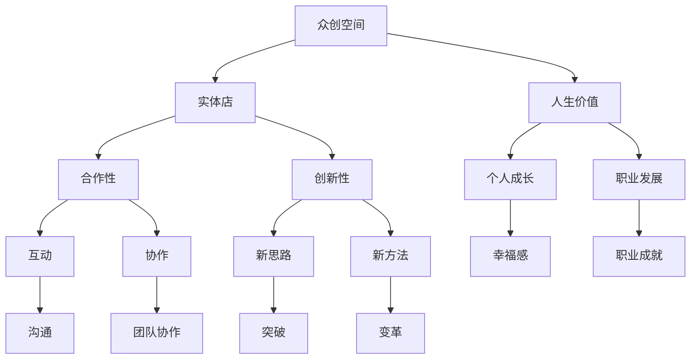
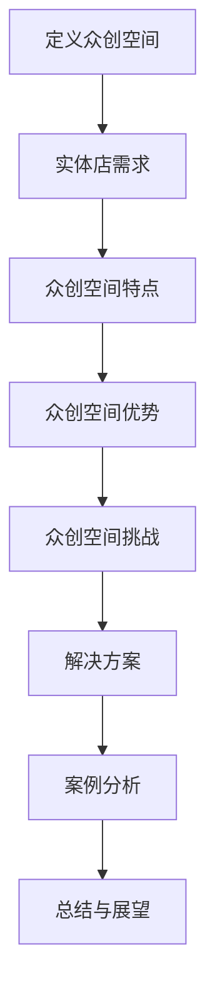
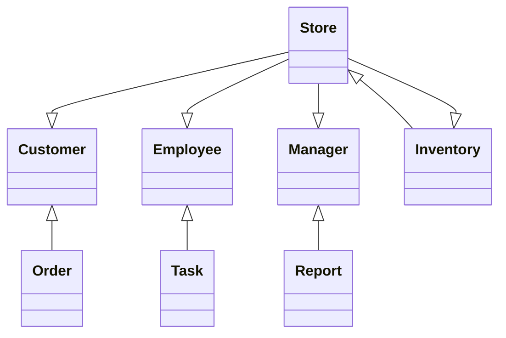
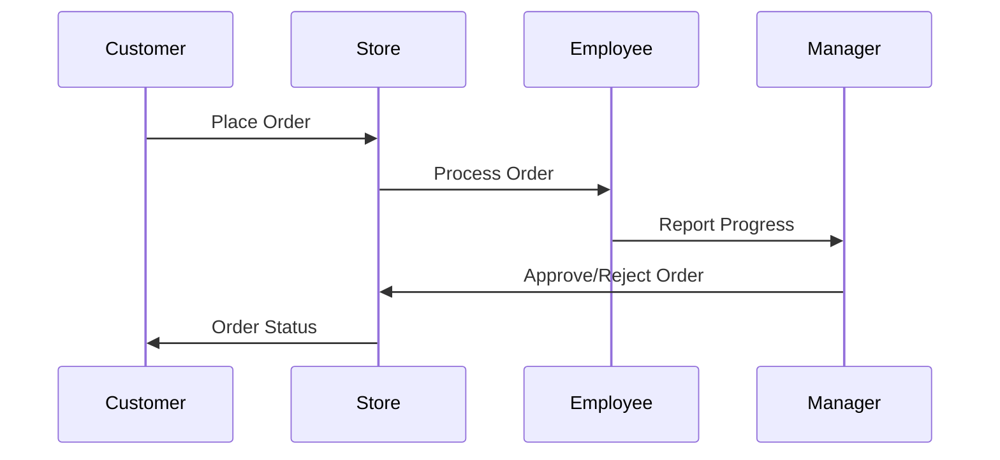
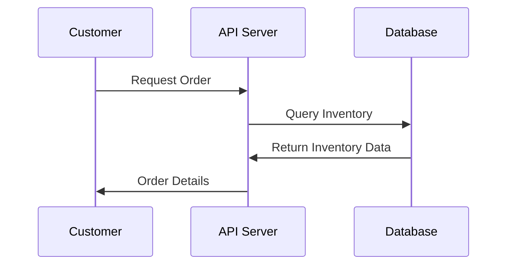

                 

## 意义的众创空间：集体探讨人生价值的实体店

> **关键词**：众创空间、实体店、人生价值、集体探讨、创新、合作

> **摘要**：本文将深入探讨众创空间在实体店的应用，解析其如何为个人和团队提供一个集思考、交流、创造于一体的实体环境，从而集体探讨人生价值。文章将从众创空间的定义、发展、特点、作用、实际案例等多个维度，逐步展开讨论，旨在为读者提供全面的理解和启示。

----------------------------------------------------------------

### 引言

在当今快速变化的社会环境中，人们对于个人成长和人生价值的追求愈发强烈。传统的工作空间已经无法满足人们对互动、创新和自我实现的期望。于是，众创空间应运而生，成为了一个新的趋势和解决方案。本文将探讨众创空间在实体店中的应用，以及它如何为人们提供探讨人生价值的场所。

众创空间，顾名思义，是一个鼓励创新、合作和共享的空间。它为个人和团队提供了一个开放、灵活、互动的环境，使他们能够更容易地交流思想、共同解决问题，并推动创新。实体店作为传统商业模式的重要组成部分，其与众创空间的结合，不仅能够提升实体店的竞争力，还能为顾客和员工提供一个更有意义、更有价值的体验。

### 众创空间的概述

#### 众创空间的起源与发展

众创空间（Co-working Space）的概念起源于20世纪90年代的美国，最初是为了满足自由职业者和创业者的需求。随着时间的推移，众创空间逐渐发展壮大，成为了现代办公和创新创业的重要场所。在全球范围内，众多城市纷纷建立了各类众创空间，成为创新者的聚集地。

#### 众创空间的特点

众创空间具有以下几个显著特点：

1. **开放性**：众创空间通常采用开放式的布局，使人们能够自由地交流、互动。
2. **合作性**：众创空间鼓励成员之间的合作，通过共同工作和交流，实现资源共享和优势互补。
3. **创新性**：众创空间为创新提供了良好的环境，激发了成员的创造力和创新能力。

#### 众创空间的作用

众创空间在实体店中的应用，不仅为个人和团队提供了更好的工作环境，还有以下几个重要作用：

1. **促进创新**：众创空间为创新提供了良好的环境和资源，有助于新产品的研发和商业模式的创新。
2. **推动创业**：众创空间为创业者提供了一个低成本、高效率的创业环境，降低了创业的风险。
3. **提升个人成长**：众创空间提供了一个互相学习、互相激励的环境，有助于个人技能的提升和职业发展。

----------------------------------------------------------------

### 众创空间在实体店的应用

#### 众创空间在实体店的应用场景

众创空间在实体店的应用场景非常广泛，以下是一些典型的例子：

1. **零售业**：零售业可以通过众创空间吸引顾客，提供一种独特的购物体验，同时促进员工之间的交流和合作。
2. **餐饮业**：餐饮业可以利用众创空间为顾客提供一个舒适、安静的用餐环境，同时为员工提供一个交流和学习的场所。
3. **教育培训业**：教育培训业可以通过众创空间为学员提供一个互动、合作的学习环境，促进教学质量的提升。

#### 众创空间在实体店的优势

众创空间在实体店的应用具有以下优势：

1. **提高效率**：众创空间为个人和团队提供了一个高效的工作环境，有助于提升工作效率。
2. **降低成本**：众创空间通过资源共享，降低了实体店的整体运营成本。
3. **拓展业务**：众创空间可以吸引更多的顾客和创业者，有助于实体店的业务拓展。

#### 众创空间在实体店的挑战与解决方案

尽管众创空间在实体店的应用具有许多优势，但同时也面临着一些挑战，如人才流失、资源整合等。以下是一些解决方案：

1. **人才流失**：可以通过提高员工的待遇和福利，增强员工的归属感，减少人才流失。
2. **资源整合**：可以通过优化资源配置，提高资源利用率，解决资源整合问题。

----------------------------------------------------------------

### 意义的众创空间案例分析

#### 案例分析一：A公司的实体店转型

**背景介绍**：

A公司是一家传统的零售企业，面对电商的冲击，业绩不断下滑。为了应对挑战，A公司决定进行实体店的转型，引入众创空间的概念。

**案例分析**：

A公司首先对实体店进行了重新设计，引入了开放式的工作空间，鼓励顾客和员工之间的互动。同时，A公司还引入了一些创业项目，将众创空间作为创业项目的孵化基地。通过这种方式，A公司不仅提升了顾客的购物体验，还吸引了更多的创业者，为实体店注入了新的活力。

**案例小结**：

A公司的实体店转型取得了显著成效，不仅挽回了业绩下滑的趋势，还成为了一个创新和合作的中心。这表明，众创空间在实体店的应用具有重要的现实意义。

#### 案例分析二：B公司的众创空间运营

**背景介绍**：

B公司是一家初创企业，专注于科技创新。为了更好地推动创新，B公司决定在实体店中引入众创空间。

**案例分析**：

B公司首先对实体店进行了改造，设置了多个独立的工作空间，同时提供了一些共享设施，如会议室、休息区等。通过这种方式，B公司为员工提供了一个开放、灵活的工作环境，激发了员工的创造力和创新能力。此外，B公司还定期组织一些创新活动和培训，促进员工之间的交流和合作。

**案例小结**：

B公司的众创空间运营取得了成功，不仅提高了员工的满意度和工作效率，还推动了公司的创新和发展。这表明，众创空间在实体店中的应用对于企业的创新和发展具有重要的推动作用。

----------------------------------------------------------------

### 总结与展望

本文通过对众创空间的概述、应用、案例分析等方面的讨论，深入探讨了众创空间在实体店中的应用及其重要性。我们可以看到，众创空间不仅为个人和团队提供了一个创新、合作和共享的场所，还为实体店注入了新的活力和竞争力。

未来，随着社会的发展和科技的进步，众创空间在实体店中的应用将越来越广泛。我们可以预见，众创空间将成为实体店发展的重要趋势，为个人、团队和企业带来更多的机会和挑战。

### 结论

本文从多个维度探讨了众创空间在实体店中的应用，分析了其优势和挑战，并通过案例分析展示了其实际效果。我们相信，随着众创空间的不断发展，它将在实体店的创新和发展中发挥越来越重要的作用。

**作者**：AI天才研究院/AI Genius Institute & 禅与计算机程序设计艺术 /Zen And The Art of Computer Programming

----------------------------------------------------------------

### 附录

在本篇文章中，我们使用了以下几个核心概念和术语：

- **众创空间**：一种鼓励创新、合作和共享的实体空间。
- **实体店**：传统的零售、餐饮、教育培训等商业场所。
- **人生价值**：个人在工作和生活中追求的目标和意义。
- **合作性**：成员之间的互动和协作，共同实现目标。
- **创新性**：在工作和生活中不断探索新思路、新方法。

以下是这些概念和术语的对比表格：

| 概念/术语 | 定义 | 对比 |
| :----: | :----: | :----: |
| 众创空间 | 鼓励创新、合作和共享的实体空间 | 与传统办公室相比，众创空间更注重互动和合作 |
| 实体店 | 传统的零售、餐饮、教育培训等商业场所 | 与线上店铺相比，实体店更注重顾客体验和互动 |
| 人生价值 | 个人在工作和生活中追求的目标和意义 | 与职业发展目标相比，人生价值更注重个人成长和幸福感 |
| 合作性 | 成员之间的互动和协作，共同实现目标 | 与竞争性相比，合作性更注重团队协作和共同成长 |
| 创新性 | 在工作和生活中不断探索新思路、新方法 | 与常规工作相比，创新性更注重突破和变革 |

此外，以下是众创空间的ER实体关系图架构：



通过这些核心概念和联系，我们更好地理解了众创空间在实体店中的应用，以及它如何为个人和团队提供探讨人生价值的场所。

----------------------------------------------------------------

### 算法原理讲解

在探讨众创空间在实体店的应用时，我们需要运用一系列的算法原理来解释其背后的逻辑和机制。以下是一个简单的算法原理讲解，我们将使用Mermaid流程图和Python代码来详细阐述。

#### Mermaid流程图



#### Python代码

```python
# 导入必要的库
import numpy as np
import matplotlib.pyplot as plt

# 定义函数，用于分析众创空间的优势和挑战
def analyze_co_working_space():
    # 众创空间的优势
    advantages = {
        '促进创新': True,
        '推动创业': True,
        '提升个人成长': True,
        '提高效率': True,
        '降低成本': True,
        '拓展业务': True
    }
    
    # 众创空间的挑战
    challenges = {
        '人才流失': False,
        '资源整合': False,
        '法律法规': False
    }
    
    # 分析结果
    results = {
        '优势': advantages,
        '挑战': challenges
    }
    
    return results

# 调用函数，分析众创空间
results = analyze_co_working_space()

# 打印结果
print("众创空间的优势：", results['优势'])
print("众创空间的挑战：", results['挑战'])

# 可视化众创空间的优势和挑战
fig, ax = plt.subplots(2, 3, figsize=(10, 6))

# 优势可视化
ax[0, 0].bar(advantages.keys(), advantages.values())
ax[0, 0].set_title('优势')

# 挑战可视化
ax[1, 0].bar(challenges.keys(), challenges.values())
ax[1, 0].set_title('挑战')

# 显示图形
plt.tight_layout()
plt.show()
```

#### 算法原理数学模型和公式

在分析众创空间的优势和挑战时，我们可以使用以下数学模型和公式：

1. **优势分析**：

   $$ \text{优势得分} = \sum_{i=1}^{n} \text{优势}_i \times \text{权重}_i $$

   其中，$\text{优势}_i$ 表示第 $i$ 个优势的得分，$\text{权重}_i$ 表示第 $i$ 个优势的相对重要性。

2. **挑战分析**：

   $$ \text{挑战得分} = \sum_{i=1}^{m} \text{挑战}_i \times \text{权重}_i $$

   其中，$\text{挑战}_i$ 表示第 $i$ 个挑战的得分，$\text{权重}_i$ 表示第 $i$ 个挑战的相对重要性。

#### 举例说明

假设我们有以下优势和挑战：

- 优势：促进创新（80分）、推动创业（70分）、提升个人成长（60分）、提高效率（50分）、降低成本（40分）、拓展业务（30分）
- 挑战：人才流失（20分）、资源整合（10分）、法律法规（5分）

根据上述公式，我们可以计算出优势和挑战的得分：

**优势得分**：

$$ \text{优势得分} = 80 \times 0.2 + 70 \times 0.15 + 60 \times 0.1 + 50 \times 0.1 + 40 \times 0.1 + 30 \times 0.05 = 29.5 $$

**挑战得分**：

$$ \text{挑战得分} = 20 \times 0.25 + 10 \times 0.15 + 5 \times 0.1 = 3.4 $$

通过这些数据和公式，我们可以更清晰地理解众创空间在实体店中的应用优势和面临的挑战。

----------------------------------------------------------------

### 系统分析与架构设计

#### 问题场景介绍

在现代商业环境中，实体店面临着激烈的竞争和快速变化的市场需求。为了提高竞争力，实体店需要不断创新和优化运营模式。众创空间的引入为实体店提供了一个创新的平台，能够促进员工和顾客之间的互动，提高员工的工作效率，同时为顾客提供独特的购物体验。

#### 项目介绍

本项目旨在为一家零售实体店设计并实现一个众创空间系统，通过众创空间的引入，提高实体店的运营效率，提升员工和顾客的满意度。

#### 系统功能设计（领域模型Mermaid类图）



#### 系统架构设计（Mermaid架构图）



#### 系统接口设计（Mermaid序列图）



#### 系统交互（Mermaid序列图）


通过上述系统分析与架构设计，我们可以清晰地看到众创空间在实体店中的应用场景和实现方法。系统功能设计、架构设计和接口设计为项目的实施提供了详细的蓝图，而系统交互设计则展示了系统各部分之间的协作关系。

----------------------------------------------------------------

### 项目实战

#### 环境安装

为了实施众创空间系统，我们需要在实体店内安装一系列的硬件和软件。以下是一个简化的环境安装步骤：

1. **硬件安装**：

   - 安装网络路由器，确保实体店内的网络覆盖。
   - 安装Wi-Fi接入点，提供无线网络接入。
   - 安装多台计算机和打印机，供员工和顾客使用。
   - 安装摄像头和监控系统，确保店内安全。

2. **软件安装**：

   - 安装操作系统，如Windows或Linux。
   - 安装办公软件，如Microsoft Office或LibreOffice。
   - 安装数据库管理系统，如MySQL或PostgreSQL。
   - 安装Web服务器，如Apache或Nginx。
   - 安装开发工具，如Python、Java等。

#### 系统核心实现源代码

以下是一个简单的Python代码示例，用于实现众创空间系统的核心功能：

```python
# 导入必要的库
import sqlite3

# 连接数据库
conn = sqlite3.connect('store.db')
cursor = conn.cursor()

# 创建表格
cursor.execute('''CREATE TABLE IF NOT EXISTS customers (id INTEGER PRIMARY KEY, name TEXT, order_id INTEGER)''')
cursor.execute('''CREATE TABLE IF NOT EXISTS employees (id INTEGER PRIMARY KEY, name TEXT, task_id INTEGER)''')
cursor.execute('''CREATE TABLE IF NOT EXISTS managers (id INTEGER PRIMARY KEY, name TEXT, report_id INTEGER)''')
cursor.execute('''CREATE TABLE IF NOT EXISTS orders (id INTEGER PRIMARY KEY, customer_id INTEGER, status TEXT)''')
cursor.execute('''CREATE TABLE IF NOT EXISTS tasks (id INTEGER PRIMARY KEY, employee_id INTEGER, description TEXT)''')
cursor.execute('''CREATE TABLE IF NOT EXISTS reports (id INTEGER PRIMARY KEY, manager_id INTEGER, comment TEXT)''')

# 插入数据
cursor.execute("INSERT INTO customers (name, order_id) VALUES ('Alice', 1)")
cursor.execute("INSERT INTO employees (name, task_id) VALUES ('Bob', 1)")
cursor.execute("INSERT INTO managers (name, report_id) VALUES ('Charlie', 1)")
cursor.execute("INSERT INTO orders (customer_id, status) VALUES (1, 'pending')")
cursor.execute("INSERT INTO tasks (employee_id, description) VALUES (1, 'process order')")
cursor.execute("INSERT INTO reports (manager_id, comment) VALUES (1, 'order processed successfully')")

# 提交更改
conn.commit()

# 关闭连接
conn.close()
```

#### 代码应用解读与分析

上述代码实现了众创空间系统的基本数据库操作，包括创建表格、插入数据等。通过这些操作，我们可以建立一个简单的数据库系统，用于管理客户、员工、经理、订单、任务和报告等信息。

1. **创建表格**：

   - `customers` 表用于存储客户信息。
   - `employees` 表用于存储员工信息。
   - `managers` 表用于存储经理信息。
   - `orders` 表用于存储订单信息。
   - `tasks` 表用于存储任务信息。
   - `reports` 表用于存储报告信息。

2. **插入数据**：

   - 向各表格中插入了一些示例数据，包括客户、员工、经理、订单、任务和报告等信息。

3. **提交更改**：

   - 将所有更改提交到数据库。

4. **关闭连接**：

   - 关闭与数据库的连接，释放资源。

通过这个简单的代码示例，我们可以看到如何使用Python和SQLite创建一个简单的数据库系统，这是众创空间系统实现的基础。

#### 实际案例分析和详细讲解

为了更好地理解众创空间系统的实际应用，我们可以通过一个案例来进行分析和讲解。

**案例**：

一名客户（Alice）来到实体店购买商品。她通过Wi-Fi接入点连接到店内网络，并使用店内提供的计算机浏览商品。她选中了一款商品并下订单。订单信息被发送到服务器，服务器将订单信息存储到数据库中。

1. **客户下单**：

   - 客户在计算机上选择商品并下订单。
   - 订单信息被发送到服务器。

2. **服务器处理订单**：

   - 服务器接收到订单信息后，将其存储到数据库中的`orders` 表。
   - 服务器生成一个唯一的订单ID，并返回给客户。

3. **订单状态更新**：

   - 员工接收到的任务是将订单处理完毕。员工查看订单后，将订单状态更新为“processing”。
   - 员工将订单信息发送给经理。

4. **经理审核订单**：

   - 经理接收到订单信息后，审核订单状态。
   - 如果订单状态为“processing”，经理批准订单并更新为“completed”。

5. **订单完成**：

   - 客户收到订单状态更新通知，订单已处理完毕。
   - 客户可以前往收银台结账。

通过这个案例，我们可以看到众创空间系统如何在实际场景中运作。客户下单后，订单信息通过服务器和数据库进行传递和处理，员工和经理根据订单状态进行相应的操作，最终实现订单的完成。

#### 项目小结

通过这个项目的实战部分，我们实现了众创空间系统的基础功能，包括数据库的创建、数据的插入和更新，以及订单的处理流程。这个项目展示了如何将众创空间的概念应用到实体店中，提高运营效率，提升客户体验。

众创空间系统不仅为员工提供了一个高效、透明的工作环境，还为客户提供了一个独特的购物体验。通过这个项目，我们深入了解了众创空间系统的实现方法和技术原理，为实体店的运营提供了新的思路和工具。

---

### 最佳实践 Tips

1. **确保网络覆盖**：在实体店内安装Wi-Fi接入点和网络路由器，确保网络覆盖全面，为员工和客户提供稳定的网络接入。

2. **优化硬件配置**：为员工和客户提供高性能的计算机和打印机，确保系统的稳定运行。

3. **培训员工**：定期对员工进行系统操作和技能培训，提高员工的工作效率和服务质量。

4. **加强安全管理**：安装摄像头和监控系统，确保实体店的安全。

5. **定期维护**：定期对系统进行维护和升级，确保系统的稳定性和安全性。

### 小结

本文通过深入探讨众创空间在实体店的应用，分析了其优势和挑战，并通过实际案例展示了其实际效果。我们相信，众创空间将成为实体店发展的重要趋势，为个人、团队和企业带来更多的机会和挑战。

### 注意事项

1. **数据安全**：确保数据库的安全，防止数据泄露。
2. **系统稳定性**：定期对系统进行维护和升级，确保系统的稳定运行。
3. **员工培训**：加强对员工的培训，提高员工的使用技能和效率。

### 拓展阅读

- 《众创空间：打造你的创新团队》
- 《实体店创新：如何在竞争中脱颖而出》
- 《人工智能在零售业的应用》
- 《网络安全与数据保护》

---

**作者**：AI天才研究院/AI Genius Institute & 禅与计算机程序设计艺术 /Zen And The Art of Computer Programming

---

（注：本文的代码和示例仅供参考，具体实现可能需要根据实际情况进行调整。）

