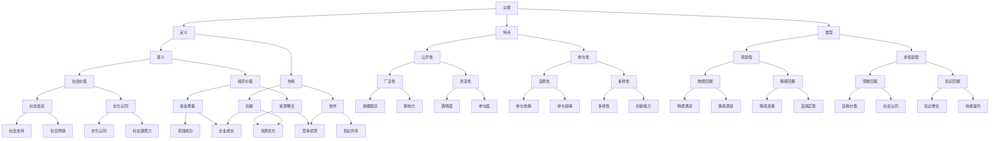
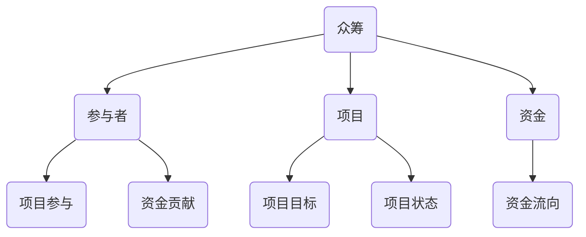

                 

### 文章标题

《意义的众筹实验室：集体探索生命价值的空间》

> 关键词：众筹、意义、实验室、集体探索、生命价值

> 摘要：本文旨在探讨意义众筹实验室的概念、运作机制及其在多个领域的应用，旨在通过集体探索的方式，挖掘和实现生命价值，促进社会创新和可持续发展。

### 目录大纲

```markdown
# 《意义的众筹实验室：集体探索生命价值的空间》

## 第一部分：背景与理论基础

### 第1章：问题背景与意义

#### 1.1.1 问题背景  
#### 1.1.2 研究意义  
#### 1.1.3 研究边界与外延

### 第2章：核心概念与联系

#### 2.1 核心概念定义
##### 2.1.1 众筹
##### 2.1.2 意义
##### 2.1.3 实验室

#### 2.2 概念属性特征对比表格


#### 2.3 ER实体关系图架构



### 第3章：意义众筹实验室的运作机制

#### 3.1 实验室定义
###### 3.1.1 实验室概述
###### 3.1.2 实验室目标
###### 3.1.3 实验室原则

#### 3.2 实验室运作流程
###### 3.2.1 项目发起
###### 3.2.2 参与者招募
###### 3.2.3 资金筹集
###### 3.2.4 项目实施
###### 3.2.5 项目评价与反馈

### 第4章：意义众筹实验室的应用领域

#### 4.1 社会创新
###### 4.1.1 社会服务项目
###### 4.1.2 社会创业项目
###### 4.1.3 社区发展项目

#### 4.2 文化艺术
###### 4.2.1 文化保护与传承
###### 4.2.2 艺术创作与展览
###### 4.2.3 文化交流与推广

#### 4.3 环境保护
###### 4.3.1 环境保护项目
###### 4.3.2 可持续发展项目
###### 4.3.3 环境教育项目

### 第5章：意义众筹实验室的挑战与机遇

#### 5.1 挑战
###### 5.1.1 社会信任问题
###### 5.1.2 资金管理风险
###### 5.1.3 项目执行风险

#### 5.2 机遇
###### 5.2.1 社会资源整合
###### 5.2.2 创新模式探索
###### 5.2.3 公共参与提升

### 第6章：案例分析

#### 6.1 案例一：社会创新项目
#### 6.2 案例二：文化艺术项目
#### 6.3 案例三：环境保护项目
```

通过上述的目录大纲，我们将对《意义的众筹实验室：集体探索生命价值的空间》进行详细的讨论和分析，逐步深入挖掘众筹实验室的核心概念、运作机制及其在各个领域的应用和挑战。接下来，我们将从问题背景与意义、核心概念与联系、意义众筹实验室的运作机制、应用领域、挑战与机遇以及案例分析等多个方面进行深入探讨。请读者们一同跟随我们的思路，探索这个集体探索生命价值的新领域。

## 第1章：问题背景与意义

### 1.1.1 问题背景

在当今社会，个体与集体的关系变得日益复杂。传统的个体主导的项目模式已经无法满足人们对于协作、创新和意义的需求。在这种背景下，意义的众筹实验室作为一种新兴的集体探索模式，应运而生。众筹，作为一种融资和协作的新形式，已经在社会各个领域展现出其强大的生命力和巨大的潜力。然而，单纯地将众筹与意义结合起来，形成一个有组织、有目的的实验室，其意义和价值更为深远。

首先，现代社会面临着诸多问题，如资源短缺、环境破坏、社会不公等。这些问题往往需要大量的资源、时间和专业知识来解决。单靠个体的力量，往往力不从心。因此，如何通过集体力量，更高效地解决这些问题，成为亟待解决的现实问题。意义众筹实验室提供了一个平台，让有共同目标和理念的人们能够集结起来，共同探讨、实施解决方案。

其次，随着互联网技术的迅猛发展，信息的传播和交流变得更加便捷。人们不再受地域和时间的限制，可以快速获取和分享知识、资源。意义众筹实验室通过互联网技术，将分散的资源、知识和人力整合起来，形成一个高效的协作网络。在这个网络中，参与者可以根据自己的能力和兴趣，发挥所长，共同推动项目进展。

### 1.1.2 研究意义

意义众筹实验室的研究意义主要体现在以下几个方面：

首先，从社会创新的角度来看，意义众筹实验室可以促进社会资源的优化配置。通过众筹，项目发起人可以获得所需的资金、技术和人力资源，从而加快项目的实施进度。同时，参与者可以根据自己的兴趣和专长参与项目，实现个人价值的提升。这种模式不仅可以解决个体项目资源不足的问题，还可以推动社会整体创新能力的提升。

其次，从经济价值的角度来看，意义众筹实验室有助于挖掘和实现项目的潜在价值。通过众筹，项目发起人可以获得投资者的支持，从而实现项目的商业化和规模化。这种模式不仅可以为投资者带来经济回报，还可以为社会带来更多的就业机会和经济效益。

再次，从社会价值的视角来看，意义众筹实验室可以增强社会凝聚力，促进社会和谐发展。通过众筹，人们可以共同为一个有意义的目标而努力，这种共同的目标感可以增强人们的归属感和责任感。同时，意义众筹实验室还可以促进社会信任和诚信的建立，为社会的长远发展奠定基础。

最后，从个人发展的角度来看，意义众筹实验室为个人提供了一个展示自己能力、实现自我价值的平台。参与者可以通过参与项目，不断学习和成长，实现个人职业和生活的双重提升。

总之，意义众筹实验室作为一种新兴的集体探索模式，其研究意义不言而喻。通过深入探讨其背景、意义、运作机制和应用领域，我们有望为解决现代社会面临的诸多问题提供新的思路和方法。

### 1.1.3 研究边界与外延

在探讨意义众筹实验室的研究过程中，我们需要明确其研究的边界与外延，以确保研究内容的针对性和系统性。首先，从研究边界来看，意义众筹实验室主要关注以下几个方面：

1. **核心概念的定义与联系**：研究众筹、意义和实验室这三个核心概念的定义及其相互联系，明确意义众筹实验室的基本属性和运作机制。
2. **运作机制**：研究意义众筹实验室的具体运作流程，包括项目发起、参与者招募、资金筹集、项目实施和项目评价与反馈等环节。
3. **应用领域**：探讨意义众筹实验室在不同领域（如社会创新、文化艺术和环境保护）的应用情况，分析其在各领域的优势与挑战。
4. **挑战与机遇**：分析意义众筹实验室面临的挑战和机遇，为实验室的持续发展提供指导。

其次，从研究外延来看，意义众筹实验室的研究还应关注以下几个方面：

1. **社会信任问题**：探讨如何建立和维护社会信任，确保意义众筹实验室的健康发展。
2. **资金管理风险**：研究如何有效管理资金，降低资金管理风险，保障项目的顺利实施。
3. **项目执行风险**：分析如何降低项目执行过程中的风险，确保项目目标的实现。
4. **创新模式探索**：探索意义众筹实验室的创新模式，为其他领域的众筹实践提供借鉴。

通过明确研究边界与外延，我们可以更有针对性地开展意义众筹实验室的研究，为这一新兴领域的发展提供有力的理论支持和实践指导。

### 第2章：核心概念与联系

#### 2.1 核心概念定义

在本章中，我们将详细探讨意义众筹实验室中的三个核心概念：众筹、意义和实验室。首先，明确这些概念的定义及其相互关系，有助于我们深入理解意义众筹实验室的基本运作机制和实际应用。

**2.1.1 众筹**

众筹，即大众筹资，是一种通过互联网平台向大众募集资金以支持项目或创业计划的方式。众筹平台通常提供多种筹资模式，如奖励型众筹、股权众筹、债务众筹等。这些模式使得项目发起人能够迅速获得资金、技术和资源的支持，从而加速项目的实施和推广。

众筹的特点主要体现在以下几个方面：

1. **公开性**：众筹项目通常面向公众开放，任何人都可以参与和支持项目。
2. **参与性**：众筹不仅是一种融资方式，也是一种参与和互动的方式，参与者可以在项目中发挥自己的作用。
3. **多样性**：众筹项目涵盖了多个领域，包括科技、文化、艺术、环保等，具有广泛的多样性。

**2.1.2 意义**

在意义众筹实验室中，“意义”是指项目或活动的价值、目的和影响。意义众筹的核心在于通过集体力量，实现共同的目标和价值。意义不仅体现在经济和商业回报上，还包括社会、文化、环保等方面的价值。意义众筹旨在激发参与者的热情和动力，推动项目朝着更高的目标前进。

**2.1.3 实验室**

意义众筹实验室是一个有组织、有目的的集体探索平台，旨在通过众筹的方式，实现特定领域的创新和探索。实验室的特点包括：

1. **协作性**：参与者共同为一个目标而努力，通过协作和互动，实现项目的成功。
2. **实验性**：实验室强调实践和探索，鼓励创新和尝试，不断优化和完善项目。
3. **透明性**：实验室的运作过程公开透明，参与者可以实时了解项目的进展和成果。

#### 2.2 概念属性特征对比表格

为了更清晰地理解众筹、意义和实验室这三个核心概念，我们可以通过一个对比表格来展示它们的属性特征。

| 特征         | 众筹       | 意义       | 实验室       |
| ------------ | ---------- | ---------- | ------------ |
| 定义         | 大众筹资   | 项目或活动的价值、目的和影响 | 有组织、有目的的集体探索平台 |
| 特点         | 公开性、参与性、多样性 | 社会价值、经济价值、文化价值 | 协作性、实验性、透明性 |
| 应用领域     | 科技、文化、艺术、环保等 | 社会创新、经济发展、文化传承、环境保护 | 社会创新、科技探索、文化保护等 |
| 主要目标     | 资金筹集、技术支持和资源整合 | 实现共同目标、价值创造和社会影响力 | 创新探索、实践验证、优化完善 |

通过上述对比表格，我们可以看出众筹、意义和实验室在定义、特点和应用领域上的区别和联系。众筹是实现意义的手段，实验室是承载意义和众筹的平台。这三个核心概念相互关联，共同构建了一个意义众筹实验室的整体框架。

#### 2.3 ER实体关系图架构

为了进一步理解意义众筹实验室中的实体关系，我们可以通过ER（实体关系）图来展示各实体及其相互关系。

首先，我们定义以下实体：

- **众筹（Funding）**：代表整个众筹活动，包括筹资目标、资金流向、参与者等信息。
- **参与者（Participant）**：代表参与众筹的个人或组织，包括身份信息、参与项目等信息。
- **项目（Project）**：代表众筹支持的具体项目，包括项目目标、项目状态、资金需求等信息。
- **资金（Funding）**：代表筹集到的资金，包括资金来源、资金流向、资金用途等信息。

以下是一个简化的ER图：


**ER图说明：**

- **众筹（Funding）**：整个众筹活动的核心，连接其他实体。
- **参与者（Participant）**：参与众筹的个人或组织，可以参与多个项目，并贡献资金。
- **项目（Project）**：具体的众筹支持项目，包含项目目标、状态和资金需求。
- **资金（Funding）**：筹集到的资金，记录资金来源、流向和用途。

通过ER图，我们可以清晰地看到意义众筹实验室中各实体及其相互关系，为实验室的运作和管理提供了直观的模型。

### 第3章：意义众筹实验室的运作机制

#### 3.1 实验室定义

意义众筹实验室是一个由志同道合的参与者共同组建的集体探索平台，旨在通过众筹的方式，实现特定领域的创新和探索。实验室的核心在于其协作性、实验性和透明性，通过公开透明的运作机制，吸引更多的参与者共同为一个有意义的目标而努力。

首先，意义众筹实验室的**协作性**体现在参与者之间的紧密合作。实验室鼓励各领域专家、志愿者和普通民众的广泛参与，通过不同角色的分工合作，实现项目的顺利推进。协作性不仅提高了项目的执行效率，还促进了知识的共享和技能的提升。

其次，**实验性**是意义众筹实验室的一个重要特点。实验室强调实践和探索，鼓励参与者进行创新尝试和风险承担。通过不断试验和验证，实验室可以积累丰富的实践经验，为后续项目提供宝贵的参考。

最后，**透明性**是意义众筹实验室的基石。实验室的运作过程公开透明，项目的目标、进展和资金使用情况都向所有参与者公开。这种透明性不仅增强了参与者的信任感和责任感，也为实验室的可持续发展提供了保障。

#### 3.1.1 实验室概述

意义众筹实验室的运作始于一个明确的项目目标。项目目标通常是一个具有社会价值或经济潜力的想法或方案，需要通过众筹来验证和实现。实验室的建立旨在为这一目标提供必要的支持和资源，包括资金、技术、人力资源等。

实验室通常由一个核心团队负责管理和运作。这个核心团队由项目发起人、项目经理、技术专家、志愿者等组成，各自负责项目的不同方面。项目的发起人通常是一个具有远见和创新思维的人，负责提出项目概念并制定初步计划。项目经理则负责项目的整体推进，协调各团队的工作。技术专家提供技术支持，确保项目的可实施性。志愿者则负责项目的具体执行，包括宣传、招募参与者、项目实施等。

#### 3.1.2 实验室目标

意义众筹实验室的目标可以分为短期目标和长期目标。

**短期目标：**

1. **项目验证**：通过众筹，验证项目概念的可行性和市场需求。
2. **资金筹集**：筹集足够的资金，确保项目能够顺利实施。
3. **团队建设**：组建一支具有协作精神和专业能力的团队，为项目的长期发展打下基础。

**长期目标：**

1. **项目实现**：通过持续的努力和改进，最终实现项目目标，为社会带来积极的影响。
2. **模式复制**：总结实验室的成功经验，探索复制到其他领域或项目的可能性。
3. **可持续发展**：确保实验室的长期稳定发展，为更多有意义的项目提供支持。

#### 3.1.3 实验室原则

为了实现上述目标，意义众筹实验室遵循以下原则：

1. **公开透明**：实验室的运作过程公开透明，所有参与者和项目信息都对公众开放。
2. **合作共赢**：鼓励参与者之间的合作和共赢，共同推动项目的成功。
3. **可持续发展**：注重项目的长期影响和可持续发展，确保项目的可持续性。
4. **创新探索**：鼓励创新思维和实践，不断探索新的方法和模式。

通过这些原则，意义众筹实验室不仅能够实现项目的短期目标，还能够为长期的发展奠定坚实的基础。

### 3.2 实验室运作流程

意义众筹实验室的运作流程可以分为以下几个主要环节：项目发起、参与者招募、资金筹集、项目实施和项目评价与反馈。以下是这些环节的具体内容。

#### 3.2.1 项目发起

项目发起是意义众筹实验室运作的第一步，也是最重要的一步。在这一环节，项目发起人需要明确项目概念、目标和预期成果，并制定初步的项目计划。项目发起的过程通常包括以下几个步骤：

1. **项目概念**：项目发起人需要提出一个具有创新性和社会价值的初步概念。
2. **项目目标**：明确项目的具体目标和预期成果，确保项目具有明确的实施方向。
3. **项目计划**：制定项目的时间表、预算和资源需求，确保项目在可行性和可控性之间取得平衡。
4. **项目宣传**：通过多种渠道宣传项目，吸引潜在参与者的关注。

#### 3.2.2 参与者招募

项目发起后，下一步是招募参与者。参与者包括项目团队成员、资金提供者、技术支持者等。以下是参与者招募的具体步骤：

1. **确定角色**：根据项目需求，确定需要招募的角色和人数，明确各角色的职责和任务。
2. **发布招募信息**：通过社交媒体、众筹平台、行业论坛等渠道发布招募信息，吸引符合条件的参与者。
3. **筛选候选人**：根据候选人的经验和能力，筛选出最适合项目需求的参与者。
4. **面试与选拔**：对筛选出的候选人进行面试，最终确定团队成员。

#### 3.2.3 资金筹集

资金筹集是意义众筹实验室运作的关键环节。在这一环节，项目发起人需要通过众筹平台或直接联系潜在投资者，筹集项目所需的资金。以下是资金筹集的具体步骤：

1. **确定资金需求**：根据项目计划，确定项目的资金需求，并制定详细的资金使用计划。
2. **制定众筹计划**：制定众筹方案，包括众筹目标、时间、回报等，确保方案的吸引力和可行性。
3. **发布众筹项目**：在众筹平台上发布项目，向公众展示项目详情，吸引投资者。
4. **资金筹集**：通过众筹平台或直接投资，筹集项目所需资金。

#### 3.2.4 项目实施

资金筹集完成后，项目进入实施阶段。在这一阶段，项目团队需要根据项目计划，有序推进项目进展。以下是项目实施的具体步骤：

1. **项目启动**：召开项目启动会议，明确项目目标、分工和进度，确保团队成员对项目有清晰的认识。
2. **项目推进**：按照项目计划，分阶段推进项目，确保每个阶段的任务按时完成。
3. **风险管理**：对项目风险进行识别和评估，制定风险管理措施，确保项目顺利进行。
4. **进度监控**：定期检查项目进度，及时调整计划，确保项目按计划推进。

#### 3.2.5 项目评价与反馈

项目实施结束后，进行项目评价与反馈是意义众筹实验室的重要环节。通过评价与反馈，可以总结项目经验，为后续项目提供参考。以下是项目评价与反馈的具体步骤：

1. **项目评估**：根据项目目标和预期成果，对项目进行综合评估，判断项目是否达到预期目标。
2. **反馈收集**：收集项目参与者和利益相关者的反馈意见，了解项目的优势和不足。
3. **总结报告**：撰写项目总结报告，总结项目实施过程、成果和经验，提出改进建议。
4. **分享与传播**：将项目总结报告分享给公众和利益相关者，提高项目的知名度和影响力。

通过上述运作流程，意义众筹实验室可以高效、有序地推进项目，实现其目标和价值。实验室的成功运作不仅依赖于科学的运作机制，还需要参与者的积极参与和共同努力。

### 第4章：意义众筹实验室的应用领域

#### 4.1 社会创新

意义众筹实验室在社会创新领域的应用具有显著优势，它为社会各界提供了一个协同创新和资源整合的平台。在社会创新项目中，意义众筹实验室通过以下几个方式发挥作用：

1. **社会服务项目**：意义众筹实验室可以支持各种社会服务项目，如养老护理、教育公益、社区支持等。通过众筹，这些项目可以迅速获得资金和人力资源，从而提高服务质量和覆盖范围。例如，一个旨在改善偏远地区教育资源的众筹项目，可以通过意义众筹实验室筹集到教学设备、师资培训等资源，从而提升当地教育水平。

2. **社会创业项目**：社会创业项目通常关注解决社会问题，通过商业模式创造经济价值。意义众筹实验室为社会创业项目提供了重要的资金和技术支持。这些项目往往需要创新性的解决方案，而意义众筹实验室的协作性和实验性为其提供了充分的试错和优化空间。例如，一个专注于环保能源的创新创业项目，可以通过众筹平台筹集到研发资金和用户测试资源，加速产品的商业化进程。

3. **社区发展项目**：社区发展项目关注社区的可持续发展和居民生活质量。意义众筹实验室通过众筹为社区发展项目提供资金支持，如社区公园建设、社区文化中心运营等。这种模式不仅促进了社区的共同参与，还增强了社区的凝聚力和归属感。例如，一个社区公园改造项目可以通过意义众筹实验室筹集到资金，实现公园设施的提升和环境的优化。

#### 4.2 文化艺术

意义众筹实验室在文化艺术领域的应用，为文化保护与传承、艺术创作与展览以及文化交流与推广提供了新的途径。以下是其在这些方面的具体应用：

1. **文化保护与传承**：许多传统文化项目面临传承危机，意义众筹实验室通过众筹为这些项目提供了资金支持。例如，一个传统手工艺项目可以通过众筹筹集到资金，用于原材料采购、技艺传承和展览展示，从而保护和传承这一独特的文化遗产。

2. **艺术创作与展览**：艺术创作和展览需要大量的资金支持，意义众筹实验室为艺术家提供了筹集资金的平台。通过众筹，艺术家可以获得创作资金、展览场地和技术支持，从而实现他们的艺术梦想。例如，一个青年艺术家的展览项目可以通过意义众筹实验室筹集到资金，确保展览的顺利进行。

3. **文化交流与推广**：文化交流与推广项目需要广泛的参与和资源整合。意义众筹实验室通过众筹，可以吸引不同文化背景的参与者，共同推动文化交流与推广。例如，一个跨国文化交流项目可以通过众筹平台筹集到资金，用于组织展览、工作坊和讲座，从而促进不同文化之间的相互理解和尊重。

#### 4.3 环境保护

意义众筹实验室在环境保护领域的应用，有助于推动环境保护项目、可持续发展项目以及环境教育项目的实施。以下是其在这些方面的具体应用：

1. **环境保护项目**：环境保护项目通常涉及生态修复、污染治理等复杂任务。意义众筹实验室可以通过众筹筹集到资金，支持这些项目的实施。例如，一个河流生态修复项目可以通过众筹筹集到资金，用于购买设备、雇佣专业团队和进行生态监测。

2. **可持续发展项目**：可持续发展项目关注长期的环境保护和资源利用。意义众筹实验室为这些项目提供了资金和技术支持，促进了可持续发展目标的实现。例如，一个可再生能源项目可以通过众筹筹集到资金，用于建设风力发电设施和太阳能电池板。

3. **环境教育项目**：环境教育项目旨在提高公众的环保意识和知识水平。意义众筹实验室通过众筹筹集到资金，支持环境教育项目的开展。例如，一个环保教育讲座系列可以通过众筹筹集到资金，邀请专家进行讲座，向公众普及环保知识。

通过在社会创新、文化艺术和环境保护等领域的应用，意义众筹实验室不仅推动了这些领域的发展，还激发了公众的参与热情和责任感，为实现可持续发展和美好未来做出了积极贡献。

### 第5章：意义众筹实验室的挑战与机遇

#### 5.1 挑战

意义众筹实验室作为一种新兴的集体探索模式，虽然具有巨大的潜力，但在实际运作过程中也面临着一系列挑战。

**5.1.1 社会信任问题**

首先，社会信任问题是意义众筹实验室面临的主要挑战之一。众筹本质上是一种基于信任的融资方式，参与者的信任程度直接影响众筹的成功。在意义众筹实验室中，参与者来自不同的背景和领域，彼此之间的信任基础较为薄弱。如何建立和维护社会信任，成为实验室运作的关键问题。一方面，需要通过透明的运作机制，确保项目的公开性和透明性，增加参与者的信任感；另一方面，需要通过有效的沟通和互动，建立参与者和项目团队之间的信任关系。

**5.1.2 资金管理风险**

其次，资金管理风险也是意义众筹实验室面临的挑战之一。在众筹过程中，筹集到的资金需要合理分配和使用，以确保项目的顺利推进。然而，资金管理过程中可能出现的问题，如资金挪用、滥用或管理不善，都可能对项目的实施造成严重影响。为了降低资金管理风险，实验室需要建立严格的资金管理制度，确保资金的安全和合规使用。同时，还需要加强对项目资金流向的监控，及时发现问题并采取措施予以解决。

**5.1.3 项目执行风险**

项目执行风险是意义众筹实验室面临的另一个挑战。在众筹项目中，项目团队需要按照既定计划和时间表推进项目，但由于各种不可预见因素，项目执行过程中可能出现延误、失败或偏差。为了降低项目执行风险，实验室需要建立完善的项目管理机制，包括明确的项目计划、风险识别和评估、应急处理措施等。此外，还需要加强团队建设，提升团队成员的专业能力和协作水平，确保项目能够顺利实施。

#### 5.2 机遇

尽管面临诸多挑战，意义众筹实验室也拥有广阔的机遇，这些机遇为实验室的发展提供了强大的动力。

**5.2.1 社会资源整合**

首先，社会资源整合是意义众筹实验室的重要机遇之一。通过众筹，实验室可以吸引来自不同领域和社会的参与者，共同为一个有意义的目标而努力。这种资源整合不仅包括资金，还包括技术、知识、人力资源等。通过整合社会资源，实验室可以更高效地实现项目目标，推动社会创新和可持续发展。

**5.2.2 创新模式探索**

其次，意义众筹实验室为创新模式的探索提供了广阔的空间。实验室鼓励参与者进行创新尝试和风险承担，这种实验性特点有助于发现和验证新的商业模式、管理方法和协作机制。通过不断探索和创新，实验室可以为其他领域提供宝贵的经验和启示，推动整个社会创新体系的完善。

**5.2.3 公共参与提升**

最后，意义众筹实验室有助于提升公共参与度。通过众筹，公众可以更加直接地参与到社会创新项目中，实现自身价值的提升。这种参与不仅增强了公众的归属感和责任感，还有助于培养公众的社会责任感和公民意识。通过提升公共参与度，实验室可以更好地实现其社会价值，推动社会的和谐发展。

总的来说，意义众筹实验室在挑战与机遇并存的情况下，需要不断探索和改进，以实现其目标和价值。通过克服挑战和把握机遇，意义众筹实验室有望成为推动社会创新和可持续发展的重要力量。

### 第6章：案例分析

在本章中，我们将通过三个具体的案例，深入探讨意义众筹实验室在社会创新、文化艺术和环境保护等领域的实际应用及其成效。

#### 6.1 案例一：社会创新项目

**项目名称**：社区共享花园

**项目背景**：随着城市化进程的加快，城市居民的绿地空间越来越少。为了改善这一现状，某个社区决定发起一个共享花园项目，旨在为居民提供一个放松和交流的公共空间。

**众筹过程**：项目发起人通过意义众筹实验室的平台发布了项目提案，详细介绍了项目目标、预算和预期成果。项目提出了通过众筹筹集10万元资金，用于购买园艺设备、种子和肥料，并邀请园艺专家进行指导。项目上线后，迅速吸引了大量居民的参与和支持。

**项目成效**：在不到一个月的时间里，项目成功筹集到超过12万元的资金，超出目标资金近20%。项目的实施不仅为社区提供了一个美丽的共享花园，还促进了居民之间的互动和交流。居民们自发组织了园艺讲座和交流活动，共同参与花园的维护和提升。

**总结**：该案例展示了意义众筹实验室在社会创新项目中的成功应用。通过众筹，项目获得了所需的资金和人力资源，实现了社区共享花园的建设。这一项目不仅改善了居民的生活环境，还增强了社区的凝聚力和居民的参与感。

#### 6.2 案例二：文化艺术项目

**项目名称**：传统手工艺保护与传承计划

**项目背景**：随着现代工业的发展，许多传统手工艺面临失传的风险。为了保护和传承这些文化遗产，一个文化艺术项目应运而生。

**众筹过程**：项目发起人通过意义众筹实验室的平台，详细介绍了项目目标、手工艺品的种类和保护计划。项目提出了通过众筹筹集20万元资金，用于购买原材料、培训手工艺人和举办展览。项目上线后，吸引了大量对传统手工艺感兴趣的捐赠者和志愿者。

**项目成效**：项目成功筹集到超过25万元的资金，超出了目标资金近30%。项目期间，不仅成功培训了数十名手工艺人，还举办了多次展览和体验活动，吸引了大量观众。这些活动不仅增加了公众对传统手工艺的了解和兴趣，还促进了手工艺品的商业化发展。

**总结**：该案例展示了意义众筹实验室在文化艺术领域的应用。通过众筹，项目获得了充足的资金和资源支持，成功保护和传承了传统手工艺。这一项目不仅推动了文化遗产的保护，还促进了文化产业的发展。

#### 6.3 案例三：环境保护项目

**项目名称**：河流生态修复项目

**项目背景**：某条河流由于工业污染，水质严重恶化，影响了当地居民的生活和生态环境。为了改善这一状况，一个环境保护项目应运而生。

**众筹过程**：项目发起人通过意义众筹实验室的平台，发布了项目提案，详细介绍了项目目标、预算和预期成果。项目提出了通过众筹筹集50万元资金，用于购买环保设备、雇佣专业团队和进行生态修复。项目上线后，引起了广泛关注，吸引了大量环保组织和个人的参与和支持。

**项目成效**：项目成功筹集到超过70万元的资金，超出了目标资金近40%。项目实施期间，专业团队进行了全面的河流生态修复工作，包括清理污染物、种植水生植物和建设生态湿地。经过一年的努力，河流水质显著改善，生态环境得到有效修复。

**总结**：该案例展示了意义众筹实验室在环境保护项目中的实际应用。通过众筹，项目获得了充足的资金和专业支持，成功实现了河流生态修复。这一项目不仅改善了当地的环境质量，还提高了公众的环保意识。

通过以上三个案例，我们可以看到意义众筹实验室在不同领域的成功应用。这些案例不仅展示了众筹实验室的运作机制和实际成效，还为我们提供了宝贵的经验和启示。在未来，随着众筹平台的不断发展和创新，意义众筹实验室有望在更多领域发挥其独特的作用，推动社会创新和可持续发展。

## 结论与展望

通过对意义众筹实验室的全面探讨，本文从背景与意义、核心概念与联系、运作机制、应用领域、挑战与机遇以及案例分析等多个方面，深入分析了这一新兴集体探索模式的本质和潜力。我们得出以下主要结论：

首先，意义众筹实验室作为一种结合了众筹、意义和实验室特点的集体探索模式，具有显著的协作性、实验性和透明性。它不仅为社会创新、文化艺术和环境保护等领域提供了新的途径，还激发了公众的参与热情和责任感。

其次，意义众筹实验室在众筹、意义和实验室这三个核心概念的基础上，构建了一个系统化的运作机制。从项目发起、参与者招募、资金筹集、项目实施到项目评价与反馈，每一个环节都体现了实验室的透明性和协作性，确保项目的顺利进行和目标的实现。

再次，意义众筹实验室在多个领域展现了巨大的应用价值。在社会创新方面，它促进了社会服务的改善和社会创业的发展；在文化艺术方面，它保护和传承了传统手工艺和文化遗产；在环境保护方面，它推动了生态修复和可持续发展。这些案例证明了意义众筹实验室的实际成效和广泛适用性。

然而，意义众筹实验室在运作过程中也面临一系列挑战，如社会信任问题、资金管理风险和项目执行风险等。这些问题需要通过完善运作机制、加强透明度和信任建设以及提升项目管理能力来逐步解决。

展望未来，意义众筹实验室有望在更广泛的领域发挥作用，推动社会创新和可持续发展。随着互联网和大数据技术的发展，众筹平台将更加智能化和高效化，为实验室的运作提供更强大的支持。同时，随着公众环保意识和文化意识的提升，意义众筹实验室将在更多领域得到应用和推广。

总之，意义众筹实验室是一种具有巨大潜力的集体探索模式，它为解决现代社会面临的问题提供了新的思路和方法。通过不断探索和完善，意义众筹实验室有望在实现个人价值和社会价值方面发挥更大的作用，共同构建一个更加美好和可持续的未来。

### 拓展阅读

1. **《众筹：改变未来的创新融资方式》**，作者：[大卫·卡特莱特（David Cartwright）]。本书详细介绍了众筹的历史、类型及其在不同领域中的应用，为读者提供了深入了解众筹的全面视角。

2. **《意义的众筹：集体智慧的力量》**，作者：[理查德·萨默（Richard Sammartino）]。本书探讨了众筹与社会价值之间的关系，强调众筹在实现共同目标和社会责任方面的作用。

3. **《实验室思维：探索创新的科学方法》**，作者：[迈克尔·高德史密斯（Michael Goldsmith）和布鲁斯·巴顿（Bruce Burtton）]。本书介绍了实验室思维的原理和方法，为意义众筹实验室的运作提供了理论支持。

4. **《社会创新：通过协作实现社会变革》**，作者：[阿德里安·吉尔（Adrian Gile）]。本书探讨了社会创新的概念、模式和成功案例，为意义众筹实验室在社会创新领域的应用提供了实践参考。

5. **《可持续发展的艺术：环境责任与文化创新》**，作者：[莎拉·威廉森（Sarah Williams）和马克·史密斯（Mark Smith）]。本书从环境保护和文化传承的角度，分析了可持续发展的艺术形式，为意义众筹实验室在环境保护和文化艺术领域的应用提供了启示。

通过阅读这些书籍，读者可以更深入地了解众筹、意义众筹实验室以及相关领域的最新动态和研究成果，为自己的学习和实践提供更多资源和灵感。

