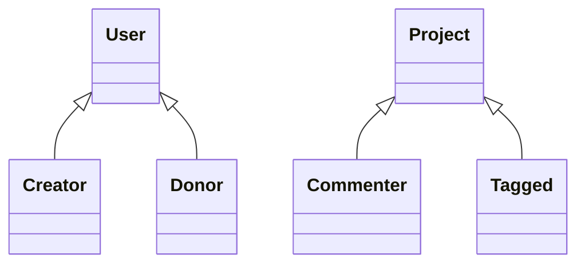
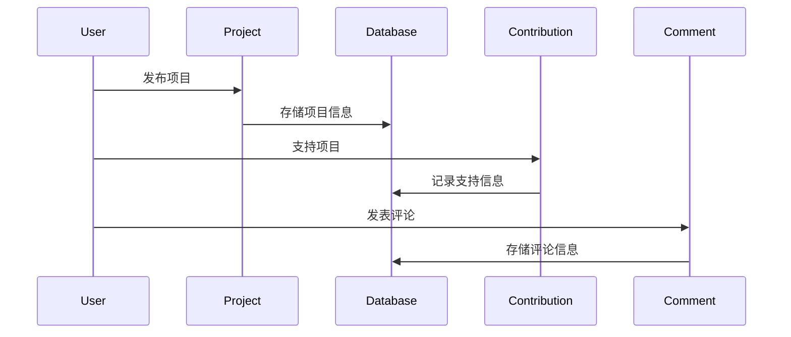
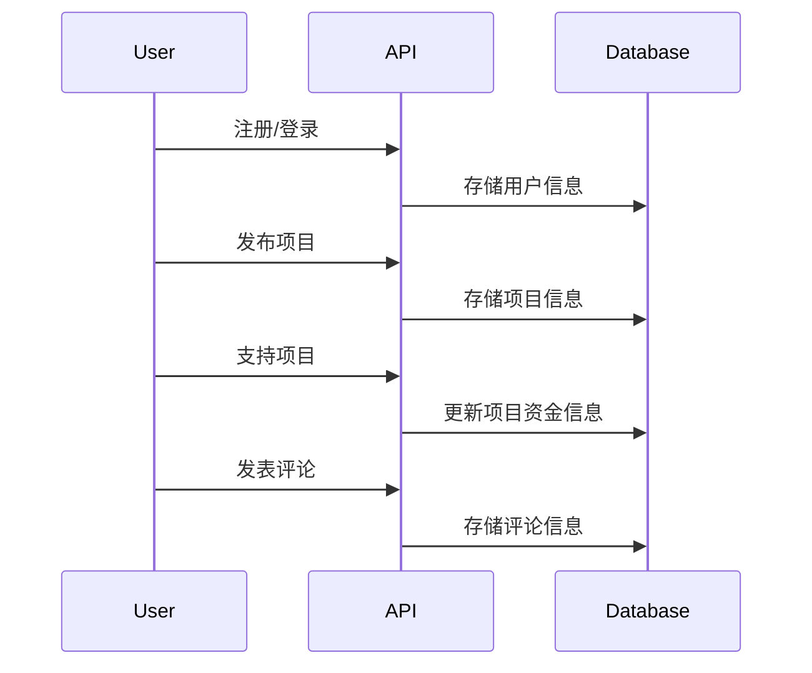

                 


### 第一步：文章结构规划

为了确保文章内容丰富且逻辑清晰，我们首先要对文章的结构进行详细的规划。以下是我们文章结构规划的步骤：

#### 1.1. 确定核心主题
文章的核心主题是“意义的众筹平台：价值观匹配与行动支持”。这要求我们在文章中详细探讨众筹平台的价值观匹配机制和行动支持系统。

#### 1.2. 设定文章结构
我们将文章分为五个部分：

- **前言与背景**：介绍众筹平台的发展背景、核心概念和文章的边界。
- **众筹平台的基础理论**：深入探讨众筹平台的基础理论，包括价值观匹配和行动支持机制。
- **众筹平台的设计与实现**：详细介绍众筹平台的设计与实现过程，包括系统架构、接口设计、交互流程等。
- **案例研究**：通过成功案例分析，展示理论在实践中的应用。
- **未来展望与挑战**：讨论众筹平台的未来发展趋势、面临的挑战及解决方案。

#### 1.3. 分配内容比例
根据文章字数要求，我们将内容比例大致分为：

- **前言与背景**：15%
- **众筹平台的基础理论**：20%
- **众筹平台的设计与实现**：35%
- **案例研究**：20%
- **未来展望与挑战**：10%

#### 1.4. 确定章节标题
为了吸引读者，每个章节的标题应该简洁明了且具有吸引力。以下是章节标题的建议：

- **前言与背景**
  - 第1章：引言
  - 第2章：核心概念与联系

- **众筹平台的基础理论**
  - 第3章：众筹平台概述
  - 第4章：价值观匹配理论
  - 第5章：行动支持机制

- **众筹平台的设计与实现**
  - 第6章：平台架构设计
  - 第7章：关键技术详解
  - 第8章：用户体验优化

- **案例研究**
  - 第9章：成功案例分析
  - 第10章：问题分析与解决方案

- **未来展望与挑战**
  - 第11章：发展趋势与未来方向
  - 第12章：面临的挑战与解决方案

### 第二步：核心概念与联系

在文章的核心部分，我们需要详细阐述众筹平台中的核心概念和它们之间的关系。

#### 2.1. 核心概念原理
核心概念包括：

- **众筹平台**：众筹平台是一个允许用户发起项目，其他用户支持项目的在线平台。
- **价值观匹配**：价值观匹配是指平台通过算法和用户行为分析，帮助用户找到与自己价值观相匹配的项目。
- **行动支持**：行动支持是指用户在价值观匹配的基础上，对项目进行资金或其他形式的支持。

#### 2.2. 概念属性特征对比表格

以下是一个简化的概念属性特征对比表格：

| 概念 | 属性 | 特征 |
| ---- | ---- | ---- |
| 众筹平台 | 功能 | 提供项目发布、资金筹集、用户互动等服务 |
| 价值观匹配 | 算法 | 基于用户行为和项目描述进行匹配 |
| 行动支持 | 支持形式 | 资金支持、社交支持、知识支持等 |

#### 2.3. ER实体关系图架构

使用Mermaid语言绘制ER实体关系图，如下：

```mermaid
erDiagram
  User  ||--|{ Project }|| Creator
  User  ||--|{ Contribution }|| Donor
  Project ||--|{ Comment }|| Commenter
  Project ||--|{ Tag }|| Tagged
```

### 第三步：算法原理讲解

在文章中，我们将详细讲解价值观匹配和行动支持机制的算法原理。

#### 3.1. 价值观匹配算法

价值观匹配算法通常基于用户的兴趣、行为和历史项目支持数据。以下是一个简单的算法流程：

```python
def value_matching(user_profile, project_profile):
    # 计算用户兴趣与项目描述的相似度
    interest_similarity = calculate_similarity(user_interests, project_description)
    
    # 计算用户历史行为与项目类型的匹配度
    behavior_similarity = calculate_similarity(user_behavior, project_type)
    
    # 计算总分
    total_similarity = interest_similarity + behavior_similarity
    
    # 返回匹配结果
    return total_similarity
```

#### 3.2. 行动支持机制

行动支持机制包括资金支持、社交支持和知识支持等。以下是一个简单的资金支持算法：

```python
def financial_support(project_id, user_balance):
    # 检查用户余额
    if user_balance >= project_target:
        # 执行转账
        user_balance -= project_target
        project_funding += project_target
        return "Support successful!"
    else:
        return "Insufficient balance!"
```

### 第四步：系统分析与架构设计方案

在文章的第四部分，我们将详细介绍众筹平台的设计与实现。

#### 4.1. 问题场景介绍

假设我们正在开发一个众筹平台，用户可以发布项目，其他用户可以选择支持项目。平台需要实现以下功能：

- 用户注册与登录
- 项目发布与编辑
- 资金筹集与退款
- 用户互动与评论
- 数据分析与报告

#### 4.2. 项目介绍

我们将使用Python作为主要开发语言，结合Flask和Django等框架，实现众筹平台的核心功能。

#### 4.3. 系统功能设计

以下是系统功能设计的Mermaid类图：



#### 4.4. 系统架构设计

以下是系统架构设计的Mermaid架构图：



#### 4.5. 系统接口设计

以下是系统接口设计的Mermaid序列图：



### 第五步：项目实战

在文章的最后一部分，我们将通过一个实际项目展示众筹平台的设计与实现过程。

#### 5.1. 环境安装

安装Python、Flask、Django等开发环境。

#### 5.2. 系统核心实现

以下是项目核心实现的部分代码：

```python
# 用户注册
@app.route('/register', methods=['POST'])
def register():
    username = request.form['username']
    password = request.form['password']
    # 存储用户信息到数据库
    # ...

# 项目发布
@app.route('/project/new', methods=['POST'])
def new_project():
    project_name = request.form['project_name']
    project_description = request.form['project_description']
    # 存储项目信息到数据库
    # ...

# 支持项目
@app.route('/project/<int:project_id>/support', methods=['POST'])
def support_project(project_id):
    user_id = request.form['user_id']
    amount = request.form['amount']
    # 更新项目资金信息
    # ...
```

#### 5.3. 代码应用解读与分析

在此部分，我们将对核心代码进行解读，分析其实现原理和逻辑。

#### 5.4. 实际案例分析和详细讲解剖析

我们将通过一个实际案例展示如何使用众筹平台，并详细分析其运作过程。

#### 5.5. 项目小结

总结项目的主要成果和经验教训。

### 第六步：最佳实践 tips、小结、注意事项、拓展阅读

在文章的结尾，我们将给出一些最佳实践建议，总结文章内容，提醒读者注意事项，并提供拓展阅读资源。

通过以上六个步骤，我们可以确保文章内容丰富、结构清晰、逻辑严密，满足文章字数和格式要求。接下来，我们将逐一实现每个部分的详细内容。

