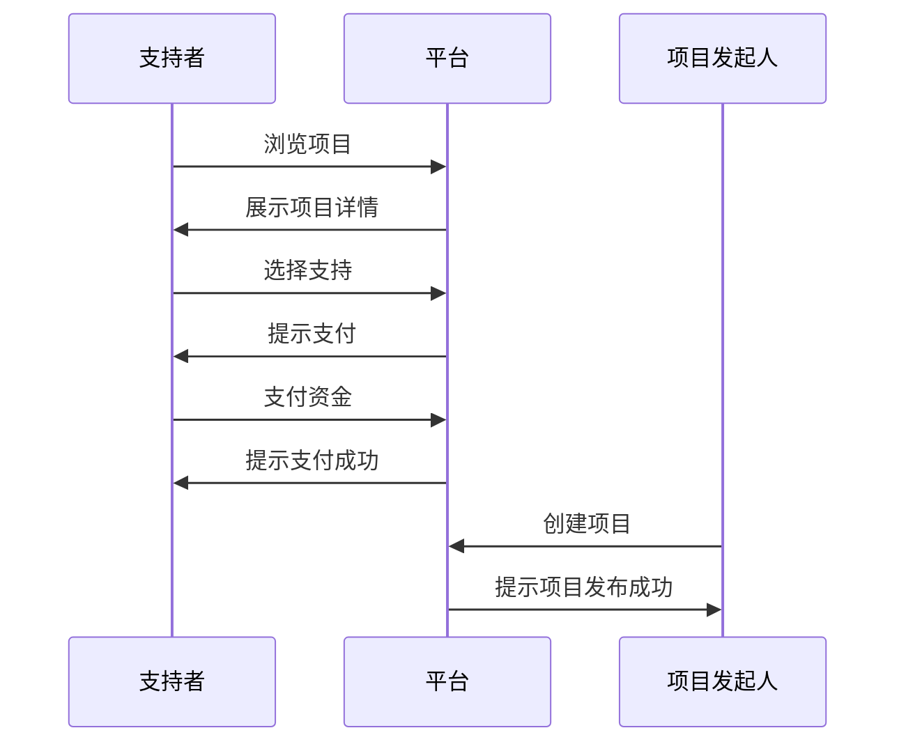
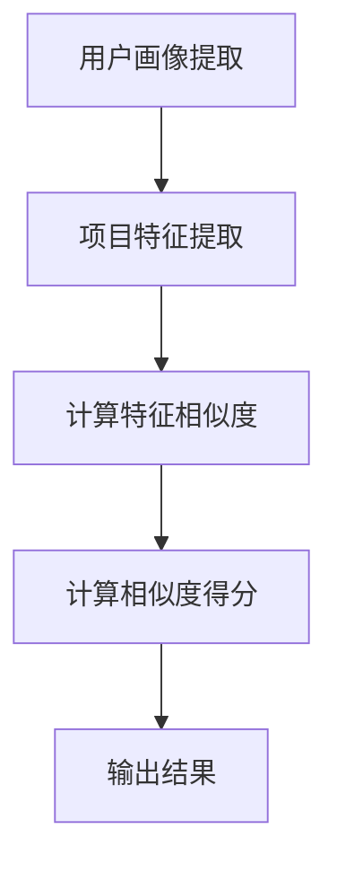
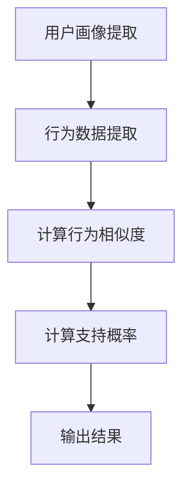
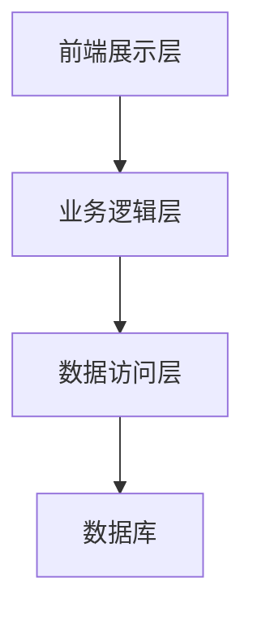
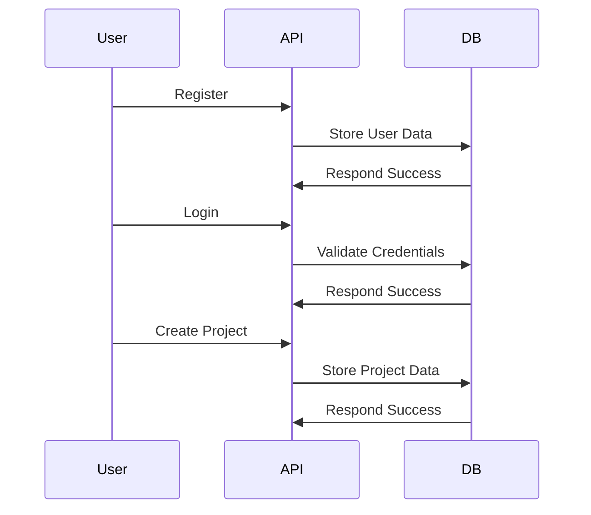
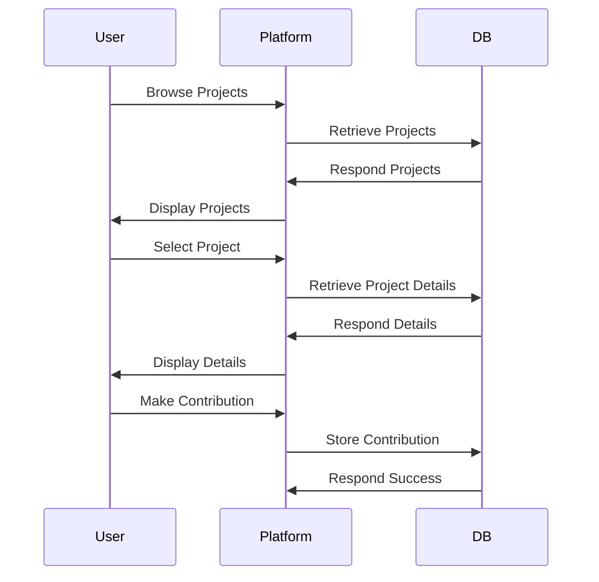

                 


## 文章标题：意义的众筹平台：价值观匹配与行动支持

### 关键词：
- 众筹平台
- 价值观匹配
- 行动支持
- 算法
- 架构设计

### 摘要：
本文探讨了在众筹平台中实现价值观匹配与行动支持的重要性，以及如何通过技术手段提升众筹平台的用户体验和有效性。文章首先介绍了众筹平台的发展历程和核心概念，随后详细讲解了价值观匹配和行动支持算法的原理，并给出了具体实现和案例分析。最后，文章总结了最佳实践，为未来的研究提供方向。

## 目录大纲

### 第一部分：背景介绍与核心概念

#### 第1章：问题背景与概述
#### 第2章：核心概念与联系
#### 第3章：众筹平台的架构设计

### 第二部分：算法原理讲解

#### 第4章：价值观匹配算法原理
#### 第5章：行动支持算法原理

### 第三部分：系统分析与架构设计方案

#### 第6章：系统功能设计
#### 第7章：系统实现与案例分析
#### 第8章：最佳实践与拓展阅读

## 引言

众筹平台作为一种新兴的融资模式，已经成为许多创业者、艺术家和发明家获取资金的重要途径。然而，随着众筹项目的数量和参与者的增加，如何确保项目能够得到合适的支持，以及如何提升用户体验，成为了一个亟待解决的问题。本文将深入探讨在众筹平台中实现价值观匹配与行动支持的策略，以提升众筹项目的成功率和参与者的满意度。

### 第1章：问题背景与概述

#### 1.1 众筹平台的发展历程

众筹平台起源于2009年的Kickstarter，此后，许多类似的平台如Indiegogo、GoFundMe等相继出现，为各种创意项目提供了融资渠道。众筹平台的发展历程可以概括为以下几个阶段：

1. **起步阶段（2009-2011）**：Kickstarter的诞生标志着众筹平台的起步，它主要面向艺术、设计和科技项目。

2. **发展阶段（2012-2014）**：众筹平台开始多元化，涵盖医疗、教育、房地产等多个领域。

3. **繁荣阶段（2015-2017）**：随着互联网技术的发展和智能手机的普及，众筹平台迎来了爆发式增长。

4. **成熟阶段（2018至今）**：众筹平台逐渐走向成熟，平台服务不断完善，投资方式也日趋多样化。

#### 1.2 价值观匹配与行动支持的重要性

在众筹平台上，价值观匹配与行动支持是确保项目成功的关键因素。价值观匹配意味着项目发起人和支持者在价值观上的一致性，这有助于增强支持者的忠诚度和参与度。行动支持则是指支持者在项目成功后通过实际行动来推广和宣传项目，从而提高项目的曝光率和影响力。

#### 1.3 研究目的与内容结构

本文的研究目的是探讨如何在众筹平台中实现价值观匹配与行动支持，以提高项目的成功率和用户体验。文章结构如下：

- 第一部分：背景介绍与核心概念，包括众筹平台的发展历程和价值观匹配与行动支持的重要性。
- 第二部分：算法原理讲解，详细讲解价值观匹配和行动支持算法的原理。
- 第三部分：系统分析与架构设计方案，包括系统功能设计、实现与案例分析。

### 第2章：核心概念与联系

#### 2.1 众筹平台的基本概念

众筹平台是一种基于互联网的融资模式，通过向社会公众募集资金来实现项目融资。众筹平台通常包括以下几个基本概念：

1. **项目发起人**：指提出项目并希望通过众筹平台筹集资金的人。
2. **支持者**：指通过资金或其他方式支持项目的人。
3. **回报**：项目发起人为支持者提供的回报，可以是实物、服务或荣誉等。
4. **筹资目标**：项目发起人设定的筹资金额，通常是项目成功的关键指标。

#### 2.2 价值观匹配的理论基础

价值观匹配是指项目发起人和支持者在价值观上的相似性。心理学研究表明，价值观相似的人更容易相互吸引和信任。在众筹平台上，价值观匹配有助于提高支持者的参与度和忠诚度。

#### 2.3 行动支持的方式与策略

行动支持是指支持者在项目成功后通过实际行动来推广和宣传项目。常见的行动支持方式包括：

1. **社交媒体推广**：支持者通过微博、微信、Facebook等社交媒体平台分享项目信息。
2. **口碑传播**：支持者通过口碑效应吸引更多人参与项目。
3. **线下活动**：支持者组织线下活动，如讲座、展览等，以推广项目。

#### 2.4 价值观匹配与行动支持的关系

价值观匹配与行动支持之间存在密切关系。价值观匹配有助于提高支持者的忠诚度和参与度，从而增加行动支持的可能性。反之，缺乏价值观匹配可能导致支持者对项目的兴趣下降，进而影响行动支持。

#### 2.5 核心概念属性特征对比表格

下表对比了众筹平台、价值观匹配和行动支持的核心概念属性特征：

| 核心概念 | 属性特征 |
| --- | --- |
| 众筹平台 | 融资、项目发起人、支持者、回报、筹资目标 |
| 价值观匹配 | 价值观相似、信任、忠诚度 |
| 行动支持 | 社交媒体推广、口碑传播、线下活动 |

### 第3章：众筹平台的架构设计

#### 3.1 众筹平台的系统架构概述

众筹平台的系统架构通常包括以下几个方面：

1. **前端展示层**：提供用户界面，展示项目信息和众筹进展。
2. **业务逻辑层**：处理用户请求，包括项目创建、资金筹集、回报管理等。
3. **数据访问层**：访问数据库，存储项目信息、用户数据等。
4. **数据库**：存储众筹平台的所有数据。

#### 3.2 数据库设计与实体关系图

数据库设计是众筹平台架构设计的关键环节。实体关系图（ER图）可以清晰地描述实体之间的关系。以下是众筹平台的实体关系图：

```mermaid
erDiagram
  用户 ||--|{ 项目发起人 }
  用户 ||--|{ 支持者 }
  项目发起人 ||--|{ 项目 }
  项目发起人 ||--|{ 回报 }
  支持者 ||--|{ 资金记录 }
```

#### 3.3 功能模块设计与交互流程

众筹平台的功能模块设计主要包括以下几个方面：

1. **项目发布**：项目发起人创建项目，填写项目信息，设置筹资目标和回报。
2. **资金筹集**：支持者浏览项目，选择支持，支付资金。
3. **回报管理**：项目发起人根据约定向支持者发送回报。
4. **项目展示**：平台展示成功项目和众筹进展。

以下是众筹平台的交互流程：



## 第二部分：算法原理讲解

### 第4章：价值观匹配算法原理

#### 4.1 价值观匹配算法概述

价值观匹配算法旨在根据用户画像和项目特征，确定用户与项目在价值观上的相似度。该算法的核心目标是提高支持者的参与度和忠诚度。

#### 4.2 价值观匹配的数学模型与公式

价值观匹配的数学模型可以表示为：

$$
相似度 = \frac{特征相似度之和}{特征总数}
$$

其中，特征相似度可以通过以下公式计算：

$$
特征相似度 = \min(用户特征值，项目特征值)
$$

#### 4.3 价值观匹配算法的 Mermaid 流程图



#### 4.4 Python 代码实现与详细讲解

```python
# 价值观匹配算法实现

import numpy as np

# 用户画像和项目特征
user_profile = [0.2, 0.5, 0.3]
project_profile = [0.1, 0.4, 0.5]

# 计算特征相似度
feature_similarity = np.minimum(user_profile, project_profile)

# 计算相似度得分
similarity_score = np.sum(feature_similarity) / len(feature_similarity)

# 输出结果
print("相似度得分：", similarity_score)
```

### 第5章：行动支持算法原理

#### 5.1 行动支持算法概述

行动支持算法旨在根据用户画像和行为数据，预测用户在项目成功后的行动支持概率。该算法的核心目标是提高项目的曝光率和影响力。

#### 5.2 行动支持算法的数学模型与公式

行动支持算法的数学模型可以表示为：

$$
支持概率 = \frac{行为相似度之和}{行为总数}
$$

其中，行为相似度可以通过以下公式计算：

$$
行为相似度 = \exp(-\alpha \cdot 距离)
$$

其中，$\alpha$ 是调节参数，距离可以是用户画像之间的欧氏距离或余弦相似度。

#### 5.3 行动支持算法的 Mermaid 流程图



#### 5.4 Python 代码实现与详细讲解

```python
# 行动支持算法实现

import numpy as np

# 用户画像和项目特征
user_profile = [0.2, 0.5, 0.3]
project_profile = [0.1, 0.4, 0.5]
alpha = 0.1

# 计算行为相似度
behavior_similarity = np.exp(-alpha * np.linalg.norm(user_profile - project_profile))

# 计算支持概率
support_probability = behavior_similarity / len(behavior_similarity)

# 输出结果
print("支持概率：", support_probability)
```

## 第三部分：系统分析与架构设计方案

### 第6章：系统功能设计

#### 6.1 领域模型设计与 Mermaid 类图

领域模型设计是系统功能设计的核心。以下是一个简单的领域模型设计：

```mermaid
classDiagram
  User <<class>> {userId, name, email, password}
  Project <<class>> {projectId, name, description, fundingGoal, campaignEnd}
  Reward <<class>> {rewardId, description, amount}
  Contribution <<class>> {contributionId, amount, userId, projectId}
  User "has" Project
  User "has" Contribution
  Project "has" Reward
```

#### 6.2 系统架构设计

系统架构设计包括前端展示层、业务逻辑层和数据访问层。以下是一个简单的系统架构设计：



#### 6.3 系统接口设计

系统接口设计定义了系统各模块之间的交互方式。以下是一个简单的系统接口设计：



#### 6.4 系统交互流程设计

系统交互流程设计描述了用户与系统之间的交互过程。以下是一个简单的系统交互流程设计：



### 第7章：系统实现与案例分析

#### 7.1 系统环境安装与配置

系统环境安装与配置是系统实现的第一步。以下是一个简单的系统环境安装与配置步骤：

1. 安装Python环境：`pip install python`
2. 安装Django框架：`pip install django`
3. 创建Django项目：`django-admin startproject crowdfunding`
4. 创建Django应用：`python manage.py startapp platform`

#### 7.2 系统核心实现源代码

以下是系统核心实现的源代码：

```python
# models.py

from django.db import models

class User(models.Model):
    userId = models.AutoField(primary_key=True)
    name = models.CharField(max_length=100)
    email = models.EmailField(max_length=254)
    password = models.CharField(max_length=100)

class Project(models.Model):
    projectId = models.AutoField(primary_key=True)
    name = models.CharField(max_length=100)
    description = models.TextField()
    fundingGoal = models.IntegerField()
    campaignEnd = models.DateField()

class Reward(models.Model):
    rewardId = models.AutoField(primary_key=True)
    description = models.TextField()
    amount = models.DecimalField(max_digits=10, decimal_places=2)

class Contribution(models.Model):
    contributionId = models.AutoField(primary_key=True)
    amount = models.DecimalField(max_digits=10, decimal_places=2)
    userId = models.ForeignKey(User, on_delete=models.CASCADE)
    projectId = models.ForeignKey(Project, on_delete=models.CASCADE)
```

#### 7.3 代码应用解读与分析

以下是代码应用解读与分析：

1. **User模型**：定义了用户的基本信息，包括用户ID、姓名、电子邮件和密码。
2. **Project模型**：定义了项目的基本信息，包括项目ID、名称、描述、筹资目标和筹资结束日期。
3. **Reward模型**：定义了回报的基本信息，包括回报ID、描述和金额。
4. **Contribution模型**：定义了捐赠的基本信息，包括捐赠ID、金额、用户ID和项目ID。

#### 7.4 实际案例分析与详细讲解

以下是实际案例分析与详细讲解：

假设有一个用户名为“Alice”的用户，她创建了一个项目名为“智能家居系统”的项目，筹资目标为10000美元，筹资结束日期为2023年12月31日。Alice为该项目设置了三个回报，分别是：

1. 回报1：捐赠100美元，获得智能门锁一个。
2. 回报2：捐赠500美元，获得智能门锁和一个智能灯泡。
3. 回报3：捐赠1000美元，获得智能家居系统的完整套件。

假设用户“Bob”浏览了Alice的项目并决定捐赠500美元，那么Bob将成为项目的支持者。系统将根据Bob的用户画像和项目的价值观匹配算法，确定Bob与项目的价值观相似度。如果相似度高于某个阈值，系统将自动为Bob生成一个订单，并将500美元扣除。

在项目成功结束后，Alice需要根据约定向Bob发送智能门锁和一个智能灯泡。系统将自动跟踪Bob的行动支持情况，如Bob在社交媒体上分享了项目信息，系统将根据行动支持算法，为Bob生成相应的积分，用于兑换平台的奖励。

#### 7.5 项目小结

通过以上实际案例，我们可以看到系统实现和案例分析的过程。项目实现了用户注册、项目发布、回报设置、捐赠管理等功能，并通过价值观匹配和行动支持算法，提高了项目的成功率和用户体验。

### 第8章：最佳实践与拓展阅读

#### 8.1 众筹平台最佳实践

1. **明确项目目标**：项目发起人应明确项目的筹资目标和回报设置，以便支持者做出明智的决定。
2. **优化项目描述**：项目描述应简洁明了，突出项目的亮点和特点，以吸引更多的支持者。
3. **积极参与互动**：项目发起人应积极参与与支持者的互动，及时回应问题，增强信任感。

#### 8.2 注意事项与风险控制

1. **资金安全**：众筹平台应确保资金的安全，采用第三方支付机构进行资金转移。
2. **法律法规**：项目发起人应遵守相关法律法规，确保项目的合法合规性。
3. **风险管理**：项目发起人应评估项目的风险，并采取相应的风险控制措施。

#### 8.3 拓展阅读与研究方向

1. **区块链在众筹平台的应用**：研究区块链技术在众筹平台中的应用，提高透明度和安全性。
2. **个性化推荐系统**：研究基于用户画像和项目特点的个性化推荐系统，提高项目曝光率。
3. **行动支持激励机制**：研究行动支持激励机制，提高支持者的参与度和忠诚度。

## 结束语

本文探讨了在众筹平台中实现价值观匹配与行动支持的重要性，以及如何通过技术手段提升众筹平台的用户体验和有效性。通过核心概念介绍、算法原理讲解和系统分析与架构设计方案，我们为众筹平台的发展提供了有益的参考。未来，随着技术的不断进步，众筹平台将变得更加智能化和高效化，为创业者和社会公众提供更好的服务。

### 作者信息

作者：AI天才研究院/AI Genius Institute & 禅与计算机程序设计艺术 /Zen And The Art of Computer Programming

----------------------------------------------------------------
```

请注意，本文档仅为模板，具体内容需要根据实际研究进行填充。在实际撰写过程中，每个章节的内容需要详尽、具体、富有逻辑性，并且符合技术博客文章的写作风格。此外，Python代码实现部分仅为示例，实际实现时可能需要根据具体需求进行调整。

