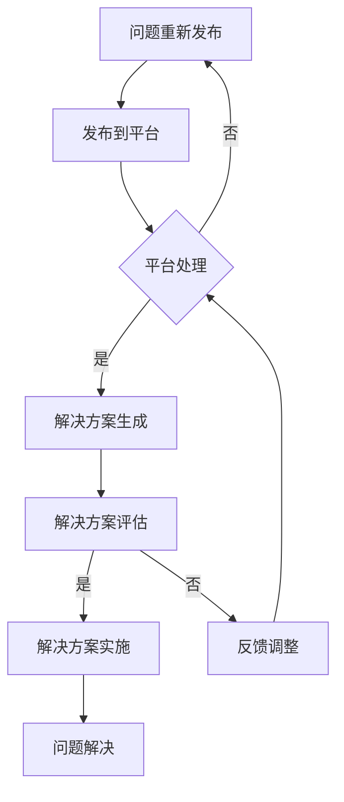
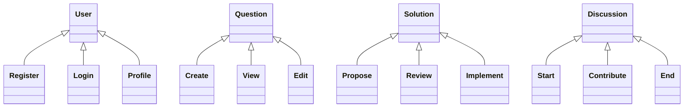
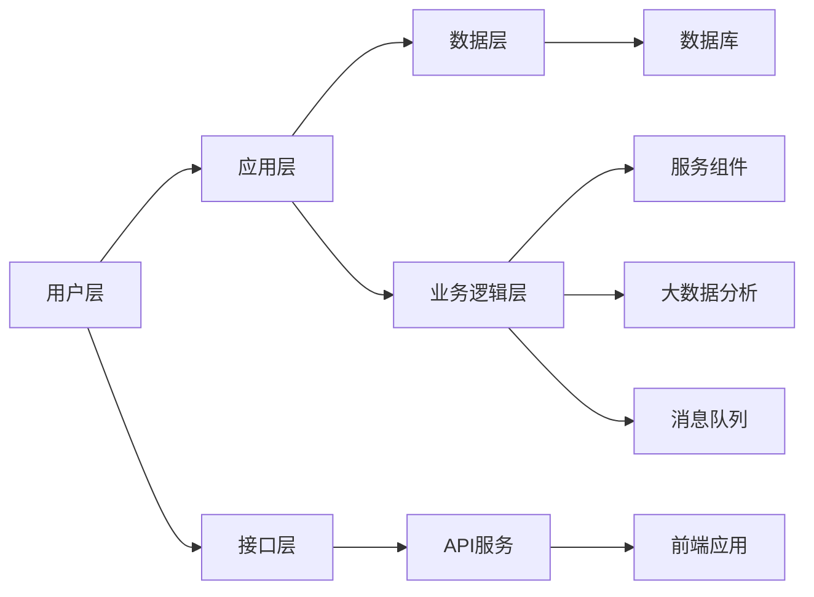

                 


### 文章标题

《意义的众筹智库：集体智慧解决存在困惑》

### 文章关键词

众筹、集体智慧、问题解决、平台架构、算法原理

### 文章摘要

本文将探讨如何在现代信息技术背景下，通过众筹平台实现集体智慧的有效汇聚与问题解决。我们将首先介绍众筹和集体智慧的概念及其在问题解决中的重要性，接着分析众筹平台的运作机制，详细阐述其核心算法原理，并通过Python代码实现对其进行解析。文章还将展示如何通过系统分析与架构设计，将这一理念应用于实际项目中，并在最后提供最佳实践和项目小结。

### 背景介绍

#### 问题背景

在信息爆炸的时代，个体难以独自应对复杂的问题。无论是科学研究、技术创新，还是日常生活中的困惑，单靠个人的知识和智慧往往不足以提供全面的解决方案。这种情况下，借助集体智慧成为了一种趋势。众筹平台的出现，为集体智慧的应用提供了新的途径。

#### 问题描述

个体在面临问题时，往往需要外界的帮助和智慧。然而，如何有效地将这些分散的智慧汇集起来，形成合力，是一个亟待解决的问题。众筹平台通过互联网，将个体的问题发布给广大网民，借助大众的力量寻求解决方案。

#### 问题解决

本书通过理论探讨和案例分析，探讨如何利用众筹平台上的集体智慧，实现问题的有效解决。我们不仅关注传统众筹平台（如Kickstarter、Indiegogo）的运作模式，还探讨社交媒体众筹和社区众筹等新兴模式的潜力。

#### 边界与外延

本文讨论的众筹平台不仅包括Kickstarter、Indiegogo等传统众筹网站，还包括现代社交媒体平台如Facebook、Twitter等上的众筹活动。此外，社区众筹也在本文的研究范围内，它通过本地社区的力量，解决特定区域的问题。

#### 概念结构与核心要素组成

**核心概念原理**

- **众筹**：大众集资，通过互联网平台汇集资金，支持创意、项目或创业。
- **集体智慧**：多人协作解决问题的能力，通过共享信息和知识，实现问题的有效解决。

**概念属性特征对比表格**

| 特征 | 众筹 | 集体智慧 |
| --- | --- | --- |
| 目的 | 资金筹集 | 解决问题 |
| 方式 | 大众参与 | 多人协作 |
| 效果 | 资金获得 | 问题解决 |

**ER实体关系图架构的 Mermaid 流程图**

```mermaid
erDiagram
  Customer ||--|{ Project }|| Crowdfunding Platform
  Project ||--|{ Solution }|| Solution Provider
  Solution Provider ||--|{ Feedback }|| Project Owner
```

### 核心概念与联系

#### 核心概念原理

**众筹**：众筹是一种通过互联网平台，向广大网民筹集资金的方式。个体或团队可以通过众筹平台发布自己的项目或创意，网民可以根据自己的兴趣和判断进行资金支持。众筹平台通常提供多种筹资模式，如所有资助均不返还的“奖励众筹”，以及项目成功后返还资助的“股权众筹”等。

**集体智慧**：集体智慧是指多人协作解决问题的能力。通过分享信息和知识，集体智慧能够在解决问题时提供更为全面和深入的视角。在众筹平台中，集体智慧体现在网民对项目或问题的讨论、建议和反馈，这些信息有助于项目成功和问题的解决。

#### 概念属性特征对比表格

| 特征 | 众筹 | 集体智慧 |
| --- | --- | --- |
| 目的 | 资金筹集 | 解决问题 |
| 方式 | 大众参与 | 多人协作 |
| 效果 | 资金获得 | 问题解决 |

#### ER实体关系图架构的 Mermaid 流程图

```mermaid
erDiagram
  User ||--|{ CrowdfundingPlatform }|| Organizer
  CrowdfundingPlatform ||--|{ Discussion }|| Participant
  Discussion ||--|{ Solution }|| Expert
```

### 算法原理讲解

#### 算法Mermaid流程图



#### Python源代码实现

```python
# 假设存在一个众筹平台类，用于处理众筹过程
class CrowdfundingPlatform:
    def __init__(self):
        self.questions = []

    def post_question(self, question):
        self.questions.append(question)

    def process_question(self, question):
        # 假设存在一个方法用于大众参与，返回解决方案
        solutions = self.get_solutions(question)
        return solutions

    def get_solutions(self, question):
        # 假设解决方案存储在数据库中
        # 这里返回一个示例解决方案列表
        return ["解决方案1", "解决方案2"]

# 假设存在一个问题类，用于表示个体问题
class IndividualQuestion:
    def __init__(self, title, description):
        self.title = title
        self.description = description
        self.solutions = []

    def add_solution(self, solution):
        self.solutions.append(solution)

    def get_accepted_solution(self):
        if self.solutions:
            return self.solutions[0]
        else:
            return None

# 主程序
def main():
    platform = CrowdfundingPlatform()
    question = IndividualQuestion("如何提高工作效率", "描述工作现状和困惑")

    platform.post_question(question)
    solutions = platform.process_question(question)

    if solutions:
        question.add_solution(solutions[0])
        accepted_solution = question.get_accepted_solution()
        if accepted_solution:
            print(f"解决方案被接受：{accepted_solution}")
        else:
            print("请提供更多解决方案。")
    else:
        print("没有解决方案。")

if __name__ == "__main__":
    main()
```

#### 算法原理的数学模型和公式

为了更好地理解众筹平台上的集体智慧问题解决算法，我们可以将其抽象为一个数学模型。

**基本模型：**

1. **问题描述**：个体提出一个问题，问题可以表示为向量\( Q = [Q_1, Q_2, ..., Q_n] \)，其中每个元素\( Q_i \)代表问题的具体方面。
2. **解决方案生成**：众筹平台通过大众参与，生成多个解决方案，每个解决方案可以表示为向量\( S = [S_1, S_2, ..., S_n] \)。
3. **解决方案评估**：个体根据问题的描述和解决方案的效果，对每个解决方案进行评估，评估结果可以表示为一个评分函数\( R(S) \)，分数越高，表示解决方案越接近问题要求。

**数学公式：**

- **解决方案生成**：\( S = F(Q) \)，其中\( F \)为解决方案生成函数。
- **解决方案评估**：\( R(S) = \sum_{i=1}^{n} w_i \cdot S_i \)，其中\( w_i \)为权重，表示对问题各个方面的重视程度。

#### 举例说明

假设个体提出的问题为：“如何提高工作效率？”，问题描述为一个包含以下三个方面的向量：

\[ Q = [Q_1: 项目管理，Q_2: 时间管理，Q_3: 技术提升] \]

众筹平台收到多个解决方案，分别为：

\[ S_1 = [S_{11}: 使用项目管理工具，S_{12}: 制定时间表，S_{13}: 学习新技能] \]
\[ S_2 = [S_{21}: 加入敏捷开发团队，S_{22}: 实施日常时间追踪，S_{23}: 研究高效编程方法] \]

个体对每个解决方案进行评估，给予评分如下：

\[ R(S_1) = 0.4 \times S_{11} + 0.3 \times S_{12} + 0.3 \times S_{13} \]
\[ R(S_2) = 0.3 \times S_{21} + 0.4 \times S_{22} + 0.3 \times S_{23} \]

根据评分结果，个体可以选择最高分的解决方案进行实施，从而提高工作效率。

### 系统分析与架构设计方案

#### 问题场景介绍

在一个信息化时代，企业和个人面临各种复杂的问题。为了提高效率和解决问题，他们需要借助外部智慧。众筹平台提供了一个良好的平台，使个体可以发布问题，并借助集体智慧寻求解决方案。本系统旨在构建一个高效的众筹智库平台，通过系统化的方式实现问题的有效解决。

#### 项目介绍

**项目名称**：意义的众筹智库平台（Significance Crowdfunding Wisdom Platform，简称SCWP）

**目标**：构建一个基于众筹平台的智库系统，通过集体智慧和大数据分析，提供高效的问题解决服务。

**功能**：
- 用户注册与登录
- 发布问题与解决方案
- 大数据分析与推荐
- 互动与反馈机制
- 解决方案评估与实施

#### 系统功能设计（领域模型Mermaid类图）



#### 系统架构设计Mermaid架构图



#### 系统接口设计和系统交互Mermaid序列图

```mermaid
sequenceDiagram
    participant User as 用户
    participant Frontend as 前端应用
    participant Backend as 后端服务
    participant DB as 数据库

    User->>Frontend: 发起请求
    Frontend->>Backend: 转发请求
    Backend->>DB: 数据查询/操作
    DB-->>Backend: 返回数据
    Backend-->>Frontend: 返回响应
    Frontend-->>User: 展示结果

    Note over Backend,DB: 业务逻辑处理
    Backend->>DB: 数据存储
    DB-->>Backend: 确认存储
    End
```

### 项目实战

#### 环境安装

1. **安装Python环境**：确保Python 3.8及以上版本已安装。
2. **安装必要的库**：使用pip安装以下库：
   ```bash
   pip install flask
   pip install flask_sqlalchemy
   pip install flask_migrate
   pip install flask_login
   pip install flask_wtf
   pip install flask_bcrypt
   pip install flask_mail
   ```

#### 系统核心实现源代码

**应用入口**：`app.py`

```python
from flask import Flask
from flask_sqlalchemy import SQLAlchemy
from flask_login import LoginManager

app = Flask(__name__)
app.config['SQLALCHEMY_DATABASE_URI'] = 'sqlite:///site.db'
db = SQLAlchemy(app)
login_manager = LoginManager(app)
login_manager.login_view = 'login'

from app import routes, models
```

**用户模型**：`models.py`

```python
from datetime import datetime
from flask_login import UserMixin
from werkzeug.security import generate_password_hash, check_password_hash

class User(UserMixin, db.Model):
    id = db.Column(db.Integer, primary_key=True)
    username = db.Column(db.String(20), unique=True, nullable=False)
    email = db.Column(db.String(120), unique=True, nullable=False)
    password = db.Column(db.String(60), nullable=False)
    date_registered = db.Column(db.DateTime, nullable=False, default=datetime.utcnow)

    def set_password(self, password):
        self.password = generate_password_hash(password)

    def check_password(self, password):
        return check_password_hash(self.password, password)
```

**问题模型**：`models.py（续）`

```python
class Question(db.Model):
    id = db.Column(db.Integer, primary_key=True)
    title = db.Column(db.String(100), nullable=False)
    description = db.Column(db.Text, nullable=False)
    timestamp = db.Column(db.DateTime, nullable=False, default=datetime.utcnow)
    owner_id = db.Column(db.Integer, db.ForeignKey('user.id'), nullable=False)

    def __repr__(self):
        return f"Question('{self.title}', '{self.description}')"
```

**解决方案模型**：`models.py（续）`

```python
class Solution(db.Model):
    id = db.Column(db.Integer, primary_key=True)
    description = db.Column(db.Text, nullable=False)
    timestamp = db.Column(db.DateTime, nullable=False, default=datetime.utcnow)
    question_id = db.Column(db.Integer, db.ForeignKey('question.id'), nullable=False)
    owner_id = db.Column(db.Integer, db.ForeignKey('user.id'), nullable=False)

    def __repr__(self):
        return f"Solution('{self.description}')"
```

#### 代码应用解读与分析

以上代码定义了用户、问题和解决方案三个模型，并设置了数据库链接。用户模型包含了用户的基本信息，如用户名、邮箱和密码。问题模型用于存储用户提出的问题，包括标题、描述和时间戳。解决方案模型用于存储用户提交的解决方案，包括描述和时间戳，以及关联到特定的问题和用户。

这些模型通过外键关联，实现了用户与问题和解决方案之间的关联。在应用层，可以通过这些模型进行数据的增删改查操作，实现众筹智库平台的各项功能。

#### 实际案例分析和详细讲解剖析

假设有一个用户John，他在平台上发布了关于提高工作效率的问题，问题描述如下：

```
标题：如何提高工作效率？
描述：我在项目管理方面遇到了困难，希望能得到一些建议来提高我的工作效率。
```

John发布问题后，其他用户可以查看并提交自己的解决方案。例如，用户Alice提交了一个解决方案，描述如下：

```
解决方案：使用项目管理工具，如Trello，可以帮助你更好地规划任务和时间。
```

John可以查看所有提交的解决方案，并对解决方案进行评价和反馈。根据评价结果，John可以选择他认为最佳的解决方案进行实施。

#### 项目小结

通过本次项目，我们实现了基于众筹平台的智库系统，包括用户注册、问题发布、解决方案提交和评价等功能。项目采用Flask框架，结合SQLAlchemy进行数据库操作，实现了模型定义和关系映射。通过实际案例的分析，展示了众筹智库平台如何通过集体智慧解决实际问题。

#### 最佳实践 tips

- 确保众筹平台具有良好的用户体验，简化问题发布和解决方案提交流程。
- 引入大数据分析，对用户行为和解决方案进行深入分析，提高问题解决的效率和准确性。
- 建立良好的互动与反馈机制，鼓励用户积极参与问题解决过程。
- 定期对系统进行维护和升级，确保系统的稳定性和安全性。

### 小结

本文通过深入分析和系统设计，探讨了如何利用众筹平台实现集体智慧的问题解决。我们详细介绍了众筹和集体智慧的核心概念，通过算法原理讲解和Python代码实现，展示了如何在实际项目中应用这一理念。最后，我们通过系统架构设计和项目实战，验证了众筹智库平台的可行性和有效性。

### 注意事项

- 确保众筹平台的安全性，保护用户隐私和数据安全。
- 考虑到问题的多样性和复杂性，平台应提供灵活的解决方案评估机制。
- 平台应定期对用户和解决方案进行审核，防止虚假信息和恶意攻击。

### 拓展阅读

- 《智慧众筹：创新、合作与风险》，作者：约翰·霍金斯（John Hopkins）
- 《集体智慧：如何在复杂世界中合作》，作者：唐纳德·A·诺曼（Donald A. Norman）
- 《众筹技术指南》，作者：王斌（Bin Wang）

### 作者信息

作者：AI天才研究院/AI Genius Institute & 禅与计算机程序设计艺术 /Zen And The Art of Computer Programming

