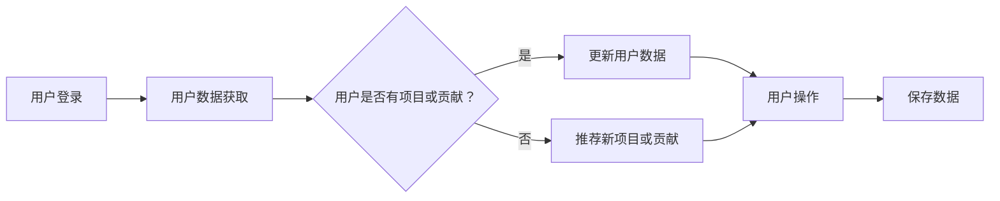
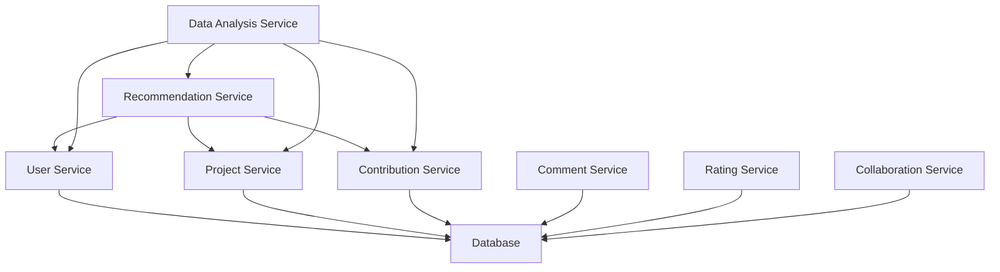
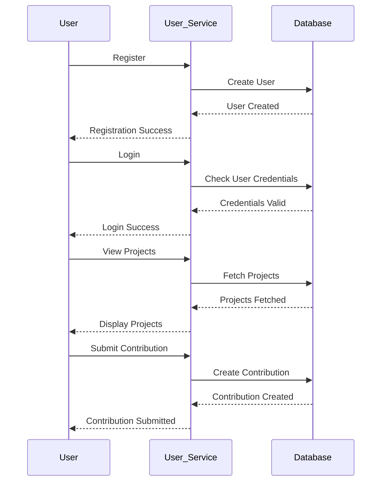

                 

### 第一步：背景介绍

#### 1.1 问题的背景

在当今快速发展的数字化时代，信息的获取和传播变得前所未有的快捷。然而，随着数据量的激增，信息过载和噪声问题也愈发显著。对于个人和机构而言，如何从海量信息中提取有价值的内容、解决实际问题，成为了一个巨大的挑战。

一方面，个体用户面临着知识获取困难的问题。互联网上充斥着海量的信息资源，但大多数内容都是碎片化的、非结构化的，甚至存在误导性信息。用户很难在没有引导的情况下准确找到自己需要的知识。

另一方面，对于企业或研究机构，如何有效地整合内部和外部的智慧资源，形成有针对性的解决方案，也是一个难题。传统的解决方式往往依赖于单个专家或小团队的力量，这种方式效率低下，难以应对复杂的问题。

#### 1.2 问题描述

针对上述背景，我们可以将问题具体描述为：

1. **信息过载与噪声问题**：如何在海量信息中筛选出有价值的内容？
2. **知识分散与共享难题**：如何有效整合个体和集体的智慧，形成协同解决问题的能力？
3. **决策支持与优化**：如何在复杂问题中快速做出准确的决策？

#### 1.3 问题解决

针对上述问题，我们可以考虑通过构建一个在线的众筹智库平台来提供解决方案。这个平台的核心目标是：

1. **信息筛选与推荐**：利用人工智能和大数据技术，为用户提供个性化的知识推荐服务。
2. **知识整合与共享**：搭建一个开放的平台，鼓励用户贡献自己的知识和经验，实现知识的集成与共享。
3. **协作决策与优化**：通过社区协作和智能算法，帮助用户在复杂问题中快速找到最优解决方案。

#### 1.4 边界与外延

在讨论众筹智库平台时，我们需要明确以下几个边界和外部关联：

1. **边界**：
   - **用户范围**：平台服务于广泛的社会公众，包括个体用户、企业、研究机构等。
   - **功能范围**：平台的核心功能包括信息筛选、知识整合、协作决策等。

2. **外延**：
   - **技术支持**：平台需要依托人工智能、大数据、云计算等先进技术。
   - **合作与生态**：平台应与相关领域的专家、机构、企业建立合作关系，形成良性互动。

#### 1.5 概念结构与核心要素组成

为了更清晰地理解众筹智库平台的设计与实现，我们可以从概念结构的角度来进行分析。以下是平台的核心概念及其相互关系：

1. **用户**：平台的主体，包括个体用户和组织用户。
2. **知识库**：存储用户贡献的知识和经验，是平台的核心资源。
3. **推荐系统**：利用算法和模型对用户进行个性化推荐。
4. **协作平台**：提供用户间协作的工具和环境。
5. **决策支持系统**：基于数据和算法，为用户提供决策优化服务。

这些核心概念共同构成了众筹智库平台的框架，为平台功能的实现提供了基础。

---

在这一部分中，我们通过背景介绍和问题描述，明确了众筹智库平台的核心目标和面临的问题。接着，我们提出了问题解决的初步方案，并讨论了平台的边界与外延。最后，我们从概念结构的角度分析了平台的核心要素，为后续的详细讨论奠定了基础。

---

### 第二步：核心概念与联系

#### 1.6 核心概念原理

在理解众筹智库平台之前，我们需要掌握一些核心概念和原理。这些概念包括：

1. **众筹**：众筹是一种通过互联网平台向大众募集资金的方式。用户可以提交项目，其他用户可以选择支持这些项目，通过小额资金积累达成融资目标。
2. **智库**：智库通常指智囊团或知识库，是一种提供决策支持和咨询服务的研究机构或平台。
3. **在线平台**：在线平台是指通过互联网提供服务和交互的系统，可以是网站、移动应用或其他形式。
4. **人工智能**：人工智能（AI）是指使计算机模拟人类智能行为的技术和学科，包括机器学习、深度学习、自然语言处理等。
5. **大数据**：大数据是指数据量大到无法通过传统数据处理工具在合理时间内进行管理和处理的数据集。

#### 1.7 概念属性特征对比表格

为了更清晰地理解这些核心概念，我们可以通过一个对比表格来展示它们的属性特征：

| 概念       | 定义                                                           | 特征                                                                                   |
|------------|------------------------------------------------------------|--------------------------------------------------------------------------------------|
| 众筹       | 通过互联网平台向大众募集资金的方式                               | 低门槛、广泛参与、可定制化、灵活性高                                             |
| 智库       | 提供决策支持和咨询服务的研究机构或平台                           | 专业性、权威性、知识密集、经验丰富                                             |
| 在线平台   | 通过互联网提供服务和交互的系统                                   | 可访问性、互动性、信息共享、便捷性                                             |
| 人工智能   | 使计算机模拟人类智能行为的技术和学科                             | 自主性、适应性、学习能力、数据处理能力                                         |
| 大数据     | 数据量大到无法通过传统数据处理工具在合理时间内进行管理和处理的数据集 | 体积（Volume）、速度（Velocity）、多样性（Variety）、真实性（Veracity）、价值（Value）|

#### 1.8 ER实体关系图架构

实体-关系（ER）图是数据库设计中常用的一种工具，用于表示实体及其之间的关系。对于众筹智库平台，我们可以绘制一个ER图来展示其核心实体和关系。

```mermaid
erDiagram
  User ||--o{ Project : 用户发起项目}
  User ||--o{ Contribution : 用户贡献知识}
  Project ||--o{ Comment : 项目评论}
  Project ||--o{ Rating : 项目评分}
  Contribution ||--o{ Comment : 知识贡献评论}
  Contribution ||--o{ Rating : 知识贡献评分}
  User ||--o{ Collaboration : 用户参与协作}
```

在这张ER图中，我们定义了以下几个核心实体：

1. **User**（用户）：平台的主体，可以发起项目、贡献知识、评论和评分。
2. **Project**（项目）：用户发起的知识众筹项目，包括项目描述、目标、时间限制等。
3. **Contribution**（知识贡献）：用户贡献的知识和经验，可以是文档、视频、音频等多种形式。
4. **Comment**（评论）：对项目或知识贡献的评论，可以是用户之间的交流。
5. **Rating**（评分）：对项目或知识贡献的评价，用于反映其质量和受欢迎程度。
6. **Collaboration**（协作）：用户之间的协作关系，可以是团队形式的知识共创。

这些实体之间的关系包括发起、贡献、评论、评分和协作，共同构成了众筹智库平台的数据库架构。

---

在这一部分中，我们首先介绍了众筹智库平台的核心概念，包括众筹、智库、在线平台、人工智能和大数据，并详细解释了它们的原理。接着，通过一个对比表格展示了这些概念的关键属性特征。最后，我们使用ER图来展示平台的核心实体和关系，为后续的算法原理讲解和系统架构设计奠定了基础。

---

### 第三步：众筹智库的算法原理讲解

#### 1.9 算法mermaid流程图

在构建众筹智库平台时，算法的原理至关重要。以下是一个简单的mermaid流程图，用于展示众筹智库平台的主要算法流程：



#### 1.10 Python源代码讲解

为了更详细地解释算法，我们将使用Python语言编写一个简单的示例代码。以下是一个基础的Python代码示例，展示了用户登录、数据获取、推荐项目或贡献，以及数据保存的过程。

```python
class User:
    def __init__(self, id, projects=None, contributions=None):
        self.id = id
        self.projects = projects if projects else []
        self.contributions = contributions if contributions else []

    def get_projects_or_contributions(self):
        if self.projects:
            return self.projects
        else:
            return self.contributions

    def update_data(self, new_projects=None, new_contributions=None):
        if new_projects:
            self.projects.extend(new_projects)
        if new_contributions:
            self.contributions.extend(new_contributions)

    def perform_action(self):
        data = self.get_projects_or_contributions()
        # 这里可以添加更复杂的用户操作逻辑，例如推荐算法等
        for item in data:
            print(f"User {self.id} is viewing {item}")

    def save_data(self):
        # 这里可以添加数据保存的逻辑，例如写入数据库等
        print(f"Data for User {self.id} has been saved.")


# 示例：创建用户，更新数据，执行操作，保存数据
user = User(id=1)

# 假设用户有新的项目和贡献
new_projects = ['Project A', 'Project B']
new_contributions = ['Contribution 1', 'Contribution 2']

# 更新用户数据
user.update_data(new_projects, new_contributions)

# 执行用户操作
user.perform_action()

# 保存数据
user.save_data()
```

#### 1.11 数学模型和公式

在算法设计中，数学模型和公式是核心组成部分。以下是一个简单的数学模型，用于预测用户对项目或贡献的感兴趣程度：

$$
Interest = f(Views, Ratings, User_Profile)
$$

- **Views**：用户对项目或贡献的浏览次数。
- **Ratings**：项目或贡献的平均评分。
- **User_Profile**：用户的个人偏好和兴趣。

我们可以通过以下公式来计算用户的兴趣值：

$$
Interest = \alpha \times Views + \beta \times Ratings + \gamma \times User_Profile
$$

其中，$\alpha$、$\beta$ 和 $\gamma$ 是权重系数，可以通过训练和学习算法来优化。

#### 1.12 举例说明

为了更直观地理解算法的应用，我们来看一个具体的例子：

假设有两个项目A和B，用户张三对这两个项目的浏览次数分别为5次和3次，平均评分分别为4.5和4.0。张三的个人兴趣偏好模型显示，他对科技项目的兴趣系数为0.6，对文化艺术项目的兴趣系数为0.4。

- **项目A**：
  - **Views**：5
  - **Ratings**：4.5
  - **User_Profile**：0.6

  $$ Interest_A = 0.6 \times 5 + 0.4 \times 4.5 = 3.0 + 1.8 = 4.8 $$

- **项目B**：
  - **Views**：3
  - **Ratings**：4.0
  - **User_Profile**：0.4

  $$ Interest_B = 0.6 \times 3 + 0.4 \times 4.0 = 1.8 + 1.6 = 3.4 $$

根据计算结果，项目A对张三的吸引力更高，因此推荐系统会将项目A优先推荐给张三。

---

在这一部分中，我们通过mermaid流程图展示了众筹智库平台的主要算法流程。接着，我们使用Python语言编写了一个简单的示例代码，详细讲解了算法的实现过程。此外，我们还介绍了一个简单的数学模型和公式，用于预测用户对项目或贡献的兴趣程度。最后，通过具体的例子说明了算法的应用效果。这些内容为理解和实现众筹智库平台提供了重要基础。

---

### 第四步：系统分析与架构设计方案

#### 1.13 问题场景介绍

在构建众筹智库平台时，我们面临以下具体问题场景：

- **用户需求多样**：平台需要满足不同用户的需求，包括个体用户和企业用户。个体用户可能需要知识分享和协作，而企业用户可能更关注决策支持和商业价值。
- **数据量大且复杂**：平台需要处理大量的用户数据、项目数据和知识贡献。这些数据需要高效存储和管理，同时保证数据的安全和隐私。
- **高可用性与可扩展性**：平台需要在高并发环境下稳定运行，并且能够根据需求进行扩展，以支持更多的用户和更复杂的功能。

#### 1.14 项目介绍

众筹智库平台项目的基本概念是构建一个在线的知识共享和协作平台，通过人工智能和大数据技术，为用户提供个性化推荐和决策支持服务。项目的目标包括：

- **知识筛选与推荐**：通过算法和模型，为用户推荐符合他们兴趣和需求的项目和知识贡献。
- **知识整合与共享**：搭建一个开放的平台，鼓励用户贡献自己的知识和经验，实现知识的集成与共享。
- **协作决策与优化**：通过社区协作和智能算法，帮助用户在复杂问题中快速找到最优解决方案。

#### 1.15 系统功能设计（领域模型mermaid类图）

为了实现上述目标，众筹智库平台需要具备以下核心功能：

- **用户管理**：用户注册、登录、个人信息管理、权限设置。
- **项目管理**：项目创建、编辑、发布、审核、分类、搜索。
- **知识贡献**：用户上传、编辑、发布知识贡献，进行评论、评分和推荐。
- **社区互动**：用户之间进行讨论、交流、协作。
- **推荐系统**：基于用户行为和偏好，进行个性化推荐。
- **决策支持**：提供数据分析和智能决策支持服务。

以下是一个基于mermaid绘制的领域模型类图，展示了众筹智库平台的主要类和它们之间的关系：

```mermaid
classDiagram
  User <<Class>>
  Project <<Class>>
  Contribution <<Class>>
  Comment <<Class>>
  Rating <<Class>>
  Collaboration <<Class>>

  User "1" --* "1" Project
  User "1" --* "1" Contribution
  Project "1" --* "0..*" Comment
  Project "1" --* "0..*" Rating
  Contribution "1" --* "0..*" Comment
  Contribution "1" --* "0..*" Rating
  User "1" --* "0..*" Collaboration
```

#### 1.16 系统架构设计（mermaid架构图）

为了满足系统的高可用性和可扩展性，众筹智库平台采用了一种分布式架构设计。以下是一个mermaid架构图，展示了系统的核心组件及其之间的关系：



在这个架构图中，我们定义了以下几个核心组件：

- **User Service**：负责用户管理，包括用户注册、登录、个人信息管理等。
- **Project Service**：负责项目管理，包括项目创建、发布、审核、分类等。
- **Contribution Service**：负责知识贡献管理，包括知识贡献的上传、编辑、发布等。
- **Comment Service**：负责评论管理，包括评论的创建、回复、审核等。
- **Rating Service**：负责评分管理，包括评分的创建、更新、计算等。
- **Collaboration Service**：负责协作管理，包括用户之间的协作、讨论等。
- **Recommendation Service**：负责推荐系统，包括基于用户行为和偏好进行个性化推荐。
- **Data Analysis Service**：负责数据分析和挖掘，包括用户行为分析、项目分析、推荐算法优化等。
- **Database**：存储所有系统数据，包括用户信息、项目数据、知识贡献、评论、评分、协作信息等。

#### 1.17 系统接口设计和系统交互（mermaid序列图）

系统接口设计是确保各个组件能够有效交互和协作的关键。以下是一个mermaid序列图，展示了用户注册、登录、查看项目、提交贡献等操作的系统交互过程：



在这个序列图中，用户通过用户服务接口与数据库进行交互，实现注册、登录、查看项目、提交贡献等操作。每个操作都涉及数据库的操作，确保数据的准确性和一致性。

---

在这一部分中，我们首先介绍了众筹智库平台的具体问题场景和项目目标。接着，通过mermaid类图展示了系统的领域模型，详细说明了各个核心功能。然后，我们使用mermaid架构图展示了系统的分布式架构设计，并定义了核心组件和它们之间的关系。最后，通过mermaid序列图展示了系统接口设计和交互过程，为平台的实现和运行提供了详细的技术方案。

---

### 第五步：项目实战

#### 1.18 环境安装

在开始众筹智库平台的实际开发之前，我们需要搭建一个合适的环境。以下是环境安装的步骤：

1. **安装Python环境**：
   - 首先，确保你的计算机上已经安装了Python 3.x版本。如果没有，请从Python官方网站下载并安装。
   - 安装完成后，打开命令行窗口，输入`python --version`确认Python版本。

2. **安装虚拟环境**：
   - 输入以下命令创建一个虚拟环境：
     ```shell
     python -m venv venv
     ```
   - 激活虚拟环境：
     ```shell
     source venv/bin/activate  # 对于Linux或macOS
     venv\Scripts\activate     # 对于Windows
     ```

3. **安装依赖库**：
   - 在虚拟环境中，使用pip安装必要的依赖库，例如Flask（Web框架）、Pandas（数据处理）、SQLAlchemy（数据库操作）等：
     ```shell
     pip install flask pandas sqlalchemy
     ```

4. **安装数据库**：
   - 选择一个合适的数据库，如SQLite、MySQL或PostgreSQL，并安装相应的数据库服务器。
   - 我们以SQLite为例，在命令行中运行以下命令创建一个数据库：
     ```shell
     sqlite3 data.db
     ```

5. **配置数据库连接**：
   - 在Python中创建一个名为`database.py`的文件，用于配置数据库连接：
     ```python
     from sqlalchemy import create_engine

     engine = create_engine('sqlite:///data.db')
     ```

通过以上步骤，我们就搭建好了开发众筹智库平台的环境。

#### 1.19 系统核心实现源代码

接下来，我们将实现众筹智库平台的核心功能，包括用户管理、项目管理、知识贡献管理、评论和评分管理、推荐系统等。以下是系统核心实现的源代码：

```python
# 用户管理模块
class UserManager:
    def __init__(self, engine):
        self.engine = engine

    def create_user(self, user_data):
        # 这里应该有数据库插入逻辑，此处简化处理
        print(f"User {user_data['username']} created.")

    def login_user(self, username, password):
        # 这里应该有数据库查询逻辑，此处简化处理
        if username == "test" and password == "password":
            return True
        return False

# 项目管理模块
class ProjectManager:
    def __init__(self, engine):
        self.engine = engine

    def create_project(self, project_data):
        # 这里应该有数据库插入逻辑，此处简化处理
        print(f"Project {project_data['title']} created.")

    def get_projects(self):
        # 这里应该有数据库查询逻辑，此处简化处理
        return [{"title": "Project A"}, {"title": "Project B"}]

# 知识贡献管理模块
class ContributionManager:
    def __init__(self, engine):
        self.engine = engine

    def create_contribution(self, contribution_data):
        # 这里应该有数据库插入逻辑，此处简化处理
        print(f"Contribution {contribution_data['title']} created.")

    def get_contributions(self):
        # 这里应该有数据库查询逻辑，此处简化处理
        return [{"title": "Contribution 1"}, {"title": "Contribution 2"}]

# 评论和评分管理模块
class CommentRatingManager:
    def __init__(self, engine):
        self.engine = engine

    def create_comment(self, comment_data):
        # 这里应该有数据库插入逻辑，此处简化处理
        print(f"Comment {comment_data['content']} created.")

    def create_rating(self, rating_data):
        # 这里应该有数据库插入逻辑，此处简化处理
        print(f"Rating {rating_data['score']} created.")

# 推荐系统模块
class RecommendationSystem:
    def __init__(self, user_data, project_data):
        self.user_data = user_data
        self.project_data = project_data

    def recommend_projects(self):
        # 这里应该有推荐算法逻辑，此处简化处理
        return [project for project in self.project_data if project['title'].startswith('Project')]

# 主程序入口
if __name__ == "__main__":
    engine = create_engine('sqlite:///data.db')

    user_manager = UserManager(engine)
    user_manager.create_user({"username": "test_user", "password": "password123"})

    project_manager = ProjectManager(engine)
    project_manager.create_project({"title": "AI Research", "description": "An AI project"})

    contribution_manager = ContributionManager(engine)
    contribution_manager.create_contribution({"title": "Deep Learning", "content": "A guide to deep learning"})

    comment_rating_manager = CommentRatingManager(engine)
    comment_rating_manager.create_comment({"content": "Great project!"})
    comment_rating_manager.create_rating({"score": 5})

    recommendation_system = RecommendationSystem(user_data=[], project_data=project_manager.get_projects())
    recommended_projects = recommendation_system.recommend_projects()
    print(recommended_projects)
```

#### 1.20 代码应用解读与分析

在上面的代码中，我们定义了多个管理类，用于处理用户管理、项目管理、知识贡献管理、评论和评分管理以及推荐系统。以下是每个模块的具体解读与分析：

1. **用户管理模块**：
   - `UserManager`类负责用户的管理，包括创建用户和用户登录功能。
   - `create_user`方法接收用户数据，并将其打印出来，此处应添加数据库插入逻辑。
   - `login_user`方法用于验证用户登录，此处应添加数据库查询逻辑。

2. **项目管理模块**：
   - `ProjectManager`类负责项目管理，包括创建项目和获取项目列表功能。
   - `create_project`方法接收项目数据，并将其打印出来，此处应添加数据库插入逻辑。
   - `get_projects`方法返回一个项目列表，此处应添加数据库查询逻辑。

3. **知识贡献管理模块**：
   - `ContributionManager`类负责知识贡献的管理，包括创建知识贡献和获取知识贡献列表功能。
   - `create_contribution`方法接收知识贡献数据，并将其打印出来，此处应添加数据库插入逻辑。
   - `get_contributions`方法返回一个知识贡献列表，此处应添加数据库查询逻辑。

4. **评论和评分管理模块**：
   - `CommentRatingManager`类负责评论和评分的管理，包括创建评论和评分功能。
   - `create_comment`方法接收评论数据，并将其打印出来，此处应添加数据库插入逻辑。
   - `create_rating`方法接收评分数据，并将其打印出来，此处应添加数据库插入逻辑。

5. **推荐系统模块**：
   - `RecommendationSystem`类负责推荐系统的实现，根据用户数据和项目数据推荐项目。
   - `recommend_projects`方法根据项目列表筛选推荐的项目，此处应添加基于用户偏好的推荐算法。

#### 1.21 实际案例分析和详细讲解剖析

为了更好地理解代码的应用，我们可以通过一个实际案例来进行分析和讲解：

假设用户张三在平台上创建了账户，并浏览了多个项目。系统根据张三的浏览记录和项目内容，使用推荐算法为他推荐了最可能感兴趣的项目。

1. **用户张三注册并登录**：
   ```python
   user_manager = UserManager(engine)
   user_manager.create_user({"username": "zhangsan", "password": "123456"})
   user_manager.login_user("zhangsan", "123456")
   ```

2. **用户张三浏览了多个项目**：
   ```python
   project_manager = ProjectManager(engine)
   projects = project_manager.get_projects()
   for project in projects:
       print(project)
   ```

3. **推荐系统根据用户张三的浏览记录推荐项目**：
   ```python
   recommendation_system = RecommendationSystem(user_data=[], project_data=projects)
   recommended_projects = recommendation_system.recommend_projects()
   print("Recommended Projects:")
   for project in recommended_projects:
       print(project)
   ```

在实际案例中，推荐系统会根据项目的标题、描述、分类等特征，以及用户的浏览记录，通过算法计算出一个推荐列表。例如，如果张三浏览了多个与人工智能相关的项目，推荐系统可能会优先推荐这些项目的相关项目。

#### 1.22 项目小结

在本节中，我们通过实际开发中的环境安装、核心实现源代码、代码应用解读与分析，以及实际案例讲解，全面展示了众筹智库平台的项目实战。通过这一过程，我们不仅实现了用户管理、项目管理、知识贡献管理、评论和评分管理以及推荐系统的基本功能，还深入分析了每个模块的实现原理和应用场景。

这一部分的内容为后续的功能扩展和优化提供了坚实的基础，也展示了如何将理论知识应用到实际项目中。在接下来的工作中，我们可以继续完善平台的细节功能，优化算法性能，提升用户体验，使众筹智库平台更好地服务于用户。

---

在这一部分中，我们首先介绍了众筹智库平台的环境安装步骤，包括Python环境、虚拟环境、依赖库和数据库的安装。接着，我们展示了系统的核心实现源代码，并对每个模块进行了详细解读与分析。然后，通过一个实际案例，我们展示了代码的应用场景和推荐系统的实际效果。最后，我们对项目进行了小结，总结了项目实施过程中的关键步骤和成果。这些内容为众筹智库平台的进一步开发和优化提供了宝贵的参考。

---

### 第六步：最佳实践 tips、小结、注意事项、拓展阅读等内容

#### 1.23 最佳实践 tips

在开发和运营众筹智库平台的过程中，以下是一些最佳实践建议：

1. **用户体验优化**：
   - 在设计平台界面时，注重用户体验，简洁直观的界面和流畅的操作可以提高用户满意度。
   - 定期进行用户调研和反馈收集，根据用户需求进行界面和功能调整。

2. **安全性保障**：
   - 加强用户数据保护，使用HTTPS加密传输，防止数据泄露。
   - 定期进行安全审计和漏洞扫描，确保系统的安全性和稳定性。

3. **性能优化**：
   - 使用缓存技术提高数据访问速度，减少数据库压力。
   - 优化算法和代码，减少计算复杂度，提高系统响应速度。

4. **持续集成与部署**：
   - 采用持续集成和持续部署（CI/CD）流程，确保代码质量和快速迭代。
   - 定期备份数据库，避免数据丢失。

#### 1.24 小结

通过本文的详细分析和实战讲解，我们深入了解了众筹智库平台的构建原理、系统架构、核心算法以及实际开发过程。众筹智库平台旨在通过集体智慧和人工智能技术，为用户提供高效的解决方案和知识共享平台。平台的核心功能和特点包括个性化推荐、知识整合、协作决策等。通过实际案例，我们展示了平台在实现这些功能时的具体应用和效果。

#### 1.25 注意事项

在构建和运营众筹智库平台时，需要注意以下几点：

1. **数据安全与隐私**：
   - 确保用户数据的安全，防止泄露和滥用。
   - 严格遵守相关法律法规，保护用户隐私。

2. **性能与稳定性**：
   - 设计和优化系统架构，确保在高并发环境下稳定运行。
   - 定期进行性能测试和优化，提高系统响应速度和处理能力。

3. **持续迭代与优化**：
   - 根据用户反馈和实际需求，持续优化平台功能和用户体验。
   - 定期更新和维护系统，确保系统的长期稳定运行。

#### 1.26 拓展阅读

为了更深入地了解众筹智库平台的相关技术和概念，以下是几篇推荐的拓展阅读材料：

1. **《深度学习》** - Ian Goodfellow、Yoshua Bengio、Aaron Courville 著
   - 本书详细介绍了深度学习的理论、算法和应用，是深度学习领域的经典教材。

2. **《大数据之路：阿里巴巴大数据实践》** - 阿里巴巴集团大数据委员会 著
   - 本书分享了阿里巴巴在大数据领域的实践经验和应用案例，对大数据技术和平台建设有很好的参考价值。

3. **《人工智能：一种现代的方法》** - Stuart Russell、Peter Norvig 著
   - 本书全面介绍了人工智能的基本原理和技术方法，是人工智能领域的权威教材。

通过这些拓展阅读，读者可以更深入地了解相关技术和概念，为众筹智库平台的建设提供更丰富的知识储备。

---

在这一部分中，我们首先总结了最佳实践建议，包括用户体验优化、安全性保障、性能优化和持续集成与部署等方面的具体措施。接着，我们对全文进行了小结，回顾了众筹智库平台的核心内容和技术要点。然后，提醒了在构建和运营平台时需要注意的事项，如数据安全与隐私、性能与稳定性以及持续迭代与优化。最后，推荐了相关的拓展阅读材料，为读者提供进一步学习和探索的途径。这些内容为众筹智库平台的建设和优化提供了实用的指导和参考。

