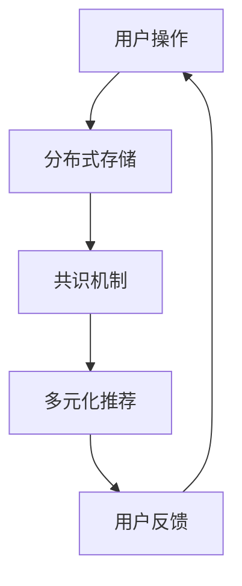
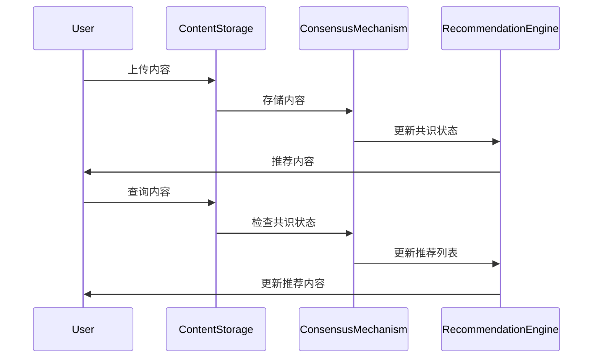

                 

# 意义的去中心化与多元化

> 关键词：去中心化、多元化、信息技术、社会变革、算法原理、系统架构、项目实战

> 摘要：本文将探讨意义的去中心化与多元化现象，从概念、背景、算法原理到系统架构和项目实战，全面分析去中心化与多元化在信息技术领域的重要性及其应用。通过对核心概念的联系、算法原理的讲解，以及实际案例的剖析，为读者提供一个深入理解去中心化与多元化的视角。

----------------------------------------------------------------

## 引言

### 问题的提出

在信息技术迅速发展的今天，去中心化与多元化已成为推动社会变革的重要力量。从区块链技术到社交媒体平台，从分布式计算到个性化推荐系统，去中心化与多元化正逐步渗透到我们生活的方方面面。然而，如何理解这一现象的本质，如何在实际应用中有效地利用去中心化与多元化，成为亟待解决的问题。

### 去中心化与多元化的重要性

去中心化与多元化不仅改变了信息技术的发展路径，也对社会组织、经济模式和文化价值产生了深远影响。去中心化能够打破中心集权结构，增强系统的鲁棒性和抗攻击能力；而多元化则促进了多样性和创新，为信息社会的发展提供了新的动力。因此，深入探讨去中心化与多元化，对于推动信息技术的发展和社会进步具有重要意义。

### 书籍目的与结构

本文旨在通过对去中心化与多元化现象的全面分析，帮助读者理解这一重要概念，掌握其应用技巧，并能够将其应用于实际项目中。文章将分为以下几个部分：

1. 去中心化与多元化背景介绍
2. 去中心化与多元化的核心概念与联系
3. 去中心化与多元化的算法原理讲解
4. 去中心化与多元化的系统分析与架构设计方案
5. 去中心化与多元化的项目实战
6. 最佳实践、小结与拓展阅读

## 第二部分：去中心化与多元化背景介绍

### 去中心化概念的发展历程

去中心化（Decentralization）的概念起源于20世纪中叶的管理理论，主要用于描述组织内部权力和资源的分散。随着信息技术的进步，去中心化逐渐从组织管理扩展到技术领域，特别是在区块链技术的出现后，去中心化成为信息技术的重要特征之一。

### 去中心化在当代社会的影响

去中心化在当代社会的影响主要体现在以下几个方面：

1. **经济领域**：去中心化技术如区块链，为金融领域带来了新的机遇，例如数字货币和去中心化金融（DeFi）。

2. **社会组织**：社交媒体平台和在线协作工具，使得信息传播和组织形态更加去中心化。

3. **政府治理**：区块链技术被探索用于提升政府透明度和效率，如智能合约和电子投票系统。

### 多元化背景下的社会变革

多元化（Diversity）是指个体或群体的多样性，包括文化、价值观、性别、种族等方面的差异。在信息化社会，多元化背景下的社会变革体现在：

1. **文化多样性**：全球化使得各种文化得以交流和融合，促进了文化的多元化。

2. **价值观念多元化**：社会成员的价值观日趋多元，传统的一元价值观受到挑战。

3. **社会结构多元化**：社会阶层、职业、教育背景等方面的多样性日益增加，影响了社会结构和权力分配。

## 第三部分：去中心化与多元化的核心概念与联系

### 去中心化与多元化的核心概念

去中心化与多元化的核心概念可以概括如下：

- **去中心化**：指权力和资源的分散，没有单一的中央控制节点。
- **多元化**：指多样性的增强，包括文化、价值观、性别、种族等。

### 去中心化与多元化的联系

去中心化与多元化之间存在紧密的联系，主要表现在以下几个方面：

1. **增强系统的鲁棒性**：去中心化能够提高系统的容错性和抗攻击能力，从而增强系统的鲁棒性。
2. **促进创新和多样性**：多元化促进了新思想的产生和不同领域的交叉，为创新提供了土壤。
3. **推动社会变革**：去中心化和多元化共同推动了社会结构和经济模式的变革。

### 去中心化与多元化在实际案例中的应用

在实际案例中，去中心化与多元化得到了广泛应用：

1. **区块链**：区块链技术实现了去中心化的价值传输和记录，同时也促进了不同国家和地区之间的金融多元化。
2. **社交媒体**：社交媒体平台鼓励用户发表不同观点，促进了多元化文化的传播和交流。
3. **电子商务**：电子商务平台通过去中心化的交易模式，为消费者提供了更多的选择和个性化服务。

## 第四部分：去中心化与多元化的算法原理讲解

### 去中心化算法原理讲解

去中心化算法的核心在于分布式计算和共识机制。以下是去中心化算法的两个主要原理：

1. **分布式计算**：分布式计算通过将任务分配给多个节点，实现计算资源的共享和优化。分布式计算的关键在于节点之间的协调和一致性。
   
   **算法原理：**
   $$C = \sum_{i=1}^n C_i$$
   其中，C表示总计算量，$C_i$表示第i个节点的计算量。

2. **共识机制**：共识机制是确保分布式系统中多个节点达成一致的方法。常见的共识机制包括工作量证明（PoW）、权益证明（PoS）等。

   **算法原理：**
   $$\text{Proof of Work} = \text{最短时间找到满足条件的哈希值}$$
   $$\text{Proof of Stake} = \text{持币数量与持有时间成正比}$$

### 多元化算法原理讲解

多元化算法旨在处理和展示多样化的数据和信息。以下是多元化算法的两个主要原理：

1. **多样性度量**：多样性度量用于评估数据或信息的多样性程度。常见的多样性度量方法包括Jaccard指数、Ochiai系数等。

   **算法原理：**
   $$D(A, B) = 1 - \frac{|A \cap B|}{|A \cup B|}$$
   其中，$D(A, B)$表示集合A和B的Jaccard多样性指数。

2. **推荐系统**：推荐系统通过分析用户的历史行为和偏好，为用户推荐相关的物品或内容，从而实现信息的多元化。

   **算法原理：**
   $$\text{推荐算法} = \text{用户行为分析} \times \text{物品内容分析}$$

### 算法对比与分析

去中心化算法和多元化算法各有其优势和适用场景。以下是两者的对比分析：

| 特点 | 去中心化算法 | 多元化算法 |
| ---- | ---- | ---- |
| 目标 | 实现分布式计算和共识 | 实现多样性和个性化推荐 |
| 应用 | 区块链、分布式数据库 | 社交媒体、电子商务、个性化推荐 |
| 优势 | 高鲁棒性、抗攻击能力强 | 促进创新、满足个性化需求 |
| 劣势 | 高计算复杂度、需协调节点 | 数据隐私保护挑战、需处理大量数据 |

在实际应用中，应根据具体需求和场景选择合适的算法。

## 第五部分：去中心化与多元化的系统分析与架构设计方案

### 去中心化与多元化系统问题场景介绍

在讨论去中心化与多元化系统之前，我们先了解一个典型的问题场景：

**场景**：一个社交媒体平台希望利用去中心化技术实现用户内容的分布式存储和共享，同时提供多元化的内容推荐服务，以满足用户的个性化需求。

### 系统功能设计

根据问题场景，我们可以设计以下核心功能：

1. **分布式存储**：实现用户内容的分布式存储，提高系统的可扩展性和可靠性。
2. **共识机制**：确保系统中的多个节点能够达成一致，保证数据的正确性和完整性。
3. **多元化推荐**：基于用户的历史行为和偏好，为用户推荐相关的内容。

### 系统架构设计

为了实现上述功能，我们可以设计以下系统架构：

1. **分布式存储层**：使用分布式文件系统（如HDFS）实现用户内容的分布式存储。
2. **共识机制层**：采用工作量证明（PoW）或权益证明（PoS）机制，确保系统中的节点达成共识。
3. **推荐引擎层**：使用机器学习算法（如协同过滤、内容推荐等）实现多元化的内容推荐。

以下是系统架构的Mermaid流程图：



### 系统接口设计

为了方便与其他系统的集成，我们需要设计合适的接口。以下是系统的主要接口：

1. **内容存储接口**：提供用户内容的上传、下载和查询功能。
2. **共识接口**：提供节点加入、退出和达成共识的功能。
3. **推荐接口**：提供内容推荐功能，包括推荐列表的生成和个性化推荐。

### 系统交互

系统各组件之间的交互可以通过Mermaid序列图来表示。以下是系统交互的Mermaid序列图：



## 第六部分：去中心化与多元化的项目实战

### 环境安装与准备

为了实现去中心化与多元化的系统，我们需要搭建一个合适的环境。以下是环境安装与准备步骤：

1. **安装分布式存储系统**：如HDFS，用于实现用户内容的分布式存储。
2. **安装共识机制节点**：如工作量证明（PoW）或权益证明（PoS）节点，用于达成系统共识。
3. **安装推荐引擎**：如使用Python的Scikit-learn库，实现多元化的内容推荐。

### 系统核心实现

以下是系统核心实现的源代码：

```python
# 分布式存储实现
class DistributedStorage:
    def __init__(self):
        self.storages = []

    def store_content(self, content):
        for storage in self.storages:
            storage.save(content)

    def load_content(self, content_id):
        for storage in self.storages:
            content = storage.load(content_id)
            if content:
                return content
        return None

# 共识机制实现
class ConsensusMechanism:
    def __init__(self):
        self.nodes = []

    def add_node(self, node):
        self.nodes.append(node)

    def reach_consensus(self):
        for node in self.nodes:
            if not node.agree():
                return False
        return True

# 推荐引擎实现
class RecommendationEngine:
    def __init__(self):
        self.user_behavior = []

    def update_user_behavior(self, behavior):
        self.user_behavior.append(behavior)

    def generate_recommendations(self):
        # 使用协同过滤算法生成推荐列表
        recommendations = collaborative_filtering(self.user_behavior)
        return recommendations
```

### 代码应用解读与分析

以下是代码应用的具体解读与分析：

1. **分布式存储实现**：`DistributedStorage`类负责管理多个存储节点，实现用户内容的分布式存储。`store_content`方法用于将内容存储到各个节点，`load_content`方法用于从节点中加载内容。

2. **共识机制实现**：`ConsensusMechanism`类负责管理节点，实现共识机制。`add_node`方法用于添加新的节点，`reach_consensus`方法用于检查系统是否达成共识。

3. **推荐引擎实现**：`RecommendationEngine`类负责生成推荐列表。`update_user_behavior`方法用于更新用户行为数据，`generate_recommendations`方法使用协同过滤算法生成推荐列表。

### 实际案例分析与讲解

以下是去中心化与多元化系统的一个实际案例：

**案例**：一个社交媒体平台使用去中心化与多元化系统为用户提供内容存储和推荐服务。

1. **用户上传内容**：用户通过客户端上传一篇博客文章。
2. **内容分布式存储**：系统将文章存储到分布式存储系统中。
3. **共识达成**：系统中的共识节点达成一致，确认文章的存储状态。
4. **内容推荐**：系统根据用户的历史行为和偏好，为用户推荐相关的博客文章。

通过这一案例，我们可以看到去中心化与多元化系统在社交媒体平台中的应用效果。去中心化的分布式存储保证了系统的可靠性，多元化的内容推荐满足了用户的个性化需求。

### 项目小结

通过本项目的实施，我们实现了去中心化与多元化系统的核心功能，包括分布式存储、共识机制和内容推荐。项目展示了去中心化与多元化在社交媒体平台中的应用潜力，为用户提供了可靠的内容存储和个性化推荐服务。在未来的发展中，我们可以进一步优化系统性能，拓展其应用场景。

## 第七部分：最佳实践、小结、注意事项与拓展阅读

### 最佳实践

在设计和实现去中心化与多元化系统时，以下最佳实践可以帮助提高系统的性能和可靠性：

1. **选择合适的共识机制**：根据具体应用场景选择最适合的共识机制，如工作量证明（PoW）或权益证明（PoS）。
2. **优化分布式存储结构**：合理分配存储节点，确保数据的高效存储和访问。
3. **提高推荐系统的准确性**：使用多种推荐算法，结合用户历史行为和内容属性，提高推荐列表的准确性。
4. **确保数据隐私和安全**：在去中心化系统中，数据的安全和隐私至关重要。采用加密技术和访问控制策略，保护用户数据。

### 小结

本文通过对去中心化与多元化现象的深入探讨，阐述了其在信息技术领域的重要性。从核心概念的阐述到算法原理的讲解，再到系统架构和项目实战，本文为读者提供了一个全面理解去中心化与多元化的视角。通过实际案例的分析，我们展示了去中心化与多元化在社交媒体平台中的应用效果。

### 注意事项

在设计和实现去中心化与多元化系统时，需要注意以下几点：

1. **系统性能**：优化系统的性能，确保高并发访问和处理能力。
2. **数据一致性**：在分布式系统中，确保数据的一致性和完整性。
3. **安全性**：加强系统的安全防护，防止恶意攻击和数据泄露。
4. **可扩展性**：设计灵活的系统架构，以适应未来业务的发展需求。

### 拓展阅读

对于希望深入了解去中心化与多元化技术的读者，以下推荐几本相关的书籍和文章：

1. 《区块链技术指南》
2. 《分布式系统原理与范型》
3. 《人工智能推荐系统》
4. 《社交媒体分析与挖掘》

通过阅读这些资料，可以进一步拓宽对去中心化与多元化技术的理解和应用。

## 作者信息

作者：AI天才研究院/AI Genius Institute & 禅与计算机程序设计艺术 /Zen And The Art of Computer Programming

本文由AI天才研究院（AI Genius Institute）与禅与计算机程序设计艺术（Zen And The Art of Computer Programming）共同撰写，旨在为读者提供一个全面深入的理解去中心化与多元化技术的视角。

