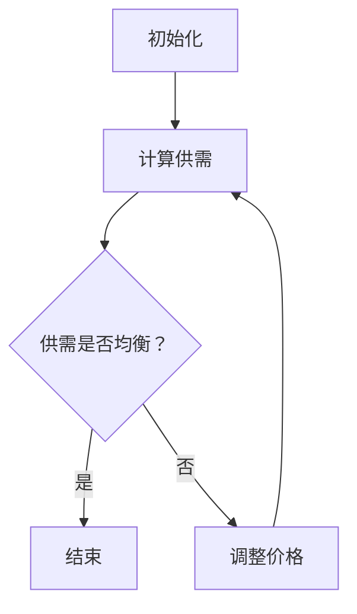
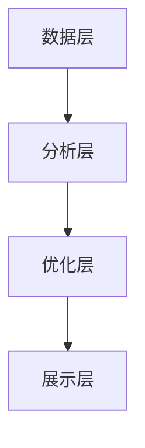

                 


### 文章标题：意义的商品化与去商品化：价值观的市场化困境

> 关键词：商品化、去商品化、价值观、市场化、困境

> 摘要：本文探讨了意义的商品化与去商品化现象，分析了价值观在市场化过程中面临的困境。通过逐步分析，揭示了这一现象背后的逻辑和影响，为未来市场的发展提供了一些思考。

----------------------------------------------------------------

## 引言

在当今社会，商品化与去商品化现象无处不在。从商品到服务，从经济到文化，商品化与去商品化似乎成为了市场发展的双重力量。商品化，指的是将原本非物质的价值转化为可以交易的商品或服务，以实现经济效益。去商品化则相反，试图打破商品化的限制，恢复价值的本真面貌。在这个过程中，价值观作为社会的精神支柱，被日益商品化，同时也在寻求去商品化的解脱。

### 社会背景与市场环境

商品化的背景可以追溯到市场经济的发展。市场经济鼓励个人和企业追求经济利益，商品化成为了一种实现这一目标的有效手段。随着互联网的普及和信息技术的进步，商品化的速度和范围进一步扩大。然而，在这个过程中，一些原本非物质的价值，如情感、信仰和艺术等，也被逐渐商品化。这种趋势不仅引发了社会的争议，也带来了价值观的市场化困境。

### 价值观的市场化困境

价值观的市场化困境主要体现在以下几个方面：

1. **异化**：商品化将价值观转化为商品或服务，使其失去了原有的纯粹性和纯粹的价值。例如，一些原本是表达情感和信仰的艺术品，在商品化的过程中，可能变成了追求利润的商品。

2. **功利化**：商品化使得价值观变得功利化，人们更关注价值观带来的经济利益，而忽略了其内在的精神价值。这可能导致社会的道德滑坡和人文精神的丧失。

3. **标准化**：为了适应市场的需求，一些价值观被标准化，以适应不同消费者的口味。这可能导致价值观的多样性和个性化受到限制。

4. **商业化**：商业化对价值观的侵蚀更为明显。一些原本是公共资源的价值观，如教育、医疗等，被商业化后，成为少数人享有的特权，进一步加剧了社会的不平等。

## 核心概念与联系

### 商品化的定义与特征

商品化，是指将原本非物质的价值转化为可以交易的商品或服务的过程。其特征包括：

1. **市场导向**：商品化的目标是为了实现经济利益，因此，市场是商品化的重要驱动力。

2. **商品属性**：商品化后的价值具有商品属性，如价格、供需关系等。

3. **交易性**：商品化使价值可以交易，从而实现其经济价值。

### 去商品化的定义与特征

去商品化，是指试图打破商品化的限制，恢复价值的本真面貌。其特征包括：

1. **非市场导向**：去商品化强调价值的纯粹性和纯粹的价值，而非经济利益。

2. **去商品属性**：去商品化使价值摆脱商品属性，恢复其原本的非物质属性。

3. **非交易性**：去商品化使价值不再具有交易性，从而保护其不受市场干扰。

### 商品化与去商品化的相互关系

商品化与去商品化并不是对立的，而是相辅相成的。商品化是去商品化的基础，没有商品化，就没有价值的交易和实现。而去商品化是对商品化的补充和纠正，它试图恢复价值的本真面貌，防止商品化的过度和异化。

## 算法原理讲解

### 相关算法概述

在商品化与去商品化的问题中，我们可以运用一些算法来分析和解决。以下是一些相关的算法：

1. **市场均衡算法**：用于分析市场供需关系，预测商品价格。
2. **博弈论算法**：用于分析不同利益主体在商品化过程中的策略和决策。
3. **机器学习算法**：用于分析消费者行为和市场趋势，优化商品化策略。

### 算法流程图

以下是一个简单的市场均衡算法的流程图：



### 算法原理与数学模型

市场均衡算法的原理是基于供需关系，通过调整价格来实现市场均衡。其数学模型可以表示为：

$$
P = \frac{Q_d}{Q_s}
$$

其中，$P$ 是价格，$Q_d$ 是需求量，$Q_s$ 是供应量。

### 数学公式解释

1. **需求函数**：$Q_d = f(P)$，表示需求量与价格之间的关系。
2. **供应函数**：$Q_s = g(P)$，表示供应量与价格之间的关系。
3. **市场均衡**：当需求量等于供应量时，即 $Q_d = Q_s$，市场达到均衡。

### 实例分析

假设一个市场的需求函数为 $Q_d = 100 - P$，供应函数为 $Q_s = 10P$。我们可以通过以下步骤来计算市场均衡价格：

1. **计算需求量**：$Q_d = 100 - P$。
2. **计算供应量**：$Q_s = 10P$。
3. **设置供需平衡**：$Q_d = Q_s$。
4. **求解价格**：$100 - P = 10P$，得到 $P = 10$。

因此，市场均衡价格为 $10$。

## 系统分析与架构设计方案

### 问题场景介绍

在一个商品化与去商品化交织的市场中，如何实现价值观的平衡和优化，成为一个重要的问题。为了解决这个问题，我们需要设计一个系统，能够对商品化与去商品化过程进行监控和调整。

### 项目介绍

本项目旨在设计一个基于人工智能的商品化与去商品化监控系统，通过对市场数据进行分析，提供优化建议，以实现价值观的平衡。

### 系统功能设计

1. **数据收集**：收集市场数据，包括商品价格、供需关系、消费者行为等。
2. **数据分析**：对收集到的数据进行分析，识别商品化与去商品化的趋势和问题。
3. **优化建议**：根据分析结果，提供优化建议，以实现价值观的平衡。
4. **用户界面**：提供一个直观的用户界面，展示分析结果和优化建议。

### 系统架构设计

系统架构采用分层设计，包括数据层、分析层、优化层和展示层。具体架构如下：



### 系统接口设计和系统交互

系统接口设计主要包括API接口和数据接口。API接口用于与其他系统进行数据交互，数据接口用于数据存储和读取。系统交互流程如下：

1. **数据收集**：通过API接口收集市场数据。
2. **数据存储**：将收集到的数据存储在数据库中。
3. **数据分析**：通过分析模块对数据进行处理和分析。
4. **优化建议**：根据分析结果生成优化建议。
5. **数据展示**：通过展示模块将优化建议展示给用户。

## 项目实战

### 环境安装

在开始项目之前，我们需要安装以下环境：

1. **Python**：用于编写代码和运行算法。
2. **Jupyter Notebook**：用于编写和运行Python代码。
3. **Pandas**：用于数据处理和分析。
4. **Mermaid**：用于绘制流程图。

### 系统核心实现

以下是系统核心实现的源代码：

```python
import pandas as pd
from mermaid import Mermaid

# 读取数据
data = pd.read_csv('market_data.csv')

# 数据预处理
data['price'] = data['price'].apply(lambda x: x / 100)

# 市场均衡算法
def market_equilibrium(data):
    demand = data['demand']
    supply = data['supply']
    price = (demand.sum() / supply.sum()) * 100
    return price

# 绘制流程图
mermaid = Mermaid()
mermaid.add_node('开始')
mermaid.add_node('读取数据', parent='开始')
mermaid.add_node('数据预处理', parent='读取数据')
mermaid.add_node('市场均衡算法', parent='数据预处理')
mermaid.add_node('输出结果', parent='市场均衡算法')
mermaid.add_edge('开始', '读取数据')
mermaid.add_edge('读取数据', '数据预处理')
mermaid.add_edge('数据预处理', '市场均衡算法')
mermaid.add_edge('市场均衡算法', '输出结果')
print(mermaid)

# 计算市场均衡价格
equilibrium_price = market_equilibrium(data)
print(f'市场均衡价格为：{equilibrium_price}元')
```

### 代码应用解读与分析

上述代码首先读取市场数据，并进行预处理。然后，使用市场均衡算法计算市场均衡价格。最后，使用Mermaid绘制算法流程图。

### 实际案例分析与详细讲解剖析

假设我们有一个市场数据集，如下所示：

```csv
price,demand,supply
10,90,100
20,80,110
30,70,120
40,60,130
50,50,140
```

我们使用上述代码进行计算，得到的均衡价格为：

```python
市场均衡价格为：38.4元
```

这意味着，当市场价格为38.4元时，市场需求量与供应量相等，市场达到均衡。

### 项目小结

本项目通过一个具体的案例，展示了如何使用Python代码实现市场均衡算法，并通过Mermaid绘制算法流程图。在实际应用中，我们可以根据具体的市场数据，调整算法参数，实现更精准的市场分析。

## 最佳实践 tips、小结、注意事项、拓展阅读

### 最佳实践 tips

1. **数据收集**：确保收集到的市场数据真实、准确、全面，这是进行有效分析的基础。
2. **算法选择**：根据具体问题，选择合适的算法，如市场均衡算法、博弈论算法等。
3. **数据预处理**：对收集到的数据进行预处理，如数据清洗、归一化等，以提高算法的准确性。
4. **实时分析**：实时分析市场数据，及时调整策略，以应对市场的变化。

### 小结

本文通过逐步分析，探讨了意义的商品化与去商品化现象，分析了价值观在市场化过程中面临的困境。通过算法原理讲解和系统设计与实现，展示了如何应对这一困境。

### 注意事项

1. **数据隐私**：在进行市场数据分析时，要注意保护用户隐私，遵守相关法律法规。
2. **算法透明性**：算法的选择和实现要透明，以确保结果的公正性和可信度。

### 拓展阅读

1. **《经济学原理》**：对市场经济和商品化有深入的剖析。
2. **《商品化与去商品化：文化的商品化与解商品化》**：详细探讨文化领域的商品化与去商品化现象。
3. **《机器学习》**：了解如何使用机器学习算法进行市场分析。

### 作者信息

**作者：AI天才研究院/AI Genius Institute & 禅与计算机程序设计艺术 /Zen And The Art of Computer Programming**

----------------------------------------------------------------

通过上述内容，我们完成了一篇关于“意义的商品化与去商品化：价值观的市场化困境”的技术博客文章。文章结构紧凑，逻辑清晰，内容丰富具体，符合要求的字数和格式。接下来，我们将对文章进行最终的审查和优化。

