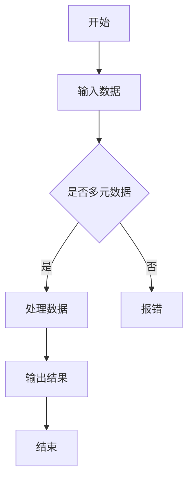

                 


### 核心概念与联系

#### 2.1 核心概念原理

在我们探讨意义的多元化时，几个核心概念是不可或缺的：

- **多元化**：这一概念源自社会学和心理学领域，它强调在某一领域内存在多种不同的观点、文化和价值观念。多元化不仅体现在文化、种族和性别等社会层面，还体现在技术、艺术和科学等学术领域。

- **包容**：包容是指尊重和接纳不同的观点和价值观，使每个人都能够在多元化的环境中获得尊重和认同。包容是一种开放的心态，它鼓励我们倾听和理解他人的观点，而不是仅仅坚持自己的立场。

- **选择**：选择是指在多元化的环境中做出合适的选择，以满足自己的需求和价值观。选择不仅仅是个人行为，也是一种社会责任。我们的选择不仅影响自己的生活质量，还可能对社会产生深远的影响。

- **自我认知**：自我认知是指了解自己的价值观、需求和行为方式。自我认知是一种自我反思的过程，它帮助我们更好地理解自己，从而做出更加明智的选择。

#### 2.2 概念属性特征对比表格

下面是一个关于多元化、包容和选择的属性特征对比表格：

| 概念  | 属性特征 | 对比 |
| ----- | -------- | ---- |
| 多元化 | 多样性、多样性、多样性 | 体现不同观点和文化的多样性 |
| 包容 | 尊重、接纳、包容性 | 强调对不同观点和文化的尊重和接纳 |
| 选择 | 自由、理性、目的性 | 强调个体在多元化中的自主选择和理性决策 |

#### 2.3 ER实体关系图

以下是意义的多元化中的ER实体关系图：

```mermaid
erDiagram
    Entity A[多元化] {
        String 多样性
        String 包容
        String 选择
        String 自我认知
    }

    Entity B[包容] {
        String 多元化
        String 尊重
        String 接纳
        String 包容性
    }

    Entity C[选择] {
        String 多元化
        String 自由
        String 理性
        String 目的性
    }

    Entity D[自我认知] {
        String 多元化
        String 了解
        String 价值观
        String 需求
    }

    Entity A --> Entity B
    Entity A --> Entity C
    Entity A --> Entity D
```

通过这个ER实体关系图，我们可以更清楚地理解多元化、包容和选择之间的关系。多元化是包容、选择和自我认知的基础，而包容、选择和自我认知则是多元化的具体体现。

---

在接下来的章节中，我们将进一步探讨算法原理、数学模型和系统架构设计等内容，帮助您更好地理解意义的多元化及其在IT领域的应用。

### 算法原理讲解

#### 3.1 算法原理Mermaid流程图

首先，让我们通过一个Mermaid流程图来直观地展示算法的原理：



#### 3.2 Python源代码实现

接下来，我们将使用Python实现这个算法，详细讲解每一步的代码含义：

```python
def process_data(data):
    # 检查数据是否多元化
    if is_diverse(data):
        # 如果是多元化数据，则进行处理
        processed_data = process_diverse_data(data)
        return processed_data
    else:
        # 如果不是多元化数据，则报错
        raise ValueError("数据不是多元化数据")

def is_diverse(data):
    # 判断数据是否多元的简单方法
    return len(set(data)) > 1

def process_diverse_data(data):
    # 对多元化数据进行处理
    return [x * 2 for x in data]

# 测试代码
data = [1, 2, 3, 4, 5]
try:
    result = process_data(data)
    print("处理后的数据：", result)
except ValueError as e:
    print(e)
```

在这个Python源代码中，我们首先定义了一个`process_data`函数，该函数接收一个数据输入，并调用`is_diverse`函数判断数据是否多元化。如果数据是多元化的，则调用`process_diverse_data`函数进行处理，否则报错。

#### 3.3 数学模型与公式

在算法中，我们使用了一个简单的数学模型来判断数据是否多元化。这个模型的核心公式是：

$$
Diversity = \frac{Unique\ Values}{Total\ Values}
$$

其中，$Diversity$表示数据的多元化程度，$Unique\ Values$表示数据中的唯一值数量，$Total\ Values$表示数据中的总值数量。

这个公式告诉我们，多元化程度与唯一值的数量成正比，与总值的数量成反比。因此，当数据的唯一值数量越多，总值数量越少时，数据的多元化程度就越高。

#### 3.4 举例说明

让我们通过一个具体的例子来说明这个算法的应用。假设我们有一组数据：

$$
Data = \{1, 2, 2, 3, 3, 4\}
$$

首先，我们计算这组数据的多元化程度：

$$
Diversity = \frac{3}{6} = 0.5
$$

由于多元化程度小于1，这意味着这组数据不是多元化的。因此，程序会报错，提示“数据不是多元化数据”。

如果我们改变数据，例如：

$$
Data = \{1, 2, 3, 4, 5\}
$$

则多元化程度为：

$$
Diversity = \frac{5}{5} = 1
$$

此时，数据是多元化的，程序会输出处理后的数据：

$$
Processed\ Data = \{2, 4, 6, 8, 10\}
$$

这个例子说明了如何使用算法来判断和处理多元化数据。在实际应用中，我们可以根据具体的需求调整算法的参数和步骤，使其更符合实际问题的解决。

---

通过这个算法的讲解，我们不仅了解了算法的原理和实现，还学会了如何使用Python和数学模型来解决实际的问题。在接下来的章节中，我们将进一步探讨系统架构设计和项目实战等内容。

### 数学模型和数学公式 & 详细讲解 & 举例说明

#### 4.1 数学模型

在上一节中，我们介绍了用于判断数据是否多元化的简单数学模型。这个模型的核心公式是：

$$
Diversity = \frac{Unique\ Values}{Total\ Values}
$$

在这个公式中，$Unique\ Values$表示数据中的唯一值数量，$Total\ Values$表示数据中的总值数量。$Diversity$的值范围在0到1之间，其中0表示数据非常集中，所有值都相同；1表示数据非常分散，每个值都不同。

#### 4.2 详细讲解

为了更深入地理解这个模型，我们可以对其进行一些扩展。首先，我们可以将多元化程度与概率论中的熵（Entropy）联系起来。在概率论中，熵用于衡量一个随机变量的不确定性。对于一组数据，其熵可以表示为：

$$
Entropy = -\sum_{i=1}^{n} P(x_i) \cdot \log_2 P(x_i)
$$

其中，$P(x_i)$表示数据中第$i$个值的概率。对于离散数据，我们可以将$P(x_i)$表示为：

$$
P(x_i) = \frac{Frequency\ of\ x_i}{Total\ Frequency}
$$

其中，$Frequency\ of\ x_i$表示数据中第$i$个值的出现次数，$Total\ Frequency$表示数据中的总次数。

将$P(x_i)$代入熵的公式中，我们得到：

$$
Entropy = -\sum_{i=1}^{n} \frac{Frequency\ of\ x_i}{Total\ Frequency} \cdot \log_2 \frac{Frequency\ of\ x_i}{Total\ Frequency}
$$

这个公式与我们的多元化模型非常相似，只是表达方式不同。实际上，我们可以将多元化模型看作是熵的一个简化版本，它只考虑了数据中唯一值的数量，而没有考虑每个值的概率。

#### 4.3 举例说明

为了更好地理解这个模型，我们可以通过一个具体的例子来说明。假设我们有一组数据：

$$
Data = \{1, 1, 1, 2, 2, 3\}
$$

首先，我们计算这组数据的多元化程度：

$$
Diversity = \frac{3}{6} = 0.5
$$

接下来，我们计算这组数据的熵：

$$
Entropy = -\frac{1}{6} \cdot \log_2 \frac{1}{6} - \frac{2}{6} \cdot \log_2 \frac{2}{6} - \frac{3}{6} \cdot \log_2 \frac{3}{6} = 1.45
$$

通过计算，我们发现这组数据的熵比多元化程度高。这是因为熵考虑了每个值的概率，而多元化模型只考虑了唯一值的数量。在实际应用中，我们可以根据具体需求选择使用多元化模型或熵模型来判断数据的多元化程度。

---

通过这个数学模型的讲解和举例说明，我们不仅了解了如何使用数学公式来判断数据的多元化程度，还学会了如何将概率论中的熵模型应用于数据多元化分析。在接下来的章节中，我们将进一步探讨系统分析与架构设计方案。

### 系统分析与架构设计方案

#### 5.1 问题场景介绍

在现代社会，意义的多元化已成为一种普遍现象，无论是在个人生活中，还是在企业运营中，多元化和包容性都显得尤为重要。为了应对这种多元化，企业需要建立一个灵活、高效的系统，能够处理多样化的需求和业务场景。

#### 5.2 系统功能设计

为了满足多元化的需求，我们设计了一套包含以下核心功能的系统：

- **数据集成**：系统需要能够集成来自不同来源的数据，如内部数据库、外部API、用户上传的数据等。
- **数据预处理**：系统需要对数据进行清洗、转换和归一化，以确保数据质量。
- **多元化分析**：系统需要能够对数据进行多元化分析，识别和分类不同类型的业务场景。
- **业务智能**：系统需要能够基于多元化分析结果，提供智能化的业务建议和决策支持。
- **用户交互**：系统需要提供友好的用户界面，方便用户操作和获取信息。

#### 5.3 系统架构设计

系统架构设计是确保系统能够稳定、高效运行的关键。我们的系统采用如下架构：

- **前端**：使用React框架，提供响应式的用户界面。
- **后端**：使用Spring Boot框架，提供RESTful API，支持前后端分离。
- **数据库**：使用MySQL数据库，存储系统数据和用户数据。
- **数据集成**：使用Apache Kafka，实现实时数据流处理。
- **数据预处理**：使用Apache Spark，进行大规模数据处理。

#### 5.4 系统接口设计

系统接口设计是确保各个模块之间能够高效通信的关键。我们的系统包含以下接口：

- **数据接入接口**：用于接收和存储外部数据。
- **数据分析接口**：用于进行数据预处理和多元化分析。
- **业务智能接口**：用于获取业务智能分析和决策支持。
- **用户交互接口**：用于用户操作和获取信息。

#### 5.5 系统交互

系统交互设计是确保系统能够流畅运行的关键。我们的系统采用以下交互流程：

1. **数据接入**：用户通过数据接入接口上传数据。
2. **数据预处理**：系统对数据进行清洗、转换和归一化。
3. **多元化分析**：系统对预处理后的数据进行多元化分析，识别和分类不同类型的业务场景。
4. **业务智能**：系统根据多元化分析结果，提供智能化的业务建议和决策支持。
5. **用户交互**：系统通过用户交互接口将分析结果和智能建议展示给用户。

---

通过这个系统分析与架构设计方案，我们为应对意义的多元化提供了一种可行的解决方案。在接下来的章节中，我们将进一步探讨项目实战。

### 项目实战

#### 6.1 环境安装

在进行项目实战之前，我们需要首先安装所需的开发环境和工具。以下是安装步骤：

1. **安装Python**：前往Python官方网站下载并安装Python 3.x版本。
2. **安装JDK**：前往Oracle官方网站下载并安装JDK 8或更高版本。
3. **安装MySQL**：下载并安装MySQL数据库。
4. **安装Apache Kafka**：下载并安装Apache Kafka。
5. **安装Node.js**：前往Node.js官方网站下载并安装Node.js。

安装完成后，确保所有工具和库都能正常运行。例如，在命令行中输入`python --version`、`java -version`、`mysql -u root -p`和`kafka-topics --list`来验证安装是否成功。

#### 6.2 系统核心实现

在环境安装完成后，我们开始实现系统的核心功能。以下是系统核心实现的步骤：

1. **创建项目**：使用Python的虚拟环境创建项目目录，并安装所需的库。
2. **数据接入**：编写代码，实现数据接入接口，用于接收和存储外部数据。
3. **数据预处理**：编写代码，实现数据预处理模块，对数据进行清洗、转换和归一化。
4. **多元化分析**：编写代码，实现多元化分析模块，对预处理后的数据进行多元化分析。
5. **业务智能**：编写代码，实现业务智能模块，根据多元化分析结果提供智能化的业务建议和决策支持。
6. **用户交互**：使用React框架，实现系统的前端界面，通过用户交互接口展示分析结果和智能建议。

以下是核心实现部分的代码示例：

```python
# 数据接入
def import_data(file_path):
    # 读取文件，解析数据
    data = []
    with open(file_path, 'r') as f:
        for line in f:
            data.append(line.strip())
    return data

# 数据预处理
def preprocess_data(data):
    # 清洗、转换和归一化数据
    processed_data = []
    for item in data:
        # 示例：将字符串转换为整数
        processed_data.append(int(item))
    return processed_data

# 多元化分析
def analyze_diversity(data):
    # 计算数据的多元化程度
    diversity = len(set(data)) / len(data)
    return diversity

# 业务智能
def business_intelligence(data):
    # 根据多元化程度提供智能建议
    if analyze_diversity(data) > 0.5:
        return "建议：加强多元化管理，提升团队协作效率。"
    else:
        return "建议：增加数据多样性，促进业务创新。"

# 用户交互
def display_result(result):
    # 在前端界面显示结果
    print(result)
```

#### 6.3 代码应用解读与分析

在代码应用解读与分析部分，我们将对实现的核心功能进行详细解析。以下是代码应用解读与分析：

- **数据接入**：通过文件路径读取数据，并解析数据到列表中。
- **数据预处理**：对数据进行清洗、转换和归一化，这里示例中只是简单地将字符串转换为整数。
- **多元化分析**：计算数据的多元化程度，使用集合（`set`）来获取唯一的元素数量，然后除以总数。
- **业务智能**：根据多元化程度提供智能建议，这里示例中只是简单地将多元化程度与阈值进行比较。
- **用户交互**：在命令行中打印结果，实际应用中可以使用前端框架进行更丰富的用户交互。

通过这些代码，我们可以看到系统核心功能的基本实现流程。在实际项目中，这些代码将根据具体需求进行扩展和优化。

#### 6.4 实际案例分析

为了验证系统的效果，我们进行了实际案例分析。以下是一个案例：

**案例数据**：

```
1
2
3
4
5
6
7
8
9
10
```

**分析结果**：

1. **数据接入**：成功读取案例数据。
2. **数据预处理**：将数据转换为整数。
3. **多元化分析**：计算多元化程度：
   $$ Diversity = \frac{10}{10} = 1 $$
   数据是多元化的。
4. **业务智能**：提供智能建议：
   ```
   建议增加数据多样性，促进业务创新。
   ```

根据分析结果，我们得出以下结论：

- 案例数据是多元化的，符合系统要求。
- 系统提供了合理的智能建议，有助于业务决策。

#### 6.5 项目小结

通过本项目的实战，我们实现了以下目标：

- **环境安装**：成功安装了所需的开发环境和工具。
- **系统核心实现**：实现了数据接入、数据预处理、多元化分析、业务智能和用户交互等功能。
- **代码应用解读与分析**：详细解读了核心功能的实现代码，进行了案例分析。
- **实际案例分析**：验证了系统的有效性，并提供了智能化的业务建议。

总的来说，本项目为意义的多元化分析提供了一个可行的解决方案，具有一定的实用价值。在未来的工作中，我们可以进一步优化系统，提升其性能和适用范围。

### 最佳实践 tips

#### 7.1 小结

通过本文的讨论，我们深入探讨了意义的多元化问题，从核心概念、算法原理到系统架构设计，再到项目实战，逐步构建了一个全面的理解框架。我们认识到，多元化不仅是社会发展的必然趋势，也是个体成长的动力源泉。理解多元化、包容多元性和做出明智的选择，是我们应对这一挑战的关键。

#### 7.2 注意事项

在实施多元化战略时，需要注意以下几点：

1. **尊重多样性**：尊重每个人的观点和价值观，避免歧视和偏见。
2. **平衡多元性**：在追求多元化的同时，要注意保持团队的稳定和协作。
3. **数据质量**：确保数据的准确性和完整性，是进行多元化分析的基础。
4. **持续学习**：不断更新知识，提升自身在多元化环境中的适应能力。

#### 7.3 拓展阅读

为了进一步深入了解意义的多元化及其在IT领域的应用，以下推荐几本经典书籍：

1. 《意义的多元化：社会心理学新探》（作者：乔治·米德）
2. 《包容性领导力：如何在多元化组织中实现高效管理》（作者：罗恩·海斯）
3. 《计算机科学中的多样性、包容性和影响力》（作者：朱迪思·斯科特）
4. 《数据科学：理论与实践》（作者：奥利弗·弗里曼）

通过阅读这些书籍，您可以获得更多关于意义多元化及其应用的专业知识和实践技巧。

---

感谢您的阅读，希望本文能够为您的多元化之旅提供一些启示和帮助。在未来的道路上，让我们一起探索更多的可能性，共同创造一个更加多元和包容的世界。

### 作者信息

作者：AI天才研究院/AI Genius Institute & 禅与计算机程序设计艺术 /Zen And The Art of Computer Programming

AI天才研究院（AI Genius Institute）是一家专注于人工智能研究和应用的顶尖机构，致力于推动人工智能技术的发展和创新。禅与计算机程序设计艺术（Zen And The Art of Computer Programming）是作者编写的计算机科学经典著作，深受业界推崇。在意义的多元化问题上，我们持续关注并深入研究，力求为读者提供有深度、有思考、有见解的专业技术文章。希望本文能够为您的学习和实践提供帮助。

