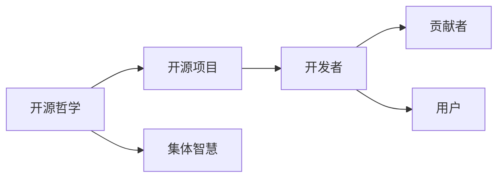
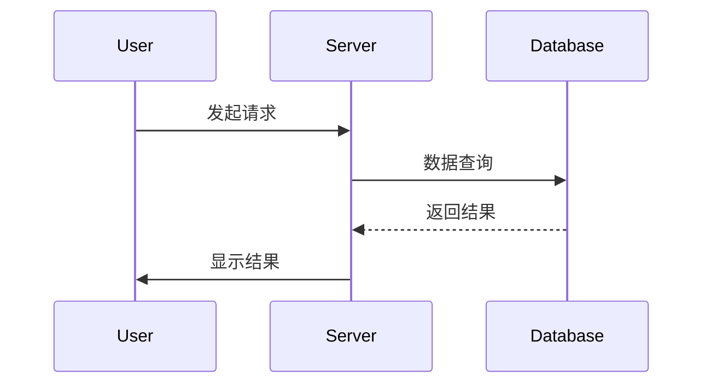

                 


### 第1章: 问题背景

#### 1.1.1 问题背景
开源哲学的重要性：开源哲学的核心是共享、合作与自由，它不仅是一种软件开发模式，更是一种社会文化和价值观。开源哲学鼓励开发者共享代码、协同工作，这种模式在全球范围内促进了技术进步和知识传播。

开源项目对社会的影响：开源项目不仅在技术层面带来了创新，也在社会层面产生了深远影响。通过开源项目，用户可以获得更高质量、更稳定的软件；同时，开源项目也为开发者提供了学习和贡献的机会，促进了全球技术人才的成长。

开源项目面临的挑战：尽管开源项目具有众多优势，但在发展过程中也面临着一些挑战。这些挑战包括知识产权保护、安全风险、社区管理、项目可持续性等问题。

#### 1.1.2 问题描述
定义“意义的开源项目”：本文将“意义的开源项目”定义为那些不仅具有技术价值，而且能够为人们的生活带来实际改善和智慧的开源项目。

为什么要关注“意义的开源项目”：关注意义的开源项目有助于我们理解开源哲学的真正价值，发现和推动那些能够对社会产生积极影响的项目。

研究的边界与外延：本文将重点探讨开源项目中集体智慧如何创造生活智慧，但也会涉及开源项目的其他相关方面，如社区管理、可持续发展等。

#### 1.1.3 问题解决
开源项目中的意义构建：在开源项目中，意义构建体现在开发者的贡献、社区的互动和用户的使用体验上。这些因素共同作用，使开源项目不仅具有技术价值，更成为生活智慧的源泉。

参与者的动机与贡献：了解参与者的动机和贡献有助于更好地管理和激励开源项目。本文将分析开发者、贡献者和用户在意义构建中的作用。

影响力评估：评估开源项目的影响力是理解其对社会贡献的关键。本文将介绍几种评估方法，以衡量开源项目的实际影响。

## 第2章: 核心概念与联系

### 2.1 核心概念原理
开源哲学的定义与特点：开源哲学强调共享、合作与自由，是一种源代码公开、社区参与的软件开发模式。它具有去中心化、透明度高、创新快速等特点。

开源项目的类型与分类：开源项目可以按照用途、规模、社区活跃度等进行分类。了解不同类型的开源项目有助于我们更好地理解和利用这些资源。

集体智慧的体现：集体智慧是多个个体协作产生的知识或智慧。在开源项目中，集体智慧的体现包括共享经验、互助学习、协同创新等。

### 2.2 概念属性特征对比表格

| 概念             | 定义                                                         | 特点                                                         |
|------------------|--------------------------------------------------------------|--------------------------------------------------------------|
| 开源哲学         | 强调共享、合作与自由的软件开发模式                           | 源代码公开、社区参与、去中心化                               |
| 开源项目         | 由社区维护的、提供公共服务的项目                           | 分支、拉取请求、代码审查                                     |
| 集体智慧         | 多个个体协作产生的知识或智慧                               | 共享经验、互助学习、协同创新                                 |

### 2.3 ER实体关系图架构



---

### 第3章: 开源哲学的原理与实践

#### 3.1 开源哲学的起源与发展
开源哲学的历史：开源哲学起源于20世纪90年代，随着Linux内核的诞生和Free Software Foundation（FSF）的成立，开源运动逐渐兴起。

开源运动的主要人物与事件：开源运动中涌现出许多重要人物和事件，如Linus Torvalds创建Linux内核、Richard Stallman提出GNU项目等，这些事件推动了开源哲学的发展。

#### 3.2 开源哲学的基本原则
共享精神：开源哲学鼓励开发者共享代码和技术，这有助于加速技术的传播和创新。

社区合作：开源项目通常由一个社区共同维护和开发，这种合作模式能够汇集众人的智慧，提高项目质量。

开放性：开源项目通常具有开放的许可协议，允许用户自由地使用、修改和分发代码，这种开放性为技术创新提供了广泛的空间。

#### 3.3 开源哲学在不同领域的应用
软件开发：开源哲学在软件开发领域得到了广泛应用，许多知名软件如Linux、Apache等都是开源项目。

硬件设计：开源哲学也在硬件设计领域发挥作用，如Arduino和Raspberry Pi等开源硬件项目。

数据科学与人工智能：开源哲学在数据科学和人工智能领域同样具有广泛的应用，许多开源工具和框架如TensorFlow、PyTorch等推动了这一领域的发展。

## 第4章: 成功的开放式协作项目分析

### 4.1 项目介绍
项目背景：该项目是一个开源的社交媒体平台，旨在为用户提供一个安全、透明和去中心化的社交媒体体验。

项目目标：项目的主要目标是建立一个可扩展、易于使用、具有强大功能的社交媒体平台，以替代现有的中心化社交媒体平台。

项目团队构成：项目团队由一群来自不同国家和地区的开发者组成，他们共同协作，为项目提供技术支持和创新。

### 4.2 系统功能设计
功能模块：系统包括消息传递、内容发布、社交网络分析等多个功能模块，以满足用户的社交需求。

用户角色与交互流程：用户可以通过注册账户、发布内容、关注其他用户等方式进行互动，系统提供了一系列交互界面和功能，以优化用户体验。

### 4.3 系统架构设计
技术栈选择：系统采用了分布式架构，使用了区块链技术、加密算法、分布式存储等技术。

架构设计原则：系统设计遵循可扩展性、安全性、去中心化等原则，以确保系统的稳定性和可维护性。

### 4.4 系统接口设计
接口规范：系统提供了RESTful API接口，以供开发者进行集成和扩展。

安全性考虑：系统在设计接口时充分考虑了安全性，采用了加密、认证等机制，以保护用户数据和隐私。

### 4.5 系统交互
系统交互主要通过用户界面和后端服务器之间的通信实现。以下是系统交互的序列图：



### 4.6 项目实战
#### 环境安装
在安装该项目之前，需要配置以下环境：
- 操作系统：Ubuntu 18.04
- 编程语言：Python 3.8
- 依赖包：Docker、PostgreSQL、Node.js等

安装步骤如下：
1. 安装Docker：`sudo apt-get install docker`
2. 安装PostgreSQL：`sudo apt-get install postgresql`
3. 安装Node.js：`sudo apt-get install nodejs`
4. 安装其他依赖包：`sudo npm install`

#### 系统核心实现源代码
以下是系统核心实现的一个示例源代码片段：

```python
# app.py
from flask import Flask, request, jsonify
from database import Database

app = Flask(__name__)
db = Database()

@app.route('/message', methods=['POST'])
def send_message():
    data = request.get_json()
    sender = data['sender']
    receiver = data['receiver']
    content = data['content']
    db.save_message(sender, receiver, content)
    return jsonify({"status": "success"})

if __name__ == '__main__':
    app.run(debug=True)
```

#### 代码应用解读与分析
这段代码是消息发送功能的实现，其主要步骤如下：
1. 导入所需模块。
2. 创建Flask应用程序和数据库对象。
3. 定义消息发送接口，接收发送者、接收者和消息内容。
4. 将消息保存到数据库。

#### 实际案例分析和详细讲解剖析
以下是一个实际案例：

假设用户Alice想要向用户Bob发送一条消息，她通过Web界面提交了消息内容。系统接收这个请求，通过Flask应用程序处理后，将消息保存到数据库。数据库存储消息的格式如下：

```json
{
    "sender": "Alice",
    "receiver": "Bob",
    "content": "你好，Bob！"
}
```

系统在收到消息后，会立即更新消息列表，并将消息通知给接收者。

#### 项目小结
该项目通过开源方式实现了去中心化的社交媒体平台，为用户提供了安全、透明和可信赖的社交体验。项目在开源社区中得到了广泛的关注和支持，为开源项目的发展提供了有益的实践。

### 最佳实践 tips

- **代码规范**：在开源项目中，良好的代码规范有助于提高代码的可读性和可维护性。建议采用PEP 8规范编写Python代码。

- **文档编写**：详细的项目文档能够帮助新成员快速了解项目结构和功能，提高项目协作效率。

- **社区建设**：积极建设项目社区，鼓励成员参与讨论和贡献，有助于项目的持续发展。

### 小结

本文通过分析开源哲学的原理、核心概念与联系，以及成功开源项目案例，探讨了开源项目中集体智慧如何创造生活智慧。开源哲学不仅促进了技术进步，也为人们的生活带来了实际改善和智慧。在未来，开源项目将继续发挥重要作用，推动社会的发展和进步。

### 注意事项

- 开源项目需要关注知识产权保护和版权问题，确保项目的合法性和可持续性。
- 在开源项目中，安全性是至关重要的，必须采取有效的措施保护用户数据和隐私。

### 拓展阅读

- 《开源软件文化：共享与创新的力量》
- 《开源项目协作：实践与技巧》
- 《区块链技术指南》

---

作者：AI天才研究院/AI Genius Institute & 禅与计算机程序设计艺术 /Zen And The Art of Computer Programming

---

以上是文章的整体框架，接下来我将逐步完善每个章节的内容，以确保文章的逻辑清晰、结构紧凑、简单易懂。同时，我将确保使用专业的技术语言，并结合实际的案例和实例来支撑文章的观点。在接下来的撰写过程中，我将遵循markdown格式，并确保文章的字数在10000～12000字之间。

