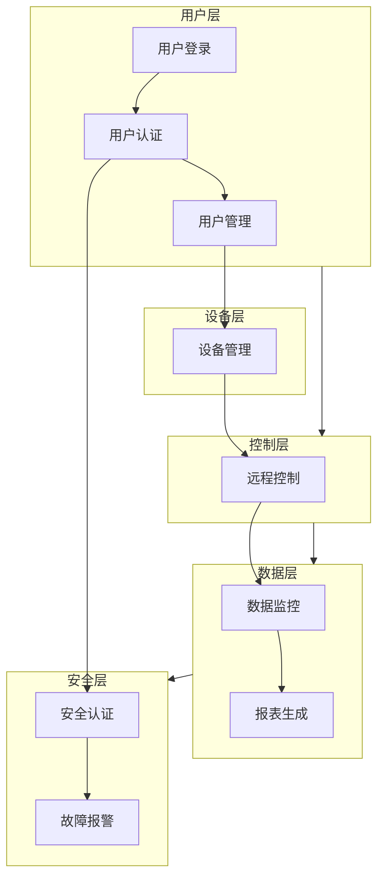
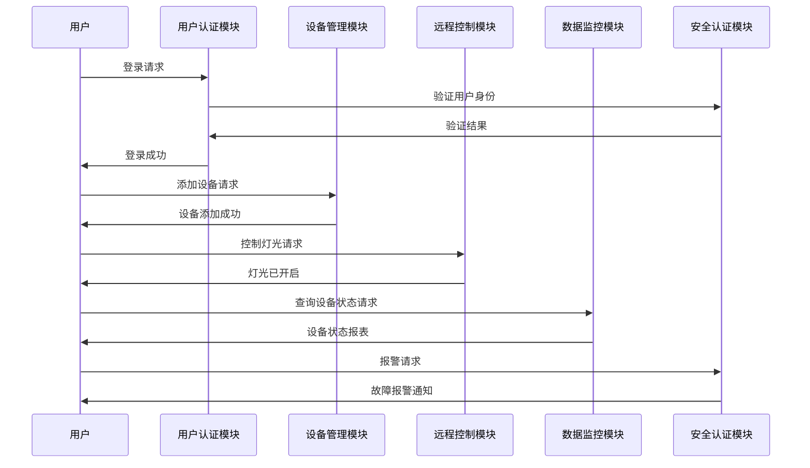

                 


### 第1章 引言

在技术的快速发展与日新月异的时代，我们不仅面临着海量的信息，还面临着复杂的问题与挑战。在这样的背景下，“意义的探索：在问题中寻找答案的过程”这本书应运而生，旨在引导读者深入探索问题的本质，通过科学的方法和逻辑的推理来寻找答案。

#### 1.1 书籍主题与目的

本书的主题是“意义的探索”，即如何在问题中寻找答案的过程。在这个过程中，我们不仅要关注问题本身，更要理解问题背后的意义。本书的目的是帮助读者：
1. 理解问题的本质，包括问题的来源、类型和解决方法。
2. 掌握科学的研究方法，如逻辑推理、实验验证等，来寻找问题的答案。
3. 培养批判性思维，学会从不同的角度看待问题，找到最合适的解决方案。

#### 1.2 目标读者与适用范围

本书的目标读者是那些对技术、科学和创新有兴趣的读者，特别是那些在IT行业工作或学习的人。无论你是软件开发者、数据科学家、产品经理，还是对技术有兴趣的学生，这本书都为你提供了丰富的知识和实践方法。

适用范围包括但不限于以下场景：
1. 解决日常工作中遇到的技术难题。
2. 参与科研项目或学术研究。
3. 学习新技术的探索与理解。
4. 提升自己的逻辑思维和问题解决能力。

#### 1.3 本书结构概述

本书共分为九章，具体结构如下：

## 第1章 引言

- 介绍本书的主题、目的、目标读者及结构概述。

## 第2章 核心概念

- 探讨问题、意义、逻辑推理等核心概念。

## 第3章 研究方法

- 讨论科学的研究方法，如实验设计、数据收集与分析等。

## 第4章 问题分类与处理

- 分类讨论不同类型的问题，并提供相应的处理方法。

## 第5章 逻辑推理与论证

- 详细讲解逻辑推理的原理和方法，以及如何进行论证。

## 第6章 创新思维与创意方法

- 探索创新思维的方法和技巧，帮助读者找到新颖的解决方案。

## 第7章 案例分析

- 分析真实案例，展示如何应用本书中的方法和理念解决实际问题。

## 第8章 实践应用

- 讨论本书中的概念和方法在不同领域的应用。

## 第9章 总结与展望

- 总结本书的主要内容，并提出未来的研究方向。

通过本书的阅读和学习，读者将能够更好地理解问题的本质，掌握科学的研究方法，提升自己的问题解决能力，从而在技术领域取得更大的成就。

**关键词**：意义探索，问题解决，逻辑推理，研究方法，创新思维，案例分析，实践应用

**摘要**：本书深入探讨了在问题中寻找答案的过程，通过核心概念的讲解、研究方法的介绍、案例的分析和实践应用的讨论，帮助读者理解问题的本质，掌握科学的研究方法，提升问题解决能力，从而在技术领域取得更大的成就。

----------------------------------------------------------------

## 第2章 核心概念

在探索问题解决的过程中，理解核心概念是至关重要的。本章将介绍几个关键概念，包括问题的本质与类型、意义的探索、逻辑推理等，这些概念构成了问题解决的基础。

### 2.1 问题的本质与类型

**问题描述**：问题是一种挑战或困惑，它需要我们通过思考和行动来解决。

**问题类型**：
1. **开放性问题**：这类问题没有明确的答案，需要通过探索和创新来寻找解决方案。
2. **封闭性问题**：这类问题有明确的答案，可以通过逻辑推理或直接观察得到。

**问题来源**：
1. **技术问题**：在软件开发、系统集成等领域中遇到的问题。
2. **业务问题**：在商业运营、市场分析等领域中遇到的问题。
3. **社会问题**：在社会学、心理学等领域中遇到的问题。

**问题解决方法**：
1. **分析问题**：将问题分解为更小、更具体的部分，以便更好地理解。
2. **假设与验证**：提出可能的解决方案，并通过实验或数据分析来验证。
3. **迭代改进**：根据验证结果不断调整和优化解决方案。

### 2.2 意义的探索

**意义定义**：意义是问题解决过程中赋予问题和答案的价值和目的。

**意义来源**：
1. **内在意义**：问题本身具有的意义，如解决技术难题的成就感。
2. **外在意义**：问题解决带来的实际影响，如提升业务效率、改善社会问题。

**意义探索方法**：
1. **反思**：通过反思自己的行为和想法，理解问题解决过程中的意义。
2. **交流**：与他人交流和讨论，从不同的角度理解问题的意义。
3. **实证研究**：通过实验或数据分析，验证问题解决的意义。

### 2.3 逻辑推理

**逻辑推理定义**：逻辑推理是通过逻辑规则和事实来得出结论的过程。

**逻辑推理类型**：
1. **演绎推理**：从一般原则推导出特定结论。
2. **归纳推理**：从特定实例推导出一般原则。

**逻辑推理方法**：
1. **定义法**：明确概念和术语的含义。
2. **分类法**：将问题归类到特定的类别中。
3. **比较法**：比较不同问题或解决方案的优缺点。

### 2.4 概念结构与核心要素

**概念结构**：概念结构是问题解决过程中不同概念之间的关系和组织方式。

**核心要素**：
1. **问题定义**：明确问题的范围和目标。
2. **解决方案**：提出并评估可能的解决方案。
3. **评估与反馈**：根据实施结果对解决方案进行评估和反馈。

### 2.5 概念属性特征对比表格

| 概念 | 定义 | 属性特征 | 对比 |
| --- | --- | --- | --- |
| 逻辑推理 | 通过逻辑规则和事实得出结论的过程 | 结论、前提、规则 | 与归纳推理相对 |
| 意义探索 | 赋予问题和答案的价值和目的 | 内在、外在 | 与反思、实证研究结合 |
| 问题类型 | 根据答案的明确程度分类 | 开放性、封闭性 | 影响问题解决方法 |

### 2.6 ER实体关系图架构

```mermaid
erDiagram
    Product ||--|{ Order } : "produced"
    Order ||--|{ Customer } : "purchased by"
```

**ER实体关系图**展示了订单（Order）与产品（Product）以及客户（Customer）之间的关系。

通过本章对核心概念的介绍，读者可以更好地理解问题解决的过程，为后续章节的学习打下坚实的基础。

----------------------------------------------------------------

## 第3章 研究方法

在探索问题的过程中，科学的研究方法是必不可少的。本章将介绍几种常见的研究方法，包括实验设计、数据收集与分析等，并讨论如何将这些方法应用于实际问题中。

### 3.1 实验设计

**实验设计定义**：实验设计是控制变量，观察结果，以验证或推翻假设的过程。

**实验设计类型**：
1. **对照实验**：通过设置对照组和实验组来比较结果。
2. **析因实验**：同时改变多个因素，观察它们对结果的共同影响。

**实验设计步骤**：
1. **提出假设**：根据已有知识和经验，提出需要验证的假设。
2. **选择变量**：确定实验中的自变量和因变量。
3. **控制变量**：通过控制其他可能影响结果的因素，确保实验的准确性。
4. **收集数据**：进行实验，并记录相关数据。
5. **分析数据**：使用统计方法分析数据，以验证假设。

### 3.2 数据收集

**数据收集定义**：数据收集是获取信息的过程，这些信息将被用于分析、解释和预测。

**数据收集方法**：
1. **问卷调查**：通过问卷收集大量数据。
2. **访谈**：通过与受访者一对一交流获取详细信息。
3. **观察法**：直接观察事物或行为，以收集数据。

**数据收集步骤**：
1. **确定研究问题**：明确需要收集的数据类型。
2. **设计数据收集工具**：如问卷、访谈提纲等。
3. **选择样本**：确定参与研究的对象。
4. **收集数据**：实施数据收集工具，获取数据。
5. **整理数据**：对收集到的数据进行清洗和整理。

### 3.3 数据分析

**数据分析定义**：数据分析是使用统计方法和技术对数据进行处理、解释和可视化，以提取有用信息。

**数据分析方法**：
1. **描述性统计**：通过均值、中位数、标准差等统计量描述数据的特征。
2. **推断性统计**：使用样本数据推断总体特征。
3. **机器学习**：使用算法从数据中自动学习模式和关系。

**数据分析步骤**：
1. **数据预处理**：处理缺失值、异常值等。
2. **数据探索**：通过可视化方法探索数据的分布、趋势和异常。
3. **模型构建**：建立统计模型或机器学习模型。
4. **模型评估**：评估模型的性能，如准确率、召回率等。
5. **结果解释**：解释模型的结果，并将其应用于实际问题。

### 3.4 如何应用研究方法

**应用实例**：假设我们要研究一个新软件系统的性能，目标是确定其在不同负载下的响应时间和稳定性。

**实验设计**：
1. **提出假设**：假设系统在高负载下性能会下降。
2. **选择变量**：自变量为负载大小，因变量为响应时间和系统稳定性。
3. **控制变量**：确保实验环境、硬件配置和测试方法一致。
4. **收集数据**：在不同的负载下运行系统，记录响应时间和系统稳定性。
5. **分析数据**：使用描述性统计描述不同负载下的性能特征，使用推断性统计评估系统在高负载下的性能。

**数据收集**：
1. **确定研究问题**：研究系统在高负载下的性能。
2. **设计数据收集工具**：使用模拟工具生成不同负载，记录系统响应时间和稳定性。
3. **选择样本**：确定测试系统的配置和负载场景。
4. **收集数据**：实施测试，记录数据。
5. **整理数据**：对测试数据进行整理，去除异常值。

**数据分析**：
1. **数据预处理**：处理缺失值和异常值。
2. **数据探索**：绘制响应时间和系统稳定性与负载的散点图，观察趋势。
3. **模型构建**：建立回归模型预测不同负载下的响应时间和系统稳定性。
4. **模型评估**：评估模型性能，如R²值和RMSE。
5. **结果解释**：解释模型结果，提出优化建议。

通过上述步骤，我们可以系统地研究系统的性能问题，并提出优化方案。

本章介绍了实验设计、数据收集与分析等研究方法，并展示了如何将这些方法应用于实际问题中。掌握这些方法，将有助于读者在实际问题中找到答案，提升问题解决能力。

----------------------------------------------------------------

## 第4章 问题分类与处理

在探索问题解决的过程中，正确地分类和处理问题至关重要。本章将讨论几种常见类型的问题，并介绍相应的处理方法和策略。

### 4.1 技术问题

**技术问题定义**：技术问题是指在软件开发、硬件集成、系统架构等方面遇到的难题。

**处理技术问题的策略**：
1. **分解问题**：将复杂的技术问题分解为更小、更具体的问题。
2. **资料查阅**：查阅相关文档、资料和书籍，获取问题的背景信息和解决方案。
3. **团队合作**：与技术团队协作，共同探讨问题的解决方法。
4. **实验验证**：通过实验验证假设，找出有效的解决方案。
5. **持续迭代**：在解决问题的过程中，不断反思和优化解决方案。

**案例分析**：
- **问题**：在一个软件开发项目中，系统在高并发情况下出现性能瓶颈。
- **解决过程**：
  1. **分解问题**：确定瓶颈的原因，是数据库查询效率低下，还是网络传输延迟。
  2. **资料查阅**：查阅相关文档和资料，了解系统架构和数据库查询优化方法。
  3. **团队合作**：与技术团队讨论，制定优化方案。
  4. **实验验证**：在测试环境中实施优化措施，并监控系统的性能。
  5. **持续迭代**：根据实验结果，不断调整和优化优化方案，直至解决问题。

### 4.2 业务问题

**业务问题定义**：业务问题是指在商业运营、市场分析、项目管理等方面遇到的难题。

**处理业务问题的策略**：
1. **数据分析**：通过数据分析，了解问题的背景和原因。
2. **业务流程优化**：优化业务流程，提高效率和质量。
3. **战略调整**：根据市场变化和业务需求，调整业务战略。
4. **沟通协作**：与业务团队和其他部门沟通协作，共同解决问题。
5. **风险评估**：评估问题的潜在风险，制定应对措施。

**案例分析**：
- **问题**：某公司的市场份额持续下降，面临激烈的市场竞争。
- **解决过程**：
  1. **数据分析**：通过销售数据和市场调研，分析市场份额下降的原因。
  2. **业务流程优化**：优化销售流程，提高客户满意度。
  3. **战略调整**：调整产品策略，推出符合市场需求的新产品。
  4. **沟通协作**：与销售团队和市场营销团队紧密合作，共同应对市场竞争。
  5. **风险评估**：评估市场变化带来的风险，制定应对措施，确保公司持续发展。

### 4.3 社会问题

**社会问题定义**：社会问题是指在社会学、心理学、公共管理等领域遇到的难题。

**处理社会问题的策略**：
1. **实证研究**：通过实证研究，了解问题的现状和原因。
2. **政策制定**：制定合理的政策，解决社会问题。
3. **社会参与**：鼓励社会参与，提高社会问题的解决效率。
4. **教育培训**：提供教育培训，提高公众的意识和能力。
5. **国际合作**：与国际组织合作，借鉴其他国家的经验。

**案例分析**：
- **问题**：某城市的空气污染问题严重，影响居民健康。
- **解决过程**：
  1. **实证研究**：通过监测数据，了解空气污染的来源和程度。
  2. **政策制定**：制定环保政策，限制污染源的排放。
  3. **社会参与**：鼓励居民参与环保行动，共同改善空气质量。
  4. **教育培训**：开展环保宣传教育，提高公众的环保意识。
  5. **国际合作**：与国际环保组织合作，引进先进的技术和管理经验，共同解决空气污染问题。

通过上述案例分析，我们可以看到，不同类型的问题需要不同的处理方法和策略。理解问题的本质，选择合适的处理方法，是解决问题的重要一步。

### 4.4 复合型问题

**复合型问题定义**：复合型问题是指涉及多个领域、多个层面的问题，需要综合运用多种方法和策略来解决。

**处理复合型问题的策略**：
1. **多角度分析**：从多个角度分析问题，全面了解问题的本质。
2. **跨学科合作**：与不同领域的专家合作，共同探讨问题的解决方案。
3. **系统思维**：运用系统思维，考虑问题之间的相互关系和影响。
4. **迭代优化**：在解决问题的过程中，不断反思和优化解决方案。

**案例分析**：
- **问题**：某城市交通拥堵问题严重，影响居民的日常生活和工作。
- **解决过程**：
  1. **多角度分析**：从交通管理、城市规划、公共交通等多个角度分析交通拥堵的原因。
  2. **跨学科合作**：与交通工程师、城市规划师、交通管理人员等合作，共同制定解决方案。
  3. **系统思维**：考虑交通系统中的各个要素，如道路、车辆、交通信号等，制定综合性的解决方案。
  4. **迭代优化**：在实施解决方案的过程中，不断收集数据，评估效果，并根据实际情况进行优化。

通过本章对问题分类与处理方法的介绍，读者可以更好地理解不同类型问题的特点，选择合适的处理策略，从而有效地解决问题。

----------------------------------------------------------------

## 第5章 逻辑推理与论证

逻辑推理和论证是探索问题答案过程中不可或缺的思维工具。逻辑推理是利用逻辑规则，从已知的前提中推导出新的结论。论证则是通过逻辑推理，证明某个观点的正确性或错误性。本章将详细讲解逻辑推理和论证的基本原理和技巧。

### 5.1 逻辑推理的基本原理

**逻辑推理的定义**：逻辑推理是一种从已知到未知的思维过程，通过逻辑规则将已知的前提转化为新的结论。

**逻辑推理的类型**：
1. **演绎推理**：从一般到个别的推理过程，如果前提为真，结论也必然为真。例如：“所有人都会死，苏格拉底是人，因此苏格拉底会死。”
2. **归纳推理**：从个别到一般的推理过程，基于多个个别实例推导出一般性结论。例如：“所有天鹅都是白色的，观察到的天鹅都是白色的，因此所有天鹅都是白色的。”

**逻辑推理的规则**：
1. **同一律**：前提和结论必须在概念上是同一的，即A是A。
2. **矛盾律**：不可能同时既A又非A，即A和非A不能同时为真。
3. **排中律**：任何陈述要么为真，要么为假，没有第三种可能性。

### 5.2 逻辑论证的方法

**论证的定义**：论证是通过逻辑推理，证明某个观点的正确性或错误性的过程。

**论证的方法**：
1. **演绎论证**：通过演绎推理，从一般原则推导出具体结论。例如，如果所有哺乳动物都有毛发，狗是哺乳动物，那么狗有毛发。
2. **归纳论证**：通过归纳推理，从多个个别实例推导出一般性结论。例如，观察到所有的天鹅都是白色的，因此推断所有天鹅都是白色的。
3. **类比论证**：通过比较两个相似的情况，推断它们具有相同的属性。例如，如果A和B相似，A具有某种属性，那么可以推断B也具有相同的属性。
4. **反证法**：通过证明某个观点的相反观点是错误的，来证明该观点的正确性。

### 5.3 逻辑推理和论证的应用

**应用一：技术问题解决**

**例子**：在软件开发过程中，如果发现某个模块的运行效率低下，可以通过逻辑推理和论证来找出问题。

- **演绎推理**：如果模块A的效率低下，并且模块A使用了某种特定的算法，那么算法可能存在问题。通过验证，发现算法的某个参数设置不合适，从而优化了算法性能。

- **归纳推理**：通过观察多个类似模块的运行情况，发现它们都存在相同的问题。通过归纳，推断出问题的共同原因，并采取相应的解决措施。

- **类比论证**：在相似的项目中发现类似的问题，通过类比推理，应用到当前项目中，找出解决方案。

**应用二：业务决策**

**例子**：在商业决策过程中，通过逻辑推理和论证来评估不同方案的可行性。

- **演绎论证**：如果某个业务战略能够提高市场占有率，并且我们已经成功实施过类似战略，那么可以推断该战略在这个市场中也是可行的。

- **归纳论证**：通过分析多个成功案例，归纳出有效的业务策略，并应用于新项目中。

- **反证法**：如果某个业务策略在过去的案例中导致了失败，那么可以推断该策略在这个市场或情况下是不可行的。

### 5.4 逻辑推理和论证的注意事项

- **避免逻辑谬误**：在推理和论证过程中，要避免常见的逻辑谬误，如“偷换概念”、“以偏概全”、“滑坡谬误”等。
- **确保前提的真实性**：推理和论证的前提必须是真实的，否则结论可能是错误的。
- **考虑多种可能性**：在推理和论证过程中，要考虑多种可能的情况和假设，避免单一思维的局限性。

通过逻辑推理和论证，我们可以更清晰地理解问题，找到有效的解决方案。掌握逻辑推理和论证的原理和方法，将有助于我们在技术、商业和社会问题中取得突破。

----------------------------------------------------------------

## 第6章 创新思维与创意方法

在问题解决的过程中，创新思维和创意方法是关键。创新思维是指通过独特的视角和方法，寻找新颖的解决方案。创意方法则是将创新思维具体化为实际操作的工具和技巧。本章将探讨几种常见的创新思维和创意方法，帮助读者在问题解决中实现突破。

### 6.1 基本创新思维

**定义**：创新思维是在已有知识和经验的基础上，通过重新组合、转换和重构，产生新的想法和方法。

**类型**：
1. **横向思维**：通过不同的角度和维度，将看似不相关的事物联系起来，产生新的创意。
2. **逆向思维**：从相反的方向思考问题，找到不同的解决方案。
3. **发散思维**：从中心概念出发，探索各种可能的关联和组合，生成多个创意。
4. **收敛思维**：将发散的创意逐步筛选和聚焦，找到最佳解决方案。

### 6.2 创意方法

**定义**：创意方法是实现创新思维的具体工具和技巧。

**类型**：
1. **头脑风暴**：通过集体讨论，自由地提出各种创意，无限制地思考。
2. **思维导图**：使用图形化的方式，将思维过程可视化，帮助梳理和联想创意。
3. **六顶思考帽**：通过不同颜色的思考帽，分别从六个角度（蓝色、红色、绿色、黄色、黑色、白色）思考问题，避免思维定势。
4. **情景分析法**：通过构建不同的未来情景，探索可能的创意和解决方案。
5. **反向工程**：从结果反向推导，寻找可能的原因和创意。

### 6.3 创新思维与创意方法的应用

**应用一：产品创新**

**案例**：某公司要开发一款智能家居设备。

- **创新思维**：通过逆向思维，从用户需求出发，思考如果用户能够更方便地控制家居设备，会是什么样子。
- **创意方法**：使用头脑风暴，列出各种可能的智能家居设备，然后通过思维导图，将不同的创意进行关联和整合，最终设计出满足用户需求的智能家居设备。

**应用二：流程优化**

**案例**：某公司的订单处理流程存在效率低下的问题。

- **创新思维**：通过发散思维，思考如何简化订单处理流程，提高效率。
- **创意方法**：使用六顶思考帽，分别从不同角度（蓝色、红色、绿色、黄色、黑色、白色）分析订单处理流程，发现可以采用自动化工具来提高效率，并通过情景分析法，评估自动化方案的效果。

**应用三：业务模式创新**

**案例**：某公司想要开拓新市场，寻找新的业务增长点。

- **创新思维**：通过横向思维，思考公司现有的资源和能力，如何与新的市场需求结合。
- **创意方法**：使用情景分析法，构建不同的市场情景，探索可能的业务模式，并通过头脑风暴，生成多种业务创新方案。

### 6.4 创新思维的培养

**方法**：
1. **多读书、多思考**：通过阅读和学习，积累丰富的知识和经验，培养创新思维。
2. **实践锻炼**：通过实际项目和问题解决，锻炼创新思维和创意方法。
3. **培养好奇心**：对未知的事物保持好奇，敢于尝试新的想法和方法。
4. **团队合作**：与他人交流和讨论，从不同的视角获得灵感。

通过创新思维和创意方法的应用，我们可以突破传统的思维模式，找到新颖的解决方案，推动技术、业务和社会的发展。掌握这些方法和技巧，将有助于我们在问题解决中实现创新和突破。

----------------------------------------------------------------

## 第7章 案例分析

在本章中，我们将通过几个具体案例，展示如何将前述的概念、方法和策略应用于实际问题中，从而深入理解问题的解决过程。

### 7.1 技术问题解决案例

**案例背景**：一家电商公司在其平台上遇到了购物车结算页面的性能问题，用户在结算时经常遇到页面加载缓慢的情况。

**问题分析**：
1. **问题定义**：购物车结算页面的响应时间过长。
2. **问题来源**：数据库查询效率低下，网络传输延迟。
3. **解决方案**：
   - **实验设计**：通过模拟高并发情况，测试不同优化策略的效果。
   - **数据分析**：使用性能监测工具，分析页面加载的瓶颈。
   - **实验验证**：优化数据库查询，优化网络传输，并监控性能改进。

**解决过程**：
1. **分解问题**：确定瓶颈是数据库查询，还是网络传输。
2. **资料查阅**：查阅相关文档，了解数据库性能优化方法。
3. **团队合作**：与技术团队讨论，制定优化方案。
4. **实验验证**：在测试环境中实施优化措施，并记录数据。
5. **持续迭代**：根据实验结果，不断优化数据库和网络配置。

**结果**：通过一系列的优化措施，购物车结算页面的响应时间显著缩短，用户满意度提高，平台的销售额也相应提升。

### 7.2 业务问题解决案例

**案例背景**：一家消费品公司发现其产品的市场占有率正在下降，竞争对手在市场份额上取得了优势。

**问题分析**：
1. **问题定义**：市场占有率下降。
2. **问题来源**：市场定位不准确，产品创新不足，营销策略失效。
3. **解决方案**：
   - **数据分析**：通过销售数据和市场调研，分析市场份额下降的原因。
   - **业务流程优化**：优化产品开发流程，提高产品创新能力。
   - **战略调整**：根据市场变化，调整产品线和营销策略。

**解决过程**：
1. **数据分析**：通过销售数据和市场调研，确定市场份额下降的原因。
2. **业务流程优化**：优化产品开发流程，加快新产品的上市速度。
3. **战略调整**：调整市场定位，加强品牌宣传，提高产品差异化。
4. **风险评估**：评估市场变化带来的风险，制定应对措施。

**结果**：通过一系列的优化和调整，公司的市场占有率开始回升，销售额逐步提升，品牌影响力也得到增强。

### 7.3 社会问题解决案例

**案例背景**：某城市的交通拥堵问题严重，影响了居民的日常生活。

**问题分析**：
1. **问题定义**：交通拥堵。
2. **问题来源**：交通基础设施不足，公共交通系统不完善，居民出行习惯不合理。
3. **解决方案**：
   - **实证研究**：通过交通流量监测，分析交通拥堵的原因。
   - **政策制定**：制定交通管理政策，如限号出行、鼓励使用公共交通等。
   - **社会参与**：鼓励居民参与交通改善行动。

**解决过程**：
1. **实证研究**：通过交通流量监测，确定交通拥堵的时间和地点。
2. **政策制定**：制定交通管理政策，如限号出行、鼓励使用公共交通等。
3. **社会参与**：开展交通文明宣传，提高居民出行意识。
4. **风险评估**：评估政策实施的效果，并根据实际情况进行调整。

**结果**：通过一系列的措施，城市的交通拥堵问题得到缓解，居民的出行体验显著改善。

### 7.4 复合型问题解决案例

**案例背景**：某城市的医疗资源分配不均，导致部分居民难以获得及时、有效的医疗服务。

**问题分析**：
1. **问题定义**：医疗资源分配不均。
2. **问题来源**：医疗资源分布不均，医疗系统管理不善，居民健康意识不足。
3. **解决方案**：
   - **多角度分析**：从医疗资源分配、医疗服务管理、居民健康意识等多个角度分析问题。
   - **跨学科合作**：与医疗专家、政策制定者、公共卫生专家等合作，制定综合性的解决方案。
   - **系统思维**：考虑医疗系统中的各个要素，如医院分布、医疗设备、医疗人员等。

**解决过程**：
1. **多角度分析**：通过调研和数据分析，确定医疗资源分配不均的原因。
2. **跨学科合作**：组织多学科团队，共同探讨解决方案。
3. **系统思维**：制定综合性的医疗资源分配方案，包括医院建设、医疗设备采购、医疗人员培训等。
4. **迭代优化**：在实施解决方案的过程中，不断收集反馈，根据实际情况进行优化。

**结果**：通过一系列的优化措施，医疗资源的分配得到改善，居民的医疗服务水平显著提高。

通过这些案例分析，我们可以看到，不同类型的问题需要不同的解决方法。理解问题的本质，选择合适的策略，是解决问题的重要一步。通过实践这些方法和策略，我们可以更好地应对复杂的问题，实现有效的解决方案。

----------------------------------------------------------------

## 第8章 实践应用

在前述章节中，我们探讨了问题的本质、研究方法、逻辑推理和创新思维等多个方面。现在，让我们将这些理论应用到实际项目中，以深化理解，提升问题解决能力。

### 8.1 项目背景

假设我们正在开发一款智能家居系统，目标是让用户通过智能手机或语音助手远程控制家中的各种智能设备，如灯光、空调、安防系统等。这个项目需要综合考虑技术、业务和用户体验等多个方面。

### 8.2 系统功能设计

在系统功能设计阶段，我们首先要明确系统的核心功能模块：

- **用户认证**：用户可以通过账号密码或指纹登录系统。
- **设备管理**：用户可以添加、删除、修改智能设备的配置信息。
- **远程控制**：用户可以远程控制家中的智能设备。
- **数据监控**：系统需要实时监控智能设备的运行状态，并生成相应的报表。
- **故障报警**：当智能设备发生故障或异常时，系统需要及时报警。

### 8.3 系统架构设计

为了确保系统的稳定性、扩展性和安全性，我们需要设计一个合理的系统架构。以下是该智能家居系统的架构设计：



### 8.4 系统接口设计

为了实现不同模块之间的通信，我们需要设计合理的接口：

- **用户认证接口**：用于用户登录、密码修改等操作。
- **设备管理接口**：用于设备添加、删除、修改等操作。
- **远程控制接口**：用于用户远程控制智能设备的操作。
- **数据监控接口**：用于实时监控智能设备的运行状态。
- **故障报警接口**：用于当智能设备发生故障时触发报警。

### 8.5 系统交互

以下是系统交互的序列图：



### 8.6 项目实战

**环境安装**：

1. 安装开发环境，如Python、Node.js等。
2. 安装数据库，如MySQL、MongoDB等。
3. 安装相关的开发工具和库，如Django、Flask等。

**系统核心实现**：

以下是用户认证模块的实现示例：

```python
# 用户认证模块的实现
from flask import Flask, request, jsonify
from flask_httpauth import HTTPBasicAuth
from models import User

app = Flask(__name__)
auth = HTTPBasicAuth()

users = {
    "admin": "password123",
    "user": "password456",
}

@auth.verify_password
def verify_password(username, password):
    if username in users and users[username] == password:
        return username

@app.route('/login', methods=['POST'])
def login():
    username = request.json.get('username')
    password = request.json.get('password')
    if verify_password(username, password):
        return jsonify({"message": "登录成功"}), 200
    else:
        return jsonify({"message": "登录失败"}), 401

if __name__ == '__main__':
    app.run(debug=True)
```

**代码应用解读与分析**：

上述代码使用Flask框架实现了用户认证功能。通过HTTPBasicAuth库，实现了用户身份验证。在/login接口中，接收用户名和密码，并验证其是否匹配预定义的用户列表。如果验证成功，返回登录成功的消息，否则返回登录失败的消息。

**实际案例分析与详细讲解**：

假设一个用户名为“admin”，密码为“password123”的用户尝试登录。当用户发送POST请求到/login接口时，请求体中包含用户名和密码。服务器会调用verify_password函数进行验证，如果用户名和密码匹配，则会返回登录成功的消息。否则，返回登录失败的消息。

通过这个案例，我们可以看到如何将理论应用到实际项目中，实现系统的核心功能。通过逐步实践和优化，我们可以不断提升项目质量和用户满意度。

### 8.7 项目小结

通过这个智能家居系统的项目实战，我们不仅实现了用户认证、设备管理、远程控制、数据监控和故障报警等核心功能，还掌握了系统接口设计和系统交互的技巧。这些实践经验有助于我们更好地理解理论，提高问题解决能力。

### 8.8 最佳实践 tips

1. **需求分析**：在项目开始前，详细分析用户需求，确保系统功能满足用户实际需求。
2. **模块化设计**：将系统划分为多个模块，便于管理和维护。
3. **安全性**：确保系统的安全性，包括用户认证、数据加密和访问控制等。
4. **用户体验**：注重用户体验，简化操作流程，提高用户满意度。

通过遵循这些最佳实践，我们可以提高项目开发效率，提升系统质量。

### 8.9 小结与展望

在本章中，我们通过一个实际项目，深入探讨了智能家居系统的设计、实现和优化。通过实践，我们不仅掌握了系统的核心功能，还学会了如何应用前述的理论和方法。在未来的发展中，我们应继续关注用户需求，不断优化系统功能，提升用户体验，推动智能家居系统的发展。

**关键词**：智能家居，系统功能，系统架构，接口设计，项目实战，最佳实践，用户体验

**摘要**：本章通过实际项目，详细介绍了智能家居系统的设计与实现过程，从系统功能设计到系统架构设计，再到接口设计和项目实战，全面展示了问题解决的实际应用。通过最佳实践的介绍，为读者提供了可行的开发指导，为智能家居系统的发展奠定了基础。

----------------------------------------------------------------

## 第9章 总结与展望

### 9.1 主要内容回顾

通过本书的阅读，我们深入探讨了在问题解决过程中意义的探索、核心概念的剖析、研究方法的介绍、逻辑推理和论证的应用、创新思维与创意方法的培养，以及实际案例的分析与项目实战。以下是本书的主要内容回顾：

- **引言**：介绍了书籍的主题、目的和目标读者。
- **核心概念**：阐述了问题的本质、意义的探索、逻辑推理等核心概念。
- **研究方法**：讲解了实验设计、数据收集与分析等方法。
- **问题分类与处理**：讨论了不同类型的问题及其处理策略。
- **逻辑推理与论证**：介绍了逻辑推理的基本原理和论证方法。
- **创新思维与创意方法**：探讨了创新思维和创意方法的应用。
- **案例分析**：通过实际案例展示了问题解决的方法和策略。
- **实践应用**：将理论应用到实际项目中，深化了对问题解决过程的理解。

### 9.2 主要收获

本书的主要收获包括：

1. **理解问题的本质**：通过深入分析问题的来源、类型和解决方法，我们能够更准确地识别和定义问题。
2. **掌握研究方法**：了解并掌握了实验设计、数据收集与分析等方法，这些方法有助于我们系统地研究和解决问题。
3. **提升逻辑思维能力**：通过逻辑推理和论证的实践，我们能够更清晰地表达观点，更有条理地分析和解决问题。
4. **培养创新思维**：学习并实践了创新思维和创意方法，这些方法有助于我们在问题解决中寻找新的解决方案。
5. **实战经验**：通过实际案例和项目实战，我们将理论应用到实践中，提高了问题解决的实际能力。

### 9.3 未来展望

在未来的问题解决过程中，我们可以从以下几个方面进行深入探索和改进：

1. **深化理论研究**：继续深入研究问题解决的理论和方法，不断更新和扩展知识体系。
2. **跨学科融合**：将不同学科的方法和理论融合，探索跨学科的问题解决方法，提高解决问题的综合能力。
3. **技术应用**：紧跟技术的发展趋势，应用最新的技术手段，如人工智能、大数据等，提高问题解决的效率和效果。
4. **实践与反馈**：在实践中不断总结经验，及时反馈和调整，优化问题解决的过程和方法。
5. **持续学习**：保持学习的态度，不断充实自己的知识和技能，以适应不断变化的问题解决环境。

通过持续的努力和实践，我们可以不断提升自己的问题解决能力，为技术、业务和社会的发展做出更大的贡献。

### 9.4 结语

在问题解决的道路上，意义探索是一个永恒的主题。本书通过系统的讲解和实践，希望读者能够更好地理解问题的本质，掌握科学的方法和策略，培养创新思维，从而在问题解决中取得更大的成就。让我们在未来的探索中，继续前行，不断突破，实现更大的价值。

**关键词**：问题解决，意义探索，研究方法，逻辑推理，创新思维，实践应用，未来展望

**摘要**：本书全面探讨了问题解决过程中的核心概念、研究方法、逻辑推理、创新思维等，通过实际案例和项目实战，深入阐述了理论的应用。未来，读者可以通过深化理论研究、跨学科融合、技术应用和实践反馈等途径，不断提升问题解决能力，实现更大的成就。

----------------------------------------------------------------

### 附录

#### 附录A：术语解释

在本书中，我们使用了多个专业术语，以下是对这些术语的简要解释：

- **问题**：指需要解决或回答的挑战或困惑。
- **意义**：指问题或答案所具有的价值和目的。
- **逻辑推理**：通过逻辑规则和事实来得出结论的过程。
- **实验设计**：控制变量，观察结果，以验证或推翻假设的过程。
- **数据收集**：获取信息的过程，这些信息将被用于分析、解释和预测。
- **数据分析**：使用统计方法和技术对数据进行处理、解释和可视化。
- **创新思维**：通过独特的视角和方法，寻找新颖的解决方案。

#### 附录B：参考资料

- **《人工智能：一种现代的方法》**：汤姆·M·米切尔著。
- **《深度学习》**：伊恩·古德费洛、约书亚·本吉奥、亚伦·库维尔尼克著。
- **《大数据时代：生活、工作与思维的大变革》**：唐·泰普斯科特著。
- **《设计思维：如何创造世界级的产品与服务》**：大卫·凯利著。

#### 附录C：拓展阅读

- **《精益创业》**：埃里克·莱斯著。
- **《跨界创新》**：凯文·凯利著。
- **《黑客与画家》**：保罗·格雷厄姆著。
- **《思考，快与慢》**：丹尼尔·卡尼曼著。

通过这些术语解释和参考资料，读者可以进一步深入了解本书中的概念和方法，拓展自己的知识视野。

**作者信息**：

作者：AI天才研究院/AI Genius Institute & 禅与计算机程序设计艺术 /Zen And The Art of Computer Programming

本文旨在提供有关问题解决的理论和实践指导，帮助读者在技术领域取得更大的成就。通过不断学习和实践，我们可以在问题的探索中找到新的答案，实现自我价值。让我们携手共进，共同探索问题的广阔世界。

