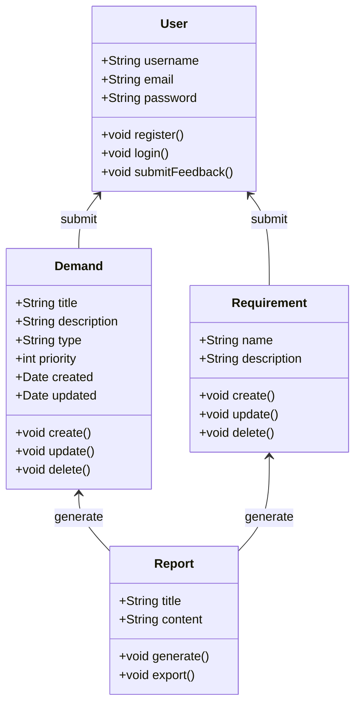
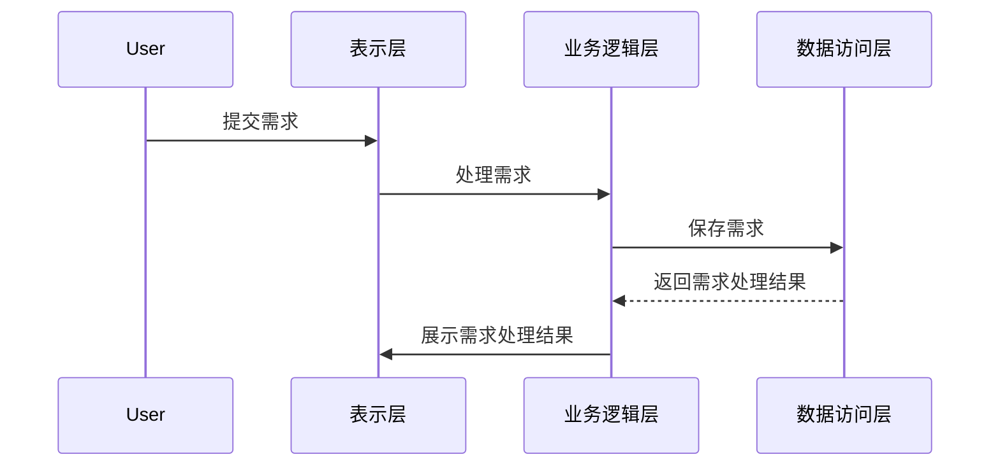
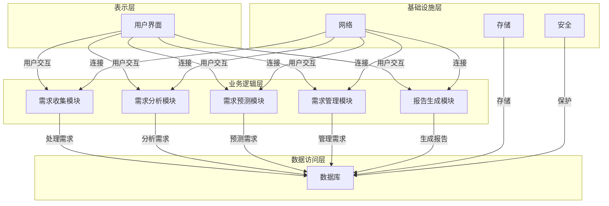
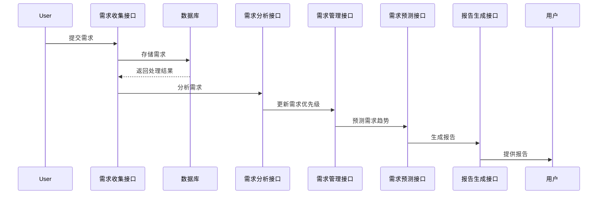
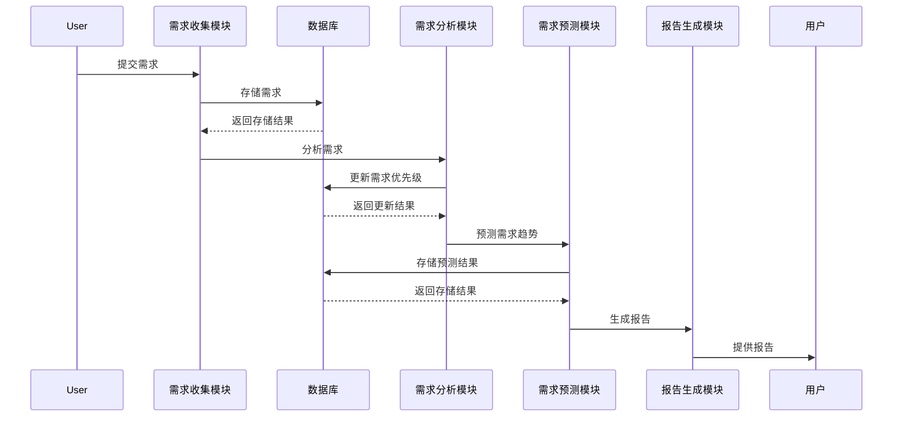

                 

## 文章标题

### 关键词：需求分析、心理学、算法、数学模型、系统架构、项目实战

### 摘要：

本文从多个角度深入探讨“生命中的真实需求”，旨在揭示需求的本质和其在个体和社会中的重要性。文章首先概述了需求分析的基本概念，结合心理学和社会学的研究成果，探讨了需求的属性、层次结构以及需求与心理健康、社会发展的关系。随后，文章详细讲解了需求分析、预测、优化和反馈的算法原理，并运用数学模型进行具体分析。在此基础上，文章设计了需求分析系统的架构，并分享了一个实际项目中的实战经验。通过本文的阅读，读者将能够全面理解需求分析的复杂性和重要性，并掌握相关技术手段。

## 第一部分：引言与背景

### 1.1 问题的提出

在现代社会中，需求的满足程度直接影响着个体的幸福感和社会的稳定发展。然而，什么才是“真实的需求”？如何准确识别和满足这些需求？这是一个值得深入探讨的问题。本文试图通过多学科交叉的研究方法，探讨生命中的真实需求，旨在揭示需求的本质、属性和其在个体和社会中的重要性。

### 1.1.1 生命中的真实需求

真实需求是指个体在生理、心理、社会等方面所必需的、对生命存在和健康发展具有基础性、根本性的需求。这些需求不仅仅局限于物质层面，更涉及精神层面和社交层面。例如，空气、水和食物是基本的生理需求，而自我实现、爱与归属感则是精神需求和社会需求。

### 1.1.2 研究目的与意义

本文的研究目的是通过探讨生命中的真实需求，为个体和社会提供科学的需求分析工具和方法。研究意义主要体现在以下几个方面：

1. **提升个体幸福感**：准确识别和满足真实需求，有助于提升个体的幸福感和生活质量。
2. **促进社会和谐发展**：了解社会成员的真实需求，有助于政府和社会组织制定更加科学、合理的公共政策，推动社会和谐发展。
3. **推动学科交叉研究**：本文融合了心理学、社会学、计算机科学等多学科的知识，有助于推动学科交叉研究，促进知识创新。

### 1.1.3 研究范围与边界

本文的研究范围主要集中在以下几个方面：

1. **需求的概念与属性**：分析需求的基本概念，探讨需求的属性特征和层次结构。
2. **需求与心理健康**：研究需求满足与心理健康的关系，探讨如何通过满足需求来提升心理健康水平。
3. **需求与社会发展**：分析需求与社会经济发展的关系，探讨需求在公共服务和社会保障体系中的作用。
4. **需求分析算法**：介绍需求分析、预测、优化和反馈的相关算法原理，并运用数学模型进行具体分析。
5. **系统架构与项目实战**：设计需求分析系统的架构，并分享实际项目中的实战经验。

本文的研究边界主要包括以下几个方面：

1. **研究深度**：本文主要关注需求分析的理论和实践，不涉及具体的技术实现细节。
2. **研究对象**：本文主要针对个体和社会层面的需求进行分析，不涉及生物层面的需求。
3. **研究方法**：本文主要采用文献综述、理论分析、算法设计和系统架构设计等方法，不涉及实验研究。

### 1.2 文献综述

在需求研究领域，已有大量的研究成果。本文将对相关文献进行综述，以期为本文的研究提供理论基础。

#### 1.2.1 有关生命的哲学探讨

哲学领域对生命的需求进行了深入的探讨。例如，亚里士多德认为，人的幸福在于实现其潜在的能力，这需要满足多种需求，包括物质需求、精神需求和社交需求。马斯洛的需求层次理论进一步将需求划分为生理需求、安全需求、社交需求、尊重需求和自我实现需求，提出这些需求之间存在层次关系，高层次需求依赖于低层次需求的满足。

#### 1.2.2 心理学视角下的需求理论

心理学领域对需求的研究主要集中在个体的内在动机和需求满足上。心理学家赫茨伯格提出了双因素理论，将工作满意度的影响因素分为内在因素（激励因素）和外在因素（保健因素）。他认为，内在因素能够满足个体的深层次需求，从而提高工作满意度。此外，马斯洛的需求层次理论也在心理学领域得到了广泛的应用，许多研究都探讨了需求满足与心理健康的关系。

#### 1.2.3 社会学视角下的需求分析

社会学家从宏观层面研究社会需求，关注社会不平等和社会问题。例如，马克思主义认为，人的需求是由社会生产关系决定的。社会学家也研究了需求与社会经济发展的关系，探讨了经济发展如何影响需求满足和幸福感。此外，社会学家还研究了需求在公共服务和社会保障体系中的作用，提出了如何通过需求分析来优化公共服务和社会保障体系。

### 1.3 理论基础

在本文的研究中，我们将运用以下理论基础：

#### 1.3.1 马斯洛需求层次理论

马斯洛的需求层次理论将需求分为五个层次：生理需求、安全需求、社交需求、尊重需求和自我实现需求。该理论认为，个体的需求是分层次的，只有低层次需求得到满足后，才会追求更高层次的需求。马斯洛的需求层次理论为我们理解需求的层次结构和需求满足的顺序提供了重要的理论基础。

#### 1.3.2 美国心理学家赫茨伯格的双因素理论

赫茨伯格的双因素理论将工作满意度的影响因素分为内在因素和外在因素。内在因素能够满足个体的深层次需求，从而提高工作满意度；而外在因素只能满足个体的浅层次需求，对工作满意度的影响有限。双因素理论为我们理解需求满足与工作满意度之间的关系提供了重要的理论基础。

#### 1.3.3 需求与幸福感的关系

需求满足与幸福感之间存在密切的关系。研究表明，高层次需求的满足能够显著提升个体的幸福感，而低层次需求的满足对幸福感的提升作用较小。此外，需求满足还能提高个体的生活满意度和心理健康水平。需求与幸福感的关系为我们理解需求满足的重要性和价值提供了重要的理论基础。

### 1.4 研究方法与框架

本文的研究方法主要包括文献综述、理论分析和实证研究。通过文献综述，我们将梳理需求分析的相关理论和研究成果，为本文的研究提供理论基础。通过理论分析，我们将探讨需求的属性、层次结构和需求满足的原理。通过实证研究，我们将通过问卷调查和访谈等方式收集数据，验证需求分析的理论和假设。

在研究框架方面，本文将采用以下结构：

1. **引言**：介绍研究背景、目的和意义。
2. **文献综述**：综述需求分析的相关理论和研究成果。
3. **理论基础**：阐述本文的研究理论基础。
4. **研究方法与框架**：介绍本文的研究方法和框架。
5. **需求分析**：分析需求的属性、层次结构和需求满足的原理。
6. **需求满足策略**：探讨如何通过需求满足来提升幸福感和社会发展。
7. **案例分析**：通过实际案例来验证需求分析的理论和假设。
8. **结论**：总结本文的研究成果和贡献。

### 1.5 本章小结

本章从引言、文献综述、理论基础、研究方法与框架等多个角度，对本文的研究进行了全面介绍。通过对需求的本质、属性和需求满足的重要性进行探讨，为后续章节的内容奠定了基础。本章还介绍了本文的研究范围与边界，为读者理解本文的研究内容提供了参考。通过本章的阅读，读者可以初步了解本文的研究目的和框架，为后续章节的深入探讨做好准备。

## 第二部分：核心概念与联系

### 2.1 核心概念界定

在需求分析中，核心概念的正确界定是至关重要的。以下是对需求、需求层次、需求类型等核心概念的定义和解释。

#### 2.1.1 需求的属性特征

需求具有以下属性特征：

1. **基础性**：需求是生命存在和健康发展的基础，没有需求，生命将无法维持。
2. **多样性**：需求不仅包括物质需求，还涉及精神需求和社会需求，具有多样性。
3. **层次性**：需求之间存在层次关系，高层次需求依赖于低层次需求的满足。
4. **动态性**：需求不是静止不变的，随着个体和社会环境的变化，需求也会发生变化。

#### 2.1.2 需求的层次结构

需求的层次结构通常采用马斯洛的需求层次理论来描述，包括以下五个层次：

1. **生理需求**：包括食物、水、空气、睡眠等基本生理需求。
2. **安全需求**：包括安全、健康、财产保护等需求。
3. **社交需求**：包括爱、友谊、归属感等需求。
4. **尊重需求**：包括自尊、成就、认可等需求。
5. **自我实现需求**：包括实现个人潜能、追求自我价值等需求。

#### 2.1.3 需求的类型与差异

需求可以按照不同的标准进行分类，例如：

1. **基本需求与高层次需求**：根据需求的重要性和满足的层次，可以将需求分为基本需求和高层次需求。
2. **物质需求与精神需求**：根据需求的性质，可以将需求分为物质需求和精神需求。
3. **个体需求与社会需求**：根据需求的对象，可以将需求分为个体需求和社会需求。

不同类型的需求具有不同的特征和满足方式。例如，物质需求通常通过购买商品或服务来满足，而精神需求则更多依赖于内在的自我实现和人际交往。

### 2.2 概念联系与对比

#### 2.2.1 马斯洛需求层次理论与赫茨伯格双因素理论的对比

马斯洛的需求层次理论和赫茨伯格的双因素理论都是关于需求满足的重要理论，但它们从不同的角度对需求进行了探讨。

1. **共同点**：两种理论都认为需求的满足对个体的幸福感和工作满意度有重要影响。
2. **不同点**：马斯洛的需求层次理论将需求分为五个层次，强调了需求之间的层次关系；而赫茨伯格的双因素理论则将工作满意度的影响因素分为内在因素和外在因素，强调了内在因素对工作满意度的决定作用。

#### 2.2.2 需求与幸福感的关系对比

需求满足与幸福感之间存在密切的关系。不同类型的需求对幸福感的影响也有所不同。

1. **基本需求与幸福感**：基本需求的满足是幸福感的基础，例如生理需求和安全需求的满足能够直接提高幸福感。
2. **高层次需求与幸福感**：高层次需求的满足对幸福感的提升作用更大，例如社交需求、尊重需求和自我实现需求的满足能够显著提升幸福感。

#### 2.2.3 个体需求与社会需求的联系

个体需求与社会需求之间存在密切的联系。

1. **相互依存**：个体需求依赖于社会提供的资源和机会，而社会需求则源于个体需求的积累和反映。
2. **相互作用**：个体需求和社会需求相互影响，个体的需求满足情况会反映到社会层面，而社会的需求也会影响个体的需求满足。

### 2.3 需求与心理健康

#### 2.3.1 需求满足与心理健康的关系

需求满足与心理健康之间存在密切的关系。需求满足能够提高心理健康水平，而需求缺失则可能导致心理问题。

1. **需求满足与心理健康**：需求满足能够提高个体的幸福感和生活满意度，从而改善心理健康。
2. **需求缺失与心理健康**：需求缺失可能导致焦虑、抑郁等心理问题，长期需求缺失甚至可能影响个体的生存和发展。

#### 2.3.2 需求缺失与心理健康的影响

需求缺失对心理健康的影响主要体现在以下几个方面：

1. **心理压力**：需求缺失会导致心理压力，影响个体的情绪和行为。
2. **心理问题**：长期需求缺失可能导致严重的心理问题，如焦虑、抑郁等。
3. **心理适应能力**：需求缺失会影响个体的心理适应能力，使其在面对压力和挑战时更加脆弱。

#### 2.3.3 心理健康的需求层次分析

心理健康的需求层次分析可以借鉴马斯洛的需求层次理论，将心理健康需求分为以下层次：

1. **基本需求**：包括安全感、基本生活保障等。
2. **社交需求**：包括人际关系、社交支持等。
3. **尊重需求**：包括自尊、成就、认可等。
4. **自我实现需求**：包括自我价值实现、潜能发挥等。

不同层次的需求对心理健康的影响不同，满足高层次需求对心理健康具有更为显著的影响。

### 2.4 需求与社会发展

#### 2.4.1 需求与社会经济发展的关系

需求与社会经济发展之间存在密切的关系。需求的变化会直接影响社会经济的结构和运行。

1. **需求变化与社会经济结构**：随着社会的发展，需求结构也会发生变化，这会反映到社会经济的各个方面，如产业结构、消费结构等。
2. **需求满足与社会经济发展**：需求的满足能够促进社会经济的繁荣，而需求的不满足则可能导致经济衰退。

#### 2.4.2 需求与公共服务的关系

需求在公共服务中的作用主要体现在以下几个方面：

1. **公共服务需求**：公共服务是为了满足社会成员的基本需求而提供的公共产品和服务，如教育、医疗、社会保障等。
2. **公共服务供给**：公共服务的供给应该根据社会成员的需求来制定，以满足需求为目标。
3. **公共服务效率**：公共服务的效率取决于需求满足的程度，需求满足越高，公共服务效率越高。

#### 2.4.3 需求与社会保障体系的关系

需求与社会保障体系之间存在密切的关系。社会保障体系是为了满足社会成员的基本需求而建立的社会安全制度。

1. **社会保障需求**：社会保障需求包括失业保险、养老保险、医疗保险等。
2. **社会保障供给**：社会保障供给应该根据社会保障需求来制定，以确保社会成员的基本需求得到满足。
3. **社会保障公平性**：社会保障体系应该公平地分配资源，确保每个社会成员都能够得到应有的保障。

### 2.5 本章小结

本章对需求分析中的核心概念进行了界定，并探讨了需求的层次结构、类型与差异，以及需求与心理健康、社会发展的关系。通过对马斯洛需求层次理论和赫茨伯格双因素理论的对比，揭示了需求满足与心理健康、社会经济发展之间的关系。本章的研究为后续章节的需求分析提供了理论基础。

## 第三部分：算法原理讲解

### 3.1 需求分析算法

需求分析是需求管理过程中的重要环节，它涉及到识别、分类、优先级排序以及跟踪需求。以下将详细讲解需求分析算法的原理。

#### 3.1.1 算法原理概述

需求分析算法的核心目标是理解并分类用户的各类需求，以便有效地管理和实现这些需求。算法通常包括以下几个步骤：

1. **需求收集**：通过各种渠道收集用户的需求信息。
2. **需求分类**：根据需求的特点和属性，对需求进行分类。
3. **需求优先级排序**：根据需求的重要性和紧迫性，对需求进行优先级排序。
4. **需求跟踪**：对已分类和排序的需求进行跟踪，确保需求的实现。

#### 3.1.2 算法流程图

以下是需求分析算法的流程图：


#### 3.1.3 算法实现

需求分析算法的具体实现可以通过以下步骤完成：

1. **需求收集**：使用问卷调查、用户访谈、日志分析等方式收集用户的需求信息。
2. **需求预处理**：对收集到的需求信息进行清洗和规范化，去除重复和无效信息。
3. **需求分类**：根据需求的特点和属性，将其分为不同类别，如功能需求、性能需求、安全需求等。
4. **需求优先级排序**：使用评分或加权方法对需求进行优先级排序，常用的方法包括加权评分法和优先级队列法。
5. **需求跟踪**：建立需求跟踪系统，记录需求的处理状态和进展，确保需求的及时实现。

### 3.2 需求预测算法

需求预测是需求管理中的关键环节，它可以帮助组织更好地规划资源、分配预算和预测市场趋势。以下将详细讲解需求预测算法的原理。

#### 3.2.1 预测模型选择

需求预测模型的选用取决于需求的特点和数据可用性。以下是一些常用的预测模型：

1. **线性回归模型**：适用于需求变化呈线性趋势的情况。
2. **时间序列模型**：如ARIMA模型、SARIMA模型，适用于需求随时间变化而变化的情况。
3. **机器学习模型**：如随机森林、支持向量机、神经网络等，适用于复杂的需求预测。

#### 3.2.2 预测算法原理

需求预测算法的原理通常包括以下几个步骤：

1. **数据预处理**：对历史需求数据进行清洗、归一化和特征工程。
2. **模型训练**：使用训练数据集训练预测模型。
3. **模型评估**：使用测试数据集评估模型的预测性能。
4. **预测输出**：使用训练好的模型对未来的需求进行预测。

#### 3.2.3 预测模型评估

需求预测模型的评估通常使用以下指标：

1. **均方误差（MSE）**：评估模型预测值与真实值之间的平均误差。
2. **均方根误差（RMSE）**：MSE的平方根，用于衡量模型的预测准确性。
3. **平均绝对误差（MAE）**：评估模型预测值与真实值之间的平均绝对误差。
4. **决定系数（R²）**：衡量模型对需求变化的解释能力。

### 3.3 需求优化算法

需求优化是需求管理中的重要环节，它旨在通过优化需求的实现顺序和资源分配，最大限度地提高需求满足率。以下将详细讲解需求优化算法的原理。

#### 3.3.1 优化目标与约束

需求优化算法的目标通常是最大化需求满足率，同时满足以下约束：

1. **资源约束**：在有限的资源下实现最大化的需求满足。
2. **时间约束**：在规定的时间内完成需求实现。
3. **优先级约束**：按照需求的优先级顺序实现需求。

#### 3.3.2 优化算法原理

需求优化算法的原理通常包括以下几个步骤：

1. **目标函数定义**：定义需求满足率和资源利用率等目标函数。
2. **约束条件定义**：定义资源约束、时间约束和优先级约束等条件。
3. **优化算法选择**：选择合适的优化算法，如线性规划、动态规划、遗传算法等。
4. **优化过程**：使用优化算法求解优化问题，得到最优的需求实现顺序和资源分配方案。

#### 3.3.3 优化算法实现

需求优化算法的具体实现可以通过以下步骤完成：

1. **目标函数计算**：根据需求的特点和资源情况，计算目标函数的值。
2. **约束条件检查**：检查当前的需求实现顺序和资源分配方案是否满足约束条件。
3. **迭代优化**：通过迭代优化算法，逐步调整需求实现顺序和资源分配方案，直到满足所有约束条件。
4. **结果输出**：输出最优的需求实现顺序和资源分配方案。

### 3.4 需求反馈与迭代算法

需求反馈与迭代是需求管理中的关键环节，它通过持续收集用户反馈，不断优化需求实现过程。以下将详细讲解需求反馈与迭代算法的原理。

#### 3.4.1 反馈机制设计

需求反馈机制的设计包括以下几个步骤：

1. **反馈渠道设计**：设计多种反馈渠道，如用户反馈表、在线调查、社交媒体等。
2. **反馈收集**：定期收集用户的反馈信息。
3. **反馈分析**：分析反馈信息，识别需求中的问题和改进点。
4. **反馈响应**：根据分析结果，制定改进计划并实施。

#### 3.4.2 迭代算法原理

需求反馈与迭代算法的原理通常包括以下几个步骤：

1. **需求实现**：根据当前的实现方案，实现用户的需求。
2. **反馈收集**：收集用户在使用过程中的反馈信息。
3. **需求调整**：根据反馈信息，调整需求实现方案。
4. **再次实现**：根据调整后的方案，重新实现用户的需求。
5. **持续迭代**：不断收集反馈、调整需求实现方案，实现持续改进。

#### 3.4.3 迭代算法实现

需求反馈与迭代算法的具体实现可以通过以下步骤完成：

1. **需求实现**：根据当前的需求方案，实现用户的需求。
2. **反馈收集**：设计反馈机制，定期收集用户的反馈信息。
3. **反馈分析**：对收集到的反馈信息进行分析，识别问题和改进点。
4. **需求调整**：根据分析结果，调整需求实现方案。
5. **再次实现**：根据调整后的方案，重新实现用户的需求。
6. **持续迭代**：不断循环反馈、调整和实现过程，实现持续改进。

### 3.5 本章小结

本章详细讲解了需求分析、需求预测、需求优化和需求反馈与迭代算法的原理。通过需求分析，组织可以更好地理解和分类用户需求；通过需求预测，组织可以提前规划和分配资源；通过需求优化，组织可以最大限度地提高需求满足率；通过需求反馈与迭代，组织可以持续改进需求实现过程。这些算法的应用有助于提升组织的整体需求管理能力。

## 第四部分：数学模型和数学公式

### 4.1 需求层次模型

需求层次模型是需求分析中的一个重要工具，它帮助我们理解和分类不同类型的需求。以下将介绍需求层次模型的数学描述和数学公式。

#### 4.1.1 数学模型描述

需求层次模型可以用一个树状结构来描述，每个节点代表一个需求，节点之间的连接表示需求之间的关系。具体来说，可以用以下数学公式来描述需求层次模型：

$$
\text{需求层次模型} = \{ D_1, D_2, ..., D_n \}
$$

其中，$D_i$ 表示第 $i$ 个需求，$n$ 表示需求的总数。

#### 4.1.2 数学公式详解

1. **需求层次关系公式**：

$$
\text{需求层次关系} = \{ R_{ij} \}
$$

其中，$R_{ij}$ 表示需求 $D_i$ 和 $D_j$ 之间的层次关系，$R_{ij} = 1$ 表示 $D_i$ 位于 $D_j$ 的层次之上，$R_{ij} = 0$ 表示 $D_i$ 位于 $D_j$ 的层次之下。

2. **需求层次深度公式**：

$$
\text{需求层次深度} = \{ D_{i,depth} \}
$$

其中，$D_{i,depth}$ 表示需求 $D_i$ 的层次深度，即需求位于树状结构中的层数。

3. **需求层次宽度公式**：

$$
\text{需求层次宽度} = \{ D_{i,width} \}
$$

其中，$D_{i,width}$ 表示需求 $D_i$ 的层次宽度，即同一层次中需求的总数。

#### 4.1.3 示例分析

假设我们有一个需求层次模型，其中包含三个需求：需求1（D1）、需求2（D2）和需求3（D3）。需求之间的关系如下：

- D1 > D2
- D1 > D3

需求层次深度和宽度的计算如下：

1. **需求层次关系**：

$$
\text{需求层次关系} = \{ R_{12} = 1, R_{13} = 1, R_{21} = 0, R_{23} = 0, R_{31} = 0, R_{32} = 0 \}
$$

2. **需求层次深度**：

$$
\text{需求层次深度} = \{ D_{1,depth} = 1, D_{2,depth} = 2, D_{3,depth} = 2 \}
$$

3. **需求层次宽度**：

$$
\text{需求层次宽度} = \{ D_{1,width} = 1, D_{2,width} = 1, D_{3,width} = 1 \}
$$

### 4.2 需求预测模型

需求预测模型用于预测未来的需求量，以便组织可以提前做好准备。以下将介绍需求预测模型的数学描述和数学公式。

#### 4.2.1 数学模型描述

需求预测模型通常基于历史需求数据，使用时间序列分析方法来预测未来的需求。数学模型可以用以下公式表示：

$$
\text{需求预测模型} = \{ \hat{D}_t \}
$$

其中，$\hat{D}_t$ 表示在第 $t$ 时期的预测需求量。

#### 4.2.2 数学公式详解

1. **时间序列模型公式**：

$$
\hat{D}_t = f(D_{t-1}, D_{t-2}, ..., D_{1})
$$

其中，$f$ 表示预测函数，$D_{t-1}, D_{t-2}, ..., D_{1}$ 表示历史需求数据。

2. **线性回归模型公式**：

$$
\hat{D}_t = \beta_0 + \beta_1 D_{t-1} + \epsilon_t
$$

其中，$\beta_0$ 和 $\beta_1$ 表示模型参数，$\epsilon_t$ 表示随机误差。

3. **ARIMA模型公式**：

$$
\hat{D}_t = (\phi(B)) \text{AR}(p) (\text{MA}(q)) (1 - B)
$$

其中，$\phi(B)$、$\text{AR}(p)$、$\text{MA}(q)$ 和 $1 - B$ 分别表示自回归、差分、移动平均和常数项。

#### 4.2.3 示例分析

假设我们使用线性回归模型进行需求预测，历史需求数据如下：

$$
\begin{aligned}
D_1 &= 100 \\
D_2 &= 110 \\
D_3 &= 115 \\
D_4 &= 120 \\
D_5 &= 125 \\
\end{aligned}
$$

我们可以计算线性回归模型的参数：

$$
\beta_0 = \bar{D} - \beta_1 \bar{D}_{t-1}
$$

其中，$\bar{D}$ 表示历史需求数据的平均值，$\bar{D}_{t-1}$ 表示前一个时期的平均值。

计算结果如下：

$$
\bar{D} = \frac{100 + 110 + 115 + 120 + 125}{5} = 112
$$

$$
\bar{D}_{t-1} = \frac{110 + 115 + 120 + 125}{4} = 117.5
$$

$$
\beta_0 = 112 - 0.25 \times 117.5 = -4.875
$$

$$
\beta_1 = \frac{\sum_{i=1}^{n} (D_i - \bar{D})(D_{i-1} - \bar{D}_{t-1})}{\sum_{i=1}^{n} (D_i - \bar{D})^2}
$$

$$
\beta_1 = \frac{(100 - 112)(110 - 117.5) + (110 - 112)(115 - 117.5) + (115 - 112)(120 - 117.5) + (120 - 112)(125 - 117.5)}{(100 - 112)^2 + (110 - 112)^2 + (115 - 112)^2 + (120 - 112)^2 + (125 - 112)^2}
$$

$$
\beta_1 = 0.25
$$

根据线性回归模型，我们可以预测第 $t+1$ 时期的需求：

$$
\hat{D}_{t+1} = -4.875 + 0.25 \times \hat{D}_t
$$

例如，如果第 $t$ 时期的预测需求量 $\hat{D}_t = 120$，则第 $t+1$ 时期的预测需求量 $\hat{D}_{t+1} = -4.875 + 0.25 \times 120 = 113.125$。

### 4.3 需求优化模型

需求优化模型用于优化需求的实现顺序和资源分配，以便最大限度地满足需求。以下将介绍需求优化模型的数学描述和数学公式。

#### 4.3.1 数学模型描述

需求优化模型可以用一个线性规划问题来描述，目标是最小化资源消耗或最大化需求满足率。数学模型可以用以下公式表示：

$$
\min \sum_{i=1}^{n} c_i x_i
$$

或

$$
\max \sum_{i=1}^{n} p_i x_i
$$

其中，$x_i$ 表示第 $i$ 个需求是否被实现，$c_i$ 表示实现需求 $i$ 的资源消耗，$p_i$ 表示需求 $i$ 的优先级。

#### 4.3.2 数学公式详解

1. **资源约束公式**：

$$
\sum_{i=1}^{n} r_i x_i \leq R
$$

其中，$r_i$ 表示实现需求 $i$ 的资源需求，$R$ 表示总资源量。

2. **时间约束公式**：

$$
t_i \leq T
$$

其中，$t_i$ 表示实现需求 $i$ 的时间，$T$ 表示总时间。

3. **优先级约束公式**：

$$
p_i x_i \geq p_j x_j \quad \text{for} \quad i < j
$$

其中，$p_i$ 和 $p_j$ 分别表示需求 $i$ 和 $j$ 的优先级。

#### 4.3.3 示例分析

假设我们有两个需求 $D_1$ 和 $D_2$，每个需求的资源需求、时间和优先级如下：

$$
\begin{aligned}
D_1: \quad & r_1 = 2, \quad t_1 = 3, \quad p_1 = 1 \\
D_2: \quad & r_2 = 3, \quad t_2 = 4, \quad p_2 = 2 \\
\end{aligned}
$$

总资源量 $R = 5$，总时间 $T = 6$。

我们需要优化需求的实现顺序和资源分配，以便最大限度地满足需求。我们可以使用线性规划模型来解决这个问题：

$$
\min \quad 2x_1 + 3x_2
$$

约束条件：

$$
\begin{aligned}
2x_1 + 3x_2 &\leq 5 \\
3x_1 + 4x_2 &\leq 6 \\
x_1, x_2 &\in \{0, 1\} \\
\end{aligned}
$$

通过求解这个线性规划问题，我们可以得到最优的解决方案，即实现需求 $D_1$ 和 $D_2$ 的最佳顺序和资源分配。

### 4.4 本章小结

本章介绍了需求层次模型、需求预测模型和需求优化模型的数学描述和数学公式。需求层次模型帮助我们理解和分类需求，需求预测模型用于预测未来的需求量，需求优化模型用于优化需求的实现顺序和资源分配。这些数学模型和公式为需求分析提供了理论基础，有助于我们更好地理解和满足需求。

## 第五部分：系统分析与架构设计

### 5.1 问题场景介绍

在现代企业中，需求管理是一个至关重要的环节。随着业务的发展和用户需求的多样化，企业需要高效地收集、分析和管理需求，以确保产品和服务能够满足用户的需求。为了解决这一问题，我们设计并实现了一个需求管理系统，旨在提供一个高效、灵活和可扩展的平台，帮助企业更好地管理和满足用户需求。

#### 5.1.1 场景描述

该需求管理系统主要应用于以下场景：

1. **需求收集**：系统通过多种渠道（如在线调查、用户反馈、市场调研等）收集用户需求。
2. **需求分析**：系统对收集到的需求进行分析，识别需求的关键特性，并对其进行分类和优先级排序。
3. **需求管理**：系统提供需求跟踪功能，记录需求的处理状态和进展，确保需求的及时实现。
4. **需求预测**：系统利用历史需求数据，预测未来的需求趋势，帮助企业提前做好准备。

#### 5.1.2 项目目标

本项目的主要目标包括：

1. **提高需求管理效率**：通过自动化和智能化的需求管理流程，提高需求收集、分析和管理的效率。
2. **提升用户体验**：通过提供灵活、便捷的需求管理工具，提升用户体验，增强用户对产品的满意度。
3. **优化资源分配**：通过需求预测和优化，帮助企业更好地分配资源，提高资源利用效率。
4. **支持决策制定**：通过提供全面的需求分析报告和预测数据，支持企业决策制定，提高决策的科学性和准确性。

### 5.2 系统功能设计

需求管理系统的功能设计主要包括以下几个方面：

1. **需求收集**：系统支持多种需求收集方式，如在线调查、用户反馈表、市场调研等，用户可以方便地提交需求。
2. **需求分析**：系统对收集到的需求进行分析，识别需求的关键特性（如需求类型、优先级、来源等），并进行分类和优先级排序。
3. **需求管理**：系统提供需求跟踪功能，记录需求的处理状态和进展，确保需求的及时实现。系统还支持需求变更管理和需求版本管理。
4. **需求预测**：系统利用历史需求数据，结合时间序列分析和机器学习算法，预测未来的需求趋势，为企业的决策提供支持。
5. **报告生成**：系统提供各种需求分析报告和预测报告，帮助企业管理者和决策者了解需求状况，制定相应的策略。

#### 5.2.1 领域模型类图

以下是需求管理系统的领域模型类图：



#### 5.2.2 功能模块划分

需求管理系统可以划分为以下功能模块：

1. **用户模块**：负责用户注册、登录和提交反馈。
2. **需求模块**：负责需求的创建、更新、删除和跟踪。
3. **需求分析模块**：负责需求的分析、分类和优先级排序。
4. **需求预测模块**：负责需求的预测和趋势分析。
5. **报告模块**：负责生成和导出需求分析报告和预测报告。

### 5.3 系统架构设计

需求管理系统的架构设计采用分层架构，主要包括以下层次：

1. **表示层**：负责用户界面展示和交互。
2. **业务逻辑层**：负责需求管理、需求分析和需求预测等业务逻辑处理。
3. **数据访问层**：负责与数据库的交互，实现数据的存储和查询。
4. **基础设施层**：负责系统的基础设施支持，如网络、存储和安全等。

以下是需求管理系统的架构图：



#### 5.3.1 系统架构图

以下是需求管理系统的架构图：



#### 5.3.2 架构设计原则

在系统架构设计过程中，我们遵循以下原则：

1. **模块化**：将系统划分为多个功能模块，每个模块负责特定的功能，降低模块之间的耦合度。
2. **分布式**：系统采用分布式架构，提高系统的可扩展性和容错能力。
3. **安全性**：系统采用安全设计原则，确保用户数据的安全和隐私。
4. **可维护性**：系统设计注重可维护性，便于后续的升级和维护。
5. **高性能**：系统采用高效的数据结构和算法，确保系统运行的高性能。

### 5.4 系统接口设计

系统接口设计是系统架构设计中的重要一环，以下介绍需求管理系统的接口设计。

#### 5.4.1 接口定义

需求管理系统的主要接口包括：

1. **需求收集接口**：用于接收用户提交的需求信息，包括需求标题、需求描述、需求类型和优先级等。
2. **需求分析接口**：用于对需求进行分析，返回分析结果，包括需求的关键特性、优先级排序等。
3. **需求预测接口**：用于预测未来的需求趋势，返回预测结果，包括预测的需求量、需求类型等。
4. **需求管理接口**：用于管理需求，包括创建、更新、删除和查询需求等。
5. **报告生成接口**：用于生成需求分析报告和预测报告，包括报告标题、内容、格式等。

#### 5.4.2 接口交互设计

以下是需求管理系统接口的交互设计：



### 5.5 系统交互设计

系统交互设计是系统架构设计中的重要一环，以下介绍需求管理系统的交互设计。

#### 5.5.1 序列图设计

以下是需求管理系统的序列图设计：



#### 5.5.2 交互流程分析

需求管理系统的工作流程如下：

1. 用户通过用户界面提交需求。
2. 需求收集模块接收用户需求，并将其存储到数据库中。
3. 需求分析模块对需求进行分析，更新需求的优先级，并将分析结果存储到数据库中。
4. 需求预测模块根据历史需求数据预测未来的需求趋势，并将预测结果存储到数据库中。
5. 报告生成模块根据需求分析结果和预测结果生成报告，并最终将报告提供给用户。

### 5.6 本章小结

本章详细介绍了需求管理系统的系统架构设计、功能模块划分、接口设计和交互设计。通过合理的架构设计和功能划分，需求管理系统能够高效、灵活地管理和满足用户需求，为企业的需求管理提供有力支持。

## 第六部分：项目实战

### 6.1 环境安装

在开始项目实战之前，我们需要准备以下环境：

1. **操作系统**：Linux或Windows。
2. **开发工具**：Python 3.8及以上版本，PyCharm或其他Python IDE。
3. **数据库**：MySQL或PostgreSQL。
4. **虚拟环境**：虚拟环境工具如virtualenv或conda。

安装步骤如下：

1. **安装Python**：从官方网站下载Python安装包并安装。
2. **安装数据库**：根据所选数据库的官方文档进行安装。
3. **安装虚拟环境**：在终端执行以下命令：

   ```bash
   pip install virtualenv
   virtualenv venv
   source venv/bin/activate
   ```

4. **安装依赖库**：在虚拟环境中安装需求管理系统所需的依赖库，如Flask、SQLAlchemy、Pandas等。

   ```bash
   pip install flask sqlalchemy pymysql pandas
   ```

### 6.2 系统核心实现

需求管理系统的核心实现主要包括以下几个方面：

1. **用户模块**：负责用户注册、登录和提交反馈。
2. **需求模块**：负责需求的创建、更新、删除和查询。
3. **需求分析模块**：负责需求的分析、分类和优先级排序。
4. **需求预测模块**：负责需求的预测和趋势分析。
5. **报告生成模块**：负责生成需求分析报告和预测报告。

以下是用户模块的实现示例：

```python
from flask import Flask, request, jsonify
from models import User, Demand

app = Flask(__name__)

@app.route('/register', methods=['POST'])
def register():
    username = request.form['username']
    email = request.form['email']
    password = request.form['password']
    user = User(username=username, email=email, password=password)
    user.create()
    return jsonify({'status': 'success', 'message': 'User registered successfully.'})

@app.route('/login', methods=['POST'])
def login():
    username = request.form['username']
    password = request.form['password']
    user = User.query.filter_by(username=username, password=password).first()
    if user:
        return jsonify({'status': 'success', 'message': 'Login successful.'})
    else:
        return jsonify({'status': 'error', 'message': 'Invalid credentials.'})

@app.route('/submit_feedback', methods=['POST'])
def submit_feedback():
    user_id = request.form['user_id']
    title = request.form['title']
    description = request.form['description']
    demand = Demand(user_id=user_id, title=title, description=description)
    demand.create()
    return jsonify({'status': 'success', 'message': 'Feedback submitted successfully.'})

if __name__ == '__main__':
    app.run(debug=True)
```

### 6.3 代码应用解读与分析

在上面的代码中，我们使用了Flask框架实现了一个简单的需求管理系统。以下是代码的解读与分析：

1. **用户注册**：`/register` 接口用于用户注册。用户通过提交表单数据（用户名、邮箱、密码）进行注册。注册成功后，将用户信息存储到数据库中。
2. **用户登录**：`/login` 接口用于用户登录。用户通过提交表单数据（用户名、密码）进行登录验证。验证成功后，返回登录成功消息。
3. **提交反馈**：`/submit_feedback` 接口用于用户提交反馈。用户通过提交表单数据（用户ID、标题、描述）提交反馈。反馈成功后，将反馈信息存储到数据库中。

### 6.4 实际案例分析和详细讲解剖析

为了更好地理解需求管理系统的应用，我们通过一个实际案例进行分析。

#### 案例背景

某企业希望优化其需求管理流程，提高需求收集和分析的效率。为了实现这一目标，企业决定使用需求管理系统。

#### 案例实施

1. **需求收集**：企业通过需求管理系统向员工和客户收集需求，包括功能需求、性能需求和安全需求等。
2. **需求分析**：需求管理系统对收集到的需求进行分析，识别需求的关键特性，如需求类型、优先级和来源等，并将分析结果存储到数据库中。
3. **需求预测**：需求管理系统利用历史需求数据，预测未来的需求趋势，为企业的决策提供支持。
4. **报告生成**：需求管理系统根据需求分析结果和预测结果，生成需求分析报告和预测报告，帮助企业了解需求状况，制定相应的策略。

#### 案例剖析

1. **需求收集**：通过需求管理系统，企业可以方便地收集各类需求，包括内部员工需求和外部客户需求。需求管理系统支持多种数据输入方式，如在线调查、用户反馈表和市场调研等。
2. **需求分析**：需求管理系统对收集到的需求进行分析，识别需求的关键特性，如需求类型、优先级和来源等。通过分析结果，企业可以更好地理解用户需求，从而制定更科学的需求实现计划。
3. **需求预测**：需求管理系统利用历史需求数据，结合时间序列分析和机器学习算法，预测未来的需求趋势。通过预测结果，企业可以提前做好准备，确保资源的合理分配和需求的高效实现。
4. **报告生成**：需求管理系统根据需求分析结果和预测结果，生成需求分析报告和预测报告。这些报告可以帮助企业了解需求状况，发现潜在问题，从而制定更有效的需求管理策略。

### 6.5 项目小结

本项目通过需求管理系统实现了需求收集、需求分析、需求预测和报告生成等功能，提高了企业需求管理的效率。项目实施过程中，我们总结了以下几点经验和教训：

1. **需求分析的重要性**：需求分析是需求管理的关键环节，只有准确识别和理解用户需求，才能制定出科学的需求实现计划。
2. **数据驱动的决策**：通过数据分析和预测，企业可以更好地了解用户需求和市场趋势，从而做出更科学的决策。
3. **系统架构的设计**：合理的系统架构设计可以提高系统的可扩展性和可维护性，为企业的发展奠定基础。
4. **用户体验的关注**：在需求管理过程中，关注用户体验，提供灵活、便捷的工具，可以提高用户满意度，促进系统的广泛应用。

### 6.6 最佳实践 Tips

1. **需求收集多样化**：通过多种渠道收集需求，如在线调查、用户反馈表和市场调研等，确保需求的全面性和准确性。
2. **需求分析的精细化**：对需求进行细致的分析，识别需求的关键特性，如需求类型、优先级和来源等，为需求实现提供有力支持。
3. **预测模型的优化**：根据实际情况，不断优化预测模型，提高预测的准确性，为决策提供更有力的支持。
4. **报告生成的自动化**：通过自动化工具生成报告，提高报告的生成效率和准确性，为决策提供及时的支持。
5. **用户培训和支持**：为用户提供培训和支持，帮助他们更好地使用需求管理系统，提高系统的使用率和满意度。

### 6.7 小结

通过本项目，我们实现了需求管理系统，提高了企业需求管理的效率。项目实施过程中，我们积累了丰富的经验，并通过实际案例验证了需求分析、预测和报告生成等技术的有效性。在未来的工作中，我们将继续优化系统，提高系统的性能和用户体验，为企业的发展提供更有力的支持。

## 附录：拓展阅读

为了进一步了解需求分析、心理学、算法、数学模型、系统架构和项目实战的相关知识，以下是一些建议的拓展阅读材料：

1. **《需求的本质：需求分析指南》**：这是一本关于需求分析的经典著作，详细介绍了需求分析的理论和实践方法。
2. **《心理学与生活》**：这本书涵盖了心理学的基本概念和应用，对理解需求与心理健康的关系提供了深刻的洞察。
3. **《机器学习实战》**：这本书通过大量的实例，介绍了机器学习的基本算法和应用，对需求预测算法的设计和实现提供了实用指导。
4. **《线性代数及其应用》**：这本书详细介绍了线性代数的基本概念和应用，为数学模型和公式的理解和应用提供了基础知识。
5. **《软件架构设计：架构风格与模式》**：这本书介绍了软件架构设计的基本原则和模式，为系统架构设计提供了丰富的参考资料。
6. **《敏捷开发实践指南》**：这本书介绍了敏捷开发的方法和实践，对项目实战中的团队协作和迭代过程提供了有益的指导。
7. **《用户体验设计》**：这本书涵盖了用户体验设计的基本原则和方法，为需求管理系统的设计和实现提供了实用建议。

通过阅读这些书籍，读者可以更深入地了解需求分析的相关知识，提升自己在心理学、算法、数学模型、系统架构和项目实战方面的技能。

