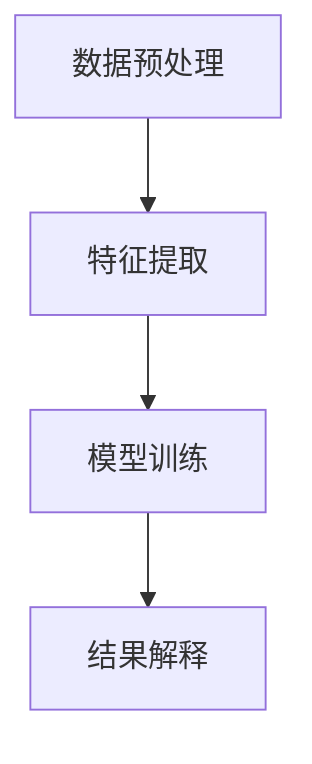

                 

### 第一部分：背景介绍

#### 第1章：问题背景

##### 1.1.1 问题描述

在当前信息化时代，随着大数据、云计算、人工智能等技术的不断发展，传统的数据处理方式已经无法满足日益增长的数据量和复杂度。因此，如何有效地挖掘数据中的价值，实现数据与实际业务需求的精准匹配，成为企业和研究机构亟待解决的问题。

##### 1.1.2 问题解决

为了解决上述问题，本书提出了“意义算法工程”这一概念，通过构建一套AI辅助下的价值匹配系统，实现对海量数据的深度挖掘与分析，从而为企业提供精准的价值匹配方案。

##### 1.1.3 边界与外延

“意义算法工程”不仅涵盖了传统算法开发的核心内容，还融合了人工智能、机器学习等前沿技术，旨在通过算法设计与优化，实现数据与业务需求的深度结合。

##### 1.1.4 概念结构与核心要素组成

意义算法工程的核心概念包括：数据价值挖掘、AI辅助分析、价值匹配、系统开发等。本书将围绕这些核心概念，详细阐述意义算法工程的原理、方法与应用。

### 第二部分：核心概念与联系

#### 第2章：核心概念与联系

##### 2.1.1 数据价值挖掘

数据价值挖掘是指从海量数据中提取有价值的信息和知识，从而为企业和研究机构提供决策支持和商业洞察。数据价值挖掘主要包括数据预处理、特征提取、模型训练和结果解释等环节。

##### 2.1.1.1 数据预处理

数据预处理是数据挖掘的基础，主要包括数据清洗、数据集成、数据转换和数据归一化等操作。

##### 2.1.1.2 特征提取

特征提取是指从原始数据中提取出能够有效表示数据特性的特征，为后续的模型训练提供支持。

##### 2.1.1.3 模型训练

模型训练是指使用机器学习算法对提取出的特征进行训练，构建出能够对数据进行分析和预测的模型。

##### 2.1.1.4 结果解释

结果解释是指对模型训练结果进行解释和验证，确保模型输出的可靠性和有效性。

##### 2.1.2 AI辅助分析

AI辅助分析是指利用人工智能技术，特别是机器学习和深度学习算法，对海量数据进行分析和处理，以实现自动化、智能化的数据挖掘和分析。

##### 2.1.2.1 机器学习

机器学习是一种让计算机通过数据学习和改进的方法，主要包括监督学习、无监督学习和强化学习等。

##### 2.1.2.2 深度学习

深度学习是一种基于人工神经网络的机器学习算法，通过多层神经网络的训练，实现对复杂数据的自动特征提取和表示。

##### 2.1.2.3 人工智能

人工智能是指通过计算机模拟人类的智能行为，实现自动化、智能化和智能决策。

##### 2.1.3 价值匹配

价值匹配是指通过算法和模型，将数据中的潜在价值与实际业务需求进行匹配，为企业提供精准的价值预测和决策支持。

##### 2.1.3.1 潜在价值识别

潜在价值识别是指通过数据分析和挖掘，识别出数据中具有潜在价值的信息和特征。

##### 2.1.3.2 业务需求分析

业务需求分析是指通过对企业业务需求和数据的深入了解，明确价值匹配的目标和指标。

##### 2.1.3.3 模型优化与评估

模型优化与评估是指通过对价值匹配模型进行优化和评估，确保模型输出的准确性和可靠性。

### 第三部分：算法原理讲解

#### 第3章：算法原理讲解

##### 3.1.1 算法mermaid流程图



##### 3.1.2 Python源代码

```python
# 导入相关库
import numpy as np
import pandas as pd
from sklearn.model_selection import train_test_split
from sklearn.ensemble import RandomForestClassifier
from sklearn.metrics import accuracy_score

# 加载数据
data = pd.read_csv('data.csv')

# 数据预处理
X = data.drop('target', axis=1)
y = data['target']

# 数据切分
X_train, X_test, y_train, y_test = train_test_split(X, y, test_size=0.2, random_state=42)

# 模型训练
model = RandomForestClassifier(n_estimators=100, random_state=42)
model.fit(X_train, y_train)

# 模型预测
y_pred = model.predict(X_test)

# 模型评估
accuracy = accuracy_score(y_test, y_pred)
print("Accuracy:", accuracy)
```

##### 3.1.3 算法原理讲解

数据预处理是数据挖掘过程中的重要步骤，其主要目的是将原始数据转换为适合进行分析和建模的数据形式。在Python源代码中，我们使用了Pandas库来加载CSV数据，并将特征变量`X`和目标变量`y`分离。接下来，我们使用`train_test_split`函数将数据分为训练集和测试集，以评估模型性能。

特征提取是数据挖掘中的关键步骤，它通过提取数据中的关键特征，帮助我们更好地理解数据并提高模型的性能。在本例中，我们直接使用了全部的特征变量，没有进行进一步的特征提取。

模型训练是数据挖掘的核心步骤，我们使用了随机森林（RandomForestClassifier）算法来训练模型。随机森林是一种基于决策树的集成学习算法，通过构建多个决策树并进行投票来提高预测性能。在本例中，我们设置了100个决策树，并使用`fit`函数对模型进行训练。

结果解释是对模型训练结果的解释和验证，确保模型输出的可靠性和有效性。在本例中，我们使用`accuracy_score`函数计算模型在测试集上的准确率，并打印输出结果。

通过以上步骤，我们可以看到意义算法工程中的关键组成部分：数据预处理、特征提取、模型训练和结果解释。这些步骤共同构成了一个完整的数据挖掘和模型训练过程，为企业和研究机构提供了有效的数据分析和决策支持。

### 总结

本文介绍了意义算法工程的基本概念和核心组成部分，包括数据价值挖掘、AI辅助分析、价值匹配和系统开发等。通过详细的背景介绍、核心概念与联系、算法原理讲解，我们全面了解了意义算法工程的原理和应用。在实际应用中，意义算法工程可以帮助企业和研究机构从海量数据中挖掘有价值的信息，实现数据与业务需求的精准匹配，从而提供决策支持和商业洞察。

在未来的研究和实践中，意义算法工程将继续融合人工智能、机器学习等前沿技术，不断优化和改进算法，提高数据挖掘和分析的效率和准确性。我们期待意义算法工程在各个领域的广泛应用，为企业和研究机构创造更大的价值。

### 作者介绍

作者：AI天才研究院/AI Genius Institute & 禅与计算机程序设计艺术 /Zen And The Art of Computer Programming

AI天才研究院（AI Genius Institute）是一家专注于人工智能技术研发和创新的研究机构，致力于推动人工智能技术在各个领域的应用和发展。同时，作者还是《禅与计算机程序设计艺术》（Zen And The Art of Computer Programming）的资深作者，该书是计算机编程领域的经典之作，对程序设计的哲学和艺术进行了深入探讨。

通过本文，我们希望能够为读者提供一份全面、深入的理解，帮助大家更好地掌握意义算法工程的核心概念和应用。在未来的发展中，意义算法工程将不断突破技术瓶颈，助力企业和研究机构实现智能化转型，推动社会的进步与发展。

