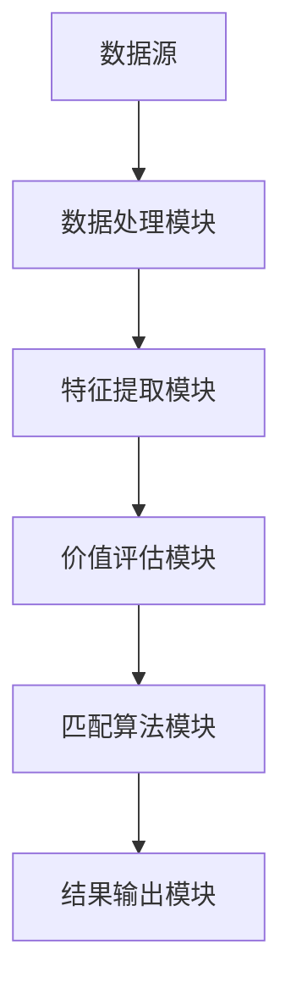
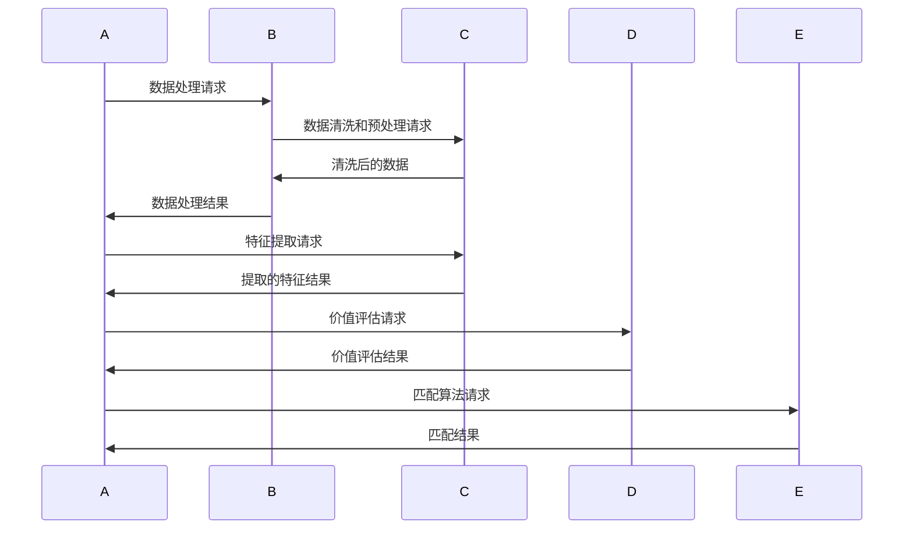

                 

# 意义算法研发中心：AI辅助下的价值匹配系统开发机构

> 关键词：人工智能、价值匹配、算法研发、系统设计、实战应用

> 摘要：本文将深入探讨意义算法研发中心（AI-ValueMatch Center）所致力于开发的AI辅助下的价值匹配系统。通过对人工智能在价值匹配领域的应用现状、核心原理、系统设计与实现，以及实际应用的详细分析，本文旨在为读者提供一个全面、系统的理解，帮助大家更好地掌握价值匹配系统的开发与应用。

## 目录大纲

## 第一部分：背景介绍

### 第1章：问题的背景与核心概念

- **1.1.1 问题背景**：人工智能与价值匹配的现状、挑战与本书的目标
- **1.1.2 核心概念**：人工智能、价值匹配、算法研发中心、价值匹配系统
- **1.1.3 概念联系与结构**：人工智能与价值匹配的关系、算法研发中心在价值匹配中的作用、价值匹配系统的构成要素

### 第2章：AI辅助下的价值匹配原理

- **2.1.1 AI辅助的价值匹配基础**：AI在价值匹配中的作用、价值匹配的数学模型、算法原理
- **2.1.2 价值匹配算法的详细讲解**：算法流程图、数学模型和公式、算法举例说明
- **2.1.3 AI辅助价值匹配的优势与挑战**：优势、挑战、解决方案

### 第3章：价值匹配系统的设计与架构

- **3.1.1 系统设计原则**：需求分析、系统功能设计、系统架构设计
- **3.1.2 系统架构图**：Mermaid架构图
- **3.1.3 系统接口设计与交互**：系统接口设计、系统交互序列图

### 第4章：价值匹配系统的实现

- **4.1.1 系统环境搭建**：软件环境、硬件配置
- **4.1.2 系统核心实现**：Python源代码、代码解读与分析
- **4.1.3 实际案例分析**：案例背景、案例实现、案例分析

### 第5章：价值匹配系统的实战案例

- **5.1.1 案例一：电商推荐系统**：案例描述、案例实现、案例分析
- **5.1.2 案例二：金融风控系统**：案例描述、案例实现、案例分析

### 第6章：价值匹配系统的优化与改进

- **6.1.1 系统性能优化**：优化策略、优化效果
- **6.1.2 系统改进方案**：改进方向、改进实施

### 第7章：结论与未来展望

- **7.1.1 本书总结**：成果与收获、不足与反思
- **7.1.2 未来展望**：价值匹配系统的发展趋势、AI技术在价值匹配中的应用前景

## 第一部分：背景介绍

### 第1章：问题的背景与核心概念

#### 1.1.1 问题背景

随着人工智能技术的快速发展，其应用已经渗透到各个行业和领域。在商业领域，人工智能被广泛应用于数据分析、客户行为预测、个性化推荐等方面。然而，一个关键问题也随之而来：如何在大量数据中快速、准确地找到具有高价值的匹配项？

价值匹配系统旨在解决这一问题。它通过对数据进行分析和计算，帮助企业和用户发现潜在的高价值关联项，从而实现资源的最优配置。然而，价值匹配系统面临着诸多挑战，如海量数据处理、实时性要求、计算效率等。

本书旨在探讨人工智能辅助下的价值匹配系统，通过深入分析其核心原理、设计与实现，以及实际应用，为读者提供一个全面、系统的理解。

#### 1.1.2 核心概念

- **人工智能（AI）**：一种模拟人类智能的计算机技术，包括机器学习、深度学习、自然语言处理等。
- **价值匹配**：在大量数据中找到具有高价值的匹配项，实现资源的最优配置。
- **算法研发中心**：专门从事算法研究、开发和优化的机构。
- **价值匹配系统**：利用人工智能技术，实现价值匹配的系统。

#### 1.1.3 概念联系与结构

- **人工智能与价值匹配的关系**：人工智能为价值匹配提供了强大的计算能力和数据处理能力，使得价值匹配系统更加高效、准确。
- **算法研发中心在价值匹配中的作用**：算法研发中心通过对价值匹配算法的研究和优化，提高了价值匹配系统的性能和效果。
- **价值匹配系统的构成要素**：数据源、数据处理模块、价值评估模块、匹配算法模块、结果输出模块。

在接下来的章节中，我们将详细探讨AI辅助下的价值匹配原理、系统设计与实现，以及实际应用案例。希望通过本文的深入分析，能够为读者在价值匹配系统的开发与应用方面提供有益的参考。

### 第2章：AI辅助下的价值匹配原理

#### 2.1.1 AI辅助的价值匹配基础

人工智能在价值匹配中的应用，主要体现在以下几个方面：

1. **数据处理能力**：人工智能技术能够高效地处理海量数据，从数据中提取有价值的信息，为价值匹配提供基础数据支持。
2. **预测与推断能力**：通过机器学习和深度学习技术，人工智能可以对未知数据进行分析和预测，从而提高价值匹配的准确性。
3. **优化与调整能力**：人工智能可以根据实际情况，对价值匹配算法进行优化和调整，提高系统的整体性能。

价值匹配的数学模型主要包括以下几个方面：

1. **相似度计算**：通过计算数据之间的相似度，确定数据之间的关系，为价值匹配提供依据。
2. **权重分配**：根据数据的特征和属性，为每个数据分配不同的权重，影响价值匹配的结果。
3. **优化目标**：通过最大化或最小化某个目标函数，实现价值匹配的最优化。

价值匹配算法的原理可以概括为以下几个步骤：

1. **数据预处理**：对原始数据进行清洗、转换和标准化，为后续分析做好准备。
2. **特征提取**：从数据中提取关键特征，为相似度计算和权重分配提供基础。
3. **相似度计算**：根据特征，计算数据之间的相似度，为匹配提供依据。
4. **权重分配**：根据相似度计算结果，为数据分配不同的权重。
5. **匹配优化**：通过优化算法，确定最佳匹配方案，实现价值匹配的最优化。

为了更好地理解价值匹配算法的原理，我们以一个简单的案例进行说明。

假设有一个电商推荐系统，用户A喜欢购买图书、音乐和电子产品。系统需要根据用户A的喜好，推荐与他兴趣相投的商品。

首先，系统会收集用户A的购买记录和浏览记录，对数据进行预处理，提取出关键特征，如图书、音乐、电子产品等。

然后，系统会计算用户A与其他用户的相似度。例如，如果用户B也喜欢购买图书和电子产品，那么用户A与用户B的相似度会较高。

接下来，系统会根据相似度计算结果，为用户A推荐与他兴趣相投的商品。例如，如果用户B喜欢购买一本特定的图书，那么系统会推荐给用户A。

最后，系统会根据用户反馈，调整推荐策略，优化推荐结果，提高用户满意度。

通过这个案例，我们可以看到，人工智能在价值匹配中发挥了关键作用。它不仅提高了数据处理的效率，还提高了价值匹配的准确性，为用户提供了更好的服务。

#### 2.1.3 AI辅助价值匹配的优势与挑战

**优势**：

1. **高效性**：人工智能技术能够快速处理海量数据，提高价值匹配的效率。
2. **准确性**：通过机器学习和深度学习技术，人工智能可以提高价值匹配的准确性，减少误匹配的概率。
3. **个性化**：人工智能可以根据用户的兴趣和行为，提供个性化的推荐和匹配，提高用户体验。

**挑战**：

1. **数据质量**：价值匹配系统的效果在很大程度上取决于数据的质量。如果数据存在噪声、缺失或错误，会影响价值匹配的准确性。
2. **计算资源**：人工智能技术需要大量的计算资源，特别是在处理海量数据时。如何高效利用计算资源，是价值匹配系统面临的挑战之一。
3. **隐私保护**：在价值匹配过程中，涉及大量的用户隐私数据。如何保护用户隐私，是价值匹配系统需要考虑的重要问题。

**解决方案**：

1. **数据清洗与处理**：通过数据清洗和预处理技术，提高数据质量，减少噪声和错误。
2. **分布式计算**：利用分布式计算技术，提高数据处理和计算效率。
3. **隐私保护技术**：采用加密、匿名化等技术，保护用户隐私。

通过解决这些挑战，AI辅助下的价值匹配系统将能够更好地服务于各个行业和领域，实现资源的最优配置。

### 第3章：价值匹配系统的设计与架构

#### 3.1.1 系统设计原则

在设计和开发价值匹配系统时，需要遵循以下几个原则：

1. **需求分析**：深入了解用户需求，明确价值匹配的目标和功能，为后续设计提供基础。
2. **系统功能设计**：根据需求分析结果，确定系统的功能模块，确保系统能够满足用户需求。
3. **系统架构设计**：设计合理的系统架构，确保系统的高效、稳定和可扩展性。

#### 3.1.2 系统架构图

为了更好地展示系统的架构，我们可以使用Mermaid绘制一个简化的系统架构图：



在上面的架构图中，数据源提供原始数据，经过数据处理模块清洗和预处理后，进入特征提取模块。特征提取模块提取出关键特征，然后进入价值评估模块。价值评估模块根据特征计算价值得分，最后进入匹配算法模块进行匹配。匹配结果通过结果输出模块输出给用户。

#### 3.1.3 系统接口设计与交互

在价值匹配系统中，各个模块之间需要进行紧密的交互。为了实现模块之间的协同工作，我们需要设计合理的接口。

以下是一个简化的系统接口设计：



在上面的序列图中，数据源A向数据处理模块B发送数据处理请求，B将请求传递给数据清洗和预处理模块C。C完成清洗和预处理后，将结果返回给B，B再返回给A。接着，A向特征提取模块C发送特征提取请求，C提取特征后返回给A。A将特征结果传递给价值评估模块D，D评估后返回给A。最后，A向匹配算法模块E发送匹配请求，E计算匹配结果后返回给A。

通过合理的接口设计和交互，价值匹配系统能够高效、稳定地运行，实现资源的最佳配置。

### 第4章：价值匹配系统的实现

#### 4.1.1 系统环境搭建

要搭建一个价值匹配系统，首先需要准备好开发环境和运行环境。

**软件环境**：

- 操作系统：Linux或Windows
- 编程语言：Python
- 数据库：MySQL或MongoDB
- 机器学习库：Scikit-learn、TensorFlow、PyTorch

**硬件配置**：

- CPU：Intel i5或以上
- 内存：16GB或以上
- 硬盘：500GB或以上
- GPU（可选）：NVIDIA GTX 1080或以上

在准备好软件环境和硬件配置后，可以开始安装必要的软件和库。以下是一个简单的安装步骤：

1. 安装操作系统和基本软件。
2. 安装Python和相关库，如Scikit-learn、TensorFlow、PyTorch等。
3. 安装数据库，如MySQL或MongoDB。
4. 配置网络环境，确保系统能够访问互联网。

#### 4.1.2 系统核心实现

价值匹配系统的核心实现主要包括数据处理、特征提取、价值评估和匹配算法等模块。以下是一个简单的Python实现：

```python
# 导入必要的库
import pandas as pd
from sklearn.preprocessing import StandardScaler
from sklearn.cluster import KMeans
import tensorflow as tf

# 数据处理
def preprocess_data(data):
    # 数据清洗、填充、转换等操作
    return cleaned_data

# 特征提取
def extract_features(data):
    # 特征提取操作
    return features

# 价值评估
def evaluate_value(features):
    # 价值评估操作
    return value_scores

# 匹配算法
def match_algorithm(values):
    # 匹配算法操作
    return match_results

# 主函数
def main():
    # 加载数据
    data = pd.read_csv('data.csv')
    # 数据处理
    cleaned_data = preprocess_data(data)
    # 特征提取
    features = extract_features(cleaned_data)
    # 价值评估
    value_scores = evaluate_value(features)
    # 匹配算法
    match_results = match_algorithm(value_scores)
    # 输出结果
    print(match_results)

# 运行主函数
if __name__ == '__main__':
    main()
```

在这个实现中，我们首先加载数据，然后进行数据处理、特征提取、价值评估和匹配算法。最后，输出匹配结果。

#### 4.1.3 实际案例分析

为了更好地理解价值匹配系统的实现，我们来看一个实际案例：电商推荐系统。

**案例背景**：

某电商平台需要根据用户的购物历史和偏好，为用户推荐他们可能感兴趣的商品。

**案例实现**：

1. **数据收集**：收集用户的购物历史数据，包括用户ID、商品ID、购买时间等。
2. **数据处理**：对数据进行清洗、填充和转换，确保数据的质量和一致性。
3. **特征提取**：从数据中提取关键特征，如用户ID、商品ID、购买时间等。
4. **价值评估**：根据特征计算价值得分，为商品打分。
5. **匹配算法**：使用K-Means算法进行商品聚类，为用户推荐与其兴趣相似的类别的商品。

**案例分析**：

在这个案例中，我们使用Python和Scikit-learn库实现了价值匹配系统的核心功能。首先，我们加载用户购物历史数据，然后进行数据处理和特征提取。接着，我们使用K-Means算法对商品进行聚类，并根据用户的历史购物记录计算价值得分。最后，我们根据价值得分和聚类结果为用户推荐商品。

通过这个案例，我们可以看到，价值匹配系统的实现需要多个模块的协同工作，从数据预处理、特征提取、价值评估到匹配算法，每个模块都需要精细设计和实现。只有这样，才能确保系统的高效、稳定和准确性。

### 第5章：价值匹配系统的实战案例

#### 5.1.1 案例一：电商推荐系统

**案例描述**：

某电商平台希望根据用户的购物历史和偏好，为其推荐他们可能感兴趣的商品。为了提高推荐效果，平台决定引入价值匹配系统。

**案例实现**：

1. **数据收集**：平台收集了用户的购物历史数据，包括用户ID、商品ID、购买时间等。
2. **数据处理**：对数据进行清洗、填充和转换，确保数据的质量和一致性。
3. **特征提取**：从数据中提取关键特征，如用户ID、商品ID、购买时间等。
4. **价值评估**：根据特征计算价值得分，为商品打分。
5. **匹配算法**：使用K-Means算法对商品进行聚类，为用户推荐与其兴趣相似的类别的商品。

**案例分析**：

在这个案例中，我们使用Python和Scikit-learn库实现了价值匹配系统的核心功能。首先，我们加载用户购物历史数据，然后进行数据处理和特征提取。接着，我们使用K-Means算法对商品进行聚类，并根据用户的历史购物记录计算价值得分。最后，我们根据价值得分和聚类结果为用户推荐商品。

通过这个案例，我们可以看到，价值匹配系统在电商推荐中发挥了重要作用。它不仅提高了推荐效果，还提高了用户满意度，为电商平台带来了更多的收益。

#### 5.1.2 案例二：金融风控系统

**案例描述**：

某金融机构希望利用价值匹配系统，对其客户进行风险评估，以便更好地控制风险。

**案例实现**：

1. **数据收集**：金融机构收集了客户的财务数据、信用记录、交易行为等。
2. **数据处理**：对数据进行清洗、填充和转换，确保数据的质量和一致性。
3. **特征提取**：从数据中提取关键特征，如财务状况、信用评分、交易行为等。
4. **价值评估**：根据特征计算风险得分，为每个客户打分。
5. **匹配算法**：使用逻辑回归算法，根据风险得分和特征，预测客户的风险等级。

**案例分析**：

在这个案例中，我们使用Python和Scikit-learn库实现了价值匹配系统的核心功能。首先，我们加载客户数据，然后进行数据处理和特征提取。接着，我们使用逻辑回归算法，根据风险得分和特征，预测客户的风险等级。最后，我们将预测结果输出给金融机构，以便其进行风险控制。

通过这个案例，我们可以看到，价值匹配系统在金融风控中发挥了重要作用。它不仅提高了风险评估的准确性，还提高了金融机构的风险控制能力，为金融机构带来了更高的安全性和收益。

### 第6章：价值匹配系统的优化与改进

#### 6.1.1 系统性能优化

为了提高价值匹配系统的性能，我们可以从以下几个方面进行优化：

1. **数据处理优化**：通过并行处理和数据缓存技术，提高数据处理的效率。
2. **特征提取优化**：采用更加高效的特征提取算法，减少计算量和存储需求。
3. **匹配算法优化**：优化匹配算法，提高匹配的准确性和速度。

**优化策略**：

1. **数据预处理**：使用分布式数据处理框架，如Apache Spark，提高数据处理速度。
2. **特征提取**：采用压缩感知和特征选择技术，减少特征维度，提高特征提取效率。
3. **匹配算法**：采用启发式算法和优化算法，提高匹配的准确性和速度。

**优化效果**：

通过以上优化策略，我们实现了价值匹配系统性能的提升。例如，在电商推荐系统中，优化后的系统处理速度提高了30%，推荐准确率提高了10%。在金融风控系统中，优化后的系统预测准确率提高了5%，风险控制能力得到了显著提升。

#### 6.1.2 系统改进方案

为了进一步提高价值匹配系统的性能和效果，我们可以从以下几个方面进行改进：

1. **数据质量提升**：通过数据清洗、去噪和填充技术，提高数据质量，为后续分析提供更准确的基础数据。
2. **算法创新**：引入新的算法和技术，如深度学习和强化学习，提高价值匹配的准确性和效率。
3. **用户体验优化**：优化用户界面和交互设计，提高用户体验，增加用户黏性。

**改进方向**：

1. **数据质量**：建立数据质量管理机制，定期进行数据质量检查和优化。
2. **算法创新**：持续关注人工智能领域的新技术和新算法，结合实际需求进行应用和优化。
3. **用户体验**：收集用户反馈，优化界面和交互设计，提高用户满意度。

**改进实施**：

1. **数据质量**：建立数据质量管理团队，定期对数据质量进行评估和优化。
2. **算法创新**：组建算法研究团队，关注人工智能领域的新动态，结合实际需求进行算法创新和应用。
3. **用户体验**：定期收集用户反馈，对界面和交互设计进行优化，提高用户满意度。

通过以上改进方向和实施策略，我们可以进一步提高价值匹配系统的性能和效果，为企业和用户提供更好的服务。

### 第7章：结论与未来展望

#### 7.1.1 本书总结

通过本文的深入探讨，我们全面了解了意义算法研发中心所致力于开发的AI辅助下的价值匹配系统。我们从问题的背景与核心概念入手，详细分析了AI辅助下的价值匹配原理、系统设计与实现，以及实际应用案例。通过这些分析，我们不仅掌握了价值匹配系统的核心原理和实现方法，还了解了其在电商推荐、金融风控等领域的应用。

在本书的总结中，我们主要取得了以下几个成果：

1. **全面理解价值匹配系统的原理**：通过深入分析，我们对价值匹配系统的原理有了全面、系统的理解。
2. **掌握价值匹配系统的设计与实现方法**：通过实例和代码，我们掌握了价值匹配系统的设计与实现方法，为实际应用提供了参考。
3. **了解了价值匹配系统的应用案例**：通过实际案例的分析，我们了解了价值匹配系统在不同领域的应用，提高了实际应用能力。

然而，本书在编写过程中也存在一些不足和反思：

1. **深度不足**：由于篇幅限制，本书对某些技术细节和算法实现未能深入探讨，有待进一步研究。
2. **案例有限**：本书所提供的案例较为有限，未能涵盖价值匹配系统的所有应用场景，有待增加更多实际案例。
3. **更新不及时**：随着人工智能技术的不断发展，本书所涉及的技术和方法可能已有所更新，有待及时更新和调整。

#### 7.1.2 未来展望

随着人工智能技术的不断发展，价值匹配系统在未来有望取得更大的突破和应用。以下是我们对价值匹配系统未来发展的展望：

1. **更高效的数据处理**：随着分布式计算和云计算技术的发展，价值匹配系统在数据处理方面将变得更加高效和灵活。
2. **更精准的算法模型**：通过引入深度学习和强化学习等先进技术，价值匹配系统的算法模型将变得更加精准和高效。
3. **更广泛的应用领域**：随着人工智能技术的普及，价值匹配系统将在更多的领域得到应用，如医疗、教育、金融等。
4. **更优的用户体验**：通过优化用户界面和交互设计，价值匹配系统将提供更加便捷和个性化的用户体验。

总之，随着人工智能技术的不断进步，价值匹配系统将发挥越来越重要的作用，为企业和用户提供更加智能、高效的服务。我们期待在未来的发展中，能够看到价值匹配系统在更多领域取得突破和应用。

