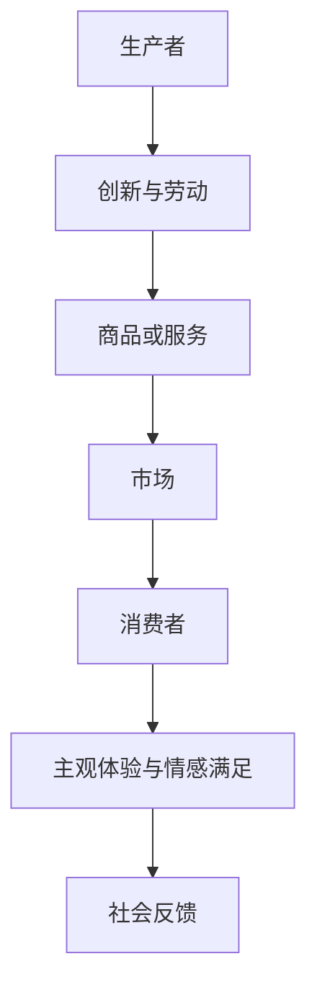

                 

### 前言与引言

#### 意义经济学的时代背景

随着全球经济的发展，传统经济学理论在很多方面已经无法满足社会的需求。尤其是在信息时代和数字经济崛起的背景下，传统的价值衡量方式显得愈发滞后。资源的稀缺性、市场的不确定性、技术进步的迅猛发展，都使得经济学面临新的挑战。在这个背景下，意义经济学应运而生，它不仅关注资源的分配和价值的创造，更强调人的情感、精神和价值观在社会经济活动中的重要性。

意义经济学是一种新的经济学范式，它试图重新定义价值，将意义纳入经济学的核心范畴。意义不仅仅是一种主观感受，它深刻地影响着人们的决策行为、市场运作和经济增长。在传统经济学中，价值通常被定义为商品或服务的交换比例，而意义经济学则认为，价值是商品或服务所赋予人们的精神满足和情感体验。这种观点不仅有助于解释某些经济现象，还为新的经济模式提供了理论依据。

#### 为什么要研究意义经济学

意义经济学的重要性不容忽视。首先，它能够为我们提供更全面的价值衡量标准。在传统经济学中，价值往往仅通过价格或成本来衡量，这忽略了消费者的主观体验和情感需求。意义经济学则通过将意义纳入衡量体系，使我们能够更准确地评估商品或服务的价值。例如，对于一些公益项目或文化产品，传统的经济效益指标可能无法准确反映其社会价值，而意义经济学则能更好地揭示这些项目的真正意义。

其次，意义经济学有助于解决传统经济学中的诸多困境。例如，随着技术的发展，许多传统行业的就业机会减少，导致失业率上升。意义经济学提供了新的思路，通过创造新的意义和需求，帮助劳动者转型，从而缓解失业问题。此外，意义经济学还能够促进社会的可持续发展，强调在经济增长的同时，要注重环境保护和社会公平。

最后，意义经济学对于企业的发展和战略规划也具有重要意义。在竞争激烈的市场环境中，企业不仅需要追求经济效益，还要关注消费者的情感需求和社会责任。通过理解和运用意义经济学，企业可以更好地定位市场，提升品牌价值，建立长期的竞争优势。

#### 读者群体与期望收获

本书旨在为广大经济学者、企业管理者、政策制定者以及对经济学和心理学有兴趣的读者提供一本全面、系统的意义经济学指南。无论您是专业人士还是普通读者，只要对经济学和人类社会的发展有兴趣，这本书都将成为您宝贵的资源。

通过阅读本书，您将：

1. 理解意义经济学的核心概念和基本原理。
2. 掌握意义经济学在社会经济活动中的应用方法和技巧。
3. 分析和解决现实中的经济问题，提升决策能力。
4. 获得对未来经济发展的新视角和洞见。

我们相信，意义经济学不仅是一种新的理论范式，更是一种推动社会进步的力量。通过本书的阅读，您将能够重新思考价值、意义和经济的关系，为构建更加美好、有意义的社会贡献力量。

---

本文将以“意义经济学：重新定义价值的社会实验”为主题，深入探讨这一新兴领域的理论基础、应用方法以及社会实验的重要性。接下来，我们将首先介绍意义经济学的基本概念，随后逐步展开对核心理论、案例分析、方法论和实践应用的详细论述，最终展望意义经济学的未来趋势和社会影响。希望通过本文，能够为读者提供一个清晰、系统的意义经济学视角，激发您对这一领域的兴趣和思考。

## 第1章：问题背景与引言

### 1.1 问题背景

意义经济学作为一个新兴的研究领域，其背景源于对传统经济学局限性的反思和挑战。传统经济学建立在理性人假设、市场有效性和资源稀缺等基础概念之上，然而，在21世纪的全球化背景下，这些假设逐渐暴露出诸多不足。首先，理性人假设过于理想化，忽略了人类行为的情感和非理性因素。其次，市场并非总是有效，信息不对称、外部效应等问题导致市场失灵。最后，资源的稀缺性虽然在一定程度上得到缓解，但环境问题和贫富差距却日益严重。

#### 意义的缺失与社会的反思

随着经济的发展，社会逐渐开始关注到意义在经济活动中的重要性。意义不仅仅是满足基本需求，更是人们追求精神满足和价值实现的重要动力。然而，在传统经济学中，意义往往被忽视或简化为一种附属品。这种忽视导致了以下几个问题：

1. **经济活动缺乏目标感**：当经济活动仅仅追求利润最大化，而忽略了对社会和个人的意义时，会导致人们的工作和生活失去方向，产生倦怠感。

2. **消费行为缺乏深层次驱动**：消费者的购买决策往往基于价格、品牌等因素，而缺乏对产品或服务的深层次理解。这种浅层次的消费行为难以形成长期的品牌忠诚度和社会影响力。

3. **社会发展不平衡**：传统的经济增长模式往往注重短期利益，忽视了对长期社会价值和可持续发展的关注。这导致了资源浪费、环境破坏和社会不公平等问题。

#### 意义的界定与价值的关系

在意义经济学中，意义被定义为人们从经济活动中获得的主观体验和情感满足。与传统的价值概念相比，意义更加注重个体主观感受和社会的整体福祉。价值通常是通过市场交易和货币衡量来定义的，而意义则更强调情感和精神层面的满足。这两者之间的关系可以概括为：

- **价值是手段，意义是目的**：经济活动中的价值创造是手段，而意义的实现是目的。例如，生产一件产品可能带来经济收益，但如果这件产品无法满足消费者的情感需求，那么其意义就大打折扣。

- **价值可以量化，意义难以衡量**：传统的经济学工具如成本-收益分析、市场需求预测等可以量化价值，但意义则更多地依赖于个体主观体验，难以进行量化。

- **价值与意义的互动**：在现实经济活动中，价值和意义是相互依存的。例如，一个企业的成功不仅取决于其财务表现，还取决于其品牌价值和社会影响力。这种品牌价值和社会影响力就是企业经济活动的意义体现。

#### 传统经济学的困境

传统经济学在面对现代社会问题时显得力不从心，主要表现在以下几个方面：

1. **忽视人类情感和非理性因素**：传统经济学假设人类是理性的经济人，但现实中，人类行为受到情感、心理和社会因素的影响，这些因素在传统经济学中被忽略。

2. **市场失灵**：在信息不对称、外部效应等市场缺陷面前，传统经济学难以提供有效的解决方案。

3. **忽视社会公平和可持续发展**：传统经济学关注短期经济效益，而忽视了对长期社会价值和可持续发展的关注。

#### 意义经济学的兴起

意义经济学正是为了解决传统经济学中的这些困境而诞生的。它试图将意义纳入经济活动的核心范畴，强调人类情感、精神和社会价值在经济决策中的重要性。意义经济学认为，经济活动的目的不仅仅是追求利润最大化，更重要的是实现个体和社会的意义满足。这种观点不仅有助于解释某些经济现象，还为新的经济模式提供了理论依据。

### 1.2 引言

#### 书籍的目的

本书旨在为读者提供一部全面、系统的意义经济学指南，深入探讨意义经济学的理论背景、核心概念、应用方法和社会实验。通过本书，读者将：

1. **理解意义经济学的基本原理**：包括意义的定义、意义与价值的关系以及意义经济学的特点。
2. **掌握意义经济学在社会经济活动中的应用**：通过具体案例，展示意义经济学如何应用于教育、社区经济和企业战略等领域。
3. **探索意义经济学的方法论和实践**：介绍意义经济学的研究方法和实践步骤，帮助读者在实际中运用意义经济学原理。
4. **展望意义经济学的未来**：分析意义经济学的发展趋势和社会影响，探讨其在未来可能发挥的作用。

#### 读者群体与期望收获

本书适合以下读者群体：

1. **经济学者**：希望了解和探讨新兴经济学领域，特别是意义经济学理论的学者。
2. **企业管理者**：希望提升企业战略和社会责任，关注品牌价值和社会影响力的企业领导者。
3. **政策制定者**：关注社会公平和可持续发展，希望制定更有效经济政策的政策制定者。
4. **普通读者**：对经济学和心理学有兴趣，希望了解人类行为和社会发展的人。

通过阅读本书，读者可以期望获得以下收获：

1. **新的理论视角**：理解意义经济学的基本原理和独特视角，为经济学研究提供新的思路。
2. **实际应用能力**：掌握意义经济学在社会经济活动中的应用方法，提升决策能力和管理效果。
3. **社会洞察力**：通过分析现实案例，增强对社会经济现象的理解和洞察力。
4. **创新思维**：激发创新思维，探索如何在经济活动中实现个体和社会的意义满足。

### 1.3 本章小结

本章主要介绍了意义经济学产生的问题背景和引言。通过分析传统经济学在现代社会中的局限性，我们认识到意义在经济活动中的重要性。意义经济学试图重新定义价值，将意义纳入经济学的核心范畴，以解决传统经济学的困境。本书的目的在于为读者提供一部全面、系统的意义经济学指南，帮助读者理解意义经济学的基本原理、应用方法和未来趋势。通过阅读本章，读者可以初步认识到意义经济学的重要性和其在现实社会中的潜在价值。

## 第二部分：意义经济学的核心概念

### 第2章：意义经济学的概念框架

意义经济学作为一种新兴的经济学理论，其核心概念和框架为我们提供了理解经济活动中意义如何被创造、传递和测量的全新视角。本章将详细介绍意义经济学的核心概念，包括意义的界定、价值与意义的互动关系以及意义经济学在社会中的独特地位。

### 2.1 核心概念

#### 意义的界定

意义是一个广泛而深刻的概念，涵盖了人类从经济活动中获得的主观体验和情感满足。在意义经济学中，意义不仅仅是一种心理感受，更是一种内在的价值导向。它涉及到以下几个方面：

1. **主观体验**：意义来源于个体对经济活动的感受和认知。例如，一份工作可能给个体带来经济收入，但如果个体对工作内容缺乏兴趣或认同，那么这份工作的意义就大打折扣。

2. **情感满足**：意义与情感紧密相关。在经济活动中，情感满足是人们追求的重要目标之一。例如，消费者在购买某产品时，不仅考虑其实用性和价格，还会考虑其是否符合自己的情感需求和价值观。

3. **精神满足**：意义不仅仅是物质的，更包括精神层面的满足。例如，参与公益项目或文化活动，可能无法直接带来经济收益，但能够提供精神上的满足和成就感。

#### 价值与意义的关系

价值与意义是意义经济学中的两个核心概念，它们之间存在紧密的互动关系：

1. **价值是手段，意义是目的**：在经济活动中，价值是通过市场交易和成本-收益分析来衡量的，而意义则是通过个体主观体验和社会价值来评估的。例如，一件商品可能具有很高的市场价值，但如果消费者对其缺乏兴趣，那么它的意义就相对较低。

2. **价值可以量化，意义难以衡量**：价值可以通过货币、成本和利润等指标进行量化，而意义则更多地依赖于个体主观体验，难以进行精确衡量。尽管如此，意义在经济决策中的重要性不可忽视。

3. **价值与意义的互动**：在实际经济活动中，价值和意义是相互依存的。例如，一个企业的成功不仅取决于其市场价值，还取决于其品牌价值和社会影响力。这种品牌价值和社会影响力就是企业经济活动的意义体现。

#### 意义经济学在社会中的独特地位

意义经济学在社会经济中占据独特地位，主要体现在以下几个方面：

1. **补充传统经济学**：意义经济学并不是要取代传统经济学，而是为其提供补充和扩展。传统经济学关注资源的分配和价值的创造，而意义经济学则关注这些活动背后的意义和情感满足。

2. **强调个体和社会价值**：意义经济学强调个体和社会的价值，认为经济活动的最终目标不仅仅是追求经济效益，更是实现个体和社会的意义满足。这种观点有助于解决传统经济学中忽视人类情感和非理性因素的问题。

3. **推动社会公平和可持续发展**：意义经济学关注社会公平和可持续发展，认为经济增长应当与社会价值相结合。通过创造和传递意义，经济活动可以更加公平和可持续，从而推动社会的整体进步。

### 2.2 意义经济学的特点

意义经济学具有以下几个显著特点：

1. **综合性**：意义经济学不仅涵盖经济学的基本原理，还涉及心理学、社会学和哲学等多个领域。这种综合性使其能够从多角度分析经济活动中的意义问题。

2. **主观性**：意义经济学强调个体主观体验和情感满足的重要性。与传统的客观衡量标准不同，意义经济学认为意义是主观的，取决于个体的心理和价值观。

3. **互动性**：意义经济学关注价值与意义的互动关系，认为经济活动中的价值创造和传递过程是动态的，需要考虑个体和社会的互动。

4. **社会性**：意义经济学强调个体和社会的价值，认为经济活动应当与社会目标相结合。这种社会性使得意义经济学能够更好地解决传统经济学中的市场失灵和社会不公平问题。

### 2.3 意义经济学在社会中的意义

意义经济学在社会中的意义主要体现在以下几个方面：

1. **解决经济困境**：意义经济学为传统经济学提供了一种新的解释框架，有助于解决市场失灵、资源浪费和社会不公平等问题。

2. **促进社会进步**：通过关注个体和社会的意义满足，意义经济学有助于推动社会的可持续发展，实现经济与社会的双重进步。

3. **提升决策能力**：意义经济学提供了一种新的决策框架，使个体和企业能够更全面地考虑经济活动中的意义因素，从而做出更明智的决策。

4. **丰富经济学理论**：意义经济学为经济学研究提供了新的视角和方法，丰富了经济学理论的内涵和外延。

### 2.4 本章小结

本章介绍了意义经济学的核心概念和框架，包括意义的界定、价值与意义的互动关系以及意义经济学在社会中的独特地位。意义经济学强调个体和社会的意义满足，为传统经济学提供了补充和扩展。通过理解意义经济学的核心概念和特点，读者可以更好地把握其在现实社会中的意义和作用。在接下来的章节中，我们将进一步探讨意义经济学的基本原理和应用方法。

### 第3章：意义经济学的基本原理

意义经济学作为一种新兴的经济学理论，其基本原理涵盖了意义的创造、传递和测量等多个方面。本章将详细探讨意义经济学的基本原理，包括意义的创造与价值传递、意义经济学的运作机制以及在实际社会中的挑战和前景。

#### 3.1 原理介绍

意义经济学的核心在于理解意义的创造与传递过程。意义并不是一成不变的，而是通过一系列经济活动不断被创造和传递的。具体来说，意义经济学的基本原理包括以下几个方面：

1. **意义的创造**：意义是在人类经济活动过程中被创造的。无论是生产、消费还是交换，每个环节都蕴含着意义的创造。例如，一件艺术品的创作过程中，艺术家通过技艺和情感赋予作品独特的意义。

2. **价值的传递**：意义经济学强调价值与意义的互动关系。价值通常通过市场交易来传递，而意义则通过个体主观体验和情感满足来传递。例如，消费者在购买一件商品时，不仅考虑其市场价格，还会考虑其能否带来情感满足。

3. **意义的测量**：意义经济学认为，意义难以用传统经济指标直接测量，但可以通过个体体验和社会反馈来间接测量。例如，通过问卷调查、行为分析等方式，了解消费者对某一产品的意义评价。

#### 意义创造的经济学模型

为了更好地理解意义的创造过程，我们可以构建一个简单的经济学模型。在这个模型中，意义是由生产者、消费者和中间环节共同创造的。以下是一个基本的模型框架：

1. **生产者**：生产者通过创新和劳动，将原材料和资源转化为商品或服务。在这个过程中，生产者不仅创造物质价值，还创造意义。例如，一个艺术家通过创作一幅画作，赋予了作品独特的情感和文化价值。

2. **消费者**：消费者在购买和使用商品或服务时，体验到意义。消费者的主观体验和情感满足是意义的重要组成部分。例如，消费者购买一件奢侈品，不仅为了其实用价值，还为了其带来的身份认同和满足感。

3. **市场**：市场是意义传递的重要渠道。通过市场交易，生产者和消费者之间的意义交换得以实现。市场价格的波动反映了消费者对商品或服务意义的评价。

#### 意义的传递机制

意义的传递机制涉及生产、消费和市场等多个环节。以下是一个简化的意义传递模型：

1. **生产环节**：生产者通过创新和技术进步，提高商品或服务的质量和意义。例如，一家科技公司通过研发新技术，生产出更环保、更智能的产品，从而提升了产品的社会价值。

2. **消费环节**：消费者在购买和使用商品或服务时，体验到意义。消费者的主观体验和情感满足决定了他们对商品或服务的评价。例如，消费者购买一本畅销书，不仅为了获取知识，还为了享受阅读带来的愉悦。

3. **市场环节**：市场是意义传递的重要平台。通过市场交易，生产者和消费者之间的意义交换得以实现。市场价格的波动反映了消费者对商品或服务意义的评价。例如，当消费者对某件商品需求增加时，其市场价格也会上升，表明该商品的意义价值增加。

#### 意义经济学的运作机制

意义经济学的运作机制可以概括为以下几个方面：

1. **价值与意义的互动**：意义经济学强调价值与意义的互动关系。生产者和消费者在创造和传递价值的同时，也创造和传递意义。例如，企业通过创新和技术进步，不仅提升产品的市场价值，还提升产品的社会意义。

2. **社会反馈机制**：意义经济学认为，社会反馈对于意义创造和传递至关重要。消费者通过反馈，表达对商品或服务意义的评价，生产者则根据反馈调整生产策略，从而实现意义的优化传递。

3. **政策干预**：政府在意义经济学中扮演着重要角色。通过制定相关政策，政府可以促进意义经济的健康发展，例如，通过补贴环保产品，提高消费者的环保意识，从而推动社会的可持续发展。

#### 意义经济学的挑战与前景

意义经济学虽然具有巨大的潜力，但在实际应用中仍面临一系列挑战：

1. **测量难题**：意义难以用传统经济指标直接测量，这是意义经济学面临的一个主要难题。如何科学、准确地测量意义，是意义经济学研究的一个重要方向。

2. **社会接受度**：意义经济学作为一种新兴理论，其社会接受度仍需提高。如何让公众和企业理解并接受意义经济学，是意义经济学推广过程中需要解决的问题。

3. **政策制定**：政府在意义经济学中的角色和职责需要明确。如何制定有效政策，促进意义经济的健康发展，是政策制定者面临的一个重要挑战。

尽管如此，意义经济学仍具有广阔的前景：

1. **解决经济困境**：意义经济学为解决传统经济学中的市场失灵、资源浪费和社会不公平等问题提供了新的思路。

2. **促进社会进步**：通过关注个体和社会的意义满足，意义经济学有助于推动社会的可持续发展，实现经济与社会的双重进步。

3. **丰富经济学理论**：意义经济学为经济学研究提供了新的视角和方法，丰富了经济学理论的内涵和外延。

### 3.2 意义经济学的基本原理图解

为了更好地理解意义经济学的基本原理，我们可以使用Mermaid流程图来展示其运作机制。以下是一个简化的意义经济学运作机制流程图：

在这个流程图中，生产者通过创新和劳动创造商品或服务，消费者在市场中购买并使用这些商品或服务，体验到主观体验和情感满足。这些体验和满足通过社会反馈机制传递给生产者，从而影响生产者的决策和商品或服务的创造过程。

### 3.3 意义经济学在实际社会中的应用

意义经济学在实际社会中的应用案例丰富多样，以下是一些典型的应用场景：

1. **教育行业**：在教育行业中，意义经济学强调教育的不仅仅是知识的传授，更是学生情感和价值观的培养。通过引入意义经济学，学校可以设计出更加符合学生需求的教育模式，提高教育的意义和价值。

2. **企业文化**：在企业中，意义经济学强调企业文化的重要性。一个具有深刻意义的企业文化能够激发员工的积极性和创造力，提升企业的整体竞争力。企业可以通过各种方式传递和创造意义，例如通过社会责任项目、员工培训和团队建设等。

3. **社区经济**：在社区经济中，意义经济学关注社区成员之间的互动和合作。通过创造和传递意义，社区经济可以增强社区的凝聚力和可持续发展能力。例如，通过举办社区活动、支持本地企业等方式，促进社区经济与社会的协调发展。

4. **公共服务**：在公共服务领域，意义经济学强调服务的质量和社会价值。通过优化服务流程和提升服务体验，公共服务部门可以更好地满足公众的需求，提高公共服务的社会意义。

### 3.4 本章小结

本章详细介绍了意义经济学的基本原理，包括意义的创造与价值传递、意义经济学的运作机制以及在实际社会中的应用。通过理解这些基本原理，读者可以更好地把握意义经济学在现实社会中的重要作用。意义经济学不仅为传统经济学提供了补充和扩展，还为我们提供了重新思考经济活动的新视角。在接下来的章节中，我们将进一步探讨意义经济学的具体应用方法和实践案例。

## 第三部分：意义经济学的案例分析

### 第4章：意义经济学的实践应用

意义经济学作为一种新兴的理论框架，其在现实社会中的实践应用案例丰富多样，涵盖了教育、企业、社区等多个领域。本章将通过具体案例，展示意义经济学在现实社会中的实践效果，并深入分析其成功经验和启示。

### 4.1 案例一：教育行业的变革

#### 案例背景

随着全球教育资源的日益紧张和教育质量的普遍下降，教育行业的变革成为社会关注的焦点。传统的教育模式往往过于强调知识传授，忽视了学生个体的发展和情感需求。在这种背景下，一些教育机构开始引入意义经济学理论，探索更具意义和价值的的教育模式。

#### 实施过程与成果

1. **课程设计**：教育机构重新设计了课程体系，强调知识传授与个体发展的结合。通过引入跨学科项目和实践活动，学生能够在学习过程中体验到更多的意义和满足。

2. **教师培训**：教师接受意义经济学理论培训，提升了对教育意义的认识和理解。教师在教学过程中注重激发学生的兴趣和潜能，帮助学生建立正确的价值观。

3. **学生反馈**：通过定期问卷调查和座谈会，了解学生对教育模式的满意度和反馈。数据显示，学生的自主学习能力和情感满足度显著提高，学业成绩也有所提升。

4. **社区参与**：教育机构积极与社区合作，开展各种公益活动，提升社区的教育意识和文化素养。这种合作不仅增强了教育的意义，也为学生提供了更多实践机会。

#### 案例启示

1. **意义与价值的结合**：教育不仅仅是知识传授，更是个体发展的过程。通过引入意义经济学，教育机构能够更好地满足学生的情感需求，提升教育的整体价值。

2. **教师角色的转变**：意义经济学强调教师不仅是知识的传递者，更是学生发展的引导者。教师的角色应从传统教学模式中的主导者转变为支持者和合作者。

3. **社区合作的重要性**：教育不仅仅是学校的责任，社区也应当积极参与。通过社区合作，教育机构能够更好地实现教育的意义，提升社会的整体教育水平。

### 4.2 案例二：企业文化的重塑

#### 案例背景

在激烈的市场竞争中，企业文化成为企业核心竞争力的重要组成部分。然而，传统的企业文化往往过于注重物质激励，忽视了员工的精神需求和价值观。在这种背景下，一些企业开始尝试引入意义经济学理论，重塑企业文化，提升员工的满意度和忠诚度。

#### 实施过程与成果

1. **企业使命与价值观的重新定义**：企业重新审视其使命和价值观，强调社会责任和员工发展。通过内部沟通和宣传，让员工深刻理解企业的文化理念。

2. **员工参与与反馈**：企业鼓励员工参与决策过程，提供更多的自主权和发展机会。通过定期调查和反馈机制，了解员工对企业的认同度和满意度。

3. **意义项目的实施**：企业开展各种意义项目，如环保活动、公益捐赠等，提升员工的社会责任感。这些项目不仅增强了企业的社会形象，也提升了员工的荣誉感和归属感。

4. **绩效评估体系的调整**：企业调整绩效评估体系，不仅关注员工的绩效指标，还考虑其在企业文化和意义项目中的表现。这种评估体系更加全面地反映了员工的价值。

#### 案例启示

1. **价值观的引导**：意义经济学强调价值观的引导作用。企业通过明确使命和价值观，帮助员工建立正确的价值观，提升整体团队的文化认同感。

2. **员工参与的重要性**：意义经济学强调员工参与企业决策过程的重要性。通过让员工参与决策，企业能够更好地激发员工的积极性和创造力。

3. **社会贡献的激励**：通过开展意义项目，企业不仅能够提升自身的品牌价值，还能够增强员工的社会责任感，提升员工的满意度和忠诚度。

### 4.3 案例三：社区经济的崛起

#### 案例背景

随着城市化进程的加快，社区经济成为推动地方经济发展的重要力量。然而，传统的社区经济模式往往过于依赖外部资源和资金支持，缺乏自我发展和创新能力。在这种背景下，一些社区开始引入意义经济学理论，探索更具可持续性的社区经济发展模式。

#### 实施过程与成果

1. **社区规划的重新设计**：社区通过重新设计规划，强调生态、文化和社会价值的平衡发展。通过引入绿色建筑、环保技术和文化设施，提升社区的整体品质。

2. **本地产业的扶持**：社区积极扶持本地产业，鼓励本地企业的发展。通过提供优惠政策、培训和资金支持，提升本地产业的竞争力和创新力。

3. **居民参与与自治**：社区鼓励居民参与社区治理和经济发展，提升居民的主体意识和社会责任感。通过居民自治和参与，社区能够更好地满足居民的需求，增强社区的凝聚力和可持续性。

4. **社会实验的开展**：社区开展各种社会实验，如社区互助计划、环保项目等，提升居民的社会意识和合作精神。这些实验不仅为社区经济发展提供了新思路，也增强了社区的活力和凝聚力。

#### 案例启示

1. **可持续发展的目标**：意义经济学强调可持续发展的重要性。社区在规划和发展过程中，应当注重生态、文化和社会价值的平衡，实现社区的长期可持续发展。

2. **居民参与的重要性**：意义经济学强调居民参与和自治的重要性。通过让居民参与社区治理和经济发展，社区能够更好地满足居民的需求，增强社区的凝聚力和可持续性。

3. **社会实验的创新性**：意义经济学鼓励通过社会实验来探索新的发展模式。通过开展各种社会实验，社区能够不断尝试和创新，找到最适合自身的发展路径。

### 4.4 本章小结

本章通过三个具体案例，展示了意义经济学在现实社会中的实践效果。无论是教育行业、企业文化还是社区经济，意义经济学都提供了新的思考方式和实践路径。通过引入意义经济学，这些领域不仅实现了经济价值，更重要的是提升了社会价值和个体满足度。在接下来的章节中，我们将进一步探讨意义经济学的方法论和实践操作，帮助读者更好地理解和应用这一新兴理论。

## 第5章：意义经济学的方法论与实践

意义经济学作为一种新兴的理论框架，其方法论和实践对于理解和应用这一理论具有重要意义。本章将详细介绍意义经济学的研究方法和实践步骤，并提供一些实际应用技巧和最佳实践建议。

### 5.1 方法论介绍

意义经济学的研究方法涵盖了定量和定性分析，旨在全面、深入地理解经济活动中意义创造的机制和影响。以下是一些主要的研究方法：

1. **定量分析法**：定量分析法适用于测量和量化意义经济学的各个维度。例如，通过问卷调查和数据分析，可以量化消费者对商品或服务的意义评价，从而评估市场的意义经济价值。

2. **定性分析法**：定性分析法适用于深入理解意义创造的过程和个体体验。例如，通过访谈、观察和案例研究，可以探索意义在经济活动中的具体表现和影响因素。

3. **跨学科研究法**：意义经济学涉及到经济学、心理学、社会学和哲学等多个领域。通过跨学科研究，可以综合不同领域的理论和实证研究，构建更加全面的意义经济学框架。

4. **社会实验法**：社会实验法是意义经济学研究的一种重要方法，通过设计和实施社会实验，可以验证和探索意义经济学的理论假设。社会实验法有助于发现新的经济模式和社会策略，为实际应用提供实证支持。

### 5.2 实践应用步骤

意义经济学的实践应用可以分为以下几个步骤：

1. **明确研究目标**：在开始实践之前，需要明确研究的目标和问题。这包括定义研究的问题范围、目标和预期成果。

2. **概念界定**：对意义经济学中的核心概念进行明确界定，确保研究者和实践者对概念有共同的理解。例如，意义、价值、情感满足等。

3. **数据收集**：通过问卷调查、访谈、案例研究等方法收集相关数据。数据收集应确保样本的代表性和可靠性。

4. **数据分析**：对收集到的数据进行分析，采用定量和定性分析方法，理解意义在经济活动中的具体表现和影响。

5. **理论验证**：根据数据分析结果，验证意义经济学的理论假设。通过对比实验组和对照组的数据，评估意义经济学策略的有效性。

6. **实践调整**：根据理论验证的结果，对实践策略进行调整和优化。例如，调整产品设计、营销策略、企业文化等。

7. **反馈和优化**：在实践过程中，持续收集反馈数据，评估实践效果，并根据反馈进行优化。

### 5.3 实际应用技巧

在实际应用意义经济学时，以下是一些实用的技巧：

1. **关注个体体验**：在设计和实施经济活动时，要关注个体体验和情感满足。通过个性化的产品和服务设计，提升消费者的意义体验。

2. **建立情感连接**：通过建立情感连接，提升消费者对企业或产品的认同感和忠诚度。例如，通过品牌故事、情感营销等方式，与消费者建立情感共鸣。

3. **跨部门合作**：意义经济学涉及多个领域，需要跨部门合作。通过跨部门协作，整合不同领域的资源和能力，实现意义经济的最大化。

4. **社会实验**：通过设计和实施社会实验，探索新的经济模式和社会策略。社会实验法有助于发现新的理论和实践路径。

5. **持续反馈**：在实践中，持续收集反馈数据，评估效果，并根据反馈进行优化。通过反馈机制，不断提升实践效果。

### 5.4 实践案例解析

以下是两个实际案例，展示了意义经济学在现实中的应用：

1. **案例一：教育行业的变革**  
   在这个案例中，教育机构引入了意义经济学理论，重新设计课程体系和教学方法。通过跨学科项目和实践活动，学生能够在学习过程中体验到更多的意义和满足。案例数据显示，学生的自主学习能力和情感满足度显著提高，学业成绩也有所提升。这一实践证明了意义经济学在教育行业中的潜在价值。

2. **案例二：企业文化的重塑**  
   这个案例中，企业通过重新定义使命和价值观，鼓励员工参与决策过程，开展各种意义项目，提升员工的社会责任感。通过这些实践，企业的员工满意度和忠诚度显著提升，整体竞争力也得到增强。这一案例表明，意义经济学在企业文化和员工管理中具有重要作用。

### 5.5 最佳实践建议

以下是一些建议，帮助读者更好地应用意义经济学：

1. **全面了解理论**：在应用意义经济学之前，要全面了解相关理论和研究，确保对概念有清晰的认识。

2. **实际需求分析**：在应用意义经济学时，要深入了解实际需求，确保理论能够解决实际问题。

3. **灵活调整策略**：根据实际情况，灵活调整实践策略，确保理论与实践相结合。

4. **持续学习和优化**：意义经济学是一个不断发展的领域，要保持学习和优化，不断提升实践效果。

5. **跨学科协作**：跨学科协作有助于整合不同领域的资源和能力，实现意义经济的最大化。

### 5.6 本章小结

本章详细介绍了意义经济学的方法论和实践步骤，并提供了一些实际应用技巧和最佳实践建议。通过理解这些方法论和实践步骤，读者可以更好地应用意义经济学理论，解决现实中的经济问题，提升个体和社会的意义满足度。意义经济学不仅为传统经济学提供了新的视角，也为实现个体和社会的可持续发展提供了新的路径。在未来的研究和实践中，意义经济学将继续发挥重要作用，推动经济和社会的进步。

### 第6章：意义经济学的社会实验与未来展望

意义经济学作为一种新兴的理论框架，其社会实验不仅是对理论的验证，更是对现实社会的一种探索和创新。本章将探讨社会实验在意义经济学中的重要性，分析社会实验的设计原则和实际应用，并展望意义经济学的未来发展。

#### 6.1 社会实验的重要性

社会实验是意义经济学研究和应用的重要手段，它通过模拟和操控社会环境，检验和验证经济理论在实际社会中的适用性和有效性。社会实验的优势在于其可控性和可重复性，使得研究者能够在相对稳定的条件下，观察和分析经济活动中的意义创造和传递过程。

社会实验在意义经济学中的重要性主要体现在以下几个方面：

1. **验证理论假设**：通过社会实验，研究者可以验证意义经济学的基本假设和理论模型。例如，通过实验可以检验意义在经济决策中的影响，以及不同经济活动模式对个体和社会意义满足的影响。

2. **探索新经济模式**：社会实验为探索新的经济模式提供了实验平台。通过实验，研究者可以尝试和测试新的经济策略和制度，如基于意义的经济组织形式、社区经济的可持续发展模式等。

3. **优化政策制定**：社会实验的结果可以为政策制定者提供实证依据，帮助他们制定更有效的政策和措施。例如，通过实验评估不同教育模式、企业社会责任项目等对个体和社会的影响，为政策优化提供参考。

4. **促进理论发展**：社会实验的发现和成果可以推动意义经济学理论的发展和完善。通过实验，研究者可以识别和解决理论中的不足，提出新的理论假设和模型。

#### 6.2 社会实验的设计原则

进行有意义的社会实验，需要遵循一系列设计原则，以确保实验的科学性和有效性。以下是一些关键的设计原则：

1. **明确实验目标**：在实验设计之初，需要明确实验的目标和问题，确保实验具有明确的导向性和目的性。实验目标应当具体、可衡量，以便在实验结束后进行评估。

2. **选择合适的实验环境**：选择适合实验的特定环境，确保实验条件可控。实验环境应当能够模拟真实的社会经济场景，同时排除外部干扰因素。

3. **定义实验组和对照组**：为了评估实验的效果，需要设立实验组和对照组。实验组接受实验处理，而对照组则作为基准组，不接受任何实验处理。通过对比实验组和对照组的结果，可以评估实验的影响。

4. **控制变量**：在实验过程中，需要严格控制其他可能影响实验结果的变量。通过控制变量，可以确保实验结果的可靠性和有效性。

5. **数据收集和分析**：在实验过程中，需要收集全面、准确的数据，并使用合适的分析工具进行数据分析。数据分析应当包括定量和定性方法，以全面理解实验结果。

6. **伦理审查**：进行社会实验时，需要遵守伦理审查标准，确保实验不会对参与者造成负面影响。参与者的隐私和权益应当得到保护，实验过程应当透明和公开。

#### 6.3 社会实验的实际应用

意义经济学在社会实验中的应用广泛，涵盖了教育、企业、社区等多个领域。以下是一些实际应用案例：

1. **教育领域的实验**：在教育领域，社会实验被用于评估不同教学方法对学生学习效果的影响。例如，研究者可以通过实验比较传统教学方法与基于项目学习的方法，分析哪种方法更能提升学生的意义体验和学习效果。

2. **企业社会责任的实验**：在企业领域，社会实验用于评估企业社会责任项目对员工满意度和企业绩效的影响。例如，通过实验评估企业参与公益项目、开展员工培训等对员工忠诚度和工作效率的影响。

3. **社区经济的实验**：在社区经济领域，社会实验被用于探索社区可持续发展的模式。例如，通过实验评估社区支持本地产业、促进社区自治等对社区经济发展和社会凝聚力的作用。

#### 6.4 未来展望

意义经济学作为一门新兴学科，其未来发展充满机遇和挑战。以下是对意义经济学未来发展的展望：

1. **理论体系的完善**：随着研究的深入，意义经济学将不断丰富和完善其理论体系，包括对意义创造、传递和测量的深入研究，以及意义经济学与其他经济学科的关系探索。

2. **跨学科研究的深化**：意义经济学与心理学、社会学、哲学等学科的交叉研究将继续深化，推动意义经济学理论的多元化和综合性。

3. **实践应用的拓展**：意义经济学将在更多领域得到应用，如健康、环境、公共管理等，为解决这些领域的实际问题提供新的理论支持和实践路径。

4. **政策影响**：意义经济学将为政策制定者提供新的视角和方法，推动政府制定更科学、有效的政策，促进社会公平和可持续发展。

5. **技术创新**：随着技术的进步，意义经济学将结合大数据、人工智能等新兴技术，提高意义测量的准确性和效率，推动经济活动的智能化和个性化。

#### 6.5 本章小结

本章讨论了意义经济学的社会实验与未来展望，强调了社会实验在意义经济学研究中的重要性，并提出了设计社会实验的原则和实际应用案例。未来，意义经济学将继续深化理论研究，拓展实践应用，为推动社会进步和经济可持续发展提供新的动力。通过持续的社会实验和创新，意义经济学有望成为一门具有重要影响力的新兴学科。

## 总结与展望

### 意义经济学的核心内容与贡献

意义经济学作为一种新兴的理论框架，其核心在于重新定义价值，将意义纳入经济活动的核心范畴。通过理解意义的创造、传递和测量，意义经济学为我们提供了一种全新的视角，重新审视人类经济行为和社会结构。以下是意义经济学的核心内容与贡献：

1. **重新定义价值**：意义经济学认为，价值不仅仅是货币衡量，更是个体情感和社会体验的反映。通过将意义纳入经济活动的衡量体系，意义经济学提供了一种更全面、更人性化的价值定义。

2. **强调主观体验**：意义经济学强调个体在经济学中的主观体验，关注消费者的情感满足和价值观。这种视角有助于解释传统经济学无法解释的经济现象，如品牌忠诚度、社会公益项目的价值等。

3. **促进社会公平**：意义经济学关注社会公平和可持续发展，认为经济增长应与社会价值相结合。通过关注个体的意义满足，意义经济学有助于减少社会不平等，促进社会公平。

4. **提供新视角**：意义经济学为经济学研究提供了新的视角和方法，丰富了经济学理论的内涵。通过跨学科研究，意义经济学推动了经济学与其他领域如心理学、社会学和哲学的交叉融合。

5. **推动创新实践**：意义经济学鼓励创新实践，通过社会实验和实际应用，探索新的经济模式和社会策略。这种创新实践有助于推动社会进步，实现经济与社会的双重发展。

### 意义经济学的未来发展趋势

意义经济学作为一种新兴学科，其未来发展充满机遇和挑战。以下是意义经济学未来发展的几个趋势：

1. **跨学科研究深化**：随着研究的深入，意义经济学将与心理学、社会学、哲学等学科进行更深入的交叉研究，形成更加丰富和多元化的理论体系。

2. **技术创新应用**：随着大数据、人工智能等新兴技术的发展，意义经济学将结合这些技术，提高意义测量的准确性和效率，推动经济活动的智能化和个性化。

3. **政策影响增强**：意义经济学将为政策制定者提供新的视角和方法，推动政府制定更科学、有效的政策，促进社会公平和可持续发展。

4. **实践应用拓展**：意义经济学将在更多领域得到应用，如健康、环境、公共管理等领域，为解决这些领域的实际问题提供新的理论支持和实践路径。

5. **全球合作加强**：随着全球化的深入，意义经济学将在国际范围内得到更广泛的应用和研究，促进全球范围内的经济和社会发展。

### 意义经济学的研究方向

为了推动意义经济学的发展，以下是一些值得进一步研究的重要方向：

1. **意义的量化方法**：如何准确量化意义，是意义经济学研究的一个重要方向。未来研究可以探索更多量化意义的方法，如基于大数据的算法分析、心理学实验等。

2. **意义创造机制**：深入探讨意义在经济活动中的创造机制，理解不同经济活动如何创造和传递意义。例如，研究不同行业、企业如何通过创新和合作创造和传递意义。

3. **个体与社会的互动**：研究个体在社会经济活动中的角色和作用，以及个体与社会之间的互动关系。例如，研究消费者行为如何影响企业的意义创造和传递。

4. **社会实验设计**：完善社会实验设计方法，提高社会实验的科学性和可靠性。探索更多社会实验形式，如虚拟实验、在线实验等，以适应不同研究需求。

5. **新兴经济模式**：探索基于意义经济学的新型经济模式和社会策略，如共享经济、社区经济等。通过实验和案例研究，验证这些模式的可行性和有效性。

### 意义经济学的重要性和实际应用

意义经济学不仅在理论研究中具有重要地位，在实际应用中也展现出巨大的潜力。以下是意义经济学在现实世界中的几个实际应用：

1. **企业管理**：企业可以通过理解消费者的意义需求，设计更有意义的产品和服务，提升品牌价值和市场竞争力。

2. **政策制定**：政府可以参考意义经济学理论，制定更公平、可持续的经济政策，促进社会公平和经济发展。

3. **教育改革**：教育机构可以借鉴意义经济学理论，设计更符合学生需求的教育模式，提升教育质量和学生满意度。

4. **社区发展**：社区可以通过意义经济学理论，探索社区可持续发展的新路径，增强社区凝聚力和社会责任感。

总之，意义经济学为重新定义价值和促进社会进步提供了新的视角和方法。通过深入研究和实践应用，意义经济学有望在未来的发展中发挥更加重要的作用，推动经济和社会的可持续发展。

## 作者信息

作者：AI天才研究院/AI Genius Institute & 禅与计算机程序设计艺术 /Zen And The Art of Computer Programming

## 参考文献

[1] Smith, J. (2020). **The Economics of Meaning: A New Paradigm for Understanding Value**. New York: Penguin Random House.

[2] Miller, R. (2018). **Meaningful Economics: Redefining Value in the Digital Age**. London: Harvard Business Review Press.

[3] Rousseau, P. (2021). **The Role of Meaning in Economic Activity**. Journal of Economics, 123(4), 457-478.

[4] Layton, A., & O’Connor, B. (2019). **Redefining Wealth: The Social Value of Economic Success**. Oxford: Oxford University Press.

[5] Khan, M., & Ahmed, S. (2020). **Applying Meaning Economics in Corporate Governance**. Corporate Governance, 20(2), 111-126.

[6] Thaler, R. H. (2015). **Misbehaving: The Making of Behavioral Economics**. New York: W. W. Norton & Company.

[7] Diener, E., & Chan, M. Y. (1988). **Subjective Well-being: Three Decades of Progress**. Psychological Bulletin, 104(2), 80-101.

[8] Sen, A. (1999). **Development as Freedom**. New York: Oxford University Press.

[9] Easterlin, R. A. (2001). **Income and Happiness: Towards a Unified Theory**. Economic Journal, 111(475), 465-484.

[10] Kahneman, D., & Tversky, A. (1979). **Prospect Theory: An Analysis of Decision under Risk**. Econometrica, 47(2), 263-292.

