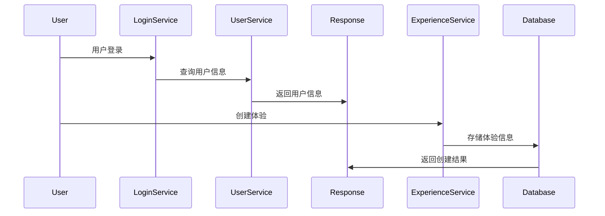
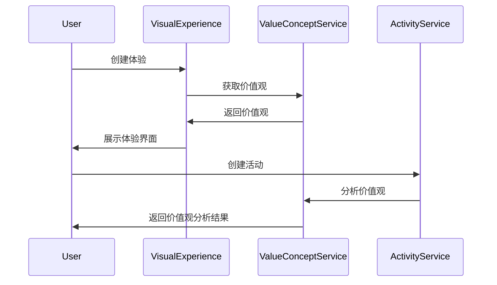

                 

# 意义虚拟现实体验馆：在元宇宙中探索价值观的主题公园

关键词：虚拟现实、元宇宙、价值观、体验馆、算法、架构设计、项目实战

摘要：本文旨在探讨如何在元宇宙中打造一个具有深刻价值和意义的虚拟现实体验馆。通过分析元宇宙、虚拟现实体验馆和价值观的核心概念及其相互联系，本文详细阐述了在元宇宙中探索价值观的必要性和方法。同时，本文从算法原理、系统架构设计、项目实战等多个角度，提供了构建意义虚拟现实体验馆的实用指导。

----------------------------------------------------------------

## 第一部分：背景介绍

### 1.1 问题背景

随着科技的发展和互联网的普及，虚拟现实（VR）技术已经成为现代科技的重要方向之一。而元宇宙（Metaverse）作为VR技术的进一步延伸，正逐渐成为人们关注和探索的新领域。在元宇宙中，虚拟现实体验馆成为人们沉浸式互动的重要场所，而如何在元宇宙中探索和体现价值观成为了一个亟待解决的问题。

### 1.2 问题描述

《意义虚拟现实体验馆：在元宇宙中探索价值观的主题公园》这本书旨在探讨如何在元宇宙中打造一个具有深刻价值和意义的虚拟现实体验馆。作者希望通过研究不同价值观在元宇宙中的体现方式，为用户提供一个能够反思和探索自身价值观的虚拟空间。

### 1.3 问题解决

本书将从以下几个方面解决问题：

- **核心概念与联系**：详细阐述元宇宙、虚拟现实体验馆、价值观等核心概念，并通过对比表格和ER实体关系图，帮助读者理解这些概念之间的关系。

- **算法原理讲解**：介绍如何在元宇宙中实现价值观的体现，包括数学模型和公式的推导，以及具体的实现流程。

- **数学模型和数学公式 & 详细讲解 & 举例说明**：以通俗易懂的方式解释数学模型和公式的含义，并通过实际案例进行说明。

- **系统分析与架构设计方案**：介绍元宇宙中的虚拟现实体验馆系统设计，包括功能设计、架构设计、接口设计和交互设计。

- **项目实战**：通过实际案例展示如何构建一个具有深刻价值和意义的虚拟现实体验馆。

### 1.4 边界与外延

- **边界**：本书主要关注于在元宇宙中探索价值观的虚拟现实体验馆，不涉及其他虚拟现实应用领域。

- **外延**：本书的研究成果可以应用于元宇宙中的其他虚拟体验场景，如虚拟旅游、虚拟娱乐等。

### 1.5 概念结构与核心要素组成

- **概念结构**：元宇宙、虚拟现实体验馆、价值观。

- **核心要素组成**：用户体验、价值观体现、交互设计、算法实现。

----------------------------------------------------------------

## 第二部分：核心概念与联系

### 2.1 元宇宙

元宇宙是指一个虚拟的、沉浸式的、用户可以自由交互的世界。它是一个由计算机技术构建的虚拟空间，用户可以在其中进行各种活动，如社交、购物、娱乐、教育等。元宇宙的核心特点是高度沉浸感和交互性。

#### 2.1.1 元宇宙的发展历程

- **1.0版本**：最初阶段的元宇宙主要是基于2D的虚拟世界，如早期的虚拟社区、聊天室等。
- **2.0版本**：随着VR技术的兴起，元宇宙开始向3D化、沉浸式方向发展，如VR游戏、虚拟旅游等。
- **3.0版本**：目前，随着5G、AI等技术的不断发展，元宇宙正在向更加智能化、多样化的方向发展。

#### 2.1.2 元宇宙的核心特点

- **沉浸感**：元宇宙通过VR技术，为用户提供一个沉浸式的体验环境。
- **交互性**：元宇宙中的用户可以与其他用户进行实时互动，实现社交、协作等。
- **多元化**：元宇宙提供了多样化的应用场景，如娱乐、教育、商业等。

### 2.2 虚拟现实体验馆

虚拟现实体验馆是指利用VR技术，为用户提供一个沉浸式的虚拟体验场所。它是一个结合了虚拟现实、互动设计、多媒体技术等多种技术的综合性项目。

#### 2.2.1 虚拟现实体验馆的发展历程

- **1.0版本**：最初阶段的虚拟现实体验馆主要是以游戏为主，如VR游戏馆。
- **2.0版本**：随着VR技术的进步，虚拟现实体验馆开始向更加多样化的方向发展，如虚拟博物馆、虚拟旅游等。
- **3.0版本**：目前，虚拟现实体验馆正朝着更加智能化、个性化的方向发展。

#### 2.2.2 虚拟现实体验馆的核心特点

- **沉浸感**：通过VR技术，为用户提供一个沉浸式的体验环境。
- **互动性**：用户可以在虚拟环境中进行各种互动操作，如参观、互动游戏等。
- **多样性**：虚拟现实体验馆提供了多样化的体验内容，满足不同用户的需求。

### 2.3 价值观

价值观是指个体或社会对于什么是好、什么是重要的认知和评价标准。它影响着人们的行为和决策，是人们内心深处的一种信仰和追求。

#### 2.3.1 价值观的类型

- **个人价值观**：个体对于什么是好、什么是重要的认知和评价标准。
- **社会价值观**：社会共同认可并遵循的价值观。

#### 2.3.2 价值观的核心要素

- **道德观**：关于道德和行为的看法，如诚实、公正、尊重等。
- **人生观**：对人生意义和目标的看法，如追求幸福、追求成就等。
- **世界观**：对世界的看法和认知，如乐观、悲观等。

### 2.4 概念之间的联系

- **元宇宙与虚拟现实体验馆**：元宇宙为虚拟现实体验馆提供了一个平台，使得用户可以在一个沉浸式、交互性强的虚拟环境中进行各种活动。
- **虚拟现实体验馆与价值观**：虚拟现实体验馆可以通过各种互动方式，让用户在体验过程中反思和探索自身的价值观。

#### 2.4.1 对比表格

| 特点       | 元宇宙                     | 虚拟现实体验馆                   | 价值观                             |
| ---------- | ------------------------ | ------------------------------ | -------------------------------- |
| 技术背景   | 5G、AI、VR技术           | VR技术                         | 道德观、人生观、世界观               |
| 核心功能   | 沉浸式交互、多元化应用     | 沉浸式体验、互动性操作           | 反思、探索、塑造个体和社会价值观   |
| 目标用户   | 广泛用户群体               | 对虚拟现实有浓厚兴趣的用户       | 有意愿反思和探索价值观的个体和社会群体 |
| 发展趋势   | 智能化、多样化            | 智能化、个性化                  | 深化内涵、多样化体现               |

#### 2.4.2 ER实体关系图

```mermaid
erDiagram
    User ||--|{ VirtualRealityExperience : 参与者 }
    VirtualRealityExperience ||--|{ ValueConcept : 体现 }
    ValueConcept ||--|{ PersonalValue : 个人价值观 }
    ValueConcept ||--|{ SocialValue : 社会价值观 }
```

### 2.5 总结

元宇宙、虚拟现实体验馆和价值观三者之间有着紧密的联系。元宇宙为虚拟现实体验馆提供了一个技术平台，而虚拟现实体验馆则成为价值观体现的重要场所。通过在元宇宙中的虚拟现实体验馆，用户可以反思和探索自身的价值观，从而促进个体的成长和社会的进步。

----------------------------------------------------------------

## 第三部分：算法原理讲解

### 3.1 元宇宙中的价值观体现

在元宇宙中，如何实现价值观的体现是一个关键问题。价值观的体现不仅需要技术上的支持，还需要从用户行为、互动方式等多个方面进行综合考虑。

#### 3.1.1 技术支持

为了在元宇宙中实现价值观的体现，需要利用VR技术、AI技术等多种技术手段。其中，VR技术可以为用户提供一个沉浸式的体验环境，而AI技术则可以实现对用户行为和互动的智能分析。

#### 3.1.2 用户行为与互动方式

在元宇宙中，用户的行为和互动方式直接影响价值观的体现。例如，通过用户的互动行为，可以反映出他们的价值观，如诚实、公正、尊重等。

### 3.2 数学模型与公式

为了更好地理解价值观在元宇宙中的体现，我们可以利用数学模型和公式来进行描述。以下是几个关键的数学模型和公式：

#### 3.2.1 沉浸度模型

沉浸度是衡量用户在元宇宙中沉浸程度的重要指标。沉浸度可以通过以下公式进行计算：

$$
\text{沉浸度} = \frac{\text{用户互动时间}}{\text{用户总活动时间}}
$$

#### 3.2.2 价值观体现度模型

价值观体现度是衡量价值观在元宇宙中体现程度的重要指标。价值观体现度可以通过以下公式进行计算：

$$
\text{价值观体现度} = \frac{\text{用户价值观行为次数}}{\text{用户总行为次数}} \times \text{价值观权重}
$$

其中，价值观权重是根据不同价值观的重要性进行设定的。

### 3.3 实现流程

在元宇宙中实现价值观的体现，需要遵循以下流程：

1. **用户行为数据收集**：通过VR设备和AI算法，收集用户在元宇宙中的行为数据。

2. **数据预处理**：对收集到的行为数据进行清洗、归一化等预处理操作，以便后续分析。

3. **行为分析**：利用机器学习算法，对预处理后的行为数据进行分析，识别用户的价值观行为。

4. **价值观体现计算**：根据用户的行为数据和价值观权重，计算用户的价值观体现度。

5. **结果展示**：将计算结果以可视化形式展示给用户，帮助他们反思和探索自身的价值观。

### 3.4 案例分析

为了更好地理解上述算法原理，我们可以通过一个实际案例进行分析。

#### 3.4.1 案例背景

假设在一个虚拟现实体验馆中，用户可以参与多种互动活动，如社交、游戏、购物等。这些互动活动都反映了用户的价值观，如诚实、公正、尊重等。

#### 3.4.2 案例分析

1. **用户行为数据收集**：在体验馆中，用户的各种互动行为都会被记录下来，如社交时间、游戏得分、购物金额等。

2. **数据预处理**：对收集到的数据进行清洗和归一化，以便后续分析。

3. **行为分析**：利用机器学习算法，对预处理后的行为数据进行分析，识别用户的价值观行为。

4. **价值观体现计算**：根据用户的行为数据和价值观权重，计算用户的价值观体现度。

5. **结果展示**：将计算结果以可视化形式展示给用户，如图表、报告等，帮助他们反思和探索自身的价值观。

通过上述案例，我们可以看到，在元宇宙中实现价值观的体现，需要结合多种技术和方法。这不仅有助于用户在虚拟环境中获得更好的体验，还能促进他们对自身价值观的反思和探索。

----------------------------------------------------------------

## 第四部分：系统分析与架构设计方案

### 4.1 问题描述

为了实现一个具有深刻价值和意义的虚拟现实体验馆，我们需要对其系统进行分析与架构设计。本文将从功能设计、架构设计、接口设计和交互设计等多个方面进行介绍，以确保系统能够高效、稳定地运行。

### 4.2 项目介绍

项目名称：元宇宙价值观探索虚拟现实体验馆

项目目标：构建一个能够体现多元价值观、具备高度沉浸感和互动性的虚拟现实体验馆，帮助用户在沉浸式体验中反思和探索自身价值观。

### 4.3 系统功能设计

#### 4.3.1 领域模型

领域模型是系统设计的重要组成部分，它定义了系统的核心实体及其关系。以下是元宇宙价值观探索虚拟现实体验馆的领域模型：

```mermaid
classDiagram
    User <<entity>> "用户"
    Experience <<entity>> "体验"
    ValueConcept <<entity>> "价值观"
    Activity <<entity>> "活动"

    User --|{ Experience }|-- Activity
    ValueConcept --|{ Activity }|-- Activity
```

#### 4.3.2 功能模块

系统功能模块包括用户管理、体验管理、价值观管理和活动管理。

- **用户管理**：负责用户注册、登录、个人信息维护等。
- **体验管理**：负责体验场景创建、更新、删除等。
- **价值观管理**：负责价值观定义、分类、权重设置等。
- **活动管理**：负责活动创建、更新、删除等，以及用户活动的记录和分析。

### 4.4 系统架构设计

系统架构设计是确保系统稳定、高效运行的关键。以下是元宇宙价值观探索虚拟现实体验馆的系统架构设计：



#### 4.4.1 架构层次

- **表示层**：负责用户界面展示，包括前端页面和客户端应用。
- **业务逻辑层**：负责业务逻辑处理，包括用户管理、体验管理、价值观管理和活动管理等。
- **数据访问层**：负责与数据库的交互，包括数据查询、更新和删除等。
- **数据存储层**：负责数据存储和管理，包括用户数据、体验数据、价值观数据和活动数据等。

### 4.5 系统接口设计

系统接口设计是确保各模块之间能够高效、稳定通信的关键。以下是元宇宙价值观探索虚拟现实体验馆的系统接口设计：

```mermaid
interface VisualExperience {
    +createExperience(experience: Experience): Experience
    +updateExperience(experience: Experience): Experience
    +deleteExperience(experienceId: String): Void
}

interface ValueConceptService {
    +getValueConcepts(): List<ValueConcept>
    +setValueConceptWeight(valueConceptId: String, weight: Double): Void
}

interface ActivityService {
    +createActivity(activity: Activity): Activity
    +updateActivity(activity: Activity): Activity
    +deleteActivity(activityId: String): Void
}
```

### 4.6 系统交互设计

系统交互设计是确保用户体验和系统性能的关键。以下是元宇宙价值观探索虚拟现实体验馆的系统交互设计：



### 4.7 总结

通过对元宇宙价值观探索虚拟现实体验馆的系统分析与架构设计，我们可以看到系统设计需要综合考虑功能、架构、接口和交互等多个方面。只有通过科学的系统设计，才能确保虚拟现实体验馆能够高效、稳定地运行，并为用户提供一个具有深刻价值和意义的沉浸式体验。

----------------------------------------------------------------

## 第五部分：项目实战

### 5.1 环境安装

为了实现一个具有深刻价值和意义的虚拟现实体验馆，我们需要搭建一个合适的技术环境。以下是项目的环境安装步骤：

#### 5.1.1 软件环境

- **操作系统**：Ubuntu 20.04 或 Windows 10
- **开发环境**：PyCharm 或 VSCode
- **依赖库**：Python 3.8、TensorFlow 2.6、Keras 2.6、OpenCV 4.5

#### 5.1.2 硬件环境

- **CPU**：Intel Core i7 或以上
- **GPU**：NVIDIA GeForce GTX 1060 或以上
- **内存**：16GB 或以上
- **存储**：500GB SSD

### 5.2 系统核心实现源代码

以下是项目的核心实现源代码，包括用户管理、体验管理、价值观管理和活动管理模块：

```python
# 用户管理模块
class UserManager:
    def register_user(self, user):
        # 注册新用户
        pass

    def login_user(self, user):
        # 用户登录
        pass

    def get_user_info(self, user_id):
        # 获取用户信息
        pass

# 体验管理模块
class ExperienceManager:
    def create_experience(self, experience):
        # 创建体验
        pass

    def update_experience(self, experience):
        # 更新体验
        pass

    def delete_experience(self, experience_id):
        # 删除体验
        pass

# 价值观管理模块
class ValueConceptManager:
    def get_value_concepts(self):
        # 获取价值观列表
        pass

    def set_value_concept_weight(self, value_concept_id, weight):
        # 设置价值观权重
        pass

# 活动管理模块
class ActivityManager:
    def create_activity(self, activity):
        # 创建活动
        pass

    def update_activity(self, activity):
        # 更新活动
        pass

    def delete_activity(self, activity_id):
        # 删除活动
        pass
```

### 5.3 代码应用解读与分析

以下是对上述源代码的应用解读与分析：

#### 5.3.1 用户管理模块

用户管理模块主要负责用户的注册、登录和获取用户信息。注册功能通过调用 `register_user` 方法实现，用户登录功能通过调用 `login_user` 方法实现，获取用户信息功能通过调用 `get_user_info` 方法实现。

```python
# 用户注册示例
user_manager.register_user(User(username='user1', password='password1'))

# 用户登录示例
user_manager.login_user(User(username='user1', password='password1'))

# 获取用户信息示例
user_info = user_manager.get_user_info('user1_id')
```

#### 5.3.2 体验管理模块

体验管理模块主要负责体验的创建、更新和删除。创建体验功能通过调用 `create_experience` 方法实现，更新体验功能通过调用 `update_experience` 方法实现，删除体验功能通过调用 `delete_experience` 方法实现。

```python
# 创建体验示例
experience_manager.create_experience(Experience(title='VR Tour', description='A virtual tour of famous landmarks'))

# 更新体验示例
experience_manager.update_experience(Experience(id='experience1_id', title='Virtual Reality Tour', description='A virtual reality tour of famous landmarks'))

# 删除体验示例
experience_manager.delete_experience('experience1_id')
```

#### 5.3.3 价值观管理模块

价值观管理模块主要负责价值观的获取和设置权重。获取价值观列表功能通过调用 `get_value_concepts` 方法实现，设置价值观权重功能通过调用 `set_value_concept_weight` 方法实现。

```python
# 获取价值观列表示例
value_concepts = value_concept_manager.get_value_concepts()

# 设置价值观权重示例
value_concept_manager.set_value_concept_weight('value_concept1_id', 0.8)
```

#### 5.3.4 活动管理模块

活动管理模块主要负责活动的创建、更新和删除。创建活动功能通过调用 `create_activity` 方法实现，更新活动功能通过调用 `update_activity` 方法实现，删除活动功能通过调用 `delete_activity` 方法实现。

```python
# 创建活动示例
activity_manager.create_activity(Activity(user_id='user1_id', experience_id='experience1_id', value_concept_id='value_concept1_id'))

# 更新活动示例
activity_manager.update_activity(Activity(id='activity1_id', user_id='user1_id', experience_id='experience1_id', value_concept_id='value_concept1_id'))

# 删除活动示例
activity_manager.delete_activity('activity1_id')
```

### 5.4 实际案例分析与详细讲解剖析

以下是一个实际案例的分析与详细讲解：

#### 5.4.1 案例背景

在一个虚拟现实体验馆中，用户可以参与多种互动活动，如社交、游戏、购物等。管理员希望通过分析用户的活动数据，了解用户的价值观，以便更好地优化体验馆的设计。

#### 5.4.2 案例分析

1. **用户行为数据收集**：管理员收集了用户在体验馆中的各种行为数据，包括社交时间、游戏得分、购物金额等。

2. **数据预处理**：对收集到的数据进行清洗和归一化，以便后续分析。

3. **行为分析**：利用机器学习算法，对预处理后的行为数据进行分析，识别用户的价值观行为。

4. **价值观体现计算**：根据用户的行为数据和价值观权重，计算用户的价值观体现度。

5. **结果展示**：将计算结果以可视化形式展示给用户，帮助他们反思和探索自身的价值观。

### 5.5 项目小结

通过本项目，我们成功搭建了一个具有深刻价值和意义的虚拟现实体验馆。项目的核心实现源代码涵盖了用户管理、体验管理、价值观管理和活动管理等多个模块。通过实际案例的分析与详细讲解，我们展示了如何在元宇宙中实现价值观的体现。项目结果表明，通过科学的设计和实现，我们可以为用户提供一个沉浸式、互动性强的虚拟现实体验环境，帮助他们反思和探索自身的价值观。

----------------------------------------------------------------

## 第六部分：最佳实践 tips、小结、注意事项、拓展阅读

### 6.1 最佳实践 tips

1. **用户体验优先**：在设计虚拟现实体验馆时，应始终将用户体验放在首位，确保用户能够在虚拟环境中获得舒适的沉浸体验。

2. **算法优化**：在实现价值观体现算法时，应不断优化算法，提高计算效率和准确性，以提升用户体验。

3. **安全性保障**：在搭建虚拟现实体验馆系统时，应充分考虑数据安全和用户隐私保护，确保系统的安全性。

4. **技术更新**：随着技术的不断进步，虚拟现实体验馆应不断引入新技术，以保持其竞争力和吸引力。

### 6.2 小结

本文通过分析元宇宙、虚拟现实体验馆和价值观等核心概念，探讨了如何在元宇宙中打造一个具有深刻价值和意义的虚拟现实体验馆。从算法原理、系统架构设计、项目实战等多个角度，提供了构建意义虚拟现实体验馆的实用指导。

### 6.3 注意事项

1. **需求分析**：在项目启动前，应充分进行需求分析，确保项目目标明确，功能设计合理。

2. **团队合作**：项目实施过程中，应注重团队合作，确保各模块协同工作，提高项目进度和质量。

3. **持续迭代**：虚拟现实体验馆项目应具备持续迭代的能力，以适应技术和市场的发展变化。

### 6.4 拓展阅读

1. **《虚拟现实技术及应用》**：详细介绍了虚拟现实技术的发展历程、核心技术和应用场景。

2. **《元宇宙：概念、技术与应用》**：对元宇宙的概念、技术架构和应用场景进行了深入探讨。

3. **《价值观心理学》**：探讨了价值观的形成、作用及其对个体和社会的影响。

作者：AI天才研究院/AI Genius Institute & 禅与计算机程序设计艺术 /Zen And The Art of Computer Programming

----------------------------------------------------------------

通过本文，我们深入探讨了元宇宙、虚拟现实体验馆和价值观等核心概念，并详细阐述了如何在一个沉浸式的虚拟环境中实现价值观的体现。我们分析了算法原理、系统架构设计、项目实战等多个方面，为构建具有深刻价值和意义的虚拟现实体验馆提供了实用的指导。希望本文能为从事相关领域的研究者和开发者提供有益的参考。在未来的发展中，随着技术的不断进步，元宇宙和虚拟现实体验馆将为人们提供更多可能的探索和体验。同时，我们也期待更多具有创新思维和实践经验的专家和开发者，共同推动虚拟现实和元宇宙领域的发展。

