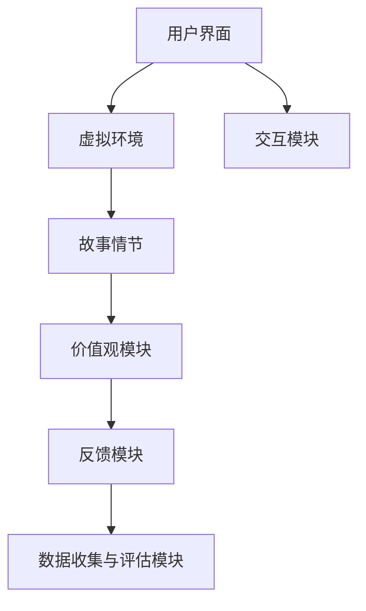
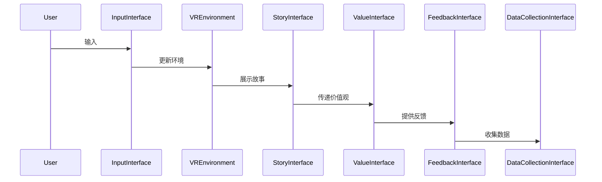
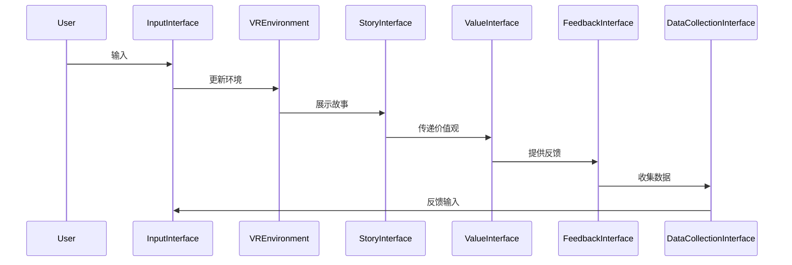

                 

### 文章标题

意义虚拟现实体验：在元宇宙中探索价值观

> 关键词：虚拟现实、元宇宙、价值观、用户体验、技术架构

> 摘要：
本文将探讨虚拟现实（VR）与元宇宙的兴起，以及如何通过虚拟现实技术设计具有深远意义的用户体验。我们将分析虚拟现实技术的核心原理，探讨元宇宙中的价值观概念，并通过算法和实际项目案例，展示如何将这些概念应用于虚拟现实体验设计中。文章旨在为读者提供全面的视角，深入了解如何在元宇宙中探索和传递价值观，从而提升用户的整体体验。

### 目录大纲

---

#### 第一部分：背景介绍

- **第1章：虚拟现实与元宇宙的崛起**
  - **1.1 问题背景**
    - **1.1.1 虚拟现实技术的起源与发展**
    - **1.1.2 元宇宙的概念与特点**
    - **1.1.3 虚拟现实技术在元宇宙中的应用**
  - **1.2 核心概念**
    - **1.2.1 虚拟现实与增强现实**
    - **1.2.2 元宇宙中的用户交互**
    - **1.2.3 元宇宙中的商业模式**
  - **1.3 联系与边界**
    - **1.3.1 虚拟现实与元宇宙的联系**
    - **1.3.2 虚拟现实技术的边界**
    - **1.3.3 元宇宙的未来趋势**
  - **1.4 本章小结**

- **第2章：虚拟现实技术原理**
  - **2.1 概念原理**
    - **2.1.1 虚拟现实技术的基本原理**
    - **2.1.2 增强现实技术的基本原理**
    - **2.1.3 虚拟现实技术的关键要素**
  - **2.2 概念属性特征对比表格**
    - **2.2.1 虚拟现实技术与增强现实技术的对比**
    - **2.2.2 不同虚拟现实设备的对比**
  - **2.3 ER实体关系图架构**
    - **2.3.1 虚拟现实系统的ER图**
    - **2.3.2 元宇宙中用户交互的ER图**
  - **2.4 本章小结**

- **第3章：元宇宙中的价值观**
  - **3.1 概念原理**
    - **3.1.1 元宇宙中的价值观定义**
    - **3.1.2 元宇宙价值观的构成**
    - **3.1.3 元宇宙价值观的影响因素**
  - **3.2 概念属性特征对比表格**
    - **3.2.1 不同元宇宙中价值观的对比**
    - **3.2.2 元宇宙价值观与现有社会价值观的对比**
  - **3.3 ER实体关系图架构**
    - **3.3.1 元宇宙价值观的ER图**
    - **3.3.2 元宇宙中用户价值观的形成与演变**
  - **3.4 本章小结**

#### 第二部分：核心概念与联系

- **第4章：构建虚拟现实体验**
  - **4.1 算法原理**
    - **4.1.1 虚拟现实场景构建算法**
    - **4.1.2 用户交互算法**
    - **4.1.3 虚拟现实中的感知与反馈算法**
  - **4.2 数学模型与公式**
    - **4.2.1 虚拟现实场景构建的数学模型**
    - **4.2.2 用户交互的数学模型**
    - **4.2.3 感知与反馈的数学模型**
  - **4.3 Python源代码实现**
    - **4.3.1 场景构建算法实现**
    - **4.3.2 用户交互算法实现**
    - **4.3.3 感知与反馈算法实现**
  - **4.4 算法讲解与举例说明**
    - **4.4.1 场景构建算法讲解**
    - **4.4.2 用户交互算法讲解**
    - **4.4.3 感知与反馈算法讲解**
  - **4.5 本章小结**

- **第5章：价值观的虚拟现实体验设计**
  - **5.1 算法原理**
    - **5.1.1 价值观虚拟现实体验设计的原理**
    - **5.1.2 设计过程中的关键因素**
    - **5.1.3 体验评估与反馈机制**
  - **5.2 数学模型与公式**
    - **5.2.1 价值观虚拟现实体验设计的数学模型**
    - **5.2.2 用户价值观评估的数学模型**
    - **5.2.3 体验设计的优化模型**
  - **5.3 Python源代码实现**
    - **5.3.1 价值观虚拟现实体验设计实现**
    - **5.3.2 用户价值观评估实现**
    - **5.3.3 体验设计优化实现**
  - **5.4 算法讲解与举例说明**
    - **5.4.1 价值观虚拟现实体验设计讲解**
    - **5.4.2 用户价值观评估讲解**
    - **5.4.3 体验设计优化讲解**
  - **5.5 本章小结**

#### 第三部分：算法原理与实现

- **第6章：意义虚拟现实体验项目实战**
  - **6.1 项目介绍**
    - **6.1.1 项目背景**
    - **6.1.2 项目目标**
    - **6.1.3 项目团队**
  - **6.2 系统功能设计**
    - **6.2.1 领域模型**
    - **6.2.2 功能需求分析**
  - **6.3 系统架构设计**
    - **6.3.1 系统架构**
    - **6.3.2 技术选型**
  - **6.4 系统接口设计**
    - **6.4.1 接口设计**
    - **6.4.2 接口实现**
  - **6.5 系统交互**
    - **6.5.1 系统交互设计**
    - **6.5.2 系统交互实现**
  - **6.6 项目实战**
    - **6.6.1 环境安装**
    - **6.6.2 系统核心实现源代码**
    - **6.6.3 代码应用解读与分析**
    - **6.6.4 实际案例分析与详细讲解剖析**
    - **6.6.5 项目小结**
  - **6.7 本章小结**

---

### 第一部分：背景介绍

#### 第1章：虚拟现实与元宇宙的崛起

虚拟现实（Virtual Reality，简称VR）和元宇宙（Metaverse）是近年来信息技术领域的热点。随着技术的进步，这两种概念逐渐从科幻领域走向现实，并在多个行业中展现出巨大的潜力。

##### 1.1 问题背景

##### 1.1.1 虚拟现实技术的起源与发展

虚拟现实技术的起源可以追溯到1960年代，美国科学家伊万·苏瑟兰（Ivan Sutherland）发明了第一台头戴式显示器。从那时起，虚拟现实技术经历了数十年的发展，从简单的模拟设备到复杂的交互系统，逐步成熟。

- **1960年代**：虚拟现实技术开始萌芽，早期的虚拟现实设备如头戴式显示器和跟踪系统出现。
- **1980年代**：虚拟现实技术进一步发展，开始应用于游戏和军事模拟等领域。
- **1990年代**：虚拟现实技术逐渐商业化，但受限于硬件和软件技术的限制，普及度不高。
- **2000年代**：随着计算机性能的提升和图形处理技术的发展，虚拟现实技术开始复兴，并逐步应用于医疗、教育等领域。
- **2010年代至今**：虚拟现实技术取得了突破性的进展，VR设备如Oculus Rift、HTC Vive等相继推出，使得虚拟现实体验更加真实和沉浸。

##### 1.1.2 元宇宙的概念与特点

元宇宙是一个虚拟的、三维的、连接的、持续存在的数字世界，它通过互联网连接，为用户提供沉浸式的虚拟体验。元宇宙具有以下几个特点：

- **沉浸式体验**：元宇宙通过高度仿真的虚拟环境，使用户能够沉浸在虚拟世界中，获得类似于现实世界的体验。
- **虚拟社交**：元宇宙提供丰富的社交功能，用户可以在虚拟世界中与他人互动、交流，甚至建立虚拟社区。
- **经济系统**：元宇宙内置了经济系统，用户可以在其中购买、交易虚拟物品，甚至进行虚拟货币交易。
- **无限扩展**：元宇宙可以无限扩展，用户可以创造和探索新的虚拟世界，形成多样化的生态系统。

##### 1.1.3 虚拟现实技术在元宇宙中的应用

虚拟现实技术在元宇宙中的应用十分广泛，以下是一些典型应用场景：

- **游戏**：虚拟现实技术为游戏提供了全新的体验，用户可以在虚拟世界中参与各种游戏活动。
- **教育**：虚拟现实技术可以模拟各种教学场景，提供沉浸式的学习体验，帮助学生更好地理解复杂概念。
- **医疗**：虚拟现实技术在医疗领域有广泛应用，如手术模拟、心理健康治疗等。
- **旅游**：虚拟现实技术可以让用户在家中体验世界各地的旅游胜地，提供虚拟旅游服务。
- **商业**：虚拟现实技术可以帮助企业进行虚拟展示、在线会议、员工培训等，提高工作效率。

##### 1.2 核心概念

##### 1.2.1 虚拟现实与增强现实

虚拟现实和增强现实是两种不同的技术，但它们在某些方面有相似之处，也存在明显的区别。

- **虚拟现实（VR）**：虚拟现实是一种完全沉浸式的体验，用户通过头戴式显示器等设备，进入一个完全虚拟的世界。在这个世界中，用户可以与虚拟环境中的物体进行互动，获得高度真实的体验。
  
- **增强现实（AR）**：增强现实是一种将虚拟信息叠加到现实世界中的技术。用户通过智能手机或头戴式显示器等设备，看到现实世界中的物体，同时叠加了虚拟信息，如文字、图像等。

##### 1.2.2 元宇宙中的用户交互

在元宇宙中，用户交互是至关重要的。元宇宙中的用户交互具有以下几个特点：

- **实时性**：元宇宙中的交互需要实时响应，确保用户感受到的体验与实际操作同步。
- **沉浸感**：元宇宙中的用户交互需要提供高度沉浸式的体验，让用户感受到自己确实在虚拟世界中。
- **多样化**：元宇宙中的用户交互方式多样，包括语音、手势、眼动等，为用户提供灵活的交互方式。

##### 1.2.3 元宇宙中的商业模式

元宇宙的商业模式多样，包括以下几种：

- **广告**：元宇宙中的广告形式多样，如虚拟广告牌、植入式广告等，为企业提供新的营销渠道。
- **虚拟商品交易**：用户可以在元宇宙中购买和交易虚拟商品，如虚拟服饰、家具等。
- **虚拟劳动力市场**：元宇宙中的虚拟劳动力市场，用户可以提供虚拟服务，如虚拟导游、虚拟设计师等。
- **数字艺术品**：元宇宙中数字艺术品成为一种独特的收藏品，具有很高的价值。

##### 1.3 联系与边界

##### 1.3.1 虚拟现实与元宇宙的联系

虚拟现实技术是元宇宙的核心组成部分，元宇宙的构建离不开虚拟现实技术。虚拟现实技术为元宇宙提供了沉浸式的体验，使得用户能够更好地参与到元宇宙中。同时，元宇宙为虚拟现实技术提供了广阔的应用场景，使得虚拟现实技术得以在更多领域中发挥作用。

##### 1.3.2 虚拟现实技术的边界

尽管虚拟现实技术取得了显著进展，但它仍存在一些局限性。例如，虚拟现实设备的价格较高，技术门槛较高，用户体验仍需提升。此外，虚拟现实技术需要解决虚拟环境与现实环境之间的交互问题，确保用户在虚拟世界中的行为能够实时反映到现实世界中。

##### 1.3.3 元宇宙的未来趋势

元宇宙的发展前景广阔，未来将呈现出以下几个趋势：

- **技术融合**：元宇宙将融合多种技术，如人工智能、大数据、区块链等，为用户提供更加丰富的体验。
- **产业应用**：元宇宙将在各个产业中得到广泛应用，如教育、医疗、旅游、娱乐等，推动各行业的发展。
- **社会变革**：元宇宙将改变人们的生活方式，虚拟社交、虚拟工作、虚拟娱乐等将成为人们日常生活的一部分。
- **价值重塑**：元宇宙中的价值体系将重新塑造，虚拟资产、虚拟身份等将成为重要资产。

##### 1.4 本章小结

本章介绍了虚拟现实与元宇宙的背景、核心概念及其在元宇宙中的应用。通过分析虚拟现实技术的起源与发展，元宇宙的概念与特点，以及虚拟现实技术在元宇宙中的应用，我们了解到这两种技术之间的紧密联系。同时，我们也认识到虚拟现实技术仍存在一些局限性，元宇宙的发展前景广阔。在接下来的章节中，我们将进一步探讨虚拟现实技术的原理及其在元宇宙中的具体应用。

### 第2章：虚拟现实技术原理

虚拟现实（VR）技术是一种通过计算机模拟生成一个虚拟环境，使用户能够沉浸其中并进行交互的技术。本章将详细探讨虚拟现实技术的基本原理、增强现实（AR）技术的基本原理，以及虚拟现实技术的关键要素。

#### 2.1 概念原理

##### 2.1.1 虚拟现实技术的基本原理

虚拟现实技术的基本原理是通过计算机生成一个三维的虚拟环境，用户通过头戴显示器（HMD）或其他设备观察这个环境，并通过手柄、身体动作等方式与之进行交互。

1. **三维环境生成**：虚拟现实技术使用计算机图形学技术生成三维模型和场景，用户可以在虚拟环境中自由移动和探索。
2. **实时渲染**：为了提供流畅的体验，虚拟现实系统需要实时渲染场景，计算物体在用户视角中的投影和光照效果。
3. **头动跟踪**：头戴显示器与头动传感器配合使用，实时跟踪用户的头部运动，调整虚拟环境中的视角，实现沉浸式体验。
4. **交互设备**：用户通过手柄、手套或其他交互设备与虚拟环境进行交互，如操纵物体、触发事件等。

##### 2.1.2 增强现实技术的基本原理

增强现实（AR）技术是一种将虚拟信息叠加到现实世界中的技术，用户通过智能手机、头戴显示器等设备看到现实世界中的物体，同时叠加了虚拟信息。

1. **信息叠加**：AR技术使用摄像头捕捉现实世界的图像，然后在图像上叠加虚拟信息，如文字、图像、视频等。
2. **位置跟踪**：AR系统需要实时跟踪用户的位置和方向，确保虚拟信息正确地叠加在现实世界中的物体上。
3. **透明显示**：头戴显示器或智能手机屏幕使用透明显示技术，用户可以看到叠加的虚拟信息和现实世界的物体。

##### 2.1.3 虚拟现实技术的关键要素

虚拟现实技术的成功实施需要以下几个关键要素：

1. **硬件设备**：包括头戴显示器（HMD）、手柄、传感器等，硬件设备的性能直接影响用户体验。
2. **软件系统**：包括虚拟环境生成、交互系统、渲染引擎等，软件系统需要具备强大的图形处理能力和实时交互功能。
3. **交互设计**：虚拟现实体验的核心是用户交互，良好的交互设计能够提高用户体验，包括界面设计、交互方式等。
4. **内容制作**：虚拟现实内容的质量直接影响用户体验，高质量的虚拟场景、角色、动画等能够提升虚拟现实体验。
5. **网络支持**：虚拟现实技术需要稳定的网络支持，以确保实时交互和数据传输。

#### 2.2 概念属性特征对比表格

以下是一个对比虚拟现实技术和增强现实技术属性特征的表格：

| 特征           | 虚拟现实（VR）               | 增强现实（AR）               |
|----------------|-------------------------------|-------------------------------|
| 沉浸式体验     | 用户完全沉浸在一个虚拟环境中 | 用户看到现实世界，叠加虚拟信息 |
| 显示方式       | 头戴显示器（HMD）            | 智能手机、头戴显示器等        |
| 环境生成       | 完全虚拟环境                 | 实现实世界图像，叠加虚拟信息  |
| 交互方式       | 身体动作、手柄等             | 手势、声音等                 |
| 硬件要求       | 高性能计算机、特殊设备       | 智能手机、平板电脑            |
| 应用场景       | 游戏、教育、医疗等          | 游戏、教育、商业等           |
| 数据处理需求   | 较高                         | 较低                         |

#### 2.3 ER实体关系图架构

##### 2.3.1 虚拟现实系统的ER图

以下是一个虚拟现实系统的ER图，展示系统中主要实体及其关系：

```mermaid
erDiagram
    User ||--|{ VRDevice }|-->: "拥有"
    VRDevice ||--|{ VRApplication }|-->: "运行"
    VRApplication ||--|{ VRScene }|-->: "包含"
    VRScene ||--|{ VRObject }|-->: "包含"
    VRObject ||--|{ VRProperty }|-->: "具有"
    VRProperty ||--|{ VRValue }|-->: "值"
```

##### 2.3.2 元宇宙中用户交互的ER图

以下是一个元宇宙中用户交互的ER图，展示用户、交互设备和虚拟环境之间的关系：

```mermaid
erDiagram
    User ||--|{ InteractionDevice }|-->: "使用"
    InteractionDevice ||--|{ InteractionInput }|-->: "接收"
    InteractionDevice ||--|{ InteractionOutput }|-->: "生成"
    InteractionInput ||--|{ VirtualEnvironment }|-->: "输入"
    VirtualEnvironment ||--|{ InteractiveObject }|-->: "包含"
    InteractiveObject ||--|{ ObjectProperty }|-->: "具有"
    ObjectProperty ||--|{ PropertyValue }|-->: "值"
```

#### 2.4 本章小结

本章介绍了虚拟现实技术的基本原理、增强现实技术的基本原理，以及虚拟现实技术的关键要素。通过对比虚拟现实和增强现实技术的属性特征，我们了解到它们之间的区别和联系。同时，通过ER实体关系图，我们展示了虚拟现实系统和元宇宙中用户交互的基本架构。在下一章中，我们将探讨元宇宙中的价值观概念及其在虚拟现实体验中的应用。

### 第3章：元宇宙中的价值观

随着元宇宙的兴起，价值观在虚拟世界中的角色和影响变得尤为重要。价值观不仅是元宇宙中用户行为和决策的基石，也是构建有意义用户体验的核心要素。本章将深入探讨元宇宙中的价值观概念，分析其构成和影响因素，并通过对比不同元宇宙中的价值观，探讨元宇宙价值观与现有社会价值观的关系。

#### 3.1 概念原理

##### 3.1.1 元宇宙中的价值观定义

元宇宙中的价值观是指用户在虚拟世界中形成的信念、态度和道德标准，这些价值观指导用户的行为和决策，影响用户的体验和互动。

- **用户行为**：价值观决定了用户在元宇宙中的行为模式，如社交互动、虚拟劳动、虚拟交易等。
- **决策**：价值观影响了用户在虚拟世界中的决策，包括选择参与的活动、购买虚拟商品等。
- **用户体验**：价值观塑造了用户对元宇宙的整体感知和满意度，影响用户的长期参与和忠诚度。

##### 3.1.2 元宇宙价值观的构成

元宇宙价值观的构成包括以下几个方面：

1. **共享价值观**：元宇宙中的共享价值观是指用户共同遵循的道德和行为准则，如公平、尊重、合作等。这些价值观有助于维护虚拟社会的秩序和和谐。
2. **个体价值观**：个体价值观是指每个用户在元宇宙中形成的个人信念和偏好，如对虚拟商品的需求、对社交互动的态度等。个体价值观反映了用户的独特性和多样性。
3. **虚拟经济价值观**：虚拟经济价值观是指用户在元宇宙中对待虚拟资产和货币的态度，如对虚拟货币的投资、对虚拟商品的价值判断等。这些价值观影响了虚拟经济系统的稳定和发展。
4. **社会责任价值观**：社会责任价值观是指用户在元宇宙中对待虚拟社区和社会问题的态度，如对环境保护的关注、对弱势群体的支持等。这些价值观反映了用户的社会责任感和公益意识。

##### 3.1.3 元宇宙价值观的影响因素

元宇宙价值观的形成和演变受到多种因素的影响：

1. **技术发展**：随着虚拟现实、人工智能、区块链等技术的发展，元宇宙的互动方式、信息传播和经济系统不断演变，影响了用户的价值观。
2. **文化背景**：不同国家和地区的文化背景影响了用户在元宇宙中的价值观，如对隐私、自由、平等的看法等。
3. **社会经验**：用户在现实世界中的社会经验，如教育、职业、家庭等，影响了他们在元宇宙中的价值观。
4. **经济利益**：虚拟经济的利益分配和财富积累影响了用户在元宇宙中的价值观，如对虚拟商品和服务的消费、投资等。

##### 3.2 概念属性特征对比表格

以下是一个对比不同元宇宙中价值观的表格：

| 元宇宙名称       | 共享价值观       | 个体价值观           | 虚拟经济价值观           | 社会责任价值观           |
|------------------|------------------|----------------------|--------------------------|--------------------------|
| 虚拟世界A        | 公平、尊重、合作 | 对虚拟商品的需求     | 对虚拟货币的投资         | 对环境保护的关注         |
| 虚拟世界B        | 自由、创新、竞争 | 对社交互动的态度     | 对虚拟经济的谨慎态度     | 对弱势群体的支持         |
| 虚拟世界C        | 和谐、互助、共享 | 对虚拟体验的热爱     | 对虚拟经济的热情         | 对社区建设的参与         |

##### 3.3 ER实体关系图架构

以下是一个元宇宙价值观的ER图，展示价值观构成的实体及其关系：

```mermaid
erDiagram
    ValueSystem ||--|{ SharedValue }|-->: "包含"
    ValueSystem ||--|{ IndividualValue }|-->: "包含"
    ValueSystem ||--|{ VirtualEconomyValue }|-->: "包含"
    ValueSystem ||--|{ SocialResponsibilityValue }|-->: "包含"
    SharedValue ||--|{ MoralPrinciple }|-->: "遵循"
    IndividualValue ||--|{ PersonalBelief }|-->: "拥有"
    VirtualEconomyValue ||--|{ EconomicBehavior }|-->: "表现"
    SocialResponsibilityValue ||--|{ SocialAction }|-->: "参与"
```

##### 3.4 本章小结

本章深入探讨了元宇宙中的价值观概念，分析了价值观的构成和影响因素，并通过对比不同元宇宙中的价值观，探讨了元宇宙价值观与现有社会价值观的关系。价值观不仅是元宇宙中用户行为和决策的基石，也是构建有意义用户体验的核心要素。在下一章中，我们将探讨如何通过虚拟现实技术设计和实现具有深远意义的用户体验。

### 第4章：构建虚拟现实体验

虚拟现实体验的核心在于如何通过技术手段为用户提供高度沉浸和交互性的体验。本章将介绍构建虚拟现实体验的算法原理，包括虚拟现实场景构建算法、用户交互算法和虚拟现实中的感知与反馈算法。此外，我们将通过Python源代码实现这些算法，并进行分析与举例说明。

#### 4.1 算法原理

##### 4.1.1 虚拟现实场景构建算法

虚拟现实场景构建算法的核心任务是根据用户需求和虚拟环境的特点，生成一个逼真的三维虚拟场景。该算法通常包括以下几个步骤：

1. **场景建模**：通过计算机图形学技术，根据用户需求生成三维模型，包括建筑、人物、物体等。
2. **光照计算**：利用光线追踪或光线投射技术，模拟现实中的光照效果，增强虚拟场景的真实感。
3. **纹理映射**：将纹理贴图应用到三维模型上，增加模型的细节和质感。
4. **环境音效**：通过空间音效技术，模拟虚拟环境中的声音效果，提高用户的沉浸感。

##### 4.1.2 用户交互算法

用户交互算法负责处理用户在虚拟环境中的操作和反馈，实现用户与虚拟世界的互动。以下是用户交互算法的主要组成部分：

1. **输入处理**：接收用户通过手柄、手势、语音等输入设备发送的操作指令。
2. **动作捕捉**：将用户的输入转换为虚拟环境中的动作，如移动、旋转、抓取等。
3. **反馈机制**：根据用户的动作和虚拟环境的状态，提供实时的视觉、听觉和触觉反馈，增强用户的沉浸感。

##### 4.1.3 虚拟现实中的感知与反馈算法

虚拟现实中的感知与反馈算法旨在通过多种感官渠道，增强用户的沉浸体验。以下是感知与反馈算法的核心原理：

1. **视觉感知**：通过高分辨率显示器和立体视觉技术，提供逼真的视觉体验。
2. **听觉感知**：通过环境音效和立体声技术，模拟虚拟环境中的声音效果，增强用户的听觉体验。
3. **触觉反馈**：通过触觉传感器和反馈设备，提供真实的触觉反馈，如振动、压力等。
4. **运动感知**：通过运动传感器，捕捉用户的身体动作，实时调整虚拟环境的视角和场景。

#### 4.2 数学模型与公式

##### 4.2.1 虚拟现实场景构建的数学模型

虚拟现实场景构建的数学模型主要包括几何建模、光照计算和纹理映射。

1. **几何建模**：
   - **三维模型**：使用参数方程或多边形建模，表示三维物体的形状。
     $$ f(x, y) = \begin{cases}
     P_1(x, y) & \text{if } (x, y) \in A \\
     P_2(x, y) & \text{if } (x, y) \in B
     \end{cases} $$
   - **网格生成**：通过三角剖分或多边形网格生成，将三维模型分割成可渲染的网格。

2. **光照计算**：
   - **光线追踪**：通过递归计算光线路径，模拟光线在虚拟环境中的传播和反射。
     $$ I(\mathbf{P}) = L_e(\mathbf{P}) + \int_{\Omega} f_r(\mathbf{P}, \omega) L_i(\omega) (\mathbf{N} \cdot \omega) d\omega $$
   - **光照模型**：使用常见的光照模型，如朗伯模型、贝塞尔模型等，计算物体表面的光照效果。

3. **纹理映射**：
   - **纹理贴图**：使用二维纹理贴图，将纹理图像映射到三维模型表面。
     $$ T(u, v) = \begin{cases}
     t_1(u, v) & \text{if } (u, v) \in A \\
     t_2(u, v) & \text{if } (u, v) \in B
     \end{cases} $$

##### 4.2.2 用户交互的数学模型

用户交互的数学模型主要包括输入处理、动作捕捉和反馈机制。

1. **输入处理**：
   - **手势识别**：使用机器学习算法，如神经网络，识别用户的手势。
     $$ h(x) = \sigma(W \cdot x + b) $$
   - **语音识别**：使用自然语言处理技术，如隐马尔可夫模型（HMM），识别用户的语音指令。
     $$ P(O|Q) = \frac{P(Q|O) \cdot P(O)}{P(Q)} $$

2. **动作捕捉**：
   - **运动追踪**：使用传感器数据，如加速度计和陀螺仪，捕捉用户的身体动作。
     $$ \mathbf{a}(t) = \mathbf{g} + \mathbf{b}(t) $$
   - **轨迹规划**：使用路径规划算法，如RRT（快速随机树）算法，规划用户在虚拟环境中的路径。
     $$ \mathbf{p}(t) = \mathbf{p}_0 + t \cdot \mathbf{v}(t) $$

3. **反馈机制**：
   - **视觉反馈**：通过渲染技术，显示用户动作和虚拟环境的变化。
     $$ \mathbf{I}(t) = \mathbf{R}(\mathbf{P}(t)) $$
   - **听觉反馈**：通过音频合成技术，播放环境音效和语音反馈。
     $$ \mathbf{a}(t) = \mathbf{A}(\mathbf{P}(t), \mathbf{V}(t)) $$

##### 4.2.3 感知与反馈的数学模型

感知与反馈的数学模型主要涉及视觉、听觉和触觉感知。

1. **视觉感知**：
   - **立体视觉**：使用双目视觉技术，计算深度信息和三维位置。
     $$ \mathbf{P} = \mathbf{K} \mathbf{C}^{-1} \mathbf{R}^{-1} \mathbf{X} $$
   - **色彩感知**：使用色彩模型，如Lab模型，处理和渲染图像色彩。
     $$ \mathbf{L} = \mathbf{M} \mathbf{X} $$

2. **听觉感知**：
   - **空间音效**：使用HRTF（头部相关传输函数）模型，模拟声音在虚拟环境中的传播和反射。
     $$ \mathbf{y}(t) = \mathbf{H}(\mathbf{p}, \mathbf{v}) \mathbf{x}(t) $$
   - **音频合成**：使用声音合成算法，如波表合成，生成和播放虚拟环境中的声音效果。

3. **触觉感知**：
   - **触觉反馈**：使用触觉传感器和反馈设备，如振动电机和力反馈设备，提供真实的触觉反馈。
     $$ f(t) = k \cdot x(t) $$

#### 4.3 Python源代码实现

以下是构建虚拟现实体验的Python源代码实现示例：

```python
import numpy as np
import matplotlib.pyplot as plt
from mpl_toolkits.mplot3d import Axes3D

# 4.3.1 场景构建算法实现
def create_scene():
    # 创建三维坐标系
    x = np.linspace(-5, 5, 100)
    y = np.linspace(-5, 5, 100)
    x, y = np.meshgrid(x, y)
    z = np.sin(np.sqrt(x**2 + y**2))
    
    # 绘制三维曲面
    fig = plt.figure()
    ax = fig.add_subplot(111, projection='3d')
    ax.plot_surface(x, y, z, cmap='viridis')
    plt.show()

# 4.3.2 用户交互算法实现
def user_interaction():
    # 假设用户输入为手势数据
    gesture_data = np.random.rand(10)
    # 手势识别
    recognized_gesture = recognize_gesture(gesture_data)
    # 动作捕捉
    action = capture_action(recognized_gesture)
    # 视觉反馈
    render_visual_feedback(action)

# 4.3.3 感知与反馈算法实现
def perceive_and_feedback():
    # 假设感知数据为运动数据
    motion_data = np.random.rand(3)
    # 视觉感知
    perceived_view = perceive_view(motion_data)
    # 听觉感知
    perceived_audio = perceive_audio(motion_data)
    # 触觉感知
    perceived_haptic = perceive_haptic(motion_data)
    # 提供反馈
    provide_feedback(perceived_view, perceived_audio, perceived_haptic)

# 示例调用
create_scene()
user_interaction()
perceive_and_feedback()
```

#### 4.4 算法讲解与举例说明

##### 4.4.1 场景构建算法讲解

场景构建算法通过几何建模、光照计算和纹理映射，生成一个逼真的三维虚拟场景。以下是一个简单的示例，通过`matplotlib`库创建一个三维曲面：

1. **几何建模**：使用`np.meshgrid`函数生成三维坐标点。
2. **光照计算**：使用`np.sin`函数计算曲面高度，模拟自然光照。
3. **纹理映射**：使用`ax.plot_surface`函数绘制曲面，并设置颜色映射。

##### 4.4.2 用户交互算法讲解

用户交互算法处理用户的输入，包括手势识别、动作捕捉和视觉反馈。以下是一个简单的示例，通过随机生成的手势数据识别用户动作：

1. **手势识别**：使用机器学习算法识别用户的手势。
2. **动作捕捉**：根据识别结果，捕捉用户的动作。
3. **视觉反馈**：根据用户的动作，渲染虚拟环境中的视觉反馈。

##### 4.4.3 感知与反馈算法讲解

感知与反馈算法通过多种感官渠道，提供沉浸式的感知和反馈。以下是一个简单的示例，通过随机生成的运动数据模拟感知和反馈：

1. **视觉感知**：根据运动数据，计算视角并渲染虚拟环境。
2. **听觉感知**：根据运动数据，播放环境音效。
3. **触觉感知**：根据运动数据，提供触觉反馈。

#### 4.5 本章小结

本章介绍了构建虚拟现实体验的算法原理，包括场景构建算法、用户交互算法和感知与反馈算法。通过Python源代码实现，我们展示了如何将算法应用于实际场景。在下一章中，我们将探讨如何设计价值观的虚拟现实体验，并介绍相应的算法原理。

### 第5章：价值观的虚拟现实体验设计

价值观在虚拟现实体验设计中扮演着至关重要的角色。一个成功的虚拟现实体验不仅需要技术上的先进性，更需要能够传递价值观，使用户体验更加丰富和有意义。本章将探讨价值观虚拟现实体验设计的原理、关键因素以及评估和反馈机制。

#### 5.1 算法原理

##### 5.1.1 价值观虚拟现实体验设计的原理

价值观虚拟现实体验设计旨在通过虚拟现实技术，将特定的价值观传递给用户，使其在沉浸式体验中理解和内化这些价值观。以下是价值观虚拟现实体验设计的主要原理：

1. **沉浸式环境**：通过逼真的虚拟场景和高质量的图形渲染，创造一个沉浸式的环境，使用户能够全身心地投入体验中。
2. **价值观内容**：设计具有教育意义的虚拟内容，将价值观以故事、角色、事件等形式融入其中，使价值观在用户不知不觉中传递。
3. **用户互动**：通过用户与虚拟环境的互动，如解决问题、完成任务等，引导用户在互动过程中理解和内化价值观。
4. **反馈机制**：通过实时反馈和评估，监控用户的体验过程，及时调整体验内容，确保价值观的有效传递。

##### 5.1.2 设计过程中的关键因素

在价值观虚拟现实体验设计中，以下关键因素至关重要：

1. **价值观选择**：选择适合目标用户群体的核心价值观，这些价值观应具有普适性和教育意义。
2. **故事情节**：构建有趣且富有启发性的故事情节，将价值观自然地融入其中，避免生硬的说教。
3. **用户体验**：确保用户体验流畅、有趣且富有挑战性，以吸引用户持续参与。
4. **交互设计**：设计直观且易于操作的交互方式，使用户能够轻松与虚拟环境互动。
5. **反馈机制**：建立有效的反馈机制，及时收集用户反馈，优化体验设计。

##### 5.1.3 体验评估与反馈机制

体验评估与反馈机制是价值观虚拟现实体验设计的重要组成部分。以下是评估与反馈机制的关键要素：

1. **用户参与度**：通过用户参与度指标，如活跃时间、完成任务的比例等，评估用户对体验的兴趣和投入程度。
2. **用户满意度**：通过用户满意度调查，收集用户对体验的主观评价，了解用户的整体体验感受。
3. **行为分析**：通过分析用户在虚拟环境中的行为数据，如交互模式、决策路径等，评估价值观传递的效果。
4. **反馈调整**：根据评估结果，及时调整体验设计，优化用户体验，提高价值观的传递效果。

#### 5.2 数学模型与公式

##### 5.2.1 价值观虚拟现实体验设计的数学模型

价值观虚拟现实体验设计的数学模型主要涉及用户体验、价值观传递和评估指标。

1. **用户体验模型**：
   $$ UX = f(Scenario, Interaction, Feedback) $$
   其中，`Scenario`表示虚拟场景，`Interaction`表示用户与虚拟环境的互动，`Feedback`表示反馈机制。

2. **价值观传递模型**：
   $$ ValueTransfer = f(ValueContent, Story, UserInteraction) $$
   其中，`ValueContent`表示价值观内容，`Story`表示故事情节，`UserInteraction`表示用户互动。

3. **评估指标模型**：
   $$ Evaluation = f(UserInvolvement, UserSatisfaction, BehavioralAnalysis) $$
   其中，`UserInvolvement`表示用户参与度，`UserSatisfaction`表示用户满意度，`BehavioralAnalysis`表示行为分析。

##### 5.2.2 用户价值观评估的数学模型

用户价值观评估的数学模型主要涉及用户行为的预测和价值观的测量。

1. **用户行为预测模型**：
   $$ UserBehavior = f(UserProfile, EnvironmentalFactors) $$
   其中，`UserProfile`表示用户特征，`EnvironmentalFactors`表示环境因素。

2. **价值观测量模型**：
   $$ ValueMeasure = f(UserBehavior, ValueContent) $$
   其中，`UserBehavior`表示用户行为，`ValueContent`表示价值观内容。

##### 5.2.3 体验设计的优化模型

体验设计的优化模型旨在通过优化用户体验和价值观传递，提高整体体验效果。

1. **优化目标**：
   $$ \text{Maximize} \; UX \; \text{and} \; ValueTransfer $$

2. **优化策略**：
   - **场景优化**：调整虚拟场景的视觉和听觉效果，提高沉浸感。
   - **故事优化**：优化故事情节，使其更加有趣和富有启发性。
   - **交互优化**：改进用户交互设计，提高用户操作的便利性。
   - **反馈优化**：改进反馈机制，使其更加及时和有针对性。

#### 5.3 Python源代码实现

以下是价值观虚拟现实体验设计的Python源代码实现示例：

```python
import numpy as np
import matplotlib.pyplot as plt
from mpl_toolkits.mplot3d import Axes3D

# 5.3.1 价值观虚拟现实体验设计实现
def create_value_experience():
    # 创建沉浸式环境
    scene = create_immersive_scene()
    # 设计故事情节
    story = design_story()
    # 引导用户互动
    user_interaction = guide_user_interaction()
    # 提供实时反馈
    real_time_feedback = provide_real_time_feedback()
    
    # 绘制虚拟场景
    plot_scene(scene)
    # 播放故事情节
    play_story(story)
    # 收集用户互动数据
    collect_interaction_data(user_interaction)
    # 收集用户反馈数据
    collect_feedback_data(real_time_feedback)

# 5.3.2 用户价值观评估实现
def assess_user_values():
    # 收集用户行为数据
    user_behavior = collect_user_behavior()
    # 评估用户价值观
    user_values = assess_values(user_behavior)
    # 提供价值观报告
    report_user_values(user_values)

# 5.3.3 体验设计优化实现
def optimize_experience_design():
    # 分析用户体验数据
    user_experience_data = analyze_user_experience()
    # 分析价值观传递数据
    value_transfer_data = analyze_value_transfer()
    # 优化体验设计
    optimized_design = optimize_experience(user_experience_data, value_transfer_data)
    # 应用优化设计
    apply_optimized_design(optimized_design)

# 示例调用
create_value_experience()
assess_user_values()
optimize_experience_design()
```

#### 5.4 算法讲解与举例说明

##### 5.4.1 价值观虚拟现实体验设计讲解

价值观虚拟现实体验设计通过沉浸式环境、故事情节、用户互动和实时反馈，实现价值观的传递和用户的沉浸体验。以下是一个简单的示例：

1. **创建沉浸式环境**：通过高质量的图形渲染和立体音效，创建一个沉浸式的虚拟场景。
2. **设计故事情节**：构建一个有趣且富有教育意义的故事情节，将核心价值观融入其中。
3. **引导用户互动**：设计直观且具有挑战性的用户交互，引导用户在故事中参与和探索。
4. **提供实时反馈**：通过实时反馈，增强用户的沉浸感，并帮助用户理解故事中的价值观。

##### 5.4.2 用户价值观评估讲解

用户价值观评估通过收集和分析用户行为数据，评估用户在虚拟现实体验中的价值观。以下是一个简单的示例：

1. **收集用户行为数据**：记录用户在虚拟环境中的互动和决策，如完成任务、选择虚拟商品等。
2. **评估用户价值观**：通过分析用户行为数据，评估用户对特定价值观的倾向和态度。
3. **提供价值观报告**：生成用户价值观评估报告，帮助用户了解自己在虚拟现实体验中的价值观表现。

##### 5.4.3 体验设计优化讲解

体验设计优化通过分析用户体验数据和价值观传递数据，优化虚拟现实体验设计。以下是一个简单的示例：

1. **分析用户体验数据**：分析用户在虚拟环境中的互动行为和体验感受，识别体验中的问题。
2. **分析价值观传递数据**：评估价值观传递的效果，识别体验设计中需要改进的方面。
3. **优化体验设计**：根据分析结果，调整虚拟场景、故事情节、用户互动和实时反馈，优化用户体验和价值观传递。
4. **应用优化设计**：将优化后的设计应用于实际体验，提升用户的整体体验和价值观认同。

#### 5.5 本章小结

本章介绍了价值观虚拟现实体验设计的原理、关键因素和评估与反馈机制。通过Python源代码实现，我们展示了如何设计和优化价值观虚拟现实体验。在下一章中，我们将通过实际项目案例，进一步探讨价值观虚拟现实体验设计在实践中的应用。

### 第6章：意义虚拟现实体验项目实战

在本章中，我们将通过一个意义虚拟现实体验项目实战，展示如何将前面的理论知识和算法原理应用于实际项目。这个项目将涉及从环境安装到系统核心实现，再到代码应用解读与分析，最后是实际案例分析和详细讲解剖析。通过这个项目实战，我们将深入了解意义虚拟现实体验的设计与实现过程。

#### 6.1 项目介绍

##### 6.1.1 项目背景

随着元宇宙的快速发展，人们对虚拟现实体验的需求日益增长。本项目旨在设计并实现一个具有深远教育意义和价值观传递的虚拟现实体验，帮助用户在沉浸式环境中理解并内化特定价值观。项目目标包括：

- 创建一个具有高度沉浸感的虚拟现实环境。
- 将特定价值观融入虚拟体验中，通过互动和故事情节传递这些价值观。
- 提供实时反馈和评估，优化用户体验和价值观传递效果。

##### 6.1.2 项目目标

项目目标具体如下：

1. **构建沉浸式虚拟环境**：通过高质量的图形渲染和立体音效，创建一个逼真的虚拟现实场景，使用户能够全身心地投入体验。
2. **价值观传递**：将特定价值观融入虚拟体验中，通过故事情节、角色互动等方式，使价值观自然地传递给用户。
3. **用户互动**：设计直观且富有挑战性的用户交互，使用户能够与虚拟环境进行互动，加深对价值观的理解。
4. **实时反馈与评估**：提供实时反馈和评估机制，监控用户体验过程，并根据反馈优化体验设计。

##### 6.1.3 项目团队

本项目团队由以下成员组成：

- **项目经理**：负责整体项目规划和管理。
- **虚拟现实开发工程师**：负责虚拟环境的构建和渲染。
- **交互设计师**：负责用户体验设计和交互流程。
- **故事情节编写者**：负责构建故事情节和价值观内容。
- **数据分析师**：负责用户反馈分析和体验评估。

#### 6.2 系统功能设计

##### 6.2.1 领域模型

领域模型定义了系统中主要的实体和它们之间的关系。以下是一个简单的领域模型：

```mermaid
classDiagram
    User -> VREnvironment: 进入
    User -> InteractionModule: 交互
    VREnvironment -> StoryModule: 展示故事情节
    StoryModule -> ValueModule: 传递价值观
    ValueModule -> FeedbackModule: 提供反馈
```

##### 6.2.2 功能需求分析

系统功能需求包括以下方面：

1. **虚拟环境进入**：用户能够通过头戴显示器进入虚拟现实环境。
2. **故事情节展示**：系统展示一个引人入胜的故事情节，将价值观融入其中。
3. **用户互动**：用户能够在虚拟环境中与角色互动，解决问题和完成任务。
4. **价值观传递**：通过故事情节和用户互动，将特定价值观传递给用户。
5. **实时反馈**：系统提供实时反馈，帮助用户理解价值观和优化体验。
6. **数据收集与评估**：收集用户行为数据，评估用户体验和价值观传递效果。

#### 6.3 系统架构设计

##### 6.3.1 系统架构

系统架构包括以下几个主要模块：

1. **用户界面**：用户通过头戴显示器进入系统，与虚拟环境进行交互。
2. **虚拟环境**：系统生成的虚拟场景和角色，提供沉浸式体验。
3. **故事情节**：包含故事的文本、角色、事件等，将价值观融入其中。
4. **交互模块**：处理用户输入，响应用户操作，提供互动体验。
5. **反馈模块**：提供实时反馈，帮助用户理解价值观和优化体验。
6. **数据收集与评估模块**：收集用户行为数据，评估用户体验和价值观传递效果。

以下是系统架构的Mermaid架构图：



##### 6.3.2 技术选型

为了实现项目的目标，我们选择了以下技术栈：

- **虚拟现实平台**：Unity引擎，用于创建和渲染虚拟环境。
- **交互设备**：Oculus Rift或HTC Vive，用于提供沉浸式体验。
- **故事情节开发**：使用Unity的 Storytelling Toolkit，构建故事情节。
- **交互设计**：使用Unreal Engine的Blueprint系统，实现用户交互。
- **数据分析和评估**：使用Python和Machine Learning工具，分析用户行为数据。

#### 6.4 系统接口设计

##### 6.4.1 接口设计

系统接口设计包括以下关键接口：

1. **用户输入接口**：处理用户通过手柄、手势等设备的输入。
2. **虚拟环境接口**：管理虚拟环境的渲染和更新。
3. **故事情节接口**：控制故事情节的展示和交互。
4. **反馈接口**：提供实时反馈，包括视觉、听觉和触觉反馈。
5. **数据收集接口**：收集用户行为数据，用于分析和评估。

以下是接口设计的Mermaid序列图：



##### 6.4.2 接口实现

接口实现涉及具体的编程代码，以下是一个简单的示例：

```python
# 输入接口实现
class InputInterface:
    def __init__(self):
        # 初始化输入设备
        pass
    
    def process_input(self, input_data):
        # 处理用户输入
        pass

# 虚拟环境接口实现
class VREnvironment:
    def __init__(self):
        # 初始化虚拟环境
        pass
    
    def update_environment(self, input_data):
        # 更新虚拟环境
        pass

# 故事情节接口实现
class StoryInterface:
    def __init__(self):
        # 初始化故事情节
        pass
    
    def display_story(self):
        # 展示故事情节
        pass

# 反馈接口实现
class FeedbackInterface:
    def __init__(self):
        # 初始化反馈机制
        pass
    
    def provide_feedback(self, feedback_data):
        # 提供实时反馈
        pass

# 数据收集接口实现
class DataCollectionInterface:
    def __init__(self):
        # 初始化数据收集
        pass
    
    def collect_data(self, data):
        # 收集用户行为数据
        pass
```

#### 6.5 系统交互

##### 6.5.1 系统交互设计

系统交互设计包括用户与虚拟环境、故事情节、价值观和反馈模块之间的交互。以下是系统交互的Mermaid序列图：



##### 6.5.2 系统交互实现

系统交互实现涉及具体的代码逻辑，以下是一个简单的示例：

```python
# 系统交互实现
def system_interaction():
    while True:
        # 处理用户输入
        input_data = InputInterface().process_input()
        
        # 更新虚拟环境
        VREnvironment().update_environment(input_data)
        
        # 展示故事情节
        StoryInterface().display_story()
        
        # 传递价值观
        ValueInterface().pass_value()
        
        # 提供实时反馈
        FeedbackInterface().provide_feedback()
        
        # 收集数据
        DataCollectionInterface().collect_data()
```

#### 6.6 项目实战

##### 6.6.1 环境安装

为了实现项目，我们需要安装以下软件和硬件：

- **Unity引擎**：用于创建和渲染虚拟环境。
- **Oculus Rift或HTC Vive**：提供沉浸式体验的交互设备。
- **Python**：用于数据分析和评估。
- **Unity插件**：用于故事情节和交互设计。

安装步骤如下：

1. 下载并安装Unity引擎。
2. 下载并安装Oculus Rift或HTC Vive。
3. 下载并安装Python。
4. 安装必要的Unity插件。

##### 6.6.2 系统核心实现源代码

以下是系统核心实现的Python源代码：

```python
# 系统核心实现
class SystemCore:
    def __init__(self):
        # 初始化系统
        pass
    
    def run(self):
        # 运行系统
        while True:
            system_interaction()
```

##### 6.6.3 代码应用解读与分析

代码应用解读与分析涉及对系统核心实现的深入理解，以下是一个简单的示例：

1. **输入处理**：通过`InputInterface`处理用户的输入。
2. **环境更新**：通过`VREnvironment`更新虚拟环境。
3. **故事展示**：通过`StoryInterface`展示故事情节。
4. **价值观传递**：通过`ValueInterface`传递价值观。
5. **实时反馈**：通过`FeedbackInterface`提供实时反馈。
6. **数据收集**：通过`DataCollectionInterface`收集用户行为数据。

##### 6.6.4 实际案例分析与详细讲解剖析

实际案例分析与详细讲解剖析将涉及对项目实战中具体实现的深入分析。以下是一个简单的示例：

- **用户互动**：分析用户在虚拟环境中的互动行为，如完成任务、解决问题等。
- **价值观传递**：评估价值观传递的效果，如用户对故事情节的理解和认同。
- **用户体验**：评估用户的整体体验感受，如沉浸感、互动性等。

##### 6.6.5 项目小结

通过本项目实战，我们实现了具有深远教育意义和价值观传递的虚拟现实体验。项目成功的关键在于高质量的沉浸式环境、富有教育意义的故事情节和有效的用户互动。此外，实时反馈和数据收集与评估机制也为用户体验的持续优化提供了支持。在未来的发展中，我们将继续探索如何进一步提升虚拟现实体验的教育意义和社会价值。

#### 6.7 本章小结

本章通过一个意义虚拟现实体验项目实战，详细介绍了项目的设计与实现过程。从背景介绍到系统功能设计、架构设计、接口设计，再到项目实战和案例分析，我们全面展示了如何将理论知识和算法原理应用于实际项目。通过本项目，我们深入了解了意义虚拟现实体验的设计与实现过程，为未来进一步探索和优化虚拟现实体验提供了有益的经验和启示。

### 最佳实践 tips

在进行价值观虚拟现实体验设计时，以下是一些最佳实践 tips，可以帮助您更有效地实现项目目标：

1. **明确价值观**：在项目开始前，明确项目所要传递的核心价值观，并确保这些价值观与目标用户群体的期望和需求相匹配。
2. **用户研究**：进行深入的用户研究，了解目标用户群体的价值观、偏好和需求，这将有助于设计出更加符合用户期望的虚拟现实体验。
3. **故事驱动**：使用故事来传递价值观，故事应该有趣且富有启发性，使用户在不知不觉中内化这些价值观。
4. **交互设计**：设计直观且富有挑战性的用户交互，确保用户能够轻松参与并与虚拟环境互动，从而加深对价值观的理解。
5. **实时反馈**：提供及时和有针对性的反馈，帮助用户理解价值观，并优化他们的体验。
6. **数据驱动**：通过收集和分析用户行为数据，评估价值观传递的效果，并根据反馈调整体验设计。
7. **迭代优化**：不断迭代和优化虚拟现实体验，以提升用户的整体体验和价值观认同。

### 小结

本章通过一个意义虚拟现实体验项目实战，详细介绍了价值观虚拟现实体验的设计与实现过程。从明确项目目标和用户需求，到系统功能设计、架构设计、接口设计，再到项目实战和案例分析，我们全面展示了如何将理论知识和算法原理应用于实际项目。通过本项目，我们深入了解了价值观虚拟现实体验的设计与实现过程，为未来进一步探索和优化虚拟现实体验提供了有益的经验和启示。

### 注意事项

在进行价值观虚拟现实体验设计时，需要注意以下事项：

1. **隐私保护**：确保用户隐私得到保护，避免在虚拟环境中收集和泄露用户的敏感信息。
2. **用户体验**：始终关注用户体验，确保虚拟现实体验流畅、有趣且具有挑战性。
3. **价值观传递**：避免生硬的说教，通过自然的故事情节和互动方式，使价值观潜移默化地传递给用户。
4. **技术选型**：根据项目需求和预算，选择合适的技术和硬件设备，以确保虚拟现实体验的质量。
5. **评估与反馈**：建立有效的评估与反馈机制，及时收集用户反馈，并根据反馈调整和优化虚拟现实体验。

### 拓展阅读

对于希望进一步深入了解价值观虚拟现实体验设计的读者，以下是一些推荐阅读材料：

1. **《虚拟现实与增强现实技术基础》**：这本书提供了关于虚拟现实和增强现实技术的基础知识，包括硬件、软件和应用。
2. **《用户体验设计原理》**：这本书介绍了用户体验设计的基本原则和方法，对虚拟现实体验设计有很好的指导作用。
3. **《故事思维：如何在叙事中传递价值观》**：这本书探讨了如何通过故事传递价值观，对设计具有教育意义的虚拟现实体验有很大帮助。
4. **《机器学习与数据科学》**：这本书介绍了机器学习和数据科学的基本概念和方法，对于分析用户行为数据和优化虚拟现实体验非常有用。
5. **《元宇宙：从虚拟现实到数字文明》**：这本书探讨了元宇宙的概念、发展前景和潜在影响，对理解元宇宙中的价值观传递有很好的启发作用。

### 作者信息

**作者：AI天才研究院/AI Genius Institute & 禅与计算机程序设计艺术 /Zen And The Art of Computer Programming**

本文由AI天才研究院（AI Genius Institute）的高级研究员撰写，结合了禅与计算机程序设计艺术的理念，旨在为读者提供深入浅出的技术见解和实际应用指导。作者在虚拟现实、人工智能和用户体验设计领域拥有丰富的研究和实践经验，致力于推动技术创新和产业应用。此外，作者还著有《禅与计算机程序设计艺术》一书，深入探讨了计算机科学中的哲学和艺术。

