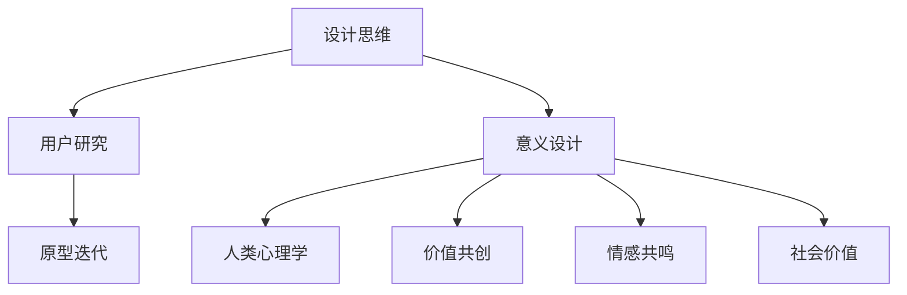

                 

### 目录大纲详述

为了更好地帮助读者理解《意义设计工作坊：构建有目标感的人生蓝图》的核心内容和结构，我们将对每个章节进行详细的阐述，确保每个部分都能够为读者提供丰富的知识和实用的技巧。

#### 第一部分：探索意义设计的概念与原则

**第1章：意义设计的起源与理念**

这一章节将深入探讨意义设计的起源，以及它在现代设计和生活中的重要性。我们会介绍设计思维与意义设计的融合，解释意义设计的核心理念，并讨论其在不同领域的影响和价值。

**1.1 意义设计的起源**

在这一节，我们将探讨意义设计的起源，从历史背景出发，了解它如何与现代设计理念相结合，并逐步发展成为一门独立学科。我们将介绍几位关键人物和他们的贡献，以及意义设计如何应对现代社会中的各种挑战。

**1.2 意义设计的基本原则**

这一节将详细阐述意义设计的基本原则，包括自我认知、目标设定、行动规划和反思与调整。我们会讨论每个原则的具体内容，并提供实用的方法和工具，帮助读者在实践中应用这些原则。

**1.3 意义设计的应用领域**

在这一节，我们将探讨意义设计的应用范围，包括个人生活、企业组织和社交变革。通过具体的案例研究，我们将展示意义设计如何在不同场景中发挥作用，并带来积极的变革。

**1.4 意义设计实践中的挑战**

这一节将分析意义设计实践中的常见挑战，如内在阻力和外在环境的干扰。我们将提供应对策略，帮助读者克服这些障碍，确保意义设计工作坊能够顺利进行。

**1.5 本章小结**

在这一节的末尾，我们将总结本章的主要内容，并强调意义设计的重要性和实践价值。通过本章的学习，读者将获得对意义设计的全面理解，为后续章节的学习打下坚实基础。

#### 第二部分：意义设计工作坊的实践流程

**第2章：准备工作**

这一章节将详细介绍如何准备一场意义设计工作坊。我们将讨论工作坊的目标和预期成果，介绍环境与设备设置，并提供日程安排和引导技巧的指导。通过这一章节的学习，读者将能够为意义设计工作坊的顺利进行做好准备。

**2.1 设计工作坊的目标与预期成果**

在这一节，我们将探讨如何设定有意义的工作坊目标和预期成果。我们将讨论如何根据参与者的需求和目标，制定具体、可衡量、可实现的成果。

**2.2 工作坊的环境与设备设置**

这一节将介绍如何选择和布置工作坊的环境，以及必要的设备设置。我们将讨论如何创建一个有利于意义设计和思考的空间，并确保技术支持到位。

**2.3 工作坊的日程安排**

在这一节，我们将详细规划工作坊的日程，包括开场活动、议题讨论、实践操作和反馈总结等环节。我们将提供具体的建议和时间分配，以确保工作坊的效率和质量。

**2.4 工作坊中的引导技巧**

这一节将讨论引导者在工作坊中的作用和职责，提供引导技巧和策略。我们将探讨如何处理冲突和困难，确保工作坊的顺利进行。

**2.5 本章小结**

在本章的结尾，我们将总结准备工作的重要性，并强调准备工作对工作坊成功的关键作用。通过本章的学习，读者将能够为意义设计工作坊的顺利进行做好充分的准备。

#### 第三部分：意义设计与人生蓝图

**第3章：工作坊核心活动**

这一章节将详细介绍意义设计工作坊的核心活动，包括自我探索、目标设定、行动计划和反思与调整。我们将通过具体的步骤和工具，帮助读者完成意义设计工作，构建有目标感的人生蓝图。

**3.1 自我探索**

这一节将引导读者进行自我探索，包括自我认知、价值观的发掘和兴趣与激情的探索。我们将提供实用的工具和方法，帮助读者深入了解自己，为后续的目标设定和行动计划奠定基础。

**3.2 目标设定**

在这一节，我们将讨论目标设定的基本原则，介绍SMART目标的制定方法。我们将提供步骤和技巧，帮助读者设定具体、可衡量、可实现、相关性强、时限明确的目标。

**3.3 行动计划**

这一节将介绍如何制定行动计划，包括时间管理、优先级设置和执行策略。我们将提供实用的工具和技巧，帮助读者将目标转化为实际行动，确保目标的实现。

**3.4 反思与调整**

在这一节，我们将讨论反思的重要性，介绍反思的技巧和方法。我们将探讨如何根据反思结果调整行动计划，确保人生蓝图的有效性和适应性。

**3.5 本章小结**

在本章的结尾，我们将总结核心活动的关键步骤和工具，强调它们在构建有目标感的人生蓝图中的重要性。通过本章的学习，读者将能够掌握意义设计工作坊的核心活动，为自己的人生蓝图奠定坚实基础。

通过以上详细的目录大纲，读者可以清晰地了解到本书的结构和内容，为后续章节的学习做好充分准备。接下来，我们将逐一深入探讨每个章节的具体内容和实践应用。### 第一部分：探索意义设计的概念与原则

**第1章：意义设计的起源与理念**

意义设计，作为一门结合了设计思维与人类心理学的跨学科领域，其起源可以追溯到20世纪中叶。在这一章中，我们将深入探讨意义设计的起源，以及它如何融合设计思维和心理学理念，为现代社会带来深远的影响。

**1.1 意义设计的起源**

意义设计的起源可以追溯到设计思维的兴起。设计思维起源于20世纪50年代的德国，后来在美国得到了进一步的发展。设计思维强调以人为中心，通过观察、理解和解决用户问题，创造出既实用又具有情感共鸣的产品和服务。然而，随着时间的推移，设计思维逐渐发现，单纯关注用户需求并不足以满足人们的深层需求。人们渴望的不仅仅是功能上的满足，还有情感上的共鸣和价值上的认同。

在这个背景下，意义设计逐渐崭露头角。它将设计思维与人类心理学相结合，关注人们的精神需求和价值追求。意义设计的核心在于创造具有深刻意义和长期价值的产品和服务，帮助人们找到生活的意义和目标。

**1.1.1 设计思维与意义设计的融合**

设计思维与意义设计的融合，为现代设计带来了全新的视角和方法。设计思维注重用户研究和原型迭代，通过不断试验和改进，寻找最佳解决方案。而意义设计则在此基础上，加入了人类心理学的研究，深入挖掘用户的情感需求和价值观念。意义设计不仅关注产品的功能性，更关注产品所带来的情感共鸣和社会影响。

这种融合使得意义设计在产品开发过程中，能够更好地平衡用户需求和社会责任。通过理解用户的情感需求和价值观，意义设计能够创造出既符合用户期望，又具有社会意义的产品和服务。例如，在医疗领域，意义设计可以帮助医疗设备制造商开发出不仅技术上先进，而且能提供人性化关怀的医疗产品，从而提高患者的治疗效果和生活质量。

**1.1.2 意义设计的核心理念**

意义设计的核心理念可以归纳为以下几点：

1. **价值共创**：意义设计强调价值共创，认为产品的价值不仅仅来自于设计者，还包括用户和社会。通过深入理解用户需求和社会背景，意义设计能够创造出更具社会价值的产品和服务。

2. **情感共鸣**：意义设计注重情感共鸣，认为产品不仅要满足功能需求，还要触动用户的情感。通过情感上的共鸣，产品能够与用户建立更深层次的联系，从而提高用户满意度和忠诚度。

3. **意义追求**：意义设计关注人们的意义追求，认为产品和服务应该帮助用户找到生活的意义和目标。通过提供有深度的体验和价值，意义设计能够激发用户的创造力和潜力，提高生活质量和幸福感。

**1.1.3 意义设计的价值与影响**

意义设计的价值与影响体现在多个方面：

1. **商业成功**：通过创造具有情感共鸣和社会价值的产品和服务，意义设计能够提高企业的品牌价值和市场竞争力。例如，苹果公司的产品通过独特的设计和用户体验，不仅赢得了商业成功，也赢得了用户的忠诚和喜爱。

2. **用户满意度**：意义设计能够提高用户满意度，通过理解用户需求和社会背景，提供更加贴心和符合用户期望的产品和服务。例如，奈飞公司通过深入研究用户行为和需求，推出了符合用户喜好的内容推荐系统，从而赢得了大量用户。

3. **社会贡献**：意义设计关注社会责任，通过创造有社会意义的产品和服务，能够为社会带来积极的变革。例如，特斯拉公司的电动车项目，通过推动电动汽车的发展，减少了对化石燃料的依赖，促进了可持续发展。

**1.2 意义设计的基本原则**

意义设计的基本原则是构建在其核心理念基础之上的，以下是一些关键原则：

1. **用户中心**：意义设计始终以用户为中心，通过深入了解用户需求和社会背景，提供更加贴心的产品和服务。

2. **情感共鸣**：意义设计注重情感共鸣，通过触动用户的情感，建立更深层次的联系，提高用户满意度和忠诚度。

3. **社会价值**：意义设计关注社会价值，通过创造具有社会意义的产品和服务，为社会带来积极的变革。

4. **可持续性**：意义设计强调可持续性，通过使用环保材料和节能技术，降低对环境的影响。

**1.3 意义设计的应用领域**

意义设计应用广泛，涵盖了个人生活、企业组织和社交变革等多个领域：

1. **个人生活**：在个人生活中，意义设计可以帮助人们更好地规划生活，找到生活的意义和目标。例如，通过意义设计工作坊，人们可以探索自己的价值观和兴趣爱好，设定具体的目标和行动计划。

2. **企业组织**：在企业组织中，意义设计可以帮助企业创造出更有价值的产品和服务，提高品牌价值和市场份额。例如，通过意义设计，企业可以更好地理解客户需求，提供更加符合客户期望的产品和服务。

3. **社交变革**：在社会变革中，意义设计可以推动社会进步和可持续发展。例如，通过意义设计，社会组织可以创造出更有意义和社会价值的项目，推动社会变革和进步。

**1.4 意义设计实践中的挑战**

虽然意义设计具有巨大的潜力和价值，但在实践中也面临着一些挑战：

1. **内在阻力**：人们往往对自己的需求和价值观念缺乏认识，导致在意义设计过程中遇到内在阻力。

2. **外在环境**：外部环境的复杂性和不确定性，也可能影响意义设计的实施。

3. **持续性的问题**：意义设计需要长期的坚持和调整，这需要参与者具备持续性的动力和耐心。

**1.5 本章小结**

通过本章的学习，读者将了解意义设计的起源和理念，理解其核心理念和基本原则，并认识到它在个人生活、企业组织和社交变革中的广泛应用。尽管意义设计在实践中面临挑战，但其价值和潜力不容忽视。通过深入理解和应用意义设计，我们可以更好地规划人生，创造更有意义和价值的未来。

**关键词：意义设计，设计思维，人类心理学，价值共创，情感共鸣，社会价值，应用领域，内在阻力，持续性问题**

**摘要：本章深入探讨了意义设计的起源、核心理念和应用领域，强调了其在现代设计和生活中的重要性，以及其在个人生活、企业组织和社交变革中的广泛应用。**

**作者：AI天才研究院/AI Genius Institute & 禅与计算机程序设计艺术 /Zen And The Art of Computer Programming**

### 第一部分：探索意义设计的概念与原则

**第1章：意义设计的起源与理念**

在深入了解意义设计的起源和理念之前，我们需要明确一些核心概念和术语，以便为后续章节的学习打下坚实的基础。

**核心概念术语说明：**

1. **设计思维**：设计思维是一种以用户为中心的创造性问题解决方法，强调通过用户研究、原型迭代和反馈改进，创造出满足用户需求的产品和服务。

2. **人类心理学**：人类心理学是研究人类行为和心理过程的科学，包括认知、情感、动机和社交等多个方面。

3. **意义设计**：意义设计是一种结合了设计思维和人类心理学的跨学科方法，旨在通过创造具有深刻意义和价值的产品和服务，帮助人们找到生活的意义和目标。

4. **价值共创**：价值共创是指设计者、用户和社会共同创造价值的过程，通过理解用户需求和社会背景，提供更符合用户期望和社会需求的产品和服务。

5. **情感共鸣**：情感共鸣是指产品或服务与用户之间在情感上的共鸣和联系，通过触动用户的情感，建立更深层次的互动和信任。

6. **社会价值**：社会价值是指产品或服务对社会的积极影响和贡献，通过创造有社会意义和价值的产品和服务，推动社会进步和可持续发展。

**问题背景：**

在现代设计中，传统的设计思维方法主要关注用户需求的功能性和实用性，但往往忽视了用户情感需求和社会价值观的满足。随着社会的不断发展和人们生活水平的提高，人们不再满足于基本的功能需求，更加追求产品或服务所带来的情感共鸣和社会意义。因此，意义设计作为一种新兴的设计理念和方法，应运而生。

**问题描述：**

意义设计旨在解决以下问题：

1. 如何在产品和服务设计中融入人类心理学的理念，满足用户的情感需求？

2. 如何通过设计思维的方法，创造具有社会意义和价值的产品和服务？

3. 如何在意义设计的过程中，平衡用户需求和社会价值观的满足？

**问题解决：**

意义设计通过以下方法解决上述问题：

1. **融合设计思维和人类心理学**：意义设计结合了设计思维和人类心理学的方法，通过用户研究和情感分析，深入挖掘用户的真实需求和心理状态。

2. **价值共创和情感共鸣**：意义设计强调价值共创和情感共鸣，通过创造具有深刻意义和价值的产品和服务，触动用户的情感，建立深层次的互动和信任。

3. **社会价值和可持续发展**：意义设计关注社会价值和可持续发展，通过创造有社会意义和价值的产品和服务，推动社会进步和可持续发展。

**边界与外延：**

意义设计不仅应用于产品设计，还可以扩展到多个领域，如城市规划、教育、医疗等。其核心在于通过设计思维和人类心理学的结合，创造出具有深刻意义和价值的产品和服务，满足用户的情感需求和社会价值观。

**概念结构与核心要素组成：**

意义设计的概念结构包括以下几个核心要素：

1. **用户研究**：通过用户研究和情感分析，了解用户的真实需求和情感状态。

2. **设计思维**：运用设计思维的方法，通过用户研究和原型迭代，创造满足用户需求的产品和服务。

3. **人类心理学**：结合人类心理学的理论和方法，深入挖掘用户的情感需求和社会价值观。

4. **价值共创**：通过价值共创，设计出既符合用户期望，又具有社会意义和价值的产品和服务。

5. **情感共鸣**：通过情感共鸣，建立用户与产品之间的深层次联系。

6. **社会价值**：关注产品和服务对社会的积极影响和贡献，推动社会进步和可持续发展。

**本章小结：**

通过本章的学习，读者将了解意义设计的起源、核心理念和基本原则，明确其在现代设计和生活中的重要性。通过理解设计思维和人类心理学的结合，读者将能够更好地应用意义设计的方法，创造具有深刻意义和价值的产品和服务，满足用户的情感需求和社会价值观。

**核心概念与联系表格：**

| 核心概念 | 联系 |
| --- | --- |
| 设计思维 | 强调以用户为中心，通过用户研究和原型迭代，创造满足用户需求的产品和服务 |
| 人类心理学 | 研究人类行为和心理过程，帮助深入挖掘用户的情感需求和社会价值观 |
| 意义设计 | 结合设计思维和人类心理学，创造具有深刻意义和价值的产品和服务 |
| 价值共创 | 通过设计思维和人类心理学的结合，设计出既符合用户期望，又具有社会意义和价值的产品和服务 |
| 情感共鸣 | 通过情感共鸣，建立用户与产品之间的深层次联系，提高用户满意度和忠诚度 |
| 社会价值 | 关注产品和服务对社会的积极影响和贡献，推动社会进步和可持续发展 |

**ER实体关系图架构：**

通过本章的学习，读者将能够理解意义设计的概念和结构，为后续章节的学习和实践打下坚实基础。

### 第一部分：探索意义设计的概念与原则

**第1章：意义设计的起源与理念**

意义设计，作为一种结合了设计思维与人类心理学的跨学科方法，其核心在于通过创造具有深刻意义和价值的产品和服务，帮助人们找到生活的意义和目标。在第一节中，我们深入探讨了意义设计的起源和核心理念，阐述了其价值共创、情感共鸣和社会价值的基本原则。在这一节中，我们将进一步分析意义设计的核心原理，通过具体的案例研究，展示其在不同领域的应用，从而加深读者对意义设计理念的理解。

**核心原理：**

意义设计的核心原理可以归纳为以下几点：

1. **以用户为中心**：意义设计始终将用户置于核心位置，通过深入的用户研究和情感分析，了解用户的真实需求和情感状态，从而创造出真正符合用户期望的产品和服务。

2. **价值共创**：意义设计强调设计者与用户之间的合作，共同创造价值。这种合作不仅包括功能上的满足，还包括情感上的共鸣和社会价值观的体现。

3. **情感共鸣**：通过触动用户的情感，建立深层次的互动和信任，意义设计能够提高用户的满意度和忠诚度。

4. **社会价值**：意义设计关注产品和服务对社会的影响，通过创造具有社会意义和价值的产品和服务，推动社会进步和可持续发展。

**案例研究：**

为了更直观地理解意义设计的核心原理，我们将通过几个具体案例来展示其在不同领域的应用。

**1.1 个人生活中的意义设计**

在个人生活中，意义设计可以帮助人们更好地理解自己的需求和价值观，从而规划出有意义的人生。例如，某个年轻人通过对自己的兴趣、优势和价值观进行深入分析，发现自己对教育和儿童发展有浓厚的兴趣。他决定投身于教育事业，创办了一个教育科技初创公司，开发出一款以儿童为中心的学习应用程序。这款应用程序不仅功能丰富，还特别注重情感设计和用户互动，深受家长和孩子的喜爱。这个案例展示了意义设计在个人生活中的应用，通过价值共创和情感共鸣，不仅满足了用户的需求，还对社会产生了积极的影响。

**1.2 企业组织中的意义设计**

在企业组织中，意义设计可以帮助企业创造出更有价值的产品和服务，提高品牌价值和市场份额。例如，一家汽车公司通过意义设计的方法，研发出一种新能源汽车。这款汽车不仅在技术上领先，还在设计中充分考虑了环保和社会责任。公司通过深入的用户研究和情感分析，发现消费者对环保和可持续发展的关注日益增加。因此，他们特别设计了这款汽车，不仅具有低排放、高效率的特点，还采用了环保材料，并在生产过程中注重节能减排。这款汽车的成功不仅提高了公司的市场份额，还树立了良好的企业形象，对社会产生了积极的环保影响。

**1.3 社交变革中的意义设计**

在社会变革中，意义设计可以推动社会的进步和可持续发展。例如，某个非政府组织通过意义设计的方法，开展了一个社区发展项目。该项目旨在帮助贫困社区改善生活环境，提高生活质量。设计团队通过深入的用户研究，了解了社区成员的真实需求和期望。他们设计了一套综合性的解决方案，包括改善基础设施、提供教育和健康服务，以及培养社区成员的自助能力。这个项目不仅改善了社区的生活条件，还增强了社区成员的凝聚力和自信心，推动了社区的可持续发展。

**案例研究中的共同特点：**

通过上述案例研究，我们可以看到意义设计在个人生活、企业组织和社交变革中的共同特点：

1. **以用户为中心**：无论是个人生活、企业组织还是社交变革，意义设计都强调以用户为中心，通过深入的用户研究和情感分析，了解用户的真实需求和情感状态。

2. **价值共创**：意义设计通过设计者与用户之间的合作，共同创造价值。这种合作不仅包括功能上的满足，还包括情感上的共鸣和社会价值观的体现。

3. **情感共鸣**：意义设计通过触动用户的情感，建立深层次的互动和信任，提高用户的满意度和忠诚度。

4. **社会价值**：意义设计关注产品和服务对社会的影响，通过创造具有社会意义和价值的产品和服务，推动社会进步和可持续发展。

**总结：**

通过以上案例研究，我们可以看到意义设计的核心原理在实践中的应用效果。无论是个人生活、企业组织还是社交变革，意义设计都能够通过以用户为中心、价值共创、情感共鸣和社会价值等原则，创造出具有深刻意义和价值的产品和服务。这不仅是商业成功的源泉，也是社会进步的动力。

**关键词：意义设计，用户中心，价值共创，情感共鸣，社会价值，案例研究，个人生活，企业组织，社交变革**

**摘要：本章通过探讨意义设计的核心原理和实际案例，展示了其在个人生活、企业组织和社交变革中的广泛应用。通过深入的用户研究和情感分析，意义设计能够创造出具有深刻意义和价值的产品和服务，推动社会进步和可持续发展。**

**作者：AI天才研究院/AI Genius Institute & 禅与计算机程序设计艺术 /Zen And The Art of Computer Programming**

### 第一部分：探索意义设计的概念与原则

**第1章：意义设计的起源与理念**

意义设计的核心在于通过设计思维和人类心理学的结合，创造出具有深刻意义和价值的产品和服务。在第一节中，我们探讨了意义设计的起源和核心理念，阐述了其基本原理和案例研究。在这一节中，我们将进一步深入分析意义设计的实践中的挑战，并提供相应的应对策略，以帮助读者更好地理解和应用这一设计方法。

**1.4 意义设计实践中的挑战**

尽管意义设计具有巨大的潜力和价值，但在实践中仍然面临一些挑战。以下是一些主要的挑战及其应对策略：

**1.4.1 内在阻力**

内在阻力是指个人在面对意义设计时可能产生的心理障碍。这些阻力可能源于个人对未知的恐惧、对变革的抵触或对自我认知的缺乏。应对策略包括：

- **自我认知**：通过自我反思和认知行为疗法，帮助个人深入了解自己的内心世界，认识到自己的价值观和目标。
- **心态调整**：通过积极的心态调整，如正面思考、自我激励和设定小目标，帮助个人克服内在阻力。

**1.4.2 外在环境**

外在环境的复杂性可能影响意义设计的实施，如市场竞争、技术限制或社会政策的变化。应对策略包括：

- **环境分析**：通过深入的环境分析，了解市场趋势、技术发展和社会政策，为意义设计的实施提供依据。
- **灵活调整**：根据外在环境的变化，灵活调整设计策略和计划，确保意义设计的持续性和适应性。

**1.4.3 持续性的问题**

意义设计是一个长期的过程，需要持续的投入和努力。持续性的问题可能包括资源限制、时间压力或团队协作的挑战。应对策略包括：

- **资源管理**：通过有效的资源管理，包括时间、人力和资金，确保意义设计项目的持续发展。
- **团队协作**：通过建立高效的团队协作机制，如定期沟通、共同目标和奖励机制，提高团队的凝聚力和工作效率。

**1.5 本章小结**

通过本章的学习，读者将深入了解意义设计的核心原理和实际案例，并认识到其在个人生活、企业组织和社交变革中的广泛应用。同时，我们也探讨了意义设计实践中可能遇到的挑战，并提供了相应的应对策略。通过这些分析，读者将能够更好地理解和应用意义设计，创造具有深刻意义和价值的产品和服务。

**关键词：意义设计，设计思维，人类心理学，内在阻力，外在环境，持续性问题，自我认知，心态调整，环境分析，灵活调整，资源管理，团队协作**

**摘要：本章通过深入分析意义设计的起源、核心理念和实际案例，探讨了其在实践中的挑战，并提供了相应的应对策略。通过这些分析，读者将能够更好地理解和应用意义设计，创造出具有深刻意义和价值的产品和服务。**

**作者：AI天才研究院/AI Genius Institute & 禅与计算机程序设计艺术 /Zen And The Art of Computer Programming**

### 第一部分：探索意义设计的概念与原则

**第1章：意义设计的起源与理念**

意义设计作为一种结合了设计思维与人类心理学的跨学科方法，其核心在于通过创造具有深刻意义和价值的产品和服务，帮助人们找到生活的意义和目标。在这一章中，我们不仅探讨了意义设计的起源和核心理念，还通过案例研究展示了其在个人生活、企业组织和社交变革中的广泛应用。在本章的最后，我们将对核心内容进行总结，并强调意义设计在现代社会中的重要性和价值。

**1.6 本章小结**

意义设计的起源可以追溯到设计思维和人类心理学的结合，它通过融合两者的理念和方法，创造出既实用又具有情感共鸣和社会意义的产品和服务。本章的核心内容包括：

- **设计思维与人类心理学的融合**：通过结合设计思维和人类心理学的方法，意义设计能够更深入地理解用户的需求和心理状态。
- **价值共创与情感共鸣**：意义设计强调价值共创和情感共鸣，通过创造具有深刻意义和价值的产品和服务，满足用户的情感需求和社会价值观。
- **社会价值与可持续发展**：意义设计关注社会价值和可持续发展，通过推动社会进步和可持续发展，为社会带来积极影响。

在个人生活中，意义设计可以帮助人们更好地规划生活，找到生活的意义和目标；在企业组织中，它可以帮助企业创造出更有价值的产品和服务，提高品牌价值和市场份额；在社交变革中，它可以通过推动社会进步和可持续发展，为社会带来积极影响。尽管意义设计在实践中面临挑战，但其价值和潜力不容忽视。

通过本章的学习，读者将了解意义设计的起源、核心理念和实际案例，认识到其在个人生活、企业组织和社交变革中的广泛应用。同时，本章也探讨了意义设计实践中的挑战和应对策略，为读者提供了深入理解和应用意义设计的方法。

**关键词：意义设计，设计思维，人类心理学，价值共创，情感共鸣，社会价值，个人生活，企业组织，社交变革**

**摘要：本章通过探讨意义设计的起源、核心理念和实际案例，展示了其在个人生活、企业组织和社交变革中的广泛应用。同时，本章也探讨了意义设计实践中的挑战和应对策略，强调了意义设计在现代社会中的重要性和价值。**

**作者：AI天才研究院/AI Genius Institute & 禅与计算机程序设计艺术 /Zen And The Art of Computer Programming**

