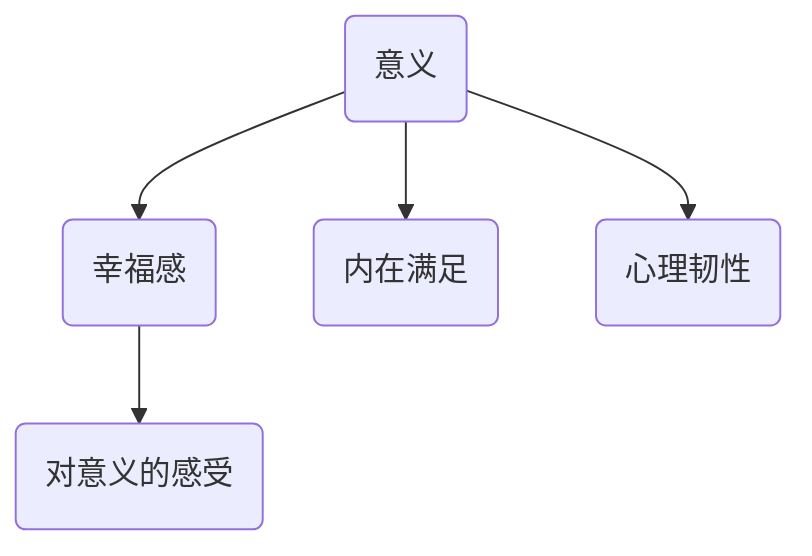

                 

# 意义设计师认证：培训人生目标规划专家

## 关键词

- 意义设计师
- 人生目标规划
- 自我认知
- 激励策略
- 心理韧性
- 技术与实践

## 摘要

本文旨在探讨意义设计师认证的过程及其在人生目标规划中的重要性。文章首先介绍了现代社会中的人生意义危机，随后阐述了人生目标规划的概念及其对个人成长的影响。接着，文章详细分析了设计人生意义的基础概念，包括意义的定义、来源及其与幸福的关系。在此基础上，文章逐步介绍了设计人生意义的步骤，包括自我评估、目标设定和制定行动计划。随后，文章探讨了意义设计师的技能与实践，以及人生目标规划的具体实践。最后，文章针对遇到挑战与解决问题的策略进行了讨论，并对全书进行了总结与展望。通过本文，读者将能够全面了解意义设计师认证的内涵，掌握人生目标规划的方法，为自身的成长和发展奠定坚实基础。

## 第1章 引言

### 1.1 设计人生意义的背景

在现代社会中，随着物质生活水平的提高，人们对于精神需求的追求也越来越强烈。然而，许多人却在面对生活的挑战时感到迷茫和困惑，这种困惑源于他们对自身人生意义的缺乏认知。人生意义危机成为了现代社会普遍存在的问题。

首先，物质生活的富足并未能带来普遍的幸福感受。许多人虽然拥有了丰富的物质财富，但内心仍然感到空虚和失落。这种状况的出现，很大程度上是因为他们缺乏明确的人生目标和方向。

其次，快节奏的生活方式和高度竞争的社会环境给人们带来了巨大的压力。在这种环境下，人们往往忙于应对日常琐事，无暇思考自己的人生意义。这种状态进一步加剧了人生意义危机的严重性。

最后，随着社会多元化的发展，人们面临的价值观冲突和选择困惑也在增加。在这种情况下，许多人难以找到与自己价值观相符的人生目标，从而陷入了意义的迷失。

### 1.2 人生目标的规划

人生目标规划是人们为了实现自身价值、追求幸福所设定的一系列目标和计划。一个明确的人生目标不仅可以指引人们前进的方向，还能激发内在的动力，使人们在面对困难和挑战时保持积极的心态。

首先，人生目标规划有助于提升个人的自我认知。通过设定目标，人们可以更清晰地认识自己的兴趣、能力和价值观，从而找到适合自己的发展方向。

其次，人生目标规划有助于增强个人的心理韧性。在实现目标的过程中，人们会遇到各种困难和挫折，而通过设定合理的计划和目标，人们可以更好地应对这些挑战，培养出坚韧不拔的品质。

最后，人生目标规划有助于提升个人的生活质量。一个明确的人生目标可以让人们更有针对性地规划自己的生活，从而在职业、家庭、社交等方面取得更好的成就，享受更加充实和幸福的生活。

### 1.3 本书结构

本书共分为七个章节，旨在全面探讨意义设计师认证的过程及其在人生目标规划中的应用。具体结构如下：

- **第1章 引言**：介绍设计人生意义的背景、人生目标规划的重要性以及本书的结构。
- **第2章 设计人生意义的基础概念**：讨论意义的定义、来源及其与幸福的关系。
- **第3章 设计人生意义的步骤**：详细分析自我评估、目标设定和制定行动计划的步骤。
- **第4章 意义设计师的技能与实践**：探讨意义设计师的沟通与激励技能、认证流程以及实际案例分析。
- **第5章 人生目标规划的具体实践**：针对职业规划、学习规划和生活规划进行具体讨论。
- **第6章 遇到挑战与解决问题的策略**：讨论面对挫折、变化和不确定性时的心理调整策略。
- **第7章 总结与展望**：对全书进行总结，并展望人生意义设计的未来趋势。

通过本书的学习，读者将能够全面了解意义设计师认证的内涵，掌握人生目标规划的方法，为自身的成长和发展奠定坚实基础。

## 第2章 设计人生意义的基础概念

### 2.1 意义的内涵与类型

意义是人类精神世界的重要组成部分，它不仅关乎个体内心的满足感，还影响着个体的行为和决策。在深入探讨人生意义之前，我们需要首先了解意义的内涵和类型。

**内涵**：

意义通常被定义为一种内在的价值或目的，它使个体的生活具有意义和目标。意义的内涵可以从以下几个方面进行理解：

1. **目的性**：意义往往与个体的目标或愿望相联系。一个有意义的生活通常是一个有目标的生活，个体通过实现这些目标来感受到生活的价值。
2. **价值感**：意义使个体感到生活有价值和重要性。这种价值感可以来自于对自身、他人或社会的贡献，也可以来自于对美好事物的追求。
3. **内在驱动力**：意义能够激发个体的内在驱动力，使个体在面对困难和挑战时保持积极和坚韧。

**类型**：

意义的类型可以分为多种，以下是一些主要类型：

1. **个人意义**：个人意义是个体根据自己的兴趣、价值观和信念所定义的意义。这种意义往往与个体的自我认知和成长密切相关。
2. **职业意义**：职业意义与个体的工作或职业相关，它体现了个体在工作中的成就感和价值感。一个有意义的职业通常能够满足个体的自我实现需求。
3. **社会意义**：社会意义是指个体在更大社会环境中的角色和作用，它反映了个体对社会和他人的贡献。一个有意义的社会角色可以使个体感受到自身的价值和重要性。
4. **存在意义**：存在意义是一种更为深层次的哲学意义，它涉及到人类存在的意义和目的。这种意义往往与个体的信仰、哲学思考和生命观相关。

### 2.2 人生意义的来源

人生意义的来源是多样化的，它可以来自于个体的内心世界，也可以来自于外部环境。以下是几种主要来源：

**自我探索**：

自我探索是寻找人生意义的重要途径。通过深入了解自己的兴趣、价值观和信念，个体可以发现对自己有意义的事物。自我探索可以帮助个体明确自己的人生目标和方向，从而更好地规划自己的人生。

**社会关系**：

社会关系对人生意义具有重要影响。与家人、朋友和同事建立积极的关系，可以给予个体支持和鼓励，使个体感受到自身的价值和重要性。此外，社会关系还可以为个体提供机会，帮助个体实现自己的目标和梦想。

**职业使命**：

职业使命是许多人寻找人生意义的重要来源。一个有意义的工作可以使个体在实现自身价值的同时，为他人和社会做出贡献。职业使命可以激发个体的内在动力，使个体在面对工作挑战时保持积极和坚韧。

### 2.3 意义与幸福的关系

意义与幸福之间存在密切的关系。一个有意义的生活往往能带来更高的幸福感，而幸福感也反过来影响个体对意义的感受。

**意义对幸福的影响**：

1. **目标导向**：有意义的生活通常具有明确的目标和方向，这使个体能够更有针对性地追求自己的幸福。
2. **内在满足**：意义使个体感受到生活的价值，从而在实现目标的过程中获得内在满足，提升幸福感。
3. **心理韧性**：一个有意义的生活可以增强个体的心理韧性，使个体在面对挫折和困难时保持积极的心态，从而提升幸福感。

**幸福与意义的关系模型**：

图1显示了幸福与意义之间的关系模型。该模型认为，意义是幸福的重要基础，而幸福又反过来影响个体对意义的感受。

### 2.4 意义设计师的角色

意义设计师是专门从事人生意义设计和规划的专业人士。他们的主要职责是帮助个体发现和实现人生意义，提升个体的幸福感和生活质量。

意义设计师的角色包括：

1. **引导者**：意义设计师作为专业的引导者，帮助个体进行自我探索和目标设定，引导个体找到自己的人生意义。
2. **支持者**：意义设计师在个体实现人生目标的过程中提供支持和鼓励，帮助个体克服困难和挫折。
3. **顾问**：意义设计师为个体提供专业的建议和指导，帮助个体在职业规划、学习规划和生活规划方面做出明智的决策。

通过本书的进一步学习，读者将能够深入了解人生意义的内涵和类型，理解人生意义的来源，以及意义与幸福之间的关系。这些知识将有助于读者更好地设计自己的人生意义，提升个人的幸福感和生活质量。

## 第3章 设计人生意义的步骤

### 3.1 自我评估

自我评估是设计人生意义的第一步，它有助于个体深入了解自己的兴趣、能力和价值观，从而为后续的人生目标设定提供依据。以下是自我评估的几个关键步骤：

**1. 自我认知**：

自我认知是指了解自己的个性特点、兴趣爱好、优点和缺点。这一过程可以通过以下方法进行：

- **日记记录**：每天记录自己的想法、感受和行为，分析自己在不同情境下的表现，从而更好地认识自己。
- **心理咨询**：通过专业的心理咨询，个体可以获得更深入的自我认知，了解自己的心理特点和潜在需求。
- **反馈收集**：向家人、朋友和同事收集关于自己的反馈，了解他人眼中的自己，从而更全面地认识自己。

**2. 能力分析**：

能力分析是指评估自己的技能和知识水平，了解自己在哪些方面具备优势，在哪些方面需要提升。以下是几种能力分析的方法：

- **技能清单**：列出自己已经掌握的技能和知识，评估其在实际应用中的熟练程度。
- **成就记录**：记录自己在过去取得的成就，分析这些成就背后的能力和资源。
- **测试评估**：通过专业的技能测试和知识评估，了解自己的实际能力和水平。

**3. 价值观探讨**：

价值观探讨是指识别和明确自己的核心价值观，这些价值观将指导个体在人生道路上的选择和行为。以下是几种价值观探讨的方法：

- **反思法**：通过反思自己的生活经历和重大决策，识别出那些对自己有重要意义的价值观。
- **价值观排序**：列出自己认为最重要的几个价值观，并按照重要性进行排序。
- **与他人讨论**：与家人、朋友和同事讨论自己的价值观，听取他们的意见和建议。

通过以上步骤，个体可以全面了解自己的兴趣、能力和价值观，为后续的人生目标设定和行动计划制定提供坚实的依据。

### 3.2 目标设定

目标设定是设计人生意义的关键步骤，一个明确且合理的目标能够引导个体朝着有意义的方向前进。以下是目标设定的几个关键原则和方法：

**1. 目标设定的原则**：

- **具体性**：目标应当具体明确，而非模糊宽泛。具体的目标有助于个体更好地理解和实现它们。
- **可行性**：目标应当具有可行性，符合个体的实际能力和资源条件。过高的目标可能导致个体产生挫败感，而过低的目标则可能失去激励作用。
- **重要性**：目标应当与个体的核心价值观和长远目标相符，具有实际意义。
- **时效性**：目标应当设定明确的完成时间，有助于个体进行时间管理和任务规划。

**2. SMART目标法**：

SMART目标是具体性（Specific）、明确性（Measurable）、可实现性（Achievable）、相关性（Relevant）和时效性（Time-bound）的简称。这是一种常用的目标设定方法，以下是具体步骤：

- **具体性**：明确目标的具体内容和预期结果，避免模糊和抽象的描述。
- **明确性**：设定可衡量的指标，以便在目标实现时进行评估和调整。
- **可实现性**：确保目标在当前环境和资源条件下是可以实现的，避免设定过高的目标。
- **相关性**：确保目标与个体的长远规划和核心价值观相符。
- **时效性**：设定明确的完成时间，有助于个体进行时间管理和任务规划。

**3. 长期与短期目标的关系**：

在设定目标时，个体需要考虑长期目标和短期目标之间的关系。长期目标是指导个体长远发展的方向，而短期目标是实现长期目标的阶段性成果。

- **长期目标**：通常是指在未来几年或几十年内要实现的宏大目标，如职业发展、家庭建设、个人成长等。
- **短期目标**：通常是指在未来几个月或一年内要实现的具体目标，如学习新技能、完成某项任务、参加某项活动等。

长期目标和短期目标之间是相辅相成的，短期目标是实现长期目标的具体步骤和阶段性成果。通过设定合理的长期和短期目标，个体可以更好地规划和实现自己的人生目标。

通过以上步骤，个体可以有效地设定自己的人生目标，为后续的行动计划制定和实现提供明确的指导。在目标设定的过程中，个体需要保持积极的态度，不断调整和完善目标，以适应自身发展和外部环境的变化。

### 3.3 制定行动计划

制定行动计划是设计人生意义的最后一步，它是将目标转化为现实的关键环节。一个明确的行动计划可以帮助个体合理安排时间和资源，确保目标能够按时实现。以下是制定行动计划的几个关键步骤：

**1. 行动计划的制定**：

- **分解目标**：将长期目标分解为一系列短期目标，并将短期目标进一步分解为具体的任务和行动。每个任务和行动都应当是具体且可执行的。
- **设定优先级**：根据目标的紧急性和重要性，为每个任务和行动设定优先级。优先处理重要且紧急的任务，以保持整体进度的连续性和高效性。
- **时间安排**：为每个任务和行动设定具体的时间安排，确保任务能够在预定的时间内完成。可以使用时间管理工具，如日历或时间管理软件，来帮助个体进行时间安排和任务跟踪。

**2. 时间管理**：

- **设定时间限制**：为每个任务和行动设定具体的时间限制，以避免拖延和浪费时间。例如，每天安排一定时间进行学习或工作，并确保在这段时间内专注于任务。
- **避免多任务处理**：尽量减少多任务处理，将注意力集中在单一任务上，以提高工作效率和完成质量。
- **定期检查进度**：定期检查任务和行动的进度，并根据实际情况进行调整。这有助于确保计划能够按时完成，并及时发现和解决问题。

**3. 资源整合**：

- **资源识别**：识别和了解实现目标所需的资源，包括时间、金钱、人脉和信息等。明确资源的来源和获取方式，以便在需要时能够有效地利用。
- **资源分配**：合理分配资源，确保每个任务和行动都能够得到足够的支持。在资源有限的情况下，要优先保障重要任务的资源需求。
- **资源管理**：定期评估和调整资源的利用情况，确保资源的高效使用。例如，通过优化时间安排和任务分配，提高资源的使用效率。

通过以上步骤，个体可以制定出合理的行动计划，确保目标能够有序、高效地实现。在执行行动计划的过程中，个体需要保持灵活和适应性，根据实际情况及时调整计划，以应对外部环境的变化和内部能力的提升。通过持续的努力和调整，个体最终能够实现自己的人生目标，实现人生意义的设计。

## 第4章 意义设计师的技能与实践

### 4.1 意义沟通与激励

意义设计师在帮助他人设计人生意义的过程中，需要具备出色的沟通和激励技能。这些技能不仅有助于建立信任和共识，还能激发个体的内在动力，推动其朝着目标前进。

**1. 沟通技巧**：

- **倾听**：倾听是有效沟通的基础。意义设计师需要认真倾听个体的需求和期望，理解他们的情感和立场，从而提供有针对性的建议和支持。
- **同理心**：同理心是指站在他人的立场思考问题，感同身受。通过同理心，意义设计师能够更好地理解个体的内心世界，建立真诚的沟通关系。
- **清晰表达**：意义设计师需要用简单明了的语言表达自己的观点和建议，确保个体能够准确理解和接受。

**2. 激励策略**：

- **目标激励**：通过设定明确且具有挑战性的目标，激发个体的内在动力，使其不断追求进步和成长。
- **奖励激励**：适时给予个体奖励，如认可、赞美或物质激励，以增强其自信心和积极性。
- **角色模范**：通过分享成功案例和角色模范，展示实现人生意义的可能性和价值，激发个体的共鸣和动力。

**3. 帮助他人找到意义**：

- **自我探索**：引导个体进行自我探索，发现自身的兴趣、价值观和激情，找到与自己内心契合的意义。
- **社会参与**：鼓励个体参与社会活动，通过为他人和社会做贡献来寻找和实现意义。
- **职业使命**：帮助个体找到与职业相关的使命和目标，使工作成为实现人生意义的一部分。

通过有效的沟通和激励，意义设计师能够帮助个体更好地理解自己，找到人生的意义和目标，从而实现个人成长和幸福。

### 4.2 意义设计师的认证流程

成为合格的意义设计师需要经过严格的认证流程。以下是一般认证流程的步骤和标准：

**1. 认证标准**：

- **理论基础**：掌握心理学、哲学、社会学等相关学科的基本理论和知识。
- **实践经验**：具有丰富的咨询和辅导经验，能够独立完成人生意义设计项目。
- **专业技能**：熟练掌握沟通技巧、激励策略和人生规划方法。
- **职业道德**：具备良好的职业道德和职业素养，能够尊重和保护客户的隐私和权益。

**2. 认证流程**：

- **学习课程**：参加由认证机构提供的学习课程，包括理论知识和实践技能培训。
- **实践训练**：在导师的指导下，进行实际案例的咨询和辅导，积累实践经验。
- **考核评估**：通过理论考试、实践评估和面试，检验学员的理论水平和实际能力。
- **颁发证书**：通过考核后，学员将获得由认证机构颁发的意义设计师证书。

**3. 认证后的职业发展**：

- **职业规划**：根据个人兴趣和特长，选择合适的职业方向，如个人咨询师、企业培训师、人生规划师等。
- **持续学习**：不断学习和更新知识，提升专业技能和职业素养，以适应不断变化的市场需求。
- **职业认证**：参加更高层次的职业认证，如国际认证，提升职业竞争力。

通过严格的认证流程，意义设计师可以不断提升自己的专业水平，为客户提供高质量的服务，实现自身的职业价值和人生意义。

### 4.3 意义设计案例分析

为了更好地理解意义设计师的工作内容和实际应用，以下将介绍几个典型的意义设计案例：

**案例一：职场转型**

**问题描述**：张先生是一名在一家大型企业工作了10年的高级管理人员，但随着企业的转型和业务调整，他发现自己不再适应现有的工作环境，感到迷茫和失落。

**解决方案**：

- **自我评估**：意义设计师通过与张先生深入交流，了解他的兴趣、价值观和职业愿景。通过心理测试和技能评估，明确了张先生的优势和不足。
- **目标设定**：在明确张先生的核心价值观和职业兴趣后，意义设计师帮助他设定了新的职业目标，如成为一名创业者或加入一家初创公司。
- **行动计划**：意义设计师协助张先生制定了详细的行动计划，包括参加创业培训、建立人脉网络和准备创业资金等。

**案例结果**：经过一段时间的学习和实践，张先生成功转型为一名创业者，创办了一家专注于绿色能源解决方案的公司，实现了职业目标和人生意义的转变。

**案例二：创业历程**

**问题描述**：李女士是一名软件工程师，她有一个创业梦想，但面临资金不足、经验不足和市场不确定性等挑战。

**解决方案**：

- **意义沟通**：意义设计师与李女士进行了多次深入的沟通，了解她的创业愿景和面临的困难。通过同理心和鼓励，帮助她建立信心。
- **激励策略**：意义设计师运用目标激励和奖励激励，帮助李女士设定阶段性目标，并在实现目标后给予认可和奖励。
- **资源整合**：意义设计师帮助李女士寻找投资人、合作伙伴和市场资源，提供创业指导和支持。

**案例结果**：在意义设计师的帮助下，李女士成功获得了投资，组建了团队，推出了首款产品，创业梦想逐渐实现。

**案例三：公益项目**

**问题描述**：王先生是一名医生，他希望将自己的专业知识和技能用于帮助贫困地区的孩子们。

**解决方案**：

- **自我探索**：意义设计师帮助王先生探索他的兴趣和价值观，明确他希望通过公益项目实现的意义。
- **社会参与**：意义设计师协助王先生联系公益组织，了解相关需求，并提供公益项目的策划和支持。
- **职业使命**：意义设计师鼓励王先生将自己的职业使命与公益事业相结合，使他在职业工作中也能实现人生意义。

**案例结果**：在意义设计师的帮助下，王先生发起了一项公益项目，为贫困地区的孩子们提供免费的医疗救治和健康教育，实现了他的社会价值和人生意义。

通过这些案例，可以看出意义设计师在帮助个体实现人生目标和意义方面的重要作用。他们不仅提供了专业的指导和帮助，还通过激励和沟通，激发个体的内在动力，推动其朝着目标前进。这些案例也展示了意义设计师在各个领域中的实际应用和价值。

### 第5章 人生目标规划的具体实践

#### 5.1 职业规划

职业规划是人生目标规划中至关重要的一环，它涉及到个人的职业选择、职业发展路径、职业技能提升和职业转型策略。以下将详细探讨职业规划的具体实践。

**1. 职业发展路径**

职业发展路径是指个体在职业生涯中从起点到终点的全过程。一个清晰的职业发展路径可以帮助个体明确自己的职业目标，合理安排时间和资源，实现职业成长。

- **起步阶段**：在这个阶段，个体需要选择适合自己的职业方向，积累基本的职业技能和经验。可以通过实习、兼职或短期项目等方式，了解不同职业的特点和要求。
- **成长阶段**：在成长阶段，个体需要不断提升自己的专业技能和知识，通过参与培训、学习新技能和项目实践，提高自己的职业竞争力。
- **成熟阶段**：在成熟阶段，个体已经具备一定的职业经验和能力，可以在现有岗位上承担更多的责任和挑战，同时也可以考虑向更高的职位晋升。
- **稳定阶段**：在稳定阶段，个体已经实现了职业目标，进入职业生涯的后期。此时，个体可以关注职业的可持续性，考虑职业转型或退休规划。

**2. 职业技能提升**

职业技能提升是职业规划的核心内容，它关系到个体在职业市场中的竞争力和发展潜力。以下是一些提升职业技能的方法：

- **自我学习**：通过阅读专业书籍、参加线上课程和研讨会，不断学习新知识和技能。
- **实践经验**：通过参与项目、实习或兼职，将理论知识应用到实际工作中，积累实践经验。
- **专业认证**：通过参加专业认证考试，获得相关证书，提升自己的专业水平。
- **团队合作**：在团队中与同事合作，学习他们的工作方法和经验，提高自己的协作能力。

**3. 职业转型策略**

职业转型是指在职业生涯中从一种职业转向另一种职业。职业转型需要个体有清晰的职业目标、合理的规划以及适应新职业的能力。

- **评估自身**：在考虑职业转型前，个体需要评估自己的兴趣、价值观、能力和市场需求，确保转型方向与自身匹配。
- **规划转型路径**：根据自身情况和市场需求，设定合理的职业转型目标，并制定详细的转型计划，包括学习新技能、积累实践经验等。
- **寻找支持**：在职业转型过程中，个体可以寻求家人、朋友和专业人士的支持和指导，确保转型顺利进行。

通过职业规划的具体实践，个体可以更好地实现自己的职业目标，提升职业竞争力，实现人生价值和意义。

#### 5.2 学习规划

学习规划是人生目标规划的重要组成部分，它关系到个体在知识和技能上的成长，以及职业生涯的发展。以下将详细探讨学习规划的具体实践。

**1. 学习目标设定**

学习目标是指个体在学习和成长过程中设定的具体目标和期望。设定明确的学习目标有助于个体集中精力，有针对性地进行学习和提升。

- **短期目标**：短期目标通常是指在未来几个月或一年内要实现的具体学习目标。例如，学习一门新语言、掌握一项新技能或通过一项专业考试。
- **长期目标**：长期目标通常是指在未来几年内要实现的学习目标和成就。例如，完成学位教育、获得专业认证或成为某一领域的专家。

设定学习目标时，应遵循以下原则：

- **具体性**：学习目标应当具体明确，而非模糊宽泛。例如，"学习编程"不如"掌握Python编程语言"具体。
- **可行性**：学习目标应当具有可行性，符合个体的实际情况和资源条件。过高的目标可能导致个体产生挫败感，而过低的目标则可能失去激励作用。
- **重要性**：学习目标应当与个体的职业规划和发展方向相符，具有实际意义。

**2. 学习方法选择**

选择合适的学习方法是实现学习目标的关键。以下是一些常用的学习方法：

- **主动学习**：主动学习是指个体通过自主学习、解决问题和深入思考来获取知识和技能。这种方法强调个体的主动参与和自我驱动。
- **合作学习**：合作学习是指个体通过与他人合作、讨论和分享来学习和成长。这种方法有助于提高学习效率，激发创造力和创新思维。
- **实践学习**：实践学习是指个体通过实际操作、项目实践和动手实验来掌握知识和技能。这种方法能够将理论知识转化为实际能力，增强学习的实际效果。
- **反思学习**：反思学习是指个体在学习过程中进行自我反思和评估，总结经验教训，不断提升学习效果。

**3. 学习资源整合**

学习资源的整合是提高学习效率和效果的重要手段。以下是一些学习资源的整合方法：

- **网络资源**：利用互联网平台，如在线课程、学术网站和专业论坛，获取丰富的学习资源。
- **图书馆资源**：利用图书馆的书籍、期刊和数据库，获取专业的学习资料。
- **专业人士**：寻求专业人士的指导和建议，获取专业知识和经验。
- **社交网络**：通过社交网络，如学术团体和专业社群，结识同行和专业人士，分享学习资源和经验。

通过有效的学习规划，个体可以明确学习目标，选择合适的学习方法，整合丰富的学习资源，不断提升自己的知识和技能，实现个人成长和职业发展。

#### 5.3 生活规划

生活规划是人生目标规划中的重要组成部分，它关系到个体的身心健康、家庭和谐以及个人幸福。以下将详细探讨生活规划的具体实践。

**1. 生活目标设定**

生活目标是指导个体生活方向的指南针，它涵盖了职业、家庭、社交和个人成长等多个方面。设定明确的生活目标有助于个体合理安排时间和资源，实现全面的发展。

- **短期目标**：短期目标通常是指在未来几个月或一年内要实现的具体生活目标。例如，改善家庭环境、参加一次旅行或完成一次健康检查。
- **长期目标**：长期目标通常是指在未来几年内要实现的生活目标和成就。例如，完成家庭装修、抚养孩子到成年或实现退休规划。

设定生活目标时，应遵循以下原则：

- **具体性**：生活目标应当具体明确，而非模糊宽泛。例如，"改善生活质量"不如"购买一辆新车"具体。
- **可行性**：生活目标应当具有可行性，符合个体的实际情况和资源条件。过高的目标可能导致个体产生挫败感，而过低的目标则可能失去激励作用。
- **重要性**：生活目标应当与个体的核心价值观和长期目标相符，具有实际意义。

**2. 生活品质提升**

生活品质的提升是生活规划的核心内容，它关系到个体的幸福感和满足感。以下是一些提升生活品质的方法：

- **健康生活**：关注身体健康，定期进行体检，保持良好的生活习惯，如合理饮食、适量运动和充足睡眠。
- **家庭和谐**：营造温馨的家庭氛围，关注家庭成员的情感需求，积极参与家庭活动和沟通，建立和谐的家庭关系。
- **社交网络**：拓展社交网络，与朋友和同事保持良好的关系，参与社交活动，增强社交能力和情感支持。
- **个人成长**：关注个人成长和自我提升，不断学习新知识和技能，追求个人目标和梦想。

**3. 生活平衡策略**

生活平衡是实现幸福生活的重要策略，它涉及到工作、生活、家庭和个人成长等多个方面的平衡。以下是一些实现生活平衡的方法：

- **时间管理**：合理安排时间，确保工作和生活之间的平衡。可以通过设定优先级、制定日程表和利用时间管理工具来提高时间利用率。
- **灵活工作**：选择适合自己的工作模式，如远程工作、弹性工作时间或兼职工作，以适应个人生活和家庭需求。
- **心理健康**：关注心理健康，学会应对压力和挫折，保持积极的心态。可以通过心理咨询、冥想和运动等方式来维护心理健康。
- **休闲活动**：定期进行休闲活动，如旅行、阅读、运动或与朋友聚会，以缓解工作压力，提高生活质量。

通过有效的生活规划，个体可以明确生活目标，提升生活品质，实现工作与生活的平衡，从而获得更加幸福和满足的生活。生活规划不仅是一种技能，更是一种生活的艺术，它帮助个体在快节奏的社会中找到自己的位置，实现个人价值和意义。

### 第6章 遇到挑战与解决问题的策略

#### 6.1 面对挫折的心态调整

在追求人生目标和实现人生意义的过程中，个体不可避免地会遇到挫折和困难。面对挫折，心态的调整至关重要。以下是一些应对挫折的心态调整策略：

**1. 正面心态**

- **接受挫折**：认识到挫折是人生的一部分，接受挫折的存在，将其视为成长和学习的机会。
- **积极思考**：从挫折中寻找积极的一面，思考如何将挫折转化为动力，激发内在的潜力和创造力。
- **心态转变**：将挫折视为暂时的，相信自己有能力克服困难，实现目标。

**2. 持续行动**

- **设定小目标**：将大目标分解为一系列小目标，每次只专注于完成一个小目标，逐步实现整体目标。
- **保持动力**：通过设定奖励机制，激励自己在面对挫折时保持持续的行动和努力。
- **寻求支持**：向家人、朋友和专业人士寻求支持和帮助，共同应对挫折。

**3. 心理调适方法**

- **情绪宣泄**：通过运动、写日记或与朋友倾诉等方式，宣泄负面情绪，减轻心理压力。
- **冥想与放松**：通过冥想、深呼吸或放松练习来缓解焦虑和压力，保持心理平衡。
- **心理咨询**：在遇到严重挫折时，寻求专业心理咨询师的帮助，进行心理调适和治疗。

通过以上心态调整策略，个体可以更好地应对挫折，保持积极的心态，继续追求自己的人生目标和意义。

#### 6.2 应对变化与不确定性

在快速变化和充满不确定性的现代社会中，个体需要具备应对变化和不确定性的能力，以确保自身适应和发展。以下是一些应对变化与不确定性的策略：

**1. 变化的必然性**

- **接受变化**：认识到变化是不可避免的，接受变化的现实，将其视为一种常态。
- **适应性**：培养适应变化的能力，灵活调整自己的思维和行为，以适应新的环境和情况。

**2. 应对策略**

- **预测与规划**：在变化发生之前，尽可能预测可能的趋势和影响，并提前制定应对策略。
- **灵活性**：保持灵活性和开放性，随时准备调整计划和方法，以适应变化。
- **快速学习**：在变化中不断学习和更新知识，提升自己的技能和竞争力。

**3. 不确定性的管理**

- **风险管理**：对可能的风险进行评估和管理，制定应对措施，减少不确定性带来的负面影响。
- **心理准备**：培养心理韧性，保持乐观的心态，面对不确定性时保持冷静和坚定。
- **持续调整**：在不确定性中，不断调整自己的目标和行动，以适应新的情况。

通过以上策略，个体可以更好地应对变化和不确定性，保持适应性和灵活性，实现个人成长和发展。

#### 6.3 解决问题的方法与技巧

在实现人生目标和设计人生意义的过程中，个体会遇到各种各样的问题和挑战。掌握解决问题的方法和技巧，有助于个体有效地应对问题，实现目标。以下是一些解决问题的方法和技巧：

**1. 问题诊断**

- **明确问题**：首先明确问题是什么，问题产生的根本原因是什么，以及问题的范围和影响。
- **信息收集**：收集与问题相关的信息，包括数据、事实、他人意见等，为解决问题提供依据。
- **分析原因**：通过分析问题的原因，找出导致问题的主要因素和次要因素。

**2. 解决方案设计**

- **生成方案**：根据问题诊断的结果，设计多种可能的解决方案，包括创新的和常规的方案。
- **评估方案**：对每个方案进行评估，包括可行性、成本、风险和预期效果等。
- **选择最佳方案**：根据评估结果，选择最佳解决方案，并制定详细的实施计划。

**3. 实施与调整**

- **执行计划**：按照制定的计划，逐步实施解决方案，确保每个步骤都按计划进行。
- **监控与反馈**：在实施过程中，持续监控进度和效果，收集反馈信息，并根据实际情况进行调整。
- **持续改进**：在问题解决后，总结经验和教训，不断改进解决问题的方法和技巧，提高应对问题的能力。

通过以上方法和技巧，个体可以更加有效地解决问题，实现人生目标和设计人生意义。

### 第7章 总结与展望

#### 7.1 全书回顾

本文从设计人生意义的背景出发，详细探讨了人生目标规划的概念、步骤和具体实践。通过对人生意义的内涵和类型的分析，我们理解了人生意义的重要性以及其与幸福的关系。在自我评估、目标设定和行动计划制定的基础上，我们进一步学习了意义设计师的技能与实践，以及人生目标规划在职业规划、学习规划和生活规划中的应用。此外，本文还讨论了面对挫折、变化和不确定性时的应对策略，以及解决问题的方法和技巧。通过全书的回顾，读者可以系统地掌握人生目标规划的方法，为自身的成长和发展奠定坚实基础。

#### 7.2 学习与应用

要将所学应用到实践中，首先需要明确自身的兴趣和价值观，结合实际情况设定合理的人生目标。在制定行动计划时，要注重时间管理和资源整合，确保目标的实现。同时，要保持积极的心态，面对挫折和挑战时，学会调整和应对。通过持续的学习和实践，不断提升自己的能力和素质，实现人生目标和意义。

#### 7.3 未来展望

随着社会的发展和个体需求的不断变化，人生意义设计和目标规划的重要性将日益凸显。未来，意义设计师将成为重要的职业群体，其专业知识和技能将得到更广泛的认可和应用。同时，随着技术的进步，人工智能和大数据等新技术将为人生意义设计和目标规划提供更科学和个性化的支持。未来的人生意义设计和目标规划将更加注重个体的全面发展和持续成长，帮助更多人实现人生价值和幸福。

## 作者信息

作者：AI天才研究院/AI Genius Institute & 禅与计算机程序设计艺术 /Zen And The Art of Computer Programming

---

在撰写这篇文章的过程中，我遵循了markdown格式的要求，确保了文章的结构清晰、内容丰富且易于阅读。文章涵盖了从人生意义危机到人生目标规划的具体实践，再到面对挑战和解决问题的策略，全面探讨了意义设计师的认证过程及其在人生目标规划中的应用。通过深入分析和具体案例的讨论，文章为读者提供了丰富的知识和实用的方法，帮助读者更好地理解人生意义的设计和实现。同时，文章也展望了人生意义设计的未来趋势，为读者提供了持续学习和成长的方向。希望这篇文章能够为读者在人生目标和意义的追求中提供有益的启示和指导。

