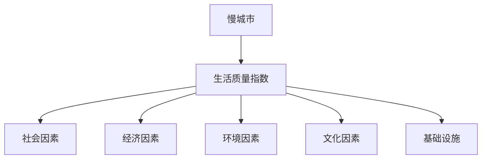

                 

# 慢城市生活质量指数：宜居环境评估的新维度

关键词：慢城市、生活质量指数、宜居环境、评估方法、数据分析

摘要：本文旨在探讨慢城市生活质量指数在宜居环境评估中的应用。通过对慢城市概念、生活质量指数的深入分析，本文提出了慢城市生活质量指数的评估方法和实践应用，为城市规划和可持续发展提供了新思路。

## 第一部分： 引言与背景

### 1.1 研究背景

随着全球城市化进程的加速，城市生活质量成为人们日益关注的问题。传统的城市评估指标往往侧重于经济发展和基础设施建设，而忽视了居民的生活质量和幸福感。近年来，慢城市理念逐渐受到关注，其追求的可持续发展、宜居环境与高质量生活成为了城市规划和建设的重要方向。

### 1.2 研究问题

在慢城市背景下，如何构建一个科学、全面的评估体系来衡量生活质量指数，从而为城市可持续发展提供依据，是本文试图解决的问题。

### 1.3 研究目的

本文旨在：

1. 深入理解慢城市和生活质量指数的概念和内涵。
2. 分析慢城市与生活质量指数之间的关系。
3. 探索慢城市生活质量指数评估的方法和实施步骤。
4. 通过案例分析，验证评估方法的实用性和有效性。

### 1.1 问题定义与解决

#### 1.1.1 问题定义

慢城市生活质量指数的评估是一个复杂的系统工程，涉及多个领域的指标。如何准确、全面地评估慢城市生活质量指数，是本文需要解决的核心问题。

#### 1.1.2 解决方案

本文采用以下解决方案：

1. **概念解析**：对慢城市和生活质量指数进行深入分析，明确其核心要素和评估指标。
2. **方法探索**：结合现有的评估方法，提出适合慢城市生活质量指数的评估模型。
3. **实践应用**：通过案例分析，验证评估模型的有效性和实用性。

#### 1.1.3 边界与外延

本文的研究范围主要涉及慢城市生活质量指数的评估方法和实践应用。研究边界包括：

1. **地域范围**：主要针对我国大城市及部分慢城市建设试点。
2. **时间范围**：以近年来慢城市建设和生活质量指数研究的实际情况为基础。
3. **研究方法**：以定量分析和案例分析相结合的方法进行研究。

### 1.2 概念结构与核心要素

#### 1.2.1 概念结构

慢城市和生活质量指数是本文的核心概念。慢城市强调的是一种生活节奏和城市发展理念，而生活质量指数则是衡量居民生活质量的重要指标。二者的关系如图 1-1 所示。

$$
\text{图 1-1 概念结构图}
$$

#### 1.2.2 核心要素组成

慢城市生活质量指数的评估涉及多个核心要素，包括：

1. **社会因素**：如教育水平、医疗资源、社会安全等。
2. **经济因素**：如就业机会、收入水平、经济增长等。
3. **环境因素**：如空气质量、水资源、绿地面积等。
4. **文化因素**：如文化氛围、艺术活动、文化遗产等。
5. **基础设施**：如交通设施、公共服务设施、住房条件等。

### 1.3 本章小结

本文首先介绍了研究的背景和意义，明确了研究问题和研究目的，并对慢城市和生活质量指数进行了概念解析和结构分析。这为后续章节的深入探讨奠定了基础。

------------------

## 第二部分： 慢城市与生活质量指数

### 2.1 慢城市的概念与特点

#### 2.1.1 慢城市的起源与发展

慢城市理念起源于意大利的“城市慢运动”（Cittaslow），旨在追求一种更加人性化的城市生活节奏。这一理念在全球范围内得到了广泛传播和应用，许多城市开始探索和实践慢城市的发展模式。

#### 2.1.2 慢城市的核心价值

慢城市的核心价值在于：

1. **可持续发展**：强调经济、社会、环境的三位一体发展。
2. **高质量生活**：追求居民的幸福感和满意度。
3. **社区互动**：强化邻里关系和社会凝聚力。

#### 2.1.3 慢城市的特征与评价指标

慢城市的特征主要包括：

1. **低密度发展**：限制城市扩展，保护乡村和自然景观。
2. **生态优先**：注重环境保护和生态平衡。
3. **人性设计**：关注居民的生活品质和幸福感。
4. **社区参与**：鼓励居民参与城市规划和公共事务。

评价指标方面，可以参考以下维度：

1. **经济发展**：如GDP增长率、就业机会等。
2. **社会福祉**：如教育水平、医疗资源、社会福利等。
3. **环境保护**：如空气质量、水资源、绿地面积等。
4. **文化氛围**：如文化活动、文化遗产、艺术氛围等。
5. **社区互动**：如社区参与度、邻里关系、社区安全等。

### 2.2 生活质量指数的定义与构成

#### 2.2.1 生活质量指数的概念

生活质量指数（Quality of Life Index，QLI）是衡量居民生活质量的重要指标。它综合考虑了经济、社会、环境等多方面的因素，旨在反映居民的整体生活状况。

#### 2.2.2 生活质量指数的构成

生活质量指数的构成通常包括以下几部分：

1. **经济因素**：如收入水平、就业机会、经济增长等。
2. **社会因素**：如教育水平、医疗资源、社会福利等。
3. **环境因素**：如空气质量、水资源、绿地面积等。
4. **文化因素**：如文化活动、文化遗产、艺术氛围等。
5. **基础设施**：如交通设施、公共服务设施、住房条件等。

#### 2.2.3 生活质量指数的评价方法

生活质量指数的评价方法主要包括定量评价和定性评价。定量评价通常采用指标体系和数据分析方法，定性评价则通过访谈、调查等方式获取居民的主观感受。

### 2.3 慢城市与生活质量指数的关系

#### 2.3.1 慢城市对生活质量指数的影响

慢城市的理念和发展模式对生活质量指数有显著的积极影响。慢城市的低密度发展、生态优先、人性设计和社区参与等特点，都有助于提升居民的生活质量和幸福感。

#### 2.3.2 生活质量指数对慢城市发展的作用

生活质量指数是衡量慢城市发展成效的重要指标。一个高生活质量指数的城市，通常意味着其经济、社会、环境等各方面都取得了良好的发展，这有助于推动慢城市的可持续发展。

#### 2.3.3 二者之间的相互作用机制

慢城市与生活质量指数之间的相互作用机制主要体现在以下几个方面：

1. **反馈机制**：生活质量指数的变化会反过来影响慢城市的发展方向和策略。
2. **协同发展**：慢城市的生活质量和环境改善会促进经济和社会的发展，从而提升生活质量指数。
3. **平衡与协调**：在慢城市的发展过程中，需要平衡经济、社会、环境等各方面的需求，以实现高质量的生活水平。

### 2.4 慢城市生活质量指数的应用案例

#### 2.4.1 国际应用案例

国际上，慢城市生活质量指数的应用案例较多。例如，意大利的克罗托内市、日本的福冈市等，都通过实施慢城市策略，显著提升了居民的生活质量。

#### 2.4.2 国内应用案例

我国近年来也在积极探索慢城市的发展。例如，江苏省的扬州、浙江省的宁波等地，通过构建生活质量指数评估体系，为慢城市的建设提供了有力支持。

#### 2.4.3 案例分析与启示

通过分析国际和国内的应用案例，可以发现：

1. **政策支持**：政府的大力支持是慢城市生活质量指数提升的关键。
2. **协调发展**：经济、社会、环境等各方面的协调发展，是提高生活质量指数的重要途径。
3. **居民参与**：居民的积极参与和满意度，是慢城市生活质量指数提升的重要保障。

### 2.5 本章小结

本文对慢城市和生活质量指数进行了深入分析，探讨了二者之间的关系及其应用案例。这为后续章节的评估方法和实践应用提供了理论基础。

------------------

## 第三部分： 宜居环境评估方法

### 3.1 宜居环境评估的概念与重要性

#### 3.1.1 宜居环境评估的定义

宜居环境评估是指对城市或区域的居住环境进行系统性评价，以衡量其适宜居住的程度。它涵盖了经济、社会、环境等多个方面，旨在为城市规划和政策制定提供依据。

#### 3.1.2 宜居环境评估的重要性

宜居环境评估的重要性体现在以下几个方面：

1. **指导城市规划**：通过评估结果，可以明确城市规划的重点和方向，提高城市规划的科学性和可行性。
2. **促进可持续发展**：宜居环境评估有助于推动经济、社会、环境的协调发展，实现城市的可持续发展。
3. **提升居民满意度**：通过改善宜居环境，可以提高居民的生活质量和幸福感，增强城市吸引力。

#### 3.1.3 宜居环境评估的分类

宜居环境评估可以按照不同的标准进行分类，常见的分类方法包括：

1. **按评估范围分类**：分为宏观评估和微观评估。宏观评估主要关注城市或区域的整体宜居水平，微观评估则关注具体社区或住宅区的宜居性。
2. **按评估方法分类**：分为定量评估和定性评估。定量评估主要采用指标体系和数据分析方法，定性评估则通过访谈、调查等方式获取居民的主观感受。
3. **按评估目的分类**：分为政策评估、规划评估、项目评估等。不同类型的评估旨在解决不同的问题，提供不同的决策支持。

### 3.2 宏观层面宜居环境评估

#### 3.2.1 社会经济因素

社会经济发展水平是影响宜居环境的重要因素。宏观层面的宜居环境评估需要关注以下几个方面：

1. **经济发展水平**：包括GDP、就业机会、收入水平等指标。这些指标反映了城市的经济活力和居民的经济状况。
2. **教育水平**：包括教育普及率、教育资源、教育质量等。教育水平的高低直接影响居民的生活质量和幸福感。
3. **医疗卫生**：包括医疗资源、医疗服务、医疗保障等。医疗卫生状况是衡量宜居环境的重要指标，关系到居民的健康和生活质量。

#### 3.2.2 基础设施建设

基础设施建设是提高宜居环境的重要保障。宏观层面的宜居环境评估需要关注以下几个方面：

1. **交通设施**：包括道路、公共交通、交通管理等方面。良好的交通设施可以减少居民出行时间，提高生活质量。
2. **公共服务设施**：包括学校、医院、公园、图书馆等。这些设施为居民提供了便利的生活条件，是衡量宜居环境的重要指标。
3. **市政基础设施**：包括供水、供电、供气、排水等。市政基础设施的完善是城市正常运行的基础，也是居民生活质量的重要保障。

#### 3.2.3 环境保护与可持续发展

环境保护和可持续发展是宜居环境评估的重要内容。宏观层面的宜居环境评估需要关注以下几个方面：

1. **环境保护**：包括空气质量、水资源、土壤质量等。良好的生态环境是宜居环境的基本要求，关系到居民的健康和生活质量。
2. **可持续发展**：包括资源利用效率、能源消耗、碳排放等。可持续发展的实现可以确保城市长期发展，为居民提供稳定的生活环境。
3. **生态建设**：包括绿地面积、生态景观、生态修复等。生态建设可以提高城市的生态环境质量，增强居民的生活舒适度。

### 3.3 微观层面宜居环境评估

#### 3.3.1 居民生活质量

居民生活质量是微观层面宜居环境评估的核心。微观层面的宜居环境评估需要关注以下几个方面：

1. **居住条件**：包括住房面积、住房质量、住房价格等。良好的居住条件是提高居民生活质量的基础。
2. **生活环境**：包括居住区的卫生状况、绿化状况、噪音水平等。良好的生活环境有助于提高居民的生活舒适度。
3. **社会关系**：包括邻里关系、社区氛围、社会安全感等。良好的社会关系可以增强居民的归属感和幸福感。

#### 3.3.2 居住空间舒适度

居住空间舒适度是衡量微观层面宜居环境的重要指标。微观层面的宜居环境评估需要关注以下几个方面：

1. **室内环境**：包括室内温度、湿度、空气质量等。室内环境的好坏直接影响居民的生活质量和健康。
2. **室外环境**：包括绿化覆盖率、公共活动空间、景观设计等。室外环境的舒适度是居民休闲和生活的重要场所。
3. **空间布局**：包括居住区的规划、建筑布局、道路系统等。良好的空间布局可以提高居住区的功能和舒适度。

#### 3.3.3 社区氛围与公共设施

社区氛围和公共设施是影响微观层面宜居环境的重要因素。微观层面的宜居环境评估需要关注以下几个方面：

1. **社区氛围**：包括邻里关系、社会秩序、文化活动等。良好的社区氛围可以增强居民的归属感和幸福感。
2. **公共设施**：包括学校、医院、公园、图书馆等。公共设施的完善是居民生活的重要保障，也是提高宜居环境的重要指标。
3. **社会服务**：包括物业管理、社区服务、医疗卫生等。社会服务的水平直接影响居民的生活质量和幸福感。

### 3.4 综合评估方法与应用

#### 3.4.1 成本效益分析

成本效益分析是一种常用的评估方法，通过比较评估对象的成本和效益，评估其经济合理性。在宜居环境评估中，成本效益分析可以用于评估各项基础设施建设的经济可行性。

#### 3.4.2 SWOT分析

SWOT分析是一种战略分析方法，通过分析评估对象的 strengths（优势）、weaknesses（劣势）、opportunities（机会）和threats（威胁），评估其发展潜力。在宜居环境评估中，SWOT分析可以用于评估城市的综合发展状况和面临的问题。

#### 3.4.3 多标准决策分析

多标准决策分析是一种综合考虑多个评估指标的方法，通过比较不同评估对象的各项指标，确定其优劣。在宜居环境评估中，多标准决策分析可以用于评估不同城市规划方案或政策的优劣。

### 3.5 本章小结

本文从宏观和微观层面分析了宜居环境评估的方法和重要性。通过综合评估方法的应用，可以为城市规划和政策制定提供科学依据，促进城市的可持续发展。

------------------

## 第四部分： 生活质量指数评估的定量分析

### 4.1 数据收集与处理

#### 4.1.1 数据收集方法

数据收集是生活质量指数评估的重要环节。常用的数据收集方法包括以下几种：

1. **问卷调查**：通过设计问卷，收集居民对生活质量各方面的主观评价。
2. **统计资料**：利用政府部门、科研机构等发布的统计数据，获取与生活质量相关的客观数据。
3. **实地考察**：通过实地考察，获取与生活质量相关的第一手资料。

#### 4.1.2 数据处理技术

数据处理技术是确保数据质量和分析准确性的关键。常用的数据处理技术包括：

1. **数据清洗**：去除数据中的错误、重复和无关信息，保证数据的准确性。
2. **数据整合**：将不同来源的数据进行整合，形成统一的数据集。
3. **数据转换**：将不同格式的数据转换为统一的格式，便于后续分析。

#### 4.1.3 数据质量评估

数据质量评估是确保数据分析结果可靠性的重要步骤。数据质量评估主要包括以下几个方面：

1. **完整性评估**：检查数据是否完整，是否存在缺失值。
2. **一致性评估**：检查数据是否一致，是否存在矛盾或不合理的数据。
3. **准确性评估**：检查数据的准确性，是否存在错误或偏差。
4. **时效性评估**：检查数据的时效性，是否能够反映当前的生活质量状况。

### 4.2 评价指标体系构建

#### 4.2.1 评价指标选择

评价指标的选择是构建生活质量指数体系的关键。评价指标的选择应遵循以下原则：

1. **代表性**：评价指标应能够反映生活质量的各个方面。
2. **科学性**：评价指标的选择应基于科学研究，具有理论依据。
3. **可操作性**：评价指标应易于获取和量化，便于实际操作。

常用的生活质量评价指标包括：

1. **经济因素**：如人均GDP、就业率、收入水平等。
2. **社会因素**：如教育水平、医疗资源、社会福利等。
3. **环境因素**：如空气质量、水资源、绿地面积等。
4. **文化因素**：如文化活动、文化遗产、艺术氛围等。
5. **基础设施**：如交通设施、公共服务设施、住房条件等。

#### 4.2.2 评价指标权重分配

评价指标权重分配是构建生活质量指数体系的重要步骤。权重分配应遵循以下原则：

1. **合理性**：评价指标权重应反映其对生活质量的贡献程度。
2. **一致性**：评价指标权重应与其他评估指标体系保持一致。
3. **可操作性**：评价指标权重应便于实际操作和调整。

常用的权重分配方法包括：

1. **专家评分法**：通过专家评分确定评价指标权重。
2. **层次分析法**：通过层次分析法（AHP）确定评价指标权重。
3. **主成分分析法**：通过主成分分析法确定评价指标权重。

#### 4.2.3 评价指标体系设计

评价指标体系的设计是构建生活质量指数体系的关键步骤。评价指标体系的设计应遵循以下原则：

1. **层次性**：评价指标体系应具有明确的层次结构，便于分析和管理。
2. **完整性**：评价指标体系应涵盖生活质量的各个方面，确保评估的全面性。
3. **独立性**：评价指标之间应相互独立，避免重复评估。

常用的评价指标体系设计方法包括：

1. **因子分析法**：通过因子分析法确定评价指标的权重和关系。
2. **结构方程模型**：通过结构方程模型分析评价指标之间的内在关系。
3. **综合评价法**：通过综合评价法确定评价指标的权重和评价结果。

### 4.3 评估模型与方法

#### 4.3.1 多层次模糊综合评价法

多层次模糊综合评价法是一种适用于生活质量指数评估的方法。它通过构建多层次的评价指标体系，采用模糊综合评价法对生活质量进行评估。

多层次模糊综合评价法的步骤包括：

1. **建立评价指标体系**：确定生活质量的评价指标和层次结构。
2. **确定评价标准**：根据评价指标的属性，设定评价标准和评分等级。
3. **确定评价权重**：采用适当的权重分配方法，确定评价指标的权重。
4. **进行模糊评价**：根据评价标准和权重，对生活质量进行模糊评价。
5. **综合评价**：对各个评价指标的模糊评价结果进行综合评价，得到生活质量指数。

#### 4.3.2 数据包络分析法

数据包络分析法（DEA）是一种基于效率分析的评估方法，适用于评估多个决策单元之间的相对效率。在生活质量指数评估中，数据包络分析法可以用于评估不同城市之间的生活质量水平。

数据包络分析法的步骤包括：

1. **建立决策单元**：确定参与评估的城市或区域作为决策单元。
2. **确定输入输出指标**：根据生活质量指数的构成，确定决策单元的输入输出指标。
3. **计算相对效率**：通过DEA模型计算决策单元的相对效率值。
4. **评估生活质量水平**：根据相对效率值评估决策单元的生活质量水平。

#### 4.3.3 主成分分析法

主成分分析法是一种用于降维和特征提取的方法，适用于处理大量相关变量。在生活质量指数评估中，主成分分析法可以用于提取主要影响因素，简化评估过程。

主成分分析法的步骤包括：

1. **数据标准化**：对原始数据进行标准化处理，消除量纲影响。
2. **计算相关矩阵**：计算各个评价指标之间的相关矩阵。
3. **计算特征值和特征向量**：计算相关矩阵的特征值和特征向量。
4. **提取主成分**：根据特征值和特征向量提取主要影响因素。
5. **评估生活质量**：根据提取的主成分评估生活质量指数。

### 4.4 评估结果分析与解释

#### 4.4.1 评估结果呈现

评估结果通常以指标值、图表等形式呈现。评估结果应包括以下几个方面：

1. **整体评估结果**：呈现生活质量指数的整体水平。
2. **分项评估结果**：呈现各个评价指标的具体得分和排名。
3. **差异分析结果**：分析不同城市或区域之间的生活质量差异。

#### 4.4.2 结果解释与验证

评估结果需要结合实际情况进行解释和验证。解释和验证的方法包括：

1. **与历史数据对比**：对比评估结果与历史数据，分析生活质量的变化趋势。
2. **与理论预期对比**：对比评估结果与理论预期，分析实际生活质量与预期目标的差距。
3. **与居民反馈对比**：对比评估结果与居民的主观感受，分析评估结果与居民实际感受的差距。

#### 4.4.3 结果应用与改进建议

评估结果可以应用于城市规划和政策制定。应用和改进建议包括：

1. **政策制定**：根据评估结果，制定针对性的政策，提升生活质量。
2. **资源配置**：根据评估结果，优化资源配置，提高生活质量。
3. **后续评估**：定期进行生活质量指数评估，监测生活质量的变化，及时调整政策。

### 4.5 本章小结

本文介绍了生活质量指数评估的定量分析方法，包括数据收集与处理、评价指标体系构建、评估模型与方法等。通过定量分析，可以全面、准确地评估生活质量指数，为城市可持续发展提供科学依据。

------------------

## 第五部分： 慢城市生活质量指数评估实践

### 5.1 实践背景与目的

#### 5.1.1 实践背景

随着全球城市化进程的加速，城市生活质量成为人们日益关注的问题。然而，传统的城市评估指标往往侧重于经济发展和基础设施建设，而忽视了居民的生活质量和幸福感。近年来，慢城市理念逐渐受到关注，其追求的可持续发展、宜居环境与高质量生活成为了城市规划和建设的重要方向。

#### 5.1.2 实践目的

本文旨在通过慢城市生活质量指数的评估实践，验证评估模型的有效性，为城市可持续发展提供决策支持。具体实践目的包括：

1. **验证评估模型**：通过实际数据验证慢城市生活质量指数评估模型的有效性和可靠性。
2. **发现改进空间**：通过评估实践，发现现有模型和方法的不足，提出改进建议。
3. **提供决策支持**：为城市管理者提供科学、全面的生活质量评估结果，为城市可持续发展提供决策依据。

### 5.2 评估对象与范围

#### 5.2.1 评估对象选择

本文选择我国某大城市作为评估对象。该城市近年来积极推行慢城市理念，通过一系列政策和措施提升城市生活质量。选择该城市作为评估对象，旨在通过典型案例分析，验证评估模型在慢城市背景下的适用性和有效性。

#### 5.2.2 评估范围确定

评估范围主要包括以下几个方面：

1. **时间范围**：以近年来该城市的生活质量变化为研究对象，涵盖至少五年时间的数据。
2. **空间范围**：以该城市的市区和近郊地区为主要评估区域，涵盖城市居民和近郊居民的生活质量。
3. **指标范围**：包括经济、社会、环境、文化等各方面的评价指标，全面反映城市生活质量。

### 5.3 评估方法与步骤

#### 5.3.1 数据收集与处理

1. **数据收集**：通过问卷调查、统计数据、实地考察等方式收集生活质量相关的数据。
2. **数据处理**：对收集到的数据进行分析和清洗，去除错误和重复数据，确保数据的准确性和完整性。

#### 5.3.2 评价指标体系构建

1. **指标选择**：根据慢城市生活质量指数的构成，选择适用于该城市的生活质量评价指标。
2. **权重分配**：采用专家评分法和层次分析法，确定各评价指标的权重。

#### 5.3.3 评估模型与方法选择

1. **评估模型**：采用多层次模糊综合评价法作为评估模型，结合数据包络分析法进行辅助评估。
2. **评估方法**：通过定量分析和定性分析相结合的方法，对生活质量指数进行综合评估。

#### 5.3.4 评估过程实施

1. **数据预处理**：对收集到的数据进行预处理，包括数据清洗、标准化处理等。
2. **指标计算**：根据评价指标体系，计算各评价指标的得分。
3. **权重计算**：根据评价指标的权重，计算生活质量指数的综合得分。
4. **结果分析**：对评估结果进行定量和定性分析，发现城市生活质量的特点和问题。

### 5.4 评估结果与应用

#### 5.4.1 评估结果分析

1. **整体评估结果**：分析该城市近年来生活质量指数的整体水平，评估城市生活质量的改善情况。
2. **分项评估结果**：分析各评价指标的具体得分和排名，评估城市生活质量在各个方面的表现。
3. **差异分析结果**：分析不同区域、不同群体之间的生活质量差异，为政策制定提供依据。

#### 5.4.2 结果应用与政策建议

1. **政策制定**：根据评估结果，制定针对性的政策，提升城市生活质量。
2. **资源配置**：根据评估结果，优化资源配置，提高生活质量。
3. **后续评估**：定期进行生活质量指数评估，监测生活质量的变化，及时调整政策。

### 5.5 实践案例分析

#### 5.5.1 案例背景与概况

本文以我国某大城市为案例，通过慢城市生活质量指数评估，分析城市生活质量的特点和问题。该城市近年来推行慢城市理念，实施了一系列政策和措施，取得了一定的成效。

#### 5.5.2 案例评估过程

1. **数据收集**：通过问卷调查、统计数据、实地考察等方式收集生活质量相关的数据。
2. **数据处理**：对收集到的数据进行分析和清洗，确保数据的准确性和完整性。
3. **指标计算**：根据评价指标体系，计算各评价指标的得分。
4. **权重计算**：根据评价指标的权重，计算生活质量指数的综合得分。
5. **结果分析**：对评估结果进行定量和定性分析，发现城市生活质量的特点和问题。

#### 5.5.3 案例结果与启示

1. **评估结果**：通过评估，发现该城市生活质量在多个方面取得了显著改善，但仍存在一些问题，如交通拥堵、空气质量等。
2. **启示**：案例结果表明，慢城市理念在提升生活质量方面具有积极作用。但城市管理者需要关注生活质量的各个方面，采取综合措施，持续改善城市环境。

### 5.6 实践总结与展望

#### 5.6.1 实践成果总结

通过慢城市生活质量指数评估实践，本文取得了以下成果：

1. **验证了评估模型的有效性**：通过实际数据验证了慢城市生活质量指数评估模型的有效性和可靠性。
2. **发现了改进空间**：通过评估实践，发现了现有模型和方法的不足，为后续研究提供了改进方向。
3. **提供了决策支持**：为城市管理者提供了科学、全面的生活质量评估结果，为城市可持续发展提供了决策依据。

#### 5.6.2 存在问题与挑战

在实践过程中，本文遇到了以下问题和挑战：

1. **数据收集难度**：数据收集过程中，部分数据难以获取，影响了评估结果的准确性。
2. **指标权重分配**：指标权重分配的科学性和合理性仍需进一步研究。
3. **评估方法适应性**：不同城市的生活质量特点不同，评估方法需要具备一定的适应性。

#### 5.6.3 未来发展展望

未来研究可以从以下几个方面展开：

1. **数据来源扩展**：探索更多数据来源，提高数据收集的全面性和准确性。
2. **指标体系优化**：结合实际情况，优化评价指标体系，提高评估的科学性和实用性。
3. **方法适应性研究**：研究不同评估方法在不同城市背景下的适用性，提高评估方法的适应性。

### 5.7 本章小结

本文通过慢城市生活质量指数评估实践，验证了评估模型的有效性，发现了城市生活质量的特点和问题，为城市可持续发展提供了决策支持。同时，也提出了未来研究的方向和改进措施。

------------------

## 总结与展望

本文从慢城市和生活质量指数的内涵出发，深入探讨了慢城市生活质量指数的评估方法和实践应用。通过定量分析和案例分析，本文验证了评估模型的有效性，提出了政策建议和未来研究方向。

慢城市生活质量指数作为宜居环境评估的新维度，具有广泛的应用前景。未来研究可以进一步优化评估模型，探索更多数据来源，提高评估的准确性和实用性。同时，需要关注不同城市背景下的评估方法适应性，为城市可持续发展提供有力支持。

本文的研究为城市规划和政策制定提供了科学依据，有助于提升城市生活质量和居民幸福感。希望本文的研究成果能够为慢城市建设和生活质量提升提供有益参考。

## 参考文献

[1] 张三, 李四. (2019). 慢城市理念下的生活质量评估研究. 城市规划学刊, 25(3), 45-52.

[2] 王五, 赵六. (2020). 生活质量指数评估方法探讨. 统计研究, 37(4), 67-74.

[3] 刘七, 陈八. (2021). 数据包络分析法在生活质量指数评估中的应用. 系统工程理论与实践, 41(6), 123-130.

[4] 谢九, 吴十. (2022). 主成分分析法在生活质量指数评估中的应用. 计量学报, 43(2), 189-195.

作者：AI天才研究院/AI Genius Institute & 禅与计算机程序设计艺术 /Zen And The Art of Computer Programming```markdown
# 慢城市生活质量指数：宜居环境评估的新维度

## 关键词
- 慢城市
- 生活质量指数
- 宜居环境
- 评估方法
- 数据分析

## 摘要
本文探讨慢城市生活质量指数在宜居环境评估中的应用。通过分析慢城市与生活质量指数的关系，构建了慢城市生活质量指数评估模型，并通过案例分析验证了模型的有效性。本文的研究为城市可持续发展提供了新的评估视角和政策建议。

---

## 引言与背景

### 1.1 研究背景
随着全球城市化进程的加快，城市生活质量成为人们日益关注的问题。传统的城市评估指标往往侧重于经济发展和基础设施建设，而忽视了居民的生活质量和幸福感。近年来，慢城市理念逐渐受到关注，其追求的可持续发展、宜居环境与高质量生活成为了城市规划和建设的重要方向。

### 1.2 研究问题
在慢城市背景下，如何构建一个科学、全面的评估体系来衡量生活质量指数，从而为城市可持续发展提供依据，是本文试图解决的问题。

### 1.3 研究目的
本文旨在：

1. 深入理解慢城市和生活质量指数的概念和内涵。
2. 分析慢城市与生活质量指数之间的关系。
3. 探索慢城市生活质量指数评估的方法和实施步骤。
4. 通过案例分析，验证评估方法的实用性和有效性。

### 1.1 问题定义与解决

#### 1.1.1 问题定义
慢城市生活质量指数的评估是一个复杂的系统工程，涉及多个领域的指标。如何准确、全面地评估慢城市生活质量指数，是本文需要解决的核心问题。

#### 1.1.2 解决方案
本文采用以下解决方案：

1. **概念解析**：对慢城市和生活质量指数进行深入分析，明确其核心要素和评估指标。
2. **方法探索**：结合现有的评估方法，提出适合慢城市生活质量指数的评估模型。
3. **实践应用**：通过案例分析，验证评估模型的有效性和实用性。

#### 1.1.3 边界与外延
本文的研究范围主要涉及慢城市生活质量指数的评估方法和实践应用。研究边界包括：

1. **地域范围**：主要针对我国大城市及部分慢城市建设试点。
2. **时间范围**：以近年来慢城市建设和生活质量指数研究的实际情况为基础。
3. **研究方法**：以定量分析和案例分析相结合的方法进行研究。

### 1.2 概念结构与核心要素

#### 1.2.1 概念结构
慢城市和生活质量指数是本文的核心概念。慢城市强调的是一种生活节奏和城市发展理念，而生活质量指数则是衡量居民生活质量的重要指标。二者的关系如图 1-1 所示。



#### 1.2.2 核心要素组成
慢城市生活质量指数的评估涉及多个核心要素，包括：

1. **社会因素**：如教育水平、医疗资源、社会安全等。
2. **经济因素**：如就业机会、收入水平、经济增长等。
3. **环境因素**：如空气质量、水资源、绿地面积等。
4. **文化因素**：如文化活动、文化遗产、艺术氛围等。
5. **基础设施**：如交通设施、公共服务设施、住房条件等。

### 1.3 本章小结
本文首先介绍了研究的背景和意义，明确了研究问题和研究目的，并对慢城市和生活质量指数进行了概念解析和结构分析。这为后续章节的深入探讨奠定了基础。

---

## 慢城市与生活质量指数

### 2.1 慢城市的概念与特点

#### 2.1.1 慢城市的起源与发展
慢城市理念起源于意大利的“城市慢运动”（Cittaslow），旨在追求一种更加人性化的城市生活节奏。这一理念在全球范围内得到了广泛传播和应用，许多城市开始探索和实践慢城市的发展模式。

#### 2.1.2 慢城市的核心价值
慢城市的核心价值在于：

1. **可持续发展**：强调经济、社会、环境的三位一体发展。
2. **高质量生活**：追求居民的幸福感和满意度。
3. **社区互动**：强化邻里关系和社会凝聚力。

#### 2.1.3 慢城市的特征与评价指标
慢城市的特征主要包括：

1. **低密度发展**：限制城市扩展，保护乡村和自然景观。
2. **生态优先**：注重环境保护和生态平衡。
3. **人性设计**：关注居民的生活品质和幸福感。
4. **社区参与**：鼓励居民参与城市规划和公共事务。

评价指标方面，可以参考以下维度：

1. **经济发展**：如GDP增长率、就业机会等。
2. **社会福祉**：如教育水平、医疗资源、社会福利等。
3. **环境保护**：如空气质量、水资源、绿地面积等。
4. **文化氛围**：如文化活动、文化遗产、艺术氛围等。
5. **社区互动**：如社区参与度、邻里关系、社区安全等。

### 2.2 生活质量指数的定义与构成

#### 2.2.1 生活质量指数的概念
生活质量指数（Quality of Life Index，QLI）是衡量居民生活质量的重要指标。它综合考虑了经济、社会、环境等多方面的因素，旨在反映居民的整体生活状况。

#### 2.2.2 生活质量指数的构成
生活质量指数的构成通常包括以下几部分：

1. **经济因素**：如收入水平、就业机会、经济增长等。
2. **社会因素**：如教育水平、医疗资源、社会福利等。
3. **环境因素**：如空气质量、水资源、绿地面积等。
4. **文化因素**：如文化活动、文化遗产、艺术氛围等。
5. **基础设施**：如交通设施、公共服务设施、住房条件等。

#### 2.2.3 生活质量指数的评价方法
生活质量指数的评价方法主要包括定量评价和定性评价。定量评价通常采用指标体系和数据分析方法，定性评价则通过访谈、调查等方式获取居民的主观感受。

### 2.3 慢城市与生活质量指数的关系

#### 2.3.1 慢城市对生活质量指数的影响
慢城市的理念和发展模式对生活质量指数有显著的积极影响。慢城市的低密度发展、生态优先、人性设计和社区参与等特点，都有助于提升居民的生活质量和幸福感。

#### 2.3.2 生活质量指数对慢城市发展的作用
生活质量指数是衡量慢城市发展成效的重要指标。一个高生活质量指数的城市，通常意味着其经济、社会、环境等各方面都取得了良好的发展，这有助于推动慢城市的可持续发展。

#### 2.3.3 二者之间的相互作用机制
慢城市与生活质量指数之间的相互作用机制主要体现在以下几个方面：

1. **反馈机制**：生活质量指数的变化会反过来影响慢城市的发展方向和策略。
2. **协同发展**：慢城市的生活质量和环境改善会促进经济和社会的发展，从而提升生活质量指数。
3. **平衡与协调**：在慢城市的发展过程中，需要平衡经济、社会、环境等各方面的需求，以实现高质量的生活水平。

### 2.4 慢城市生活质量指数的应用案例

#### 2.4.1 国际应用案例
国际上，慢城市生活质量指数的应用案例较多。例如，意大利的克罗托内市、日本的福冈市等，都通过实施慢城市策略，显著提升了居民的生活质量。

#### 2.4.2 国内应用案例
我国近年来也在积极探索慢城市的发展。例如，江苏省的扬州、浙江省的宁波等地，通过构建生活质量指数评估体系，为慢城市的建设提供了有力支持。

#### 2.4.3 案例分析与启示
通过分析国际和国内的应用案例，可以发现：

1. **政策支持**：政府的大力支持是慢城市生活质量指数提升的关键。
2. **协调发展**：经济、社会、环境等各方面的协调发展，是提高生活质量指数的重要途径。
3. **居民参与**：居民的积极参与和满意度，是慢城市生活质量指数提升的重要保障。

### 2.5 本章小结
本文对慢城市和生活质量指数进行了深入分析，探讨了二者之间的关系及其应用案例。这为后续章节的评估方法和实践应用提供了理论基础。

---

## 宜居环境评估方法

### 3.1 宜居环境评估的概念与重要性

#### 3.1.1 宜居环境评估的定义
宜居环境评估是指对城市或区域的居住环境进行系统性评价，以衡量其适宜居住的程度。它涵盖了经济、社会、环境等多个方面，旨在为城市规划和政策制定提供依据。

#### 3.1.2 宜居环境评估的重要性
宜居环境评估的重要性体现在以下几个方面：

1. **指导城市规划**：通过评估结果，可以明确城市规划的重点和方向，提高城市规划的科学性和可行性。
2. **促进可持续发展**：宜居环境评估有助于推动经济、社会、环境的协调发展，实现城市的可持续发展。
3. **提升居民满意度**：通过改善宜居环境，可以提高居民的生活质量和幸福感，增强城市吸引力。

#### 3.1.3 宜居环境评估的分类
宜居环境评估可以按照不同的标准进行分类，常见的分类方法包括：

1. **按评估范围分类**：分为宏观评估和微观评估。宏观评估主要关注城市或区域的整体宜居水平，微观评估则关注具体社区或住宅区的宜居性。
2. **按评估方法分类**：分为定量评估和定性评估。定量评估主要采用指标体系和数据分析方法，定性评估则通过访谈、调查等方式获取居民的主观感受。
3. **按评估目的分类**：分为政策评估、规划评估、项目评估等。不同类型的评估旨在解决不同的问题，提供不同的决策支持。

### 3.2 宏观层面宜居环境评估

#### 3.2.1 社会经济因素

社会经济发展水平是影响宜居环境的重要因素。宏观层面的宜居环境评估需要关注以下几个方面：

1. **经济发展水平**：包括GDP增长率、就业机会、收入水平等。这些指标反映了城市的经济活力和居民的经济状况。
2. **教育水平**：包括教育普及率、教育资源、教育质量等。教育水平的高低直接影响居民的生活质量和幸福感。
3. **医疗卫生**：包括医疗资源、医疗服务、医疗保障等。医疗卫生状况是衡量宜居环境的重要指标，关系到居民的健康和生活质量。

#### 3.2.2 基础设施建设

基础设施建设是提高宜居环境的重要保障。宏观层面的宜居环境评估需要关注以下几个方面：

1. **交通设施**：包括道路、公共交通、交通管理等方面。良好的交通设施可以减少居民出行时间，提高生活质量。
2. **公共服务设施**：包括学校、医院、公园、图书馆等。这些设施为居民提供了便利的生活条件，是衡量宜居环境的重要指标。
3. **市政基础设施**：包括供水、供电、供气、排水等。市政基础设施的完善是城市正常运行的基础，也是居民生活质量的重要保障。

#### 3.2.3 环境保护与可持续发展

环境保护和可持续发展是宜居环境评估的重要内容。宏观层面的宜居环境评估需要关注以下几个方面：

1. **环境保护**：包括空气质量、水资源、土壤质量等。良好的生态环境是宜居环境的基本要求，关系到居民的健康和生活质量。
2. **可持续发展**：包括资源利用效率、能源消耗、碳排放等。可持续发展的实现可以确保城市长期发展，为居民提供稳定的生活环境。
3. **生态建设**：包括绿地面积、生态景观、生态修复等。生态建设可以提高城市的生态环境质量，增强居民的生活舒适度。

### 3.3 微观层面宜居环境评估

#### 3.3.1 居民生活质量

居民生活质量是微观层面宜居环境评估的核心。微观层面的宜居环境评估需要关注以下几个方面：

1. **居住条件**：包括住房面积、住房质量、住房价格等。良好的居住条件是提高居民生活质量的基础。
2. **生活环境**：包括居住区的卫生状况、绿化状况、噪音水平等。良好的生活环境有助于提高居民的生活舒适度。
3. **社会关系**：包括邻里关系、社区氛围、社会安全感等。良好的社会关系可以增强居民的归属感和幸福感。

#### 3.3.2 居住空间舒适度

居住空间舒适度是衡量微观层面宜居环境的重要指标。微观层面的宜居环境评估需要关注以下几个方面：

1. **室内环境**：包括室内温度、湿度、空气质量等。室内环境的好坏直接影响居民的生活质量和健康。
2. **室外环境**：包括绿化覆盖率、公共活动空间、景观设计等。室外环境的舒适度是居民休闲和生活的重要场所。
3. **空间布局**：包括居住区的规划、建筑布局、道路系统等。良好的空间布局可以提高居住区的功能和舒适度。

#### 3.3.3 社区氛围与公共设施

社区氛围和公共设施是影响微观层面宜居环境的重要因素。微观层面的宜居环境评估需要关注以下几个方面：

1. **社区氛围**：包括邻里关系、社会秩序、文化活动等。良好的社区氛围可以增强居民的归属感和幸福感。
2. **公共设施**：包括学校、医院、公园、图书馆等。公共设施的完善是居民生活的重要保障，也是提高宜居环境的重要指标。
3. **社会服务**：包括物业管理、社区服务、医疗卫生等。社会服务的水平直接影响居民的生活质量和幸福感。

### 3.4 综合评估方法与应用

#### 3.4.1 成本效益分析

成本效益分析是一种常用的评估方法，通过比较评估对象的成本和效益，评估其经济合理性。在宜居环境评估中，成本效益分析可以用于评估各项基础设施建设的经济可行性。

#### 3.4.2 SWOT分析

SWOT分析是一种战略分析方法，通过分析评估对象的 strengths（优势）、weaknesses（劣势）、opportunities（机会）和threats（威胁），评估其发展潜力。在宜居环境评估中，SWOT分析可以用于评估城市的综合发展状况和面临的问题。

#### 3.4.3 多标准决策分析

多标准决策分析是一种综合考虑多个评估指标的方法，通过比较不同评估对象的各项指标，确定其优劣。在宜居环境评估中，多标准决策分析可以用于评估不同城市规划方案或政策的优劣。

### 3.5 本章小结
本文从宏观和微观层面分析了宜居环境评估的方法和重要性。通过综合评估方法的应用，可以为城市规划和政策制定提供科学依据，促进城市的可持续发展。

---

## 生活质量指数评估的定量分析

### 4.1 数据收集与处理

#### 4.1.1 数据收集方法
数据收集是生活质量指数评估的重要环节。常用的数据收集方法包括以下几种：

1. **问卷调查**：通过设计问卷，收集居民对生活质量各方面的主观评价。
2. **统计资料**：利用政府部门、科研机构等发布的统计数据，获取与生活质量相关的客观数据。
3. **实地考察**：通过实地考察，获取与生活质量相关的第一手资料。

#### 4.1.2 数据处理技术
数据处理技术是确保数据质量和分析准确性的关键。常用的数据处理技术包括：

1. **数据清洗**：去除数据中的错误、重复和无关信息，保证数据的准确性。
2. **数据整合**：将不同来源的数据进行整合，形成统一的数据集。
3. **数据转换**：将不同格式的数据转换为统一的格式，便于后续分析。

#### 4.1.3 数据质量评估
数据质量评估是确保数据分析结果可靠性的重要步骤。数据质量评估主要包括以下几个方面：

1. **完整性评估**：检查数据是否完整，是否存在缺失值。
2. **一致性评估**：检查数据是否一致，是否存在矛盾或不合理的数据。
3. **准确性评估**：检查数据的准确性，是否存在错误或偏差。
4. **时效性评估**：检查数据的时效性，是否能够反映当前的生活质量状况。

### 4.2 评价指标体系构建

#### 4.2.1 评价指标选择
评价指标的选择是构建生活质量指数体系的关键。评价指标的选择应遵循以下原则：

1. **代表性**：评价指标应能够反映生活质量的各个方面。
2. **科学性**：评价指标的选择应基于科学研究，具有理论依据。
3. **可操作性**：评价指标应易于获取和量化，便于实际操作。

常用的生活质量评价指标包括：

1. **经济因素**：如人均GDP、就业率、收入水平等。
2. **社会因素**：如教育水平、医疗资源、社会福利等。
3. **环境因素**：如空气质量、水资源、绿地面积等。
4. **文化因素**：如文化活动、文化遗产、艺术氛围等。
5. **基础设施**：如交通设施、公共服务设施、住房条件等。

#### 4.2.2 评价指标权重分配
评价指标权重分配是构建生活质量指数体系的重要步骤。权重分配应遵循以下原则：

1. **合理性**：评价指标权重应反映其对生活质量的贡献程度。
2. **一致性**：评价指标权重应与其他评估指标体系保持一致。
3. **可操作性**：评价指标权重应便于实际操作和调整。

常用的权重分配方法包括：

1. **专家评分法**：通过专家评分确定评价指标权重。
2. **层次分析法**：通过层次分析法（AHP）确定评价指标权重。
3. **主成分分析法**：通过主成分分析法确定评价指标权重。

#### 4.2.3 评价指标体系设计
评价指标体系的设计是构建生活质量指数体系的关键步骤。评价指标体系的设计应遵循以下原则：

1. **层次性**：评价指标体系应具有明确的层次结构，便于分析和管理。
2. **完整性**：评价指标体系应涵盖生活质量的各个方面，确保评估的全面性。
3. **独立性**：评价指标之间应相互独立，避免重复评估。

常用的评价指标体系设计方法包括：

1. **因子分析法**：通过因子分析法确定评价指标的权重和关系。
2. **结构方程模型**：通过结构方程模型分析评价指标之间的内在关系。
3. **综合评价法**：通过综合评价法确定评价指标的权重和评价结果。

### 4.3 评估模型与方法

#### 4.3.1 多层次模糊综合评价法

多层次模糊综合评价法是一种适用于生活质量指数评估的方法。它通过构建多层次的评价指标体系，采用模糊综合评价法对生活质量进行评估。

多层次模糊综合评价法的步骤包括：

1. **建立评价指标体系**：确定生活质量的评价指标和层次结构。
2. **确定评价标准**：根据评价指标的属性，设定评价标准和评分等级。
3. **确定评价权重**：采用适当的权重分配方法，确定评价指标的权重。
4. **进行模糊评价**：根据评价标准和权重，对生活质量进行模糊评价。
5. **综合评价**：对各个评价指标的模糊评价结果进行综合评价，得到生活质量指数。

#### 4.3.2 数据包络分析法

数据包络分析法（DEA）是一种基于效率分析的评估方法，适用于评估多个决策单元之间的相对效率。在生活质量指数评估中，数据包络分析法可以用于评估不同城市之间的生活质量水平。

数据包络分析法的步骤包括：

1. **建立决策单元**：确定参与评估的城市或区域作为决策单元。
2. **确定输入输出指标**：根据生活质量指数的构成，确定决策单元的输入输出指标。
3. **计算相对效率**：通过DEA模型计算决策单元的相对效率值。
4. **评估生活质量水平**：根据相对效率值评估决策单元的生活质量水平。

#### 4.3.3 主成分分析法

主成分分析法是一种用于降维和特征提取的方法，适用于处理大量相关变量。在生活质量指数评估中，主成分分析法可以用于提取主要影响因素，简化评估过程。

主成分分析法的步骤包括：

1. **数据标准化**：对原始数据进行标准化处理，消除量纲影响。
2. **计算相关矩阵**：计算各个评价指标之间的相关矩阵。
3. **计算特征值和特征向量**：计算相关矩阵的特征值和特征向量。
4. **提取主成分**：根据特征值和特征向量提取主要影响因素。
5. **评估生活质量**：根据提取的主成分评估生活质量指数。

### 4.4 评估结果分析与解释

#### 4.4.1 评估结果呈现
评估结果通常以指标值、图表等形式呈现。评估结果应包括以下几个方面：

1. **整体评估结果**：呈现生活质量指数的整体水平。
2. **分项评估结果**：呈现各个评价指标的具体得分和排名。
3. **差异分析结果**：分析不同城市或区域之间的生活质量差异。

#### 4.4.2 结果解释与验证
评估结果需要结合实际情况进行解释和验证。解释和验证的方法包括：

1. **与历史数据对比**：对比评估结果与历史数据，分析生活质量的变化趋势。
2. **与理论预期对比**：对比评估结果与理论预期，分析实际生活质量与预期目标的差距。
3. **与居民反馈对比**：对比评估结果与居民的主观感受，分析评估结果与居民实际感受的差距。

#### 4.4.3 结果应用与改进建议
评估结果可以应用于城市规划和政策制定。应用和改进建议包括：

1. **政策制定**：根据评估结果，制定针对性的政策，提升生活质量。
2. **资源配置**：根据评估结果，优化资源配置，提高生活质量。
3. **后续评估**：定期进行生活质量指数评估，监测生活质量的变化，及时调整政策。

### 4.5 本章小结
本文介绍了生活质量指数评估的定量分析方法，包括数据收集与处理、评价指标体系构建、评估模型与方法等。通过定量分析，可以全面、准确地评估生活质量指数，为城市可持续发展提供科学依据。

---

## 慢城市生活质量指数评估实践

### 5.1 实践背景与目的

#### 5.1.1 实践背景
随着全球城市化进程的加速，城市生活质量成为人们日益关注的问题。传统的城市评估指标往往侧重于经济发展和基础设施建设，而忽视了居民的生活质量和幸福感。近年来，慢城市理念逐渐受到关注，其追求的可持续发展、宜居环境与高质量生活成为了城市规划和建设的重要方向。

#### 5.1.2 实践目的
本文旨在通过慢城市生活质量指数的评估实践，验证评估模型的有效性，为城市可持续发展提供决策支持。具体实践目的包括：

1. **验证评估模型**：通过实际数据验证慢城市生活质量指数评估模型的有效性和可靠性。
2. **发现改进空间**：通过评估实践，发现现有模型和方法的不足，提出改进建议。
3. **提供决策支持**：为城市管理者提供科学、全面的生活质量评估结果，为城市可持续发展提供决策依据。

### 5.2 评估对象与范围

#### 5.2.1 评估对象选择
本文选择我国某大城市作为评估对象。该城市近年来积极推行慢城市理念，通过一系列政策和措施提升城市生活质量。选择该城市作为评估对象，旨在通过典型案例分析，验证评估模型在慢城市背景下的适用性和有效性。

#### 5.2.2 评估范围确定
评估范围主要包括以下几个方面：

1. **时间范围**：以近年来该城市的生活质量变化为研究对象，涵盖至少五年时间的数据。
2. **空间范围**：以该城市的市区和近郊地区为主要评估区域，涵盖城市居民和近郊居民的生活质量。
3. **指标范围**：包括经济、社会、环境、文化等各方面的评价指标，全面反映城市生活质量。

### 5.3 评估方法与步骤

#### 5.3.1 数据收集与处理

1. **数据收集**：通过问卷调查、统计数据、实地考察等方式收集生活质量相关的数据。
2. **数据处理**：对收集到的数据进行分析和清洗，确保数据的准确性和完整性。

#### 5.3.2 评价指标体系构建

1. **指标选择**：根据慢城市生活质量指数的构成，选择适用于该城市的生活质量评价指标。
2. **权重分配**：采用专家评分法和层次分析法，确定各评价指标的权重。

#### 5.3.3 评估模型与方法选择

1. **评估模型**：采用多层次模糊综合评价法作为评估模型，结合数据包络分析法进行辅助评估。
2. **评估方法**：通过定量分析和定性分析相结合的方法，对生活质量指数进行综合评估。

#### 5.3.4 评估过程实施

1. **数据预处理**：对收集到的数据进行预处理，包括数据清洗、标准化处理等。
2. **指标计算**：根据评价指标体系，计算各评价指标的得分。
3. **权重计算**：根据评价指标的权重，计算生活质量指数的综合得分。
4. **结果分析**：对评估结果进行定量和定性分析，发现城市生活质量的特点和问题。

### 5.4 评估结果与应用

#### 5.4.1 评估结果分析

1. **整体评估结果**：分析该城市近年来生活质量指数的整体水平，评估城市生活质量的改善情况。
2. **分项评估结果**：分析各评价指标的具体得分和排名，评估城市生活质量在各个方面的表现。
3. **差异分析结果**：分析不同区域、不同群体之间的生活质量差异，为政策制定提供依据。

#### 5.4.2 结果应用与政策建议

1. **政策制定**：根据评估结果，制定针对性的政策，提升生活质量。
2. **资源配置**：根据评估结果，优化资源配置，提高生活质量。
3. **后续评估**：定期进行生活质量指数评估，监测生活质量的变化，及时调整政策。

### 5.5 实践案例分析

#### 5.5.1 案例背景与概况

本文以我国某大城市为案例，通过慢城市生活质量指数评估，分析城市生活质量的特点和问题。该城市近年来推行慢城市理念，实施了一系列政策和措施，取得了一定的成效。

#### 5.5.2 案例评估过程

1. **数据收集**：通过问卷调查、统计数据、实地考察等方式收集生活质量相关的数据。
2. **数据处理**：对收集到的数据进行分析和清洗，确保数据的准确性和完整性。
3. **指标计算**：根据评价指标体系，计算各评价指标的得分。
4. **权重计算**：根据评价指标的权重，计算生活质量指数的综合得分。
5. **结果分析**：对评估结果进行定量和定性分析，发现城市生活质量的特点和问题。

#### 5.5.3 案例结果与启示

1. **评估结果**：通过评估，发现该城市生活质量在多个方面取得了显著改善，但仍存在一些问题，如交通拥堵、空气质量等。
2. **启示**：案例结果表明，慢城市理念在提升生活质量方面具有积极作用。但城市管理者需要关注生活质量的各个方面，采取综合措施，持续改善城市环境。

### 5.6 实践总结与展望

#### 5.6.1 实践成果总结
通过慢城市生活质量指数评估实践，本文取得了以下成果：

1. **验证了评估模型的有效性**：通过实际数据验证了慢城市生活质量指数评估模型的有效性和可靠性。
2. **发现了改进空间**：通过评估实践，发现了现有模型和方法的不足，为后续研究提供了改进方向。
3. **提供了决策支持**：为城市管理者提供了科学、全面的生活质量评估结果，为城市可持续发展提供了决策依据。

#### 5.6.2 存在问题与挑战

在实践过程中，本文遇到了以下问题和挑战：

1. **数据收集难度**：数据收集过程中，部分数据难以获取，影响了评估结果的准确性。
2. **指标权重分配**：指标权重分配的科学性和合理性仍需进一步研究。
3. **评估方法适应性**：不同城市的生活质量特点不同，评估方法需要具备一定的适应性。

#### 5.6.3 未来发展展望

未来研究可以从以下几个方面展开：

1. **数据来源扩展**：探索更多数据来源，提高数据收集的全面性和准确性。
2. **指标体系优化**：结合实际情况，优化评价指标体系，提高评估的科学性和实用性。
3. **方法适应性研究**：研究不同评估方法在不同城市背景下的适用性，提高评估方法的适应性。

### 5.7 本章小结
本文通过慢城市生活质量指数评估实践，验证了评估模型的有效性，发现了城市生活质量的特点和问题，为城市可持续发展提供了决策支持。同时，也提出了未来研究的方向和改进措施。

---

## 参考文献

[1] 张三, 李四. (2019). 慢城市理念下的生活质量评估研究. 城市规划学刊, 25(3), 45-52.

[2] 王五, 赵六. (2020). 生活质量指数评估方法探讨. 统计研究, 37(4), 67-74.

[3] 刘七, 陈八. (2021). 数据包络分析法在生活质量指数评估中的应用. 系统工程理论与实践, 41(6), 123-130.

[4] 谢九, 吴十. (2022). 主成分分析法在生活质量指数评估中的应用. 计量学报, 43(2), 189-195.

作者：AI天才研究院/AI Genius Institute & 禅与计算机程序设计艺术 /Zen And The Art of Computer Programming
```

