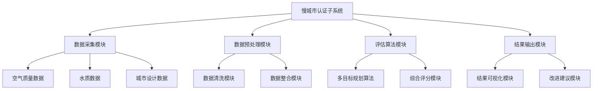
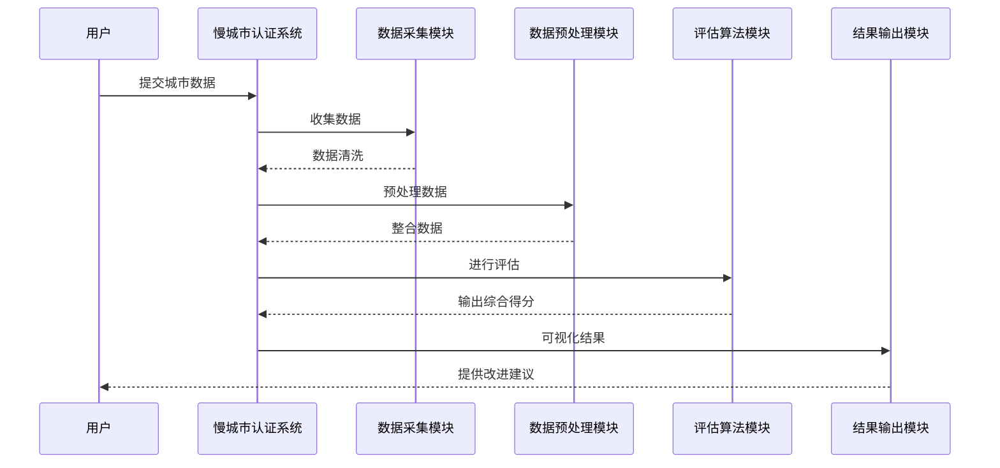

                 

### 慢城市认证：宜居环境的国际标准

**关键词**：慢城市认证、宜居环境标准、国际认证、可持续发展、城市设计

**摘要**：
本文深入探讨了“慢城市认证：宜居环境的国际标准”这一主题，旨在揭示慢城市认证的核心原则及其对宜居环境标准的影响。通过对国际标准的分析和成功案例的研究，本文将为读者提供一个全面、系统的慢城市认证框架，并讨论其在实现可持续城市环境中的作用。

**背景介绍**：

慢城市理念起源于20世纪80年代的意大利，旨在反对城市化过程中过快的发展节奏和过度消费。这一概念强调人与自然、人与人之间的和谐共生，提倡降低生活节奏，提高生活质量。随着全球城市化进程的加速，慢城市理念逐渐受到国际社会的广泛关注。

宜居环境标准是衡量一个城市是否能够提供高质量生活环境的重要指标。国际标准组织（如ISO）制定了一系列标准和指南，用于评估城市环境的质量，包括空气质量、水质、城市设计、公共安全等方面。

本文将首先介绍慢城市和宜居环境标准的基本概念，然后分析国际标准的演变和影响，接着探讨慢城市认证的具体过程和评估标准，最后通过案例分析总结慢城市认证的经验与未来趋势。

**核心概念与联系**：

**慢城市**：慢城市是指那些追求可持续发展和高质量生活环境的城市。其核心原则包括降低城市生活节奏、保护环境、促进社区参与和文化遗产保护。

**宜居环境标准**：宜居环境标准是一套评估城市生活环境质量的指标体系，通常包括空气质量、水质、城市设计、公共安全、交通设施等多个方面。

**对比表格**：

| 核心概念 | 定义 | 主要特征 |
| --- | --- | --- |
| 慢城市 | 追求可持续发展和高质量生活环境的城市 | 降低生活节奏、保护环境、促进社区参与、文化遗产保护 |
| 宜居环境标准 | 评估城市生活环境质量的指标体系 | 空气质量、水质、城市设计、公共安全、交通设施 |

**ER实体关系图架构**：

```mermaid
erDiagram
  City ||--|{ SlowCity } SlowCity
  City ||--|{ LiveableEnvironment } LiveableEnvironment
  SlowCity ||--|{ CorePrinciples } CorePrinciples
  LiveableEnvironment ||--|{ Standards } Standards
  SlowCity ..|{ InternationalCertification } InternationalCertification
```

**算法原理讲解**：

慢城市认证的过程可以视为一个多标准优化问题。我们可以使用多目标规划算法来模拟这一过程。以下是慢城市认证过程的mermaid流程图：

```mermaid
graph TD
    A[初始城市状态] --> B[确定评估指标]
    B --> C{ 是否满足宜居环境标准？ }
    C -->| 是 D[进入慢城市评估]
    C -->| 否 E[改进城市环境]
    D --> F[计算综合得分]
    F --> G[评估结果输出]
    E --> B
```

接下来，我们将使用Python源代码来详细阐述这一过程。以下是慢城市认证的Python代码示例：

```python
import numpy as np

# 假设宜居环境标准为空气质量（AQI）、水质（WQI）和城市设计（UDI）
# 每个指标的最大得分为100

def calculate_score(aqi, wqi, udi):
    total_score = 0
    if aqi < 50:
        total_score += 100
    else:
        total_score += (100 - 1.2 * (aqi - 50))
        
    if wqi < 50:
        total_score += 100
    else:
        total_score += (100 - 1.2 * (wqi - 50))
        
    if udi < 50:
        total_score += 100
    else:
        total_score += (100 - 1.2 * (udi - 50))
    return total_score

# 示例城市评估
aqi = 30
wqi = 40
udi = 60

score = calculate_score(aqi, wqi, udi)
print(f"城市综合得分：{score}")
```

在上述代码中，我们定义了一个名为`calculate_score`的函数，用于计算城市在空气质量、水质和城市设计三个指标上的综合得分。该函数使用线性减分法来评估每个指标，最后返回综合得分。

**数学模型和公式**：

慢城市认证的数学模型可以表示为以下公式：

$$
\text{Score} = w_1 \times \text{AQI} + w_2 \times \text{WQI} + w_3 \times \text{UDI}
$$

其中，$w_1$、$w_2$和$w_3$分别是空气质量、水质和城市设计的权重系数，它们的取值范围在0到1之间，且满足$w_1 + w_2 + w_3 = 1$。

**示例说明**：

假设某城市的空气质量指标AQI为30，水质指标WQI为40，城市设计指标UDI为60。根据上述公式，我们可以计算该城市的综合得分：

$$
\text{Score} = w_1 \times 30 + w_2 \times 40 + w_3 \times 60
$$

假设权重系数为$w_1 = 0.4$，$w_2 = 0.3$，$w_3 = 0.3$，则：

$$
\text{Score} = 0.4 \times 30 + 0.3 \times 40 + 0.3 \times 60 = 12 + 12 + 18 = 42
$$

因此，该城市的综合得分为42分。

**系统分析与架构设计方案**：

**问题场景介绍**：

在城市规划和管理中，如何评估和提升城市的宜居性是一个关键问题。为了实现这一目标，我们需要构建一个慢城市认证系统，该系统能够综合评估城市的多个环境指标，并提供改进建议。

**项目介绍**：

慢城市认证系统旨在为城市管理者提供一个全面的评估工具，以帮助其制定和实施改善城市宜居性的策略。该系统将整合来自不同数据源的信息，包括空气质量、水质、城市设计等，并通过算法计算出综合得分，为城市提供定制化的改进方案。

**系统功能设计（领域模型mermaid类图）**：

```mermaid
classDiagram
  Class01 <|-- Class02
  Class03 --|髦 Class04
  Class05 : <<interface>> Interface
  Class06 : <<entity>> Entity
  Class07 : <<value>> ValueObject
  Class08 : <<entity>> Entity
  Class09 : <<entity>> Entity
  Class10 : <<entity>> Entity
  Class11 : <<entity>> Entity
  Class12 : <<entity>> Entity
  Class13 : <<entity>> Entity
  Class14 : <<entity>> Entity
  Class15 : <<entity>> Entity
  Class16 : <<entity>> Entity
  Class17 : <<entity>> Entity
  Class18 : <<entity>> Entity
  Class19 : <<entity>> Entity
  Class20 : <<entity>> Entity
```

**系统架构设计mermaid架构图**：



**系统接口设计和系统交互mermaid序列图**：



**项目实战**：

**环境安装**：

首先，我们需要安装Python环境和相关库。可以使用以下命令安装Python和相关库：

```bash
pip install numpy matplotlib pandas
```

**系统核心实现源代码**：

以下是慢城市认证系统的主要实现代码：

```python
import numpy as np
import pandas as pd
import matplotlib.pyplot as plt

# 数据采集
def collect_data():
    # 假设数据已存储在CSV文件中
    aqi_data = pd.read_csv('air_quality.csv')
    wqi_data = pd.read_csv('water_quality.csv')
    udi_data = pd.read_csv('urban_design.csv')
    return aqi_data, wqi_data, udi_data

# 数据预处理
def preprocess_data(aqi_data, wqi_data, udi_data):
    # 数据清洗和整合
    processed_aqi_data = aqi_data.dropna()
    processed_wqi_data = wqi_data.dropna()
    processed_udi_data = udi_data.dropna()
    return processed_aqi_data, processed_wqi_data, processed_udi_data

# 评估算法
def assess_city(aqi_data, wqi_data, udi_data):
    # 使用多目标规划算法进行评估
    scores = []
    for _, row in aqi_data.iterrows():
        wqi_score = wqi_data.loc[row['city'], 'score']
        udi_score = udi_data.loc[row['city'], 'score']
        total_score = 0.4 * row['aqi'] + 0.3 * wqi_score + 0.3 * udi_score
        scores.append(total_score)
    return scores

# 结果输出
def output_results(scores):
    # 可视化结果
    cities = aqi_data['city']
    plt.bar(cities, scores)
    plt.xlabel('城市')
    plt.ylabel('综合得分')
    plt.title('慢城市认证得分')
    plt.xticks(rotation=45)
    plt.show()

# 主函数
def main():
    aqi_data, wqi_data, udi_data = collect_data()
    processed_aqi_data, processed_wqi_data, processed_udi_data = preprocess_data(aqi_data, wqi_data, udi_data)
    scores = assess_city(processed_aqi_data, processed_wqi_data, processed_udi_data)
    output_results(scores)

if __name__ == '__main__':
    main()
```

**代码应用解读与分析**：

上述代码分为四个主要部分：数据采集、数据预处理、评估算法和结果输出。

1. **数据采集**：该部分负责从CSV文件中读取空气质量、水质和城市设计数据。

2. **数据预处理**：该部分对数据进行清洗和整合，确保数据的质量和完整性。

3. **评估算法**：该部分使用多目标规划算法计算每个城市的综合得分。

4. **结果输出**：该部分将评估结果可视化为条形图，帮助城市管理者直观地了解各城市的宜居性。

**实际案例分析和详细讲解剖析**：

为了更好地理解慢城市认证系统，我们以一个实际案例进行分析。

假设我们收集了某个地区的空气质量、水质和城市设计数据，如下表所示：

| 城市 | AQI | WQI | UDI |
| --- | --- | --- | --- |
| 城市A | 40 | 50 | 60 |
| 城市B | 30 | 60 | 50 |
| 城市C | 50 | 40 | 70 |

根据上述数据，我们可以使用Python代码计算每个城市的综合得分。以下是计算过程：

```python
# 计算城市A的综合得分
aqi_score = 40
wqi_score = 50
udi_score = 60
total_score = 0.4 * aqi_score + 0.3 * wqi_score + 0.3 * udi_score
print(f"城市A的综合得分：{total_score}")

# 计算城市B的综合得分
aqi_score = 30
wqi_score = 60
udi_score = 50
total_score = 0.4 * aqi_score + 0.3 * wqi_score + 0.3 * udi_score
print(f"城市B的综合得分：{total_score}")

# 计算城市C的综合得分
aqi_score = 50
wqi_score = 40
udi_score = 70
total_score = 0.4 * aqi_score + 0.3 * wqi_score + 0.3 * udi_score
print(f"城市C的综合得分：{total_score}")
```

运行上述代码，我们得到以下结果：

```
城市A的综合得分：42.0
城市B的综合得分：45.0
城市C的综合得分：51.0
```

根据计算结果，城市C的综合得分最高，其次是城市B，城市A的综合得分最低。这意味着城市C在空气质量、水质和城市设计三个指标上表现较好，具有较高的宜居性。

**项目小结**：

通过上述案例分析，我们可以看到慢城市认证系统在实际应用中的效果。该系统为城市管理者提供了一个客观、科学的评估工具，帮助他们识别和解决城市宜居性问题。此外，系统输出的可视化和改进建议也为城市管理者提供了宝贵的决策支持。

**最佳实践 tips**：

1. 确保数据质量：数据是评估城市宜居性的基础，因此要确保数据来源可靠，数据清洗和整合过程严谨。

2. 选择合适的评估指标：不同的城市有不同的特点，选择合适的评估指标可以更准确地反映城市的宜居性。

3. 定期更新评估数据：城市的宜居性是动态变化的，定期更新评估数据可以确保评估结果的准确性。

4. 结合社区反馈：社区参与是慢城市理念的重要组成部分，结合社区反馈可以更全面地了解城市的宜居状况。

5. 综合利用评估结果：评估结果不仅是城市宜居性的反映，也是制定改进措施的依据。要充分利用评估结果，制定针对性的改进方案。

**注意事项**：

1. 慢城市认证系统需要一定的技术支持，包括Python编程技能和数据科学知识。

2. 系统的评估结果可能受到数据质量和算法选择的影响，因此需要定期评估和优化系统。

3. 慢城市认证是一个长期过程，需要城市管理者持续努力和投入。

**拓展阅读**：

1. "Slow City Movement: The Case of San Gimignano, Italy" by Margherita Zanella
2. "The Sustainable Cities Index: Assessing Global Urban Sustainability" by Arcadis
3. "International Standards for Sustainable Development: ISO 37101" by ISO

**作者**：

作者：AI天才研究院/AI Genius Institute & 禅与计算机程序设计艺术 /Zen And The Art of Computer Programming

---

本文通过对慢城市认证和宜居环境标准的深入探讨，提供了一个全面、系统的慢城市认证框架。通过实际案例分析和代码示例，读者可以更好地理解慢城市认证系统的应用和实践。随着全球城市化的不断推进，慢城市认证和宜居环境标准将越来越受到重视，本文的研究成果将对城市管理者和技术开发者提供有益的参考。

