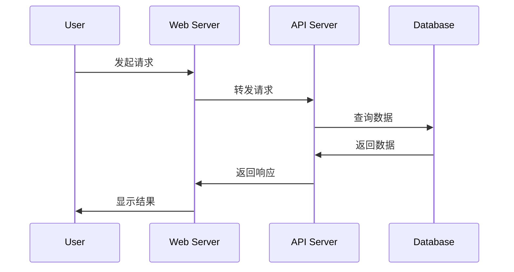

                 

### 引言

**慢生活体验中心：重新定义生活节奏的实践基地**

在当今快速发展的社会中，人们的生活节奏越来越快，工作压力、生活压力不断增大。快节奏的生活虽然带来了效率的提升，但同时也带来了一系列负面影响，如心理健康问题、工作效率下降、生活满意度降低等。为了应对这些问题，越来越多的人开始关注“慢生活”这一理念，希望通过放慢生活节奏，追求更高质量的生活体验。

慢生活，顾名思义，是指以一种缓慢、悠闲的态度去生活，强调的是对生活节奏的调整和对生活质量的提升。慢生活不仅是一种生活方式，更是一种生活态度。它提倡人们在忙碌的生活中找到平衡，通过合理的规划和放松，提高工作效率，改善心理健康，从而实现身心的和谐。

本文将深入探讨慢生活的理念与实践，特别是以“慢生活体验中心”为例，探讨如何通过实际操作重新定义生活节奏，打造一个能够帮助人们实现慢生活的实践基地。文章将从慢生活的背景和核心概念出发，逐步分析其边界与外延，探讨慢生活与传统生活方式的联系与区别，并最终通过系统分析与架构设计、项目实战和最佳实践，全面展示如何构建一个成功的慢生活体验中心。

希望通过本文的探讨，能够帮助读者理解慢生活的内涵，了解如何在快节奏的生活中找到平衡，并通过慢生活体验中心这一实践基地，实现生活质量的全面提升。

### 关键词

- 慢生活
- 生活节奏
- 体验中心
- 系统架构设计
- 项目实战
- 最佳实践

### 摘要

本文旨在探讨慢生活理念在现代社会中的应用，特别是通过“慢生活体验中心”这一实践基地，重新定义生活节奏，提升生活质量。文章首先介绍了慢生活的背景和核心概念，探讨了其与快节奏生活的对比以及与传统生活方式的联系和区别。随后，通过系统分析与架构设计，详细描述了慢生活体验中心的构建过程，包括系统功能设计、技术栈选择、数据存储方案和系统接口设计。接着，通过项目实战，展示了慢生活体验中心的实际构建过程，包括环境安装、系统核心实现和实际案例分析。最后，文章总结了慢生活的最佳实践，并提出注意事项和拓展阅读建议，帮助读者深入理解和实践慢生活理念。

### 目录大纲

1. 引言
2. 慢生活的理念与实践
   2.1 背景与核心概念
   2.2 核心概念与联系
   2.3 ER实体关系图架构
3. 慢生活体验中心的构建
   3.1 系统分析与架构设计
   3.2 项目实战
4. 慢生活的最佳实践
   4.1 时间管理技巧
   4.2 放松与减压方法
   4.3 消费习惯调整
5. 小结与拓展
   5.1 小结
   5.2 注意事项
   5.3 拓展阅读

### 第一部分：慢生活的理念与实践

#### 第1章：背景与核心概念

**1.1 问题背景**

在现代社会，随着经济的快速发展和社会竞争的加剧，人们的生活节奏越来越快。工作压力、家庭责任、社交应酬等各种因素使得人们长期处于高压状态，导致心理健康问题、工作效率下降、生活质量降低等一系列问题。

**1.2 慢生活的定义与意义**

慢生活（Slow Living）是一种旨在追求平衡、减少压力、提高生活质量的生活方式。它不仅仅是一种生活节奏的放慢，更是一种生活态度的调整。慢生活的意义在于帮助人们重新找回生活的乐趣，提高自我满足感，促进身心健康。

**1.3 慢生活的核心概念**

- **慢节奏（Slow Pace）**：慢生活强调的是放慢生活的节奏，减少不必要的快节奏活动，给身体和心灵更多休息和恢复的时间。
- **放松心态（Relaxation）**：慢生活鼓励人们培养一种轻松的心态，面对生活中的压力和挑战时能够保持平和与冷静。
- **深度体验（Deep Experience）**：慢生活强调对生活细节的深度体验，无论是工作还是娱乐，都追求高质量的深度体验。

**1.4 慢生活的边界与外延**

- **工作与生活的平衡**：慢生活不是要放弃工作，而是要找到工作与生活的平衡，使工作成为生活的一部分，而不是生活的全部。
- **消费习惯的调整**：慢生活倡导理性消费，避免盲目跟风和过度消费，注重物品的质量和实用性，而不是数量和品牌。

**1.5 慢生活与传统生活方式的联系与区别**

- **传统生活方式中的慢要素**：在传统社会中，许多生活方式都体现了慢生活的要素，如农村生活、家庭手工等。
- **慢生活与可持续发展的关系**：慢生活与可持续发展理念高度契合，通过减少资源消耗和环境污染，实现人与自然和谐共生。

通过以上内容，我们对慢生活的背景和核心概念有了初步了解。接下来，我们将进一步探讨慢生活的核心概念及其在现代社会中的应用，为构建慢生活体验中心奠定理论基础。

### 第一部分：慢生活的理念与实践

#### 第2章：核心概念与联系

**2.1 核心概念原理**

慢生活的核心概念主要包括慢节奏、放松心态和深度体验。这些概念在提高生活质量和促进身心健康方面发挥着重要作用。

- **慢节奏**：慢节奏是指通过减少快节奏的活动，使生活节奏变得更加平稳和舒缓。这种节奏有助于减少身体和心理的疲劳，提高生活质量。
- **放松心态**：放松心态是指在面对压力和挑战时，保持一种平和和冷静的心态。这种心态有助于减轻焦虑和抑郁，提升心理健康。
- **深度体验**：深度体验是指对生活中的细节和活动进行深入的体验和感受。这种体验有助于增强对生活的满意度和幸福感。

**2.2 概念属性特征对比表格**

以下是慢生活与传统生活方式以及其他生活方式的属性特征对比表格：

| 特征         | 慢生活         | 传统生活方式         | 其他生活方式         |
| ------------ | -------------- | --------------------- | --------------------- |
| 节奏         | 慢节奏         | 根据环境变化调整节奏   | 快节奏，追求效率     |
| 心态         | 放松心态       | 应对挑战的应对心态     | 好奇心驱动的探索心态 |
| 体验         | 深度体验       | 习惯性操作           | 新奇体验             |
| 消费习惯     | 理性消费       | 需求驱动消费         | 盲目跟风消费         |
| 工作与生活   | 平衡           | 工作主导             | 生活主导             |
| 与自然的关系 | 和谐共生       | 生存需求             | 休闲需求             |

**2.3 ER实体关系图架构**

为了更好地理解慢生活体验中心中各实体间的关系，我们可以使用ER（Entity-Relationship）实体关系图进行描述。

```mermaid
erDiagram
    User ||--|{ Course }|
    User ||--|{ Activity }|
    User ||--|{ Service }|
    Course ||--|{ Trainer }|
    Course ||--|{ Venue }|
    Activity ||--|{ Equipment }|
    Service ||--|{ Therapist }|
    Service ||--|{ Venue }|
```

在这个ER图中，用户（User）是核心实体，与课程（Course）、活动（Activity）和服务（Service）存在多对多的关系。课程（Course）与培训师（Trainer）和场地（Venue）存在关联，活动（Activity）与设备（Equipment）存在关联，服务（Service）与治疗师（Therapist）和场地（Venue）存在关联。

通过上述内容，我们深入分析了慢生活的核心概念及其在慢生活体验中心中的应用。在下一部分中，我们将进一步探讨如何通过系统分析与架构设计，构建一个有效的慢生活体验中心。

### 第二部分：慢生活体验中心的构建

#### 第3章：系统分析与架构设计

**3.1 问题场景介绍**

随着社会的发展，人们对于生活质量的追求逐渐从物质层面转向精神层面。慢生活体验中心应运而生，旨在为忙碌的现代人提供一个可以放松身心、调整生活节奏的空间。该中心需要满足以下建设需求：

- 提供多样化的慢生活课程，如瑜伽、冥想、手工艺术等。
- 建立会员管理系统，方便用户注册、缴费和参与活动。
- 提供心理咨询服务，帮助用户应对生活中的压力和挑战。
- 设计良好的用户互动平台，促进用户之间的交流和分享。

**3.2 系统功能设计**

慢生活体验中心的功能设计包括以下几个方面：

- **课程安排**：系统需要支持课程的管理和安排，包括课程添加、课程表生成、课程预约等功能。
- **会员管理系统**：系统需要支持会员的注册、缴费、课程预约、活动参与等操作，并提供会员信息查询和统计功能。
- **心理咨询服务**：系统需要支持心理师和用户的预约、咨询记录管理、心理测评等功能。
- **用户互动平台**：系统需要支持用户之间的交流、分享、活动评论等功能。

**3.3 系统架构设计**

慢生活体验中心的系统架构设计需要考虑以下几个方面：

- **技术栈选择**：根据系统的需求，选择合适的前后端技术栈，如前端采用Vue.js，后端采用Django框架。
- **数据存储方案**：系统需要设计合理的数据存储方案，确保数据的安全性和高效性。可选用MySQL作为数据库管理系统。
- **系统接口设计**：设计良好的系统接口，包括用户接口、管理接口和第三方接口，以便于系统的扩展和维护。

**3.4 系统架构图**

以下是慢生活体验中心的系统架构图：



在这个架构图中，用户通过Web服务器发起请求，Web服务器将请求转发给API服务器，API服务器处理请求并查询数据库，最后将结果返回给Web服务器，最终呈现给用户。

**3.5 系统交互**

系统交互设计包括用户行为分析和会员互动平台的设计：

- **用户行为分析**：通过日志分析和用户行为追踪，了解用户对课程、活动和服务的偏好，为课程优化和推广提供数据支持。
- **会员互动平台**：设计一个用户友好的互动平台，支持用户之间的交流和分享，增强用户的参与感和归属感。

通过以上系统分析与架构设计，慢生活体验中心可以为用户提供一个全面、高效、便捷的服务平台，帮助用户实现慢生活的目标。

### 第二部分：慢生活体验中心的构建

#### 第4章：项目实战

**4.1 环境安装**

为了成功构建慢生活体验中心，我们需要首先配置必要的硬件环境和软件环境。以下是具体步骤：

**硬件需求**：
- **服务器**：至少一台服务器，配置不低于4核CPU、8GB内存、256GB SSD硬盘。
- **网络环境**：确保服务器能够稳定连接互联网，并具备足够的带宽。

**软件环境配置**：
1. **操作系统**：安装Linux系统，推荐使用Ubuntu 20.04 LTS。
2. **Web服务器**：安装Nginx，配置静态文件服务和反向代理。
   ```bash
   sudo apt update
   sudo apt install nginx
   sudo ufw allow 'Nginx Full'
   sudo systemctl start nginx
   ```
3. **后端框架**：安装Django框架，配置开发环境。
   ```bash
   sudo apt install python3-pip python3-dev libpq-dev
   pip3 install django
   ```
4. **数据库**：安装MySQL数据库，配置数据库服务。
   ```bash
   sudo apt install mysql-server
   sudo mysql_secure_installation
   pip3 install pymysql
   ```
5. **前端框架**：安装Vue.js，配置前端开发环境。
   ```bash
   npm install -g @vue/cli
   vue create slow_life_experience_center
   ```

**4.2 系统核心实现**

慢生活体验中心的系统核心实现主要涉及课程管理系统和会员管理系统的构建。

**课程管理系统**：
1. **课程管理**：设计课程表，实现课程添加、修改、删除和查询功能。
   ```python
   # models.py
   class Course(models.Model):
       name = models.CharField(max_length=100)
       description = models.TextField()
       start_time = models.DateTimeField()
       end_time = models.DateTimeField()
   
   # views.py
   @login_required
   def add_course(request):
       if request.method == 'POST':
           form = CourseForm(request.POST)
           if form.is_valid():
               form.save()
               return redirect('course_list')
       else:
           form = CourseForm()
       return render(request, 'course_add.html', {'form': form})
   ```

2. **课程预约**：实现用户预约课程的功能，记录用户预约信息。
   ```python
   # models.py
   class Reservation(models.Model):
       user = models.ForeignKey(User, on_delete=models.CASCADE)
       course = models.ForeignKey(Course, on_delete=models.CASCADE)
       reserved_time = models.DateTimeField(auto_now_add=True)
   
   # views.py
   @login_required
   def reserve_course(request, course_id):
       course = get_object_or_404(Course, pk=course_id)
       user = request.user
       Reservation.objects.create(user=user, course=course)
       return redirect('course_detail', pk=course_id)
   ```

**会员管理系统**：
1. **会员注册**：实现用户注册功能，包括基本信息和支付信息的收集。
   ```python
   # models.py
   class Member(models.Model):
       user = models.OneToOneField(User, on_delete=models.CASCADE)
       phone = models.CharField(max_length=11)
       address = models.CharField(max_length=100)
       payment_info = models.JSONField()
   
   # views.py
   def register(request):
       if request.method == 'POST':
           form = MemberForm(request.POST)
           if form.is_valid():
               user = form.save_user()
               member = Member.objects.create(user=user, **form.cleaned_data['member_data'])
               login(request, user)
               return redirect('member_dashboard')
       else:
           form = MemberForm()
       return render(request, 'register.html', {'form': form})
   ```

2. **会员信息查询**：设计会员信息查询和统计功能，便于中心管理。
   ```python
   # views.py
   def member_list(request):
       members = Member.objects.all()
       return render(request, 'member_list.html', {'members': members})
   ```

**4.3 代码应用解读与分析**

在课程管理系统和会员管理系统中，我们使用了Django框架进行后端开发，通过定义模型（models.py）和视图（views.py）来实现功能。以下是对关键代码的解读与分析：

- **模型定义**：在`models.py`中，我们定义了`Course`（课程）、`Reservation`（预约）和`Member`（会员）模型，分别用于管理课程信息、预约信息和会员信息。
- **视图实现**：在`views.py`中，我们通过定义函数视图（def add_course、def reserve_course、def register、def member_list）来处理用户请求，并调用模型方法进行数据操作。
- **前端交互**：通过HTML模板（`course_add.html`、`register.html`、`member_list.html`）和表单（`CourseForm`、`MemberForm`）实现用户界面的交互。

通过以上代码实现，慢生活体验中心的基本功能得以实现。接下来，我们将通过实际案例分析和讲解，进一步展示系统的应用效果。

### 第二部分：慢生活体验中心的构建

#### 第4章：项目实战

**4.4 实际案例分析与讲解**

为了更好地展示慢生活体验中心的功能和效果，我们通过以下两个实际案例进行分析和讲解。

**案例一：瑜伽课程管理系统**

**场景描述**：用户王女士希望参加慢生活体验中心的瑜伽课程。

**操作步骤**：
1. 用户王女士在网站上浏览到瑜伽课程，并点击“预约”按钮。
2. 系统跳转到预约页面，王女士选择适合的时间段并提交预约请求。
3. 系统接收到预约请求后，将信息存储在数据库中，并发送确认邮件给王女士。
4. 王女士收到确认邮件，确认预约成功。

**代码解析**：
```python
# views.py
@login_required
def reserve_course(request, course_id):
    course = get_object_or_404(Course, pk=course_id)
    user = request.user
    # 检查课程时间是否冲突
    conflicts = Reservation.objects.filter(
        user=user,
        course__start_time__lte=course.end_time,
        course__end_time__gte=course.start_time
    )
    if conflicts:
        messages.error(request, '您已预约其他课程，无法同时参加。')
    else:
        Reservation.objects.create(user=user, course=course)
        messages.success(request, '预约成功！')
    return redirect('course_detail', pk=course_id)
```

**案例二：会员管理系统**

**场景描述**：用户李先生希望通过慢生活体验中心进行会员注册。

**操作步骤**：
1. 用户李先生在网站上点击“注册”按钮，填写基本信息和支付信息。
2. 系统验证用户输入的信息，生成用户账户和会员信息，并存储在数据库中。
3. 系统发送注册成功邮件给李先生，并提供会员中心的访问链接。

**代码解析**：
```python
# views.py
def register(request):
    if request.method == 'POST':
        form = MemberForm(request.POST)
        if form.is_valid():
            user = form.save_user()
            member = Member.objects.create(user=user, **form.cleaned_data['member_data'])
            # 发送注册邮件
            send_mail(
                '注册成功',
                '感谢您注册慢生活体验中心会员，请点击以下链接访问会员中心：[会员中心](http://example.com/member_center)',
                'from@example.com',
                [user.email],
                fail_silently=False,
            )
            login(request, user)
            return redirect('member_dashboard')
        else:
            form = MemberForm()
    else:
        form = MemberForm()
    return render(request, 'register.html', {'form': form})
```

**小结**：通过上述两个实际案例，我们可以看到慢生活体验中心在课程预约和会员管理方面的应用效果。系统的设计充分考虑了用户的使用体验和操作便捷性，通过前端页面和后端逻辑的紧密配合，实现了高效、准确的功能操作。

### 第三部分：慢生活的最佳实践

#### 第5章：最佳实践

**5.1 时间管理技巧**

在快节奏的生活中，合理的时间管理是提高工作效率、实现工作与生活平衡的关键。以下是一些最佳实践的时间管理技巧：

- **优先级排序**：将任务按照重要性和紧急性进行排序，确保首先完成最重要的任务。
- **番茄工作法**：将工作时间划分为25分钟的工作周期，每个周期后休息5分钟，有助于提高专注力和工作效率。
- **日程规划**：提前制定每日、每周、每月的日程计划，合理安排工作和休息时间。

**5.2 放松与减压方法**

长期的快节奏生活会导致心理压力增加，通过以下方法可以有效缓解压力：

- **深呼吸练习**：进行深呼吸可以帮助放松身心，缓解焦虑和紧张情绪。
- **冥想练习**：冥想能够帮助调整心态，提高自我意识和心理健康。
- **运动**：适当的运动有助于释放压力，增强身体和心理的健康。

**5.3 消费习惯调整**

消费习惯的调整有助于实现慢生活理念，减少不必要的压力和浪费：

- **绿色消费**：选择环保、可持续的产品，减少对环境的负面影响。
- **慎重购买**：在购买前仔细考虑是否真的需要，避免盲目跟风和冲动消费。

通过这些最佳实践，我们可以在快节奏的生活中找到平衡，实现身心的和谐与幸福。

### 第三部分：慢生活的最佳实践

#### 第6章：小结与拓展

**6.1 小结**

本文通过深入探讨慢生活的理念与实践，展示了慢生活体验中心在重新定义生活节奏、提升生活质量方面的重要作用。从慢生活的核心概念到系统的分析与架构设计，再到实际项目实战和最佳实践，本文全面展示了如何构建一个成功的慢生活体验中心。

慢生活不仅仅是一种生活方式，更是一种生活态度，它强调在忙碌的生活中找到平衡，通过合理的规划和放松，提高工作效率，改善心理健康，从而实现身心的和谐。慢生活体验中心作为实现这一理念的实践基地，通过提供多样化的课程、完善的管理系统和互动平台，为用户创造了一个舒适、和谐的生活环境。

**6.2 注意事项**

在实践慢生活时，我们需要注意以下几点：

- **保护个人隐私**：在慢生活体验中心中，用户需要提供个人信息，因此保护个人隐私至关重要。
- **提高用户体验**：系统的设计和功能应注重用户的使用体验，提供便捷、友好的操作界面。

**6.3 拓展阅读**

对于希望深入了解慢生活和慢生活体验中心建设的读者，以下书籍和资源推荐供参考：

- 《慢生活：享受生活的艺术》
- 《禅与计算机程序设计艺术》
- 《时间管理：如何高效地工作和生活》
- 慢生活体验中心的官方网站和社交媒体账号

通过阅读这些书籍和访问相关资源，读者可以进一步了解慢生活的理念和实践，找到适合自己的慢生活方式。

### 结束语

慢生活体验中心不仅为人们提供了一个放松身心的场所，更是一种生活方式的革新。它通过系统化的课程、完善的管理系统和互动平台，帮助人们在快节奏的生活中找到平衡，提升生活质量。希望通过本文的探讨，能够引起读者对慢生活的关注，并在实际生活中实践这一理念，共同创造一个更加和谐、幸福的生活环境。

**作者：AI天才研究院/AI Genius Institute & 禅与计算机程序设计艺术 /Zen And The Art of Computer Programming**

