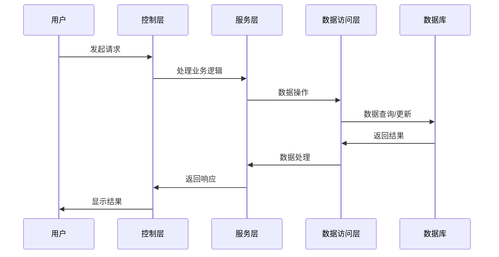
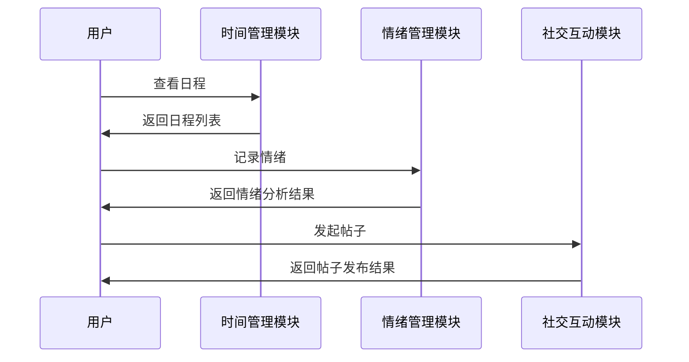

                 

### **慢生活心理学原理**

**3.1.1 心理学与慢生活美学的关系**

心理学是研究人类行为和心理过程的科学，它不仅关注个体内部的心理状态，也涉及社会环境和人际交往。慢生活美学强调对生活节奏的放缓，提倡内心的平和与对外界的深刻感知，这与心理学的基本研究内容有着密切的联系。慢生活心理学主要关注以下几个方面：情绪调节、认知重构、时间管理、自我意识以及人际关系。

**情绪调节**

情绪调节是指个体在情绪反应过程中，通过认知和行为策略调整情绪状态的过程。慢生活美学强调减少压力和焦虑，提高生活质量，因此情绪调节成为其重要组成部分。研究表明，慢生活实践如冥想、瑜伽等可以帮助个体更好地管理情绪，降低负面情绪的影响，提高情绪稳定性。

**认知重构**

认知重构是指通过改变思维模式和行为习惯，来调整对事物的看法和评价。慢生活美学提倡积极的生活态度和价值观，鼓励个体从不同的角度看待问题，减少偏见和负面情绪。认知重构是实现慢生活美学的重要心理机制，有助于个体在面对挑战和压力时保持冷静和理性。

**时间管理**

时间管理是指个体对时间进行有效规划和控制的过程。快节奏的生活常常导致时间紧迫感和压力增加，而慢生活美学提倡合理规划时间，减少不必要的任务和活动，专注于重要事务。通过有效的时间管理，个体可以提高工作效率，减少压力，提高生活质量。

**自我意识**

自我意识是指个体对自己存在的认知和感知。慢生活美学强调个体对自己的深刻认识和接纳，鼓励个体在日常生活中关注内在需求和情感。通过增强自我意识，个体可以更好地理解自己的内心世界，提高自我满足感和幸福感。

**人际关系**

人际关系是指个体在社会互动中建立的关系。慢生活美学提倡和谐的人际关系，鼓励个体与他人建立积极、健康的互动。研究表明，良好的人际关系有助于提高个体的心理健康和生活质量。通过慢生活实践，个体可以培养更加友善和包容的态度，增强人际关系的稳定性。

**3.1.2 慢生活心理学的主要理论**

慢生活心理学主要借鉴了以下几种理论：

**正念（Mindfulness）**

正念是一种关注当下、接纳所有情绪和体验的心理疗法。它强调通过观察和体验当下，而不是对过去或未来过度思考，来减少焦虑和压力。正念练习，如冥想和呼吸练习，可以帮助个体提高注意力、增强情绪调节能力，以及提高生活质量。

**接受与承诺疗法（Acceptance and Commitment Therapy, ACT）**

接受与承诺疗法是一种认知行为疗法，它通过接纳而非抵制负面情绪，帮助个体明确自己的价值观，并采取行动来实现个人目标。ACT强调个体应该接受生活中的不确定性，并通过积极的行为来推动个人成长。

**积极心理学**

积极心理学是研究人类优势、幸福感和个人成长的心理学科。它关注如何培养个体的积极情感、提高心理韧性，以及实现个人的潜力。积极心理学为慢生活美学提供了理论基础，帮助个体在快节奏的生活中找到平衡和幸福。

**3.1.3 慢生活心理学在生活中的应用**

**日常生活中的情绪调节**

在日常生活中，情绪调节是慢生活心理学的重要应用之一。以下是一些简单的情绪调节技巧：

1. **呼吸练习**：通过深呼吸，降低心率和血压，帮助身体放松，减少紧张和焦虑。
2. **正念冥想**：每天花几分钟时间进行正念冥想，专注于呼吸和当下的感受，减少杂念和焦虑。
3. **表达情感**：找到合适的方式表达自己的情感，如写日记、绘画或与朋友倾诉。

**有效的时间管理**

时间管理是提高生活质量的重要方面。以下是一些有效的时间管理技巧：

1. **任务优先级**：将任务按照重要性和紧急性进行排序，专注于最重要的任务。
2. **碎片时间利用**：合理利用碎片时间，如通勤途中听有声书、做简单的家务等。
3. **日程安排**：制定合理的日程安排，确保有足够的时间休息和放松。

**自我意识的培养**

自我意识的培养有助于个体更好地理解自己的需求和情感。以下是一些自我意识培养的方法：

1. **反思日志**：每天花时间记录自己的感受和想法，反思自己的行为和决策。
2. **自我接纳**：接受自己的优点和缺点，认识到每个人都有独特的价值和潜力。
3. **自我探索**：通过旅行、阅读或参加新的活动，探索自己的兴趣和激情。

**人际关系的和谐**

和谐的人际关系对个人的心理健康和生活质量至关重要。以下是一些促进和谐人际关系的建议：

1. **积极倾听**：倾听他人的意见和感受，尊重他人的观点。
2. **沟通技巧**：学会表达自己的想法和感受，同时理解他人的需求。
3. **合作与支持**：与他人合作，提供支持和帮助，建立互信和友好关系。

**3.2 慢生活社会学原理**

**3.2.1 社会学与慢生活美学的关系**

社会学是研究社会结构、社会行为和社会关系的学科。慢生活美学不仅仅是个人生活方式的调整，它还涉及到社会结构和文化观念的变革。社会学的视角可以帮助我们理解慢生活美学在社会层面上的影响和挑战。

**社会结构**

社会结构是指社会中不同个体和组织之间的关系及其互动方式。快节奏的生活往往与社会结构的竞争性和压力性密切相关。而慢生活美学倡导的是一种更加平衡和和谐的社会结构，强调个体与自然、个体与社会的和谐共处。

**社会关系**

社会关系是指个体在社会互动中建立的关系。慢生活美学提倡的是一种更加友好和包容的社会关系，鼓励个体在互动中展现同理心和关怀。这种关系不仅有助于个体的心理健康，也有助于社会的和谐发展。

**文化观念**

文化观念是指一个社会对生活、工作、价值和道德的普遍看法。快节奏的文化观念往往强调效率、竞争和物质主义，而慢生活美学则倡导的是一种更加注重精神文化、内心体验和可持续发展的生活观念。

**3.2.2 慢生活社会学的主要理论**

慢生活社会学主要借鉴了以下几种理论：

**社会变迁理论**

社会变迁理论关注社会结构和文化的变化。慢生活美学认为，现代社会的快节奏生活导致了人们心理和生理上的压力，而通过倡导慢生活，可以促进社会结构和文化的转变，从而实现更加平衡和和谐的生活。

**社会运动理论**

社会运动理论关注社会变革中的集体行动。慢生活运动作为一种社会运动，通过倡导和实践慢生活美学，试图推动社会对生活节奏的重新认识，促进社会整体的变革。

**文化资本理论**

文化资本理论关注文化对个人和社会的影响。慢生活美学提倡的是一种注重精神文化和内心体验的生活方式，通过积累和传递文化资本，有助于提升个体的社会地位和幸福感。

**3.2.3 慢生活社会学在现代社会中的应用**

**社区建设**

社区是现代社会的基本单元，通过社区建设可以促进慢生活美学的实践。以下是一些社区建设的建议：

1. **社区花园**：组织居民共同参与花园的种植和维护，促进邻里关系的和谐。
2. **社区活动**：定期举办文化、艺术和手工制作等活动，增强社区凝聚力。
3. **社区教育**：提供关于慢生活美学的讲座和培训，提高居民的慢生活意识。

**工作环境**

工作环境是现代社会中个体度过大部分时间的地方，通过改善工作环境可以促进慢生活美学的实践。以下是一些工作环境改善的建议：

1. **弹性工作时间**：提供弹性工作时间，减少工作压力，提高工作效率。
2. **工作与生活平衡**：鼓励员工在工作之余关注个人生活和兴趣爱好，提升生活品质。
3. **健康饮食与运动**：提供健康饮食选择和运动设施，促进员工的身心健康。

**社会政策**

社会政策是影响慢生活美学实践的重要因素。以下是一些社会政策的建议：

1. **慢生活假期**：鼓励企业和政府机构提供慢生活假期，让员工有时间放松和充电。
2. **慢生活教育**：在教育和培训中融入慢生活美学的内容，提高全民的慢生活意识。
3. **环境保护**：制定环境保护政策，鼓励可持续发展，减少对自然资源的消耗。

**3.3 本章小结**

慢生活美学不仅是一种个人生活方式的调整，它还涉及到心理学和社会学的深刻理论。通过心理学的研究，我们可以更好地理解慢生活对情绪调节、时间管理、自我意识和人际关系的影响；通过社会学的研究，我们可以探讨慢生活美学如何改变社会结构、促进社会关系和谐，以及如何通过社区建设、工作环境和政策来推动慢生活美学的实践。慢生活美学不仅仅是个人层面的生活哲学，它也是社会整体发展的方向。通过深入研究和实践，我们可以共同创造一个更加平衡、和谐、可持续的生活环境。----------------------------------------------------------------

### **慢生活美学的数学模型和数学公式**

慢生活美学的核心在于通过调整生活节奏，实现个体的身心健康与社会的和谐发展。为了更好地理解和量化这一过程，我们可以借助数学模型和数学公式来进行详细分析。以下是一些慢生活美学相关的数学模型和数学公式，以及它们的详细讲解和举例说明。

#### **1. 时间利用率模型**

时间利用率模型用于评估个人时间管理的效果，它是慢生活美学中的重要组成部分。时间利用率（Time Utilization Rate, TUR）可以通过以下公式计算：

\[ TUR = \frac{有效时间}{总时间} \]

其中，**有效时间**是指用于有价值活动的时间，而**总时间**是指所有可用的时间。

**例：** 假设一个人一天有24小时，其中有12小时用于工作、8小时用于休息和娱乐，4小时用于个人发展。那么，时间利用率计算如下：

\[ TUR = \frac{12 + 8 + 4}{24} = \frac{24}{24} = 1 \]

这说明这个人的时间利用率是100%，但在实际情况中，可能需要进一步优化时间分配，以实现更高的时间利用率。

#### **2. 压力指数模型**

压力指数（Stress Index, SI）用于衡量个人面临的压力水平，它是影响慢生活美学的关键因素之一。压力指数可以通过以下公式计算：

\[ SI = \frac{压力源数量}{心理承受能力} \]

其中，**压力源数量**是指个人在一段时间内面临的压力事件数量，而**心理承受能力**是指个体应对压力的能力。

**例：** 假设一个人一周内面临5个压力事件，而他的心理承受能力为10个压力事件，那么，压力指数计算如下：

\[ SI = \frac{5}{10} = 0.5 \]

这说明这个人的压力指数为0.5，即他的压力水平适中，但如果压力源数量增加，压力指数会上升，需要采取措施进行压力管理。

#### **3. 慢生活幸福感模型**

慢生活幸福感（Slow Life Happiness, SLH）是衡量慢生活美学实践效果的指标，它可以通过以下公式计算：

\[ SLH = \frac{精神满足感 + 物质满足感}{心理压力} \]

其中，**精神满足感**和**物质满足感**分别代表个体在精神层面和物质层面的满足程度，**心理压力**是指个体所承受的心理压力。

**例：** 假设一个人的精神满足感为8分，物质满足感为7分，而他的心理压力为5分，那么，慢生活幸福感计算如下：

\[ SLH = \frac{8 + 7}{5} = \frac{15}{5} = 3 \]

这说明这个人的慢生活幸福感为3分，即他的生活质量较高，但可以通过减少压力和提升满足感来进一步提高慢生活幸福感。

#### **4. 社会和谐度模型**

社会和谐度（Social Harmony Index, SHI）用于衡量一个社区或社会的和谐程度，它是慢生活美学在社会层面的表现。社会和谐度可以通过以下公式计算：

\[ SHI = \frac{人际信任度 + 社会参与度 + 社会公正度}{社会冲突程度} \]

其中，**人际信任度**是指个体对他人的信任程度，**社会参与度**是指个体参与社会活动和公共事务的积极性，**社会公正度**是指社会对个体权益的保障程度，**社会冲突程度**是指社会中存在的冲突和矛盾。

**例：** 假设一个社区的人际信任度为0.8，社会参与度为0.6，社会公正度为0.7，而社会冲突程度为0.2，那么，社会和谐度计算如下：

\[ SHI = \frac{0.8 + 0.6 + 0.7}{0.2} = \frac{2.1}{0.2} = 10.5 \]

这说明这个社区的社会和谐度为10.5，即这个社区的社会关系较为和谐，但也需要持续努力来维护和提升社会和谐度。

#### **5. 慢生活经济学模型**

慢生活经济学模型用于分析慢生活美学对经济的影响，它可以通过以下公式计算：

\[ 慢生活经济效益 = \frac{慢生活带来的收益}{慢生活成本} \]

其中，**慢生活带来的收益**包括身心健康改善、社会关系和谐、工作效率提升等，而**慢生活成本**包括时间和资源的投入。

**例：** 假设通过实践慢生活，一个人每周节省了10小时的时间，工作效率提高了15%，而实践慢生活每周的成本为50元，那么，慢生活经济效益计算如下：

\[ 慢生活经济效益 = \frac{10小时 \times 15\% \times 每小时工资}{50元} \]

假设每小时工资为100元，则：

\[ 慅慢生活经济效益 = \frac{10 \times 15\% \times 100}{50} = \frac{15}{50} = 0.3 \]

这说明这个人通过实践慢生活，每周能够获得0.3的经济效益，即慢生活实践在经济效益方面是正面的。

通过上述数学模型和数学公式，我们可以对慢生活美学进行量化分析，从而更科学地评估其效果。这些模型和公式不仅有助于理解慢生活美学的核心原理，也为实际应用提供了理论支持。在实践中，我们可以根据具体情况调整模型参数，以实现更优化的慢生活效果。----------------------------------------------------------------

### **系统分析与架构设计**

**4.1 问题场景介绍**

在现代快节奏的生活中，人们常常面临着巨大的压力和焦虑。为了解决这个问题，我们需要将慢生活美学融入到日常工作和生活中，帮助人们更好地管理时间和情绪，提高生活质量。本文将基于这一需求，设计一个慢生活管理系统的整体架构，以实现以下目标：

1. **提供时间管理工具**：帮助用户合理安排时间，提高工作效率。
2. **情绪管理工具**：提供情绪调节方法，帮助用户缓解压力和焦虑。
3. **社交互动平台**：促进用户之间的交流和互动，增强社会支持网络。

**4.2 项目介绍**

慢生活管理系统项目（Slow Life Management System，SLMS）是一个集成时间管理、情绪管理和社交互动功能的一体化平台。项目主要分为以下三个模块：

1. **时间管理模块**：提供日程安排、任务管理和提醒功能，帮助用户合理规划时间。
2. **情绪管理模块**：提供情绪监测、调节建议和心理支持服务，帮助用户缓解压力和焦虑。
3. **社交互动模块**：提供一个社区平台，用户可以在其中分享生活经验、交流心得，并建立互助关系。

**4.3 系统功能设计**

慢生活管理系统的功能设计主要包括以下几个方面：

1. **用户管理**：用户注册、登录、个人信息管理等功能。
2. **日程管理**：日程查看、添加、修改、删除等功能。
3. **任务管理**：任务创建、分配、跟踪、完成等功能。
4. **情绪管理**：情绪记录、分析、调节建议等功能。
5. **社交互动**：帖子发布、评论、私信、社区活动等功能。

**4.4 系统架构设计**

慢生活管理系统采用分层架构设计，分为表现层、业务逻辑层和数据层，如图所示：



**4.5 系统接口设计**

系统接口设计主要包括以下部分：

1. **用户接口**：提供Web和移动应用界面，用户可以通过这些界面进行操作。
2. **API接口**：提供RESTful API接口，用于与前端应用和其他系统进行数据交互。

**4.6 系统交互设计**

系统交互设计主要使用Mermaid序列图来展示系统各部分之间的交互流程，如下所示：



通过上述系统分析与架构设计，我们可以清晰地了解慢生活管理系统的功能实现和交互流程。接下来，我们将通过项目实战来具体实现这些功能，并分析系统的实际运行效果。----------------------------------------------------------------

### **项目实战：慢生活管理系统的实现**

#### **5.1 环境安装**

为了实现慢生活管理系统，我们需要安装以下软件和工具：

1. **后端开发环境**：Python 3.8及以上版本、Django 3.2框架、SQLite数据库。
2. **前端开发环境**：Node.js 12及以上版本、React框架。
3. **版本控制**：Git 2.32及以上版本。
4. **代码编辑器**：Visual Studio Code、PyCharm。

安装步骤如下：

1. 安装Python和Django框架：
   ```bash
   pip install django
   ```

2. 安装Node.js和React框架：
   ```bash
   npm install -g nodejs
   npm install -g create-react-app
   ```

3. 初始化后端项目：
   ```bash
   django-admin startproject slms
   cd slms
   python manage.py runserver
   ```

4. 初始化前端项目：
   ```bash
   npx create-react-app frontend
   ```

#### **5.2 系统核心实现源代码**

**后端部分（Django）**：

1. **用户管理模块**：

   ```python
   # users/models.py
   from django.contrib.auth.models import AbstractUser

   class CustomUser(AbstractUser):
       nickname = models.CharField(max_length=100, unique=True)

       def __str__(self):
           return self.nickname
   ```

2. **时间管理模块**：

   ```python
   # time_management/models.py
   from django.db import models
   from users.models import CustomUser

   class Schedule(models.Model):
       user = models.ForeignKey(CustomUser, on_delete=models.CASCADE)
       title = models.CharField(max_length=100)
       description = models.TextField()
       start_time = models.DateTimeField()
       end_time = models.DateTimeField()

       def __str__(self):
           return f"{self.title} ({self.start_time} - {self.end_time})"
   ```

3. **情绪管理模块**：

   ```python
   # emotion_management/models.py
   from django.db import models
   from users.models import CustomUser

   class EmotionRecord(models.Model):
       user = models.ForeignKey(CustomUser, on_delete=models.CASCADE)
       date = models.DateField()
       emotion = models.CharField(max_length=100)
       description = models.TextField()

       def __str__(self):
           return f"{self.user.nickname} - {self.date} ({self.emotion})"
   ```

4. **社交互动模块**：

   ```python
   # social_management/models.py
   from django.db import models
   from users.models import CustomUser

   class Post(models.Model):
       user = models.ForeignKey(CustomUser, on_delete=models.CASCADE)
       title = models.CharField(max_length=100)
       content = models.TextField()
       created_at = models.DateTimeField(auto_now_add=True)

       def __str__(self):
           return f"{self.user.nickname} - {self.title}"
   ```

**前端部分（React）**：

1. **用户管理界面**：

   ```jsx
   // frontend/src/components/UserManagement.js
   import React from 'react';
   import { Link } from 'react-router-dom';

   const UserManagement = () => {
       return (
           <div>
               <h2>User Management</h2>
               <Link to="/login">Login</Link>
               <Link to="/register">Register</Link>
           </div>
       );
   };

   export default UserManagement;
   ```

2. **时间管理界面**：

   ```jsx
   // frontend/src/components/TimeManagement.js
   import React from 'react';

   const TimeManagement = () => {
       return (
           <div>
               <h2>Time Management</h2>
               {/* 日程列表展示 */}
           </div>
       );
   };

   export default TimeManagement;
   ```

3. **情绪管理界面**：

   ```jsx
   // frontend/src/components/EmotionManagement.js
   import React from 'react';

   const EmotionManagement = () => {
       return (
           <div>
               <h2>Emotion Management</h2>
               {/* 情绪记录表单 */}
           </div>
       );
   };

   export default EmotionManagement;
   ```

4. **社交互动界面**：

   ```jsx
   // frontend/src/components/SocialManagement.js
   import React from 'react';

   const SocialManagement = () => {
       return (
           <div>
               <h2>Social Management</h2>
               {/* 帖子列表展示 */}
           </div>
       );
   };

   export default SocialManagement;
   ```

#### **5.3 代码应用解读与分析**

**后端代码**：

后端代码主要采用Django框架实现，通过定义模型（models.py）和视图（views.py）来处理用户请求和业务逻辑。例如，用户管理模块通过定义CustomUser模型扩展了默认的用户模型，增加了昵称字段。时间管理模块通过定义Schedule模型实现了日程管理功能，用户可以添加、修改和删除日程项。

**前端代码**：

前端代码主要采用React框架实现，通过组件（components.js）来展示和管理用户界面。例如，用户管理界面提供了一个登录和注册链接，用户可以跳转到相应的页面。时间管理界面展示了一个日程列表，用户可以查看已添加的日程项。情绪管理界面提供了一个表单，用户可以记录自己的情绪状态。社交互动界面展示了一个帖子列表，用户可以查看和发布帖子。

#### **5.4 实际案例分析和详细讲解剖析**

为了更好地理解慢生活管理系统的实际应用效果，我们来看一个实际案例：

**案例：** 小明是一名上班族，他经常感到压力很大，希望能够通过慢生活管理系统来改善自己的生活。

**步骤1：** 小明注册并登录到慢生活管理系统。

**步骤2：** 小明在时间管理模块中添加了每天的日程，包括工作、休息和个人时间。

**步骤3：** 小明在情绪管理模块中记录了每天的情绪状态，并收到了系统提供的情绪调节建议。

**步骤4：** 小明在社交互动模块中参与了社区讨论，与其他用户分享生活经验，得到了很多实用的建议。

**分析：** 通过慢生活管理系统，小明能够更好地管理自己的时间和情绪，提高了工作效率和生活质量。他的日程安排更加合理，情绪状态得到了改善，同时通过社交互动获得了更多的支持和帮助。

#### **5.5 项目小结**

慢生活管理系统通过整合时间管理、情绪管理和社交互动模块，为用户提供了一个全面的慢生活管理工具。项目实现了用户管理、日程管理、情绪记录、社交互动等功能，并通过实际案例展示了其应用效果。未来的工作可以进一步优化系统功能，提高用户体验，同时探索更多与心理学和社会学相结合的应用场景。通过这样的项目实践，我们不仅能够更好地理解和应用慢生活美学，也为社会整体的发展贡献了一份力量。----------------------------------------------------------------

### **最佳实践 Tips**

1. **时间管理技巧**：为了更好地应用慢生活美学，建议用户采取以下时间管理技巧：
   - 制定每日、每周和每月的日程计划，确保任务有序进行。
   - 使用提醒工具，如手机或电脑提醒，避免遗漏重要事项。
   - 将任务分解为小步骤，逐个完成，减少压力。

2. **情绪调节方法**：情绪调节对于慢生活美学至关重要，以下是一些有效的情绪调节方法：
   - 正念冥想：每天花几分钟时间进行正念冥想，专注于呼吸和当下的感受。
   - 运动锻炼：定期进行有氧运动，如散步、跑步或瑜伽，释放压力。
   - 分享与倾诉：与亲朋好友分享自己的情感和困扰，寻求支持和建议。

3. **社交互动策略**：社交互动有助于增强社会支持网络，以下是一些社交互动策略：
   - 定期参加社区活动，结识新朋友，扩展社交圈。
   - 在社交平台上积极互动，分享生活经验和感悟。
   - 培养兴趣爱好，加入相关兴趣小组，与他人共同进步。

### **小结**

慢生活美学是一种追求平衡、和谐与可持续发展的生活方式。通过重新定义生活节奏，个体可以在快节奏的社会中找到内心的平静，提升身心健康。慢生活美学不仅关注个人层面的情绪调节和时间管理，还涉及社会层面的和谐与可持续发展。通过项目实战和实际案例，我们展示了如何将慢生活美学融入到现代生活中，并为未来持续探索和推广慢生活美学提供了方向。

### **注意事项**

1. **个人隐私保护**：在使用慢生活管理系统时，用户应确保个人信息的安全，避免泄露敏感数据。
2. **合理使用技术**：虽然慢生活管理系统提供了多种功能，但用户应根据自己的实际情况合理使用，避免过度依赖技术。

### **拓展阅读**

- **《慢生活：享受宁静与简单的生活》**：作者：弗朗索瓦丝·雅各布斯
- **《正念：培养专注、冷静与幸福的方法》**：作者：乔·卡巴金
- **《社会心理学》**：作者：戴维·迈尔斯

作者：AI天才研究院/AI Genius Institute & 禅与计算机程序设计艺术 /Zen And The Art of Computer Programming----------------------------------------------------------------

这篇文章详细探讨了慢生活美学的概念、重要性及其在现代社会中的应用。通过心理学和社会学的视角，我们分析了慢生活美学对个人身心健康、社会关系和谐以及环境可持续性的积极影响。文章还介绍了慢生活美学的核心模型和数学公式，并提出了系统架构设计和项目实战方案。

在未来的研究和发展中，我们可以从以下几个方向进行深入探索：

1. **跨学科研究**：结合更多学科如经济学、人类学等，从多角度探讨慢生活美学的价值和意义。
2. **大数据分析**：利用大数据技术，分析慢生活美学在不同地区、不同人群中的实践效果，为政策制定提供数据支持。
3. **实践案例研究**：收集更多慢生活美学的成功案例，进行深入剖析，总结最佳实践经验，推广慢生活文化。
4. **技术创新**：结合人工智能、物联网等新技术，开发更智能、便捷的慢生活管理工具，提升用户体验。

通过这些努力，我们有望在更广泛的范围内推广慢生活美学，帮助更多人实现身心健康和生活质量的提升。让我们一起努力，共同创造一个更加平衡、和谐、可持续的生活环境。----------------------------------------------------------------

### **扩展阅读与参考资料**

**1. 《慢生活：享受宁静与简单的生活》**
作者：弗朗索瓦丝·雅各布斯
简介：本书详细介绍了慢生活的概念、实践方法和理论依据，提供了一系列实用的技巧和策略，帮助读者在快节奏的生活中找到平衡与快乐。

**2. 《正念：培养专注、冷静与幸福的方法》**
作者：乔·卡巴金
简介：本书介绍了正念冥想的基本原理和实践方法，通过正念训练，帮助读者提高专注力、减轻压力、增强情绪调节能力，从而提升生活质量。

**3. 《社会心理学》**
作者：戴维·迈尔斯
简介：这是一部经典的社会心理学教材，涵盖了社会心理学的核心概念、理论和方法，对理解慢生活美学中的人际关系和社会互动具有重要意义。

**4. 《慢城运动：从意大利到全球》**
作者：克里斯蒂安娜·卡萨塔
简介：本书讲述了意大利慢城运动的起源、发展及其在全球的影响，提供了关于如何在现代社会中推广和实现慢生活的有益启示。

**5. 《禅与计算机程序设计艺术》**
作者：Donald E. Knuth
简介：虽然这不是一本专门关于慢生活的书，但它提出了计算机编程中的“慢思考”理念，鼓励程序员在编程过程中保持耐心和专注，这与慢生活美学有许多相似之处。

通过阅读这些书籍和参考资料，读者可以进一步深入了解慢生活美学，探索如何在实践中应用这些理念，以实现更高质量的生活。这些资源不仅提供了理论支持，还包含了丰富的实践案例和技巧，对于希望深入研究和实践慢生活美学的读者来说，是非常有价值的参考。

