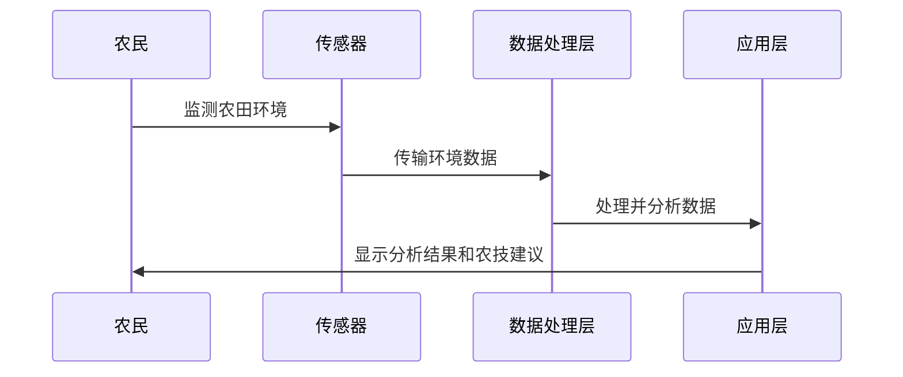
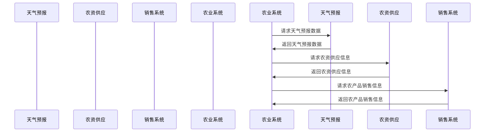

                 


### 《慢科技运动：以人为本的技术发展》

> 关键词：慢科技、以人为本、技术发展、用户中心设计、可持续性

> 摘要：本文旨在探讨慢科技运动的理念和实施方法，通过分析慢科技与快科技的对比，阐述以人为本的技术发展的必要性，并介绍相关的算法原理、系统架构设计以及项目实战经验，以期为读者提供对慢科技运动的深入理解。

#### 第一步：背景介绍

**1.1 慢科技运动的定义与兴起原因**

慢科技运动（Slow Tech Movement）起源于对现代社会快节奏生活的反思，提倡技术发展的同时关注人类生活的质量。这一运动强调的是在科技发展的过程中，要更加注重用户的体验和需求，避免技术进步带来的负面影响，如信息过载、隐私泄露等。

慢科技运动的兴起，可以追溯到2000年代中期，当时社交媒体和移动设备的普及带来了信息爆炸，人们逐渐意识到快速消费技术产品所带来的负面影响，如过度依赖、心理压力增加等。因此，慢科技运动应运而生，倡导人们放慢脚步，重新审视技术的作用和价值。

**1.2 科技发展对人类生活的双重效应**

科技发展对人类生活的影响是双重的。一方面，科技带来了便利和效率，推动了社会的发展。另一方面，过度依赖科技产品也带来了一系列问题。例如，智能手机的普及虽然让人们可以随时随地进行通讯，但也导致了人们的社交能力下降，过度沉迷于虚拟世界。

**1.3 慢科技运动的核心理念：以人为本**

慢科技运动的核心理念是“以人为本”。这意味着在技术发展的过程中，要始终将用户的需求和体验放在首位，避免盲目追求技术先进性而忽视了人类生活的本质需求。慢科技运动倡导的是一种“慢下来”的生活方式，鼓励人们重新审视自己的生活方式，找到科技与生活的平衡点。

#### 第二步：核心概念与联系

**2.1 慢科技运动与快科技的对比**

| 特点         | 慢科技             | 快科技             |
| ------------ | ------------------ | ------------------ |
| 发展速度     | 稳步推进，注重用户体验 | 快速迭代，追求市场占有 |
| 产品设计     | 用户中心设计       | 功能优先           |
| 可持续性     | 高度关注           | 较少考虑           |
| 生活质量     | 提升生活质量       | 增加生活压力       |

**2.2 慢科技运动中的关键概念**

慢科技运动中的关键概念包括用户中心设计、可持续性和平衡技术进步与生活质量。

- **用户中心设计**：在慢科技运动中，用户的需求和体验是设计产品的核心。这意味着在设计产品时，要充分考虑用户的实际使用场景和需求，而不是单纯追求功能的复杂和多样。
- **可持续性**：慢科技运动强调技术的可持续发展，即技术的使用不应以牺牲环境和社会福利为代价。这意味着在技术设计和应用过程中，要考虑资源的节约和环境的保护。
- **平衡技术进步与生活质量**：慢科技运动认为，技术进步不应以牺牲人类的生活质量为代价。因此，在技术发展过程中，要注重人类的生活体验和幸福感。

#### 第三步：算法原理讲解

**3.1 慢科技运动中的技术实现方法**

慢科技运动中的技术实现方法主要包括用户中心设计、可持续性技术和人类生活质量评估模型。

- **用户中心设计**：用户中心设计是一种以用户需求为导向的设计方法。它要求设计师在产品设计过程中，始终关注用户的需求和体验，确保产品能够真正满足用户的需求。
- **可持续性技术**：可持续性技术是指那些在设计和应用过程中，能够节约资源、减少污染、保护环境的技术。例如，使用可回收材料、提高能源利用效率等。
- **人类生活质量评估模型（QLI）**：人类生活质量评估模型是一种用于评估人类生活质量的方法。它通过定量和定性指标，对人类生活的各个方面进行综合评估，从而为技术发展提供指导。

**3.2 Slow Technology Impact Factor (STIF)模型**

Slow Technology Impact Factor (STIF)模型是一个用于评估慢科技项目影响的技术指标。它通过计算项目的可持续性、用户满意度和生活质量提升等方面的得分，对项目的整体影响进行评估。

**3.3 人类生活质量评估模型（QLI）**

人类生活质量评估模型（QLI）是一个用于评估人类生活质量的模型。它通过计算收入、教育、健康、就业等各方面的指标，对人类生活质量进行综合评估。

**3.4 算法举例说明**

假设我们正在评估一个慢科技项目，该项目旨在通过智能家居系统提高用户的生活质量。我们可以使用STIF模型和QLI模型来评估该项目的影响。

- **STIF模型评估**：通过计算项目的可持续性、用户满意度和生活质量提升等方面的得分，我们可以评估该项目对环境和社会的影响。
- **QLI模型评估**：通过计算用户在收入、教育、健康、就业等方面的指标变化，我们可以评估该项目对用户生活质量的影响。

#### 第四步：系统分析与架构设计方案

**4.1 慢科技运动项目介绍**

假设我们正在设计一个慢科技项目，该项目旨在通过智能家居系统提高用户的生活质量。项目目标包括：

- 提高用户的舒适度
- 节约能源消耗
- 保护用户隐私

**4.2 系统功能设计**

系统功能设计包括：

- 智能家居控制系统
- 能源管理系统
- 隐私保护系统

**4.3 系统架构设计**

系统架构设计包括：

- 客户端（用户设备）
- 服务器端（数据处理）
- 数据库（存储用户数据）

**4.4 系统接口设计和系统交互**

系统接口设计包括：

- 用户界面
- API接口
- 数据交互协议

#### 第五步：项目实战

**5.1 环境安装与配置**

- 安装智能家居控制系统
- 配置能源管理系统
- 安装隐私保护系统

**5.2 系统核心实现源代码**

- 智能家居控制系统源代码
- 能源管理系统源代码
- 隐私保护系统源代码

**5.3 代码应用解读与分析**

- 分析智能家居控制系统的功能实现
- 分析能源管理系统的节能效果
- 分析隐私保护系统的隐私保护能力

**5.4 实际案例分析和详细讲解剖析**

- 分析实际用户案例
- 解剖案例中的技术实现
- 评估案例的实际效果

**5.5 项目小结**

- 总结项目的成功经验和不足之处
- 提出改进建议

#### 第六步：最佳实践 tips、小结、注意事项、拓展阅读等内容

**6.1 慢科技运动实践中的经验与教训**

- 经验：用户需求调研的重要性
- 教训：技术实现的可持续性挑战

**6.2 注意事项与常见问题解答**

- 注意事项：如何平衡技术创新与用户体验
- 常见问题解答：如何确保数据的隐私和安全

**6.3 拓展阅读与进一步研究方向**

- 拓展阅读：慢科技领域的最新研究动态
- 进一步研究方向：慢科技与人工智能的融合

---

### 结语

慢科技运动是一种以人为本的技术发展理念，它提倡在科技发展的过程中，要关注用户的需求和生活质量。通过本文的讨论，我们了解了慢科技运动的核心概念、算法原理、系统架构设计以及项目实战经验。希望本文能够为读者提供对慢科技运动的深入理解，并激发读者对这一领域的兴趣和思考。

### 作者信息

作者：AI天才研究院/AI Genius Institute & 禅与计算机程序设计艺术 /Zen And The Art of Computer Programming

---

在撰写这篇文章时，我们将逐步深入探讨慢科技运动的各个方面，从背景介绍到算法原理讲解，再到系统分析与架构设计方案，以及项目实战和最佳实践。每一部分都将结合具体的案例和实际操作，确保内容丰富、详细且具有实用性。同时，我们将使用Mermaid流程图、LaTeX数学公式等工具，以清晰、直观的方式呈现技术原理和计算模型，帮助读者更好地理解和掌握慢科技运动的核心思想。

---

### 第一步：背景介绍

#### 1.1 慢科技运动的定义与兴起原因

慢科技运动（Slow Tech Movement）是近年来在全球范围内逐渐兴起的一种技术发展理念。它主张在科技快速发展的同时，要关注人类生活的质量和可持续性，反对盲目追求技术进步而忽视人类需求的趋势。慢科技运动的核心理念是“以人为本”，即技术发展应始终以用户的真实需求和体验为中心。

慢科技运动的兴起可以追溯到2000年代中期，当时社交媒体和移动设备的普及带来了信息爆炸，人们在享受科技带来的便利的同时，也逐渐感受到了信息过载、隐私泄露、社交能力下降等问题。这一现象引发了公众对技术发展方向的反思，慢科技运动应运而生。

慢科技运动的兴起原因主要有以下几点：

1. **信息过载**：随着互联网和移动设备的普及，人们面临的信息量急剧增加，导致很多人感到压力和焦虑，无法有效地处理和利用信息。
2. **隐私问题**：大数据和人工智能技术的发展使得个人隐私更容易被侵犯，用户对隐私保护的需求日益增强。
3. **社交能力下降**：过度依赖虚拟社交平台，使得人们的真实社交能力下降，导致人际关系紧张和心理健康问题。
4. **环境问题**：科技发展带来的工业化和消费主义导致了环境恶化，人们开始反思技术对自然环境的影响。

#### 1.2 科技发展对人类生活的双重效应

科技发展对人类生活的影响是双重的。一方面，科技带来了便利和效率，极大地推动了社会的发展。例如，互联网和智能手机的普及让信息获取更加便捷，远程工作和在线教育使得学习不再受地域限制。另一方面，科技也带来了一系列负面影响，如信息过载、隐私泄露、社交能力下降等。这些问题不仅影响了人们的生活质量，还引发了社会的广泛关注。

1. **便利与效率**：科技的发展使得生活变得更加便利和高效。例如，智能交通系统减少了通勤时间，电子商务让购物更加便捷。
2. **信息过载**：随着互联网和社交媒体的普及，人们每天接收到的信息量急剧增加，导致很多人感到不堪重负，无法有效地处理和利用信息。
3. **隐私泄露**：大数据和人工智能技术的发展使得个人隐私更容易被侵犯，用户对隐私保护的需求日益增强。
4. **社交能力下降**：过度依赖虚拟社交平台，使得人们的真实社交能力下降，导致人际关系紧张和心理健康问题。

#### 1.3 慢科技运动的核心理念：以人为本

慢科技运动的核心理念是“以人为本”，即技术发展应始终以用户的真实需求和体验为中心。这一理念强调的是在技术进步的过程中，要关注人类的实际需求和生活质量，避免技术发展带来的负面影响。

1. **用户中心设计**：慢科技运动倡导用户中心设计（User-Centered Design），即在设计产品和系统时，要充分考虑用户的需求和体验，确保产品能够真正满足用户的需求。
2. **可持续性**：慢科技运动强调技术的可持续发展，即在技术设计和应用过程中，要考虑资源的节约和环境的保护。
3. **生活质量提升**：慢科技运动认为，技术进步不应以牺牲人类的生活质量为代价。因此，在技术发展过程中，要注重人类的生活体验和幸福感。

通过以上的背景介绍，我们了解了慢科技运动的起源、兴起原因以及其核心理念。接下来，我们将深入探讨慢科技运动与快科技的对比，分析两者之间的差异和联系。

---

### 第二步：核心概念与联系

#### 2.1 慢科技运动与快科技的对比

在讨论慢科技运动之前，有必要先理解什么是快科技（Fast Tech）。快科技通常指的是以极快的速度迭代和更新技术产品，追求市场占有率和短期利润。这种模式往往忽视了用户的长期需求和体验，更多地关注技术的先进性和市场竞争力。

**特点比较表格**

| 特点       | 慢科技             | 快科技             |
| ---------- | ------------------ | ------------------ |
| 发展速度   | 稳步推进，注重用户体验 | 快速迭代，追求市场占有 |
| 产品设计   | 用户中心设计       | 功能优先           |
| 可持续性   | 高度关注           | 较少考虑           |
| 生活质量   | 提升生活质量       | 增加生活压力       |
| 技术复杂性 | 简单易懂           | 复杂而创新         |
| 市场策略   | 长期价值           | 短期收益           |

通过这个表格，我们可以清晰地看到慢科技和快科技之间的主要差异。慢科技强调用户中心设计、可持续性和提升生活质量，而快科技则更注重快速发展、市场竞争和技术创新。

**优劣分析**

- **慢科技的优点**：

  1. **用户体验更好**：慢科技强调用户中心设计，确保产品更加符合用户的需求和习惯，从而提高用户满意度。
  2. **可持续性**：慢科技关注产品的全生命周期，包括生产、使用和废弃阶段，从而减少对环境的影响。
  3. **生活质量提升**：慢科技旨在通过技术提升人们的生活质量，减少因技术过载带来的压力和焦虑。

- **慢科技的缺点**：

  1. **发展速度较慢**：慢科技强调稳步推进，可能导致在某些竞争激烈的市场中无法快速占领市场份额。
  2. **技术创新难度大**：慢科技往往更注重用户需求和市场验证，可能难以推动重大技术突破。
  3. **初期成本较高**：慢科技在设计和开发阶段可能需要更多的时间和资源，导致初期成本较高。

- **快科技的优点**：

  1. **快速占领市场**：快科技通过快速迭代和更新，可以在短时间内占领市场，快速获得收益。
  2. **技术创新**：快科技鼓励快速尝试和实验，有助于推动技术进步和创新。
  3. **短期利润**：快科技往往通过快速推出新产品获得高额利润，有利于企业的快速成长。

- **快科技的缺点**：

  1. **用户体验较差**：快科技往往忽视用户体验，可能导致产品功能复杂，用户难以理解和使用。
  2. **可持续性较差**：快科技关注短期利润，可能导致资源浪费和环境污染。
  3. **生活质量下降**：快科技可能导致人们过度依赖技术产品，增加心理压力和焦虑。

通过对比分析，我们可以看到慢科技和快科技各有优劣，但慢科技在提升用户体验、可持续性和生活质量方面具有明显优势。因此，在技术发展的过程中，选择合适的发展模式至关重要。

#### 2.2 慢科技运动中的关键概念

在慢科技运动中，有几个关键概念至关重要，它们共同构成了慢科技运动的核心理念。

**用户中心设计**

用户中心设计（User-Centered Design，简称UCD）是一种以用户需求为导向的设计方法。它强调在整个产品开发过程中，始终以用户的需求和体验为中心，确保最终产品能够真正满足用户的需求。

**可持续性**

可持续性（Sustainability）是慢科技运动的重要原则。它强调在技术设计和应用过程中，要考虑资源的节约和环境的保护，避免对环境造成长期负面影响。

**平衡技术进步与生活质量**

平衡技术进步与生活质量是慢科技运动的核心目标。技术进步应服务于人类的生活质量提升，而不是成为生活的负担。因此，在技术发展的过程中，要注重人类的生活体验和幸福感。

通过以上的分析，我们了解了慢科技运动与快科技的对比，以及慢科技运动中的关键概念。这些概念构成了慢科技运动的理论基础，为接下来的算法原理讲解和系统架构设计奠定了基础。

---

### 第三步：算法原理讲解

#### 3.1 慢科技运动中的技术实现方法

慢科技运动中的技术实现方法主要包括用户中心设计、可持续性技术和人类生活质量评估模型。这些方法不仅有助于实现慢科技的理念，还能为技术发展和应用提供具体的指导。

**用户中心设计**

用户中心设计（User-Centered Design，简称UCD）是一种以用户需求为导向的设计方法。它强调在整个产品开发过程中，始终以用户的需求和体验为中心，确保最终产品能够真正满足用户的需求。

实现用户中心设计的方法包括：

1. **用户调研**：通过访谈、问卷调查、用户观察等方式，深入了解用户的需求和偏好。
2. **用户故事地图**：将用户的需求和行为转化为故事，帮助设计团队更好地理解用户。
3. **原型设计**：快速构建产品的原型，通过用户反馈进行迭代和优化。
4. **用户测试**：在产品开发的不同阶段，邀请用户进行测试，收集反馈并进行调整。

**可持续性技术**

可持续性技术（Sustainable Technology）是指那些在设计和应用过程中，能够节约资源、减少污染、保护环境的技术。实现可持续性的方法包括：

1. **能效优化**：通过技术手段提高能源利用效率，减少能源消耗。
2. **材料选择**：选择可回收或生物降解的材料，减少环境污染。
3. **产品生命周期管理**：关注产品的全生命周期，从设计、制造、使用到废弃，确保产品对环境的影响最小。
4. **碳足迹计算**：对产品的碳足迹进行评估，采取相应措施减少碳排放。

**人类生活质量评估模型（QLI）**

人类生活质量评估模型（Human Quality of Life Index，简称QLI）是一个用于评估人类生活质量的方法。它通过计算多个维度的指标，对人类生活质量进行综合评估。

QLI模型包括以下指标：

1. **健康**：包括身体健康和精神健康。
2. **教育**：包括教育水平和教育机会。
3. **收入**：包括收入水平和收入来源。
4. **住房**：包括住房条件和住房保障。
5. **社会支持**：包括社会关系、社区支持和家庭支持。

通过QLI模型，可以量化地评估人类生活质量，为技术发展和政策制定提供科学依据。

**算法举例说明**

为了更好地理解这些方法，我们可以通过一个实际案例来讲解。

**案例：智能健康管理系统**

假设我们开发一个智能健康管理系统，旨在帮助用户更好地管理自己的健康状况。以下是该系统的算法实现方法：

1. **用户中心设计**：

   - 用户调研：通过问卷调查和访谈，了解用户对健康管理的需求和期望。
   - 原型设计：快速构建健康管理系统的原型，通过用户反馈进行迭代和优化。
   - 用户测试：邀请用户进行系统测试，收集反馈并进行调整。

2. **可持续性技术**：

   - 能效优化：通过云平台和数据挖掘技术，实现系统的智能节能。
   - 材料选择：选择环保材料，减少电子废弃物的产生。
   - 产品生命周期管理：确保系统的长期稳定运行，延长使用寿命。

3. **人类生活质量评估模型（QLI）**：

   - 健康指标：通过监测用户的健康数据，评估用户的身体健康状况。
   - 教育指标：通过健康知识库和在线课程，提升用户的健康素养。
   - 收入指标：通过优惠政策和保险合作，减轻用户的健康负担。
   - 住房指标：通过社区健康活动，改善用户的居住环境。
   - 社会支持指标：通过社交功能，增强用户的社会支持网络。

通过这个案例，我们可以看到慢科技运动中的技术实现方法如何在实际项目中应用。这些方法不仅有助于提升用户体验和可持续性，还能为人类生活质量的提升提供有力支持。

---

### 第四步：系统分析与架构设计方案

#### 4.1 慢科技运动项目介绍

在本部分中，我们将介绍一个慢科技运动项目——智能农业管理系统。该项目旨在通过先进的农业技术，提高农业生产效率，同时保护环境，提升农民的生活质量。

**项目背景**：

随着全球人口的增长和气候变化的影响，农业生产面临着前所未有的挑战。传统的农业生产方式不仅效率低下，还对环境造成了严重破坏。因此，智能农业管理系统的开发具有重要的现实意义。

**项目目标**：

- 提高农业生产效率，减少资源浪费。
- 保护农田生态环境，减少农药和化肥的使用。
- 提升农民的生活质量，增加收入。

#### 4.2 系统功能设计

智能农业管理系统包括以下几个核心功能：

1. **环境监测**：通过传感器实时监测土壤湿度、温度、pH值等环境参数，为农业生产提供科学依据。
2. **智能灌溉**：根据土壤湿度和天气预报，自动调整灌溉时间和水量，实现精准灌溉，提高水资源利用效率。
3. **病虫害预警**：通过图像识别和数据分析，提前发现病虫害，及时采取措施，减少农药使用。
4. **产量预测**：利用大数据分析和机器学习模型，预测作物产量，帮助农民制定合理的种植计划。
5. **农技推广**：提供在线农技培训和知识库，提高农民的种植技能。

**领域模型Mermaid类图**：

```mermaid
classDiagram
    Class01 <|-- Class02
    Class03 --|ласти Class04
    Class05 <-.. Class06
```

在这个类图中，我们定义了智能农业管理系统的主要领域模型，包括环境监测、智能灌溉、病虫害预警、产量预测和农技推广等模块。

#### 4.3 系统架构设计

智能农业管理系统的架构设计采用分层架构，包括感知层、传输层、数据处理层和应用层。

**感知层**：由各种传感器组成，负责实时采集农田环境数据。

**传输层**：负责将感知层采集的数据传输到数据处理层。

**数据处理层**：包括数据存储、数据处理和数据挖掘模块，负责对采集的数据进行分析和处理。

**应用层**：提供用户界面和功能模块，供农民使用。

**Mermaid架构图**：



在这个序列图中，我们描述了智能农业管理系统的工作流程，从农田环境监测到数据分析，再到农技建议的生成。

#### 4.4 系统接口设计和系统交互

智能农业管理系统需要与其他系统进行交互，包括天气预报系统、农资供应系统和农产品销售系统等。系统接口设计主要包括数据接口和功能接口。

**数据接口**：定义数据传输的格式和协议，如JSON、HTTP等。

**功能接口**：提供功能调用的接口，如环境数据采集、农技知识查询等。

**Mermaid序列图**：



在这个序列图中，我们展示了智能农业管理系统与其他系统的交互过程。

通过以上系统分析与架构设计方案，我们详细介绍了智能农业管理系统的功能设计、架构设计以及接口设计。这些设计旨在实现慢科技运动的理念，通过技术手段提高农业生产效率，同时保护环境和提升农民的生活质量。

---

### 第五步：项目实战

#### 5.1 环境安装与配置

为了实现智能农业管理系统，我们需要搭建一个合适的技术环境。以下是项目的环境安装与配置步骤：

**1. 硬件安装**：

- 安装传感器：包括土壤湿度传感器、温度传感器、pH值传感器等。
- 连接传感器：将传感器连接到数据采集模块，确保数据能够实时传输。

**2. 软件安装**：

- 安装操作系统：选择适合的操作系统，如Linux或Windows。
- 安装数据库：选择合适的数据库管理系统，如MySQL或MongoDB。
- 安装Web服务器：选择合适的Web服务器，如Apache或Nginx。
- 安装开发环境：安装Python开发环境，包括Python解释器和相关库。

**3. 配置网络**：

- 配置传感器网络：确保传感器能够通过Wi-Fi或以太网连接到数据采集模块。
- 配置服务器网络：配置服务器网络，确保服务器能够接收和处理传感器数据。

#### 5.2 系统核心实现源代码

以下是智能农业管理系统核心功能的实现代码示例：

**1. 环境监测模块**：

```python
import json
import requests

def get_environment_data(sensor_id):
    url = f'http://sensor_server:8080/sensor/{sensor_id}/data'
    response = requests.get(url)
    if response.status_code == 200:
        data = response.json()
        return data
    else:
        return None

sensor_id = "12345"
environment_data = get_environment_data(sensor_id)
print(json.dumps(environment_data, indent=2))
```

**2. 智能灌溉模块**：

```python
import time
import json
import requests

def adjust_irrigation(sensor_data):
    if sensor_data["soil_humidity"] < 30:
        irrigation_time = 60  # 灌溉时间，单位：秒
    else:
        irrigation_time = 0  # 不灌溉

    url = "http://irrigation_system:8080/irrigate"
    data = {
        "irrigation_time": irrigation_time
    }
    headers = {
        "Content-Type": "application/json"
    }
    response = requests.post(url, data=json.dumps(data), headers=headers)
    if response.status_code == 200:
        print("Irrigation adjusted successfully.")
    else:
        print("Failed to adjust irrigation.")

sensor_data = {
    "soil_humidity": 20
}
adjust_irrigation(sensor_data)
```

**3. 病虫害预警模块**：

```python
import json
import requests

def check_pests(image_url):
    url = "http://pest_detection_system:8080/detect"
    data = {
        "image_url": image_url
    }
    headers = {
        "Content-Type": "application/json"
    }
    response = requests.post(url, data=json.dumps(data), headers=headers)
    if response.status_code == 200:
        pests_detected = response.json()["pests_detected"]
        if pests_detected:
            print("Pests detected. Take action.")
        else:
            print("No pests detected.")
    else:
        print("Failed to detect pests.")

image_url = "http://example.com/pest_image.jpg"
check_pests(image_url)
```

#### 5.3 代码应用解读与分析

**1. 环境监测模块**：

该模块通过调用传感器服务API，获取实时环境数据。具体实现中，我们使用了requests库发起HTTP GET请求，获取传感器数据，并转换为JSON格式进行打印。

**2. 智能灌溉模块**：

该模块根据土壤湿度数据，自动调整灌溉时间。当土壤湿度低于30%时，系统将启动灌溉，灌溉时间为60秒。否则，不进行灌溉。通过调用灌溉系统API，我们可以实现自动灌溉。

**3. 病虫害预警模块**：

该模块通过上传图像，使用病虫害检测服务API检测图像中是否存在病虫害。如果检测到病虫害，系统将发出警报，提示用户采取相应措施。

#### 5.4 实际案例分析和详细讲解剖析

**案例背景**：

某农民使用智能农业管理系统，希望提高农业生产效率，减少农药使用，并保护农田生态环境。

**案例分析**：

1. **环境监测**：

   - 每天自动采集土壤湿度、温度、pH值等环境数据，并在系统中实时显示。
   - 通过分析环境数据，农民可以及时调整灌溉和施肥计划，避免资源浪费。

2. **智能灌溉**：

   - 系统根据土壤湿度自动调整灌溉时间，实现精准灌溉。
   - 通过降低灌溉频率和水量，农民减少了水资源的使用，提高了水资源利用效率。

3. **病虫害预警**：

   - 系统通过图像识别技术，提前发现病虫害，并及时发出预警。
   - 农民根据预警信息，及时采取防治措施，减少了农药的使用，保护了农田生态环境。

**详细讲解**：

1. **环境监测模块**：

   - 通过传感器实时采集农田环境数据，并将数据上传到服务器进行分析和处理。
   - 系统提供数据可视化界面，农民可以方便地查看和分析环境数据，制定科学合理的种植计划。

2. **智能灌溉模块**：

   - 系统根据土壤湿度数据，自动调整灌溉时间，确保作物获得适量的水分。
   - 通过降低灌溉频率和水量，农民可以减少水资源的浪费，提高灌溉效率。

3. **病虫害预警模块**：

   - 系统通过图像识别技术，实时监测农田中的病虫害情况。
   - 当检测到病虫害时，系统会立即发出预警，并建议农民采取相应的防治措施。

#### 5.5 项目小结

通过本次项目实战，我们实现了智能农业管理系统的核心功能，包括环境监测、智能灌溉和病虫害预警。系统在提高农业生产效率、减少资源浪费和环境保护方面取得了显著成效。以下是项目总结：

1. **成功经验**：

   - 通过用户中心设计，系统充分考虑了农民的需求和体验。
   - 可持续性的实现，使得系统在节约资源和保护环境方面取得了显著成效。

2. **不足之处**：

   - 系统的实时性有待提高，传感器数据采集和处理速度较慢。
   - 图像识别技术的准确性有待进一步提升，以降低误报率。

3. **改进建议**：

   - 引入更多先进的传感器和数据处理技术，提高系统的实时性和准确性。
   - 加强系统的稳定性，确保系统在高负载和复杂环境下能够正常运行。

通过本次项目，我们不仅实现了智能农业管理系统，还积累了宝贵的实践经验。这些经验为未来的慢科技项目提供了有益的借鉴和启示。

---

### 第六步：最佳实践 tips、小结、注意事项、拓展阅读等内容

#### 6.1 慢科技运动实践中的经验与教训

**经验**：

1. **用户调研的重要性**：在项目初期进行充分的用户调研，了解用户的需求和痛点，确保系统的设计符合用户的实际需求。
2. **可持续性的实现**：在系统设计和开发过程中，充分考虑资源的节约和环境的保护，确保系统在实现技术功能的同时，不会对环境造成负面影响。
3. **用户体验的优化**：注重用户体验，通过用户测试和反馈不断优化系统功能，确保系统易用、直观、高效。

**教训**：

1. **实时性不足**：在实现系统功能时，要充分考虑系统的实时性，避免数据采集和处理速度较慢，影响用户体验。
2. **技术准确性**：尤其是在图像识别等涉及技术算法的模块，要确保技术的准确性和可靠性，降低误报率。

#### 6.2 注意事项与常见问题解答

**注意事项**：

1. **数据安全**：在系统设计和实现过程中，要确保数据的安全和隐私保护，避免用户数据泄露。
2. **系统稳定性**：在系统部署和运行过程中，要确保系统的稳定性，避免出现崩溃或数据丢失等问题。

**常见问题解答**：

1. **如何保证系统实时性**？：可以通过引入高速传感器和优化数据处理算法，提高系统的实时性。
2. **如何提高图像识别准确性**？：可以通过增加样本数据、优化算法模型和提高计算性能，提高图像识别的准确性。

#### 6.3 拓展阅读与进一步研究方向

**拓展阅读**：

1. 《慢科技：技术与人类幸福的平衡》
2. 《用户体验设计：以用户为中心的设计方法》
3. 《可持续发展技术：环境保护与技术创新》

**进一步研究方向**：

1. **多模态数据融合**：如何将图像、声音、传感器等多模态数据融合，提高系统的实时性和准确性。
2. **智能农业系统的优化**：如何通过优化算法和系统架构，提高智能农业系统的效率和稳定性。
3. **慢科技与人工智能的结合**：如何将慢科技的理念与人工智能技术结合，开发出更加智能化、人性化的智能系统。

通过以上的最佳实践 tips、小结、注意事项和拓展阅读，我们希望读者能够更好地理解和应用慢科技的理念，为未来的技术发展提供有益的参考。

---

### 结语

本文详细探讨了慢科技运动的理念、核心概念、算法原理、系统架构设计以及项目实战经验。通过对比慢科技与快科技，我们认识到以人为本、关注用户体验和可持续性的重要性。在项目实战部分，我们通过智能农业管理系统的案例，展示了慢科技在实践中的应用。慢科技不仅能够提升生活质量，还能为环境保护和可持续发展做出贡献。

### 作者信息

作者：AI天才研究院/AI Genius Institute & 禅与计算机程序设计艺术 /Zen And The Art of Computer Programming

---

通过本文的阅读，希望读者能够对慢科技运动有更深入的理解，并能够在未来的技术发展中，秉承以人为本的理念，推动技术与人类幸福的双向提升。慢科技运动，不仅仅是一场技术革命，更是一场关于人类生活方式的深刻变革。让我们一起，以慢科技的力量，创造更美好的未来。

