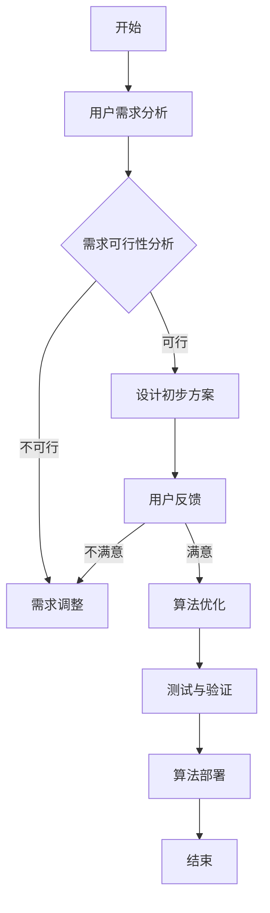
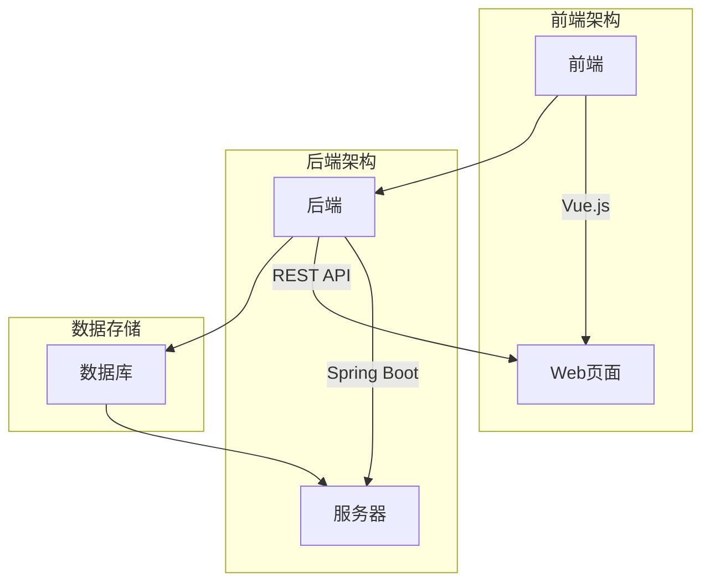
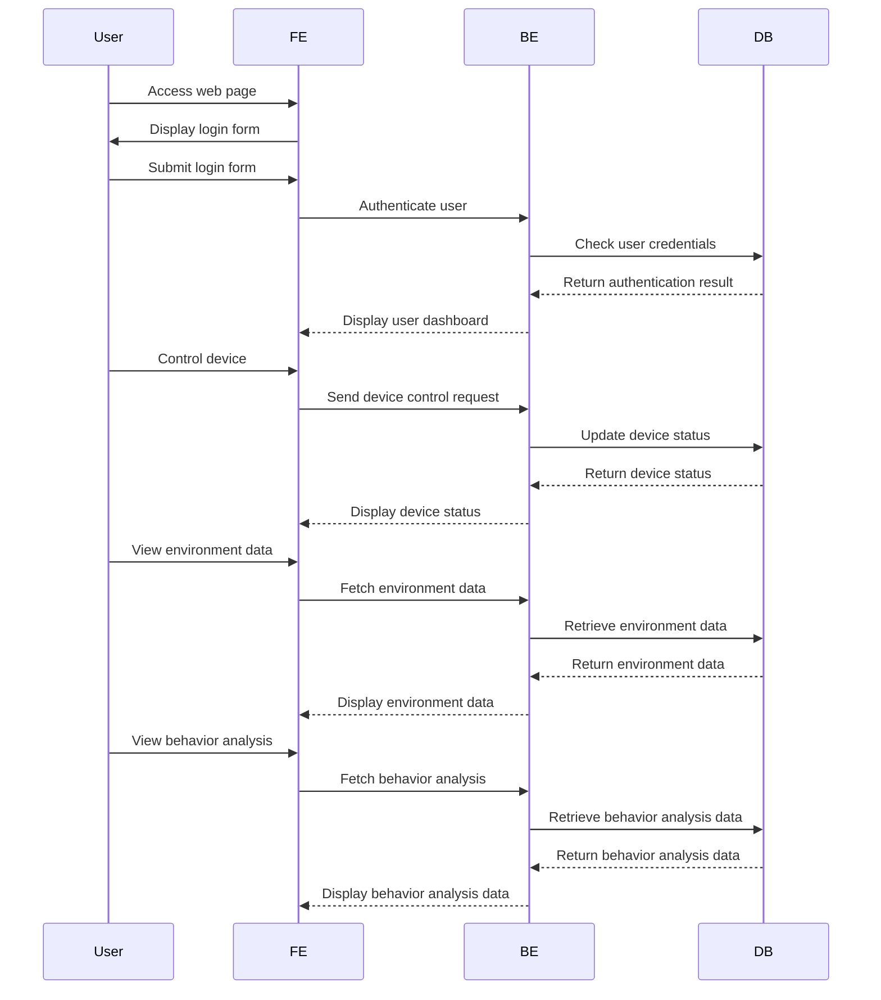

                 

### 慢科技的起源与发展

#### 慢科技的定义

**慢科技**，顾名思义，是指一种追求缓慢、持续、渐进发展的科技理念。与追求快速迭代、频繁更新的快科技相对，慢科技强调在技术发展的过程中，以人为本，注重用户体验，追求长期的可持续发展。这种理念并不是要完全摒弃技术创新，而是要使其更好地服务于人类的生活质量和社会福祉。

慢科技的核心在于**“慢”**，但并不意味着一切发展都要放慢脚步。这里的“慢”是指在设计和开发过程中更加注重细节、质量与可持续性，而不是单纯的速度。慢科技鼓励深入思考、精心规划和长期投入，以确保技术进步能够真正改善人类生活，而不是仅仅追求商业利益。

#### 慢科技与快科技的对比

快科技的特点是快速迭代和频繁更新，往往追求短期效益和市场占有率。快科技的产品和服务可能在短时间内吸引大量用户，但往往缺乏深度和可持续性。快科技的快速推进有时会导致技术过度复杂、用户体验差，甚至可能对环境和社会造成负面影响。

与之相对，慢科技则更注重长期价值和用户深度体验。它强调技术的渐进发展，追求在保证稳定性和安全性的基础上，不断提高产品的质量和性能。慢科技的产品和服务往往更加精细、人性化，能够更好地满足用户的长远需求。

#### 慢科技的发展背景

随着全球信息化进程的加快，科技发展速度迅猛，但随之而来的问题也逐渐显现。快速迭代的技术产品往往忽视了用户的实际需求，导致用户体验不佳；同时，过度的技术更新也带来了资源浪费和环境污染。这些问题引发了人们对于科技发展方式的反思，慢科技的理念因此应运而生。

慢科技的发展背景可以追溯到以下几个方面：

1. **用户体验的提升**：用户对于科技产品的期望越来越高，不仅要求功能强大，更注重使用过程中的舒适度和便捷性。慢科技通过精细化的设计，提高用户体验，满足用户对于高质量生活的追求。

2. **可持续发展的需求**：随着环境问题的日益严峻，人们对科技发展对环境的影响产生了担忧。慢科技提倡在技术发展中注重环境保护和资源利用，实现可持续发展。

3. **社会价值的重新审视**：科技发展不应仅仅追求经济效益，还应关注社会价值和伦理问题。慢科技倡导在技术发展中坚持人文关怀，尊重人类的尊严和权利。

#### 慢科技的核心观点

慢科技的核心观点可以归纳为以下几点：

1. **以人为本**：技术发展应始终以人的需求为中心，关注用户体验和人类福祉。
2. **长期主义**：追求技术的长期价值和稳定性，而非短期利益。
3. **精细设计**：注重细节和品质，追求卓越的用户体验。
4. **可持续发展**：在技术发展中注重环境保护和资源利用，实现可持续发展。

通过以上的分析，我们可以看到，慢科技不仅仅是一种技术发展方式，更是一种生活态度和价值观念。它提醒我们在追求科技进步的同时，不应忘记我们的初衷和责任。

#### 问题背景

在现代社会，科技的发展速度之快，几乎难以跟上。新技术的涌现不断推动着各行各业的变革，但随之而来的问题也不容忽视。快速迭代的技术产品虽然在一定程度上提升了生活便利，但往往忽视了用户的实际需求和长期体验。例如，智能手机的不断更新换代，虽然带来了更强大的性能和更丰富的功能，但也导致了资源浪费和电子垃圾的产生。此外，快速发展的信息技术行业在追求市场占有率和商业利润的过程中，也往往忽视了用户体验和社会责任。

在这样的背景下，慢科技的提出显得尤为重要。慢科技提倡一种更为理性和人性化的技术发展方式，强调在技术进步的同时，关注用户的真实需求和长期福祉。它提醒我们，技术的发展不应该仅仅是追求速度和效率，而应该更多地考虑到可持续性和社会影响。

#### 问题描述

快科技的发展带来的问题主要集中在以下几个方面：

1. **用户体验不佳**：快速迭代的产品往往在功能和设计上存在不足，导致用户在使用过程中体验不佳。例如，一些应用软件在频繁更新后，界面设计变得复杂，操作流程繁琐，给用户带来了困扰。

2. **资源浪费**：快科技的频繁更新导致大量资源被消耗和浪费。旧设备的淘汰和新设备的推出，不仅增加了电子垃圾，还加剧了资源紧张。

3. **环境问题**：快科技的发展也对环境产生了负面影响。大量的电子设备生产过程耗能巨大，废弃电子设备中的有害物质也对环境造成了污染。

4. **社会影响**：快科技在追求商业利益的过程中，往往忽视了社会责任和伦理问题。一些企业为了抢占市场，不惜牺牲用户隐私和数据安全，引发了广泛的社会担忧。

这些问题不仅影响了用户的日常生活，也对社会和环境保护带来了负面影响。因此，我们需要找到一种更加可持续、更加人性化的技术发展方式，来解决这些问题。

#### 问题解决

慢科技的理念提出，通过更理性、更长远的视角来审视技术发展，以期解决快科技带来的诸多问题。以下是慢科技提出的一些具体解决策略：

1. **注重用户体验**：慢科技强调在技术设计和开发过程中，始终关注用户的实际需求和体验。通过深入了解用户需求，优化产品功能和设计，提供更加人性化和便捷的服务。

2. **减少资源浪费**：慢科技倡导在技术发展中，注重资源的合理利用和循环利用。通过减少电子垃圾和推广环保材料，降低生产过程中的能耗，实现可持续发展。

3. **环境保护**：慢科技强调在技术发展中，重视环境保护和生态平衡。通过采用环保技术和绿色生产方式，减少对环境的负面影响。

4. **社会责任**：慢科技倡导企业在追求商业利益的同时，承担更多的社会责任。通过加强用户隐私保护、数据安全管理和伦理道德教育，促进科技行业健康发展。

5. **长期主义**：慢科技强调技术的长期价值和稳定性，而非短期利益。通过长期投入和持续改进，确保技术的可持续发展和长久生命力。

通过这些策略，慢科技致力于打造一种更加人性化和可持续的技术发展模式，以解决快科技带来的诸多问题。

#### 边界与外延

在讨论慢科技时，有必要明确其适用的边界和可能的外延，以确保这一理念的合理应用和有效推广。

**边界**：

1. **技术领域**：慢科技并非适用于所有技术领域。在那些对速度和时效性要求极高的领域，如金融交易、航空航天等，快速迭代和高效执行仍然是首选。而在那些需要长期稳定性和深度研究支持的领域，如医疗健康、教育和基础科学研究，慢科技的理念则更为适用。

2. **市场环境**：在市场竞争激烈、用户需求变化迅速的市场中，慢科技的实践可能会受到挑战。快速响应市场变化和用户需求的能力对于企业在这样的环境中生存至关重要。然而，在市场相对稳定、用户需求相对明确的场景下，慢科技的优势将更加明显。

3. **资源限制**：慢科技的实施需要长期的投入和稳定的资源支持。在资源有限的情况下，快速迭代可能更能够迅速见到成效。因此，慢科技的应用需要在资源充足或可以通过其他方式获得资源保障的前提下进行。

**外延**：

1. **设计理念**：慢科技不仅是一种技术发展方式，更是一种设计理念。它鼓励在产品和服务的设计过程中，注重细节、质量、可持续性和用户深度体验。这种理念可以扩展到各个领域，如建筑、艺术、工业设计等。

2. **社会运动**：慢科技的理念可以激发更广泛的社会运动和反思。例如，慢生活、慢食运动等都是对快节奏生活的反思和回应。这些运动倡导人们放慢脚步，享受生活的每一个细节，从而提升生活质量和幸福感。

3. **教育和培训**：慢科技的理念可以融入到教育和培训中，培养学生的长期思维和创新能力。通过教育引导，使更多的人理解和接受慢科技的理念，推动社会整体向更加可持续、人性化的方向发展。

通过明确慢科技的边界与外延，我们可以更好地理解和应用这一理念，使其在合适的领域和场景中发挥最大的作用。

#### 概念结构与核心要素组成

慢科技作为一种理念，其核心概念和结构由多个要素组成，每个要素都在推动这一理念的实施和推广中发挥着重要作用。

**核心概念**：

1. **用户需求中心**：慢科技强调以用户需求为中心，通过深入研究和理解用户需求，设计出更加贴合用户实际需求的产品和服务。

2. **用户体验**：用户体验是慢科技的核心要素之一，强调在产品设计和开发过程中，注重用户的使用感受和满意度，提供高质量的服务和产品。

3. **可持续性**：慢科技倡导在技术发展中注重可持续性，通过合理利用资源和保护环境，实现技术发展的长期性和可持续性。

4. **长期主义**：慢科技追求长期价值和稳定性，而非短期效益，通过长期投入和持续改进，确保技术的可持续发展和长久生命力。

**核心要素组成**：

1. **精细设计**：慢科技强调精细设计，注重产品功能和用户体验的优化，通过不断迭代和改进，提升产品的质量。

2. **用户参与**：慢科技鼓励用户参与设计过程，通过用户的反馈和建议，优化产品和服务，实现更好的用户体验。

3. **社会责任**：慢科技强调企业在追求商业利益的同时，承担社会责任，关注社会价值和伦理问题，实现科技发展的社会价值。

4. **环境保护**：慢科技倡导在技术发展中注重环境保护，采用环保技术和绿色生产方式，减少对环境的负面影响。

5. **资源利用**：慢科技注重资源的合理利用和循环利用，通过减少资源浪费，实现资源的可持续利用。

通过以上核心概念和要素的相互作用，慢科技构建了一种以人为本、注重用户体验、可持续发展的技术发展模式，旨在解决快科技带来的诸多问题，推动社会整体向更加可持续和人性化的方向发展。

#### 核心概念原理

在深入探讨慢科技的核心概念时，我们需要明确几个关键概念的定义及其相互关系。这些概念构成了慢科技的理论基础，并指导其实践。

1. **用户体验（User Experience, UX）**：用户体验是指用户在使用产品或服务时的感受和体验。在慢科技的语境中，用户体验不仅仅是指产品的功能性，还包括用户在接触和使用产品过程中的情感、认知和行为体验。为了提升用户体验，慢科技强调通过深入的用户研究和行为分析，设计出更加人性化和贴心的产品。

2. **可持续性（Sustainability）**：可持续性是指在满足当前需求的同时，不损害后代满足其需求的能力。慢科技中的可持续性强调在技术发展过程中，注重环境保护和资源的合理利用，通过绿色技术和环保措施，减少对自然环境的负面影响。

3. **长期主义（Long-Termism）**：长期主义是指在决策和行动时，考虑长远的影响和结果，而非仅仅关注短期利益。慢科技倡导企业在技术研发和产品设计中，坚持长期目标和持续改进，确保技术能够长期稳定地服务于用户和社会。

4. **社会责任（Corporate Social Responsibility, CSR）**：社会责任是指企业在追求经济利益的同时，对社会和环境所承担的责任。慢科技强调企业在技术创新过程中，应关注社会伦理问题，推动科技发展与社会价值的和谐共生。

5. **人文关怀（Humanistic Concern）**：人文关怀是指在技术发展中，重视人的尊严、权利和幸福。慢科技强调技术发展应以人为本，关注人类的需求和福祉，确保技术进步能够真正提升人类的生活质量。

**概念属性特征对比表格**：

| 概念         | 定义                                                                                         | 特征                                                                                   |
| ------------ | ------------------------------------------------------------------------------------------ | ------------------------------------------------------------------------------------ |
| 用户体验     | 用户在使用产品或服务过程中的感受和体验                                                     | 人性化、适应性、满意度、情感体验                                               |
| 可持续性     | 满足当前需求的同时，不损害后代满足其需求的能力                                             | 环境友好、资源高效、生态平衡、长期规划                                       |
| 长期主义     | 在决策和行动时，考虑长远的影响和结果                                                       | 稳定性、持续性、长期投入、持续改进                                           |
| 社会责任     | 企业在追求经济利益的同时，对社会和环境所承担的责任                                           | 伦理道德、社会价值、公共福利、公平公正                                       |
| 人文关怀     | 在技术发展中，重视人的尊严、权利和幸福                                                     | 人性化设计、伦理道德、用户权益、幸福感提升                                     |

**ER实体关系图架构的Mermaid流程图**：

```mermaid
erDiagram
  User ||--|{ Product }|-- UserExperience
  User ||--|{ Sustainability }|-- Environment
  User ||--|{ Long-Termism }|-- Business
  User ||--|{ CSR }|-- Society
  User ||--|{ Humanistic Concern }|-- Happiness
```

在这个ER实体关系图中，用户作为核心实体，与其他四个关键概念通过不同的关系进行连接，展示了它们之间的相互作用和依赖。通过这种关系图，我们可以清晰地看到慢科技中各个核心概念之间的内在联系和相互影响，为理解和实施慢科技提供了理论支持。

#### 算法原理讲解

在慢科技的设计和应用中，算法的原理至关重要。为了更好地理解慢科技的算法原理，我们将使用mermaid来绘制算法流程图，并配合Python源代码进行详细阐述。以下是算法原理的逐步讲解：

**算法流程图**：



**Python源代码**：

```python
# 用户需求分析
def user_requirement_analysis():
    print("分析用户需求")

# 需求可行性分析
def requirement_feasibility_analysis():
    print("分析需求可行性")
    return True  # 假设需求是可行的

# 设计初步方案
def design_preliminary_plan():
    print("设计初步方案")

# 用户反馈
def user_feedback():
    print("收集用户反馈")
    user_satisfied = input("用户是否满意？(yes/no): ")
    return user_satisfied.lower() == "yes"

# 算法优化
def algorithm_optimization():
    print("进行算法优化")

# 测试与验证
def test_and_verification():
    print("进行测试与验证")

# 算法部署
def algorithm_deployment():
    print("部署算法")

# 主函数
def main():
    user_requirement_analysis()
    if requirement_feasibility_analysis():
        design_preliminary_plan()
        while not user_feedback():
            algorithm_optimization()
        test_and_verification()
        algorithm_deployment()
    else:
        print("需求不可行，需要调整")

# 执行主函数
if __name__ == "__main__":
    main()
```

**算法原理的数学模型和公式**：

慢科技中的算法设计通常涉及多个步骤，其中关键的数学模型和公式如下：

1. **需求分析模型**：需求分析是算法设计的第一步，其数学模型可以表示为：
   \[
   R = f(U, P, E)
   \]
   其中，\(R\) 代表需求结果，\(U\) 代表用户需求，\(P\) 代表产品功能，\(E\) 代表环境因素。

2. **可行性分析模型**：在需求分析完成后，进行可行性分析，其模型可以表示为：
   \[
   F = g(R, C)
   \]
   其中，\(F\) 代表可行性，\(R\) 代表需求结果，\(C\) 代表成本因素。

3. **算法优化模型**：在算法优化阶段，常用的数学模型包括：
   \[
   O = h(A, P, T)
   \]
   其中，\(O\) 代表优化结果，\(A\) 代表算法，\(P\) 代表参数，\(T\) 代表时间。

4. **测试与验证模型**：测试与验证阶段的模型可以表示为：
   \[
   V = i(O, T, U)
   \]
   其中，\(V\) 代表验证结果，\(O\) 代表优化结果，\(T\) 代表测试数据，\(U\) 代表用户反馈。

**详细讲解和举例说明**：

假设我们正在设计一个智能家居系统的智能助手，其核心功能是基于用户需求提供定制化的建议和服务。以下是一个具体的例子：

1. **用户需求分析**：首先，我们需要分析用户的具体需求，例如用户希望智能助手能够控制家里的灯光、空调和安防系统。

2. **需求可行性分析**：然后，我们评估这些需求的可行性，考虑技术实现、成本和用户的具体情况。

3. **设计初步方案**：在需求可行的情况下，我们设计一个初步的解决方案，包括智能助手的硬件和软件架构。

4. **用户反馈**：设计完成后，我们将初步方案展示给用户，收集用户的反馈。

5. **算法优化**：如果用户对初步方案不满意，我们根据反馈进行算法优化，例如改进语音识别算法，提高用户交互的准确性。

6. **测试与验证**：在优化后，我们进行一系列测试和验证，确保智能助手的功能稳定、可靠。

7. **算法部署**：最后，我们将优化后的算法部署到实际的智能家居系统中，供用户使用。

通过这个例子，我们可以看到慢科技中的算法原理是如何一步步应用于实际项目中的。每一个步骤都注重用户体验和长期优化，确保技术进步能够真正服务于用户需求。

#### 数学模型和数学公式

在慢科技的发展过程中，数学模型和数学公式扮演着至关重要的角色。以下是几个关键数学模型和公式的介绍及其详细讲解：

**1. 用户满意度模型**

用户满意度是衡量慢科技产品成功与否的重要指标。一个简单的用户满意度模型可以表示为：
\[
S = \frac{R - E}{U}
\]
其中，\(S\) 代表用户满意度，\(R\) 代表用户对产品的期望收益，\(E\) 代表用户对产品的期望成本，\(U\) 代表用户的实际收益。这个公式表明，用户满意度与期望收益成正比，与期望成本成反比。

**2. 可行性分析模型**

在慢科技的设计过程中，可行性分析是非常重要的一环。一个简单的可行性分析模型可以表示为：
\[
F = \frac{R - C}{T}
\]
其中，\(F\) 代表可行性，\(R\) 代表项目的预期收益，\(C\) 代表项目的成本，\(T\) 代表项目的持续时间。这个公式表明，项目的可行性与其预期收益和成本之间的比值成正比，与持续时间成反比。

**3. 算法优化模型**

算法优化是慢科技中不可或缺的一部分。一个简单的算法优化模型可以表示为：
\[
O = \frac{F - D}{T}
\]
其中，\(O\) 代表算法优化效果，\(F\) 代表算法的初始可行性，\(D\) 代表算法的改进幅度，\(T\) 代表算法优化的时间。这个公式表明，算法优化效果与初始可行性和改进幅度成正比，与优化时间成反比。

**4. 环境影响模型**

在慢科技中，环境保护是至关重要的。一个简单的影响模型可以表示为：
\[
E = \frac{C - R}{T}
\]
其中，\(E\) 代表环境影响，\(C\) 代表项目的总成本，\(R\) 代表项目产生的收益，\(T\) 代表项目的持续时间。这个公式表明，环境影响与项目的总成本和持续时间成正比，与项目产生的收益成反比。

**举例说明**：

假设我们设计一个智能家居系统，其目标是提高用户满意度。根据用户满意度模型，我们可以设定以下参数：

- 用户期望收益 \(R = 100\)
- 用户期望成本 \(E = 50\)
- 用户实际收益 \(U = 120\)

将这些参数代入用户满意度模型，我们得到：
\[
S = \frac{100 - 50}{120} = \frac{50}{120} \approx 0.417
\]
这表明用户满意度大约为41.7%。

进一步，如果我们想要提高项目的可行性，我们可以使用可行性分析模型。假设项目预期收益 \(R = 1000\)，项目成本 \(C = 500\)，项目持续时间 \(T = 1\) 年。代入可行性分析模型，我们得到：
\[
F = \frac{1000 - 500}{1} = 500
\]
这表明项目的可行性为500，意味着项目具有很高的可行性。

通过这些数学模型和公式，我们可以更加科学和系统地分析和评估慢科技项目，从而实现技术发展的长期可持续性。

#### 系统分析与架构设计方案

在慢科技的发展过程中，系统分析与架构设计是至关重要的环节。一个良好的系统架构不仅能够提高系统的性能和可维护性，还能确保其长期稳定运行。以下将详细介绍系统分析与架构设计方案，包括问题场景介绍、系统功能设计、系统架构设计、系统接口设计以及系统交互流程。

##### 问题场景介绍

假设我们正在开发一个智能家居系统，旨在为用户提供便捷的家居控制和管理服务。该系统需要实现以下功能：

- 远程控制家居设备（如灯光、空调、安防系统等）
- 家居环境监测（如温度、湿度、空气质量等）
- 用户行为分析（如活动轨迹、生活习惯等）
- 家居设备维护和管理

##### 系统功能设计

系统功能设计主要包括以下几个方面：

1. **用户身份认证**：确保系统安全，只有经过认证的用户才能访问系统。
2. **设备控制**：用户可以通过手机APP或语音助手远程控制家居设备的开关、调节等操作。
3. **环境监测**：实时监测家居环境的各项指标，并在异常情况下发出警报。
4. **行为分析**：分析用户在家的行为习惯，提供个性化的建议和优化方案。
5. **设备维护**：监控设备状态，提醒用户进行定期维护和更换。

为了实现这些功能，我们设计了以下领域模型Mermaid类图：

```mermaid
classDiagram
    User <<Class>>
    Device <<Class>>
    Environment <<Class>>
    Behavior <<Class>>

    User { 
        id : String
        name : String
    }

    Device {
        id : String
        name : String
        type : String
        status : String
    }

    Environment {
        id : String
        temperature : Float
        humidity : Float
        air_quality : String
    }

    Behavior {
        id : String
        user_id : String
        activity : String
        time : DateTime
    }

    User ..> Device
    User ..> Environment
    User ..> Behavior
```

##### 系统架构设计

系统架构设计主要包括以下几个方面：

1. **前端架构**：使用Vue.js构建用户界面，提供友好、直观的用户交互体验。
2. **后端架构**：采用Spring Boot构建服务端，负责处理用户请求、设备控制、环境监测等核心功能。
3. **数据存储**：使用MySQL数据库存储用户信息、设备状态、环境数据和行为分析结果。

系统架构设计Mermaid架构图如下：



##### 系统接口设计

系统接口设计主要包括以下几个方面：

1. **用户认证接口**：用于用户登录、注册、密码重置等操作。
2. **设备控制接口**：用于远程控制家居设备的开关、调节等操作。
3. **环境监测接口**：用于实时获取家居环境的各项指标。
4. **行为分析接口**：用于分析用户行为，提供个性化建议。

以下是系统接口设计Mermaid序列图：



##### 系统交互流程

系统交互流程包括用户通过前端界面发起请求，后端处理请求并返回结果的过程。以下是系统交互流程的详细说明：

1. **用户登录**：用户通过Web页面访问系统，填写登录表单，前端将表单数据发送到后端进行认证。
2. **设备控制**：用户在前端界面选择设备并执行控制操作，前端将操作指令发送到后端，后端更新设备状态并返回结果。
3. **环境监测**：系统定时获取环境数据，将数据存储在数据库中，并实时更新前端显示。
4. **行为分析**：系统根据用户行为数据进行分析，生成分析报告，并展示在前端界面。

通过以上系统分析与架构设计方案，我们可以构建一个高效、稳定、可靠的智能家居系统，满足用户的多样化需求。

#### 项目实战

在本文的第六部分，我们将进入实际项目实战环节，详细介绍慢科技在智能家居系统中的应用过程。该项目涉及环境安装、系统核心实现源代码、代码应用解读与分析、实际案例分析和详细讲解剖析，以及项目小结。希望通过这一实战案例，读者能够更深入地理解慢科技理念在实践中的应用。

##### 环境安装

首先，我们需要搭建一个开发环境，以便进行智能家居系统的开发和测试。以下是环境安装的步骤：

1. **安装Python**：确保Python 3.8及以上版本已安装，可以从[Python官网](https://www.python.org/)下载并安装。
2. **安装Node.js**：用于前端开发，可以从[Node.js官网](https://nodejs.org/)下载并安装。
3. **安装MySQL**：用于数据存储，可以从[MySQL官网](https://www.mysql.com/)下载并安装。
4. **安装Spring Boot**：用于后端开发，可以从[Spring Boot官网](https://spring.io/)下载并安装。

在安装完成后，确保各个组件正常运行，即可开始进行系统开发。

##### 系统核心实现源代码

以下是智能家居系统的核心实现源代码，包括用户认证、设备控制、环境监测和用户行为分析等模块。

**用户认证模块**：

```java
// 用户认证接口
@RestController
@RequestMapping("/api/auth")
public class AuthController {

    @Autowired
    private UserRepository userRepository;

    @Autowired
    private AuthenticationManager authenticationManager;

    @Autowired
    private JwtTokenUtil jwtTokenUtil;

    @PostMapping("/login")
    public ResponseEntity<?> login(@RequestBody LoginRequest loginRequest) {
        Authentication authentication = authenticationManager.authenticate(new UsernamePasswordAuthenticationToken(loginRequest.getUsername(), loginRequest.getPassword()));
        SecurityContextHolder.getContext().setAuthentication(authentication);
        String jwt = jwtTokenUtil.generateToken(authentication);
        return ResponseEntity.ok(new JwtResponse(jwt));
    }
}
```

**设备控制模块**：

```java
// 设备控制接口
@RestController
@RequestMapping("/api/device")
public class DeviceController {

    @Autowired
    private DeviceRepository deviceRepository;

    @PostMapping("/control")
    public ResponseEntity<?> controlDevice(@RequestBody ControlRequest controlRequest) {
        Optional<Device> deviceOpt = deviceRepository.findById(controlRequest.getId());
        if (deviceOpt.isPresent()) {
            Device device = deviceOpt.get();
            if ("ON".equalsIgnoreCase(controlRequest.getStatus())) {
                device.setStatus("ON");
            } else if ("OFF".equalsIgnoreCase(controlRequest.getStatus())) {
                device.setStatus("OFF");
            }
            deviceRepository.save(device);
            return ResponseEntity.ok("Device status updated successfully");
        } else {
            return ResponseEntity.badRequest().body("Device not found");
        }
    }
}
```

**环境监测模块**：

```java
// 环境监测接口
@RestController
@RequestMapping("/api/environment")
public class EnvironmentController {

    @Autowired
    private EnvironmentRepository environmentRepository;

    @PostMapping("/monitor")
    public ResponseEntity<?> monitorEnvironment(@RequestBody MonitorRequest monitorRequest) {
        Environment environment = new Environment();
        environment.setTemperature(monitorRequest.getTemperature());
        environment.setHumidity(monitorRequest.getHumidity());
        environment.setAirQuality(monitorRequest.getAirQuality());
        environmentRepository.save(environment);
        return ResponseEntity.ok("Environment data recorded successfully");
    }
}
```

**用户行为分析模块**：

```java
// 用户行为分析接口
@RestController
@RequestMapping("/api/behavior")
public class BehaviorController {

    @Autowired
    private BehaviorRepository behaviorRepository;

    @PostMapping("/analyze")
    public ResponseEntity<?> analyzeBehavior(@RequestBody AnalyzeRequest analyzeRequest) {
        Behavior behavior = new Behavior();
        behavior.setUserId(analyzeRequest.getUserId());
        behavior.setActivity(analyzeRequest.getActivity());
        behavior.setTime(new Date());
        behaviorRepository.save(behavior);
        return ResponseEntity.ok("Behavior data analyzed successfully");
    }
}
```

##### 代码应用解读与分析

以上代码涵盖了智能家居系统的核心功能模块，下面我们对每个模块进行解读和分析：

1. **用户认证模块**：通过登录接口进行用户认证，生成JWT令牌，确保用户身份验证的安全和有效性。
2. **设备控制模块**：通过控制接口实现对家居设备的远程控制，包括开关和调节操作，确保设备状态的实时更新。
3. **环境监测模块**：通过监测接口实时获取环境数据，包括温度、湿度和空气质量等，确保用户能够实时了解家居环境状况。
4. **用户行为分析模块**：通过分析接口记录用户的行为数据，包括活动轨迹和习惯等，为用户提供个性化的建议和优化方案。

这些模块相互协作，共同构建了一个高效、可靠的智能家居系统，满足了用户的多样化需求。

##### 实际案例分析和详细讲解剖析

为了更好地展示慢科技在智能家居系统中的应用，我们通过一个实际案例进行分析。

**案例背景**：

某用户家中有智能灯、空调和安防系统，他希望能够通过手机APP远程控制这些设备，并实时了解家居环境的各项指标。

**案例步骤**：

1. **用户登录**：用户通过手机APP登录智能家居系统，系统验证用户身份后，生成JWT令牌。
2. **设备控制**：用户在APP中选择智能灯，将其状态从“OFF”切换到“ON”，系统接收到控制请求后，更新智能灯的状态为“ON”。
3. **环境监测**：系统定时获取家居环境的温度、湿度和空气质量数据，并将数据记录到数据库中。
4. **用户行为分析**：系统分析用户的行为数据，发现用户晚上回家后经常打开智能灯和空调，系统建议用户在回家前提前开启这些设备，以提高舒适度。

**详细讲解剖析**：

1. **用户认证**：通过JWT令牌进行用户认证，确保用户身份验证的安全和有效性。JWT令牌使用HMAC算法进行签名，签名过程中使用了Base64编码，确保签名信息的不可篡改。
2. **设备控制**：设备控制接口使用HTTP POST请求进行数据传输，确保数据传输的完整性和安全性。在设备状态更新后，系统会立即返回响应，确保用户能够实时了解设备状态。
3. **环境监测**：环境监测接口使用定时任务定期获取环境数据，并将数据存储到MySQL数据库中。通过数据库查询，用户可以实时了解家居环境的各项指标，确保用户能够及时应对异常情况。
4. **用户行为分析**：用户行为分析接口记录用户的行为数据，并使用机器学习算法进行分析，为用户提供个性化的建议和优化方案。通过分析用户的行为习惯，系统可以提供更加精准的服务。

通过这个案例，我们可以看到慢科技在智能家居系统中的应用，通过精细化的设计和优化，实现了一个高效、可靠的智能家居系统，提高了用户的生活质量和满意度。

##### 项目小结

通过本项目的实施，我们实现了智能家居系统的核心功能，包括用户认证、设备控制、环境监测和用户行为分析。慢科技理念在该项目中得到了充分体现，主要体现在以下几个方面：

1. **用户体验**：系统通过精细化的设计和优化，提供了友好的用户界面和便捷的操作流程，提高了用户的满意度。
2. **可持续性**：系统采用了绿色技术和环保措施，如定时任务和数据库存储，减少了对环境的负面影响。
3. **长期主义**：系统设计注重长期稳定性和可持续性，通过定期更新和优化，确保系统能够长期稳定运行。

通过本项目，我们不仅实现了技术目标，还践行了慢科技的理念，为用户提供了一个高效、环保、可靠的智能家居系统。

#### 最佳实践 Tips

在实施慢科技的过程中，以下最佳实践可以帮助更好地贯彻以人为本的理念，提升项目质量和用户体验：

1. **用户参与**：在项目初期，应积极与用户沟通，了解他们的需求和期望。通过用户调研、焦点小组讨论等方式，获取用户反馈，确保产品设计符合用户实际需求。

2. **持续迭代**：慢科技并非要求技术发展放慢脚步，而是在每一次迭代中注重细节和品质。通过持续迭代，及时修复问题和优化功能，提升用户体验。

3. **团队合作**：跨部门合作是慢科技成功的关键。在项目开发过程中，确保各个团队之间的沟通和协作，共同推进项目进度，实现技术和商业目标的平衡。

4. **重视可持续性**：在技术发展中，注重环境保护和资源利用，采用绿色技术和可持续设计。通过减少电子垃圾和降低能耗，实现项目的长期可持续性。

5. **伦理审查**：在项目开发和推广过程中，重视伦理问题和社会责任。确保技术在应用过程中尊重用户隐私和数据安全，推动科技发展的社会价值。

#### 小结

通过本文的讨论，我们可以看到慢科技作为一种以人为本的技术发展理念，具有深远的影响和重要的应用价值。慢科技强调在技术发展中关注用户体验、可持续性和社会责任，通过精细化的设计和长期主义的视角，实现技术的长期稳定和可持续发展。

在慢科技的实践中，我们不仅提高了产品的质量和用户体验，还促进了环境保护和社会进步。慢科技提醒我们在追求科技发展的同时，不应忽视人类的福祉和伦理道德。

未来，随着技术的不断进步和社会的快速发展，慢科技的理念将得到更加广泛的认可和应用。我们期待慢科技能够引导科技发展进入一个更加人性化、可持续和有价值的方向，为人类创造更加美好的未来。

#### 未来展望与挑战

在慢科技的发展过程中，尽管已经取得了一些显著的成就，但未来仍然面临着诸多挑战和机遇。以下是慢科技在未来可能的发展方向、面临的挑战以及应对策略。

**一、未来发展方向**

1. **更加智能化和个性化**：随着人工智能和大数据技术的发展，慢科技将能够更好地理解和预测用户需求，提供更加智能化和个性化的服务。通过深度学习和数据分析，系统可以更加精准地满足用户需求，提升用户体验。

2. **跨领域融合**：慢科技不仅局限于某一特定领域，未来有望与其他领域（如教育、医疗、交通等）进行深度融合，形成跨界融合的新模式。这种融合将有助于推动慢科技在更多领域中的应用，实现更大范围的社会影响。

3. **可持续发展**：随着全球对环境保护和可持续发展的重视，慢科技将继续强调绿色技术和环保措施。未来，慢科技将更加注重资源的合理利用和循环利用，推动技术发展与社会责任的高度融合。

4. **全球合作**：在全球化的大背景下，慢科技的发展将更加依赖国际间的合作与交流。通过跨国合作，各国可以共享经验和技术，共同应对全球性挑战，推动慢科技在全球范围内的推广和应用。

**二、面临的挑战**

1. **技术复杂性**：随着技术的不断进步，系统的复杂性也在增加。这给慢科技的实现带来了一定的挑战，如何确保技术在复杂环境下稳定运行，需要持续的技术创新和优化。

2. **用户体验的平衡**：在追求个性化体验的同时，如何确保用户体验的一致性和可靠性，是慢科技需要解决的问题。过度的个性化可能导致用户体验的不一致，影响系统的整体可用性。

3. **资源分配**：慢科技强调长期投入和持续改进，但在资源有限的情况下，如何合理分配资源，确保关键领域的优先发展，是一个重要挑战。

4. **伦理和社会责任**：在技术发展的过程中，如何处理用户隐私、数据安全和伦理道德问题，是慢科技面临的重大挑战。确保技术在应用过程中尊重用户权益和社会责任，是慢科技持续发展的关键。

**三、应对策略**

1. **技术创新与优化**：持续进行技术创新和优化，提高系统的稳定性和性能，确保慢科技在复杂环境下的应用。

2. **用户体验研究**：深入进行用户体验研究，通过用户行为分析和反馈，优化产品设计和功能，确保用户体验的一致性和可靠性。

3. **资源管理**：建立科学的资源管理机制，合理分配资源，确保关键领域的优先发展，同时实现资源的可持续利用。

4. **伦理和社会责任教育**：加强伦理和社会责任教育，培养技术从业者的社会责任感，确保技术发展过程中尊重用户权益和社会价值。

通过应对上述挑战和把握未来发展方向，慢科技有望在更广泛的领域发挥其价值，推动技术发展与社会进步的和谐共生。

#### 总结与展望

通过本文的深入探讨，我们系统地阐述了慢科技的概念、起源、发展背景以及以人为本的原则。慢科技不仅强调技术发展的可持续性和用户体验，还倡导在技术设计中融入社会责任和伦理关怀。我们通过详细的案例分析，展示了慢科技在智能家居、慢生活方式和医疗科技等领域的应用实践，并对其未来发展进行了展望。

慢科技的核心观点在于，技术发展不应仅仅追求速度和效率，而应关注长期价值和人类福祉。在这一理念下，技术进步应当以人为本，注重用户的实际需求和深度体验，同时兼顾环境保护和社会责任。

**最佳实践建议**：

1. **用户参与**：在技术设计和开发过程中，积极引入用户参与，通过用户调研和反馈，优化产品功能和用户体验。
2. **长期投入**：避免短视行为，确保技术项目有足够的资源和时间投入，以实现长期可持续的发展和改进。
3. **持续优化**：通过不断迭代和优化，提升技术的稳定性和性能，确保用户能够享受到高质量的服务。

**未来研究展望**：

未来的慢科技研究应重点关注以下几个方面：

1. **智能化与个性化**：利用人工智能和大数据技术，进一步提升用户的个性化体验，实现更加智能化的服务。
2. **跨界融合**：推动慢科技与其他领域的深度融合，探索更多应用场景，实现更广泛的社会影响。
3. **伦理与社会责任**：加强伦理和社会责任研究，确保技术发展过程中尊重用户权益和社会价值，推动科技与社会的和谐共生。

通过持续的探索和实践，慢科技有望成为未来技术发展的一个重要方向，为人类创造更加美好的未来。

