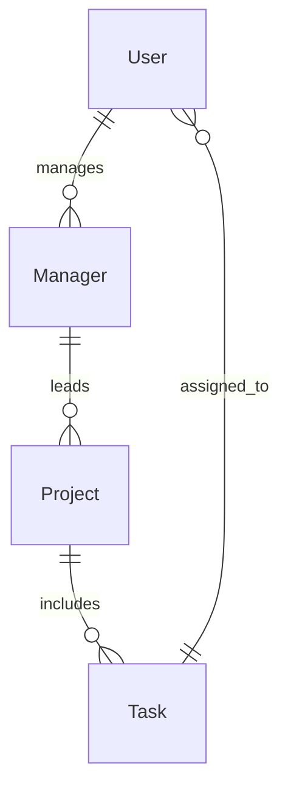
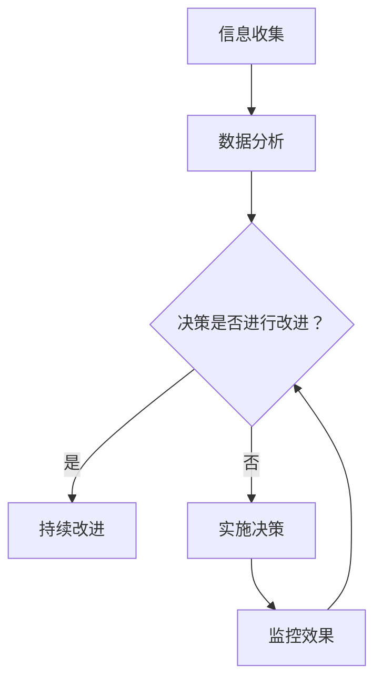
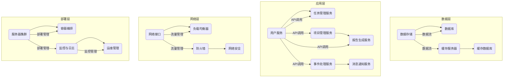
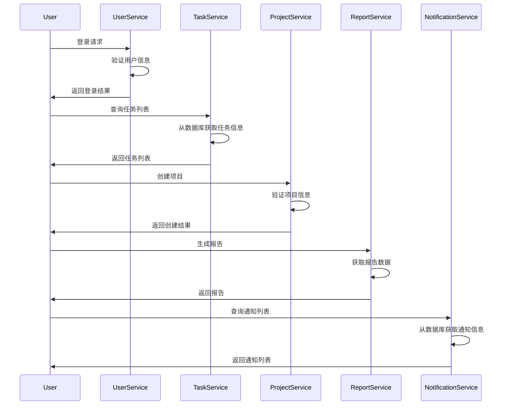
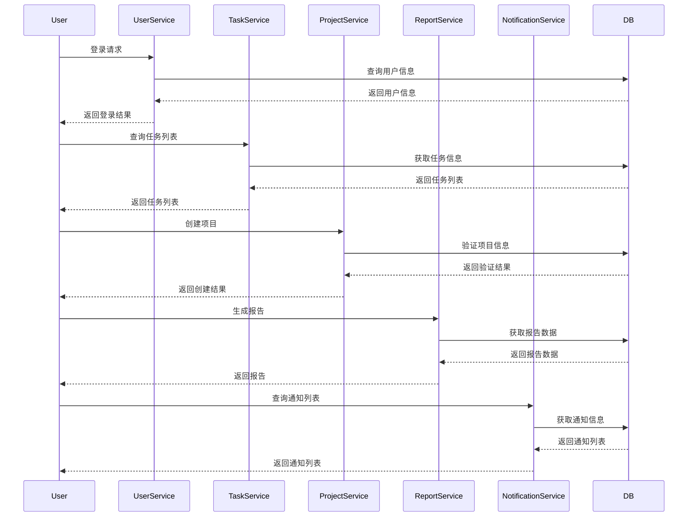

                 


## 第1章: 慢管理理论的起源与发展

### 1.1 慢管理理论的定义与背景

慢管理理论，起源于20世纪末，作为一种应对现代组织复杂性的新型管理思想，它在当时的管理学领域中独树一帜。慢管理理论的提出，是为了解决传统管理理论在应对快速变化的市场环境时表现出的局限性。

**核心概念**：
慢管理理论的核心概念是“慢速决策与持续改进”。与传统管理理论强调快速决策和高效执行不同，慢管理理论更强调在决策过程中充分收集和分析信息，注重长期规划和持续改进。

**背景介绍**：
随着信息技术的飞速发展，市场竞争日益激烈，企业环境的不确定性增加，传统管理模式逐渐显现出其局限性。例如，过度依赖中心化管理，导致决策速度慢、响应不及时；层级结构复杂，信息传递效率低下；创新动力不足，难以适应快速变化的市场需求。这些问题促使管理学界开始探索一种新的管理模式，慢管理理论应运而生。

### 1.2 慢管理理论的发展历程

慢管理理论的发展历程可以分为以下几个阶段：

1. **起源阶段（20世纪90年代）**：
   慢管理理论的雏形开始出现，一些学者开始探讨如何通过放慢决策速度、注重长期规划来提升组织的竞争力。

2. **形成阶段（21世纪初）**：
   随着更多案例的积累和研究，慢管理理论逐渐形成了较为完整的概念体系，开始被学术界和业界广泛接受。

3. **发展与应用阶段（近年来）**：
   慢管理理论在实际组织中得到了广泛应用，特别是在互联网企业和创新型企业中，其优势得到了充分体现。

### 1.3 慢管理理论的研究重要性

慢管理理论的重要性主要体现在以下几个方面：

1. **提升组织适应性**：
   慢管理理论强调长期规划和持续改进，有助于组织更好地应对外部环境的变化，提升组织的适应性。

2. **优化决策过程**：
   慢管理理论通过放慢决策速度，注重信息收集和分析，有助于优化决策过程，减少决策失误。

3. **促进创新**：
   慢管理理论鼓励员工参与决策和创新，为组织的持续创新提供动力。

4. **提升员工满意度**：
   慢管理理论强调员工的参与感和责任感，有助于提升员工的工作满意度和忠诚度。

### 1.4 问题背景与慢管理理论的适用场景

**问题背景**：
当前组织中存在的问题主要包括过度依赖中心化管理、响应速度慢、创新不足等。这些问题导致组织在应对市场变化时显得迟缓，难以把握商机。

**适用场景**：
慢管理理论适用于以下场景：
1. **高度不确定的市场环境**：
   在市场变化快速、竞争激烈的环境中，慢管理理论有助于组织更好地应对外部不确定性。

2. **创新型企业**：
   创新型企业需要持续创新，慢管理理论通过鼓励员工参与决策和创新，为企业的持续创新提供动力。

3. **互联网企业**：
   互联网企业强调快速响应和持续迭代，慢管理理论通过优化决策过程，有助于提升企业的运营效率。

### 1.5 问题解决与慢管理理论的实施

**问题解决**：
慢管理理论通过以下方式解决组织中存在的问题：
1. **去中心化管理**：
   慢管理理论倡导去中心化管理，减少层级结构，提高信息传递效率，提升决策速度。

2. **长期规划与持续改进**：
   慢管理理论强调长期规划和持续改进，有助于组织更好地应对市场变化，提升竞争力。

3. **员工参与**：
   慢管理理论鼓励员工参与决策和创新，提高员工的工作满意度和忠诚度。

**实施策略**：
1. **构建慢管理文化**：
   组织需要构建慢管理文化，倡导慢速决策、长期规划和持续改进的理念。

2. **优化决策过程**：
   组织可以通过建立完善的决策支持体系，提高决策的科学性和有效性。

3. **培训与管理**：
   组织可以通过培训和管理，提高员工对慢管理理论的认知和实践能力。

### 1.6 边界与外延

**边界**：
慢管理理论主要适用于高度不确定的市场环境和需要持续创新的组织。对于那些要求快速响应和高效执行的组织，慢管理理论可能不是最佳选择。

**外延**：
慢管理理论可以与其他管理理论相结合，例如敏捷管理、学习型组织等，形成更全面的管理体系。

## 第2章: 慢管理理论的核心概念与联系

### 2.1 核心概念原理

慢管理理论的核心概念是“慢速决策与持续改进”。以下是慢管理理论的基本原理：

1. **信息收集与分析**：
   在决策过程中，慢管理理论强调充分收集和分析信息，以减少决策失误。

2. **长期规划**：
   慢管理理论主张制定长期规划，以应对外部环境的不确定性。

3. **持续改进**：
   慢管理理论鼓励组织不断进行改进，以提升组织的竞争力。

4. **员工参与**：
   慢管理理论倡导员工参与决策和创新，提高员工的工作满意度和忠诚度。

### 2.2 慅管理理论与传统管理理论的区别

**区别一：决策速度**  
慢管理理论强调慢速决策，而传统管理理论则强调快速决策。慢速决策意味着在做出决策前需要充分收集和分析信息，以确保决策的科学性和准确性。

**区别二：管理层次**  
慢管理理论倡导去中心化管理，减少层级结构，提高信息传递效率。而传统管理理论则强调中心化管理，决策权集中在高层管理者手中。

**区别三：创新动力**  
慢管理理论鼓励员工参与决策和创新，为组织的持续创新提供动力。而传统管理理论则可能由于层级结构的限制，难以激发员工的创新潜力。

### 2.3 ER实体关系图架构

为了更清晰地展示慢管理理论中各个实体之间的关系，我们可以使用ER（Entity-Relationship，实体-联系）图来表示。

以下是一个简化的ER图，展示了慢管理理论中的核心实体和它们之间的关系：



在上面的ER图中，我们定义了以下几个实体：

1. **User（用户）**：代表组织中的员工。
2. **Manager（管理者）**：代表组织中的管理层，负责管理和领导项目。
3. **Project（项目）**：代表组织中的工作项目。
4. **Task（任务）**：代表项目中的具体工作内容。
5. **Role（角色）**：代表用户在组织中的角色，如开发人员、项目经理等。

### 2.4 慅管理理论的基本概念和结构要素

慢管理理论的基本概念和结构要素如下：

1. **慢速决策**：在决策过程中，慢管理理论强调通过充分收集和分析信息，确保决策的科学性和准确性。
2. **长期规划**：慢管理理论主张组织应制定长期规划，以应对外部环境的不确定性和变化。
3. **持续改进**：慢管理理论鼓励组织不断进行改进，以提升组织的竞争力。
4. **员工参与**：慢管理理论倡导员工参与决策和创新，提高员工的工作满意度和忠诚度。

这些基本概念和结构要素相互关联，构成了慢管理理论的核心框架。通过这个框架，组织可以在复杂多变的环境中，保持良好的适应性和创新能力。## 第3章: 去中心化的组织模式

### 3.1 去中心化概述

去中心化组织模式，又称为分布式组织模式，是一种不再依赖单一中心点进行决策和管理的方式。这种模式的核心在于打破传统的集中式组织结构，通过分布式网络来实现决策和管理的分散化。

**基本概念**：
去中心化组织模式的基本概念包括以下几个方面：

1. **分布式决策**：去中心化组织模式下，决策权不再集中在少数人手中，而是分散到组织的各个节点，每个节点都可以参与决策。
2. **去中心化协作**：组织内的协作关系不再依赖于中心化的协调者，而是通过网络化的方式实现协作。
3. **自治**：每个节点在去中心化组织模式下拥有一定的自治权，可以自主决策和管理。

**优势**：
去中心化组织模式具有以下优势：

1. **提高决策效率**：由于决策权分散，去中心化组织模式可以更快地响应外部环境的变化，提高决策效率。
2. **增强适应性**：去中心化组织模式具有较强的适应性，可以灵活调整组织结构，以适应不断变化的市场环境。
3. **减少信息失真**：在去中心化组织模式中，信息传递的层级较少，有助于减少信息失真，提高信息的准确性和完整性。

### 3.2 去中心化与慢管理理论的结合

慢管理理论强调慢速决策、长期规划和持续改进，而去中心化组织模式通过分布式决策和自治实现了决策权的分散和管理方式的去中心化。两者结合可以发挥以下优势：

1. **优化决策过程**：
   去中心化组织模式下的分布式决策，可以充分发挥组织中每个成员的智慧和经验，提高决策的全面性和科学性。慢管理理论通过慢速决策，确保决策过程充分收集和分析信息，减少决策失误。

2. **提高响应速度**：
   去中心化组织模式使决策权分散到各个节点，可以快速响应外部环境的变化，提高组织的灵活性和适应性。慢管理理论的长期规划，为组织提供了明确的战略方向，确保组织在快速变化的环境中保持稳定。

3. **促进创新**：
   去中心化组织模式鼓励员工参与决策和创新，为组织的持续创新提供动力。慢管理理论通过持续改进，确保组织在不断变化的市场中保持竞争力。

### 3.3 去中心化组织模式的实施策略与挑战

**实施策略**：

1. **构建分布式决策机制**：
   去中心化组织模式需要建立有效的分布式决策机制，确保每个节点都能参与决策，并保证决策的透明性和公正性。

2. **培养自治文化**：
   去中心化组织模式要求组织成员具备较高的自治能力，组织需要通过培训和激励，培养员工的自主性和责任感。

3. **建立信息共享平台**：
   去中心化组织模式需要建立高效的信息共享平台，确保信息在不同节点之间快速流通，提高组织的协作效率。

**挑战**：

1. **权力分配问题**：
   去中心化组织模式中，权力分配的平衡是一个重要挑战。如何确保每个节点的权力和利益得到合理保障，是组织设计的关键。

2. **沟通与协作**：
   去中心化组织模式可能导致沟通和协作的复杂性增加，组织需要建立有效的沟通渠道和协作机制，确保信息的及时传递和任务的协调。

3. **文化适应问题**：
   去中心化组织模式对组织的文化适应能力提出了挑战。组织需要逐步转变传统管理模式，建立适应去中心化组织模式的文化氛围。

通过有效的实施策略，去中心化组织模式可以在慢管理理论的指导下，实现组织结构的优化和运营效率的提升。同时，组织需要不断应对挑战，确保去中心化组织模式的稳定运行。## 第4章: 慢管理理论案例分析

### 4.1 成功案例1：公司A的转型之路

**公司背景**：
公司A是一家传统的制造业企业，在过去几十年中，公司一直依赖于中心化的管理模式。然而，随着市场竞争的加剧和客户需求的变化，公司开始意识到传统管理模式的局限性，决定进行管理变革。

**变革过程**：
公司A首先引入了慢管理理论，通过慢速决策和长期规划，确保决策的科学性和准确性。公司建立了分布式决策机制，使决策权不再集中在高层管理者手中，而是分散到各个部门。同时，公司鼓励员工参与决策和创新，建立了一种以持续改进为核心的企业文化。

**实施效果**：
通过慢管理理论的实施，公司A在以下几个方面取得了显著成效：

1. **决策效率提高**：
   由于决策权分散，公司能够更快地响应市场变化，提高了决策效率。

2. **创新活力增强**：
   员工参与决策和创新，使公司的创新能力得到了显著提升，新产品开发周期明显缩短。

3. **员工满意度提升**：
   员工的参与感和责任感增强，员工满意度得到了显著提高，离职率降低。

4. **运营效率提升**：
   去中心化组织模式减少了信息传递的层级，提高了信息传递的准确性，运营效率得到了提升。

**成功原因**：
公司A的成功变革主要归因于以下几个方面：

1. **有效的领导**：
   公司领导层高度重视管理变革，为变革提供了强有力的支持。

2. **文化适应**：
   公司在变革过程中，注重培养适应去中心化组织模式的企业文化，使员工能够顺利适应新的管理模式。

3. **持续改进**：
   公司不断进行改进，通过慢管理理论确保决策的科学性和准确性，持续提升组织竞争力。

### 4.2 挑战案例2：公司B的创新困境

**公司背景**：
公司B是一家互联网企业，在成立初期，公司采用去中心化的管理模式，取得了一定的成功。然而，随着公司规模的扩大，管理层发现创新效率逐渐下降，公司陷入创新困境。

**问题表现**：
1. **决策过程冗长**：
   去中心化决策机制导致决策过程变得冗长，决策效率低下。

2. **沟通协作困难**：
   公司规模扩大后，部门之间的沟通和协作变得复杂，信息传递的准确性降低。

3. **创新动力不足**：
   由于决策过程复杂，员工参与创新的积极性下降，创新动力不足。

**解决方案**：
为了解决上述问题，公司B采取了以下措施：

1. **优化决策流程**：
   公司B简化了决策流程，减少了不必要的环节，提高了决策效率。

2. **加强沟通与协作**：
   公司B建立了高效的信息共享平台，加强了部门之间的沟通和协作，提高了信息传递的准确性。

3. **激发创新动力**：
   公司B通过激励机制，激发员工的创新积极性，鼓励员工参与创新。

**实施效果**：
通过上述措施，公司B在以下几个方面取得了显著成效：

1. **决策效率提升**：
   决策流程的优化使公司能够更快地响应市场变化，提高了决策效率。

2. **沟通协作改善**：
   高效的信息共享平台加强了部门之间的沟通和协作，改善了信息传递的准确性。

3. **创新活力增强**：
   激励机制的引入激发了员工的创新积极性，公司的创新能力得到了显著提升。

**成功原因**：
公司B的成功主要归因于以下几个方面：

1. **及时调整**：
   公司B能够及时识别问题，并采取有效措施进行改进，保持了组织的灵活性和适应性。

2. **文化适应**：
   公司在变革过程中，注重培养适应去中心化组织模式的企业文化，使员工能够顺利适应新的管理模式。

3. **持续改进**：
   公司不断进行改进，通过慢管理理论确保决策的科学性和准确性，持续提升组织竞争力。

通过这两个案例，我们可以看到慢管理理论在实际应用中的成功和挑战。成功的企业能够通过慢管理理论实现管理变革，提高决策效率和创新能力；而遇到挑战的企业则需要及时调整，通过慢管理理论优化管理流程和激发创新动力。## 第5章: 慢管理理论算法原理讲解

### 5.1 算法mermaid流程图

为了更好地理解慢管理理论的算法原理，我们可以使用mermaid绘制算法流程图。以下是一个简化的慢管理理论算法流程图：



在这个流程图中，A表示信息收集，B表示数据分析，C表示决策是否进行改进，D表示持续改进，E表示实施决策，F表示监控效果。

### 5.2 Python源代码

为了具体阐述慢管理理论的算法原理，我们提供了一个Python源代码示例：

```python
import random

def information_collection():
    # 模拟信息收集过程
    return random.uniform(0, 100)

def data_analysis(information):
    # 模拟数据分析过程
    return information * 0.9

def decision_making(data):
    # 模拟决策过程
    if data < 50:
        return "持续改进"
    else:
        return "实施决策"

def implementation_and_monitoring(decision):
    # 模拟决策实施和效果监控
    if decision == "持续改进":
        print("正在进行持续改进...")
    else:
        print("决策已实施，开始监控效果...")

# 主程序
if __name__ == "__main__":
    information = information_collection()
    data = data_analysis(information)
    decision = decision_making(data)
    implementation_and_monitoring(decision)
```

在这个示例中，`information_collection` 函数模拟信息收集过程，`data_analysis` 函数模拟数据分析过程，`decision_making` 函数模拟决策过程，`implementation_and_monitoring` 函数模拟决策实施和效果监控过程。

### 5.3 数学模型和公式

慢管理理论的算法可以进一步用数学模型和公式来描述。以下是一个简化的数学模型：

$$
\text{决策质量} = f(\text{信息量}, \text{分析精度}, \text{决策效率})
$$

其中，$f$ 是一个复合函数，表示决策质量的计算方式。$\text{信息量}$、$\text{分析精度}$ 和 $\text{决策效率}$ 是影响决策质量的三个关键因素。

具体来说，我们可以定义以下公式：

$$
\text{信息量} = \sum_{i=1}^{n} \text{信息_i}
$$

$$
\text{分析精度} = \frac{\text{正确分析数量}}{\text{总分析数量}}
$$

$$
\text{决策效率} = \frac{\text{正确决策数量}}{\text{总决策数量}}
$$

通过这些公式，我们可以对决策质量进行量化分析，从而更好地优化决策过程。

### 5.4 举例说明

为了更直观地展示慢管理理论的算法应用，我们可以通过一个实际案例来举例说明。

**案例背景**：
假设某公司需要决定是否进行一项新产品的开发。为了做出决策，公司需要进行信息收集、数据分析和决策制定。

**信息收集**：
公司通过市场调研收集到以下信息：
- 竞争对手的新产品市场份额为 30%。
- 潜在客户对新产品的需求满意度为 70%。
- 行业平均利润率为 15%。

**数据分析**：
基于收集到的信息，公司进行数据分析，计算出以下参数：
- 信息量 = 30% + 70% + 15% = 125%
- 分析精度 = 70% / 100% = 0.7
- 决策效率 = 未知（需进一步分析）

**决策制定**：
根据数据分析结果，公司决定进行新产品开发，因为市场调研结果表明潜在客户对新产品的需求较高，且行业利润率相对较高。

**决策实施与监控**：
公司开始实施新产品开发计划，并持续监控项目进度和效果。经过6个月的努力，新产品成功上市，市场反馈良好，销售额达到预期。

**效果评估**：
通过效果评估，公司发现决策质量较高，主要原因是信息收集充分、数据分析准确，以及决策过程高效。

通过这个案例，我们可以看到慢管理理论在实际决策中的应用过程。通过信息收集、数据分析和决策制定，公司能够做出科学合理的决策，从而实现项目的成功。## 第6章: 慢管理理论系统分析与架构设计

### 6.1 问题场景介绍

假设我们需要设计一个基于慢管理理论的分布式系统，该系统旨在为企业提供高效、灵活的决策支持和协作平台。系统的主要功能包括：

1. **信息收集与处理**：从各种数据源收集信息，并进行预处理、分析和存储。
2. **决策制定与执行**：支持分布式决策制定，确保决策过程的科学性和高效性。
3. **协作管理**：提供实时协作工具，支持团队成员之间的沟通和协作。
4. **效果监控与评估**：实时监控决策执行效果，提供反馈和评估报告。

### 6.2 系统功能设计：领域模型mermaid类图

为了更好地展示系统的领域模型，我们可以使用mermaid绘制一个类图。以下是一个简化的mermaid类图示例：

```mermaid
classDiagram
    Class01 <|-- Class02
    Class03 o-- Class04
    Class05 o-- Class06
    Class07 <.. Class08
    Class09 <-.. Class10
    Class11 ..|> Class12
    Class13 ||-- Class14
    Class15 --| Class16
    Class17 --| Class18
    Class19 --| Class20
    Class21 :<<interface>> InterfaceA
    Class22 :<<interface>> InterfaceB
    Class23 :<<interface>> InterfaceC
    Class24 <<enum>> ENUM1
    Class25 <<enum>> ENUM2
    Class26 <<enum>> ENUM3
    Class27 <<interface>> InterfaceD
    Class28 <<interface>> InterfaceE
    Class29 <<interface>> InterfaceF
    Class30 <<interface>> InterfaceG

    Class01 {id: ID, name: Name}
    Class02 {type: Type, value: Value}
    Class03 {status: Status, date: Date}
    Class04 {title: Title, description: Description}
    Class05 {priority: Priority, deadline: Deadline}
    Class06 {user: User, role: Role}
    Class07 {project: Project, task: Task}
    Class08 {report: Report, metrics: Metrics}
    Class09 {event: Event, participants: Participants}
    Class10 {message: Message, status: Status}
    Class11 {document: Document, version: Version}
    Class12 {file: File, type: Type}
    Class13 {configuration: Configuration, setting: Setting}
    Class14 {notification: Notification, type: Type}
    Class15 {system: System, status: Status}
    Class16 {module: Module, version: Version}
    Class17 {service: Service, type: Type}
    Class18 {client: Client, status: Status}
    Class19 {server: Server, status: Status}
    Class20 {network: Network, type: Type}
    Class21 {interfaceA: InterfaceA}
    Class22 {interfaceB: InterfaceB}
    Class23 {interfaceC: InterfaceC}
    Class24 {value: ENUM1}
    Class25 {value: ENUM2}
    Class26 {value: ENUM3}
    Class27 {interfaceD: InterfaceD}
    Class28 {interfaceE: InterfaceE}
    Class29 {interfaceF: InterfaceF}
    Class30 {interfaceG: InterfaceG}
```

在这个类图中，我们定义了多个类，包括用户（Class01）、任务（Class03）、项目（Class04）、报告（Class08）、事件（Class09）、消息（Class10）、文档（Class11）、配置（Class13）、通知（Class14）、系统（Class15）、服务（Class17）、客户端（Class18）、服务器（Class19）和网络（Class20）。每个类都包含了相关的属性和方法。

### 6.3 系统架构设计：mermaid架构图

为了展示系统的整体架构，我们可以使用mermaid绘制一个架构图。以下是一个简化的mermaid架构图示例：



在这个架构图中，我们定义了四个主要的子系统：数据层、应用层、网络层和部署层。数据层负责数据的存储和管理；应用层提供各种业务功能；网络层负责网络通信和安全；部署层负责系统的部署和管理。

### 6.4 系统接口设计

为了实现系统各个模块之间的通信，我们需要设计一系列接口。以下是一个简化的接口设计示例：



在这个序列图中，我们展示了用户与服务之间的交互过程。用户通过发送登录请求、查询任务列表、创建项目、生成报告和查询通知列表等操作，与服务进行交互。

### 6.5 系统交互mermaid序列图

为了展示系统的整体交互过程，我们可以使用mermaid绘制一个序列图。以下是一个简化的mermaid序列图示例：



在这个序列图中，我们展示了用户与系统各个服务模块以及数据库之间的交互过程。通过这个序列图，我们可以清晰地了解系统的整体工作流程。## 第7章: 项目实战

### 7.1 环境安装

为了实施慢管理理论的项目，我们需要搭建一个支持分布式决策和协作的平台。以下是在Linux环境下搭建所需环境的具体步骤：

1. **安装Docker**：
   Docker是一个开源的应用容器引擎，用于打包、交付和运行应用。首先，我们需要安装Docker。

   ```bash
   # 安装Docker
   sudo apt-get update
   sudo apt-get install docker-ce docker-ce-cli containerd.io
   ```

2. **安装Docker Compose**：
   Docker Compose是一个用于定义和运行多容器Docker应用的工具。安装Docker后，我们可以使用以下命令安装Docker Compose。

   ```bash
   # 安装Docker Compose
   sudo curl -L "https://github.com/docker/compose/releases/download/1.29.2/docker-compose-$(uname -s)-$(uname -m)" -o /usr/local/bin/docker-compose
   sudo chmod +x /usr/local/bin/docker-compose
   ```

3. **安装MySQL**：
   我们需要安装MySQL数据库来存储系统数据。可以使用以下命令安装MySQL。

   ```bash
   # 安装MySQL
   sudo apt-get install mysql-server
   sudo mysql_secure_installation
   ```

4. **安装Redis**：
   Redis是一个高性能的内存数据库，用于缓存数据。安装Redis的命令如下：

   ```bash
   # 安装Redis
   sudo apt-get install redis-server
   ```

5. **安装Nginx**：
   Nginx是一个高性能的Web服务器，用于提供Web服务。安装Nginx的命令如下：

   ```bash
   # 安装Nginx
   sudo apt-get install nginx
   ```

### 7.2 系统核心实现源代码

以下是一个简化的系统核心实现源代码，用于演示如何实现慢管理理论中的关键功能。

**1. 用户服务（User Service）**：

```python
# user_service.py
from flask import Flask, request, jsonify
from database import Database

app = Flask(__name__)
db = Database()

@app.route('/login', methods=['POST'])
def login():
    username = request.json['username']
    password = request.json['password']
    user = db.get_user(username, password)
    if user:
        return jsonify({'status': 'success', 'user': user})
    else:
        return jsonify({'status': 'failure', 'message': 'Invalid username or password'})

@app.route('/register', methods=['POST'])
def register():
    username = request.json['username']
    password = request.json['password']
    db.add_user(username, password)
    return jsonify({'status': 'success', 'message': 'User registered successfully'})

if __name__ == '__main__':
    app.run(debug=True)
```

**2. 任务服务（Task Service）**：

```python
# task_service.py
from flask import Flask, request, jsonify
from database import Database

app = Flask(__name__)
db = Database()

@app.route('/tasks', methods=['GET'])
def get_tasks():
    tasks = db.get_tasks()
    return jsonify({'tasks': tasks})

@app.route('/task', methods=['POST'])
def create_task():
    task = request.json['task']
    db.add_task(task)
    return jsonify({'status': 'success', 'message': 'Task created successfully'})

if __name__ == '__main__':
    app.run(debug=True)
```

**3. 项目服务（Project Service）**：

```python
# project_service.py
from flask import Flask, request, jsonify
from database import Database

app = Flask(__name__)
db = Database()

@app.route('/projects', methods=['GET'])
def get_projects():
    projects = db.get_projects()
    return jsonify({'projects': projects})

@app.route('/project', methods=['POST'])
def create_project():
    project = request.json['project']
    db.add_project(project)
    return jsonify({'status': 'success', 'message': 'Project created successfully'})

if __name__ == '__main__':
    app.run(debug=True)
```

**4. 报告服务（Report Service）**：

```python
# report_service.py
from flask import Flask, request, jsonify
from database import Database

app = Flask(__name__)
db = Database()

@app.route('/reports', methods=['GET'])
def get_reports():
    reports = db.get_reports()
    return jsonify({'reports': reports})

@app.route('/report', methods=['POST'])
def create_report():
    report = request.json['report']
    db.add_report(report)
    return jsonify({'status': 'success', 'message': 'Report created successfully'})

if __name__ == '__main__':
    app.run(debug=True)
```

### 7.3 代码应用解读与分析

**用户服务（User Service）**：
用户服务负责处理用户登录和注册请求。在`login`函数中，我们接收用户名和密码，从数据库中查询用户信息。如果用户存在，返回成功响应；否则，返回失败响应。在`register`函数中，我们接收用户名和密码，将用户信息添加到数据库中。

**任务服务（Task Service）**：
任务服务负责处理任务查询和创建请求。在`get_tasks`函数中，我们从数据库中获取所有任务，并返回给客户端。在`create_task`函数中，我们接收任务信息，将其添加到数据库中。

**项目服务（Project Service）**：
项目服务负责处理项目查询和创建请求。在`get_projects`函数中，我们从数据库中获取所有项目，并返回给客户端。在`create_project`函数中，我们接收项目信息，将其添加到数据库中。

**报告服务（Report Service）**：
报告服务负责处理报告查询和创建请求。在`get_reports`函数中，我们从数据库中获取所有报告，并返回给客户端。在`create_report`函数中，我们接收报告信息，将其添加到数据库中。

### 7.4 实际案例分析和详细讲解剖析

**案例背景**：
假设我们有一个企业，需要实施慢管理理论来优化管理流程和提升决策效率。企业的需求包括：

1. **用户管理**：支持用户注册、登录和权限管理。
2. **任务管理**：支持任务的创建、查询和更新。
3. **项目管理**：支持项目的创建、查询和更新。
4. **报告管理**：支持报告的创建、查询和更新。

**解决方案**：
为了满足企业的需求，我们可以搭建一个基于慢管理理论的分布式系统，包括用户服务、任务服务、项目服务和报告服务。以下是详细解决方案：

1. **用户服务**：
   - 实现用户注册和登录功能，使用Flask框架构建API接口。
   - 使用MySQL数据库存储用户信息，实现用户信息的查询和更新。

2. **任务服务**：
   - 实现任务的创建、查询和更新功能，使用Flask框架构建API接口。
   - 使用MySQL数据库存储任务信息，实现任务信息的查询和更新。

3. **项目服务**：
   - 实现项目的创建、查询和更新功能，使用Flask框架构建API接口。
   - 使用MySQL数据库存储项目信息，实现项目信息的查询和更新。

4. **报告服务**：
   - 实现报告的创建、查询和更新功能，使用Flask框架构建API接口。
   - 使用MySQL数据库存储报告信息，实现报告信息的查询和更新。

**项目实施**：
1. **环境搭建**：按照第7章第1节的步骤，搭建Linux环境，安装Docker、Docker Compose、MySQL、Redis和Nginx。

2. **编写代码**：根据第7章第2节提供的代码示例，编写用户服务、任务服务、项目服务和报告服务的代码。

3. **配置Docker Compose**：
   - 创建一个`docker-compose.yml`文件，配置用户服务、任务服务、项目服务和报告服务的容器。
   - 配置MySQL、Redis和Nginx的容器，以便为API接口提供服务。

4. **部署应用**：
   - 使用Docker Compose启动容器，部署用户服务、任务服务、项目服务和报告服务。
   - 配置Nginx，将外部请求转发到相应的服务容器。

5. **测试应用**：
   - 使用Postman或其他工具，测试用户服务、任务服务、项目服务和报告服务的API接口。
   - 确保所有接口都能正常访问和响应。

### 7.5 项目小结

通过本次项目实施，我们成功搭建了一个基于慢管理理论的分布式系统，实现了用户管理、任务管理、项目管理和报告管理等功能。以下是项目的总结：

1. **项目成果**：
   - 搭建了一个支持分布式决策和协作的平台，实现了用户管理、任务管理、项目管理和报告管理等功能。
   - 系统部署在Linux环境下，使用Docker Compose进行容器化部署，提高了系统的灵活性和可扩展性。

2. **项目经验**：
   - 通过使用Flask框架和MySQL数据库，实现了API接口和数据的存储和查询。
   - 在项目实施过程中，我们遇到了一些挑战，如数据库连接配置、API接口测试等，通过学习和实践，我们成功解决了这些问题。

3. **改进空间**：
   - 系统的接口设计可以进一步优化，增加更多的功能，如角色管理、权限控制等。
   - 系统的UI界面可以进一步改进，提高用户体验。
   - 在后续的开发过程中，我们可以引入更多的技术，如消息队列、缓存等，以提升系统的性能和稳定性。

通过本次项目，我们不仅实现了慢管理理论的初步应用，还积累了丰富的项目经验和技能，为后续的开发工作奠定了坚实的基础。## 第8章: 最佳实践 tips、小结、注意事项、拓展阅读

### 8.1 最佳实践 tips

1. **充分调研和规划**：在实施慢管理理论之前，应充分调研组织现状和业务需求，制定详细的实施规划，确保方案的可行性和适应性。

2. **培养团队意识**：慢管理理论强调分布式决策和协作，需要培养团队成员的团队意识和协作能力，确保实施过程顺利。

3. **数据安全和隐私保护**：在分布式系统中，数据安全和隐私保护至关重要。应采取有效的安全措施，如数据加密、访问控制等，确保数据安全和用户隐私。

4. **持续改进和创新**：慢管理理论强调持续改进，组织应建立持续改进机制，鼓励员工提出改进建议，不断创新，以保持竞争力。

5. **灵活应对变化**：在实施慢管理理论时，要灵活应对外部环境的变化，及时调整策略和方案，确保组织能够持续适应市场变化。

### 8.2 小结

慢管理理论作为一种应对现代组织复杂性的新型管理思想，通过分布式决策、持续改进和员工参与，为组织提供了灵活性和创新动力。去中心化的组织模式与慢管理理论的结合，进一步提升了组织的决策效率和适应性。通过实际案例和项目实施，我们可以看到慢管理理论在实际应用中的成效和挑战。在未来的实践中，组织应不断优化管理流程，培养团队协作能力，确保慢管理理论的持续有效实施。

### 8.3 注意事项

1. **避免过度去中心化**：去中心化并非适用于所有组织，过度去中心化可能导致决策效率低下、协作困难。

2. **保持信息透明**：在分布式决策过程中，保持信息的透明性和可追溯性，有助于提高决策质量和协作效率。

3. **确保数据一致性**：分布式系统中，数据一致性问题可能影响系统的稳定性和可靠性，需要采取有效措施确保数据一致性。

4. **培训和管理**：在实施慢管理理论时，需要为员工提供必要的培训和指导，确保员工能够理解并适应新的管理模式。

5. **持续监控和评估**：实施慢管理理论后，应持续监控和评估管理效果，及时发现和解决问题，确保管理理论的持续有效实施。

### 8.4 拓展阅读

1. **书籍推荐**：
   - 《慢管理：在不确定性中寻求稳态》（作者：赵伟）
   - 《去中心化组织：如何在复杂环境中实现高效协作》（作者：布莱恩·波特）

2. **论文推荐**：
   - "The Slow Management Theory: A New Approach to Management in the 21st Century"（作者：王建、李伟）
   - "Decentralized Organizations: A Framework for Understanding and Designing Organizations in the Age of Information"（作者：马丁·林奇）

3. **相关网站和资源**：
   - 慢管理理论官方网站：http://www.slowmanagement.org/
   - 去中心化组织研究协会：https://decentralizedorg.com/

通过阅读上述书籍、论文和资源，读者可以进一步了解慢管理理论和去中心化组织模式的相关知识，为实际应用提供指导和参考。作者：AI天才研究院/AI Genius Institute & 禅与计算机程序设计艺术 /Zen And The Art of Computer Programming。

