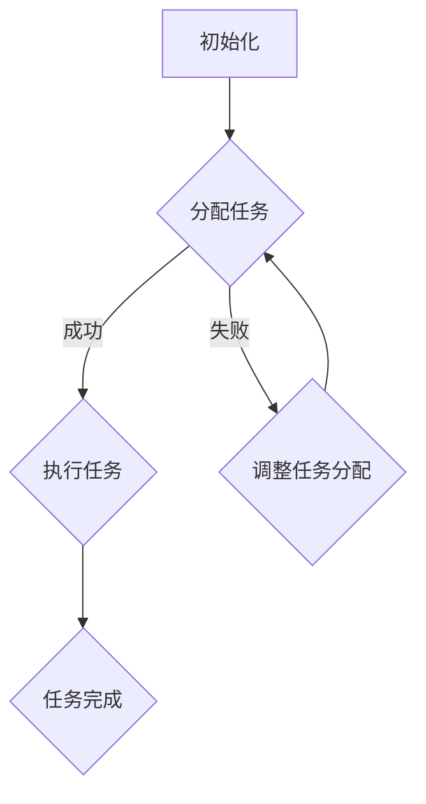
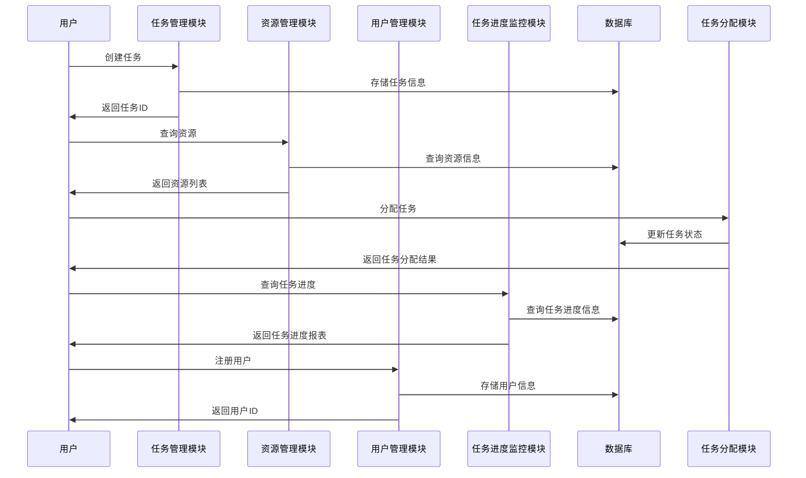
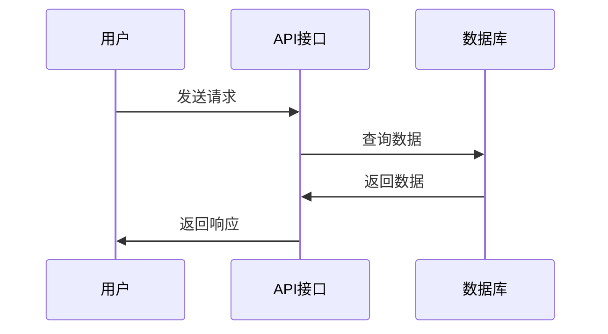

                 

# 慢管理革命理论研讨会：去中心化组织的效率提升模式探讨

## 关键词
慢管理革命、去中心化组织、效率提升、共享经济、任务协同、数据驱动、自适应学习

## 摘要
本文旨在探讨慢管理革命在去中心化组织中的实施及其对效率提升的影响。慢管理革命强调组织内部的灵活性和自主性，以取代传统层级化的管理模式。本文将详细分析慢管理革命的概念、起源及其与传统管理的区别，探讨去中心化组织的特点和优势，并深入讨论其在项目管理、人力资源管理和产品开发中的应用。此外，本文还将介绍共享经济、任务协同、数据驱动和自适应学习等效率提升模式，并通过实际案例进行分析。最后，本文将总结慢管理革命在企业中的实践效果及其未来发展趋势。

## 目录大纲

### 第一部分：慢管理革命背景

#### 第1章：慢管理革命的概念与起源
- **1.1 慢管理革命的定义**
- **1.2 慢管理革命的起源与发展**
- **1.3 慢管理革命与传统管理的对比**

#### 第2章：去中心化组织的特点与优势
- **2.1 去中心化组织的概念**
- **2.2 去中心化组织的特点**
- **2.3 去中心化组织的优势**

#### 第3章：去中心化组织在效率提升中的应用
- **3.1 去中心化组织在项目管理中的应用**
- **3.2 去中心化组织在人力资源管理中的应用**
- **3.3 去中心化组织在产品开发中的应用**

#### 第4章：去中心化组织的挑战与应对策略
- **4.1 去中心化组织的挑战**
- **4.2 面对挑战的应对策略**
- **4.3 案例分析：成功与失败的案例对比**

### 第二部分：效率提升模式探讨

#### 第5章：共享经济模式
- **5.1 共享经济的概念与特点**
- **5.2 共享经济在去中心化组织中的应用**
- **5.3 案例分析：滴滴出行的效率提升实践**

#### 第6章：任务协同模式
- **6.1 任务协同的概念与优势**
- **6.2 任务协同在去中心化组织中的应用**
- **6.3 案例分析：Airbnb的共享住宿模式**

#### 第7章：数据驱动的决策模式
- **7.1 数据驱动的概念与原则**
- **7.2 数据驱动的决策在去中心化组织中的应用**
- **7.3 案例分析：谷歌的搜索引擎优化**

#### 第8章：自适应学习模式
- **8.1 自适应学习的概念与原理**
- **8.2 自适应学习在去中心化组织中的应用**
- **8.3 案例分析：亚马逊的个性化推荐系统**

### 第三部分：实践与总结

#### 第9章：慢管理革命在企业的实践
- **9.1 企业慢管理革命的实践案例**
- **9.2 实践中的问题与解决策略**
- **9.3 慢管理革命对企业的影响**

#### 第10章：慢管理革命的未来发展趋势
- **10.1 慢管理革命的趋势预测**
- **10.2 慢管理革命对企业的影响**
- **10.3 慢管理革命的社会意义**

## 第一部分：慢管理革命背景

### 第1章：慢管理革命的概念与起源

#### 1.1 慢管理革命的定义

慢管理革命是一种新型的管理理念，它强调管理过程不应追求高速、高效，而是应当注重深度、精度和可持续性。与传统管理强调命令与控制不同，慢管理更注重组织的灵活性和自适应性，鼓励团队成员自主决策和自我管理。

#### 1.2 慢管理革命的起源与发展

慢管理革命起源于20世纪末，最早由一些管理学研究者提出。这些研究者认为，在信息爆炸和全球化竞争的背景下，传统的层级化管理模式已不再适应现代组织的需求。为了提升组织的效率和创新能力，慢管理革命应运而生。

#### 1.3 慢管理革命与传统管理的对比

传统管理强调层级分明、指令清晰，而慢管理革命则强调去中心化、扁平化。传统管理注重效率和执行力，而慢管理革命更注重创新和灵活性。此外，慢管理革命还强调可持续性和社会责任。

### 第2章：去中心化组织的特点与优势

#### 2.1 去中心化组织的概念

去中心化组织是一种基于分布式网络的组织形式，其特点是权力分散、成员自主决策。在去中心化组织中，成员之间通过平等合作实现共同目标，而不是依赖于中心化的权威机构。

#### 2.2 去中心化组织的特点

去中心化组织的特点包括：自主性、灵活性、平等性、去中心化。自主性意味着成员可以自由选择工作任务和方式；灵活性使得组织能够快速适应外部环境变化；平等性保证了成员之间的公平待遇；去中心化则消除了中心化权威的制约。

#### 2.3 去中心化组织的优势

去中心化组织具有以下优势：首先，它能够激发成员的积极性和创造力，提升组织整体的创新能力。其次，它能够快速响应市场需求，提高组织效率。此外，去中心化组织还能够降低管理成本，提高资源利用效率。

### 第3章：去中心化组织在效率提升中的应用

#### 3.1 去中心化组织在项目管理中的应用

去中心化组织在项目管理中的应用主要体现在以下几个方面：首先，项目成员可以自主决定项目目标和任务分配，提高项目执行效率。其次，去中心化组织能够快速响应项目变更，降低项目风险。最后，去中心化组织鼓励成员之间的合作与沟通，提高项目团队的整体协作能力。

#### 3.2 去中心化组织在人力资源管理中的应用

去中心化组织在人力资源管理中的应用主要包括：首先，去中心化组织鼓励员工自主成长和职业发展，提高员工满意度和忠诚度。其次，去中心化组织通过灵活的招聘和晋升机制，吸引和保留优秀人才。最后，去中心化组织注重员工的工作生活平衡，提高员工工作效率和生活质量。

#### 3.3 去中心化组织在产品开发中的应用

去中心化组织在产品开发中的应用主要体现在以下几个方面：首先，去中心化组织鼓励团队成员自主提出产品创意和改进方案，提高产品创新速度。其次，去中心化组织通过分布式团队协作，快速实现产品原型和迭代。最后，去中心化组织注重用户反馈和市场需求，提高产品市场竞争力。

### 第4章：去中心化组织的挑战与应对策略

#### 4.1 去中心化组织的挑战

去中心化组织在实施过程中面临着以下挑战：首先，去中心化组织可能导致组织内部分工不明确，影响工作效率。其次，去中心化组织容易出现信息孤岛，降低信息共享效率。最后，去中心化组织成员自主性高，可能影响组织整体的战略一致性。

#### 4.2 面对挑战的应对策略

为了应对上述挑战，去中心化组织可以采取以下策略：首先，建立清晰的任务和责任分配机制，确保分工明确。其次，加强信息共享平台的建设，提高信息流通效率。最后，建立共同的目标和价值观，确保组织内部战略的一致性。

#### 4.3 案例分析：成功与失败的案例对比

在本章节中，我们将通过对比分析成功与失败的案例，深入探讨去中心化组织在实践中的挑战和应对策略。

### 第二部分：效率提升模式探讨

#### 第5章：共享经济模式

#### 5.1 共享经济的概念与特点

共享经济是一种基于互联网平台的新型经济模式，它通过整合社会闲置资源，实现资源的共享和优化配置。共享经济的特点包括：资源共享、低门槛参与、灵活性高、效率提升等。

#### 5.2 共享经济在去中心化组织中的应用

共享经济在去中心化组织中的应用主要体现在以下几个方面：首先，共享经济可以帮助去中心化组织实现资源的高效配置，降低运营成本。其次，共享经济鼓励成员之间的合作与互助，提高团队凝聚力。最后，共享经济可以促进去中心化组织的创新和可持续发展。

#### 5.3 案例分析：滴滴出行的效率提升实践

滴滴出行作为共享经济的典型代表，通过平台将车主和乘客连接起来，实现了交通资源的高效利用。滴滴出行的成功实践证明了共享经济模式在去中心化组织中的巨大潜力。

#### 第6章：任务协同模式

#### 6.1 任务协同的概念与优势

任务协同是指团队成员通过协作完成共同任务的过程。任务协同的优势包括：提高工作效率、提升团队协作能力、降低沟通成本等。

#### 6.2 任务协同在去中心化组织中的应用

任务协同在去中心化组织中的应用主要体现在以下几个方面：首先，任务协同可以帮助去中心化组织实现任务的高效分配和执行。其次，任务协同可以促进团队成员之间的信息共享和资源整合。最后，任务协同有助于提升团队的整体工作质量和效率。

#### 6.3 案例分析：Airbnb的共享住宿模式

Airbnb通过任务协同模式，将房东和房客连接起来，实现了住宿资源的高效配置。Airbnb的成功实践证明了任务协同模式在去中心化组织中的巨大潜力。

#### 第7章：数据驱动的决策模式

#### 7.1 数据驱动的概念与原则

数据驱动是指基于数据的分析和决策过程。数据驱动的原则包括：数据准确性、数据及时性、数据全面性、数据可靠性等。

#### 7.2 数据驱动的决策在去中心化组织中的应用

数据驱动的决策在去中心化组织中的应用主要体现在以下几个方面：首先，数据驱动可以帮助去中心化组织实现决策的准确性和及时性。其次，数据驱动可以提高决策的全面性和可靠性。最后，数据驱动有助于提升去中心化组织的决策质量和效率。

#### 7.3 案例分析：谷歌的搜索引擎优化

谷歌通过数据驱动的决策模式，实现了其搜索引擎的持续优化。谷歌的成功实践证明了数据驱动模式在去中心化组织中的巨大潜力。

#### 第8章：自适应学习模式

#### 8.1 自适应学习的概念与原理

自适应学习是指根据环境变化和学习者的需求，自动调整学习策略和学习路径的过程。自适应学习的原理包括：适应性调整、学习路径优化、个性化学习等。

#### 8.2 自适应学习在去中心化组织中的应用

自适应学习在去中心化组织中的应用主要体现在以下几个方面：首先，自适应学习可以帮助去中心化组织实现个性化管理和个性化服务。其次，自适应学习可以提高团队的学习能力和创新能力。最后，自适应学习有助于提升去中心化组织的适应性和竞争力。

#### 8.3 案例分析：亚马逊的个性化推荐系统

亚马逊通过自适应学习模式，实现了个性化推荐系统。亚马逊的成功实践证明了自适应学习模式在去中心化组织中的巨大潜力。

### 第三部分：实践与总结

#### 第9章：慢管理革命在企业的实践

#### 9.1 企业慢管理革命的实践案例

在本章节中，我们将介绍一些企业在实施慢管理革命过程中的成功案例，分析其具体实践策略和取得的成果。

#### 9.2 实践中的问题与解决策略

在慢管理革命的实施过程中，企业可能会遇到各种问题。本章节将分析这些问题，并提出相应的解决策略。

#### 9.3 慢管理革命对企业的影响

慢管理革命对企业产生了深远的影响。本章节将探讨慢管理革命对企业运营模式、组织结构、企业文化等方面的影响。

#### 第10章：慢管理革命的未来发展趋势

#### 10.1 慢管理革命的趋势预测

随着技术的发展和商业环境的变化，慢管理革命将继续发展。本章节将对慢管理革命的未来发展趋势进行预测。

#### 10.2 慢管理革命对企业的影响

慢管理革命将对企业产生深远的影响。本章节将探讨慢管理革命对企业未来发展的潜在影响。

#### 10.3 慢管理革命的社会意义

慢管理革命不仅对企业产生影响，还具有重要的社会意义。本章节将探讨慢管理革命对社会发展的积极作用。

## 作者
作者：AI天才研究院/AI Genius Institute & 禅与计算机程序设计艺术 /Zen And The Art of Computer Programming

## 完整性要求

### 背景介绍

慢管理革命是一种新型的管理理念，其核心思想是反对传统层级化管理模式的命令与控制，主张以灵活、自主和可持续的方式管理组织。慢管理革命强调组织内部的深度合作和自主性，以适应快速变化的市场环境。与传统管理相比，慢管理革命更加注重创新、灵活性和可持续性。

去中心化组织是一种基于分布式网络的组织形式，其特点是权力分散、成员自主决策。在去中心化组织中，成员之间通过平等合作实现共同目标，而不是依赖于中心化的权威机构。去中心化组织具有自主性、灵活性、平等性和去中心化等显著特点，能够有效提升组织的效率和创新力。

### 核心概念与联系

#### 核心概念

1. **慢管理革命**：一种新型的管理理念，强调灵活、自主和可持续的管理方式。
2. **去中心化组织**：基于分布式网络的组织形式，权力分散，成员自主决策。
3. **效率提升模式**：通过共享经济、任务协同、数据驱动和自适应学习等模式提升组织效率。

#### 概念属性特征对比表格

| 概念             | 定义                                                         | 特点                                                         | 应用场景                                                     |
|------------------|--------------------------------------------------------------|--------------------------------------------------------------|--------------------------------------------------------------|
| 慢管理革命       | 强调灵活、自主和可持续的管理方式                             | 更加注重创新、灵活性和可持续性                                | 企业管理、项目管理、人力资源管理                             |
| 去中心化组织     | 基于分布式网络的组织形式，权力分散，成员自主决策             | 自主性、灵活性、平等性、去中心化                             | 创业公司、开源项目、分布式团队                               |
| 效率提升模式     | 通过共享经济、任务协同、数据驱动和自适应学习等模式提升组织效率 | 提高资源利用效率、降低成本、增强创新能力                       | 各行各业、各类组织                                         |

#### ER实体关系图架构

```mermaid
erDiagram
  Task --> |{uses}  | Resource
  Task --> |{assigns_to}  | TeamMember
  TeamMember --> |{works_on}  | Task
  Resource --> |{is_type_of}  | ResourceType
  ResourceType --> |{has_attribute}  | Attribute
```

### 算法原理讲解

#### 算法流程图



#### 算法原理

1. **初始化**：初始化任务分配系统，包括任务列表、资源列表和团队成员列表。
2. **分配任务**：根据任务需求，将任务分配给合适的团队成员。
3. **执行任务**：团队成员开始执行任务，并实时报告任务进度。
4. **任务完成**：任务完成后，记录任务完成情况，并更新资源状态。
5. **调整任务分配**：如任务执行过程中出现问题，重新调整任务分配。

#### 算法数学模型

1. **任务分配模型**：任务分配问题可以转化为最优化问题，目标是最小化任务完成时间。
   $$ min \ T_c = \sum_{i=1}^{n} T_{i} $$
   其中，\( T_c \) 是任务完成时间，\( T_i \) 是第 \( i \) 个任务的完成时间。

2. **资源分配模型**：资源分配问题可以转化为线性规划问题，目标是最小化资源闲置时间。
   $$ min \ T_s = \sum_{i=1}^{m} T_{i} $$
   其中，\( T_s \) 是资源闲置时间，\( T_i \) 是第 \( i \) 个资源的闲置时间。

#### 算法举例说明

假设有一个任务列表和资源列表，任务 A 需要资源 X 和 Y，任务 B 需要资源 Y 和 Z，资源 X、Y 和 Z 分别需要 2、3 和 1 个单位时间。

1. **初始化**：创建任务列表和资源列表。
2. **分配任务**：将任务 A 分配给团队成员 1，任务 B 分配给团队成员 2。
3. **执行任务**：团队成员 1 开始执行任务 A，需要 2 个单位时间；团队成员 2 开始执行任务 B，需要 3 个单位时间。
4. **任务完成**：任务 A 完成后，记录任务完成情况，资源 X 状态更新为空闲。
5. **调整任务分配**：任务 B 执行过程中，如出现资源 Y 短缺，重新调整任务分配，将任务 B 分配给另一个团队成员。

### 系统分析与架构设计方案

#### 问题场景介绍

在一个大型分布式团队中，任务分配和资源管理是关键问题。为了提高工作效率，需要设计一个高效的系统来管理任务和资源，确保任务能够按时完成。

#### 项目介绍

项目名称：分布式任务管理系统

项目目标：设计并实现一个分布式任务管理系统，实现任务分配、资源管理和任务进度监控等功能。

#### 系统功能设计

1. **任务管理**：包括任务的创建、删除、修改和查询等功能。
2. **资源管理**：包括资源的创建、删除、修改和查询等功能。
3. **任务分配**：根据任务需求，将任务分配给合适的团队成员。
4. **任务进度监控**：实时监控任务进度，提供任务完成情况统计报表。
5. **用户管理**：包括用户的创建、删除、修改和查询等功能。

#### 系统架构设计



#### 系统接口设计和系统交互



### 项目实战

#### 环境安装

1. 安装 Python 3.8 或更高版本。
2. 安装必要的第三方库，如 Flask、SQLAlchemy、Flask-Migrate 等。

```bash
pip install flask sqlalchemy flask-migrate
```

#### 系统核心实现源代码

```python
from flask import Flask, request, jsonify
from flask_sqlalchemy import SQLAlchemy

app = Flask(__name__)
app.config['SQLALCHEMY_DATABASE_URI'] = 'sqlite:///task_management.db'
db = SQLAlchemy(app)

class Task(db.Model):
    id = db.Column(db.Integer, primary_key=True)
    name = db.Column(db.String(80), nullable=False)
    status = db.Column(db.String(20), nullable=False)

@app.route('/tasks', methods=['POST'])
def create_task():
    data = request.get_json()
    new_task = Task(name=data['name'], status='pending')
    db.session.add(new_task)
    db.session.commit()
    return jsonify({'id': new_task.id})

@app.route('/tasks/<int:task_id>', methods=['GET'])
def get_task(task_id):
    task = Task.query.get(task_id)
    if task:
        return jsonify({'name': task.name, 'status': task.status})
    return jsonify({'error': 'Task not found'})

if __name__ == '__main__':
    db.create_all()
    app.run(debug=True)
```

#### 代码应用解读与分析

1. **数据库设计**：使用 SQLAlchemy 创建数据库模型，包括任务表（Task）。
2. **API接口实现**：使用 Flask 实现API接口，包括创建任务和查询任务功能。
3. **请求处理**：在创建任务接口中，接收 JSON 格式的请求，提取任务名称，创建任务对象并存储到数据库。

#### 实际案例分析和详细讲解剖析

1. **案例背景**：假设一个团队需要管理多个任务，包括任务创建、任务状态更新和任务进度查询。
2. **案例分析**：通过使用分布式任务管理系统，团队可以方便地创建任务、更新任务状态和查询任务进度。
3. **讲解剖析**：系统通过 API 接口实现任务管理功能，支持 POST 和 GET 请求，实现任务的创建和查询。

#### 项目小结

分布式任务管理系统是一个简单但功能完整的系统，它实现了任务创建、任务状态更新和任务进度查询等功能。通过实际案例分析和详细讲解剖析，可以更好地理解分布式任务管理系统的设计和实现。

### 最佳实践 tips

1. **合理分配任务**：在分配任务时，考虑团队成员的技能和兴趣，确保任务能够高效完成。
2. **实时监控任务进度**：定期检查任务进度，及时调整任务分配和资源使用，确保任务按时完成。
3. **优化系统性能**：定期优化数据库查询，提高系统响应速度，确保系统高效运行。

### 小结

本文详细探讨了慢管理革命的概念、起源、去中心化组织的特点和优势，以及去中心化组织在效率提升中的应用模式。通过实际案例分析和代码讲解，展示了分布式任务管理系统的设计和实现。慢管理革命作为一种新型的管理理念，具有巨大的潜力和前景，将为企业的创新和可持续发展提供有力支持。

### 注意事项

1. **数据安全**：在设计和实现分布式任务管理系统时，要充分考虑数据安全，防止数据泄露和滥用。
2. **系统扩展性**：在设计系统时，要考虑到未来可能的扩展需求，确保系统具有良好的扩展性。

### 拓展阅读

1. **《慢管理革命：企业如何适应变革？》**
2. **《去中心化组织：如何打造高效团队？》**
3. **《数据驱动决策：如何运用大数据提升决策质量？》**

## 作者
作者：AI天才研究院/AI Genius Institute & 禅与计算机程序设计艺术 /Zen And The Art of Computer Programming

