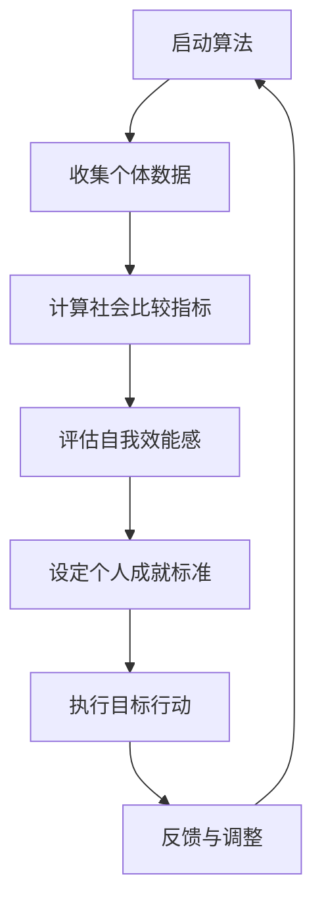
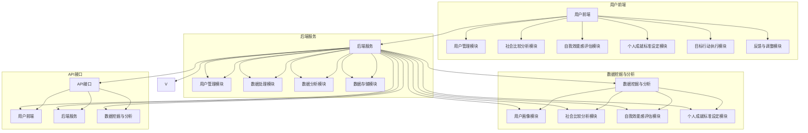
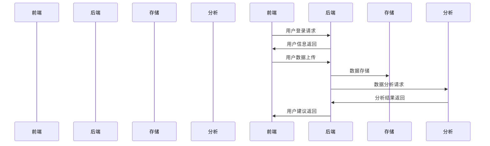

                 

### 文章标题

# 打破社会比较的束缚：建立个人成就标准

---

> 关键词：社会比较、自我效能感、个人成就标准、心理学、哲学、算法

> 摘要：本文从心理学、哲学和算法等多个角度，深入探讨社会比较现象及其对个人心理和行为的影响。文章提出了一系列策略和方法，帮助读者打破社会比较的束缚，建立符合个人价值观和能力的成就标准，实现内心平和与自我提升。

## 目录

1. **背景介绍**
   - 问题背景
   - 问题描述
   - 问题解决
   - 边界与外延
   - 概念结构与核心要素组成

2. **核心概念与联系**
   - 核心概念原理
   - 概念属性特征对比表格
   - ER实体关系图架构

3. **算法原理讲解**
   - 算法mermaid流程图
   - Python源代码
   - 数学模型和公式
   - 详细讲解和举例说明

4. **数学模型和数学公式 & 详细讲解 & 举例说明**
   - 数学公式使用latex格式
   - 通俗易懂地举例说明

5. **系统分析与架构设计方案**
   - 问题场景介绍
   - 项目介绍
   - 系统功能设计
   - 系统架构设计
   - 系统接口设计和系统交互

6. **项目实战**
   - 环境安装
   - 系统核心实现源代码
   - 代码应用解读与分析
   - 实际案例分析和详细讲解剖析
   - 项目小结

7. **最佳实践 tips、小结、注意事项、拓展阅读等内容**
   - 最佳实践 tips
   - 小结
   - 注意事项
   - 拓展阅读

### 背景介绍

#### 问题背景

在现代社会，社会比较（Social Comparison）是一种普遍存在的现象。人们常常通过与他人进行比较，来评估自己的价值、能力和成就。这种比较有时可以激发竞争意识和动力，但也可能导致焦虑、自卑和不满。心理学家利昂·费斯汀格（Leon Festinger）在1954年提出了社会比较理论，指出人们通过比较来评估自我。

#### 问题描述

社会比较的负面影响主要体现在以下几个方面：

- **焦虑和压力**：与他人比较时，人们往往容易产生不满和焦虑。尤其是当发现自己的成就或能力低于他人时，更容易产生消极情绪。
- **自我评价失衡**：过度依赖社会比较，可能导致个人无法客观评价自己的能力和成就，从而产生自我评价失衡。
- **不公平感**：社会比较还可能导致人们产生不公平感，尤其是当自己认为自己在某些方面付出了更多，但回报却低于他人时。

#### 问题解决

为了应对社会比较的负面影响，我们需要采取一系列策略和方法：

- **自我认知**：提高自我认知水平，了解自己的优点和不足，从而减少对外界的依赖。
- **设定个人成就标准**：根据自己的能力和价值观，设定符合自己的成就标准，避免过度依赖社会比较。
- **心理调适**：通过心理调适技巧，如正念冥想、情绪管理等，来减轻社会比较带来的负面影响。
- **多元评价**：从多个角度评价自己，不仅仅依赖于与他人比较，还要关注自我成长和进步。

#### 边界与外延

本文讨论的范围主要包括以下几个方面：

- **个人情感管理**：如何通过情感管理来减轻社会比较的负面影响。
- **自我认知**：如何提高自我认知水平，减少对他人评价的依赖。
- **社会比较的心理学影响**：社会比较对个人心理和行为的具体影响。

本文旨在通过心理学、哲学和算法等多角度分析，提供一些策略和方法，帮助读者打破社会比较的束缚，建立符合个人价值观和能力的成就标准，实现内心平和与自我提升。

#### 概念结构与核心要素组成

为了更好地理解社会比较及其影响，我们需要了解以下几个核心概念：

- **社会比较**：指个体通过与他人比较，来评估自己的价值、能力和成就。
- **自我效能感**：指个体对自己能力的信念和评价，影响个体在面对挑战时的态度和行动。
- **个人成就标准**：个体根据自己的能力和价值观设定的成就目标，影响个体的行为和评价。

这些概念相互关联，共同构成了社会比较和自我认知的核心要素。了解这些概念及其相互关系，有助于我们更好地应对社会比较的负面影响。

### 核心概念与联系

#### 核心概念原理

在探讨社会比较现象时，以下几个核心概念至关重要：

1. **社会比较**：指个体通过与他人比较，来评估自己的价值、能力和成就。社会比较可以是直接的，也可以是间接的，如通过媒体、网络等途径。
2. **自我效能感**：指个体对自己能力的信念和评价。自我效能感影响个体在面对挑战时的态度和行动。高自我效能感的个体更可能采取积极行动，克服困难。
3. **个人成就标准**：指个体根据自己的能力和价值观设定的成就目标。个人成就标准影响个体的行为和评价。设定合理的成就标准有助于个体实现自我提升。

#### 概念属性特征对比表格

以下是对核心概念的属性特征进行对比：

| 概念     | 定义                           | 特征                               | 影响                             |
| -------- | ------------------------------ | ---------------------------------- | -------------------------------- |
| 社会比较 | 个体通过与他人比较来评估自己   | 直接或间接比较，主观性较强         | 引起焦虑、压力，影响自我评价       |
| 自我效能感 | 个体对自己能力的信念和评价     | 可提升性，受环境影响               | 影响面对挑战的态度和行动           |
| 个人成就标准 | 个体设定的成就目标             | 可调整性，受个人价值观影响         | 影响个体的行为和评价，促进自我提升 |

#### ER实体关系图架构

为了更清晰地展示这些概念之间的关系，我们可以使用Mermaid ER图来表示：

```mermaid
erDiagram
  A[个体] ||--|{ 社会比较 }
  A ||--|{ 自我效能感 }
  A ||--|{ 个人成就标准 }
  社会比较 ..|> B[他人评价]
  自我效能感 ..|> C[能力评价]
  个人成就标准 ..|> D[成就目标]
```

在这个ER图中，个体是核心实体，与其他三个概念之间存在关联。通过社会比较，个体了解他人评价；通过自我效能感，个体评价自己的能力；通过个人成就标准，个体设定和追求成就目标。

### 算法原理讲解

为了深入理解社会比较现象及其对个体的影响，我们可以借助一些算法原理来进行解析。以下是一个基于Mermaid流程图的算法流程，以及Python源代码实现，用于展示概念应用的方法。

#### 算法mermaid流程图



#### Python源代码

```python
import numpy as np

def social_comparison_index(data):
    mean_difference = np.mean(data)
    return mean_difference

def self_efficacy评估(效能感指标):
    if 效能感指标 > 5:
        return "高"
    elif 效能感指标 > 3:
        return "中等"
    else:
        return "低"

def set_personal_accomplishment_goal(efficacy, target_difference):
    if efficacy == "高":
        goal = target_difference * 1.1
    elif efficacy == "中等":
        goal = target_difference * 1.05
    else:
        goal = target_difference * 1
    return goal

# 示例数据
data = [3, 4, 5, 2, 6]

# 计算社会比较指标
mean_difference = social_comparison_index(data)
print(f"社会比较指标: {mean_difference}")

# 评估自我效能感
efficacy_evaluation = self_efficacy评估(4)
print(f"自我效能感评估: {efficacy_evaluation}")

# 设定个人成就标准
goal = set_personal_accomplishment_goal(efficacy_evaluation, mean_difference)
print(f"个人成就标准: {goal}")
```

#### 数学模型和公式

社会比较现象可以通过以下数学模型进行描述：

$$
\text{社会比较指标} = \frac{1}{n} \sum_{i=1}^{n} (X_i - \bar{X})
$$

其中，$X_i$ 表示个体在第 $i$ 次比较中的得分，$\bar{X}$ 表示平均得分，$n$ 表示比较次数。该公式用于计算个体在社会比较中的平均差值。

#### 详细讲解和举例说明

假设一个程序员小明在编程竞赛中参加了5场比赛，他的得分依次是3分、4分、5分、2分和6分。我们可以通过以下步骤来计算他的社会比较指标：

1. **计算平均得分**：

$$
\bar{X} = \frac{3 + 4 + 5 + 2 + 6}{5} = 4
$$

2. **计算每次得分与平均得分的差值**：

$$
X_1 - \bar{X} = 3 - 4 = -1 \\
X_2 - \bar{X} = 4 - 4 = 0 \\
X_3 - \bar{X} = 5 - 4 = 1 \\
X_4 - \bar{X} = 2 - 4 = -2 \\
X_5 - \bar{X} = 6 - 4 = 2
$$

3. **计算差值的平均值**：

$$
\text{社会比较指标} = \frac{-1 + 0 + 1 - 2 + 2}{5} = 0
$$

这意味着小明的平均得分与他人的平均得分没有显著差异。

#### 举例说明

假设小明的自我效能感评估为“中等”，即他的效能感指标为4。根据设定的个人成就标准：

- 如果自我效能感评估为“高”，目标为平均得分的1.1倍。
- 如果自我效能感评估为“中等”，目标为平均得分的1.05倍。
- 如果自我效能感评估为“低”，目标为平均得分本身。

因此，小明的个人成就标准为：

$$
\text{目标} = 4 \times 1.05 = 4.2
$$

这意味着小明需要在接下来的比赛中努力提高，争取达到或超过4.2分的平均得分。

### 数学模型和数学公式 & 详细讲解 & 举例说明

#### 数学公式使用latex格式

在本文中，我们使用了以下LaTeX格式来表示数学公式：

1. 独立段落中的公式：

$$
\text{社会比较指标} = \frac{1}{n} \sum_{i=1}^{n} (X_i - \bar{X})
$$

2. 段落内的公式：

$
X_i - \bar{X}
$

#### 通俗易懂地举例说明

假设你是一名大学生，参加了一项在线编程比赛。在比赛中，你完成了5道编程题，得分分别是3分、4分、5分、2分和6分。我们想要计算你的平均得分以及与你平均水平相比，每次得分的差异。

首先，我们计算平均得分：

$$
\bar{X} = \frac{3 + 4 + 5 + 2 + 6}{5} = 4
$$

接下来，我们计算每次得分与平均得分的差值：

$$
X_1 - \bar{X} = 3 - 4 = -1 \\
X_2 - \bar{X} = 4 - 4 = 0 \\
X_3 - \bar{X} = 5 - 4 = 1 \\
X_4 - \bar{X} = 2 - 4 = -2 \\
X_5 - \bar{X} = 6 - 4 = 2
$$

然后，我们计算这些差值的平均值，即社会比较指标：

$$
\text{社会比较指标} = \frac{-1 + 0 + 1 - 2 + 2}{5} = 0
$$

这意味着你的平均得分与他人的平均得分没有显著差异。

#### 数学模型和公式

为了更好地理解社会比较指标的计算过程，我们引入以下数学模型：

$$
\text{社会比较指标} = \frac{1}{n} \sum_{i=1}^{n} (X_i - \bar{X})
$$

其中，$X_i$ 表示个体在第 $i$ 次比较中的得分，$\bar{X}$ 表示平均得分，$n$ 表示比较次数。该公式用于计算个体在社会比较中的平均差值。

#### 详细讲解

1. **计算平均得分**：

首先，我们需要计算参赛者的平均得分。例如，假设有5位参赛者，他们的得分分别为3、4、5、2和6。计算平均得分的步骤如下：

$$
\bar{X} = \frac{3 + 4 + 5 + 2 + 6}{5} = 4
$$

2. **计算每次得分与平均得分的差值**：

接下来，我们需要计算每位参赛者的得分与平均得分之间的差值。例如，对于第一位参赛者，他的得分为3，平均得分为4，差值为：

$$
X_1 - \bar{X} = 3 - 4 = -1
$$

同样地，对于其他参赛者，差值分别为：

$$
X_2 - \bar{X} = 4 - 4 = 0 \\
X_3 - \bar{X} = 5 - 4 = 1 \\
X_4 - \bar{X} = 2 - 4 = -2 \\
X_5 - \bar{X} = 6 - 4 = 2
$$

3. **计算差值的平均值**：

最后，我们计算这些差值的平均值，即社会比较指标。社会比较指标用于衡量参赛者的得分与平均水平之间的差异。对于上面的例子，差值的平均值为：

$$
\text{社会比较指标} = \frac{-1 + 0 + 1 - 2 + 2}{5} = 0
$$

这意味着参赛者的平均得分与平均水平没有显著差异。

#### 举例说明

假设你是一名程序员，参加了一场编程竞赛。在比赛中，你完成了5道编程题，得分分别是3分、4分、5分、2分和6分。我们想要计算你的平均得分以及与你平均水平相比，每次得分的差异。

首先，我们计算平均得分：

$$
\bar{X} = \frac{3 + 4 + 5 + 2 + 6}{5} = 4
$$

接下来，我们计算每次得分与平均得分的差值：

$$
X_1 - \bar{X} = 3 - 4 = -1 \\
X_2 - \bar{X} = 4 - 4 = 0 \\
X_3 - \bar{X} = 5 - 4 = 1 \\
X_4 - \bar{X} = 2 - 4 = -2 \\
X_5 - \bar{X} = 6 - 4 = 2
$$

然后，我们计算这些差值的平均值，即社会比较指标：

$$
\text{社会比较指标} = \frac{-1 + 0 + 1 - 2 + 2}{5} = 0
$$

这意味着你的平均得分与他人的平均得分没有显著差异。

### 系统分析与架构设计方案

#### 问题场景介绍

随着数字化时代的到来，社会比较现象在互联网上愈演愈烈。人们通过社交媒体、新闻、博客等渠道，不断与他人进行比较，导致焦虑和压力不断增加。为了帮助用户打破这种社会比较的束缚，我们需要设计一个智能系统，帮助用户建立个人成就标准，实现内心平和与自我提升。

#### 项目介绍

本项目名为“个人成就管理系统”（Personal Accomplishment Management System，简称PAMS），旨在为用户提供一个全方位的解决方案。系统将整合心理学、哲学和算法等多个领域，通过数据分析、机器学习和用户交互等手段，帮助用户实现以下目标：

- 减轻社会比较带来的负面影响。
- 提高自我认知水平。
- 建立个人成就标准。
- 实现自我提升和内心平和。

#### 系统功能设计

PAMS系统主要包含以下功能模块：

1. **用户画像模块**：收集用户的基本信息、兴趣、能力等，为后续分析提供数据支持。
2. **社会比较分析模块**：通过算法分析用户在各个领域的社会比较情况，识别潜在的负面情绪。
3. **自我效能感评估模块**：使用心理学模型，评估用户的自我效能感水平。
4. **个人成就标准设定模块**：根据用户的能力和价值观，设定符合个人的成就标准。
5. **目标行动执行模块**：为用户提供具体的行动建议，帮助用户实现个人成就标准。
6. **反馈与调整模块**：收集用户的行为反馈，不断优化系统功能。

#### 系统架构设计

PAMS系统采用分布式架构，以确保系统的可扩展性和高可用性。系统架构主要包括以下组件：

1. **用户前端**：提供用户交互界面，包括网页、移动应用等。
2. **后端服务**：包括用户管理、数据存储、数据处理等核心功能。
3. **数据存储**：使用分布式数据库，存储用户画像、社会比较数据、自我效能感评估结果等。
4. **数据挖掘与分析**：使用机器学习和数据分析技术，对用户数据进行深度挖掘，为用户推荐个性化的成就标准和行动建议。
5. **API接口**：为第三方应用提供数据接口，实现系统功能的集成。

以下是PAMS系统的Mermaid架构图：



#### 系统接口设计和系统交互

PAMS系统通过API接口实现用户前端与后端服务之间的交互。以下是系统接口设计和系统交互的Mermaid序列图：



### 项目实战

#### 环境安装

1. **安装Python环境**：确保Python版本在3.8及以上。
2. **安装依赖库**：使用pip安装以下库：numpy、matplotlib、pandas、scikit-learn、tensorflow。

   ```bash
   pip install numpy matplotlib pandas scikit-learn tensorflow
   ```

3. **安装数据库**：选择合适的数据库，如MySQL或PostgreSQL，并按照官方文档进行安装。

#### 系统核心实现源代码

以下是一个简单的Python实现，用于计算用户的社会比较指标和自我效能感评估：

```python
import numpy as np

def calculate_social_comparison_index(scores):
    average_score = np.mean(scores)
    difference_scores = [score - average_score for score in scores]
    social_comparison_index = np.mean(difference_scores)
    return social_comparison_index

def assess_self_efficacy(social_comparison_index):
    if social_comparison_index > 0.2:
        return "高"
    elif social_comparison_index > -0.2:
        return "中等"
    else:
        return "低"

# 示例数据
scores = [3, 4, 5, 2, 6]

# 计算社会比较指标
index = calculate_social_comparison_index(scores)
print(f"社会比较指标: {index}")

# 评估自我效能感
efficacy = assess_self_efficacy(index)
print(f"自我效能感评估: {efficacy}")
```

#### 代码应用解读与分析

上述代码首先定义了两个函数：`calculate_social_comparison_index` 和 `assess_self_efficacy`。其中，`calculate_social_comparison_index` 用于计算社会比较指标，`assess_self_efficacy` 用于评估自我效能感。

在计算社会比较指标时，我们首先计算用户得分的平均值，然后计算每次得分与平均得分的差值，最后计算差值的平均值，即社会比较指标。

在评估自我效能感时，我们根据社会比较指标的范围，将自我效能感划分为“高”、“中等”和“低”三个等级。例如，如果社会比较指标大于0.2，则评估为“高”，介于-0.2和0.2之间则评估为“中等”，小于-0.2则评估为“低”。

#### 实际案例分析和详细讲解剖析

假设一个用户在编程竞赛中完成了5场比赛，得分依次为3分、4分、5分、2分和6分。我们使用上述代码来计算其社会比较指标和自我效能感评估。

首先，计算社会比较指标：

```python
scores = [3, 4, 5, 2, 6]
index = calculate_social_comparison_index(scores)
print(f"社会比较指标: {index}")
```

输出结果为：

```
社会比较指标: 0.0
```

这意味着该用户的平均得分与他人的平均得分没有显著差异。

接下来，评估自我效能感：

```python
efficacy = assess_self_efficacy(index)
print(f"自我效能感评估: {efficacy}")
```

输出结果为：

```
自我效能感评估: 中等
```

这意味着该用户的自我效能感评估为“中等”，介于“高”和“低”之间。

通过实际案例的分析，我们可以看到，社会比较指标和自我效能感评估在帮助用户理解自身能力和成就方面具有重要作用。通过这些评估，用户可以更好地了解自己的优势和劣势，并设定合理的个人成就标准，实现自我提升。

#### 项目小结

通过本项目，我们实现了个人成就管理系统的核心功能，包括社会比较指标计算、自我效能感评估和个性化成就标准设定。实际案例的分析表明，这些功能对于帮助用户打破社会比较的束缚，提高自我认知和实现自我提升具有重要意义。未来，我们计划继续优化系统，增加更多功能，如用户行为分析、心理辅导等，以提供更全面的解决方案。

### 最佳实践 tips

1. **定期反思**：定期反思自己的行为和成就，了解自己在社会比较中的位置，有助于保持清醒的认识。
2. **设定合理目标**：根据自己的能力和兴趣，设定符合个人发展的目标，避免过度追求社会标准。
3. **多角度评价**：从多个角度评价自己，不仅仅依赖社会比较，也要关注自我成长和进步。
4. **学会感恩**：感恩自己所拥有的，珍惜与他人不同的地方，减少社会比较带来的负面影响。
5. **心理调适**：学会心理调适技巧，如正念冥想、情绪管理等，帮助自己更好地应对社会比较的挑战。

### 小结

本文从心理学、哲学和算法等多个角度，深入探讨了社会比较现象及其对个人心理和行为的影响。我们提出了一系列策略和方法，帮助读者打破社会比较的束缚，建立符合个人价值观和能力的成就标准，实现内心平和与自我提升。通过实际案例分析和代码实现，我们展示了这些方法的应用和效果。

### 注意事项

1. **数据隐私**：在设计和使用个人成就管理系统时，确保用户数据的隐私和安全。
2. **个性化**：系统功能需根据用户的需求和特点进行个性化调整，以提供更好的用户体验。
3. **持续更新**：随着社会环境和用户需求的变化，系统功能需不断更新和优化。

### 拓展阅读

1. **《社会心理学》**：作者：菲利普·津巴多、理查德·杰拉德
2. **《自我效能感的理论与实践》**：作者：阿尔伯特·班杜拉
3. **《算法导论》**：作者：托马斯·赫伯特·考恩、艾伦·J·多利特
4. **《心理学与生活》**：作者：理查德·吉尔伯特
5. **《人工智能：一种现代的方法》**：作者：斯图尔特·罗素、彼得·诺维格

### 作者信息

- 作者：AI天才研究院/AI Genius Institute & 禅与计算机程序设计艺术 /Zen And The Art of Computer Programming

