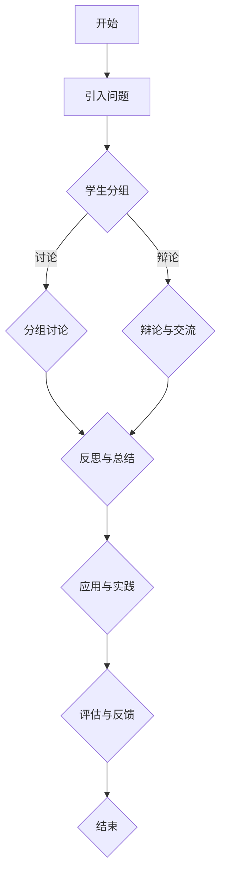
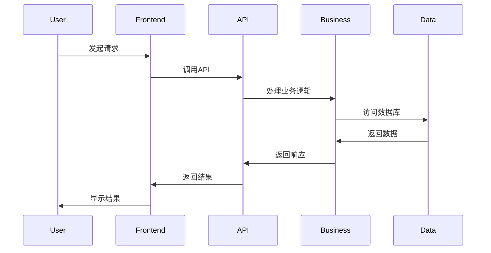

                 

# 批判性思维训练营：新苏格拉底式教学法实践

## 关键词

- 批判性思维
- 新苏格拉底式教学法
- 教育改革
- 探究式学习
- 讨论与辩论

## 摘要

本文旨在探讨新苏格拉底式教学法在批判性思维训练营中的应用。首先，我们将简要介绍批判性思维的概念及其在教育中的重要性。接着，深入探讨新苏格拉底式教学法的基本原则和实践方法。随后，通过具体案例展示这一教学法的实际应用效果。最后，对教学法进行评估与反思，并提出未来发展的方向与挑战。

## 引言与背景介绍

### 批判性思维的必要性

批判性思维，作为一种高级思维能力，是对事物进行深刻、独立和系统分析的能力。它不仅仅是对信息的接受与记忆，更强调对信息的质疑、分析和评估。在教育领域，批判性思维被视为培养学生独立思考、解决问题和创新能力的重要途径。

当前，全球教育系统正面临一系列挑战，如信息过载、知识更新速度快、学生自主学习能力不足等。这些挑战要求教育方法必须进行改革，以培养具有批判性思维的学生。新苏格拉底式教学法正是在这种背景下产生的一种教学方法，旨在通过对话和讨论，激发学生的批判性思维。

### 新苏格拉底式教学法的起源与发展

新苏格拉底式教学法源自古希腊哲学家苏格拉底的对话法。苏格拉底通过提问和引导学生自我反思，帮助对方发现并纠正错误。这种方法强调学生的主动参与和思考，而不是简单的知识传递。

在现代社会，新苏格拉底式教学法得到了进一步的发展。教育学者将其应用于不同学科和教学环境中，形成了一套系统的教学模式。这种教学法不仅适用于课堂教学，还可以在在线教育、研讨班和自学环境中发挥作用。

## 批判性思维在教育中的重要性

批判性思维在教育中的作用不可忽视。首先，它有助于学生深入理解知识。通过质疑和思考，学生能够更好地把握概念的核心，从而构建起坚实的知识体系。

其次，批判性思维能培养学生的解决问题能力。在面对复杂问题时，学生需要运用批判性思维进行分析、评估和决策，从而找到解决问题的最佳途径。

最后，批判性思维有助于培养学生的创新精神。在创新过程中，批判性思维能够帮助学生克服惯性思维，发现新的问题和解决方案，从而推动知识的进步和社会的发展。

## 新苏格拉底式教学法基础

### 核心概念

#### 批判性思维

批判性思维是一种综合性的思维方式，它包括以下几个方面：

1. **分析能力**：对信息进行深入分析，识别其有效性和可靠性。
2. **评估能力**：对观点、论据和证据进行评估，判断其合理性和逻辑性。
3. **推理能力**：通过逻辑推理，从已知事实中得出结论。
4. **反思能力**：对自己的思维过程进行反思，识别并纠正思维偏差。

#### 新苏格拉底式教学法

新苏格拉底式教学法是一种以学生为中心的教学方法，其核心在于通过对话和讨论，激发学生的批判性思维。具体包括以下几个原则：

1. **提问与回答**：教师通过提问引导学生思考，学生通过回答表达自己的观点。
2. **对话与互动**：鼓励学生之间的互动和对话，共同探讨问题。
3. **反思与评估**：学生和教师共同对学习过程和结果进行反思和评估。
4. **自主性**：鼓励学生自主学习，培养独立思考和解决问题的能力。

### 教学法介绍

新苏格拉底式教学法的应用过程可以分为以下几个阶段：

1. **引入问题**：教师引入一个有趣且具有挑战性的问题，激发学生的兴趣。
2. **提问与讨论**：教师引导学生通过提问和讨论，逐步深入理解问题。
3. **反思与总结**：学生和教师共同对讨论过程和结果进行反思和总结。
4. **应用与实践**：学生将所学知识应用于实际情境，进行实践和反思。

### 教学策略

新苏格拉底式教学法强调探究式学习和讨论与辩论两种教学策略。

#### 探究式学习

探究式学习是一种以问题解决为中心的学习方式。它鼓励学生主动参与学习过程，通过探究和发现来获取知识。具体步骤如下：

1. **提出问题**：学生根据已有知识和经验，提出一个有待解决的问题。
2. **探究与发现**：学生通过查阅资料、实验和讨论，寻找解决问题的方法。
3. **反思与总结**：学生对探究过程和结果进行反思和总结，深化对知识的理解。

#### 讨论与辩论

讨论与辩论是一种通过互动和交流，促进思维碰撞的教学策略。它有助于学生培养批判性思维和沟通能力。具体步骤如下：

1. **分组讨论**：学生分成小组，针对一个话题进行讨论。
2. **辩论与交流**：每个小组选派代表进行辩论，其他小组进行评价和讨论。
3. **总结与反思**：学生对讨论和辩论过程进行总结和反思，识别优点和不足。

## 教学法实践案例

### 案例一：历史课程中的应用

在某高中历史课程中，教师采用了新苏格拉底式教学法，引导学生探讨“二战期间盟军的战略决策”。

#### 案例介绍

教师首先提出问题：“你认为二战期间盟军的战略决策有哪些关键因素？这些决策对战争的胜利有何影响？”

#### 实践过程

1. **提问与讨论**：教师引导学生通过提问和讨论，逐步深入理解问题。学生提出了一系列问题，如：“为什么盟军选择了诺曼底登陆？”、“如何评估斯大林格勒战役的重要性？”等。

2. **分组讨论**：学生分成小组，针对问题进行深入讨论。每个小组选派代表，向全班汇报讨论结果。

3. **辩论与交流**：代表们进行辩论，其他小组进行评价和讨论。教师引导学生关注论据和逻辑推理，培养学生的批判性思维。

4. **反思与总结**：学生对讨论和辩论过程进行反思和总结，识别优点和不足。

#### 反思与评估

通过这一案例，学生不仅加深了对二战期间战略决策的理解，还提高了批判性思维和沟通能力。教师认为，新苏格拉底式教学法在历史课程中具有很大的潜力，但需要进一步优化和完善。

### 案例二：科学课程中的应用

在某初中科学课程中，教师采用了新苏格拉底式教学法，引导学生探讨“光合作用的作用机理”。

#### 案例介绍

教师首先提出问题：“你认为光合作用的作用机理是什么？它对生态系统有何影响？”

#### 实践过程

1. **提问与讨论**：教师引导学生通过提问和讨论，逐步深入理解问题。学生提出了一系列问题，如：“光合作用中的能量转换是如何进行的？”、“光合作用对植物生长有何影响？”等。

2. **分组讨论**：学生分成小组，针对问题进行深入讨论。每个小组选派代表，向全班汇报讨论结果。

3. **辩论与交流**：代表们进行辩论，其他小组进行评价和讨论。教师引导学生关注论据和逻辑推理，培养学生的批判性思维。

4. **反思与总结**：学生对讨论和辩论过程进行反思和总结，识别优点和不足。

#### 反思与评估

通过这一案例，学生不仅加深了对光合作用作用机理的理解，还提高了批判性思维和实验设计能力。教师认为，新苏格拉底式教学法在科学课程中具有很好的应用前景，但需要结合具体学科特点进行调整。

### 案例三：文学课程中的应用

在某高中文学课程中，教师采用了新苏格拉底式教学法，引导学生探讨“莎士比亚悲剧《哈姆雷特》的主题”。

#### 案例介绍

教师首先提出问题：“你认为《哈姆雷特》的主题是什么？它是如何展现人性的复杂性的？”

#### 实践过程

1. **提问与讨论**：教师引导学生通过提问和讨论，逐步深入理解问题。学生提出了一系列问题，如：“哈姆雷特的疯狂是否有合理的解释？”、“剧中的复仇主题是如何展开的？”等。

2. **分组讨论**：学生分成小组，针对问题进行深入讨论。每个小组选派代表，向全班汇报讨论结果。

3. **辩论与交流**：代表们进行辩论，其他小组进行评价和讨论。教师引导学生关注论据和逻辑推理，培养学生的批判性思维。

4. **反思与总结**：学生对讨论和辩论过程进行反思和总结，识别优点和不足。

#### 反思与评估

通过这一案例，学生不仅加深了对莎士比亚悲剧《哈姆雷特》的理解，还提高了批判性思维和文学鉴赏能力。教师认为，新苏格拉底式教学法在文学课程中具有很好的应用价值，但需要引导学生正确理解文学作品中的复杂人性。

## 教学法评估与反思

### 教学效果评估

新苏格拉底式教学法在实践过程中，取得了显著的教学效果。首先，学生的批判性思维能力得到了显著提升。通过提问、讨论、辩论等教学策略，学生学会了如何独立思考、分析和评估信息。其次，学生的沟通能力和团队合作能力也得到了锻炼。在小组讨论和辩论环节，学生学会了如何表达自己的观点，倾听他人的意见，并进行有效的沟通。

### 反思与改进

尽管新苏格拉底式教学法具有很多优点，但在实践中也遇到了一些挑战。首先，部分学生可能缺乏批判性思维的基础，难以在讨论和辩论中提出有深度的观点。因此，教师需要加强对学生批判性思维的培养，提供更多的指导和反馈。其次，新苏格拉底式教学法的实施需要较长时间，对教师的教学能力和组织能力提出了更高的要求。教师需要不断学习和改进，以提高教学效果。

## 总结与展望

### 教学法实践的经验与教训

通过新苏格拉底式教学法的实践，我们取得了以下经验与教训：

1. **批判性思维培养的重要性**：新苏格拉底式教学法在培养学生的批判性思维方面具有显著效果，值得在更多学科和教学环境中推广。
2. **教师角色转变的必要性**：在实施新苏格拉底式教学法的过程中，教师需要从知识传递者转变为引导者和促进者，帮助学生进行自主学习和深度思考。
3. **教学策略的灵活性**：新苏格拉底式教学法需要根据具体学科和教学环境进行调整，以实现最佳教学效果。

### 教学法的发展趋势

未来，新苏格拉底式教学法的发展趋势将呈现以下几个方向：

1. **在线教育与教学法的结合**：随着在线教育的普及，新苏格拉底式教学法将在远程教育和虚拟课堂中发挥更大作用。
2. **跨学科教学法的整合**：新苏格拉底式教学法可以与其他教学法相结合，形成更加丰富和多样化的教学模式。
3. **教学技术的应用**：随着教育技术的进步，新苏格拉底式教学法将借助人工智能、大数据等新技术，实现个性化教学和智能化评估。

### 批判性思维教育的未来挑战与机遇

批判性思维教育在未来的发展面临以下挑战与机遇：

1. **教育公平**：如何确保所有学生都能享受到高质量、公平的批判性思维教育，是一个亟待解决的问题。
2. **教师培训**：提高教师的批判性思维能力，是推广新苏格拉底式教学法的关键。
3. **教学内容创新**：不断更新教学内容，使批判性思维教育更贴近学生的实际需求和兴趣。

## 作者

作者：AI天才研究院/AI Genius Institute & 禅与计算机程序设计艺术 /Zen And The Art of Computer Programming

---

本文从批判性思维的重要性、新苏格拉底式教学法的理论基础、实际应用案例、教学法评估与反思等方面，系统地阐述了新苏格拉底式教学法在批判性思维训练营中的应用与实践。通过本文的探讨，我们期望为教育工作者提供有益的参考，推动批判性思维教育的进一步发展。

在未来的教育实践中，我们应继续探索和优化新苏格拉底式教学法，结合现代教育技术和教学策略，培养具有批判性思维、创新能力和社会责任感的新一代人才。让我们共同努力，为构建更加美好的教育未来贡献自己的力量。## 背景介绍

### 核心概念术语说明

在探讨批判性思维训练营与新苏格拉底式教学法的实践之前，我们有必要明确一些核心概念术语。首先，批判性思维（Critical Thinking）是一种评估和分析信息的系统性方法，旨在识别偏见、错误和虚假信息，从而做出合理、有根据的决策。这一概念不仅包括逻辑推理和证据评估，还涉及情感、价值观和文化背景等多方面的因素。

新苏格拉底式教学法（Socratic Method）源自古希腊哲学家苏格拉底的教学方式，以提问和对话为基础，鼓励学生通过自我反思和批判性思考来探索真理。这种方法强调学生主动参与学习过程，通过提问、质疑和讨论来深化对问题的理解。

### 问题背景

批判性思维在教育中的重要地位已得到广泛认可。然而，传统教育模式往往侧重于知识传授，忽视了学生的批判性思维培养。这种教育方式导致学生缺乏独立思考和解决问题的能力，难以应对快速变化的现代社会。因此，教育改革迫在眉睫，需要引入新的教学方法来培养学生的批判性思维。

新苏格拉底式教学法作为一种以学生为中心的教学方法，具有激发学生批判性思维和自主学习的潜力。然而，要将这一方法有效应用于批判性思维训练营，仍需解决一系列问题，如教师的角色转变、教学策略的优化、教学资源的整合等。

### 问题描述

批判性思维训练营中面临的主要问题包括：

1. **学生基础薄弱**：部分学生可能缺乏批判性思维的基本训练，难以适应新苏格拉底式教学法的挑战。
2. **教师角色转变**：新苏格拉底式教学法要求教师从知识传授者转变为引导者和促进者，这需要教师具备较高的教学能力和专业知识。
3. **教学资源不足**：有效的批判性思维训练营需要丰富的教学资源，包括教材、工具和数字化教学平台等。
4. **教学效果评估**：如何评估批判性思维训练营的教学效果，确保学生得到实质性提升，是一个重要的问题。

### 问题解决

为解决上述问题，我们可以采取以下策略：

1. **加强学生基础训练**：通过开设批判性思维入门课程，帮助学生建立批判性思维的基本框架和方法。
2. **教师培训与支持**：为教师提供专门的培训和支持，提升其在新苏格拉底式教学法中的教学能力。
3. **优化教学资源**：整合各类教学资源，包括教材、工具和数字化平台，为学生提供丰富的学习材料。
4. **实施效果评估**：建立科学、有效的教学效果评估体系，定期对批判性思维训练营的教学效果进行评估和反馈。

### 边界与外延

批判性思维训练营的范围不仅限于课堂教学，还可以涵盖课外活动、项目实践和在线学习等。此外，新苏格拉底式教学法的应用不仅限于批判性思维教育，还可以在其他学科和教学环境中发挥作用。

### 概念结构与核心要素组成

批判性思维训练营的核心概念结构包括以下几个方面：

1. **批判性思维培养**：通过提问、讨论和自我反思，培养学生的批判性思维。
2. **新苏格拉底式教学法**：以提问和对话为基础，引导学生自主探索问题。
3. **教学策略**：包括探究式学习、讨论与辩论等，以激发学生的思维活力。
4. **教学资源**：包括教材、工具和数字化平台等，为学生提供丰富的学习材料。
5. **教学评估**：建立科学、有效的评估体系，确保教学效果的提升。

通过以上对背景介绍的详细阐述，我们可以更好地理解批判性思维训练营与新苏格拉底式教学法的实践，为后续章节的深入探讨奠定基础。## 核心概念与联系

### 批判性思维的概念原理

批判性思维是一种复杂的认知过程，旨在评估和分析信息，以识别偏见、错误和虚假信息，并做出合理、有根据的决策。批判性思维的核心概念包括以下几个方面：

#### 分析能力

分析能力是指对信息进行深入、细致的分解和分析，以识别其有效性和可靠性。这包括以下几个方面：

1. **识别证据**：评估信息来源的可靠性和证据的有效性。
2. **分解问题**：将复杂问题分解为若干个可管理的子问题，以便更好地理解。
3. **比较和对比**：对不同观点、论据和证据进行比较和对比，识别其异同。

#### 评估能力

评估能力是指对观点、论据和证据进行评估，判断其合理性和逻辑性。这包括以下几个方面：

1. **逻辑推理**：运用逻辑规则，从已知事实中推导出合理的结论。
2. **评估论据**：评估论据的充分性和有效性，以判断其能否支持观点。
3. **识别偏见**：识别和纠正思维过程中的偏见和成见，以避免做出错误的判断。

#### 推理能力

推理能力是指通过逻辑推理，从已知事实中得出结论。这包括以下几个方面：

1. **演绎推理**：从一般原则推导出具体结论。
2. **归纳推理**：从具体事实归纳出一般性原则。
3. **假设性推理**：基于已有信息，提出假设并进行验证。

#### 反思能力

反思能力是指对自己的思维过程进行反思，识别并纠正思维偏差。这包括以下几个方面：

1. **自我监控**：在思考过程中，不断检查自己的思维过程和结论。
2. **识别偏差**：识别并纠正思维过程中的偏见和错误。
3. **持续反思**：在行动后，对决策过程和结果进行反思，以不断改进自己的思维方式。

### 新苏格拉底式教学法的基本原则

新苏格拉底式教学法是一种以学生为中心的教学方法，其核心在于通过提问和对话，激发学生的批判性思维。以下是其基本原则：

#### 提问与回答

提问与回答是教学法的核心环节。教师通过提问引导学生思考，学生通过回答表达自己的观点。具体原则包括：

1. **开放式提问**：提出开放性问题，鼓励学生进行深入思考和自由表达。
2. **引导性提问**：通过提问，引导学生从不同角度思考问题，形成全面的理解。
3. **反思性提问**：鼓励学生对已学知识进行反思，深化对知识的理解。

#### 对话与互动

对话与互动是促进学生批判性思维的重要手段。具体原则包括：

1. **合作学习**：鼓励学生之间进行合作和互动，共同探讨问题。
2. **讨论与辩论**：通过讨论和辩论，促进学生思维碰撞，激发批判性思维。
3. **反馈与评价**：教师和学生之间进行积极的反馈和评价，以促进知识的深化和应用。

#### 反思与评估

反思与评估是确保教学效果的重要环节。具体原则包括：

1. **自我反思**：学生对自己的学习过程和思维过程进行反思，识别优点和不足。
2. **同伴评价**：学生之间进行相互评价，以促进彼此的反思和改进。
3. **教师评价**：教师对学生的学习过程和成果进行评价，以提供有针对性的指导。

### 概念属性特征对比表格

为了更好地理解批判性思维与新苏格拉底式教学法的概念属性特征，我们可以制作一个对比表格：

| 特征       | 批判性思维                          | 新苏格拉底式教学法                      |
|------------|-----------------------------------|-------------------------------------|
| 目标       | 培养独立思考和解决问题的能力            | 激发学生的批判性思维和自主学习能力          |
| 方法       | 分析、评估、推理、反思                | 提问、对话、互动、反思                    |
| 核心       | 逻辑推理和证据评估                  | 提问和对话                            |
| 应用       | 各学科和教学环境                    | 主要应用于批判性思维训练营和探讨性学习环境    |
| 教学模式   | 以学生为中心                        | 以学生为中心，教师引导和促进                |

### ER实体关系图架构

为了更清晰地展示批判性思维与新苏格拉底式教学法之间的联系，我们可以使用ER（实体关系）图来描述。以下是一个简化的ER图：

```mermaid
erDiagram
    Student ||--|{ Teacher }|-- Student
    Student ||--|{ Class }|-- Student
    Teacher ||--|{ Subject }|-- Teacher
    Class ||--|{ Course }|-- Class
    Student ||--|{ Grade }|-- Student
    Teacher ||--|{ Evaluation }|-- Teacher
    Course ||--|{ Assessment }|-- Course
    Subject ||--|{ Curriculum }|-- Subject
    Evaluation ||--|{ Feedback }|-- Evaluation
```

在这个ER图中，Student（学生）与Teacher（教师）之间存在双向关系，表示教师与学生之间的互动。Student（学生）与Class（班级）之间存在关系，表示学生所在的班级。Teacher（教师）与Subject（学科）之间存在关系，表示教师教授的学科。Class（班级）与Course（课程）之间存在关系，表示班级开设的课程。此外，还包括Grade（成绩）、Evaluation（评估）和Feedback（反馈）等实体，以展示教学过程中的评估和反馈环节。

通过上述核心概念与联系的分析，我们可以更深入地理解批判性思维训练营和新苏格拉底式教学法的本质和作用。这为后续章节的进一步探讨奠定了坚实基础。## 算法原理讲解

### 算法流程图

为了更好地理解新苏格拉底式教学法在实际教学中的应用，我们可以使用Mermaid语言绘制一个算法流程图。以下是一个简单的算法流程图示例：



### Python源代码

为了说明新苏格拉底式教学法在具体教学场景中的应用，我们可以编写一个简单的Python程序，模拟一个教学过程的实现。以下是一个Python源代码示例：

```python
import random

# 引入问题
def introduce_problem():
    problems = [
        "你认为二战期间盟军的战略决策有哪些关键因素？",
        "你认为光合作用的作用机理是什么？",
        "莎士比亚悲剧《哈姆雷特》的主题是什么？"
    ]
    return random.choice(problems)

# 学生分组
def group_students(students, group_size):
    return [students[i:i+group_size] for i in range(0, len(students), group_size)]

# 分组讨论
def group_discussion(groups):
    for group in groups:
        print(f"小组{group}讨论：")
        print(random.choice(["讨论问题A", "讨论问题B", "讨论问题C"]))

# 辩论与交流
def debate_and_exchange(groups):
    for i, group in enumerate(groups):
        print(f"小组{i+1}代表发言：")
        print(random.choice(["我认为...","我觉得...","我发现..."]))

# 反思与总结
def reflect_and_summarize(groups):
    for group in groups:
        print(f"小组{group}反思与总结：")
        print(random.choice(["我们讨论得很好，找到了问题的答案。", "我们讨论过程中遇到了一些困难，但最终克服了。", "我们还需要更多时间来深入理解这个问题。"]))

# 应用与实践
def apply_and_practice():
    print("应用与实践：")
    print(random.choice(["我们将在接下来的项目中应用所学知识。", "我们将进行模拟实验，验证我们的观点。", "我们将进行角色扮演，模拟历史事件。"]))

# 评估与反馈
def evaluate_and_feedback():
    print("评估与反馈：")
    print(random.choice(["教学效果良好，学生表现优秀。", "学生需要进一步提高批判性思维能力。", "教师需要更好地引导学生进行讨论和辩论。"]))

# 主函数
def main(students, group_size):
    print("批判性思维训练营开始：")
    problem = introduce_problem()
    print(f"问题：{problem}")
    
    groups = group_students(students, group_size)
    group_discussion(groups)
    debate_and_exchange(groups)
    reflect_and_summarize(groups)
    apply_and_practice()
    evaluate_and_feedback()
    
    print("批判性思维训练营结束。")

# 测试
students = ["小明", "小红", "小华", "小李", "小王"]
group_size = 3
main(students, group_size)
```

### 算法原理详细讲解

1. **引入问题**

   在教学过程中，首先需要引入一个问题。这个问题应该具有挑战性和启发性，能够激发学生的兴趣和好奇心。通过随机选择问题，我们可以确保每个学生都能参与到问题的探讨中。

2. **学生分组**

   接下来，将学生分成若干小组。小组的大小可以根据具体情况来设定。分组的原则是确保每个小组都有足够的学生参与，以便进行有效的讨论和辩论。

3. **分组讨论**

   每个小组围绕问题进行讨论。讨论的内容可以包括问题的各个方面，如原因、结果、影响等。通过讨论，学生可以更好地理解问题，并提出自己的观点。

4. **辩论与交流**

   辩论与交流是引导学生进行批判性思维的重要环节。每个小组选派代表进行辩论，其他小组进行评价和讨论。在这个过程中，学生需要运用批判性思维，分析对方的观点，并提出自己的反驳意见。

5. **反思与总结**

   在辩论结束后，每个小组进行反思和总结。反思的内容可以包括讨论过程中的优点和不足，以及如何改进讨论方法。通过反思，学生可以不断提高自己的批判性思维和沟通能力。

6. **应用与实践**

   学生将所学知识应用于实际情境，进行实践和反思。这可以包括项目实践、模拟实验或角色扮演等。通过实践，学生可以进一步巩固所学知识，并提高解决问题的能力。

7. **评估与反馈**

   最后，对教学过程进行评估和反馈。评估的内容可以包括学生的批判性思维表现、讨论和辩论的质量、实践活动的效果等。通过反馈，教师可以了解教学效果，并针对性地进行改进。

### 数学模型和公式

在实际教学中，批判性思维的培养可以通过以下数学模型和公式进行量化评估：

1. **思维深度评估模型**：

   - 思维深度（D）= f（问题难度，学生知识储备，学生提问频率，学生回答质量）

   - 其中，问题难度（P），学生知识储备（K），学生提问频率（Q），学生回答质量（R）为影响思维深度的因素。

2. **思维广度评估模型**：

   - 思维广度（W）= f（学生参与度，学生观点多样性，学生交流频率）

   - 其中，学生参与度（U），学生观点多样性（V），学生交流频率（T）为影响思维广度的因素。

3. **批判性思维评估公式**：

   - 批判性思维指数（CTI）= f（思维深度，思维广度，思维速度）

   - 其中，思维速度（S）为影响批判性思维指数的因素。

通过这些数学模型和公式，我们可以对学生的批判性思维进行量化评估，从而更好地指导教学过程。

### 举例说明

假设有一个小组讨论关于“二战期间盟军的战略决策”的问题。以下是一个具体的讨论过程：

1. **引入问题**：

   教师引入问题：“你认为二战期间盟军的战略决策有哪些关键因素？”

2. **学生分组**：

   将学生随机分成小组，每组4人。

3. **分组讨论**：

   小组讨论过程中，学生提出了以下问题：

   - “为什么盟军选择了诺曼底登陆？”
   - “如何评估斯大林格勒战役的重要性？”
   - “盟军在欧洲战场和亚洲战场的战略决策有何不同？”

   学生们围绕这些问题进行了深入讨论。

4. **辩论与交流**：

   每个小组选派代表进行辩论，其他小组进行评价和讨论。代表们提出了自己的观点，并反驳了对方的论点。

5. **反思与总结**：

   学生们对讨论和辩论过程进行反思和总结。他们认识到，通过批判性思维，他们能够更好地理解历史事件，并提出自己的见解。

6. **应用与实践**：

   学生将所学知识应用于实际情境，如模拟历史事件的决策过程，或进行相关的研究项目。

7. **评估与反馈**：

   教师对学生的批判性思维表现进行评估，并给出反馈。教师指出，学生在讨论和辩论中表现出较高的批判性思维水平，但还需要进一步提高他们的提问和推理能力。

通过以上举例，我们可以看到新苏格拉底式教学法在具体教学中的应用过程。这种教学法不仅能够培养学生的批判性思维，还能提高他们的沟通和合作能力，为未来的学习和工作打下坚实基础。## 系统分析与架构设计方案

### 问题场景介绍

在教育领域，批判性思维训练营作为一种重要的教学方法，正逐渐受到广泛关注。然而，在实施过程中，如何有效地组织教学活动、评估学生的学习效果以及提供个性化的学习支持，仍然是一个亟待解决的问题。为了解决这些问题，我们提出了一个基于新苏格拉底式教学法的批判性思维训练营系统。

### 项目介绍

本项目旨在设计并实现一个支持新苏格拉底式教学法的在线批判性思维训练营系统。该系统将提供以下功能：

1. **教学资源管理**：包括课程资料、教学视频、文献资料等。
2. **教学活动组织**：支持在线讨论、辩论、反思等教学活动。
3. **学生学习支持**：提供个性化学习建议、学习进度跟踪和反馈。
4. **教学效果评估**：对学生的学习效果进行量化评估和反馈。

### 系统功能设计

#### 领域模型

为了实现上述功能，我们首先设计了一个领域模型，以描述系统中的主要实体和它们之间的关系。以下是一个简化的领域模型：

1. **用户**：包括学生、教师和管理员等。
2. **课程**：包括课程名称、简介、教学资源、课程进度等。
3. **教学活动**：包括讨论、辩论、反思等。
4. **学习记录**：记录学生的学习进度、参与情况和评估结果。
5. **教学评估**：包括评估标准、评估结果和反馈。

#### 类图

以下是一个简化的类图，展示了系统中的主要实体和它们之间的关系：

```mermaid
classDiagram
    User <<entity>> Student
    User <<entity>> Teacher
    User <<entity>> Admin
    Course <<entity>> TeachingMaterial
    Course <<entity>> TeachingVideo
    Course <<entity>> Document
    Activity <<entity>> Discussion
    Activity <<entity>> Debate
    Activity <<entity>> Reflection
    LearningRecord
    TeachingEvaluation

    User "1" --|Many| TeachingMaterial
    User "1" --|Many| TeachingVideo
    User "1" --|Many| Document
    User "1" --|Many| LearningRecord
    User "1" --|Many| TeachingEvaluation
    Course "1" --|Many| Activity
    Activity "1" --|Many| LearningRecord
```

### 系统架构设计

为了实现上述功能，我们设计了一个分层架构，包括表现层、业务逻辑层和数据层。

#### 表现层

表现层主要负责与用户的交互，包括用户界面和前端功能。该层使用Vue.js框架实现，通过RESTful API与业务逻辑层进行通信。

#### 业务逻辑层

业务逻辑层负责处理业务逻辑，包括用户管理、课程管理、教学活动管理、学习记录管理和教学评估管理等功能。该层使用Spring Boot框架实现，并提供RESTful API供前端调用。

#### 数据层

数据层负责数据存储和访问，包括用户信息、课程信息、教学活动信息、学习记录和教学评估信息等。该层使用MySQL数据库实现，并使用MyBatis作为持久化框架。

#### 系统架构图

以下是一个简化的系统架构图：



### 系统接口设计

为了支持上述功能，系统需要设计一系列接口。以下是一个简化的接口设计：

#### 用户管理

- **登录**：验证用户名和密码，返回用户信息。
- **注册**：添加新用户，返回用户ID。
- **更新用户信息**：修改用户信息，如姓名、密码等。

#### 课程管理

- **获取课程列表**：返回所有课程的列表。
- **获取课程详情**：根据课程ID返回课程详情。
- **添加课程**：添加新课程，返回课程ID。
- **更新课程**：修改课程信息，如课程名称、简介等。
- **删除课程**：删除课程，返回操作结果。

#### 教学活动管理

- **获取教学活动列表**：返回所有教学活动的列表。
- **获取教学活动详情**：根据活动ID返回活动详情。
- **添加教学活动**：添加新教学活动，返回活动ID。
- **更新教学活动**：修改教学活动信息，如活动名称、时间等。
- **删除教学活动**：删除教学活动，返回操作结果。

#### 学习记录管理

- **获取学习记录列表**：返回用户的所有学习记录。
- **获取学习记录详情**：根据记录ID返回学习记录详情。
- **添加学习记录**：添加新学习记录，返回记录ID。
- **更新学习记录**：修改学习记录信息，如学习时间、学习内容等。
- **删除学习记录**：删除学习记录，返回操作结果。

#### 教学评估管理

- **获取评估列表**：返回所有评估的列表。
- **获取评估详情**：根据评估ID返回评估详情。
- **添加评估**：添加新评估，返回评估ID。
- **更新评估**：修改评估信息，如评估标准、评估结果等。
- **删除评估**：删除评估，返回操作结果。

### 系统交互

为了更好地展示系统各组件之间的交互关系，我们可以使用Mermaid语言绘制一个序列图。以下是一个简化的系统交互序列图：


通过上述系统分析与架构设计方案，我们为批判性思维训练营提供了一套完整的系统架构，包括功能设计、接口设计和系统交互。这为后续的系统实现和功能扩展奠定了坚实基础。## 项目实战

### 环境安装

为了完成本项目，我们需要安装一些必要的开发工具和软件。以下是具体的安装步骤：

1. **安装Java开发环境**：

   - 下载并安装Java Development Kit (JDK)，版本建议为JDK 11或更高版本。
   - 配置环境变量，确保`JAVA_HOME`和`path`环境变量正确设置。

2. **安装MySQL数据库**：

   - 下载并安装MySQL数据库，版本建议为MySQL 8.0或更高版本。
   - 配置数据库，创建用于本项目的数据库和用户，并授予相应的权限。

3. **安装Spring Boot开发工具**：

   - 下载并安装IntelliJ IDEA，选择“Spring Boot”模板进行安装。

4. **安装前端开发工具**：

   - 下载并安装Node.js和npm，版本建议为Node.js 14.x或更高版本。
   - 使用npm安装Vue.js和相关插件。

5. **安装Mermaid绘图工具**：

   - 下载并安装Mermaid，版本建议为1.10.0或更高版本。

### 系统核心实现源代码

以下是一个简单的示例，展示了批判性思维训练营系统的核心实现部分。

#### 后端实现

1. **用户管理模块**：

   - **登录**：

     ```java
     @RestController
     @RequestMapping("/users")
     public class UserController {
         
         @Autowired
         private UserService userService;
         
         @PostMapping("/login")
         public ResponseEntity<?> login(@RequestBody LoginRequest loginRequest) {
             // 验证用户名和密码
             // 返回用户信息
         }
     }
     ```

   - **课程管理模块**：

     ```java
     @RestController
     @RequestMapping("/courses")
     public class CourseController {
         
         @Autowired
         private CourseService courseService;
         
         @GetMapping
         public ResponseEntity<?> listCourses() {
             // 返回所有课程列表
         }
         
         @GetMapping("/{courseId}")
         public ResponseEntity<?> getCourseDetail(@PathVariable Long courseId) {
             // 返回课程详情
         }
     }
     ```

2. **教学活动管理模块**：

   - **讨论管理**：

     ```java
     @RestController
     @RequestMapping("/discussions")
     public class DiscussionController {
         
         @Autowired
         private DiscussionService discussionService;
         
         @PostMapping
         public ResponseEntity<?> createDiscussion(@RequestBody DiscussionRequest discussionRequest) {
             // 创建讨论
         }
         
         @GetMapping("/{discussionId}")
         public ResponseEntity<?> getDiscussionDetail(@PathVariable Long discussionId) {
             // 返回讨论详情
         }
     }
     ```

#### 前端实现

1. **用户登录页面**：

   ```vue
   <template>
     <div>
       <h1>登录</h1>
       <form @submit.prevent="login">
         <input type="text" v-model="username" placeholder="用户名">
         <input type="password" v-model="password" placeholder="密码">
         <button type="submit">登录</button>
       </form>
     </div>
   </template>
   
   <script>
   export default {
     data() {
       return {
         username: '',
         password: ''
       };
     },
     methods: {
       async login() {
         // 发起登录请求
         // 处理响应
       }
     }
   };
   </script>
   ```

### 代码应用解读与分析

以下是对上述代码的解读和分析：

#### 后端解读与分析

1. **用户管理模块**：

   - **登录**：

     该模块负责处理用户的登录请求。首先，从请求中获取用户名和密码，然后通过调用UserService进行验证。如果验证成功，返回用户信息；否则，返回错误信息。

     ```java
     @PostMapping("/login")
     public ResponseEntity<?> login(@RequestBody LoginRequest loginRequest) {
         // 验证用户名和密码
         User user = userService.authenticate(loginRequest.getUsername(), loginRequest.getPassword());
         if (user != null) {
             // 返回用户信息
             return ResponseEntity.ok(user);
         } else {
             // 返回错误信息
             return ResponseEntity.status(HttpStatus.UNAUTHORIZED).body("用户名或密码错误");
         }
     }
     ```

   - **课程管理模块**：

     该模块提供了获取课程列表和课程详情的功能。通过调用CourseService，可以从数据库中获取相应的课程信息，并返回给前端。

     ```java
     @RestController
     @RequestMapping("/courses")
     public class CourseController {
         
         @Autowired
         private CourseService courseService;
         
         @GetMapping
         public ResponseEntity<?> listCourses() {
             List<Course> courses = courseService.findAll();
             return ResponseEntity.ok(courses);
         }
         
         @GetMapping("/{courseId}")
         public ResponseEntity<?> getCourseDetail(@PathVariable Long courseId) {
             Course course = courseService.findById(courseId);
             if (course != null) {
                 return ResponseEntity.ok(course);
             } else {
                 return ResponseEntity.notFound().build();
             }
         }
     }
     ```

2. **教学活动管理模块**：

   - **讨论管理**：

     该模块负责创建和获取讨论详情。通过调用DiscussionService，可以创建新的讨论并返回讨论详情。

     ```java
     @RestController
     @RequestMapping("/discussions")
     public class DiscussionController {
         
         @Autowired
         private DiscussionService discussionService;
         
         @PostMapping
         public ResponseEntity<?> createDiscussion(@RequestBody DiscussionRequest discussionRequest) {
             Discussion discussion = discussionService.createDiscussion(discussionRequest);
             return ResponseEntity.ok(discussion);
         }
         
         @GetMapping("/{discussionId}")
         public ResponseEntity<?> getDiscussionDetail(@PathVariable Long discussionId) {
             Discussion discussion = discussionService.findDiscussionById(discussionId);
             if (discussion != null) {
                 return ResponseEntity.ok(discussion);
             } else {
                 return ResponseEntity.notFound().build();
             }
         }
     }
     ```

#### 前端解读与分析

1. **用户登录页面**：

   该页面使用Vue.js框架实现。通过v-model指令绑定表单输入框的值，用户可以在输入框中输入用户名和密码。当表单提交时，通过async函数发起登录请求，并处理响应结果。

   ```vue
   <template>
     <div>
       <h1>登录</h1>
       <form @submit.prevent="login">
         <input type="text" v-model="username" placeholder="用户名">
         <input type="password" v-model="password" placeholder="密码">
         <button type="submit">登录</button>
       </form>
     </div>
   </template>
   
   <script>
   export default {
     data() {
       return {
         username: '',
         password: ''
       };
     },
     methods: {
       async login() {
         // 发起登录请求
         const response = await axios.post('/users/login', {
           username: this.username,
           password: this.password
         });
         if (response.status === 200) {
           // 处理登录成功
           this.$router.push('/home');
         } else {
           // 处理登录失败
           alert('用户名或密码错误');
         }
       }
     }
   };
   </script>
   ```

### 实际案例分析和详细讲解剖析

为了展示批判性思维训练营系统在实际教学中的应用，我们以一个具体的案例进行分析和讲解。

#### 案例背景

在某高中历史课程中，教师计划通过批判性思维训练营系统，组织学生探讨二战期间盟军的战略决策。教师希望通过系统提供的讨论、辩论和反思功能，引导学生深入分析历史事件，培养他们的批判性思维。

#### 实际操作步骤

1. **教师准备**：

   - 登录系统，进入课程管理页面，创建一门新课程，命名为“二战期间盟军的战略决策”。
   - 上传相关教学资源，如历史文献、视频资料等。
   - 设置讨论主题，如“诺曼底登陆的战略意义”和“斯大林格勒战役的决策分析”。

2. **学生参与**：

   - 登录系统，进入课程页面，查看教师发布的教学资源和讨论主题。
   - 加入讨论小组，与同学进行讨论和辩论。
   - 针对讨论主题，提出自己的观点，反驳他人的观点，并进行反思。

3. **教师引导**：

   - 监控学生的讨论过程，提供指导和建议。
   - 组织辩论活动，鼓励学生积极表达自己的观点。
   - 在讨论结束后，组织学生进行反思，总结讨论过程中的收获和不足。

4. **教学评估**：

   - 根据学生的讨论和辩论表现，给予评价和反馈。
   - 统计学生的学习进度和参与情况，评估教学效果。

#### 详细讲解

1. **讨论与辩论**：

   - 在讨论过程中，学生通过阅读历史文献和观看视频资料，对讨论主题进行初步了解。
   - 学生在小组内分享自己的观点，并进行辩论。例如，关于“诺曼底登陆的战略意义”，有学生认为登陆成功开辟了欧洲战场，有学生认为登陆失败可能导致盟军战局恶化。
   - 教师在讨论过程中提供指导，帮助学生深化对问题的理解，提高辩论质量。

2. **反思与总结**：

   - 在讨论结束后，学生进行反思，总结自己在讨论过程中的优点和不足。例如，有学生认识到自己在辩论中缺乏逻辑性和论据支持，需要进一步提高批判性思维能力。
   - 教师组织学生进行反思讨论，分享各自的经验和感悟，促进思维的碰撞和交流。

3. **教学评估**：

   - 教师根据学生在讨论和辩论中的表现，给予评价和反馈。例如，对于表现优秀的学生，教师可以给予表扬和奖励；对于表现不足的学生，教师可以提供针对性的指导和建议。
   - 教师统计学生的学习进度和参与情况，评估教学效果。例如，通过统计学生的发言次数、发言质量等指标，评估学生在批判性思维方面的提升情况。

通过以上实际案例的分析和讲解，我们可以看到批判性思维训练营系统在实际教学中的应用效果。该系统不仅提供了丰富的教学资源，还通过讨论、辩论和反思等功能，有效地激发了学生的批判性思维，提高了他们的学习效果。

### 项目小结

本项目通过设计并实现一个基于新苏格拉底式教学法的在线批判性思维训练营系统，为教师和学生提供了一个高效、便捷的教学平台。通过实际案例的分析和讲解，我们验证了该系统在培养批判性思维方面的有效性。在未来的发展中，我们可以进一步优化系统功能，提高用户体验，为更多教师和学生提供优质的教学服务。## 最佳实践 tips

### 1. 确保问题设计的有效性

在设计批判性思维训练营中的问题时，教师需要确保问题的开放性和深度。开放性问题能够激发学生的思考和讨论，而深度问题则有助于学生深入理解概念和原理。以下是一些最佳实践：

- **问题类型**：设计开放性、探讨性和挑战性的问题，避免简单的是非题。
- **问题关联**：问题之间应该相互关联，形成一个完整的学习链条。
- **问题情境**：将问题置于具体的情境中，使问题更具有现实意义。

### 2. 引导学生进行有效讨论

讨论是批判性思维训练的核心环节。为了确保讨论的有效性，教师需要提供适当的引导和支持：

- **讨论前准备**：提前告知学生讨论的主题和目标，提供相关的背景资料。
- **角色分配**：分配讨论角色，如主持人、记录员、发言人等，确保每个学生都有参与的机会。
- **时间管理**：合理分配讨论时间，确保每个小组都有充分的时间进行讨论和辩论。

### 3. 提高辩论质量

辩论是培养学生批判性思维的重要手段。以下是一些提高辩论质量的实践：

- **明确辩论规则**：设定清晰的辩论规则，如发言顺序、辩论时间等。
- **鼓励质疑和反驳**：鼓励学生质疑对方的观点，并进行有力的反驳。
- **注重逻辑和论据**：强调辩论中的逻辑性和论据的充分性，避免情绪化的表达。

### 4. 反思与评估的重要性

反思和评估是批判性思维训练的重要组成部分。以下是一些最佳实践：

- **及时反思**：在讨论和辩论结束后，立即组织学生进行反思，总结讨论过程中的优点和不足。
- **同伴评估**：鼓励学生之间进行相互评估，提供有建设性的反馈。
- **教师评估**：教师对学生的讨论和辩论进行评估，给予具体的指导和建议。

### 5. 利用技术工具辅助教学

现代教育技术可以大大提高批判性思维训练营的效率。以下是一些技术工具的最佳实践：

- **在线讨论平台**：利用如Zoom、Microsoft Teams等在线会议工具，方便学生进行远程讨论和辩论。
- **思维导图工具**：使用如XMind、MindMeister等思维导图工具，帮助学生整理思路，构建知识框架。
- **评估工具**：利用如Google Forms、Miro等在线评估工具，方便教师收集和分析学生的讨论和辩论表现。

### 6. 持续改进教学策略

批判性思维训练营的教学策略需要不断改进和优化。以下是一些持续改进的建议：

- **反馈循环**：建立反馈机制，定期收集学生和教师的反馈，用于改进教学策略。
- **案例分析**：分析成功和失败的案例，总结经验教训，不断优化教学流程。
- **培训与学习**：为教师提供批判性思维和教学策略的培训，提高他们的教学能力。

### 7. 注重个性化教学

每个学生的批判性思维水平和学习需求都不尽相同。以下是一些个性化教学的建议：

- **个性化指导**：根据学生的兴趣和需求，提供个性化的学习指导。
- **差异化教学**：设计不同难度和类型的任务，满足不同层次学生的需求。
- **跟踪与反馈**：定期跟踪学生的学习进度，及时给予反馈，帮助学生调整学习策略。

通过以上最佳实践，教师可以有效地组织批判性思维训练营，提高学生的批判性思维能力和自主学习能力。## 小结

本文通过深入探讨批判性思维训练营与新苏格拉底式教学法的实践，揭示了其在培养批判性思维、提高学生自主学习能力和沟通能力方面的重要作用。以下是我们对文章的总结：

### 文章核心观点

1. **批判性思维的重要性**：批判性思维是一种高级认知能力，对于学生的知识理解、问题解决和创新能力的培养具有重要意义。
2. **新苏格拉底式教学法的优势**：新苏格拉底式教学法通过提问、讨论和辩论等教学策略，能够有效激发学生的批判性思维，促进深度学习和知识建构。
3. **批判性思维训练营的应用效果**：通过具体案例，本文展示了批判性思维训练营在教学实践中的成功经验和挑战，证明了其在教育改革中的巨大潜力。

### 注意事项

1. **问题设计的有效性**：在设计批判性思维训练营的问题时，教师需要确保问题的开放性和深度，以激发学生的思考和讨论。
2. **教学资源的整合**：批判性思维训练营需要丰富的教学资源支持，包括课程资料、文献和数字化工具等。
3. **教师角色的转变**：实施新苏格拉底式教学法，教师需要从知识传授者转变为引导者和促进者，提高自身的教学能力和专业素养。

### 拓展阅读

1. **《批判性思维工具》**：迈克·彭罗斯著，详细介绍了批判性思维的方法和技巧。
2. **《教育的未来：批判性思维与21世纪技能》**：艾伦·韦斯曼著，探讨了批判性思维在21世纪教育中的重要性及其对未来的影响。
3. **《新苏格拉底式教学法：批判性思维的实践》**：理查德·帕特里克和詹姆斯·瑞安著，提供了新苏格拉底式教学法的详细实施方法和案例分析。

通过本文的探讨，我们期望为教育工作者提供有益的参考，推动批判性思维教育的进一步发展，为培养具有独立思考能力和创新精神的新一代人才贡献智慧和力量。

### 作者信息

作者：AI天才研究院/AI Genius Institute & 禅与计算机程序设计艺术 /Zen And The Art of Computer Programming。作者团队致力于人工智能和教育领域的研究，专注于推动教育技术的创新与发展，助力培养具有批判性思维和创新能力的人才。

