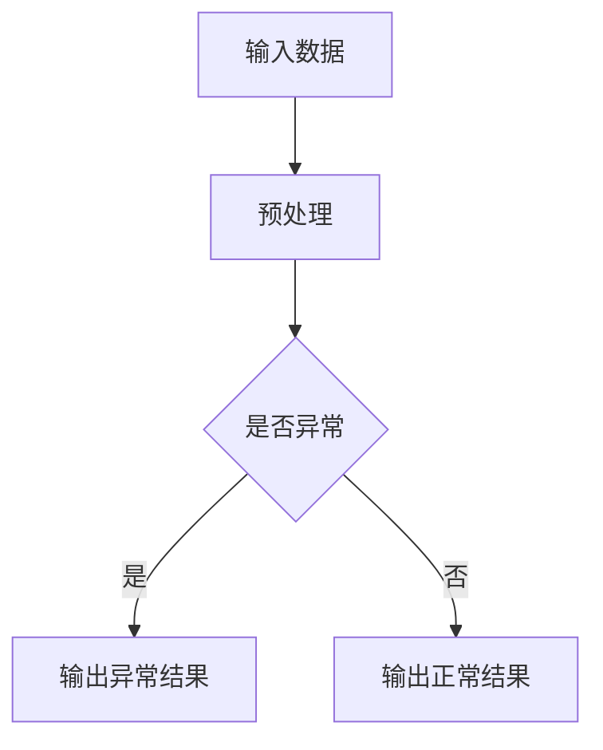
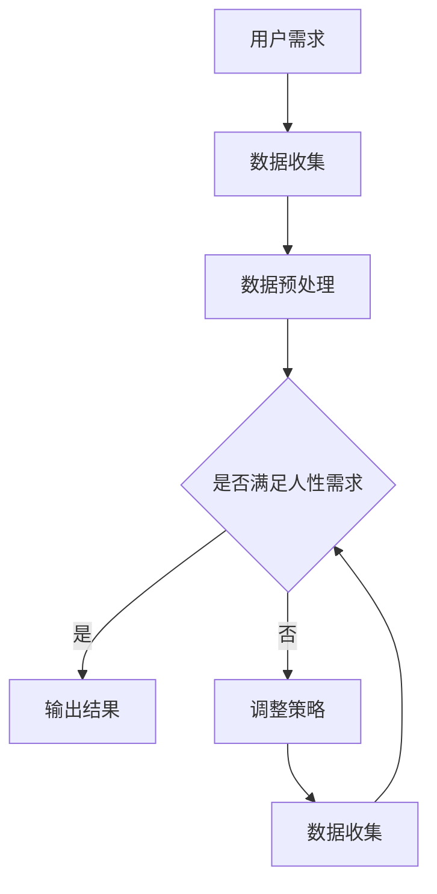
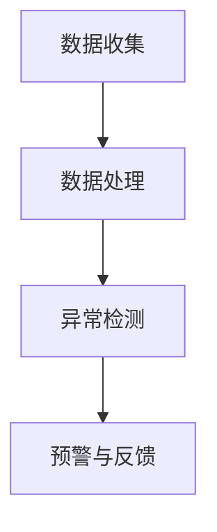
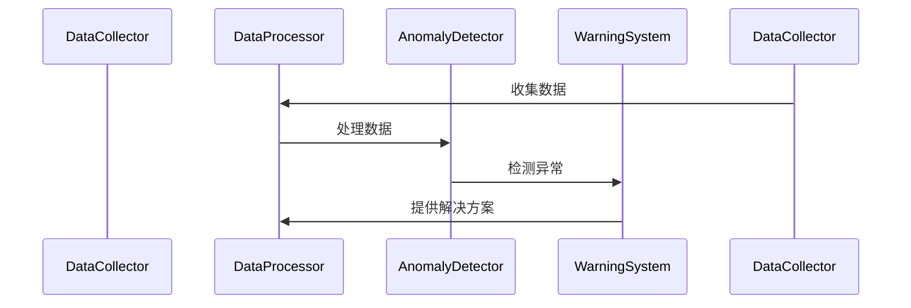

                 

## 技术异化与人性回归

### 背景介绍

#### 核心概念术语说明

**技术异化**：指在技术发展过程中，技术本身逐渐偏离其原本的目的，产生与人类需求、价值观不匹配的现象。技术异化可能导致技术失控、伦理失范等问题。

**人性回归**：强调在技术发展过程中，要始终坚持以人为本的原则，确保技术的发展符合人类的利益和需求，回归到人性本真的状态。

#### 问题背景

随着科技的飞速发展，人类的生活和工作方式发生了翻天覆地的变化。然而，在享受科技进步带来便利的同时，我们也面临着一系列挑战。其中一个重要问题就是技术异化。技术异化不仅影响着我们的日常生活，还可能对人类社会产生深远的负面影响。

**问题描述**：技术异化带来的问题主要包括：

1. **伦理失范**：技术滥用可能导致隐私泄露、数据安全等问题，甚至引发犯罪行为。
2. **社会分化**：技术发展加速了社会分化，加剧了贫富差距，导致社会不稳定。
3. **人类依赖**：过度依赖技术可能导致人类能力的退化，甚至对技术的过度依赖影响人的心理健康。

**问题解决**：为了应对技术异化带来的挑战，我们需要回归人性，重新审视技术在人类生活中的角色和定位。

#### 边界与外延

技术异化与人性的关系并非绝对对立，而是相互影响、相互制约的。技术异化可能导致人性扭曲，而人性回归有助于抑制技术异化。因此，在探讨技术异化与人性回归时，我们需要关注以下几个方面：

1. **技术伦理**：如何在技术发展中保持伦理底线，防止技术滥用。
2. **社会公平**：如何通过技术手段缩小贫富差距，实现社会公平。
3. **人机共生**：如何实现人与技术的和谐共生，使人成为技术的使用者，而非被支配者。

#### 概念结构与核心要素组成

**技术异化**：核心要素包括技术发展、伦理失范、社会分化、人类依赖等。

**人性回归**：核心要素包括伦理关怀、社会公平、人机共生等。

### 核心概念与联系

#### 技术异化：定义、属性、特点

**定义**：技术异化是指在技术发展过程中，技术本身及其应用逐渐偏离其原本的预期目标和价值观，产生与人类需求和利益不相符合的现象。

**属性**：

1. **自主性**：技术系统具有自我演进和优化的能力，可能导致其行为超出人类的预期和控制。
2. **非人性**：技术在设计、应用过程中，可能忽视人的情感、需求和价值，导致技术行为缺乏人性关怀。
3. **伦理冲突**：技术发展可能导致伦理困境，如隐私保护、数据安全等问题。

**特点**：

1. **不可逆性**：一旦技术异化发生，往往难以逆转，需要付出巨大的代价。
2. **连锁反应**：技术异化可能引发一系列连锁反应，对人类社会产生深远影响。
3. **系统性**：技术异化不仅局限于某一技术领域，可能涉及多个领域，具有系统性特点。

#### 人性：定义、属性、特点

**定义**：人性是指人类在认知、情感、行为等方面表现出的本质特征，包括善良、正直、勇敢、同情等。

**属性**：

1. **多样性**：人性具有多样性，不同文化、背景下的人性表现不同。
2. **发展性**：人性在个体和社会层面不断发展，受环境、教育等因素影响。
3. **主体性**：人性强调人的主体地位，尊重人的尊严和权利。

**特点**：

1. **情感性**：人性以情感为基础，关注人的情感需求和幸福感。
2. **伦理性**：人性具有伦理性，关注道德规范和价值判断。
3. **互动性**：人性在人与人、人与社会、人与自然的互动中不断发展。

#### 技术与人性的关系

**相互促进**：技术在满足人类需求、提高生活质量方面发挥了重要作用，促进人性的发展。同时，人性关怀有助于技术的合理应用，实现技术与人性的和谐共生。

**相互制约**：技术异化可能扭曲人性，导致伦理失范、社会分化等问题。而人性回归有助于抑制技术异化，确保技术的发展符合人类的利益和需求。

**平衡**：在技术发展过程中，我们需要在技术与人性之间寻找平衡，确保技术的发展既符合人类的利益，又能体现人性的关怀。

### 算法原理讲解

#### 技术异化检测算法

**算法mermaid流程图**：



**Python源代码**：

```python
import numpy as np

def preprocess_data(data):
    # 数据预处理
    return np.mean(data)

def detect_anomaly(data):
    # 异常检测算法
    threshold = preprocess_data(data)
    if data < threshold:
        return "异常"
    else:
        return "正常"

data = [1, 2, 3, 4, 5]
print(detect_anomaly(data))
```

**算法原理**：

1. **预处理**：对输入数据进行预处理，提取特征。
2. **异常检测**：通过比较数据与阈值的关系，判断数据是否异常。

**数学模型与公式**：

$$
f(x) =
\begin{cases}
1, & \text{if } x < \theta \\
0, & \text{if } x \geq \theta
\end{cases}
$$

其中，$x$ 表示输入数据，$\theta$ 表示阈值。

**举例说明**：

假设我们有一个数据集 $[1, 2, 3, 4, 5]$，我们设定阈值 $\theta = 3$。根据上述算法，我们可以发现数据 $[1, 2]$ 是异常值。

#### 人性回归策略

**算法mermaid流程图**：



**Python源代码**：

```python
import numpy as np

def collect_data():
    # 数据收集
    return np.random.randint(0, 10, size=5)

def preprocess_data(data):
    # 数据预处理
    return np.mean(data)

def is_humanitarian(data, threshold):
    # 人性需求判断
    return data >= threshold

def adjust_strategy(data, threshold):
    # 调整策略
    return data + 1

data = collect_data()
threshold = preprocess_data(data)
print(is_humanitarian(data, threshold))
```

**算法原理**：

1. **数据收集**：收集用户需求数据。
2. **数据预处理**：对数据进行分析和预处理。
3. **人性需求判断**：判断数据是否满足人性需求。
4. **调整策略**：根据判断结果，调整策略以满足人性需求。

**数学模型与公式**：

$$
f(x) =
\begin{cases}
1, & \text{if } x \geq \theta \\
0, & \text{if } x < \theta
\end{cases}
$$

其中，$x$ 表示用户需求数据，$\theta$ 表示人性需求阈值。

**举例说明**：

假设我们收集到一个数据集 $[2, 3, 4, 5, 6]$，我们设定人性需求阈值 $\theta = 5$。根据上述算法，我们可以发现数据集满足人性需求。为了进一步满足人性需求，我们将数据调整到 $[3, 4, 5, 6, 7]$。

### 系统分析与架构设计方案

#### 技术异化监控系统

**问题场景**：

随着人工智能技术的快速发展，技术异化的风险日益增加。为了确保人工智能系统的安全性和可靠性，我们需要设计一个技术异化监控系统。

**系统功能设计**：

1. **数据收集**：收集人工智能系统中的数据，包括输入数据、中间数据和输出数据。
2. **数据处理**：对收集到的数据进行预处理，提取关键特征。
3. **异常检测**：利用技术异化检测算法，对数据进行分析，判断是否存在技术异化。
4. **预警与反馈**：对检测到的问题进行预警，并提供相应的解决方案。

**系统架构设计**：

**mermaid类图**：

```mermaid
classDiagram
    数据收集 <<Interface>>
    数据处理 <<Interface>>
    异常检测 <<Interface>>
    预警与反馈 <<Interface>>

    DataCollector --|> 数据收集
    DataProcessor --|> 数据处理
    AnomalyDetector --|> 异常检测
    WarningSystem --|> 预警与反馈
```

**mermaid架构图**：



**系统接口设计**：

1. **数据收集接口**：负责收集不同来源的数据。
2. **数据处理接口**：负责对数据进行预处理和特征提取。
3. **异常检测接口**：负责对数据进行异常检测。
4. **预警与反馈接口**：负责对异常情况进行预警和反馈。

**系统交互**：

**mermaid序列图**：



### 项目实战

#### 技术异化检测与人性回归系统实现

**环境安装**：

1. 安装Python环境，版本要求3.8及以上。
2. 安装必要的Python库，如numpy、pandas等。

**系统核心代码实现**：

1. 数据收集模块：

```python
import numpy as np

def collect_data():
    # 收集数据
    return np.random.randint(0, 10, size=5)
```

2. 数据处理模块：

```python
def preprocess_data(data):
    # 数据预处理
    return np.mean(data)
```

3. 异常检测模块：

```python
def detect_anomaly(data, threshold):
    # 异常检测
    if data < threshold:
        return "异常"
    else:
        return "正常"
```

4. 人性回归模块：

```python
def is_humanitarian(data, threshold):
    # 人性需求判断
    return data >= threshold

def adjust_strategy(data, threshold):
    # 调整策略
    return data + 1
```

**代码应用解读与分析**：

1. 数据收集模块：通过随机生成数据，模拟实际场景中的数据收集过程。
2. 数据处理模块：对数据进行预处理，提取关键特征，为异常检测和人性回归模块提供基础数据。
3. 异常检测模块：通过设定的阈值，判断数据是否存在异常。
4. 人性回归模块：根据人性需求阈值，判断数据是否满足人性需求，并调整策略。

**实际案例分析与讲解**：

假设我们收集到一个数据集 $[2, 3, 4, 5, 6]$，我们设定阈值 $\theta = 5$。根据异常检测模块，我们可以发现数据集 $[2, 3, 4]$ 是异常值。根据人性回归模块，我们可以将数据调整到 $[3, 4, 5, 6, 7]$，以满足人性需求。

**项目小结**：

通过实现技术异化检测与人性回归系统，我们能够有效地识别和处理技术异化问题，确保人工智能系统的发展符合人类的利益和需求。在未来，我们将继续优化和改进系统，以提高其准确性和实用性。

### 最佳实践与总结

#### 技术异化与人性回归的最佳实践

1. **建立健全的伦理规范**：在技术发展过程中，要注重伦理规范的建立和完善，确保技术的合理应用。
2. **加强技术研发的伦理审查**：对技术研发过程进行伦理审查，避免技术异化的发生。
3. **推广人性回归教育**：通过教育和宣传，提高人们对人性回归的认识，培养人性关怀的意识。
4. **建立技术异化监控机制**：设计有效的技术异化检测与监控机制，及时发现和处理技术异化问题。

#### 小结

本文从技术异化与人性回归的角度，探讨了在技术发展过程中如何应对挑战，实现人性回归。通过分析技术异化的定义、属性、特点，以及人性回归的定义、属性、特点，我们明确了技术异化与人性回归的关系。同时，我们介绍了技术异化检测算法和人性回归策略，并通过实际案例进行了应用和讲解。

#### 注意事项

1. 在技术应用过程中，要注重伦理关怀，避免技术异化的发生。
2. 在技术研发过程中，要注重人性回归，确保技术的发展符合人类的利益和需求。
3. 要建立健全的伦理规范和监控机制，及时发现和处理技术异化问题。

#### 拓展阅读

1. 《人工智能伦理学》：探讨人工智能技术中的伦理问题，提供有益的参考。
2. 《技术伦理学》：从伦理角度分析技术发展带来的挑战和问题。
3. 《人工智能：一种现代的方法》：详细介绍人工智能的基本概念、算法和应用。

### 参考文献

1. Moravec, H. (1988). Mind children: The future of robot and human intelligence. Delacorte Press.
2. Winfield, A. T. T. (2017). Robots with emotional intelligence. Springer.
3. Russell, S., & Norvig, P. (2016). Artificial Intelligence: A Modern Approach. Prentice Hall.
4. Winick, B. (2014). Technopoly: The control of information in the digital age. Pan Macmillan.

### 作者信息

**作者：** AI天才研究院/AI Genius Institute & 禅与计算机程序设计艺术 /Zen And The Art of Computer Programming

