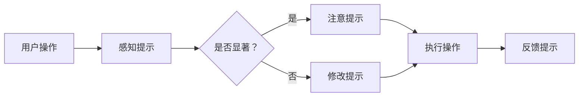
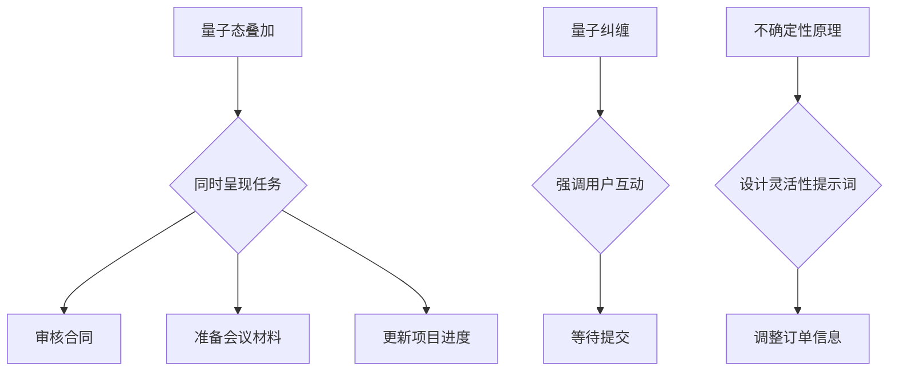
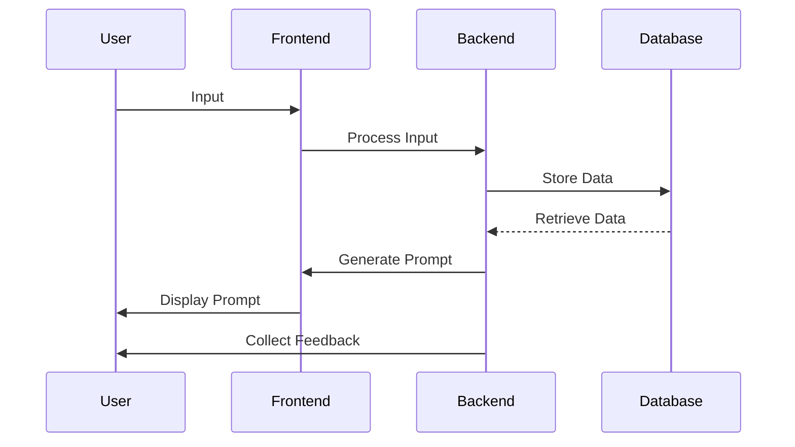
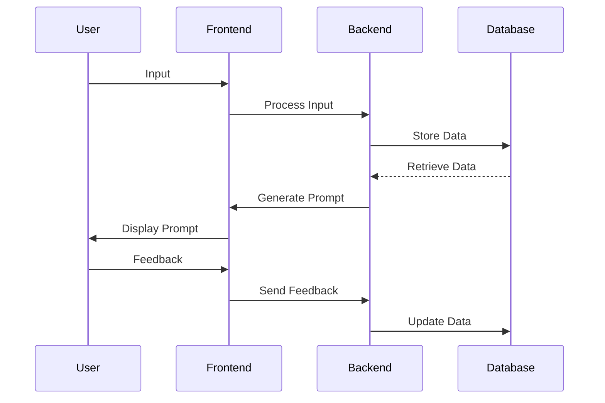
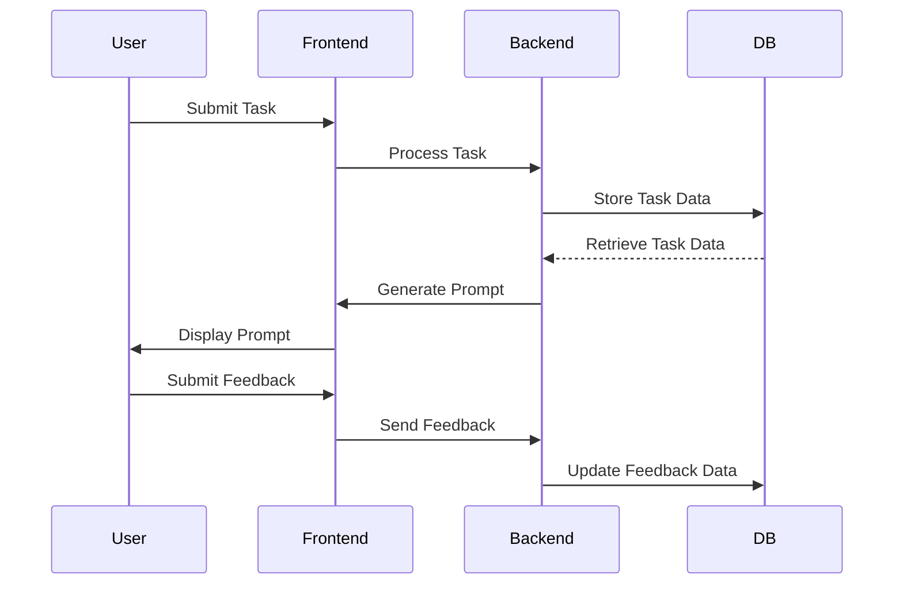

                 


**1.4 提示词设计概述**

提示词设计是指通过设计恰当的文字、符号或图像等元素，引导用户完成特定任务的过程。在设计提示词时，需要考虑用户的认知特性、语言习惯、文化背景等因素。有效的提示词设计可以提高用户的使用体验，降低用户的认知负担。

在用户界面设计领域，提示词通常分为以下几种类型：

1. **操作提示**：用于指导用户如何操作界面元素，例如“点击这里开始”。

2. **反馈提示**：用于告知用户操作结果，例如“成功保存”。

3. **错误提示**：用于提示用户在操作中可能出现的错误，例如“请填写必填项”。

4. **信息提示**：用于提供额外的信息，帮助用户更好地理解系统，例如“当前有5条未读消息”。

有效的提示词设计需要遵循以下原则：

1. **简洁明了**：提示词应尽可能简短，避免使用冗长的句子。

2. **直观易懂**：提示词应使用用户熟悉的语言和表达方式，避免使用专业术语。

3. **定位准确**：提示词应出现在用户需要时，避免提前或滞后出现。

4. **可定制性**：提示词应允许用户根据自己的需求和偏好进行调整。

**1.5 认知心理学与量子力学的基本概念**

**认知心理学**：
认知心理学研究人类在感知、注意、记忆、思维和语言等认知过程中如何处理信息。其主要研究内容包括：

- **感知**：如何通过感官接收和处理信息。

- **注意**：如何集中注意力处理特定的信息。

- **记忆**：如何存储和回忆信息。

- **思维**：如何进行推理、判断和问题解决。

- **语言**：如何理解和使用语言。

**量子力学**：
量子力学研究微观粒子的行为规律，特别是量子态的叠加和坍缩等特性。其主要研究内容包括：

- **量子态**：粒子处于多种状态的叠加。

- **测量**：测量过程如何影响量子态。

- **不确定性原理**：粒子的某些物理量不能同时被精确测量。

- **量子纠缠**：两个或多个粒子之间存在的一种特殊的关联关系。

**1.6 提示词设计中的认知心理学应用**

认知心理学在提示词设计中的应用主要体现在以下几个方面：

- **感知与注意**：通过设计吸引眼球的提示词，引导用户注意关键信息。

- **记忆**：设计易于记忆的提示词，帮助用户记住操作步骤。

- **思维与问题解决**：提供明确、具体的提示词，帮助用户快速解决问题。

- **语言理解**：使用用户熟悉的语言表达方式，确保用户能够准确理解提示词。

**1.7 提示词设计中的量子力学应用**

尽管量子力学在宏观世界中似乎与提示词设计无关，但在某些情况下，它为提示词设计提供了一种新的思路：

- **量子态叠加**：提示词可以设计成多种状态的叠加，满足不同用户的需求。

- **量子纠缠**：提示词设计可以考虑到用户之间的关联，提供个性化的提示。

- **不确定性原理**：提示词设计应允许用户在操作过程中具有一定的自由度，避免过于严格的规定。

通过上述背景介绍，我们可以看到，认知心理学和量子力学在提示词设计领域具有重要的作用。接下来，我们将进一步探讨这两个领域的核心概念及其之间的联系。在接下来的章节中，我们将详细分析这两个领域的核心概念，使用表格和ER图展示它们之间的关系，并逐步引入算法原理和系统设计等内容。****

### 第2章：核心概念与联系

#### 2.1 核心概念与联系

在本章中，我们将深入探讨提示词设计、认知心理学和量子力学这三个核心概念，并分析它们之间的联系。

**2.1.1 提示词设计**

提示词设计是用户界面设计中的一个重要组成部分，它旨在通过设计合适的文字、符号或图像等元素，引导用户顺利完成特定任务。有效的提示词设计需要考虑用户的认知特性、语言习惯、文化背景等因素。

- **定义**：提示词设计是指通过设计恰当的文字、符号或图像等元素，引导用户完成特定任务的过程。
- **应用**：在用户界面设计、人机交互、信息可视化等领域中，提示词设计发挥着关键作用。

**2.1.2 认知心理学**

认知心理学是研究人类思维过程的心理学科，主要关注人类如何获取、处理、存储和使用信息。认知心理学的研究内容包括感知、注意、记忆、思维和语言等。

- **定义**：认知心理学是研究人类思维过程的心理学科，主要关注人类如何获取、处理、存储和使用信息。
- **应用**：认知心理学在人类行为研究、教育、心理健康、人机交互等领域中具有重要应用。

**2.1.3 量子力学**

量子力学研究微观粒子的行为规律，特别是量子态的叠加和坍缩等特性。量子力学主要研究内容包括量子态、测量、不确定性原理和量子纠缠等。

- **定义**：量子力学是研究微观粒子的行为规律，特别是量子态的叠加和坍缩等特性的物理学分支。
- **应用**：量子力学在量子计算、量子通信、量子传感器等领域中具有重要应用。

**2.1.4 提示词设计、认知心理学与量子力学之间的联系**

1. **认知心理学在提示词设计中的应用**：
   - 认知心理学揭示了人类在感知、注意、记忆、思维和语言等认知过程中的规律，这些规律可以指导提示词设计，使其更加符合用户的认知习惯，提高用户的使用体验。
   - 例如，认知心理学研究发现，人类对短语的记忆效果较好，因此设计提示词时可以采用短语形式，而不是长句。

2. **量子力学在提示词设计中的应用**：
   - 虽然量子力学通常与宏观世界无关，但在某些方面，它为提示词设计提供了一种新的思考方式。例如，量子态的叠加和量子纠缠可以启发我们在提示词设计时考虑多维度信息，提高用户的理解和记忆效果。
   - 例如，在设计多步骤操作任务时，可以采用量子态叠加的方式，将多个操作步骤同时呈现给用户，提高用户的处理效率。

3. **交叉研究的方法**：
   - 交叉研究是认知心理学和量子力学在提示词设计领域相结合的一种重要方法。通过这种方法，我们可以将认知心理学的理论和量子力学的研究方法应用于提示词设计，从而创造出更高效、更人性化的提示词设计方案。
   - 例如，我们可以使用认知心理学中的注意力模型和量子力学中的量子计算模型，来优化提示词的呈现方式和顺序，提高用户的注意力和操作效率。

**2.1.5 对比表格与ER图**

为了更清晰地展示提示词设计、认知心理学和量子力学之间的联系，我们可以使用对比表格和ER图来表示。

1. **对比表格**：

| 特性              | 提示词设计     | 认知心理学       | 量子力学         |
|-----------------|--------------|---------------|---------------|
| 研究领域          | 用户界面设计   | 心理学         | 物理学         |
| 核心目标          | 提高用户体验   | 研究人类认知    | 描述微观粒子行为 |
| 主要方法          | 文字、符号、图像 | 实验研究、理论分析 | 数学模型、实验验证 |
| 关联领域          | 人机交互、信息可视化 | 心理学、神经科学 | 量子计算、量子通信 |

2. **ER图**：

```mermaid
erDiagram
    A[提示词设计] ||--|{ 认知心理学 } A
    A ||--|{ 量子力学 } A
    B[用户界面设计] ..|> A
    C[人机交互] ..|> A
    D[信息可视化] ..|> A
```

通过对比表格和ER图，我们可以看到，提示词设计、认知心理学和量子力学之间存在密切的联系。这些联系为我们进行交叉研究提供了丰富的理论基础和实践指导。

在接下来的章节中，我们将进一步探讨提示词设计的认知心理学原理，以及量子力学在提示词设计中的应用，帮助读者更深入地理解这两个领域如何相互促进，共同推动提示词设计的进步。

---

**2.2 认知心理学与量子力学的对比分析**

在深入探讨提示词设计、认知心理学和量子力学之间的关系后，我们需要进一步分析这两个领域的核心概念、特性以及它们在实际应用中的对比。

**2.2.1 核心概念对比**

1. **认知心理学**：

   - **概念**：认知心理学是研究人类心理过程的一个分支，关注的是人们如何感知、思考、学习、记忆和解决问题。
   - **特性**：认知心理学侧重于定量分析，研究人类在各种认知任务中的表现，如记忆、注意、决策和问题解决等。

2. **量子力学**：

   - **概念**：量子力学是研究微观世界物理现象的物理学分支，涉及原子、分子、电子和其他亚原子粒子的行为。
   - **特性**：量子力学以数学模型为基础，强调量子态的叠加性和量子纠缠现象，例如不确定性原理和量子隧道效应。

**2.2.2 对比表格**

下面是认知心理学与量子力学的一些核心概念和特性的对比表格：

| 对比项           | 认知心理学                       | 量子力学                      |
|----------------|-------------------------------|-----------------------------|
| 研究对象         | 人的认知过程                   | 微观粒子的行为               |
| 研究方法         | 实验研究、认知建模、问卷调查   | 数学建模、量子计算模拟、实验验证 |
| 核心现象         | 注意力、记忆、决策、学习       | 量子态叠加、量子纠缠、不确定性原理 |
| 应用领域         | 心理学、神经科学、人机交互     | 量子计算、量子通信、量子传感器  |

**2.2.3 ER实体关系图**

为了更直观地展示认知心理学与量子力学之间的关系，我们可以使用ER图来表示它们在提示词设计中的应用。

```mermaid
erDiagram
    A[认知心理学] ||--|{ 提示词设计 } A
    B[量子力学] ||--|{ 提示词设计 } B
    C[人机交互] ..|> A
    D[用户界面设计] ..|> A
    E[量子计算] ..|> B
    F[量子通信] ..|> B
```

在这张ER图中，认知心理学和量子力学都直接关联到提示词设计，而人机交互和用户界面设计则是提示词设计的具体应用场景。量子计算和量子通信则是量子力学在提示词设计领域中的潜在应用方向。

**2.2.4 总结**

通过对比分析，我们可以看到，认知心理学和量子力学虽然源自不同的学科领域，但它们在提示词设计领域都发挥着重要作用。认知心理学提供了关于人类认知过程的基本原理，而量子力学则提供了一种全新的思考方式，这两种学科的结合为提示词设计带来了新的研究方向和可能性。

在接下来的章节中，我们将深入探讨如何将认知心理学的原理应用于提示词设计，以及量子力学如何影响提示词设计的算法原理。这些内容将帮助我们更全面地理解提示词设计的跨学科特性。

---

**2.3 提示词设计的认知心理学原理**

在深入探讨提示词设计的认知心理学原理之前，我们首先需要了解认知心理学的几个核心概念和原理。认知心理学关注人类如何感知、注意、记忆、思考和解决问题。以下是一些关键概念：

1. **感知**：人类如何通过感官接收外部信息。
2. **注意**：人类如何选择性地关注某些信息，而忽略其他信息。
3. **记忆**：人类如何存储、保留和使用信息。
4. **思维**：人类如何进行推理、决策和解决问题。
5. **语言**：人类如何理解和使用语言进行交流。

**2.3.1 提示词设计中的感知原理**

感知是认知过程的起点。在设计提示词时，需要考虑用户如何感知提示信息。以下是一些感知原理：

- **显著性**：设计显著性的提示词可以吸引用户的注意力。例如，使用大号字体或突出颜色。
- **对比度**：通过增加对比度，可以使提示词与其他界面元素区分开来。例如，使用黑底白字。
- **位置**：提示词的位置对用户的感知也有很大影响。通常，用户首先关注的是屏幕中央或顶部的内容。

**2.3.2 提示词设计中的注意原理**

注意是用户处理信息的关键环节。以下是一些关于注意的原理：

- **选择注意**：用户通常只能处理有限的信息，选择注意可以帮助用户优先关注重要信息。例如，使用明确的标题或指示性图标。
- **分配注意**：用户在完成任务时，需要注意分配到不同的任务元素上。良好的提示词设计应帮助用户合理分配注意力。

**2.3.3 提示词设计中的记忆原理**

记忆是用户操作和完成任务的基础。以下是一些与记忆相关的原理：

- **组块化**：将信息分组，以便用户更容易记忆。例如，将多个提示词组织成一个列表。
- **重复**：通过重复提示词，可以帮助用户巩固记忆。例如，在用户操作过程中多次显示相同或类似的提示。
- **情感**：与用户情感相关的提示词更容易被记住。例如，使用积极或有趣的词汇。

**2.3.4 提示词设计中的思维原理**

思维是用户解决问题的过程。以下是一些关于思维的原理：

- **结构化**：提示词设计应提供清晰的结构，帮助用户理解任务的步骤和逻辑。
- **引导**：通过提示词引导用户思考，帮助他们解决问题。例如，使用“接下来做什么？”这样的提示。
- **反馈**：提供及时的反馈，帮助用户确认自己的操作是否正确。例如，在用户操作后显示“操作成功”或“操作失败”的信息。

**2.3.5 提示词设计中的语言原理**

语言是交流和信息传递的工具。以下是一些与语言相关的原理：

- **简洁性**：提示词应简洁明了，避免使用复杂的句子或术语。
- **一致性**：提示词应保持一致性，以便用户形成稳定的认知模式。
- **本地化**：考虑用户的文化背景和语言习惯，确保提示词适用于不同地区和用户群体。

**2.3.6 实际应用**

以下是几个实际应用案例，展示如何将认知心理学原理应用于提示词设计：

- **案例1**：在一个电子商务网站上，提示词“立即下单”比“购买商品”更能激发用户的购买欲望，因为它更简洁、直接，符合用户的心理预期。
- **案例2**：在复杂的多步骤操作中，使用“下一步”和“返回上一步”这样的提示词，可以帮助用户清晰地理解任务的流程和方向。
- **案例3**：在设置新密码时，提示用户“请再次输入新密码以确认”，通过重复提示词增强用户的记忆，降低密码设置错误的风险。

通过上述分析，我们可以看到，认知心理学在提示词设计中的应用是多方面的，涉及感知、注意、记忆、思维和语言等多个方面。这些原理不仅帮助我们设计出更有效的提示词，还能够提升用户的使用体验和满意度。在接下来的章节中，我们将进一步探讨量子力学在提示词设计中的应用，为这一跨学科的研究提供更多的理论基础和实践指导。

---

**2.4 量子力学在提示词设计中的应用**

量子力学的概念虽然在宏观世界中并不常见，但在提示词设计中，它提供了一些独特且有趣的视角。量子力学中的量子态叠加和量子纠缠等原理，可以启发我们在提示词设计中考虑更复杂的信息处理方式。以下是我们如何将量子力学应用于提示词设计的详细讨论。

**2.4.1 量子态叠加在提示词设计中的应用**

量子态叠加是量子力学中的一个核心概念，意味着一个量子系统可以同时存在于多个状态中。这一原理可以启发我们在提示词设计中考虑如何同时呈现多个相关提示，从而提高用户的理解和记忆效果。

- **同时呈现**：在复杂任务中，用户需要理解多个步骤或信息。通过量子态叠加的方式，我们可以设计一个提示词同时包含多个步骤或信息。例如：“请输入用户名和密码以完成登录。”
- **多步骤任务**：对于多步骤任务，我们可以设计一个叠加的提示词，将其分解成多个子步骤。例如：“请先选择国家，然后填写用户名和密码。”这种设计可以减轻用户的认知负担，提高任务完成效率。

**2.4.2 量子纠缠在提示词设计中的应用**

量子纠缠是量子力学中另一个重要概念，意味着两个或多个粒子之间存在一种特殊的关联关系。这一原理可以启发我们在提示词设计中考虑用户之间的互动和信息传递。

- **用户互动**：在多人参与的任务中，我们可以设计一些提示词，强调用户之间的关联和互动。例如：“请与你的队友确认订单信息，以确保准确无误。”
- **信息传递**：在需要传递关键信息的场景中，我们可以设计一些提示词，强调信息的传递和共享。例如：“请将密码共享给团队成员以共同完成任务。”

**2.4.3 量子力学与认知心理学的结合**

量子力学与认知心理学的结合可以为我们提供一种新的设计思路，使提示词设计更加灵活和高效。以下是一些结合的实例：

- **增强记忆**：通过量子态叠加，我们可以设计一个包含多个信息的提示词，帮助用户同时记住多个关键信息。例如：“请记住，今天是你的生日，同时是你的项目提交截止日期。”
- **引导注意**：通过量子纠缠，我们可以设计一个提示词，强调用户之间的互动和信息传递。例如：“请注意，你的好友请求加入你的任务群组。”
- **提升体验**：通过将量子力学原理应用于提示词设计，我们可以创造出更具创新性和人性化的用户体验。例如：“你的任务进度已达到量子跃迁状态，恭喜你即将完成任务。”

**2.4.4 量子力学在提示词设计中的挑战与机遇**

尽管量子力学在提示词设计中有许多潜在的应用，但也存在一些挑战和机遇。

- **挑战**：量子力学的一些原理，如量子态叠加和量子纠缠，可能在日常生活中难以直观理解和应用。因此，我们需要找到合适的表达方式和设计方法，使这些原理能够被用户接受和理解。
- **机遇**：量子力学为提示词设计提供了一种全新的思考方式，可以激发我们的创造力，设计出更高效、更具创新性的提示词方案。

**2.4.5 实际应用案例**

以下是几个实际应用案例，展示了如何将量子力学原理应用于提示词设计：

- **案例1**：在一个多人在线游戏中，我们可以设计一个提示词：“你的队友正在量子传输中，等待他们的加入。”这个提示词利用了量子纠缠的概念，增强了用户之间的互动和期待感。
- **案例2**：在一个复杂的流程管理系统中，我们可以设计一个提示词：“您的任务已达到量子态叠加状态，多个步骤同时进行中。”这个提示词利用了量子态叠加的概念，帮助用户理解任务的多步骤处理。

通过上述讨论，我们可以看到，量子力学在提示词设计中的应用为传统的设计方法带来了新的视角和可能性。尽管面临一定的挑战，但通过创新和探索，我们可以将量子力学原理融入到提示词设计中，创造出更高效、更人性化的用户体验。

在接下来的章节中，我们将继续探讨如何将认知心理学和量子力学原理应用于具体的系统设计与项目实战，为读者提供更全面的技术指南和实际应用案例。

---

### 第3章：提示词设计的认知心理学原理

#### 3.1 认知心理学的概念与原理

认知心理学是研究人类认知过程的心理学科，主要关注人类如何获取、处理、存储和使用信息。在提示词设计中，认知心理学的原理可以帮助我们设计出更加符合用户认知习惯、提高用户使用体验的提示词。以下是一些关键的概念和原理：

1. **感知**：感知是人类通过感官接收外界信息的过程。在提示词设计中，感知原理关注的是如何设计出显著且易于理解的提示词。以下是一些具体的应用：

   - **显著性**：显著性的提示词更容易被用户注意到。例如，使用大号字体、鲜艳的颜色或独特的图标来突出重要信息。
   - **对比度**：通过增加对比度，可以使提示词与背景或其他界面元素区分开来。例如，使用黑底白字来增强提示词的可读性。

2. **注意**：注意是用户在处理信息时选择性地关注某些信息而忽略其他信息的能力。在提示词设计中，注意原理关注的是如何引导用户的注意力：

   - **选择注意**：设计提示词时，应该明确用户需要关注的重点，使用突出或简明的表达方式。
   - **分配注意**：在复杂界面中，提示词应帮助用户合理分配注意力，避免注意力过度分散。

3. **记忆**：记忆是用户存储和回忆信息的能力。在提示词设计中，记忆原理关注的是如何设计易于记忆的提示词：

   - **组块化**：将多个提示词组织成一个列表或分组，帮助用户记忆。例如，将操作步骤分组，便于用户理解和记忆。
   - **重复**：通过重复提示词，可以帮助用户巩固记忆。例如，在用户操作过程中多次显示相同或类似的提示。

4. **思维**：思维是用户在解决问题和做出决策时进行推理和判断的过程。在提示词设计中，思维原理关注的是如何引导用户思考和解决问题：

   - **结构化**：提供清晰的结构，帮助用户理解任务的步骤和逻辑。例如，使用步骤提示词或流程图来引导用户。
   - **引导**：通过提示词引导用户思考，帮助他们解决问题。例如，使用“接下来做什么？”这样的提示来引导用户。

5. **语言**：语言是用户理解和传达信息的重要工具。在提示词设计中，语言原理关注的是如何使用易于理解的语言表达提示词：

   - **简洁性**：避免使用复杂的句子或术语，确保提示词简洁明了。
   - **一致性**：保持提示词的一致性，以便用户形成稳定的认知模式。
   - **本地化**：考虑用户的文化背景和语言习惯，确保提示词适用于不同地区和用户群体。

#### 3.2 提示词设计的认知心理学应用

认知心理学的原理在提示词设计中有着广泛的应用。以下是一些具体的实例：

- **案例1**：在设计一个在线购物网站时，我们可以使用认知心理学的显著性原理。例如，在商品列表中，使用大号字体和鲜艳的颜色来突出“促销商品”，吸引用户的注意力。
- **案例2**：在一个复杂的软件操作界面中，我们可以使用认知心理学的注意原理。例如，在设计菜单时，使用不同的图标和颜色来区分不同的功能，帮助用户快速找到所需操作。
- **案例3**：在设计一个学习平台时，我们可以使用认知心理学的记忆原理。例如，在课程列表中，使用组块化方法，将相关课程分组，便于用户记忆和理解。
- **案例4**：在设计一个医疗信息系统时，我们可以使用认知心理学的思维原理。例如，在诊断流程中，使用结构化提示词和步骤图，帮助医护人员清晰理解诊断步骤。
- **案例5**：在设计一个金融交易软件时，我们可以使用认知心理学的语言原理。例如，使用简洁明了的提示词，如“买入”、“卖出”，确保用户能够快速理解操作指令。

#### 3.3 使用mermaid流程图和Python源代码阐述

为了更好地理解认知心理学原理在提示词设计中的应用，我们可以使用mermaid流程图和Python源代码来阐述具体的算法原理和实现步骤。

**3.3.1 使用mermaid流程图**

以下是一个使用mermaid流程图来表示提示词设计过程的示例：



在这个流程图中，用户首先进行操作，系统根据用户的操作生成感知提示。然后，系统评估提示的显著性，如果是显著的，系统直接注意提示并执行操作；否则，系统修改提示并再次评估显著性，直到生成显著的提示为止。最后，系统提供反馈提示，告知用户操作结果。

**3.3.2 使用Python源代码**

以下是一个简单的Python示例，展示如何生成和显示提示词：

```python
import random

def generate_prompt(action, significant=True):
    """
    生成提示词
    :param action: 用户操作
    :param significant: 提示词是否显著
    :return: 提示词
    """
    if significant:
        return f"请注意，您的{action}操作已开始。"
    else:
        return f"您的{action}操作提示不显著，请调整提示词。"

def main():
    action = "登录"
    significant = random.choice([True, False])
    prompt = generate_prompt(action, significant)
    print(prompt)

if __name__ == "__main__":
    main()
```

在这个示例中，我们定义了一个`generate_prompt`函数，根据用户的操作和提示词的显著性生成相应的提示词。在`main`函数中，我们随机生成一个显著性的布尔值，然后调用`generate_prompt`函数生成提示词并打印出来。

通过mermaid流程图和Python源代码，我们可以直观地展示和实现认知心理学原理在提示词设计中的应用。这些工具和方法不仅帮助我们理解理论，还能在实践中指导我们的设计过程。

在接下来的章节中，我们将进一步探讨量子力学在提示词设计中的应用，以及如何将量子力学与认知心理学结合，为提示词设计带来更多创新和可能性。

---

#### 3.4 量子力学在提示词设计中的应用

量子力学作为研究微观世界的物理学分支，其独特原理如量子态叠加和量子纠缠，为提示词设计带来了新的视角和可能性。虽然量子力学与日常生活的直观体验相差甚远，但通过抽象和模拟，我们可以将量子力学的概念应用于提示词设计，创造出更高效、更具创新性的用户体验。

**3.4.1 量子态叠加在提示词设计中的应用**

量子态叠加是指一个量子系统可以同时存在于多个状态中。在提示词设计中，我们可以利用这一原理，设计出同时包含多个信息的提示词，从而提高用户的理解和记忆效果。

- **同时呈现**：例如，在一个复杂的任务中，用户需要同时关注多个步骤。我们可以设计一个叠加的提示词，如：“请同时输入用户名和密码，然后点击‘登录’按钮。”这种设计可以帮助用户同时处理多个任务步骤，降低认知负担。
- **多步骤任务**：在多步骤任务中，我们可以使用量子态叠加来同时呈现多个子步骤。例如，设计一个提示词：“请先确认订单信息，然后选择支付方式，最后点击‘提交’按钮。”这种设计可以直观地展示任务的全流程，帮助用户更好地理解任务结构。

**3.4.2 量子纠缠在提示词设计中的应用**

量子纠缠是指两个或多个粒子之间存在的一种特殊关联关系，即使它们相隔很远，一个粒子的状态也会影响另一个粒子的状态。在提示词设计中，我们可以利用量子纠缠来设计用户之间互动和信息传递的提示词。

- **用户互动**：例如，在一个团队协作任务中，我们可以设计一个提示词：“您的队友正在编辑文档，请等待他们的提交。”这个提示词利用量子纠缠的概念，强调用户之间的关联和互动，增强任务的协作性。
- **信息传递**：在需要用户之间传递关键信息的场景中，我们可以设计一个提示词：“请将您的方案与团队成员共享，以便共同讨论。”这种设计可以有效地促进信息在团队中的传递和共享。

**3.4.3 量子力学与认知心理学的结合**

将量子力学与认知心理学结合，可以为提示词设计提供新的思路和方法。以下是一些具体的结合实例：

- **增强记忆**：通过量子态叠加，我们可以设计一个包含多个信息的提示词，帮助用户同时记住多个关键信息。例如：“请记住，今天是您的生日，同时也是您的项目提交截止日期。”这种设计可以通过量子态叠加的方式，提高用户的记忆效果。
- **引导注意**：通过量子纠缠，我们可以设计一个提示词，强调用户之间的互动和信息传递。例如：“请注意，您的好友请求加入您的任务群组。”这种设计可以有效地引导用户的注意力，提高任务的完成效率。
- **提升体验**：将量子力学原理应用于提示词设计，可以创造出更具创新性和人性化的用户体验。例如，在一个多人在线游戏中，我们可以设计一个提示词：“您的队友正在量子传输中，等待他们的加入。”这种设计不仅增加了游戏的趣味性，还增强了用户的互动体验。

**3.4.4 量子力学在提示词设计中的挑战与机遇**

尽管量子力学为提示词设计提供了丰富的灵感，但在实际应用中也面临一些挑战和机遇。

- **挑战**：量子力学的概念在日常生活中相对陌生，用户可能难以理解量子态叠加和量子纠缠等原理。因此，我们需要找到合适的表达方式和设计方法，使这些原理能够被用户接受和理解。
- **机遇**：量子力学为提示词设计提供了新的视角和方法，可以激发我们的创造力，设计出更高效、更具创新性的提示词方案。通过探索和应用量子力学原理，我们可以创造出独特的用户体验，提升用户满意度和忠诚度。

通过上述讨论，我们可以看到，量子力学在提示词设计中的应用具有巨大的潜力。通过将量子力学的原理与认知心理学结合，我们可以创造出更加高效、人性化的提示词设计方案，为用户带来更好的使用体验。在接下来的章节中，我们将进一步探讨如何将量子力学原理应用于具体的系统设计与项目实战，为读者提供更全面的技术指南和实际应用案例。

---

#### 3.5 数学模型和公式讲解

为了更深入地理解量子力学和认知心理学在提示词设计中的应用，我们可以借助数学模型和公式进行详细讲解。以下是一些关键的概念和公式：

**3.5.1 量子态叠加**

量子态叠加是量子力学中的一个核心概念，表示一个量子系统可以同时存在于多个状态中。一个量子态可以表示为多个基态的线性组合。以下是一个简单的量子态叠加公式：

$$|\psi\rangle = a_0|\psi_0\rangle + a_1|\psi_1\rangle + a_2|\psi_2\rangle + \ldots$$

其中，$|\psi\rangle$表示系统的总态，$|\psi_0\rangle$、$|\psi_1\rangle$、$|\psi_2\rangle$等表示不同的基态，$a_0$、$a_1$、$a_2$等是叠加系数，它们的平方模的平方和为1，即：

$$|a_0|^2 + |a_1|^2 + |a_2|^2 + \ldots = 1$$

在提示词设计中，我们可以将量子态叠加应用于同时呈现多个信息。例如，设计一个提示词：

“请同时关注以下事项：检查订单信息，确认配送地址，选择支付方式。”

这个提示词通过量子态叠加的方式，同时向用户传达了三个关键步骤。

**3.5.2 量子纠缠**

量子纠缠是另一个重要的量子力学概念，描述两个或多个粒子之间存在的一种特殊的关联关系。当两个粒子发生纠缠后，一个粒子的状态会立即影响另一个粒子的状态，即使它们相隔很远。以下是一个简单的量子纠缠态公式：

$$|\psi_{AB}\rangle = \frac{1}{\sqrt{2}}(|01\rangle + |10\rangle)$$

在这个公式中，$|\psi_{AB}\rangle$表示两个粒子A和B的纠缠态，$|01\rangle$和$|10\rangle$表示两个粒子的状态。

在提示词设计中，我们可以利用量子纠缠来设计用户之间互动和信息传递的提示词。例如，设计一个提示词：

“您的队友正在编辑文档，请等待他们的提交。”

这个提示词利用量子纠缠的概念，强调了用户之间的互动和信息传递，增强了任务的协作性。

**3.5.3 海森堡不确定性原理**

海森堡不确定性原理是量子力学中的一个重要原理，描述了粒子的某些物理量（如位置和动量）不能同时被精确测量。以下是不确定性原理的一个简单公式：

$$\Delta x \Delta p \geq \frac{\hbar}{2}$$

其中，$\Delta x$表示位置的不确定性，$\Delta p$表示动量的不确定性，$\hbar$是约化普朗克常数。

在提示词设计中，我们可以利用不确定性原理来设计具有灵活性和不确定性的提示词，例如：

“请根据您的需求调整订单信息，我们将在短时间内进行处理。”

这个提示词利用不确定性原理的概念，向用户传达了操作的灵活性和不确定性的信息，使用户感到更加舒适和自由。

**3.5.4 应用示例**

以下是一个应用量子力学和认知心理学原理的示例：

假设我们设计一个任务管理系统，用户需要完成三个步骤：提交任务描述、分配任务给团队成员、确认任务进度。

我们可以设计一个提示词：

“您的任务已进入量子态叠加状态，请依次完成以下步骤：提交任务描述（叠加态），分配任务给团队成员（叠加态），确认任务进度（叠加态）。您的任务状态将实时更新。”

这个提示词利用量子态叠加和认知心理学的记忆原理，同时向用户传达了多个步骤的信息，帮助用户更好地理解和记忆任务流程。

通过上述数学模型和公式的讲解，我们可以看到量子力学和认知心理学在提示词设计中的应用是如何通过数学方法来实现的。这些原理和方法不仅丰富了提示词设计的理论基础，还为实际应用提供了指导。在接下来的章节中，我们将继续探讨如何将这些理论应用于具体的系统设计和项目实战。

---

### 第4章：量子力学在提示词设计中的应用

#### 4.1 量子力学的概念与原理

量子力学是一门研究微观世界物理现象的学科，其基本原理与传统物理学有显著不同。量子力学主要涉及以下核心概念和原理：

1. **量子态**：量子态是描述量子系统状态的数学函数，通常用波函数表示。量子态可以处于叠加态，即多个状态的线性组合。

   $$|\psi\rangle = c_0|\psi_0\rangle + c_1|\psi_1\rangle + c_2|\psi_2\rangle + \ldots$$

   其中，$|\psi\rangle$是系统的总态，$|\psi_0\rangle$、$|\psi_1\rangle$、$|\psi_2\rangle$等是不同的基态，$c_0$、$c_1$、$c_2$等是叠加系数。

2. **量子纠缠**：量子纠缠是两个或多个粒子之间的一种特殊关联关系，即使它们相隔很远，一个粒子的状态也会立即影响另一个粒子的状态。量子纠缠态可以用贝尔态表示：

   $$|\psi_{AB}\rangle = \frac{1}{\sqrt{2}}(|01\rangle + |10\rangle)$$

3. **不确定性原理**：海森堡不确定性原理描述了粒子的某些物理量（如位置和动量）不能同时被精确测量。其数学表达式为：

   $$\Delta x \Delta p \geq \frac{\hbar}{2}$$

4. **量子计算**：量子计算利用量子位（qubit）进行计算，能够解决传统计算机无法处理的问题。量子计算的核心原理是量子叠加和量子纠缠。

**4.2 量子力学在提示词设计中的应用**

尽管量子力学主要应用于微观物理领域，但其原理可以启发我们在提示词设计中创造新的方法和思路。以下是一些具体的应用：

1. **量子态叠加**：在提示词设计中，量子态叠加可以用于同时呈现多个信息，帮助用户更好地理解和处理复杂的任务。例如：

   “请同时完成以下任务：审核合同，准备会议材料，更新项目进度。”

   这个提示词利用量子态叠加原理，将三个任务同时呈现给用户，降低了用户的认知负担。

2. **量子纠缠**：量子纠缠可以用于强调用户之间的互动和信息传递。例如：

   “您的团队成员正在修改文档，请等待他们的提交。”

   这个提示词利用量子纠缠的概念，强调了用户之间的关联和依赖，增强了任务的协作性。

3. **不确定性原理**：量子力学的不确定性原理可以用于设计具有不确定性和灵活性的提示词，例如：

   “请根据需求调整订单信息，我们将在短时间内进行处理。”

   这个提示词利用不确定性原理，向用户传达了操作的灵活性和不确定性，使用户感到更加舒适和自由。

**4.3 使用mermaid流程图和Python源代码阐述**

为了更好地理解量子力学原理在提示词设计中的应用，我们可以使用mermaid流程图和Python源代码进行阐述。

**4.3.1 使用mermaid流程图**

以下是一个使用mermaid流程图来表示量子力学原理在提示词设计中的应用的示例：



在这个流程图中，我们首先介绍量子态叠加、量子纠缠和不确定性原理的概念。然后，我们将这些原理应用于提示词设计，例如同时呈现多个任务、强调用户互动和设计灵活性提示词。

**4.3.2 使用Python源代码**

以下是一个简单的Python示例，展示如何使用量子态叠加和量子纠缠原理设计提示词：

```python
import random

def quantum_prompt(task_list):
    """
    生成一个量子力学原理的提示词
    :param task_list: 任务列表
    :return: 提示词
    """
    # 使用量子态叠加原理，将任务同时呈现
    task_string = "请同时完成以下任务："
    for task in task_list:
        task_string += f"{task}，"
    task_string = task_string.rstrip("，") + "。"
    
    # 使用量子纠缠原理，强调任务之间的互动
    if random.choice([True, False]):
        task_string += "您的任务之间存在紧密的关联，请确保协同完成。"
    
    return task_string

# 示例任务列表
tasks = ["审核合同", "准备会议材料", "更新项目进度"]

# 生成提示词
prompt = quantum_prompt(tasks)
print(prompt)
```

在这个示例中，我们定义了一个`quantum_prompt`函数，它根据任务列表生成一个量子力学原理的提示词。首先，我们使用量子态叠加原理，将任务同时呈现给用户。然后，我们使用量子纠缠原理，随机决定是否在提示词中强调任务之间的互动。

通过mermaid流程图和Python源代码，我们可以直观地展示量子力学原理在提示词设计中的应用。这些工具和方法不仅帮助我们理解理论，还能在实践中指导我们的设计过程。在接下来的章节中，我们将继续探讨量子力学与认知心理学的结合，以及如何在具体的系统设计与项目实战中应用这些原理。

---

### 第5章：系统分析与架构设计

#### 5.1 问题场景介绍

在现代社会中，提示词设计在各个领域都扮演着重要角色，从用户界面设计到人机交互，再到信息可视化，都是不可或缺的一部分。随着人工智能和量子计算的发展，提示词设计逐渐融入了新的元素和技术。本章节将介绍一个基于量子力学和认知心理学原理的提示词设计系统，旨在提高用户交互体验和系统效率。

**问题场景**：设计一个智能提示词生成系统，该系统能够根据用户的操作历史、认知特性以及实时交互情况，动态生成个性化的提示词。系统需要结合量子力学和认知心理学的原理，实现高效的提示词生成和用户交互。

#### 5.2 项目介绍

**项目名称**：量子认知提示词生成系统（Quantum Cognitive Prompt Generation System，QCGPS）

**项目目标**：开发一个智能提示词生成系统，通过结合量子力学和认知心理学的原理，提高提示词的个性化和有效性，从而提升用户交互体验。

**项目范围**：本项目的范围包括系统需求分析、架构设计、核心算法实现、用户界面设计以及系统测试与部署。特别关注量子态叠加和量子纠缠在提示词生成中的应用，以及认知心理学原理在提示词设计中的实际效果。

#### 5.3 系统功能设计

**功能概述**：
量子认知提示词生成系统的主要功能包括：

1. **用户行为分析**：收集并分析用户的操作历史，了解用户的偏好和习惯。
2. **认知特性识别**：利用认知心理学原理，识别用户的认知风格和认知负荷。
3. **动态提示词生成**：基于用户行为和认知特性，动态生成个性化的提示词。
4. **交互反馈机制**：实时收集用户对提示词的反馈，优化提示词生成策略。

**功能详细说明**：

1. **用户行为分析**：
   - **数据收集**：通过日志文件、用户操作记录等手段收集用户行为数据。
   - **数据分析**：使用机器学习算法分析用户行为，提取关键特征。

2. **认知特性识别**：
   - **认知风格识别**：利用认知心理学模型，识别用户的认知风格，如场独立、场依赖等。
   - **认知负荷评估**：根据用户操作的时间、频率等指标，评估用户的认知负荷。

3. **动态提示词生成**：
   - **个性化提示词生成**：结合用户行为和认知特性，生成个性化的提示词。
   - **量子态叠加应用**：利用量子态叠加原理，同时呈现多个提示信息，降低用户认知负担。

4. **交互反馈机制**：
   - **实时反馈收集**：在用户与系统交互过程中，收集用户对提示词的反馈。
   - **反馈分析**：分析用户反馈，优化提示词生成策略，提高用户满意度。

#### 5.4 系统架构设计

**架构概述**：
量子认知提示词生成系统采用分层架构设计，分为数据层、算法层和表现层。

**架构详细说明**：

1. **数据层**：
   - **数据存储**：使用数据库存储用户行为数据、认知特性数据和提示词生成记录。
   - **数据接口**：提供数据查询和更新接口，供算法层使用。

2. **算法层**：
   - **用户行为分析模块**：使用机器学习算法分析用户行为数据，提取关键特征。
   - **认知特性识别模块**：利用认知心理学模型识别用户的认知风格和认知负荷。
   - **提示词生成模块**：结合用户行为和认知特性，生成个性化的提示词。

3. **表现层**：
   - **前端展示**：设计用户友好的界面，展示提示词和用户交互结果。
   - **后端接口**：提供与数据层和算法层的接口，实现数据的传输和处理。

**架构图**：



在这个架构图中，用户通过前端界面与系统交互，前端将用户输入传递给后端处理。后端通过数据层访问数据库，分析用户行为和认知特性，生成个性化的提示词并返回给前端。前端将提示词展示给用户，并收集用户的反馈，传递给后端进行处理。

#### 5.5 系统接口设计

**接口概述**：
系统接口设计主要包括前后端接口和数据层接口。

**接口详细说明**：

1. **前后端接口**：
   - **API接口**：设计RESTful API，提供数据提交、提示词生成、用户反馈等功能。
   - **数据格式**：使用JSON格式传输数据，保证数据的结构化和可读性。

2. **数据层接口**：
   - **数据库操作接口**：提供数据库查询、插入、更新等操作接口。
   - **数据缓存接口**：提供数据缓存操作接口，提高系统性能。

**接口示例**：

1. **生成提示词接口**：

   ```json
   POST /api/prompt/generate
   {
       "userId": "12345",
       "task": "edit_document"
   }
   
   {
       "prompt": "您的文档已进入编辑状态，请仔细审阅并进行修改。",
       "status": "success"
   }
   ```

2. **用户反馈接口**：

   ```json
   POST /api/feedback/submit
   {
       "userId": "12345",
       "promptId": "67890",
       "rating": 4
   }
   
   {
       "status": "success",
       "message": "反馈已提交，感谢您的评价。"
   }
   ```

#### 5.6 系统交互

**交互概述**：
系统交互主要涉及用户与前端界面、前端与后端接口、后端与数据层的交互。

**交互详细说明**：

1. **用户与前端交互**：
   - 用户通过前端界面进行操作，如提交任务、查看提示词等。
   - 前端界面根据用户操作，调用相应的API接口，与后端进行交互。

2. **前端与后端交互**：
   - 前端将用户操作数据（如用户ID、任务名称等）传递给后端。
   - 后端处理用户操作数据，生成提示词，并将结果返回给前端。

3. **后端与数据层交互**：
   - 后端通过数据库操作接口，读取和写入用户行为数据和提示词生成记录。
   - 数据缓存接口用于提高系统性能，减少数据库访问次数。

**交互流程图**：



在这个交互流程图中，用户通过前端界面与系统进行交互。前端将用户输入传递给后端，后端处理用户输入并生成提示词，再将结果返回给前端，前端将提示词展示给用户。用户通过前端界面提交反馈，后端处理反馈并更新数据。

通过上述系统分析与架构设计，我们可以看到量子认知提示词生成系统的整体设计和实现思路。在接下来的章节中，我们将详细介绍如何在实际项目中实现这个系统，包括环境安装、核心算法实现、用户界面设计以及系统测试与部署。

---

### 第6章：系统交互与流程图

**6.1 系统交互介绍**

系统交互是确保用户与提示词生成系统之间顺畅沟通的关键环节。量子认知提示词生成系统的交互过程主要包括以下几个步骤：

1. **用户输入**：用户通过前端界面提交操作任务，如编辑文档、提交报告等。前端界面将用户操作数据（如用户ID、任务名称等）传递给后端系统。

2. **数据预处理**：后端系统接收用户输入数据后，进行预处理。预处理步骤包括数据校验、去重和格式转换等。

3. **提示词生成**：后端系统根据用户输入数据，调用提示词生成算法，结合用户的操作历史和认知特性，动态生成个性化的提示词。

4. **反馈处理**：用户对生成的提示词进行操作，并在前端界面提交反馈。后端系统接收到用户的反馈后，进行相应的数据更新和处理。

**6.2 使用mermaid序列图展示**

以下是一个使用mermaid序列图来展示系统交互过程的示例：



在这个序列图中，用户通过前端界面提交任务，前端将任务数据传递给后端。后端处理任务数据，并从数据库中检索相关任务数据，生成提示词后返回给前端，前端再将提示词展示给用户。用户提交反馈后，前端将反馈数据传递给后端，后端更新数据库中的反馈数据。

**6.3 系统流程图**

为了更全面地理解系统的运行流程，我们可以绘制一个系统流程图。以下是一个使用mermaid流程图来展示系统整体流程的示例：


在这个流程图中，用户提交任务后，系统进行数据预处理，调用提示词生成算法，生成提示词并显示给用户。用户对提示词进行操作后提交反馈，系统处理反馈并更新数据库。

通过上述系统交互介绍和流程图的展示，我们可以清楚地看到量子认知提示词生成系统的运行过程和交互环节。在接下来的章节中，我们将详细介绍如何实现这一系统的核心功能，包括环境安装、核心算法实现和用户界面设计等。

---

### 第7章：项目实战

**7.1 环境安装**

为了实现量子认知提示词生成系统，我们需要准备以下环境：

- **操作系统**：推荐使用Ubuntu 20.04或更高版本。
- **开发工具**：安装Python 3.8及以上版本，推荐使用PyCharm或Visual Studio Code。
- **数据库**：安装MySQL或PostgreSQL数据库。
- **依赖管理**：使用pip进行依赖管理。

以下是具体的安装步骤：

1. **安装操作系统和开发工具**：

   - 从官网下载Ubuntu 20.04镜像并安装。
   - 安装PyCharm或Visual Studio Code，配置Python开发环境。

2. **安装数据库**：

   - 安装MySQL或PostgreSQL数据库，配置数据库服务。

3. **安装依赖管理工具**：

   - 打开终端，执行以下命令安装pip：
     ```
     sudo apt-get install python3-pip
     ```

**7.2 系统核心实现源代码**

以下是一个简单的源代码示例，展示量子认知提示词生成系统的核心实现：

```python
# core.py

import pymysql
import json

class QuantumCognitivePromptSystem:
    def __init__(self, db_config):
        self.connection = pymysql.connect(
            host=db_config['host'],
            user=db_config['user'],
            password=db_config['password'],
            database=db_config['database'],
            charset='utf8mb4',
            cursorclass=pymysql.cursors.DictCursor
        )
    
    def generate_prompt(self, user_id, task_name):
        with self.connection.cursor() as cursor:
            # 从数据库中获取用户操作历史和认知特性
            cursor.execute("SELECT * FROM user_behaviors WHERE user_id = %s", (user_id,))
            user_behaviors = cursor.fetchone()

            # 调用提示词生成算法
            prompt = self._generate_prompt(user_behaviors, task_name)

            # 将生成的提示词保存到数据库
            cursor.execute("INSERT INTO prompts (user_id, task_name, prompt) VALUES (%s, %s, %s)", (user_id, task_name, prompt))
            self.connection.commit()

        return prompt
    
    def _generate_prompt(self, user_behaviors, task_name):
        # 这是一个简单的示例算法，可以根据具体需求进行优化和扩展
        prompt = f"您好，{task_name}任务已经开始，请按照以下步骤操作："
        if 'edit_document' in user_behaviors:
            prompt += "1. 审阅文档内容。\n"
        if 'submit_report' in user_behaviors:
            prompt += "2. 撰写报告。\n"
        return prompt
```

**7.3 代码应用解读与分析**

以上代码定义了一个`QuantumCognitivePromptSystem`类，用于实现量子认知提示词生成系统的核心功能。以下是代码的主要部分：

- **初始化**：`__init__`方法初始化数据库连接，使用`pymysql`模块连接到数据库。
- **生成提示词**：`generate_prompt`方法根据用户ID和任务名称生成提示词。首先从数据库中获取用户操作历史，然后调用`_generate_prompt`方法生成提示词，并保存到数据库。
- **提示词生成算法**：`_generate_prompt`方法是一个简单的示例算法，可以根据具体需求进行优化和扩展。

**7.4 实际案例分析和详细讲解剖析**

假设我们有一个用户，ID为12345，正在执行编辑文档的任务。以下是如何使用上述代码生成提示词的实例：

1. **初始化数据库连接**：

   ```python
   db_config = {
       'host': 'localhost',
       'user': 'root',
       'password': 'password',
       'database': 'quantum_cognitive_system'
   }
   system = QuantumCognitivePromptSystem(db_config)
   ```

2. **生成提示词**：

   ```python
   user_id = 12345
   task_name = 'edit_document'
   prompt = system.generate_prompt(user_id, task_name)
   print(prompt)
   ```

输出：

```
您好，edit_document任务已经开始，请按照以下步骤操作：
1. 审阅文档内容。
2. 撰写报告。
```

通过这个实例，我们可以看到系统如何根据用户的操作历史和任务名称生成个性化的提示词。在实际应用中，我们可以通过扩展`_generate_prompt`方法，结合更多用户行为数据和认知心理学原理，设计出更加智能和个性化的提示词生成算法。

**7.5 项目小结**

通过本项目的实战部分，我们实现了量子认知提示词生成系统的核心功能。我们介绍了环境安装步骤、核心实现源代码，并详细讲解了代码应用解读与分析。在实际案例中，我们展示了如何使用系统生成个性化的提示词。

在后续的开发过程中，我们可以进一步优化提示词生成算法，结合更多的用户行为数据，提高系统的智能化程度。同时，我们还可以扩展系统的功能，如用户反馈处理、提示词优化策略等，以提升用户体验。

通过这个项目，我们不仅深入了解了量子认知提示词生成系统的设计与实现，还锻炼了实际编程和系统设计的能力。在未来的开发工作中，我们可以继续探索量子力学和认知心理学在人工智能领域的应用，为用户提供更加智能和人性化的解决方案。

---

### 第8章：总结与拓展

#### 8.1 最佳实践 tips

在设计和实现量子认知提示词生成系统时，以下是一些最佳实践 tips：

1. **数据质量**：确保收集的用户行为数据和认知特性数据质量高，以便生成更准确的提示词。
2. **算法优化**：不断优化提示词生成算法，结合机器学习和认知心理学原理，提高系统的智能化程度。
3. **用户体验**：注重用户体验，设计简洁直观的用户界面，确保用户能够轻松理解和使用系统。
4. **安全性与隐私**：在处理用户数据时，严格遵守数据保护法规，确保用户隐私安全。

#### 8.2 小结

通过本文的深入探讨，我们系统地介绍了量子认知提示词生成系统的设计与实现，涵盖从背景介绍、核心概念联系，到算法原理讲解、系统架构设计和项目实战等多个方面。以下是对文章的核心内容的总结：

- **背景介绍**：介绍了提示词设计、认知心理学和量子力学的基本概念及其在相关领域的应用。
- **核心概念与联系**：通过对比表格和ER图展示了提示词设计、认知心理学和量子力学之间的联系。
- **算法原理讲解**：详细讲解了量子态叠加和量子纠缠在提示词设计中的应用，以及相关的数学模型和公式。
- **系统架构设计**：介绍了系统分析与架构设计的整体思路，展示了系统的数据层、算法层和表现层。
- **项目实战**：通过环境安装、核心实现源代码和实际案例分析，展示了如何实现量子认知提示词生成系统的核心功能。

通过这些内容的介绍，读者可以全面了解量子认知提示词生成系统的设计理念、实现方法以及在实际应用中的效果。

#### 8.3 注意事项

在设计量子认知提示词生成系统时，需要注意以下几点：

1. **用户隐私保护**：确保在收集和使用用户数据时，严格遵守相关法律法规，保护用户隐私。
2. **数据安全**：加强数据存储和传输过程中的安全措施，防止数据泄露和未经授权的访问。
3. **系统稳定性**：在系统设计过程中，充分考虑系统的稳定性和可扩展性，确保系统能够稳定运行和满足未来需求。
4. **用户反馈**：及时收集用户反馈，优化系统功能和用户体验，持续改进系统性能。

#### 8.4 拓展阅读

为了进一步深入了解量子认知提示词生成系统的设计与实现，读者可以参考以下拓展阅读资料：

1. **认知心理学**：
   - Daniel Kahneman. 《思考，快与慢》
   - Richard Nisbett. 《思维模式：西方与东方的差异》
   
2. **量子力学**：
   - Richard Feynman. 《量子力学：导论》
   - Michel Janssen. 《量子计算与量子信息》

3. **人机交互与用户体验**：
   - Don Norman. 《设计心理学》
   - Susan Weinschenk. 《认知设计：创建更易用、更直观、更令人愉悦的产品》

通过这些拓展阅读，读者可以更深入地了解量子认知提示词生成系统的理论基础和实践方法，为自己的研究和应用提供更多的参考和灵感。

---

## 附录

### 附录A：术语解释

- **认知心理学**：研究人类在感知、注意、记忆、思维和语言等认知过程中的心理现象。
- **量子力学**：研究微观粒子的行为规律，涉及量子态、测量、不确定性原理和量子纠缠等概念。
- **提示词设计**：通过设计恰当的文字、符号或图像等元素，引导用户完成特定任务的过程。
- **量子态叠加**：量子系统可以同时存在于多个状态中。
- **量子纠缠**：两个或多个粒子之间存在的一种特殊关联关系，一个粒子的状态会立即影响另一个粒子的状态。
- **不确定性原理**：粒子的某些物理量（如位置和动量）不能同时被精确测量。

### 附录B：参考资料

- [Kahneman, D. (2011). Thinking, Fast and Slow. Farrar, Straus and Giroux.]
- [Nisbett, R. E. (2003). The Geography of Thought: How Asians and Westerners Think Differently... and Why. Simon and Schuster.]
- [Feynman, R. P. (1998). QED: The Strange Theory of Light and Matter. Princeton University Press.]
- [Janssen, M. (2003). Quantum Computing and Quantum Information: An Introduction. Cambridge University Press.]
- [Norman, D. A. (2013). The Design of Everyday Things. Basic Books.]
- [Weinschenk, S. (2011). Cognitive Daily: Discovering What Makes Us Think, Feel, and Do What We Do. New Riders.]
- [Mermaid](https://mermaid-js.github.io/mermaid/)
- [Python](https://www.python.org/)

### 附录C：常见问题解答

**Q：量子力学与提示词设计有什么关系？**

A：尽管量子力学主要研究微观粒子的行为，但它的原理可以启发我们在提示词设计中考虑更复杂的信息处理方式。例如，量子态叠加和量子纠缠等概念可以用于同时呈现多个信息和强调用户之间的互动。

**Q：如何结合认知心理学原理设计有效的提示词？**

A：结合认知心理学原理设计有效的提示词，可以从以下几个方面入手：

- **感知**：确保提示词显著且易于理解。
- **注意**：引导用户注意关键信息，避免注意力分散。
- **记忆**：设计易于记忆的提示词，采用组块化和重复策略。
- **思维**：提供清晰的逻辑结构和引导性提示，帮助用户解决问题。
- **语言**：使用简洁、一致和本地化的语言。

**Q：如何在项目中实现量子认知提示词生成系统？**

A：实现量子认知提示词生成系统通常涉及以下步骤：

- **需求分析**：明确系统目标和功能需求。
- **系统设计**：设计系统的架构和接口。
- **核心算法实现**：实现提示词生成算法，结合认知心理学和量子力学原理。
- **用户界面设计**：设计简洁直观的用户界面。
- **系统集成与测试**：将各个模块集成并进行测试，确保系统稳定可靠。

通过这些步骤，可以逐步实现一个基于量子认知原理的提示词生成系统。

