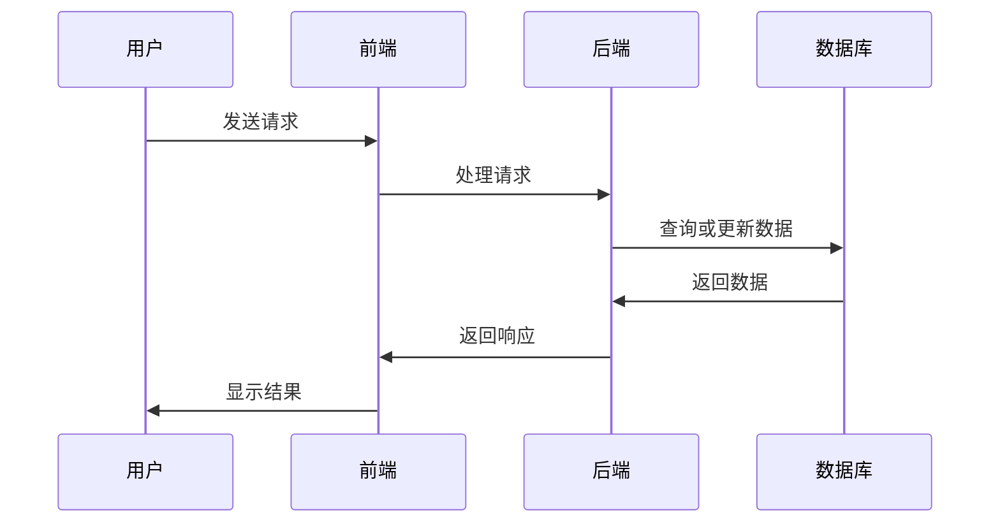

                 

### 《数字detox假期：远离科技的深度休息》

> 关键词：数字detox、科技依赖、深度休息、心理健康、实践方法

> 摘要：在数字时代，科技已成为我们生活的重要组成部分，但过度依赖科技不仅影响我们的心理健康，还可能损害我们的社交能力。本文旨在探讨数字detox假期的概念和重要性，并提供一系列步骤和策略，帮助读者实现远离科技的深度休息。

## 引言

在当今的数字时代，科技几乎无处不在。智能手机、电脑、社交媒体、在线游戏等数字化工具已经深入到我们的日常生活之中。虽然科技带来了许多便利，但过度依赖科技也带来了诸多问题。研究表明，长时间使用电子设备会对我们的心理健康产生负面影响，包括焦虑、抑郁、失眠等。此外，科技依赖还可能损害我们的社交能力，导致人际关系疏远。

为了解决这些问题，数字detox假期应运而生。数字detox，即数字断连，是指在一定时间内有意地减少或停止使用电子设备和互联网，以达到心理和生理上的放松和恢复。数字detox假期则为人们提供了一个有意识的机会，去体验没有科技干扰的生活，从而重新连接自己，提升心理健康。

## 第一部分：理论篇

### 2.1 科技依赖：问题与成因

#### 2.1.1 科技对心理和生理的影响

科技的使用对人类的心理和生理健康有着深远的影响。一方面，科技为我们提供了丰富的信息和娱乐资源，使我们能够更加便捷地获取知识和放松心情。然而，另一方面，过度使用科技也可能导致一系列健康问题。

从心理角度来看，科技使用可能会引发焦虑和抑郁。例如，社交媒体上的信息过载和对比效应可能导致人们感到自卑和焦虑。此外，长时间盯着屏幕可能导致视觉疲劳和头痛。从生理角度来看，科技使用还可能影响睡眠质量。研究表明，使用电子设备会影响人体产生褪黑激素，从而影响睡眠周期。

#### 2.1.2 科技成瘾的症状与诊断

科技成瘾，类似于药物成瘾，是一种行为成瘾。其症状包括：

- **渴求**：对科技使用的强烈渴望和冲动。
- **戒断反应**：减少或停止使用科技后，出现烦躁、不安、焦虑等不适感。
- **时间和金钱的投入**：将大量时间花费在科技使用上，甚至影响日常生活和工作的正常进行。
- **逃避现实**：使用科技作为一种逃避现实生活问题的手段。

为了诊断科技成瘾，可以使用一系列标准化的量表，如Internet Addiction Test（IAT）等。

### 2.2 数字detox假期的核心概念

#### 2.2.1 数字detox的定义

数字detox，即数字断连，是指在一定时间内有意地减少或停止使用电子设备和互联网，以达到心理和生理上的放松和恢复。数字detox假期则是这一概念的具体实践。

#### 2.2.2 数字detox假期的理论基础

数字detox假期的理论基础主要包括以下几点：

- **生理调节**：减少科技使用有助于恢复人体的自然生理节律，如睡眠周期。
- **心理减压**：远离科技干扰可以减少心理压力，提高心理健康水平。
- **社交重建**：减少对科技依赖可以促进面对面社交，增强人际关系。
- **自我反思**：数字detox假期为人们提供了反思自己生活方式和价值观的机会。

### 2.3 数字detox假期的原则与方法

#### 2.3.1 准备阶段

在进行数字detox假期之前，需要做好充分的准备。这包括：

- **设定目标和时间**：明确数字detox假期的目的和时间，例如一周或一个月。
- **告知家人和朋友**：提前告知家人和朋友，以获得他们的理解和支持。
- **准备替代活动**：规划一些替代活动，以减少对科技的需求。

#### 2.3.2 实践阶段

在数字detox假期期间，需要严格遵守计划，避免使用电子设备和互联网。以下是一些建议：

- **逐步减少使用**：如果一开始就完全停止使用科技，可能会感到不适应。可以逐步减少使用时间，例如每天减少一小时。
- **寻找替代活动**：参与户外活动、阅读书籍、练习瑜伽等，以替代科技使用。
- **保持身体活动**：定期进行身体锻炼，有助于缓解焦虑和压力。

#### 2.3.3 反思与评估

数字detox假期结束后，需要花时间反思和评估整个体验。以下是一些反思和评估的方法：

- **记录感受**：每天记录自己的感受，包括心理和生理上的变化。
- **总结收获**：总结数字detox假期带来的收获，包括心理健康、人际关系和自我反思等方面的提升。
- **制定改进计划**：根据反思和评估的结果，制定下一步的行动计划，以持续改善生活质量。

## 第二部分：实践篇

### 3.1 制定数字detox计划

#### 3.1.1 确定目标和时间

首先，需要明确数字detox假期的目标和时间。目标可以是提高心理健康、增强人际关系或自我反思等。时间则可以根据个人情况灵活安排，例如一周、一个月或更长时间。

#### 3.1.2 准备所需的工具和资源

为了成功进行数字detox假期，需要准备一些工具和资源。这包括：

- **日历和提醒**：用来规划数字detox假期的日程和提醒。
- **记录工具**：用来记录每天的感受和反思。
- **替代活动**：如书籍、运动器材、手工艺品等，以替代科技使用。

### 3.2 执行数字detox假期

#### 3.2.1 第一天：逐步减少科技使用

第一天，可以尝试逐步减少科技使用。例如，每天减少一小时，逐步减少到完全停止使用。在这一天，可以做一些简单的替代活动，如散步、阅读或练习瑜伽。

#### 3.2.2 中期：建立新的日常习惯

在数字detox假期的中期，需要逐渐建立新的日常习惯。这包括：

- **规律的作息时间**：确保每天有足够的睡眠时间，并保持规律的作息时间。
- **健康的饮食习惯**：注意饮食健康，减少油腻和刺激性食物的摄入。
- **替代活动**：积极参与替代活动，如户外运动、手工活动或艺术创作。

#### 3.2.3 末期：巩固成果

在数字detox假期的末期，需要巩固所取得的成果。以下是一些建议：

- **回顾和总结**：回顾数字detox假期的经历，总结收获和不足。
- **制定长期计划**：根据反思和评估的结果，制定长期的数字detox计划，以持续改善生活质量。

### 3.3 数字detox假期中的挑战与应对

#### 3.3.1 挑战1：社交压力

在数字detox假期期间，可能会遇到来自社交压力的挑战。以下是一些建议来应对这种情况：

- **提前告知朋友和家人**：提前告知他们你的计划，以获得他们的理解和支持。
- **保持沟通**：虽然减少了科技使用，但仍然可以通过电话、邮件或面对面交流来保持沟通。

#### 3.3.2 挑战2：习惯改变困难

改变习惯可能会很困难，以下是一些建议来应对：

- **逐步减少使用**：逐步减少科技使用，而不是一开始就完全停止。
- **寻找替代活动**：积极参与替代活动，以减少对科技的需求。

#### 3.3.3 挑战3：情绪波动

在数字detox假期期间，可能会遇到情绪波动的挑战。以下是一些建议来应对：

- **保持身体活动**：定期进行身体锻炼，有助于缓解焦虑和压力。
- **进行冥想和放松练习**：冥想和放松练习有助于调节情绪。

## 第三部分：反思与总结

### 4.1 数字detox假期的收获与反思

数字detox假期结束后，需要对整个体验进行反思和总结。以下是一些反思和总结的建议：

- **记录感受**：记录在数字detox假期期间的心理和生理感受。
- **总结收获**：总结数字detox假期带来的收获，包括心理健康、人际关系和自我反思等方面的提升。
- **识别挑战**：识别在数字detox假期中遇到的挑战，并思考如何克服这些挑战。

### 4.2 数字detox假期后的持续实践

数字detox假期只是一个开始，持续实践才是关键。以下是一些建议：

- **制定长期计划**：根据反思和评估的结果，制定长期的数字detox计划。
- **逐步调整**：在日常生活中，逐步调整科技使用的时间，以保持健康的生活方式。

### 4.3 小结：数字detox假期对生活的影响

数字detox假期对生活有着深远的影响。通过减少科技使用，我们能够更好地关注自己的身心健康，提高生活质量。此外，数字detox假期还有助于我们反思自己的生活方式和价值观，从而做出更健康、更有意义的选择。

## 第四部分：拓展阅读

### 5.1 相关书籍推荐

- 《数字尘肺：如何摆脱手机和社交媒体的困扰》（作者：保罗·基尔斯比）
- 《科技与我们的未来：重新思考科技对人类生活的影响》（作者：卡尔·费诺）

### 5.2 网络资源与社区

- digitaldetoxproject.com：一个提供数字detox资源和指导的网站。
- 数字detox社交媒体群组：在社交媒体上搜索相关的群组，与其他参与者交流经验和心得。

### 5.3 专家访谈与案例分析

- 访谈科技依赖专家，了解他们的观点和建议。
- 分析成功进行数字detox假期的人的案例，学习他们的方法和经验。

## 结尾

作者：AI天才研究院/AI Genius Institute & 禅与计算机程序设计艺术 /Zen And The Art of Computer Programming

数字detox假期是一种有效的策略，可以帮助我们摆脱科技依赖，享受深度休息。通过逐步减少科技使用，我们可以提高心理健康，增强人际关系，并重新连接自己。希望本文能够为您的数字detox之旅提供一些有用的指导和启示。让我们一起努力，过上更健康、更有意义的生活！ 

----------------------------------------------------------------

## 附加内容

### 算法原理讲解

在数字detox假期中，一个关键的概念是“逐步减少使用”。这一过程可以通过以下算法原理来指导：

#### 算法名称：逐步减少使用算法

#### 输入：
- `initial_time`：初始科技使用时间（小时）
- `target_time`：目标科技使用时间（小时）
- `days`：数字detox假期的总天数

#### 输出：
- `daily_reduction`：每天减少的科技使用时间（小时）

#### 算法步骤：
1. 计算`initial_time`和`target_time`之间的差值，作为总减少量。
2. 将总减少量平均分配到`days`天内，得到每天减少的科技使用时间。
3. 返回每天减少的科技使用时间。

以下是该算法的Python实现：

```python
def calculate_daily_reduction(initial_time, target_time, days):
    total_reduction = initial_time - target_time
    daily_reduction = total_reduction / days
    return daily_reduction

initial_time = 5  # 初始科技使用时间为5小时
target_time = 2   # 目标科技使用时间为2小时
days = 7          # 数字detox假期的总天数为7天

daily_reduction = calculate_daily_reduction(initial_time, target_time, days)
print(f"每天需要减少的科技使用时间为：{daily_reduction}小时")
```

运行上述代码，将输出每天需要减少的科技使用时间。例如，如果初始科技使用时间为5小时，目标科技使用时间为2小时，数字detox假期的总天数为7天，则每天需要减少0.857小时（约为31.43分钟）。

### 系统分析与架构设计方案

#### 问题场景介绍

在数字detox假期中，我们需要一个系统来帮助用户逐步减少科技使用，并记录他们的进展。这个系统需要支持用户注册、登录、设置数字detox目标、记录每日科技使用时间等功能。

#### 项目介绍

数字detox管理系统（Digital Detox Management System，DDMS）是一个基于Web的应用程序，旨在帮助用户实现数字detox目标。DDMS提供以下主要功能：

- 用户注册和登录
- 设置数字detox目标
- 记录每日科技使用时间
- 提供统计和分析报告

#### 系统功能设计

DDMS的领域模型包括以下类：

- `User`：用户类，包含用户名、密码、电子邮件、电话等信息。
- `Goal`：目标类，包含目标名称、目标时间、目标描述等信息。
- `Entry`：记录类，包含记录日期、科技使用时间、备注等信息。

#### 系统架构设计

DDMS的系统架构包括以下部分：

- **前端**：使用HTML、CSS和JavaScript实现用户界面。
- **后端**：使用Python的Django框架实现业务逻辑和数据管理。
- **数据库**：使用MySQL数据库存储用户数据、目标数据和记录数据。

#### 系统接口设计和系统交互

DDMS的系统接口设计和系统交互如下：



### 项目实战

#### 环境安装

1. 安装Python 3.8或更高版本。
2. 安装Django框架：`pip install django`。
3. 安装MySQL数据库：根据操作系统选择相应的安装方式。

#### 系统核心实现源代码

```python
# users/models.py
from django.db import models

class User(models.Model):
    username = models.CharField(max_length=150)
    password = models.CharField(max_length=150)
    email = models.EmailField(max_length=254)
    phone = models.CharField(max_length=20)

# goals/models.py
from django.db import models
from users.models import User

class Goal(models.Model):
    user = models.ForeignKey(User, on_delete=models.CASCADE)
    name = models.CharField(max_length=100)
    target_time = models.IntegerField()
    description = models.TextField()

# entries/models.py
from django.db import models
from users.models import User
from goals.models import Goal

class Entry(models.Model):
    user = models.ForeignKey(User, on_delete=models.CASCADE)
    goal = models.ForeignKey(Goal, on_delete=models.CASCADE)
    date = models.DateField()
    time_used = models.IntegerField()
    notes = models.TextField()
```

#### 代码应用解读与分析

上述代码定义了三个模型：`User`、`Goal`和`Entry`。`User`模型表示用户信息，包括用户名、密码、电子邮件和电话。`Goal`模型表示用户的数字detox目标，包括用户、目标名称、目标时间和目标描述。`Entry`模型表示用户的每日科技使用记录，包括用户、目标、记录日期、科技使用时间和备注。

#### 实际案例分析和详细讲解剖析

假设有一个用户注册并设置了数字detox目标，如下所示：

- 用户名：alice
- 目标名称：每天减少1小时科技使用
- 目标时间：7天

用户在第一天记录了科技使用时间为4小时，第二天记录了科技使用时间为3小时。以下是对这些记录的解析：

1. **第一天**：
   - 用户记录了科技使用时间为4小时。
   - 根据数字detox目标，用户需要减少1小时，即第二天目标时间为3小时。

2. **第二天**：
   - 用户记录了科技使用时间为3小时。
   - 用户成功实现了当天的目标，但还需要继续努力减少科技使用时间。

#### 项目小结

数字detox管理系统（DDMS）是一个帮助用户实现数字detox目标的应用程序。通过定义用户、目标和记录模型，DDMS能够记录用户的科技使用情况，并提供统计和分析报告。该项目实战展示了如何使用Django框架和MySQL数据库实现一个简单的Web应用程序，为用户提供了有效的数字detox工具。

### 最佳实践 tips

1. **设定明确的目标**：在开始数字detox假期前，设定明确的目标和时间，有助于提高成功率。
2. **逐步减少使用**：逐步减少科技使用，以减少对科技的依赖。
3. **寻找替代活动**：参与替代活动，如户外运动、阅读或手工活动，以替代科技使用。

### 注意事项

1. **提前告知家人和朋友**：在开始数字detox假期前，提前告知家人和朋友，以获得他们的理解和支持。
2. **保持耐心和毅力**：改变习惯需要时间，保持耐心和毅力是成功的关键。

### 拓展阅读

1. 《数字尘肺：如何摆脱手机和社交媒体的困扰》（作者：保罗·基尔斯比）
2. 《科技与我们的未来：重新思考科技对人类生活的影响》（作者：卡尔·费诺）
3. digitaldetoxproject.com：一个提供数字detox资源和指导的网站。

