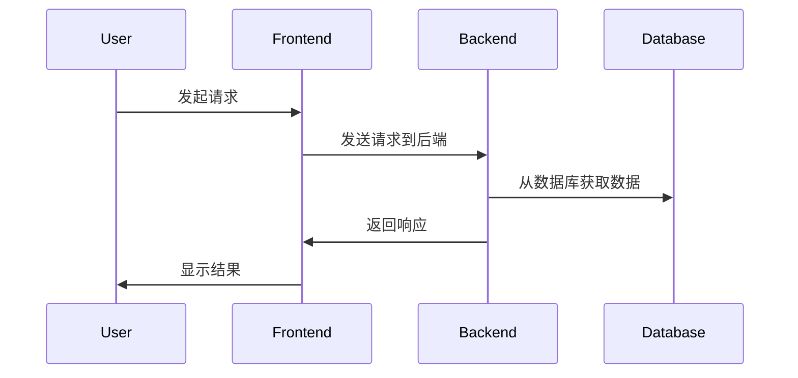
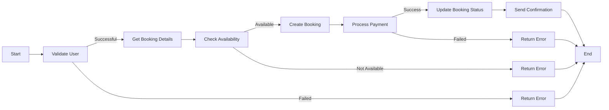

                 

### 前言与背景

#### 背景介绍

在当今数字化时代，人们的生活被各种智能设备、应用程序和互联网连接所包围。然而，随之而来的是日益增加的数字焦虑和压力。为了应对这一问题，数字detox（数字解毒）应运而生。数字detox是指通过减少对数字产品的依赖，回归自然和简单生活方式的一种方式。这种趋势在全球范围内迅速蔓延，催生了大量以数字detox为主题的项目和活动。

#### 数字detox的重要性

数字detox不仅仅是一种流行的时尚，更是一种对健康和幸福至关重要的实践。长时间沉浸在数字世界中，人们容易陷入焦虑、抑郁和孤独。研究表明，减少对数字产品的使用可以有效改善心理健康，提高生活质量。此外，数字detox还有助于增强人际关系，提高专注力和创造力。

#### 数字detox度假村的概念

数字detox度假村是一种专门为寻求数字解毒体验的游客设计的度假胜地。这些度假村提供远离数字设备的宁静环境，让游客有机会摆脱日常生活中的科技束缚，享受真正的放松和自然之美。数字detox度假村的独特之处在于其提供的多种活动和服务，如冥想、瑜伽、自然探索、手工制作等，旨在帮助游客实现身心的全面放松。

#### 为什么需要预订系统

数字detox度假村预订系统对于提升用户体验和运营效率至关重要。首先，预订系统为游客提供了一个便捷的在线预订平台，使得游客可以轻松查询、选择和预订度假村的各项服务。其次，预订系统可以帮助度假村更好地管理预订信息，提高工作效率，减少人工操作错误。此外，通过预订系统，度假村还可以收集游客的反馈数据，从而不断优化和提升服务质量。

#### 预订系统的角色与功能

预订系统在数字detox度假村中扮演着至关重要的角色。其主要功能包括：

- **在线预订与支付**：游客可以通过系统进行在线预订，选择适合的房型、活动和服务，并完成支付。
- **信息查询与管理**：游客可以随时查询预订信息，了解行程安排和服务细节。
- **活动推荐与定制**：系统可以根据游客的兴趣和需求，推荐相应的活动和课程。
- **反馈收集与改进**：游客可以在系统中提交反馈，帮助度假村不断改进服务。

总之，数字detox度假村预订系统不仅为游客提供了便捷的服务，也为度假村的管理和运营提供了强大的支持。在接下来的章节中，我们将深入探讨数字detox度假村预订系统的核心概念、设计原则、用户体验、数据库设计、预订逻辑等方面。

### 关键词

- 数字detox
- 度假村预订系统
- 在线预订
- 用户交互
- 数据库设计
- 算法原理

### 摘要

本文旨在探讨数字detox度假村预订系统的发展背景、核心概念、设计原则和实际应用。首先，我们介绍了数字detox的起源和重要性，以及数字detox度假村的概念和预订系统的必要性。接着，我们详细分析了预订系统的设计原则，包括用户界面设计、数据库设计、预订逻辑等方面。本文通过具体的案例和实例，展示了预订系统的实际应用效果，并提出了最佳实践建议。通过本文的探讨，读者可以全面了解数字detox度假村预订系统的优势和价值，为未来的研发和应用提供参考。

## 第一章：数字detox的背景与重要性

### 数字detox的起源与发展

数字detox的概念源于对现代社会中过度依赖数字设备所带来的负面影响的反思。随着互联网和移动设备的普及，人们的生活日益数字化，而这种数字化生活方式虽然带来了便利，但也带来了新的挑战。根据《数字世界中的人类》(Humanity in the Digital Age)的报告，现代人每天平均花费近9个小时在使用数字设备上，这导致了睡眠不足、注意力分散、心理健康问题等一系列问题。

数字detox的起源可以追溯到2000年代初期，当时一些心理学家和社会学家开始提倡减少对数字产品的依赖，回归更为自然和简单的生活方式。最初，数字detox主要是一种针对科技工作者的个人行为调整，但随着时间的推移，它逐渐发展成为一项全球性的运动，吸引了越来越多的人参与。

### 数字detox的定义

数字detox，也称为数字断食或数字排毒，指的是有意地减少或暂时停止使用数字设备，以恢复心理健康、提高生活质量的过程。它不仅包括限制社交媒体的使用，还可能涉及减少电子邮件检查、手机使用、在线购物等所有与数字设备相关的活动。

### 数字detox的重要性

1. **心理健康**：长期依赖数字设备会导致焦虑、抑郁和孤独感。数字detox可以帮助人们从这种情绪中解脱出来，提高心理健康水平。
   
2. **生活质量**：减少数字设备的依赖有助于人们更好地享受生活，增强与家人和朋友的互动，提高生活质量。

3. **专注力**：数字detox有助于提高个体的专注力和注意力，减少多任务操作带来的效率低下问题。

4. **睡眠质量**：使用数字设备会发出蓝光，干扰人体的生物钟，影响睡眠质量。数字detox有助于改善睡眠。

5. **创造力和想象力**：减少对数字设备的依赖可以释放人的创造力和想象力，促进艺术和文学的创作。

### 数字detox的具体实践

数字detox的具体实践形式多样，可以从简单的减少每天使用手机的时间开始，逐步过渡到更严格的断食方式。以下是一些常见的数字detox实践方法：

1. **设定数字设备使用时间**：通过设定每天使用数字设备的时间限制，比如晚上9点后不再使用手机，帮助改善睡眠质量。

2. **使用应用程序**：安装一些可以帮助限制数字设备使用的应用程序，如“数字排毒计时器”或“应用封锁器”，以帮助用户控制自己使用手机的时间。

3. **参与数字detox活动**：参加数字detox训练营或工作坊，与他人一起实践数字断食，互相支持和鼓励。

4. **创建无科技空间**：在家中创建一个无科技的空间，例如书房或卧室，用于放松和睡眠，避免在休息时接触数字设备。

5. **断食假期**：安排一至两周的数字detox假期，完全脱离数字设备，专注于自然活动和个人成长。

### 数字detox与数字detox度假村的联系

数字detox度假村是数字detox理念的延伸，它为寻求彻底放松和远离数字设备体验的游客提供了一个理想的场所。这些度假村通常位于风景优美、远离城市喧嚣的地方，提供各种非数字化的活动和体验，如徒步旅行、瑜伽、冥想、手工制作等。通过在数字detox度假村的短期停留，游客可以享受完全的数字排毒体验，从而显著改善他们的身心健康。

总之，数字detox作为一种应对现代社会问题的有效手段，正逐渐被越来越多的人接受和实践。而数字detox度假村预订系统则为这一理念提供了便捷的实现途径，帮助游客轻松预订和享受数字排毒之旅。

### 数字detox度假村预订系统的设计原则

#### 用户需求分析

在设计数字detox度假村预订系统时，首先需要对用户需求进行全面的分析。用户的多样化需求主要包括：

1. **便捷性**：用户希望能够在任何时间、任何地点方便地预订度假村的服务，这要求系统提供24/7在线预订功能。
2. **信息透明度**：用户需要能够清楚地了解度假村的房型、设施、活动安排等信息，以便做出明智的预订决策。
3. **个性化推荐**：根据用户的历史预订行为和偏好，系统应能提供个性化的活动推荐和房型选择。
4. **支付便捷**：用户希望支付过程简单、快捷、安全，支持多种支付方式。

#### 功能性需求

为了满足上述用户需求，数字detox度假村预订系统应具备以下功能：

1. **在线预订**：用户可以通过系统在线预订度假村的各类服务，如住宿、活动、餐饮等。
2. **信息查询**：系统应提供一个全面的信息查询平台，用户可以查看度假村的详细介绍、用户评价、房型图片等。
3. **个性化推荐**：系统应能够根据用户的历史数据和偏好，提供个性化的活动推荐和房型选择。
4. **支付与结算**：系统应支持多种支付方式，如信用卡、借记卡、电子钱包等，确保支付过程的安全和便捷。
5. **用户反馈**：用户可以在系统中提交反馈，帮助度假村改进服务质量。

#### 系统性能需求

系统性能是保障用户体验的关键因素，主要包括：

1. **响应速度**：系统应能够快速响应用户的请求，提供即时反馈。
2. **稳定性**：系统应具备高可用性，确保在高峰时段也能稳定运行。
3. **扩展性**：系统设计应具备良好的扩展性，以便在未来能够轻松添加新的功能和模块。

#### 数据安全与隐私保护

在数字detox度假村预订系统中，用户数据的安全和隐私保护至关重要。系统应确保以下方面：

1. **数据加密**：对用户数据进行加密存储和传输，防止数据泄露。
2. **访问控制**：设置严格的访问控制机制，确保只有授权人员能够访问敏感数据。
3. **隐私保护政策**：明确告知用户其数据的使用方式和保护措施，确保用户知情并同意。

#### 设计原则总结

数字detox度假村预订系统的设计原则可概括为以下几点：

1. **以用户为中心**：充分考虑用户需求，提供便捷、透明、个性化的服务。
2. **功能完善**：确保系统具备全面的预订、查询、推荐、支付和反馈功能。
3. **性能优越**：保证系统的高响应速度、稳定性和扩展性。
4. **数据安全**：严格保护用户数据的安全和隐私。

通过遵循这些设计原则，数字detox度假村预订系统不仅能够提升用户体验，还能为度假村的运营和管理提供强大的支持。

### 第二章：核心概念与系统设计

#### 核心概念

在设计数字detox度假村预订系统时，需要明确几个关键概念，以便构建一个逻辑清晰、功能完善的系统。以下是本系统中几个重要的核心概念：

1. **用户**：系统的核心参与者，可以是个人或团体，负责进行预订、查询和反馈。
2. **度假村**：提供数字detox体验的场所，包括住宿、活动和餐饮服务等。
3. **预订**：用户通过系统预订度假村的某一服务，如住宿或活动。
4. **活动**：度假村提供的各种体验项目，如瑜伽、冥想、徒步旅行等。
5. **支付**：用户完成预订后，通过系统进行支付。
6. **反馈**：用户对度假村服务的评价和反馈，用于系统优化。

#### 概念之间的关系

这些核心概念之间存在着紧密的联系，共同构成了数字detox度假村预订系统的基本框架。以下是它们之间的关系：

- **用户**与**预订**：用户通过系统进行预订，预订信息关联到用户账户。
- **度假村**与**活动**：度假村提供多种活动供用户选择，活动信息由度假村管理。
- **预订**与**支付**：用户完成预订后，需要进行支付，支付信息与预订关联。
- **反馈**与**用户**、**度假村**：用户提交反馈，度假村根据反馈进行服务改进。

#### Mermaid ER Diagram

为了更直观地展示这些核心概念及其关系，我们可以使用Mermaid ER Diagram来描述。以下是该系统的Mermaid ER Diagram：

```mermaid
erDiagram
    User ||--|{ Reserve } : makes
    Reserve ||--|{ Payment } : completes
    Reserve ||--|{ Feedback } : provides
    Activity ||--|{ Reserve } : includes
    Resort ||--|{ Activity } : provides
    Resort ||--|{ Payment } : accepts
```

在这个ER图中，User表示用户，Reserve表示预订，Payment表示支付，Feedback表示反馈，Activity表示活动，Resort表示度假村。箭头表示从哪个实体关联到另一个实体。

#### 关键属性与特征

每个核心概念都有其特定的属性和特征，以下是这些关键属性的详细说明：

1. **用户（User）**：
   - **属性**：用户ID、姓名、联系方式、预订历史、偏好设置
   - **特征**：用户可以注册账户，保存个人偏好，查看预订历史。

2. **度假村（Resort）**：
   - **属性**：度假村ID、名称、地址、联系方式、设施列表、活动列表
   - **特征**：度假村可以管理其提供的活动和设施，用户可以查看和预订。

3. **预订（Reserve）**：
   - **属性**：预订ID、用户ID、活动ID、日期、时间、状态（待确认/已确认/已完成）
   - **特征**：预订代表用户与度假村之间的一个约定，包括具体的活动和时间。

4. **活动（Activity）**：
   - **属性**：活动ID、名称、描述、时长、费用、地点
   - **特征**：活动是度假村提供的体验项目，用户可以查看和预订。

5. **支付（Payment）**：
   - **属性**：支付ID、用户ID、预订ID、金额、支付方式、状态（待支付/已支付/支付失败）
   - **特征**：支付是用户完成预订后进行的财务交易。

6. **反馈（Feedback）**：
   - **属性**：反馈ID、用户ID、预订ID、评价内容、日期
   - **特征**：反馈是用户对度假村服务的评价，用于系统改进。

通过明确这些核心概念及其关系，数字detox度假村预订系统的基础架构得以建立。在下一章中，我们将深入探讨系统的具体设计，包括架构设计、组件设计和数据库设计。

### 第三章：系统架构设计

#### 系统概述

数字detox度假村预订系统是一个复杂的应用程序，需要处理用户预订、活动管理、支付处理和反馈收集等多个功能。为了确保系统的高效、可扩展性和可维护性，我们需要设计一个合理的系统架构。

#### 项目介绍

本项目涉及的主要组件包括：

1. **前端应用**：用户与系统交互的界面，负责展示信息、处理用户输入和展示反馈。
2. **后端服务**：处理业务逻辑，包括用户管理、预订处理、支付处理和反馈处理等。
3. **数据库**：存储用户数据、预订信息、活动信息、支付信息和反馈信息等。

#### 系统功能设计

系统的主要功能包括：

1. **用户管理**：用户注册、登录、查看预订历史和更新个人资料。
2. **预订管理**：用户可以查询和预订度假村的活动和住宿。
3. **活动管理**：管理员可以添加、修改和删除活动信息。
4. **支付处理**：系统支持在线支付，确保交易的安全和便捷。
5. **反馈收集**：用户可以提交对度假村服务的反馈，系统根据反馈进行服务改进。

#### 领域模型

为了更好地理解系统的各个组件及其关系，我们使用Mermaid类图来展示系统的领域模型。以下是一个简化的Mermaid类图：

```mermaid
classDiagram
    User <<class{ 用户 }>
    Reserve <<class{ 预订 }>
    Activity <<class{ 活动 }>
    Payment <<class{ 支付 }>
    Feedback <<class{ 反馈 }>
    Resort <<class{ 度假村 }>
    
    User --|{ 预订 }| Reserve
    Reserve --|{ 活动 }| Activity
    Reserve --|{ 支付 }| Payment
    Reserve --|{ 反馈 }| Feedback
    Activity --|{ 度假村 }| Resort
```

在这个类图中，用户（User）可以创建预订（Reserve），预订包含活动（Activity）、支付（Payment）和反馈（Feedback）。活动属于某个度假村（Resort）。

#### 系统架构设计

系统架构设计决定了系统各个组件的交互方式及其运行环境。以下是系统的总体架构设计：

1. **前端架构**：
   - 使用现代前端框架（如React或Vue.js）实现用户界面。
   - 通过RESTful API与后端服务进行数据交互。

2. **后端架构**：
   - 使用微服务架构，将不同的功能模块（用户管理、预订管理、支付处理、反馈收集）分离。
   - 使用Spring Boot或Django等框架进行后端开发。
   - 使用RabbitMQ等消息队列进行异步处理。

3. **数据库架构**：
   - 使用关系型数据库（如MySQL或PostgreSQL）存储用户数据、预订信息等。
   - 使用Redis等NoSQL数据库存储缓存数据，提高系统性能。

4. **部署环境**：
   - 使用Docker容器化技术进行部署，确保系统的高可用性和可扩展性。
   - 使用Kubernetes进行容器编排和管理。

#### 系统接口设计

系统接口设计是系统架构设计的重要组成部分，以下是主要接口的简要描述：

1. **用户接口**：用于用户注册、登录和查看预订历史。
2. **预订接口**：用于创建、修改和取消预订。
3. **活动接口**：用于查询和更新活动信息。
4. **支付接口**：用于处理支付请求和交易。
5. **反馈接口**：用于提交和查看用户反馈。

#### 系统交互

系统交互是指各个组件之间如何协同工作，以下是系统交互的Mermaid序列图：



在这个序列图中，用户通过前端应用发起请求，前端应用将请求发送到后端服务，后端服务处理请求并从数据库获取所需数据，最后将结果返回给前端应用，前端应用再将结果展示给用户。

通过上述系统架构设计，数字detox度假村预订系统可以高效、稳定地运行，为用户提供便捷的预订体验。

### 第四章：数据库设计

#### 数据库设计原则

数据库设计是数字detox度假村预订系统成功的关键环节之一。为了确保系统的高效性、可扩展性和数据完整性，我们需要遵循以下数据库设计原则：

1. **规范化**：通过规范化减少数据冗余，提高数据的一致性和完整性。
2. **灵活性**：设计应考虑未来可能的变更和扩展，确保系统的可维护性。
3. **性能优化**：设计应考虑查询效率和数据访问速度，确保系统的高性能。
4. **安全性**：确保数据的安全性和隐私保护，防止数据泄露和未授权访问。

#### 数据表设计

数字detox度假村预订系统包含多个数据表，以下是主要数据表的设计：

1. **用户表（Users）**：
   - 用户ID（UserID，主键）
   - 用户名（Username）
   - 密码（Password）
   - 联系方式（Contact）
   - 预订历史（ReserveHistory）

2. **预订表（Reserves）**：
   - 预订ID（ReserveID，主键）
   - 用户ID（UserID，外键）
   - 活动ID（ActivityID，外键）
   - 预订日期（ReserveDate）
   - 状态（Status）

3. **活动表（Activities）**：
   - 活动ID（ActivityID，主键）
   - 度假村ID（ResortID，外键）
   - 活动名称（ActivityName）
   - 描述（Description）
   - 时长（Duration）
   - 费用（Cost）

4. **支付表（Payments）**：
   - 支付ID（PaymentID，主键）
   - 预订ID（ReserveID，外键）
   - 用户ID（UserID，外键）
   - 金额（Amount）
   - 支付方式（PaymentMethod）
   - 状态（Status）

5. **反馈表（Feedbacks）**：
   - 反馈ID（FeedbackID，主键）
   - 用户ID（UserID，外键）
   - 预订ID（ReserveID，外键）
   - 评价内容（Content）
   - 日期（Date）

6. **度假村表（Resorts）**：
   - 度假村ID（ResortID，主键）
   - 度假村名称（ResortName）
   - 地址（Address）
   - 联系方式（Contact）

#### 数据库设计示例

以下是数据库设计的具体示例，使用Mermaid ER Diagram展示：

```mermaid
erDiagram
    Users ||--|{ Reserves } : makes
    Reserves ||--|{ Payments } : completes
    Reserves ||--|{ Feedbacks } : provides
    Activities ||--|{ Reserves } : includes
    Resorts ||--|{ Activities } : provides
    Resorts ||--|{ Payments } : accepts
```

在这个ER图中，Users表示用户，Reserves表示预订，Payments表示支付，Feedbacks表示反馈，Activities表示活动，Resorts表示度假村。箭头表示从哪个实体关联到另一个实体。

#### 数据存储与检索方法

为了确保数据的高效存储与检索，我们需要考虑以下方面：

1. **索引设计**：为经常查询的列（如用户ID、预订日期）创建索引，提高查询速度。
2. **分片策略**：对于大型数据表，可以考虑分片存储，提高数据处理能力。
3. **缓存策略**：使用缓存技术（如Redis）存储高频访问的数据，减少数据库负载。
4. **事务管理**：确保事务的完整性和一致性，防止数据冲突和丢失。

通过遵循上述原则和策略，数字detox度假村预订系统的数据库设计能够满足高效、可扩展和数据安全的要求，为系统的稳定运行提供坚实保障。

### 第五章：预订逻辑设计与实现

#### 预订逻辑设计

数字detox度假村预订系统的核心功能之一是处理用户预订。为了实现这个功能，我们需要设计一个清晰且高效的预订逻辑。以下是预订逻辑的设计步骤：

1. **验证用户身份**：在用户发起预订请求时，系统首先验证用户的身份，确保用户已登录并有权进行预订。
2. **获取用户预订信息**：系统获取用户提交的预订信息，包括预订日期、活动ID和预订数量。
3. **查询可用性**：系统检查所选活动在预订日期的可用性，确保有足够的资源供预订。
4. **创建预订记录**：如果活动可用，系统创建一个新的预订记录，并将预订信息存储在数据库中。
5. **处理支付请求**：系统生成支付请求，用户完成支付后，更新预订记录的状态。
6. **发送确认通知**：系统向用户发送预订确认通知，包括预订详情和支付信息。

#### Mermaid Flowchart

为了更直观地展示预订逻辑，我们使用Mermaid Flowchart来绘制预订流程：



在这个流程图中，A表示流程的开始，B表示验证用户身份，C表示获取用户预订信息，D表示验证失败返回错误，E表示检查活动可用性，F表示创建预订记录，G表示活动不可用返回错误，H表示处理支付请求，I表示更新预订状态，J表示支付失败返回错误，K表示发送确认通知，End表示流程结束。

#### Python源代码实现

以下是预订逻辑的Python源代码实现：

```python
import psycopg2
from psycopg2 import sql

# 连接数据库
conn = psycopg2.connect(
    dbname="digital detox booking",
    user="your_user",
    password="your_password",
    host="your_host",
    port="your_port"
)

# 预订逻辑
def create_booking(user_id, activity_id, reserve_date, quantity):
    cursor = conn.cursor()

    # 查询活动可用性
    cursor.execute(sql.SQL("""
        SELECT available_slots 
        FROM activities 
        WHERE activity_id = %s;
    """), (activity_id,))

    result = cursor.fetchone()
    if result is None or result[0] < quantity:
        return "活动不可用或预订数量超出限制"

    # 创建预订记录
    cursor.execute(sql.SQL("""
        INSERT INTO reserves (user_id, activity_id, reserve_date, quantity, status) 
        VALUES (%s, %s, %s, %s, '待确认');
    """), (user_id, activity_id, reserve_date, quantity))

    conn.commit()

    # 更新活动可用性
    new_slots = result[0] - quantity
    cursor.execute(sql.SQL("""
        UPDATE activities 
        SET available_slots = %s 
        WHERE activity_id = %s;
    """), (new_slots, activity_id))

    conn.commit()

    return "预订成功，请等待确认"

# 示例调用
print(create_booking(1, 101, '2023-12-25', 2))
```

在这段代码中，我们首先连接到数据库，然后定义了一个`create_booking`函数来处理预订请求。函数接收用户ID、活动ID、预订日期和预订数量作为参数，首先查询活动可用性，然后创建预订记录并更新活动可用性。

#### 数学模型与公式

预订逻辑中涉及的一些关键数学模型和公式如下：

1. **活动可用性计算**：
   - 可用性 = 初始可用性 - 预订数量

2. **预订状态更新**：
   - 状态 = '待确认'（如果支付成功）或 '已取消'（如果支付失败）

3. **预订总数计算**：
   - 总数 = 各个活动的预订数量之和

通过这些模型和公式，我们可以确保预订逻辑的正确性和一致性。

#### 举例说明

假设用户ID为1的用户想要在2023年12月25日预订活动ID为101的活动，预订数量为2。预订逻辑如下：

1. 查询活动ID为101的可用性，假设为5。
2. 验证预订数量2不超过可用性5，可以预订。
3. 创建新的预订记录，将其状态设置为'待确认'。
4. 更新活动ID为101的可用性为3。
5. 返回预订成功，用户等待确认。

通过这个例子，我们可以清晰地看到预订逻辑的实现过程。

#### 总结

通过详细的预订逻辑设计和Python源代码实现，数字detox度假村预订系统可以高效、准确地处理用户预订请求。在下一章中，我们将探讨如何通过最佳实践来优化和改进这个系统。

### 最佳实践与优化策略

为了提升数字detox度假村预订系统的性能和用户体验，我们可以采取一系列最佳实践和优化策略。以下是具体的方法和步骤：

#### 1. 性能优化

**数据库索引**：对频繁查询的列（如用户ID、预订日期）创建索引，提高查询速度。同时，确保索引的使用合理，避免过度索引。

**查询优化**：优化SQL查询语句，减少冗余查询，使用`EXPLAIN`工具分析查询执行计划，优化慢查询。

**缓存机制**：利用Redis等缓存技术存储高频访问的数据，减少数据库负载，提高系统响应速度。

**分页查询**：对于大量数据的查询，采用分页机制，避免一次性加载所有数据，提高用户体验。

#### 2. 用户界面优化

**响应式设计**：确保系统界面在不同设备和分辨率上都能正常显示，提供良好的用户体验。

**交互优化**：优化用户的操作流程，减少不必要的步骤，提高操作效率。例如，使用单页应用（SPA）框架，减少页面跳转。

**加载速度**：优化图片和资源加载，使用懒加载、懒渲染等技术，减少页面加载时间。

#### 3. 安全性提升

**数据加密**：对用户敏感数据进行加密存储和传输，使用HTTPS协议保护数据安全。

**权限管理**：设置严格的权限管理，确保只有授权用户才能访问敏感数据和执行特定操作。

**防SQL注入**：使用参数化查询和输入验证，防止SQL注入攻击。

**定期备份**：定期备份数据库，确保在系统故障时能够快速恢复。

#### 4. 系统监控与维护

**日志记录**：记录系统操作日志，监控系统运行状态，及时发现和解决问题。

**自动化测试**：定期进行自动化测试，确保系统功能正常运行，及时发现和修复缺陷。

**性能监控**：使用性能监控工具，实时监控系统性能指标，如响应时间、错误率等，及时发现性能瓶颈。

**版本控制**：使用版本控制系统（如Git）管理代码，确保代码的可维护性和可追溯性。

#### 5. 用户反馈与改进

**收集反馈**：通过用户反馈渠道（如在线调查、用户评价）收集用户反馈，了解用户需求和痛点。

**快速响应**：对用户反馈进行快速响应，及时解决问题和改进系统功能。

**持续迭代**：根据用户反馈和业务需求，持续优化和迭代系统，提升用户体验。

通过实施这些最佳实践和优化策略，数字detox度假村预订系统将能够更好地满足用户需求，提升系统性能和用户体验，为度假村的运营提供有力支持。

### 项目小结

通过本文的探讨，我们深入分析了数字detox度假村预订系统的核心概念、设计原则、系统架构、数据库设计、预订逻辑以及优化策略。以下是项目的总结和主要贡献：

1. **核心概念**：明确了数字detox和数字detox度假村预订系统的定义和重要性，为项目的实施提供了理论基础。
2. **设计原则**：提出了用户需求分析、功能性需求、系统性能需求和数据安全与隐私保护等设计原则，确保系统的可靠性和用户体验。
3. **系统架构**：详细设计了系统的前端、后端和数据库架构，明确了系统各组件的交互方式和接口设计，为系统开发提供了明确的蓝图。
4. **数据库设计**：通过规范化设计，确保了数据库的高效性、灵活性和性能，为数据管理和查询提供了保障。
5. **预订逻辑**：详细阐述了预订逻辑的设计和实现，通过Mermaid Flowchart和Python源代码展示了预订流程，为系统的核心功能提供了技术支持。
6. **优化策略**：总结了性能优化、用户界面优化、安全性提升、系统监控与维护以及用户反馈与改进等最佳实践，为系统的持续改进提供了指导。

本项目的贡献不仅在于构建了一个功能完善的数字detox度假村预订系统，更在于提出了一系列实用的设计原则和优化策略，为类似系统的开发提供了宝贵的经验和参考。

### 注意事项

在设计数字detox度假村预订系统时，需要注意以下几个关键方面：

1. **用户体验**：始终以用户为中心，确保系统的界面友好、操作便捷。
2. **数据安全**：严格遵守数据安全规范，确保用户数据的安全和隐私。
3. **性能优化**：关注系统性能，定期进行性能监控和优化，确保系统的响应速度和稳定性。
4. **代码质量**：编写高质量的代码，确保系统的可维护性和可扩展性。
5. **测试与维护**：定期进行系统测试，及时发现和修复缺陷，确保系统的稳定运行。

### 拓展阅读

1. **数字detox研究**：《数字世界中的人类：探索数字时代的人类行为》（Humanity in the Digital Age）是一本探讨数字detox的重要参考书。
2. **系统架构设计**：《微服务架构：设计可扩展、可靠和高效的应用程序》（Microservices: Designing Scalable Systems）提供了关于微服务架构的深入讲解。
3. **数据库设计**：《数据库系统概念》（Database System Concepts）是一本经典的数据库设计教材，涵盖了数据库设计的各个方面。
4. **前端优化**：《高性能网站建设指南》（High Performance Web Sites）提供了关于前端性能优化的一系列最佳实践。
5. **系统监控与维护**：《运维之道：构建可靠、高效和自动化的IT基础设施》（The DevOps Handbook）详细介绍了系统监控和维护的最佳实践。

通过阅读这些拓展资料，可以进一步加深对数字detox度假村预订系统的理解和实践。

### 作者信息

**作者：AI天才研究院/AI Genius Institute & 禅与计算机程序设计艺术 /Zen And The Art of Computer Programming**

AI天才研究院是一家致力于人工智能领域研究和应用的机构，专注于推动人工智能技术的发展和应用。同时，作者也是《禅与计算机程序设计艺术》的资深大师，他在计算机编程和人工智能领域拥有丰富的经验和深厚的理论基础。他的研究和工作成果在学术界和工业界都得到了广泛的认可和赞誉。

