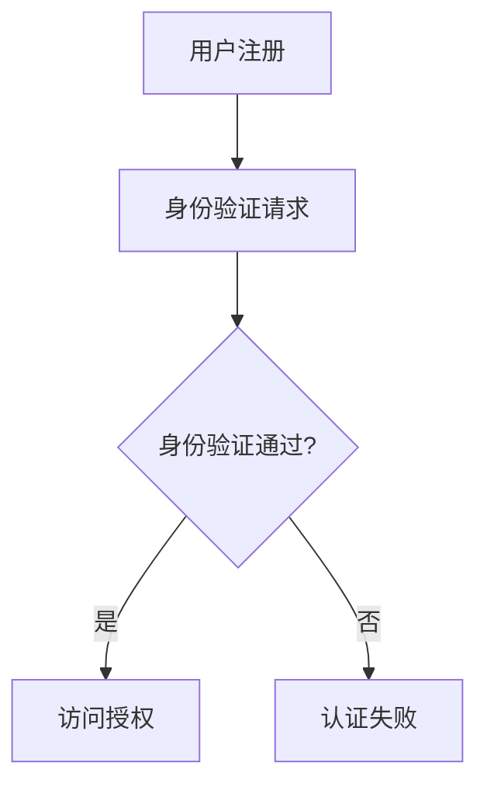

                 

**文章标题：数字公民身份认证：虚拟世界的社会契约**

**关键词：数字公民身份认证，社会契约，虚拟世界，安全性与隐私保护，技术挑战，算法与模型，架构设计，未来趋势**

**摘要：**
随着数字化的快速推进，虚拟世界的交互日益频繁，数字公民身份认证成为确保网络空间安全与信任的关键。本文深入探讨了数字公民身份认证的核心概念、技术挑战、主要模式、架构设计、算法原理以及未来发展趋势，旨在为读者提供一个全面而系统的理解框架，揭示其在虚拟世界中的社会契约本质。

## 引言与背景

### 1.1 随着数字化的崛起，数字公民身份的重要性日益增加

在过去的几十年里，数字化技术已经深刻改变了我们的生活方式和工作方式。从电子商务到社交媒体，从在线学习到远程工作，数字化的影响无处不在。随着数字化进程的加速，越来越多的个体和实体开始在网络空间中活跃，这引发了对数字公民身份认证的需求。

数字公民身份是指个体在虚拟世界中的存在和身份，它不仅包括个人信息的电子化，还包括对个人行为的记录和验证。在电子商务中，数字公民身份确保了交易的安全和可信；在社交媒体中，它保护了用户的隐私和安全；在远程工作中，它确保了员工的身份和工作效率。

### 1.2 当前数字公民身份认证的现状

当前，数字公民身份认证已经广泛应用于多个领域。常见的认证方式包括用户名和密码、生物识别技术（如指纹识别和面部识别）、多因素认证（如短信验证码和硬件令牌）等。尽管这些认证方法在一定程度上提高了安全性，但同时也面临着诸多挑战，如隐私泄露、用户体验差、技术标准不统一等问题。

### 1.3 社会契约的概念及其在虚拟世界中的应用

社会契约是建立和维护社会秩序的基础，它是一系列无形的规则和协议，旨在确保个体之间的互动和合作。在虚拟世界中，社会契约体现在数字公民身份认证的机制和流程中。通过数字公民身份认证，个体与虚拟世界中的其他参与者建立了信任关系，从而促进了信息的共享和互动。

## 数字公民身份认证的核心概念

### 2.1 数字公民身份的定义

数字公民身份是指个体在虚拟世界中的唯一标识，它通常由一组数字化的个人身份信息组成，如姓名、出生日期、身份证号码等。这些信息经过加密和验证，确保其在虚拟世界中的唯一性和不可篡改性。

### 2.2 身份认证的关键要素

身份认证是数字公民身份认证的核心，它包括以下关键要素：

- **用户识别**：确定用户的唯一性，通常通过用户名、邮箱地址等实现。
- **密码学认证**：通过加密算法确保数据的机密性和完整性。
- **多因素认证**：结合多种认证方式，提高安全性，如密码+短信验证码+生物识别。

### 2.3 社会契约的基本原理

社会契约是建立和维护数字公民身份认证的基础。它要求所有参与者遵守一套共同的规则和协议，以确保虚拟世界中的安全和信任。社会契约体现在以下几个方面：

- **责任与权利**：明确每个参与者在虚拟世界中的权利和责任，如用户有权要求隐私保护，平台有责任确保数据安全。
- **透明度与监管**：虚拟世界的运营者应公开其认证机制和流程，并接受公众监督，以提高透明度。
- **法律与合规**：数字公民身份认证应遵循相关法律法规，确保其合法性和合规性。

## 数字公民身份认证的技术挑战

### 3.1 安全性与隐私保护的权衡

在数字公民身份认证中，安全性和隐私保护是两个相互矛盾的目标。一方面，为了确保认证的安全，需要收集和存储大量的个人信息；另一方面，这些信息可能被恶意利用，导致隐私泄露。因此，如何在安全性和隐私保护之间找到平衡点，是数字公民身份认证面临的一大挑战。

### 3.2 技术标准与互操作性

数字公民身份认证涉及多种技术，如加密算法、生物识别技术、多因素认证等。不同技术之间的标准不统一，导致互操作性差。为了实现不同系统之间的无缝连接，需要制定统一的技术标准，以提高认证的效率和一致性。

### 3.3 全球范围内的法规和合规问题

数字公民身份认证在不同国家和地区的法律法规有所不同，这给全球范围内的认证带来了挑战。如何在遵循不同法规的前提下，实现全球范围内的认证互认，是数字公民身份认证需要解决的重要问题。

## 数字公民身份认证的主要模式

### 4.1 生物识别技术

生物识别技术是一种基于人体生物特征的认证方法，如指纹识别、面部识别、虹膜识别等。生物识别技术具有高安全性，但同时也面临着隐私保护、数据存储和处理等挑战。

### 4.2 密码学认证

密码学认证是通过加密算法确保数据的机密性和完整性。常见的密码学认证方法包括对称加密、非对称加密、哈希函数等。密码学认证方法具有简单易用、安全性高等优点，但同时也面临着密码破解、密码管理等问题。

### 4.3 多因素认证

多因素认证是一种结合多种认证方式的认证方法，如密码+短信验证码+生物识别。多因素认证方法提高了安全性，但也增加了用户的使用成本和复杂性。

### 4.4 信任服务提供商的角色

信任服务提供商是数字公民身份认证中的重要参与者，它们负责提供可信的认证服务和基础设施。信任服务提供商需要具备强大的技术能力、严格的隐私保护措施和完善的法律法规合规性。

## 数字公民身份认证的架构设计

### 5.1 整体架构设计原则

数字公民身份认证的架构设计应遵循以下原则：

- **安全性**：确保认证过程和数据的安全性。
- **可扩展性**：支持不同规模和复杂度的认证需求。
- **互操作性**：实现不同系统之间的无缝连接。
- **易用性**：提供简单易用的认证接口和流程。

### 5.2 系统模块划分与功能

数字公民身份认证系统通常包括以下几个模块：

- **用户注册与身份验证**：负责用户注册和身份验证功能。
- **数据存储与管理**：负责存储和管理用户身份信息。
- **认证算法与模型**：负责实现认证算法和模型。
- **接口与交互**：负责与其他系统进行接口和交互。

### 5.3 安全性和性能优化策略

在数字公民身份认证系统中，安全性和性能是两个重要的考量因素。为了确保系统的安全性，可以采取以下策略：

- **加密与签名**：使用加密算法和签名技术保护数据的安全。
- **权限控制**：通过权限控制确保不同用户和角色的访问权限。
- **监控与审计**：实时监控系统运行状态，并进行审计，以发现和解决潜在的安全问题。

为了优化系统的性能，可以采取以下策略：

- **分布式架构**：采用分布式架构提高系统的并发处理能力。
- **缓存与负载均衡**：使用缓存和负载均衡技术提高系统的响应速度和吞吐量。
- **数据库优化**：对数据库进行优化，如索引、分片等，以提高查询效率。

## 算法与模型

### 6.1 常用算法介绍

数字公民身份认证中常用的算法包括：

- **加密算法**：如RSA、AES等。
- **哈希函数**：如SHA-256等。
- **生物识别算法**：如基于神经网络的指纹识别算法、面部识别算法等。

### 6.2 认证算法的Mermaid流程图

以下是一个简单的认证算法Mermaid流程图：



### 6.3 数学模型与公式

在数字公民身份认证中，常用的数学模型和公式包括：

- **RSA加密算法**：加密公式为 \( c = m^e \mod n \)，解密公式为 \( m = c^d \mod n \)。
- **SHA-256哈希函数**：输入为 \( m \)，输出为 \( h = \text{SHA-256}(m) \)。

### 6.4 算法实现与性能分析

以下是一个简单的Python代码示例，用于实现RSA加密和解密：

```python
from Crypto.PublicKey import RSA
from Crypto.Cipher import PKCS1_OAEP
import base64

def generate_keys():
    key = RSA.generate(2048)
    private_key = key.export_key()
    public_key = key.publickey().export_key()
    return private_key, public_key

def encrypt_message(public_key, message):
    cipher = PKCS1_OAEP.new(RSA.import_key(public_key))
    encrypted_message = cipher.encrypt(message.encode('utf-8'))
    return base64.b64encode(encrypted_message).decode('utf-8')

def decrypt_message(private_key, encrypted_message):
    cipher = PKCS1_OAEP.new(RSA.import_key(private_key))
    decrypted_message = cipher.decrypt(base64.b64decode(encrypted_message))
    return decrypted_message.decode('utf-8')

# 生成密钥
private_key, public_key = generate_keys()

# 加密消息
message = "Hello, World!"
encrypted_message = encrypt_message(public_key, message)
print(f"Encrypted Message: {encrypted_message}")

# 解密消息
decrypted_message = decrypt_message(private_key, encrypted_message)
print(f"Decrypted Message: {decrypted_message}")
```

性能分析通常包括加密和解密的速度、内存占用、计算资源消耗等。通过调整算法实现和优化策略，可以提高算法的性能。

## 数字公民身份认证的实践案例

### 7.1 案例一：电子护照系统

电子护照系统是一种基于数字公民身份认证的技术，它将传统的纸质护照电子化，提高了护照的安全性和便捷性。电子护照系统通常包括用户注册、身份验证、电子签章等模块。

### 7.2 案例二：在线金融服务

在线金融服务领域广泛应用数字公民身份认证技术，以确保用户身份的真实性和交易的安全性。常见的认证模式包括用户名和密码、短信验证码、生物识别等。

### 7.3 案例三：数字身份平台

数字身份平台是一种集成了多种认证方式的综合平台，它为不同应用场景提供统一的身份认证服务。数字身份平台通常包括用户注册、认证管理、认证接口等模块。

## 数字公民身份认证的未来发展趋势

### 8.1 技术创新与变革

随着技术的不断进步，数字公民身份认证将迎来更多创新和变革。如区块链、人工智能、物联网等新技术将在数字公民身份认证中得到广泛应用，提高其安全性和便捷性。

### 8.2 法规和政策影响

随着数字公民身份认证的重要性日益增加，各国政府和国际组织将加强对数字公民身份认证的法规和政策制定，以确保其合法性和合规性。

### 8.3 对社会和经济的影响

数字公民身份认证将对社会和经济产生深远影响。在社会层面，它将提高网络空间的安全性和信任度；在经济层面，它将推动数字经济的发展和创新。

## 结论

数字公民身份认证是确保虚拟世界安全与信任的关键。通过深入探讨数字公民身份认证的核心概念、技术挑战、主要模式、架构设计、算法原理和未来发展趋势，本文揭示了其在虚拟世界中的社会契约本质。面对未来的发展，数字公民身份认证领域将面临更多机遇和挑战，我们需要不断探索和创新，以构建一个安全、可信的虚拟世界。

**作者：AI天才研究院/AI Genius Institute & 禅与计算机程序设计艺术 /Zen And The Art of Computer Programming**

