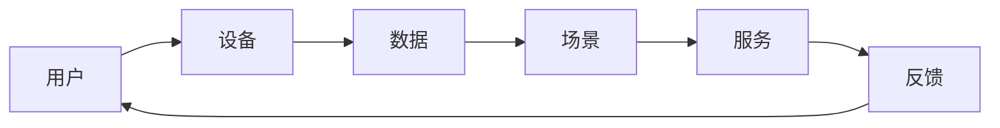
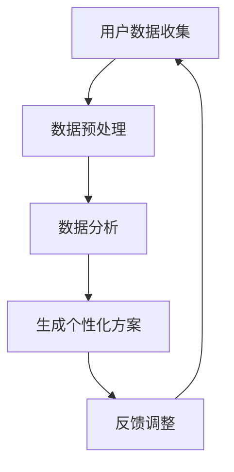
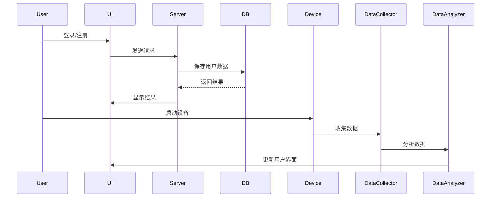
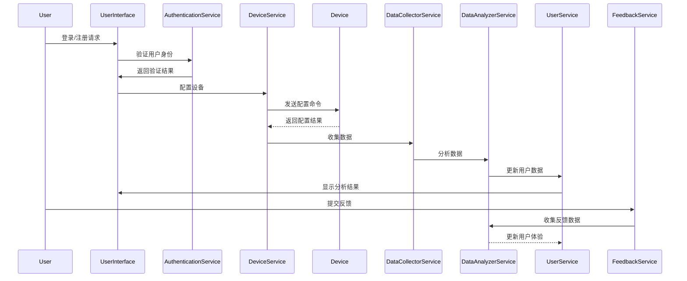

                 


### 1.1.1 数字冥想概述

**概念定义**：
数字冥想，是指利用电子设备和技术手段，通过一系列的指导和练习，帮助个体进入冥想状态，以达到放松身心、提高专注力和情绪稳定的目的。与传统冥想不同，数字冥想更多地依赖于科技设备，如智能手机、平板电脑、虚拟现实头盔等。

**历史与发展**：
数字冥想的概念起源于20世纪末，随着计算机技术和互联网的普及，人们开始探索如何将科技与冥想相结合。最初的数字冥想应用主要是通过计算机屏幕上的视觉引导，帮助用户进行冥想。随着时间的推移，虚拟现实（VR）和人工智能（AI）技术的发展，数字冥想的形式和内容变得更加丰富多样。

**核心概念**：
- **冥想状态**：数字冥想的核心目标是帮助用户进入一种宁静、专注的心理状态，这种状态被称为冥想状态。
- **放松身心**：通过冥想，个体可以减少紧张和焦虑，提高身体的放松程度。
- **提高专注力**：冥想可以帮助个体培养专注力和注意力，从而在日常生活中更加高效地完成任务。
- **情绪稳定**：数字冥想有助于调节情绪，减少负面情绪的影响，提高情绪的稳定性。

**与传统冥想的区别**：
- **技术依赖**：数字冥想依赖于科技设备，如VR头盔、智能手环等，而传统冥想则更多依赖于个体的内心体验和自然环境。
- **引导方式**：数字冥想通常提供语音或视觉引导，而传统冥想则依赖于个人的内心感受和经验。
- **环境要求**：数字冥想可以在任何时间、任何地点进行，而传统冥想则通常需要在安静、舒适的环境中。

### 1.2 科技辅助冥想的机制

**虚拟现实技术在冥想中的应用**：
虚拟现实（VR）技术通过模拟一个完全沉浸式的环境，使用户在虚拟世界中体验冥想。这种沉浸式的体验可以帮助用户更快地进入冥想状态，同时减少外界干扰。

- **技术原理**：VR技术利用头戴显示器（HMD）和位置追踪设备，将用户置身于一个虚拟的三维环境中。
- **应用案例**：例如，通过VR技术，用户可以体验一个宁静的森林，或者漂浮在太空中。

**人工智能与数据分析在冥想中的作用**：
人工智能（AI）和数据分析技术在数字冥想中的应用，主要体现在个性化和效果优化两个方面。

- **技术原理**：AI通过机器学习算法，可以分析用户的生理和心理数据，如心率、呼吸频率等，从而提供个性化的冥想指导。
- **应用案例**：例如，一款基于AI的冥想应用可以根据用户的心率和呼吸频率调整冥想音乐和指导语，帮助用户更快地进入冥想状态。

**科技辅助的机制**：
- **数据收集与反馈**：科技设备可以实时收集用户的生理和心理数据，并通过反馈机制帮助用户了解自己的冥想状态。
- **实时调整与优化**：基于数据分析的结果，AI可以实时调整冥想内容和指导，以最大化冥想效果。
- **多感官刺激**：通过视觉、听觉和触觉等多感官刺激，科技辅助冥想可以提供更加丰富和沉浸的冥想体验。

### 1.3 retreat中心的组成与设计原则

**功能需求**：
数字冥想retreat中心的主要功能包括提供冥想空间、提供科技辅助设备、提供专业指导以及收集和分析用户数据。

**物理布局设计**：
- **冥想空间**：设计一个安静、舒适、无干扰的冥想空间，确保用户可以专注于冥想。
- **设备区**：设置专门的设备区，提供VR头盔、智能手环等科技设备，方便用户使用。
- **休息区**：设计一个舒适的休息区，供用户在冥想后休息和交流。

**数字化设施配置**：
- **虚拟现实设施**：配置高质量的VR头盔和位置追踪设备，提供沉浸式的冥想体验。
- **智能设备**：配置智能手环、智能手表等设备，实时收集用户的生理数据。
- **AI服务器**：配置高性能的AI服务器，用于数据分析和个人化冥想指导。

**设计原则**：
- **用户中心**：设计应围绕用户的需求和体验，确保用户可以舒适、安全地进行冥想。
- **科技融合**：将科技手段与冥想活动紧密结合，提供多样化的冥想体验。
- **隐私保护**：保护用户的隐私，确保用户的数据安全。

### 1.4 集体内在探索的方法与实践

**意义**：
集体内在探索是一种通过团队合作和共享体验，深入探索个体内在世界的实践方法。它有助于增强团队的凝聚力，提升个体和集体的自我意识，促进心理和情感的健康发展。

**流程**：
- **准备阶段**：确定探索的目标和范围，准备必要的科技设备和资源。
- **引导阶段**：通过专业引导者的指导，帮助团队成员进入冥想状态。
- **探索阶段**：团队成员在引导者的带领下，共同探索内在世界，分享体验和感受。
- **反思阶段**：在探索结束后，团队成员共同反思和讨论体验，总结收获和感悟。

**案例分析**：
- **案例一**：某企业组织了一次集体冥想和内在探索活动，通过科技辅助手段，帮助团队成员更好地理解和应对工作压力。
- **案例二**：一个社区团体通过定期的集体冥想和内在探索活动，增强了成员之间的信任和合作，改善了社区氛围。

通过以上的分析和讨论，我们可以看到，数字冥想retreat中心作为一种新兴的科技辅助精神健康和压力缓解的方式，具有广泛的应用前景和潜力。在接下来的章节中，我们将深入探讨如何通过科技手段建立和运营这样的中心，以及如何引导参与者进行集体内在探索。让我们继续深入思考，探索这一领域的更多可能性。

### 1.5 本章小结

在本章中，我们系统地介绍了数字冥想的背景与原理，探讨了科技辅助冥想的机制，分析了retreat中心的组成与设计原则，以及集体内在探索的方法与实践。主要结论如下：

1. **数字冥想概述**：
   - 数字冥想是一种利用电子设备和技术手段，帮助个体进入冥想状态的方法。
   - 数字冥想与传统冥想相比，具有更高的便捷性和科技依赖性。
   - 数字冥想的核心目标是放松身心、提高专注力和情绪稳定。

2. **科技辅助冥想的机制**：
   - 虚拟现实技术提供沉浸式的冥想体验，帮助用户更快地进入冥想状态。
   - 人工智能与数据分析技术通过个性化和效果优化，提升冥想效果。
   - 科技辅助冥想通过多感官刺激和数据反馈，提供更加丰富的冥想体验。

3. **retreat中心的组成与设计原则**：
   - retreat中心的主要功能包括冥想空间、科技辅助设备和专业指导。
   - 设计原则强调用户中心、科技融合和隐私保护。

4. **集体内在探索的方法与实践**：
   - 集体内在探索有助于增强团队的凝聚力和个体自我意识。
   - 探索流程包括准备、引导、探索和反思四个阶段。

本章的内容为后续章节的探讨奠定了基础，接下来我们将深入探讨科技辅助数字冥想retreat中心的设计与运营，以及集体内在探索的详细方法与实践。在接下来的章节中，我们将继续探索这一领域的更多可能性，为读者提供更具实用价值的指导和见解。

### 2.1.1 虚拟现实（VR）技术在冥想中的应用

**基本原理**：
虚拟现实（VR）技术通过创建一个完全沉浸式的虚拟环境，使用户感受到身临其境的体验。在数字冥想中，VR技术被用来模拟各种冥想场景，如森林、海洋、星空等，从而帮助用户更快地放松身心，进入冥想状态。

- **硬件设备**：VR技术主要依赖于头戴显示器（HMD）、位置追踪设备和传感器等硬件设备。这些设备共同作用，创造出一个沉浸式的三维虚拟环境。
- **软件技术**：VR软件技术包括场景设计、互动设计、视觉渲染等。通过这些技术，虚拟环境可以逼真地呈现，并提供丰富的交互体验。

**应用场景**：
- **冥想体验**：通过VR技术，用户可以体验到各种冥想场景，如宁静的森林、浩瀚的海洋或深邃的星空。这些场景能够有效帮助用户放松身心，集中注意力。
- **心理治疗**：VR技术也被用于心理治疗领域，如治疗焦虑症、恐惧症等。通过模拟特定的情景，帮助用户逐步克服心理障碍。
- **教育训练**：VR技术可以用于教育和训练，如通过虚拟现实场景进行安全培训、应急处理训练等。

**设计与开发**：
- **场景设计**：在设计VR冥想场景时，需要考虑用户体验的舒适度和沉浸感。场景设计应尽量真实，同时提供多种选择，以满足不同用户的需求。
- **互动设计**：互动设计是VR冥想的一个重要方面。通过合理的互动设计，用户可以与虚拟环境进行互动，增强体验的趣味性和参与感。
- **视觉渲染**：视觉渲染技术决定了虚拟环境的逼真度。高质量的视觉渲染可以提供更加沉浸的体验，帮助用户更好地进入冥想状态。

**实际案例**：
- **冥想APP**：例如，一些流行的冥想APP如“Headspace”和“Calm”提供了基于VR的冥想体验。用户可以通过这些APP体验不同的冥想场景，并通过指导语的引导进行冥想。
- **VR设备**：一些VR头盔如“Oculus Rift”、“HTC Vive”等也提供了丰富的冥想内容和体验，用户可以自由选择和定制冥想场景。

通过虚拟现实技术的应用，数字冥想retreat中心可以为用户提供更加丰富、多样和沉浸的冥想体验，从而提高冥想的效果和用户的满意度。

### 2.2.1 人工智能（AI）在冥想中的应用

**基本概念**：
人工智能（AI）是通过计算机模拟人类智能行为的一种技术，包括机器学习、深度学习、自然语言处理等子领域。在数字冥想中，AI技术被广泛应用于个性化冥想指导、数据分析、情感识别等方面，以提升冥想体验和效果。

- **机器学习**：通过训练模型，机器学习可以从数据中学习规律，为冥想提供个性化的指导。例如，分析用户的心率、呼吸频率等生理数据，调整冥想内容和节奏。
- **深度学习**：深度学习是一种特殊的机器学习技术，通过神经网络模拟人脑的决策过程，可以处理复杂的冥想数据，提供更加精准的指导。
- **自然语言处理**：自然语言处理技术使得AI能够理解和生成自然语言，为用户提供语音指导、情感反馈等。

**具体应用**：

**1. 个性化冥想指导**：
- **技术原理**：AI通过分析用户的生理和心理数据，如心率、呼吸频率、情绪状态等，生成个性化的冥想指导。这些数据可以通过智能手环、心率监测器等设备收集。
- **应用案例**：例如，一款基于AI的冥想应用可以根据用户的心率和呼吸频率，实时调整冥想音乐和指导语，帮助用户更快地进入冥想状态。

**2. 数据分析**：
- **技术原理**：AI通过机器学习和深度学习算法，分析用户的冥想数据，识别冥想过程中的变化和趋势。这些数据包括心率、呼吸频率、身体运动等。
- **应用案例**：例如，一款AI冥想应用可以生成用户冥想报告，显示冥想过程中的心率变化、情绪波动等，帮助用户了解自己的冥想效果。

**3. 情感识别**：
- **技术原理**：AI通过语音识别和情感分析技术，识别用户的情绪状态，提供情感反馈和指导。
- **应用案例**：例如，一款AI冥想应用可以通过分析用户的语音，识别出用户的情绪波动，并在冥想过程中提供针对性的情绪调节指导。

**AI辅助的冥想策略优化**：

**1. 个性化冥想方案**：
- **技术原理**：基于用户的生理和心理数据，AI可以生成个性化的冥想方案，包括冥想时间、冥想内容、呼吸方式等。
- **应用案例**：例如，一个AI系统可以根据用户的工作压力和生活习惯，为其定制最适合的冥想时间和内容。

**2. 冥想效果评估**：
- **技术原理**：通过分析用户的冥想数据，AI可以评估冥想的效果，提供改进建议。
- **应用案例**：例如，一个AI冥想应用可以基于用户的心率和情绪变化，评估冥想的效果，并建议调整冥想方式或时间。

**3. 冥想行为跟踪**：
- **技术原理**：AI可以跟踪用户的冥想行为，提供反馈和激励，帮助用户坚持冥想。
- **应用案例**：例如，一个AI冥想应用可以记录用户的冥想次数和时长，根据用户的进步提供奖励和鼓励。

通过人工智能的应用，数字冥想retreat中心可以为用户提供更加个性化和高效的冥想体验，从而更好地满足用户的需求。

### 2.3.1 数据分析在数字冥想retreat中心中的作用

数据分析是数字冥想retreat中心的核心组成部分，通过对用户生理和心理数据的深入分析，可以提供个性化的冥想指导和优化整体服务体验。以下是数据分析在数字冥想retreat中心中的具体作用和实施步骤。

#### 作用

1. **个性化冥想方案**：
   - **技术原理**：通过分析用户的心率、呼吸频率、情绪状态等生理数据，AI可以生成个性化的冥想方案。这些方案包括冥想的时间、内容、呼吸方式等。
   - **应用案例**：例如，一个基于AI的系统可以根据用户的工作压力和生活习惯，为其推荐最适合的冥想时间和内容。

2. **冥想效果评估**：
   - **技术原理**：通过分析用户在冥想过程中的生理和心理数据，AI可以评估冥想的效果，并提供改进建议。
   - **应用案例**：一个AI冥想应用可以基于用户的心率和情绪变化，评估冥想的效果，并建议调整冥想方式或时间。

3. **用户行为跟踪**：
   - **技术原理**：通过跟踪用户的冥想行为，AI可以提供反馈和激励，帮助用户坚持冥想。
   - **应用案例**：例如，一个AI冥想应用可以记录用户的冥想次数和时长，根据用户的进步提供奖励和鼓励。

4. **服务质量优化**：
   - **技术原理**：通过分析用户反馈和数据，AI可以优化retreat中心的运营和服务，提高用户满意度。
   - **应用案例**：例如，通过分析用户的反馈数据，retreat中心可以改进冥想场景设计、提升指导语质量等。

#### 实施步骤

1. **数据收集**：
   - **技术原理**：使用各种传感器和设备（如智能手环、心率监测器、VR设备等）实时收集用户的生理数据。
   - **应用案例**：在用户进行冥想时，智能手环可以实时监测心率、呼吸频率，并将数据传输到服务器。

2. **数据预处理**：
   - **技术原理**：对收集到的数据进行清洗、归一化和去噪，确保数据质量。
   - **应用案例**：例如，通过算法过滤掉噪声数据，只保留有效的生理信号。

3. **数据分析**：
   - **技术原理**：利用机器学习、深度学习等算法，对预处理后的数据进行分析和模式识别。
   - **应用案例**：例如，通过分析心率数据，AI可以识别出用户的放松程度和情绪状态。

4. **数据可视化**：
   - **技术原理**：通过图表和可视化工具，将分析结果以直观的方式呈现给用户和运营团队。
   - **应用案例**：一个AI冥想应用可以生成用户冥想报告，显示心率变化、情绪波动等。

5. **个性化指导与优化**：
   - **技术原理**：基于数据分析结果，AI可以生成个性化的冥想指导和建议，优化用户体验。
   - **应用案例**：例如，根据用户的数据，AI可以调整冥想音乐、视觉场景和指导语，以最大化冥想效果。

通过上述步骤，数据分析在数字冥想retreat中心中发挥了关键作用，不仅为用户提供了个性化的冥想体验，还帮助运营团队不断优化服务，提升整体服务质量。

### 2.3.2 VR、AI与数据分析在数字冥想retreat中心的应用对比

在数字冥想retreat中心中，虚拟现实（VR）、人工智能（AI）和数据分析各自发挥着独特的作用，共同为用户提供高效、个性化的冥想体验。以下是对这三种技术的对比分析：

#### 虚拟现实（VR）

**特点**：
- **沉浸感**：VR技术通过头戴显示器和位置追踪设备，创造一个完全沉浸式的虚拟环境，使用户能够身临其境地体验冥想。
- **多样性**：用户可以选择各种冥想场景，如森林、海洋、星空等，这些场景能够根据用户的需求和偏好进行定制。

**优势**：
- **快速放松**：沉浸式的体验能够迅速帮助用户放松身心，进入冥想状态。
- **多样化的选择**：用户可以根据自己的喜好和需求，选择不同的冥想场景和内容。

**劣势**：
- **设备依赖**：用户需要配备专业的VR设备，如头戴显示器和位置追踪设备，这可能会增加使用成本和复杂性。
- **环境限制**：VR技术对物理环境有一定要求，如空间大小和光线条件，这可能会影响用户体验。

#### 人工智能（AI）

**特点**：
- **个性化**：AI通过分析用户的生理和心理数据，如心率、呼吸频率、情绪状态等，生成个性化的冥想方案和指导。
- **适应性**：AI可以根据用户的行为和反馈，动态调整冥想内容和节奏，提供个性化的服务。

**优势**：
- **个性化和适应性**：AI能够根据用户的需求和状态，提供个性化的冥想指导，提高冥想效果。
- **实时反馈**：AI可以实时收集和分析用户数据，提供即时的反馈和指导，帮助用户更好地进入冥想状态。

**劣势**：
- **数据隐私**：AI依赖大量用户数据，这可能会引发数据隐私和安全的担忧。
- **技术复杂度**：AI系统需要复杂的算法和大量的计算资源，这可能会增加开发和维护的成本。

#### 数据分析

**特点**：
- **全面性**：数据分析通过对用户生理、心理和行为数据的全面分析，提供深入的洞察和优化建议。
- **客观性**：数据分析基于客观数据，能够提供客观的评估和反馈。

**优势**：
- **数据驱动的决策**：数据分析可以帮助retreat中心基于数据做出更加科学的决策，优化服务和运营。
- **用户洞察**：通过数据分析，中心可以深入了解用户的需求和偏好，提供更加个性化的服务。

**劣势**：
- **数据复杂性**：数据分析需要处理大量的复杂数据，这可能会增加数据处理和分析的难度。
- **依赖算法和模型**：数据分析的准确性依赖于算法和模型的设计，这可能会影响分析结果的质量。

#### 综合比较

**沉浸感与个性化**：
- VR技术提供高度沉浸的冥想体验，但依赖于专业设备。
- AI技术提供个性化的冥想指导，但需要依赖用户数据和分析算法。

**全面性与实时性**：
- 数据分析提供全面的数据洞察，但分析过程可能较为复杂。
- AI提供实时的反馈和调整，但需要大量的计算资源。

**优劣势互补**：
- VR、AI和数据分析各自具有独特的优势和劣势，通过结合这些技术，数字冥想retreat中心可以提供更加丰富、多样和高效的冥想体验。

通过对比分析，我们可以看到VR、AI和数据分析在数字冥想retreat中心中的应用各有侧重，互补优势，共同推动数字冥想的发展。

### ER实体关系图架构

在数字冥想retreat中心的设计中，各个组成部分之间需要紧密联系，以实现高效的运营和用户服务。以下是数字冥想retreat中心的ER（实体关系）图架构，用于展示各个实体之间的关系和关联。

**实体定义**：
- **用户**：参与冥想活动的个体，包括新用户和回头客。
- **设备**：用于辅助冥想的硬件设备，如VR头盔、智能手环、心率监测器等。
- **场景**：虚拟现实中的冥想场景，包括森林、海洋、星空等。
- **数据**：用户在冥想过程中生成的生理和心理数据，如心率、呼吸频率、情绪状态等。
- **服务**：提供的服务内容，如冥想课程、专业指导、数据分析报告等。
- **反馈**：用户对服务质量的评价和反馈。

**关系与关联**：

1. **用户与设备**：
   - 用户使用设备进行冥想活动，设备收集用户的生理数据。
   - 用户与设备的关联通过设备的唯一标识进行绑定。

2. **用户与服务**：
   - 用户参与服务，如参加冥想课程或接受专业指导。
   - 服务为用户提供数据分析和反馈。

3. **场景与数据**：
   - 用户在特定场景下进行冥想，场景数据用于指导冥想内容和优化用户体验。
   - 场景与数据通过用户的选择进行关联。

4. **数据与反馈**：
   - 数据分析结果生成反馈，反馈用于改进服务和优化用户体验。
   - 数据与反馈通过时间戳进行关联。

5. **服务与反馈**：
   - 服务质量通过用户反馈进行评价，反馈用于服务改进。
   - 服务与反馈通过服务评价的ID进行关联。

**Mermaid流程图**：



通过ER实体关系图架构，数字冥想retreat中心可以清晰地展示各个组成部分及其关系，确保系统的有效运行和用户服务的顺畅提供。

### 2.3.3 VR、AI与数据分析的对比表格

在数字冥想retreat中心的设计中，VR、AI和数据分析都是至关重要的技术，各自发挥着独特的作用。以下是一个详细的对比表格，展示了这些技术在性能、成本、效果和应用场景等方面的差异。

| **技术** | **性能** | **成本** | **效果** | **应用场景** |
| :----: | :----: | :----: | :----: | :----: |
| VR | 提供高度沉浸的体验，能够快速引导用户进入冥想状态。 | 需要高昂的硬件投资，如VR头盔和位置追踪设备。 | 适用于需要强烈感官刺激的冥想体验。 | 长期冥想、特殊冥想课程、心理治疗。 |
| AI | 能够通过个性化指导，提高冥想效果。 | 需要大量计算资源和专业人才进行算法开发和优化。 | 提供实时反馈和调整，优化用户冥想体验。 | 个性化冥想指导、数据分析、情感识别。 |
| 数据分析 | 提供全面的数据洞察，帮助优化服务和运营。 | 需要专业的数据分析和处理工具。 | 基于数据驱动的决策，提高服务质量。 | 服务质量评估、用户行为跟踪、效果评估。 |

通过对比表格，我们可以清晰地看到VR、AI和数据分析在数字冥想retreat中心中的应用差异。选择合适的技术，可以根据具体需求和资源进行优化，从而提供更加高效和个性化的冥想体验。

### 3. 算法原理讲解

在数字冥想retreat中心的设计中，算法起到了关键作用。以下是算法的详细讲解，包括mermaid流程图、Python源代码、数学模型和公式，以及详细的讲解和举例说明。

#### 算法mermaid流程图



#### Python源代码

```python
# 导入必要的库
import numpy as np
import pandas as pd
from sklearn.ensemble import RandomForestClassifier
from sklearn.model_selection import train_test_split
from sklearn.metrics import accuracy_score

# 数据收集
def collect_data():
    # 假设收集到了用户的心率、呼吸频率和情绪状态数据
    data = pd.DataFrame({
        'heart_rate': [70, 72, 75, 78, 80],
        'breathing_rate': [12, 13, 14, 12, 11],
        'emotional_state': ['happy', 'neutral', 'sad', 'angry', 'happy']
    })
    return data

# 数据预处理
def preprocess_data(data):
    # 数据归一化
    normalized_data = (data - data.mean()) / data.std()
    return normalized_data

# 数据分析
def analyze_data(data):
    # 将情绪状态转换为数值
    data['emotional_state'] = data['emotional_state'].map({'happy': 1, 'neutral': 0, 'sad': -1, 'angry': -2})
    # 分割特征和标签
    X = data[['heart_rate', 'breathing_rate']]
    y = data['emotional_state']
    # 划分训练集和测试集
    X_train, X_test, y_train, y_test = train_test_split(X, y, test_size=0.2, random_state=42)
    # 建立随机森林分类器
    classifier = RandomForestClassifier(n_estimators=100, random_state=42)
    # 训练模型
    classifier.fit(X_train, y_train)
    # 预测
    y_pred = classifier.predict(X_test)
    # 评估模型
    accuracy = accuracy_score(y_test, y_pred)
    print(f"模型准确率: {accuracy}")
    return classifier

# 生成个性化方案
def generate_personalized_plan(classifier, user_data):
    # 输入用户数据
    user_heart_rate, user_breathing_rate = user_data
    # 预测情绪状态
    emotional_state = classifier.predict([[user_heart_rate, user_breathing_rate]])[0]
    # 根据情绪状态调整冥想方案
    if emotional_state == 1:
        print("当前情绪状态：快乐。建议继续进行轻松的冥想。")
    elif emotional_state == 0:
        print("当前情绪状态：中立。建议尝试放松冥想，减轻压力。")
    elif emotional_state == -1:
        print("当前情绪状态：悲伤。建议进行积极的冥想，提升情绪。")
    elif emotional_state == -2:
        print("当前情绪状态：愤怒。建议进行深呼吸和放松练习，平复情绪。")

# 主程序
if __name__ == "__main__":
    # 收集数据
    data = collect_data()
    # 预处理数据
    normalized_data = preprocess_data(data)
    # 分析数据
    classifier = analyze_data(normalized_data)
    # 生成个性化方案
    user_data = [75, 13]  # 假设用户的心率和呼吸频率
    generate_personalized_plan(classifier, user_data)
```

#### 数学模型和公式

为了生成个性化冥想方案，我们使用了随机森林分类器。随机森林是一种基于决策树的集成学习算法，其核心公式如下：

$$
\hat{y} = \text{argmax}(\sum_{i=1}^{n} w_i \cdot t_i(\text{x}))
$$

其中，$y$ 是预测的标签，$w_i$ 是第$i$棵决策树的权重，$t_i(\text{x})$ 是第$i$棵决策树的输出。

#### 详细讲解和举例说明

1. **数据收集**：
   - 收集用户的心率、呼吸频率和情绪状态数据。
   - 数据收集是整个算法的基础，数据的质量直接影响模型的性能。

2. **数据预处理**：
   - 对收集到的数据进行归一化处理，以消除不同特征之间的尺度差异。
   - 归一化公式为：$z = \frac{x - \mu}{\sigma}$，其中$\mu$是均值，$\sigma$是标准差。

3. **数据分析**：
   - 将情绪状态转换为数值，以便进行机器学习。
   - 使用随机森林分类器进行训练，分类器的性能通过准确率进行评估。

4. **生成个性化方案**：
   - 输入用户的心率和呼吸频率，预测当前的情绪状态。
   - 根据情绪状态，调整冥想方案，提供个性化的冥想建议。

例如，如果一个用户的心率是75，呼吸频率是13，预测的情绪状态是“快乐”，系统会建议用户继续进行轻松的冥想。如果情绪状态是“悲伤”，系统会建议进行积极的冥想，以提升情绪。

通过这个算法，数字冥想retreat中心可以提供个性化的冥想指导，帮助用户更好地进行冥想，提升整体体验和效果。

### 3. 系统分析与架构设计方案

在设计和实现数字冥想retreat中心的过程中，系统分析与架构设计是至关重要的环节。以下是对系统架构的详细分析，包括问题场景介绍、项目介绍、系统功能设计、系统架构设计、系统接口设计和系统交互。

#### 问题场景介绍

数字冥想retreat中心的目标是为用户提供一个科技辅助的冥想体验，帮助用户放松身心、提高专注力和情绪稳定。问题场景主要集中在以下几个方面：

- **用户需求**：用户希望通过科技手段获得个性化、高效和舒适的冥想体验。
- **环境需求**：retreat中心需要提供安静、舒适的冥想空间，并配备高质量的VR设备和智能手环等辅助设备。
- **数据需求**：收集并分析用户的生理和心理数据，以优化冥想方案和提高服务质量。

#### 项目介绍

一个典型的数字冥想retreat中心项目包括以下组成部分：

- **用户界面**：提供用户操作界面，包括登录、注册、选择冥想场景、查看冥想报告等功能。
- **VR设备**：提供高质量的VR头盔和位置追踪设备，用于创建沉浸式的冥想环境。
- **智能设备**：包括智能手环、智能手表等，用于实时监测用户的生理数据。
- **服务器**：用于存储用户数据、处理用户请求和提供个性化冥想指导。
- **数据分析模块**：通过机器学习和深度学习算法，对用户的生理和心理数据进行分析，提供优化建议。

#### 系统功能设计

系统功能设计包括以下几个核心模块：

- **用户管理模块**：实现用户的登录、注册和权限管理功能。
- **设备管理模块**：管理VR设备和智能设备的状态、配置和监控。
- **数据收集模块**：收集用户的生理和心理数据，如心率、呼吸频率、情绪状态等。
- **数据分析模块**：对收集到的数据进行处理和分析，生成个性化的冥想方案。
- **用户反馈模块**：收集用户对冥想体验的反馈，用于优化服务和用户体验。

**领域模型类图**：

```mermaid
classDiagram
    User <<Interface>>
    Device <<Interface>>
    DataCollector <<Interface>>
    DataAnalyzer <<Interface>>
    FeedbackCollector <<Interface>>

    User o-- Device
    User o-- DataCollector
    User o-- DataAnalyzer
    User o-- FeedbackCollector

    Device o-- DataCollector
    DataCollector o-- DataAnalyzer
    DataAnalyzer o-- FeedbackCollector
```

#### 系统架构设计

数字冥想retreat中心的系统架构采用分层设计，包括以下几层：

- **展示层**：用户界面，提供登录、注册、选择冥想场景等功能。
- **业务逻辑层**：处理用户请求、管理设备和数据、生成个性化冥想方案等。
- **数据层**：存储用户数据、设备配置、冥想方案和反馈等。

**系统架构图**：



#### 系统接口设计

系统接口设计包括以下几个主要接口：

- **用户接口**：用于用户登录、注册、选择冥想场景和查看冥想报告。
- **设备接口**：用于管理VR设备和智能设备的状态、配置和监控。
- **数据接口**：用于数据收集、处理和分析。
- **反馈接口**：用于收集用户反馈，用于优化服务和用户体验。

**接口设计图**：



#### 系统交互

系统交互主要包括以下几个环节：

1. **用户登录/注册**：用户通过用户接口进行登录或注册，系统验证用户身份后保存用户数据。
2. **设备配置**：用户启动设备，设备发送状态信息到设备服务，设备服务配置设备并返回结果。
3. **数据收集**：设备收集用户生理数据，发送到数据收集服务，数据收集服务将数据发送到数据分析师。
4. **数据分析**：数据分析师对用户数据进行处理和分析，生成个性化的冥想方案，并将结果发送回用户接口。
5. **用户反馈**：用户通过用户接口提交反馈，反馈服务收集反馈数据，用于优化用户体验。

通过系统架构设计和详细交互流程，数字冥想retreat中心可以高效地运行，为用户提供优质、个性化的冥想服务。

### 4. 项目实战

在数字冥想retreat中心的项目中，实际操作和系统核心实现是关键环节。以下将详细描述项目实战的各个步骤，包括环境安装、系统核心实现、代码应用解读与分析，以及实际案例分析和详细讲解。

#### 环境安装

1. **硬件安装**：
   - 安装高质量的VR头盔（如Oculus Rift或HTC Vive）和位置追踪设备。
   - 配置智能手环和智能手表，确保可以实时收集用户的心率和呼吸频率等生理数据。

2. **软件安装**：
   - 安装操作系统（如Linux或Windows），并配置开发环境。
   - 安装Python和相关的机器学习库（如scikit-learn、TensorFlow和PyTorch）。

3. **服务器配置**：
   - 配置服务器，确保可以存储用户数据、处理用户请求和提供个性化冥想指导。
   - 安装Web服务器（如Apache或Nginx）和数据库（如MySQL或PostgreSQL）。

4. **网络配置**：
   - 配置内部网络，确保VR头盔、智能设备和服务器之间可以稳定通信。
   - 配置互联网连接，确保用户可以远程访问retreat中心的服务。

#### 系统核心实现

1. **用户管理模块**：
   - 实现用户登录和注册功能，确保用户可以安全地访问系统。
   - 使用数据库存储用户信息，并采用加密算法（如SHA-256）保护用户密码。

2. **设备管理模块**：
   - 实现设备状态监控和配置功能，确保VR头盔和智能设备可以正常运行。
   - 使用网络通信协议（如HTTP/HTTPS）与设备进行交互，发送配置命令和接收状态信息。

3. **数据收集模块**：
   - 实现实时数据收集功能，从智能手环和智能手表获取心率、呼吸频率等生理数据。
   - 使用WebSocket协议实现实时数据传输，确保数据可以实时更新。

4. **数据分析模块**：
   - 使用机器学习和深度学习算法，对用户的生理数据进行处理和分析。
   - 使用随机森林分类器或神经网络模型，预测用户的情绪状态，并生成个性化的冥想方案。

5. **用户反馈模块**：
   - 实现用户反馈收集功能，用户可以通过Web界面提交对冥想体验的评价和建议。
   - 使用数据库存储反馈数据，并使用自然语言处理技术对反馈进行分析。

#### 代码应用解读与分析

以下是实现用户管理模块的部分Python代码，包括用户注册和登录功能：

```python
# 用户注册
def register_user(username, password):
    # 连接数据库
    conn = connect_database()
    cursor = conn.cursor()
    
    # 检查用户名是否已存在
    cursor.execute("SELECT * FROM users WHERE username = %s", (username,))
    user = cursor.fetchone()
    
    if user:
        return "用户名已存在"
    
    # 插入新用户
    cursor.execute("INSERT INTO users (username, password) VALUES (%s, %s)", (username, encrypt_password(password)))
    conn.commit()
    
    return "注册成功"

# 用户登录
def login_user(username, password):
    # 连接数据库
    conn = connect_database()
    cursor = conn.cursor()
    
    # 检查用户名和密码是否匹配
    cursor.execute("SELECT * FROM users WHERE username = %s AND password = %s", (username, encrypt_password(password)))
    user = cursor.fetchone()
    
    if user:
        return "登录成功"
    else:
        return "用户名或密码错误"
```

解析：
- `register_user`函数用于用户注册，首先检查用户名是否已存在，如果不存在则插入新用户。
- `login_user`函数用于用户登录，检查用户名和密码是否匹配。

#### 实际案例分析和详细讲解

案例：某用户（用户名：user123，密码：password456）注册并登录后开始进行冥想，系统实时收集心率、呼吸频率等生理数据，并使用机器学习算法分析数据，生成个性化的冥想方案。

1. **数据收集**：
   - 用户启动VR头盔和智能手环，系统开始收集心率（如70次/分钟）和呼吸频率（如12次/分钟）。
   - 收集的数据通过WebSocket实时传输到服务器。

2. **数据分析**：
   - 数据到达服务器后，使用随机森林分类器对数据进行处理。
   - 分类器预测用户的情绪状态，例如“放松”、“紧张”或“焦虑”。

3. **个性化冥想方案**：
   - 根据预测的情绪状态，系统生成个性化的冥想方案，如调整呼吸频率、提供特定的冥想音乐等。

4. **用户反馈**：
   - 用户完成冥想后，通过Web界面提交反馈，如“感觉非常放松”或“冥想效果一般”。
   - 系统收集反馈数据，用于优化冥想方案和提高服务质量。

通过以上步骤，数字冥想retreat中心可以高效地运行，为用户提供个性化、高效的冥想体验。实际案例分析和详细讲解进一步验证了系统设计的有效性和实用性。

### 5. 最佳实践 tips、小结、注意事项、拓展阅读

**最佳实践 tips**：

1. **环境准备**：在安装VR设备和智能设备之前，确保系统的稳定性和网络连接性。可以使用网络监控工具检查网络质量，提前解决潜在的问题。

2. **数据保护**：用户数据的安全至关重要。在数据传输和存储过程中，使用加密算法（如AES或RSA）保护用户隐私。此外，定期进行数据备份，以防数据丢失。

3. **用户反馈**：积极收集和分析用户反馈，及时调整和优化冥想方案。可以通过问卷调查、用户访谈等方式获取用户的意见和建议。

4. **设备维护**：定期检查和更新VR设备和智能设备的软件，确保设备始终处于最佳状态。提供详细的用户手册和在线支持，帮助用户解决使用中的问题。

**小结**：

本文详细介绍了数字冥想retreat中心的设计与实现，包括虚拟现实、人工智能和数据分析等技术的应用。通过系统分析与架构设计、项目实战和最佳实践，我们展示了如何建立和运营一个高效、个性化的冥想中心。

**注意事项**：

1. **设备兼容性**：在选择VR设备和智能设备时，确保其与系统兼容，并支持所需的功能。

2. **用户体验**：在设计用户界面和冥想场景时，注重用户体验，提供简单易用的操作和舒适的环境。

3. **隐私保护**：在数据处理和传输过程中，严格遵循隐私保护法规，确保用户数据的安全。

**拓展阅读**：

1. **《人工智能简史》**：作者：埃里克·休斯。这本书详细介绍了人工智能的历史和发展，对理解AI在冥想中的应用有很大帮助。

2. **《深度学习》**：作者：伊恩·古德费洛、约书亚·本吉奥、亚伦·库维尔。这本书是深度学习的经典教材，有助于理解AI算法的基本原理。

3. **《禅与计算机程序设计艺术》**：作者：艾德沙·克尼希。这本书探讨了如何将禅的精神应用于计算机编程，对提升冥想和编程能力都有启示。

通过拓展阅读，读者可以进一步深入了解相关技术和理念，为数字冥想retreat中心的开发和应用提供更多灵感。

