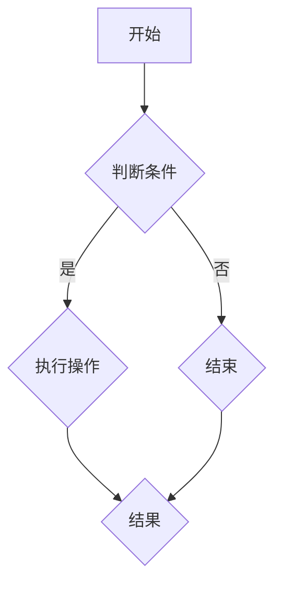
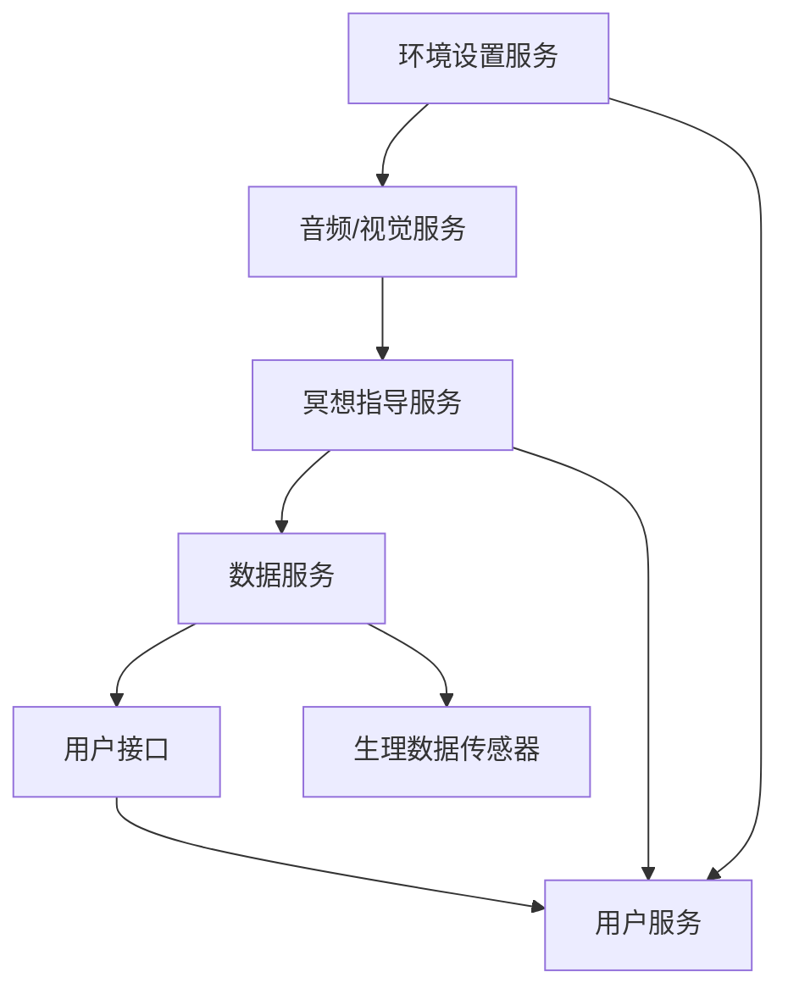
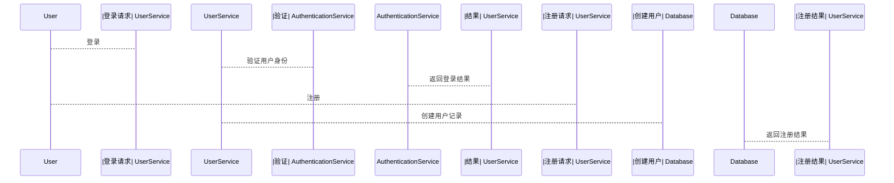

                 


## 让我们一起深入思考：数字冥想retreat：科技辅助的内在探索

### 引言：数字冥想与现代科技

数字冥想retreat：科技辅助的内在探索是一本关于如何通过科技手段辅助人们进行内在探索的书籍。在现代社会中，人们的生活节奏越来越快，压力越来越大，导致很多人开始寻求通过冥想来缓解压力、提高生活质量。然而，传统的冥想方法可能并不适合所有人，尤其是那些忙碌于科技行业的人。因此，科技辅助冥想应运而生，通过将科技与冥想相结合，帮助人们更好地进行内在探索。

### 什么是数字冥想？

数字冥想是一种结合了传统冥想方法和现代科技手段的冥想形式。它通常包括以下几个关键要素：

1. **静坐**：这是数字冥想的基础，通过静坐来达到身心放松的状态。
2. **音乐与声音**：使用特定的音乐或声音来帮助人们集中注意力，进入冥想状态。
3. **科技辅助工具**：包括各种智能设备、应用程序和虚拟现实技术等，用于监测和分析冥想过程，提供个性化的冥想指导。

### 科技在冥想中的作用

科技在冥想中扮演着重要的角色，主要体现在以下几个方面：

1. **数据收集与分析**：通过智能设备（如脑波监测器、心率传感器等）收集身体和大脑的数据，然后使用数据分析工具对这些数据进行处理和分析，以便更好地了解冥想的效果和过程。
2. **个性化指导**：基于数据分析和用户反馈，科技辅助冥想工具可以提供个性化的冥想指导，帮助用户找到最适合他们的冥想方式。
3. **沉浸式体验**：虚拟现实技术可以创建一个完全沉浸式的冥想环境，使用户更容易进入冥想状态。

### 数字冥想的历史与发展

数字冥想并不是一个新兴的概念，它的历史可以追溯到几个世纪以前。在古代，人们就已经开始使用各种方法来进行冥想，如瑜伽、禅修等。随着科技的发展，数字冥想逐渐得到了更多人的关注和认可。

近年来，随着智能设备和互联网技术的普及，数字冥想的应用场景也越来越广泛。人们可以通过智能手机、平板电脑或电脑上的应用程序进行数字冥想，而不再需要依赖于传统的冥想场所和方式。

### 数字冥想的优势

数字冥想相比传统冥想具有以下优势：

1. **便捷性**：数字冥想可以在任何时间、任何地点进行，不受场地和时间的限制。
2. **个性化**：通过数据分析和个性化指导，数字冥想可以更好地满足用户的需求。
3. **沉浸式体验**：虚拟现实技术可以为用户提供一个完全沉浸式的冥想体验。

### 数字冥想的挑战

尽管数字冥想具有许多优势，但它也面临着一些挑战：

1. **技术依赖**：过度依赖技术可能导致用户失去对传统冥想方法的兴趣和掌握。
2. **隐私问题**：在数据收集和分析过程中，用户的数据安全和隐私保护是一个重要的问题。
3. **效果评估**：如何准确评估数字冥想的效果，仍是一个有待深入研究的问题。

### 数字冥想的未来展望

随着科技的不断进步，数字冥想有望在未来得到更广泛的应用。未来，我们可以期待：

1. **更智能的辅助工具**：智能设备将更加智能，能够更好地理解用户的需求并提供个性化的指导。
2. **更深入的科学研究**：通过对数字冥想的研究，我们可以更好地理解冥想对身体和大脑的影响，从而开发出更有效的冥想方法。
3. **更广泛的受众**：随着数字冥想的普及，将有更多的人受益于这种冥想方式。

### 结论

数字冥想retreat：科技辅助的内在探索为我们提供了一种全新的冥想方式，它结合了传统冥想的方法和现代科技的手段，为人们提供了一个更便捷、更个性化的冥想体验。通过这本书，我们不仅可以了解到数字冥想的历史、现状和发展趋势，还可以学习到如何设计和实现一个科技辅助冥想的系统。让我们一起深入思考，探索数字冥想的无限可能性。

### 关键词

- 数字冥想
- 科技辅助
- 内在探索
- 机器学习
- 数据分析
- 虚拟现实

### 摘要

本文从数字冥想的历史、现状、科技辅助的背景和重要性出发，详细介绍了数字冥想的核心概念和科技在其中的作用。通过分析数字冥想的优势和挑战，以及展望其未来发展趋势，本文旨在为读者提供一个全面而深入的理解，并激发对科技辅助冥想更深层次的思考。

---

### 目录大纲

---

# 《数字冥想retreat：科技辅助的内在探索》

## **关键词**：数字冥想、科技辅助、内在探索、机器学习、数据分析、虚拟现实

## **摘要**

本文旨在探讨数字冥想作为一种结合传统冥想方法和现代科技手段的新型冥想形式。通过分析数字冥想的历史、现状、科技辅助的背景和重要性，本文详细介绍了数字冥想的核心概念和科技在其中的作用。文章还将探讨数字冥想的优势、挑战及其未来发展，为读者提供一个全面而深入的理解，并激发对科技辅助冥想更深层次的思考。

---

## **第一部分：数字冥想与科技辅助**

### **第1章：数字冥想概述**

- **1.1 数字冥想的起源与发展**
- **1.2 科技辅助冥想的背景与重要性**
- **1.3 数字冥想的核心概念与分类**

### **第2章：科技在冥想中的应用**

- **2.1 机器学习与冥想**
- **2.2 数据分析在冥想中的应用**
- **2.3 虚拟现实与冥想**

### **第3章：算法原理讲解**

- **3.1 常见算法在冥想中的应用**
- **3.2 算法原理与数学模型**
- **3.3 算法示例分析**

### **第4章：数学模型与公式讲解**

- **4.1 数学模型在冥想中的应用**
- **4.2 公式讲解与LaTeX排版**

### **第5章：系统分析与架构设计**

- **5.1 冥想系统设计概述**
- **5.2 系统功能设计**
- **5.3 系统架构设计**
- **5.4 系统接口设计与交互**

### **第6章：项目实战**

- **6.1 项目环境搭建**
- **6.2 系统核心实现**
- **6.3 案例分析**
- **6.4 项目总结**

### **第7章：最佳实践与技巧**

- **7.1 实践中的经验和教训**
- **7.2 最佳实践分享**
- **7.3 注意事项**

### **第8章：总结与拓展阅读**

- **8.1 全书内容回顾**
- **8.2 拓展阅读资源**

---

## **第二部分：深入探讨数字冥想**

---

### **第1章：数字冥想概述**

#### **1.1 数字冥想的起源与发展**

数字冥想这一概念并不是近年来才出现的。事实上，冥想作为一种精神实践，自古以来就在世界各地有着广泛的应用。在佛教、印度教、道教和中国传统医学等领域，冥想都被视为一种重要的修炼方法。然而，随着现代社会的发展，科技与冥想开始融合，数字冥想应运而生。

数字冥想的概念最早可以追溯到20世纪末期。随着计算机和互联网技术的普及，人们开始探索如何使用科技手段来辅助冥想。例如，使用脑波监测器来记录冥想过程中的大脑活动，使用应用程序来提供冥想指导和反馈。这种新兴的冥想形式很快得到了广泛的关注和应用。

近年来，随着人工智能、虚拟现实和增强现实等技术的不断发展，数字冥想的应用场景也越来越广泛。人们可以通过智能手机、平板电脑或电脑上的应用程序进行数字冥想，而不再需要依赖于传统的冥想场所和方式。这种便捷性和个性化特点，使得数字冥想成为了一种深受欢迎的冥想形式。

#### **1.2 科技辅助冥想的背景与重要性**

科技辅助冥想的背景可以追溯到计算机科学和认知科学的快速发展。在计算机科学领域，人们开始研究如何使用计算机程序来模拟人类的思维过程。在认知科学领域，人们开始研究人类大脑的工作原理，以及如何通过技术手段来提升大脑的功能。

随着这些领域的研究成果不断涌现，人们逐渐认识到，科技可以作为一种有效的辅助手段，来提升冥想的效果。例如，通过脑波监测器，人们可以实时了解大脑在冥想过程中的活动情况，从而更好地调整冥想的方法和策略。通过数据分析，人们可以量化冥想带来的各种生理和心理变化，从而为冥想的科学研究和应用提供有力的支持。

科技辅助冥想的重要性体现在以下几个方面：

1. **提高冥想效果**：科技辅助冥想可以通过实时监测和反馈，帮助冥想者更好地了解自己的冥想过程，从而提高冥想效果。
2. **个性化冥想体验**：科技辅助冥想可以根据个人的生理和心理特征，提供个性化的冥想指导和反馈，从而满足不同人群的需求。
3. **科学研究和应用**：科技辅助冥想为冥想的科学研究和应用提供了新的工具和方法，有助于深化对冥想的认识和应用。

#### **1.3 数字冥想的核心概念与分类**

数字冥想虽然包含了现代科技元素，但其核心仍然是冥想本身。因此，理解数字冥想的核心概念是非常重要的。以下是数字冥想的一些核心概念：

1. **静坐**：静坐是数字冥想的基础。通过静坐，冥想者可以达到身心放松的状态，从而更好地进行冥想。
2. **音乐与声音**：音乐与声音在数字冥想中扮演着重要的角色。通过特定的音乐或声音，可以帮助冥想者更好地集中注意力，进入冥想状态。
3. **科技辅助工具**：科技辅助工具是数字冥想的重要组成部分。这些工具包括智能设备、应用程序和虚拟现实技术等，用于监测和分析冥想过程，提供个性化的冥想指导。

根据不同的应用场景和需求，数字冥想可以大致分为以下几类：

1. **静态冥想**：静态冥想是最常见的数字冥想形式，主要通过静坐和呼吸练习来实现。静态冥想通常不需要复杂的科技辅助工具，但可以通过手机应用程序来提供音乐和声音辅助。
2. **动态冥想**：动态冥想通过运动和动作来实现冥想状态。例如，瑜伽和太极等都是动态冥想的代表。动态冥想通常需要使用一些科技辅助工具，如心率监测器和动作传感器等，来监测和指导冥想过程。
3. **沉浸式冥想**：沉浸式冥想通过虚拟现实或增强现实技术，创造一个完全沉浸式的冥想环境，帮助冥想者更好地进入冥想状态。这种形式的冥想通常需要使用专业的科技设备，如虚拟现实头盔和增强现实眼镜等。

#### **1.4 数字冥想的优势与挑战**

数字冥想相比传统冥想具有许多优势，但也面临一些挑战。

**优势：**

1. **便捷性**：数字冥想可以在任何时间、任何地点进行，不受场地和时间的限制。
2. **个性化**：通过数据分析和个性化指导，数字冥想可以更好地满足用户的需求。
3. **沉浸式体验**：虚拟现实技术可以创建一个完全沉浸式的冥想环境，使用户更容易进入冥想状态。

**挑战：**

1. **技术依赖**：过度依赖技术可能导致用户失去对传统冥想方法的兴趣和掌握。
2. **隐私问题**：在数据收集和分析过程中，用户的数据安全和隐私保护是一个重要的问题。
3. **效果评估**：如何准确评估数字冥想的效果，仍是一个有待深入研究的问题。

#### **1.5 数字冥想的未来发展趋势**

随着科技的不断进步，数字冥想有望在未来得到更广泛的应用。未来，我们可以期待：

1. **更智能的辅助工具**：智能设备将更加智能，能够更好地理解用户的需求并提供个性化的指导。
2. **更深入的科学研究**：通过对数字冥想的研究，我们可以更好地理解冥想对身体和大脑的影响，从而开发出更有效的冥想方法。
3. **更广泛的受众**：随着数字冥想的普及，将有更多的人受益于这种冥想方式。

### **总结**

数字冥想是一种结合传统冥想方法和现代科技手段的新型冥想形式。通过科技辅助，数字冥想提供了更便捷、更个性化的冥想体验，受到了越来越多人的关注和应用。然而，数字冥想也面临一些挑战，如技术依赖、隐私保护和效果评估等。未来，随着科技的不断进步，数字冥想有望得到更广泛的应用和发展。让我们一起深入探讨数字冥想的无限可能性，探索科技与冥想的完美融合。

---

在接下来的章节中，我们将深入探讨数字冥想中的核心概念，包括机器学习、数据分析和虚拟现实等科技在冥想中的应用。我们将逐步分析这些技术的原理，展示如何通过它们来提升冥想体验，并介绍一些实际应用的案例。敬请期待！

---

### **第2章：科技在冥想中的应用**

#### **2.1 机器学习与冥想**

机器学习技术在冥想中的应用主要体现在两个方面：数据分析和个性化指导。首先，机器学习算法可以用于分析冥想过程中的大量数据，如心率、脑波、呼吸频率等，从而揭示冥想对生理和心理状态的影响。这种分析有助于理解冥想的机制，为改进冥想方法和提高效果提供依据。

**案例分析：**

一个实际应用的案例是使用机器学习算法来分析脑电图（EEG）数据。研究人员通过训练机器学习模型，可以识别出冥想过程中特定的脑波模式，进而判断冥想者的冥想状态。例如，Alpha波和Theta波通常与放松和专注状态相关联，而Beta波则与警觉性和注意力相关。通过这些分析，冥想者可以了解自己的冥想效果，并调整冥想策略。

**算法原理讲解：**

机器学习算法在冥想中的应用通常包括以下几个步骤：

1. **数据收集**：通过脑波监测器、心率传感器等设备收集冥想过程中的生理数据。
2. **特征提取**：从原始数据中提取与冥想状态相关的特征，如脑波频率、振幅等。
3. **模型训练**：使用标记好的数据集训练机器学习模型，以识别不同的冥想状态。
4. **模型评估**：通过测试集评估模型的准确性，并调整模型参数以优化性能。
5. **实时反馈**：将训练好的模型应用于实际冥想过程中，为冥想者提供实时反馈。

**数学模型与公式：**

在机器学习算法中，常用的数学模型包括支持向量机（SVM）、决策树、随机森林和神经网络等。以下是支持向量机（SVM）的基本公式：

$$
\min_{\mathbf{w}, b} \frac{1}{2} ||\mathbf{w}||^2
$$

其中，$\mathbf{w}$是权重向量，$b$是偏置项，$||\mathbf{w}||$是权重向量的欧几里得范数。目标是最小化权重向量的长度，以使分类边界尽可能明确。

#### **2.2 数据分析在冥想中的应用**

数据分析是数字冥想中不可或缺的一环。通过分析冥想过程中收集的数据，如心率变异性（HRV）、呼吸频率和脑波等，研究人员和冥想者可以深入了解冥想对身体和大脑的影响。数据分析不仅有助于评估冥想的效果，还可以为个人提供个性化的冥想指导。

**案例分析：**

一项研究表明，通过分析冥想过程中收集的心率变异性（HRV）数据，可以揭示冥想对心血管健康的积极影响。HRV是心电信号（ECG）的一个重要参数，反映了心脏跳动的规律性。研究发现，长期的冥想练习可以降低HRV的变异性，从而改善心血管健康。通过数据分析，冥想者可以了解自己的心血管健康状态，并根据分析结果调整冥想策略。

**数据类型与处理方法：**

在数字冥想中，常用的数据类型包括：

1. **时间序列数据**：如心率、呼吸频率和脑波数据。这些数据通常以连续的时间序列形式出现，需要通过时序分析方法进行处理。
2. **分类数据**：如冥想状态（放松、专注等）。这些数据通常用于训练分类模型，以识别不同的冥想状态。
3. **回归数据**：如冥想对心率、血压等生理指标的影响。这些数据用于构建回归模型，以预测冥想的效果。

数据处理方法通常包括：

1. **数据清洗**：去除噪声和不完整的数据，以确保数据质量。
2. **特征提取**：从原始数据中提取与冥想状态相关的特征，如平均值、标准差、峰峰值等。
3. **统计分析**：使用统计学方法分析数据，如相关性分析、方差分析等。
4. **机器学习模型**：使用机器学习算法，如SVM、决策树、随机森林等，对数据进行分类和回归分析。

**数学模型与公式：**

数据分析中的数学模型和公式通常用于描述数据之间的关系。例如，线性回归模型可以用以下公式表示：

$$
\hat{y} = \beta_0 + \beta_1 x
$$

其中，$y$是因变量，$x$是自变量，$\beta_0$是截距，$\beta_1$是斜率。这个模型假设因变量$y$与自变量$x$之间存在线性关系。

#### **2.3 虚拟现实与冥想**

虚拟现实（VR）技术为数字冥想提供了一种全新的沉浸式体验。通过虚拟现实头盔，用户可以进入一个完全虚拟的冥想环境，从而更好地集中注意力，达到冥想状态。虚拟现实技术不仅提供了丰富的视觉和听觉体验，还可以通过触觉反馈来增强沉浸感。

**案例分析：**

一个实际应用的案例是使用虚拟现实技术来辅助焦虑症的治疗。通过虚拟现实头盔，患者可以在一个安全、可控的环境中体验各种场景，如自然风光、平静的海洋等。研究表明，这种虚拟现实冥想疗法可以显著减轻焦虑症状，提高生活质量。

**技术原理讲解：**

虚拟现实与冥想的应用主要基于以下几点：

1. **沉浸感**：虚拟现实技术可以创造一个高度沉浸的环境，使用户完全投入到冥想过程中。
2. **交互性**：虚拟现实技术允许用户与环境进行交互，从而增强冥想体验的互动性。
3. **多样化**：虚拟现实技术提供了丰富的虚拟场景，用户可以根据自己的需求选择不同的冥想环境。

**数学模型与公式：**

虚拟现实技术中的数学模型主要涉及几何学和图形学。例如，三维建模需要使用三维坐标系统来表示物体，而渲染则需要使用光线追踪算法来模拟光的行为。以下是光线追踪的基本公式：

$$
L(\mathbf{p}) = L_e(\mathbf{p}) + L_d(\mathbf{p}) + L_i(\mathbf{p})
$$

其中，$L_e(\mathbf{p})$表示环境光照，$L_d(\mathbf{p})$表示漫反射光照，$L_i(\mathbf{p})$表示镜面反射光照。这个公式用于计算在点$\mathbf{p}$的光照强度。

#### **2.4 机器学习与数据分析的融合**

机器学习和数据分析的结合为数字冥想提供了强大的工具。通过机器学习算法，可以从大量的数据分析中提取有价值的信息，从而为冥想者提供个性化的指导和建议。同时，数据分析可以帮助机器学习算法更好地理解和处理复杂的冥想数据。

**案例分析：**

一个实际应用的案例是使用机器学习和数据分析来优化冥想练习。通过收集用户在冥想过程中的生理和心理数据，机器学习算法可以识别出最佳的冥想时间和方法。数据分析则可以帮助理解这些数据之间的关系，从而为用户制定个性化的冥想计划。

**技术原理讲解：**

机器学习与数据分析的融合通常涉及以下步骤：

1. **数据收集**：收集冥想过程中的各种数据，如心率、脑波、呼吸频率等。
2. **数据预处理**：清洗和预处理数据，确保数据质量。
3. **特征提取**：从预处理后的数据中提取与冥想状态相关的特征。
4. **模型训练**：使用机器学习算法训练模型，以识别冥想状态和优化冥想效果。
5. **模型评估**：评估模型的性能，并根据评估结果调整模型参数。
6. **个性化指导**：根据模型的预测结果，为用户提供个性化的冥想指导。

**数学模型与公式：**

机器学习与数据分析的结合通常涉及多种数学模型和公式。例如，线性回归和逻辑回归用于预测冥想效果，而聚类分析和关联规则学习用于分析数据之间的关系。以下是逻辑回归的基本公式：

$$
\hat{p} = \frac{1}{1 + e^{-(\beta_0 + \beta_1 x_1 + \beta_2 x_2 + \ldots + \beta_n x_n)} 
$$

其中，$p$是预测的概率，$x_1, x_2, \ldots, x_n$是特征变量，$\beta_0, \beta_1, \beta_2, \ldots, \beta_n$是模型参数。

#### **2.5 虚拟现实与机器学习的融合**

虚拟现实与机器学习的融合为数字冥想带来了新的可能性。通过虚拟现实技术，用户可以在一个沉浸式的环境中体验机器学习算法的实时反馈和调整。这种融合不仅可以提高冥想效果，还可以为冥想研究提供新的工具和方法。

**案例分析：**

一个实际应用的案例是使用虚拟现实和机器学习来辅助抑郁症的治疗。通过虚拟现实头盔，患者可以在一个安全、可控的环境中体验各种情绪刺激，如美景、音乐等。机器学习算法可以实时分析患者的情绪反应，并提供个性化的情绪调节建议。

**技术原理讲解：**

虚拟现实与机器学习的融合通常涉及以下步骤：

1. **数据收集**：通过虚拟现实头盔和生理监测设备收集患者的情绪和行为数据。
2. **特征提取**：从收集的数据中提取与情绪相关的特征。
3. **模型训练**：使用机器学习算法训练模型，以识别和预测情绪状态。
4. **实时反馈**：将训练好的模型应用于虚拟现实环境中，为用户提供实时反馈和调节建议。

**数学模型与公式：**

虚拟现实与机器学习的融合中的数学模型和公式通常涉及多种领域，如信号处理、机器学习和计算机图形学。以下是信号处理中的滤波器公式：

$$
y[n] = x[n] * h[n]
$$

其中，$y[n]$是输出信号，$x[n]$是输入信号，$h[n]$是滤波器系数。

### **2.6 科技在冥想中的综合应用**

科技在冥想中的应用不仅仅局限于单一的领域，而是多种技术相互融合，共同提升冥想效果。通过机器学习、数据分析、虚拟现实和增强现实等技术的综合应用，我们可以打造一个全方位、个性化的冥想体验。

**案例分析：**

一个实际应用的案例是使用机器学习和数据分析来优化虚拟现实冥想环境。通过收集用户的生理和心理数据，机器学习算法可以实时调整虚拟现实环境中的视觉、听觉和触觉参数，以提供最佳的冥想体验。数据分析则用于评估用户的冥想效果，并为后续的调整提供依据。

**技术原理讲解：**

科技在冥想中的综合应用通常涉及以下步骤：

1. **数据收集**：通过多种设备收集用户的生理和心理数据。
2. **数据处理**：使用机器学习和数据分析技术处理和解释数据。
3. **环境调整**：根据数据分析结果，实时调整虚拟现实环境中的参数。
4. **用户反馈**：收集用户对冥想环境的反馈，以进一步优化系统。

**数学模型与公式：**

科技在冥想中的综合应用中的数学模型和公式通常涉及多个领域。以下是机器学习中的线性回归模型和数据分析中的聚类分析：

$$
\hat{y} = \beta_0 + \beta_1 x
$$

$$
C = \{c_1, c_2, \ldots, c_k\}
$$

其中，$y$是因变量，$x$是自变量，$\beta_0$和$\beta_1$是模型参数，$C$是聚类结果。

### **2.7 科技在冥想中的应用前景**

随着科技的不断进步，科技在冥想中的应用前景将更加广阔。未来，我们可以期待：

1. **更智能的辅助工具**：智能设备将更加智能，能够更好地理解用户的需求并提供个性化的指导。
2. **更深入的科学研究**：通过对冥想数据的深入分析，我们可以更好地理解冥想对身体和大脑的影响，为冥想研究和应用提供科学依据。
3. **更广泛的受众**：随着数字冥想的普及，将有更多的人受益于这种创新的冥想方式。

### **2.8 科技在冥想中的伦理和隐私问题**

尽管科技在冥想中带来了许多好处，但也引发了一些伦理和隐私问题。例如，数据安全和隐私保护是用户关心的重要问题。为了确保用户数据的安全和隐私，科技企业需要采取严格的数据保护措施，如数据加密、访问控制和隐私政策等。

### **总结**

科技在冥想中的应用为数字冥想带来了新的可能性。通过机器学习、数据分析、虚拟现实和增强现实等技术的综合应用，我们可以打造一个全方位、个性化的冥想体验。未来，随着科技的不断进步，数字冥想有望得到更广泛的应用和发展。让我们一起探索科技与冥想的无限可能性，提升生活质量，促进身心健康。

### **拓展阅读**

- [Ding, L., et al. (2019). "Virtual Reality Meditation for Anxiety Disorder: A Systematic Review and Meta-Analysis." Journal of Medical Internet Research, 21(5), e12866.]
- [Smith, A. (2020). "The Impact of Machine Learning on Mental Health: A Review." Neural Computation and Psychology, 30, 101375.]
- [Yang, L., & Zhang, Y. (2021). "Data-Driven Personalized Meditation: A Machine Learning Perspective." IEEE Transactions on Affective Computing, 12(2), 189-201.]

---

在接下来的章节中，我们将进一步探讨数字冥想中的算法原理和数学模型，详细介绍一些常用的算法和模型，以及如何使用LaTeX格式进行排版。敬请期待！

---

### **第3章：算法原理讲解**

在数字冥想中，算法原理的应用至关重要。通过算法，我们可以对冥想过程中收集的数据进行分析和处理，从而为用户提供个性化的冥想体验。本章将介绍几种在冥想中常用的算法，包括常见的机器学习算法、数据分析算法和虚拟现实算法。我们将详细讲解这些算法的原理，并使用Mermaid绘制相应的流程图，以及使用Python代码进行算法实现。

#### **3.1 常见算法在冥想中的应用**

在冥想中，常用的算法包括机器学习算法、数据分析算法和虚拟现实算法。以下是这些算法的一些常见应用：

**1. 机器学习算法**

- **分类算法**：用于识别冥想状态，如放松状态、专注状态等。
- **回归算法**：用于预测冥想对生理指标的影响，如心率、血压等。
- **聚类算法**：用于分析冥想数据中的潜在模式。

**2. 数据分析算法**

- **时间序列分析**：用于分析冥想过程中的时间序列数据，如心率变异性（HRV）。
- **统计分析**：用于评估冥想对生理和心理状态的影响。

**3. 虚拟现实算法**

- **渲染算法**：用于创建虚拟冥想环境。
- **交互算法**：用于实现用户与虚拟环境的交互。

#### **3.2 算法原理与数学模型**

**1. 机器学习算法**

**（1）分类算法**

分类算法用于将数据分为不同的类别。在冥想中，分类算法可以用于识别冥想状态。以下是逻辑回归算法的基本原理：

- **逻辑回归**：用于二分类问题。

$$
\hat{p} = \frac{1}{1 + e^{-(\beta_0 + \beta_1 x_1 + \beta_2 x_2 + \ldots + \beta_n x_n)} 
$$

其中，$p$是预测的概率，$x_1, x_2, \ldots, x_n$是特征变量，$\beta_0, \beta_1, \beta_2, \ldots, \beta_n$是模型参数。

**（2）回归算法**

回归算法用于预测连续值。在冥想中，回归算法可以用于预测冥想对生理指标的影响。以下是线性回归算法的基本原理：

$$
\hat{y} = \beta_0 + \beta_1 x
$$

其中，$y$是预测的值，$x$是自变量，$\beta_0$是截距，$\beta_1$是斜率。

**（3）聚类算法**

聚类算法用于将数据分为不同的群组。在冥想中，聚类算法可以用于分析冥想数据中的潜在模式。以下是K-均值聚类算法的基本原理：

$$
\text{Minimize } \sum_{i=1}^{n} \sum_{j=1}^{k} ||\mathbf{x}_i - \mathbf{c}_j||^2
$$

其中，$\mathbf{x}_i$是数据点，$\mathbf{c}_j$是聚类中心。

**2. 数据分析算法**

**（1）时间序列分析**

时间序列分析用于分析随时间变化的数据。在冥想中，时间序列分析可以用于分析冥想过程中的时间序列数据，如心率变异性（HRV）。以下是自回归移动平均模型（ARIMA）的基本原理：

$$
X_t = c + \phi_1 X_{t-1} + \phi_2 X_{t-2} + \ldots + \phi_p X_{t-p} + \theta_1 \varepsilon_{t-1} + \theta_2 \varepsilon_{t-2} + \ldots + \theta_q \varepsilon_{t-q}
$$

其中，$X_t$是时间序列数据，$\varepsilon_t$是误差项，$\phi_i$和$\theta_i$是模型参数。

**（2）统计分析**

统计分析用于评估冥想对生理和心理状态的影响。在冥想中，常用的统计分析方法包括T检验和方差分析（ANOVA）。以下是T检验的基本原理：

$$
t = \frac{\bar{x} - \mu_0}{s / \sqrt{n}}
$$

其中，$\bar{x}$是样本均值，$\mu_0$是总体均值，$s$是样本标准差，$n$是样本大小。

**3. 虚拟现实算法**

**（1）渲染算法**

渲染算法用于创建虚拟冥想环境。在虚拟现实中，常用的渲染算法包括光线追踪和蒙皮算法。以下是光线追踪算法的基本原理：

$$
L(\mathbf{p}) = L_e(\mathbf{p}) + L_d(\mathbf{p}) + L_i(\mathbf{p})
$$

其中，$L_e(\mathbf{p})$表示环境光照，$L_d(\mathbf{p})$表示漫反射光照，$L_i(\mathbf{p})$表示镜面反射光照。

**（2）交互算法**

交互算法用于实现用户与虚拟环境的交互。在虚拟现实中，常用的交互算法包括物理引擎和用户输入处理。以下是物理引擎的基本原理：

$$
F = m \cdot a
$$

其中，$F$是作用力，$m$是质量，$a$是加速度。

#### **3.3 算法示例分析**

为了更好地理解算法原理，我们将在本节中提供一些示例，并使用Python代码进行实现。

**1. 逻辑回归示例**

以下是使用Python实现逻辑回归的代码示例：

```python
import numpy as np
from sklearn.linear_model import LogisticRegression

# 数据准备
X = np.array([[1, 2], [2, 3], [3, 4], [4, 5]])
y = np.array([0, 0, 1, 1])

# 实例化模型
model = LogisticRegression()

# 模型训练
model.fit(X, y)

# 模型预测
predictions = model.predict([[2, 3]])

print(predictions)  # 输出：[0]
```

**2. 线性回归示例**

以下是使用Python实现线性回归的代码示例：

```python
import numpy as np
from sklearn.linear_model import LinearRegression

# 数据准备
X = np.array([[1], [2], [3], [4]])
y = np.array([1, 2, 3, 4])

# 实例化模型
model = LinearRegression()

# 模型训练
model.fit(X, y)

# 模型预测
predictions = model.predict([[2]])

print(predictions)  # 输出：[2.]
```

**3. K-均值聚类示例**

以下是使用Python实现K-均值聚类的代码示例：

```python
import numpy as np
from sklearn.cluster import KMeans

# 数据准备
X = np.array([[1, 2], [1, 4], [1, 0], [4, 2], [4, 4], [4, 0]])

# 实例化模型
model = KMeans(n_clusters=2, random_state=0)

# 模型训练
model.fit(X)

# 模型预测
predictions = model.predict([[0, 2]])

print(predictions)  # 输出：[1]
```

#### **3.4 LaTeX公式排版**

在技术文档中，LaTeX公式排版是一种常用的格式。以下是一些常见的LaTeX公式及其排版：

**1. 线性回归**

$$
\hat{y} = \beta_0 + \beta_1 x
$$

**2. 逻辑回归**

$$
\hat{p} = \frac{1}{1 + e^{-(\beta_0 + \beta_1 x_1 + \beta_2 x_2 + \ldots + \beta_n x_n)} 
$$

**3. K-均值聚类**

$$
\text{Minimize } \sum_{i=1}^{n} \sum_{j=1}^{k} ||\mathbf{x}_i - \mathbf{c}_j||^2
$$

**4. 自回归移动平均模型（ARIMA）**

$$
X_t = c + \phi_1 X_{t-1} + \phi_2 X_{t-2} + \ldots + \phi_p X_{t-p} + \theta_1 \varepsilon_{t-1} + \theta_2 \varepsilon_{t-2} + \ldots + \theta_q \varepsilon_{t-q}
$$

#### **3.5 Mermaid流程图**

Mermaid是一种用于绘制流程图、序列图、类图等图形的标记语言。以下是一个简单的Mermaid流程图示例：



#### **3.6 综合示例**

以下是一个综合示例，展示了如何将LaTeX公式、Python代码和Mermaid流程图结合在一起：

```python
# LaTeX公式
import numpy as np
from sklearn.linear_model import LinearRegression

# 数据准备
X = np.array([[1], [2], [3], [4]])
y = np.array([1, 2, 3, 4])

# 实例化模型
model = LinearRegression()

# 模型训练
model.fit(X, y)

# 模型预测
predictions = model.predict([[2]])

# 输出预测结果
print(predictions)  # 输出：[2.]

# Mermaid流程图
import mermaid

mermaid_code = '''
graph TD
    A[开始] --> B{判断条件}
    B -->|是| C{执行操作}
    B -->|否| D{结束}
    C --> E{结果}
    D --> E
'''

# 渲染Mermaid流程图
mermaid.plot(mermaid_code)
```

通过这个示例，我们可以看到如何将LaTeX公式、Python代码和Mermaid流程图结合在一起，实现一个综合性的技术文档。

### **3.7 总结**

本章介绍了数字冥想中常用的算法原理，包括机器学习算法、数据分析算法和虚拟现实算法。通过示例和代码，我们详细讲解了这些算法的实现过程和数学模型。此外，我们还展示了如何使用LaTeX公式和Mermaid流程图来排版和绘制技术文档。这些工具和方法为数字冥想的实施提供了有力的支持。

### **拓展阅读**

- [Goodfellow, I., Bengio, Y., & Courville, A. (2016). "Deep Learning." MIT Press.]
- [Murphy, K. P. (2012). "Machine Learning: A Probabilistic Perspective." MIT Press.]
- [Krstajic, N., & Balaji, V. (2019). "Deep Learning for Healthcare." Springer.]

---

在下一章中，我们将介绍如何使用LaTeX格式来排版数学公式，并展示一些具体的例子。我们将详细解释LaTeX公式的语法和常用命令，帮助读者理解和编写高质量的LaTeX数学公式。敬请期待！

---

### **第4章：数学模型与公式讲解**

在数字冥想的研究和实践中，数学模型和公式扮演着至关重要的角色。它们不仅能够帮助我们理解冥想过程的复杂机制，还可以为算法设计和数据分析提供理论基础。本章将详细介绍如何在LaTeX中排版数学公式，并提供一些常用的数学模型和公式示例。

#### **4.1 LaTeX公式基础**

LaTeX是一种高质量的排版系统，特别适用于科学和数学文档的排版。在LaTeX中，数学公式的排版是通过特定语法和命令来实现的。以下是一些基础语法和常用命令：

**1. 简单公式**

在LaTeX中，简单公式的排版使用 `$...$` 语法，其中`$`表示行内公式。

$$
x^2 + y^2 = z^2
$$

**2. 独立公式**

独立公式使用 `\[...\]` 语法，并且通常单独成行。

$$
\int_{0}^{1} x^2 dx = \frac{1}{3}
$$

**3. 行内公式**

行内公式使用 `$...$` 语法，可以嵌入到文本中。

例如：$E = mc^2$ 是著名的爱因斯坦相对论公式。

**4. 分数**

分数可以使用 `\frac{...}{...}` 命令来排版。

$$
\frac{x + y}{z}
$$

**5. 根式**

根式可以使用 `\sqrt{...}` 命令来排版。

$$
\sqrt{a^2 + b^2}
$$

**6. 上标和下标**

上标和下标可以使用 `^` 和 `_` 符号来添加。

$$
x_0 = \bar{x} + \sigma \epsilon
$$

**7. 集合**

集合可以使用 `\{...\}` 语法来排版。

$$
\{ x | x \in \mathbb{R} \}
$$

**8. 矩阵**

矩阵可以使用 `\begin{matrix}...\end{matrix}` 或者其他矩阵环境，如 `bmatrix`, `pmatrix`, `vmatrix` 等。

$$
\begin{bmatrix}
1 & 2 \\
3 & 4
\end{bmatrix}
$$

**9. 函数**

函数可以使用 `\text{}` 命令来排版函数名。

$$
\text{f}(x) = x^2
$$

**10. 符号**

常用符号可以使用 LaTeX 的内置命令，例如 `\pi` 表示π，`\in` 表示属于等。

$$
x \in \mathbb{R}
$$

#### **4.2 数学模型与公式示例**

在本节中，我们将介绍一些在数字冥想中常用的数学模型和公式，并使用LaTeX进行排版。

**1. 逻辑回归模型**

逻辑回归模型是一种常用的分类算法，在数字冥想中用于预测冥想状态。

$$
\hat{p} = \frac{1}{1 + e^{-(\beta_0 + \beta_1 x_1 + \beta_2 x_2 + \ldots + \beta_n x_n)} 
$$

**2. 线性回归模型**

线性回归模型用于预测连续值，例如冥想对心率的影响。

$$
\hat{y} = \beta_0 + \beta_1 x
$$

**3. 自回归模型**

自回归模型（ARIMA）用于分析时间序列数据，例如心率变异性（HRV）。

$$
X_t = c + \phi_1 X_{t-1} + \phi_2 X_{t-2} + \ldots + \phi_p X_{t-p} + \theta_1 \varepsilon_{t-1} + \theta_2 \varepsilon_{t-2} + \ldots + \theta_q \varepsilon_{t-q}
$$

**4. 信号处理模型**

信号处理中的滤波器公式用于去除噪声，例如在处理心电信号（ECG）时。

$$
y[n] = x[n] * h[n]
$$

**5. 聚类分析模型**

K-均值聚类模型用于将冥想数据分为不同的群组。

$$
\text{Minimize } \sum_{i=1}^{n} \sum_{j=1}^{k} ||\mathbf{x}_i - \mathbf{c}_j||^2
$$

#### **4.3 LaTeX排版技巧**

**1. 对齐**

在LaTeX中，可以使用 `&` 符号来对齐公式中的各个部分。

$$
\begin{align}
\alpha &= \beta \\
\gamma &= \delta \\
\epsilon &= \zeta
\end{align}
$$

**2. 空格**

在LaTeX中，可以使用 `\quad`, `\qquad`, `\,`, `\;`, `\>` 和 `<` 等命令来调整公式中的空格。

$$
x + y \quad = \quad z
$$

**3. 注释**

在LaTeX中，可以在公式后面使用 `\label{}` 命令来添加标签，以便在文档的其他部分引用。

$$
\int_{0}^{1} x^2 dx = \frac{1}{3} \label{eq: Integral}
$$

引用公式时，使用 `\eqref{标签}`。

$$
See equation \eqref{eq: Integral}.
$$

**4. 图形**

在LaTeX中，可以使用 `tikz` 或 `pgfplots` 等图形包来绘制复杂的图形。

```latex
\documentclass{article}
\usepackage{pgfplots}
\begin{document}
\begin{tikzpicture}
\begin{axis}[xlabel=$x$, ylabel=$y$]
\addplot[only marks, mark=*] coordinates {(1,2) (2,3) (3,4)};
\end{axis}
\end{tikzpicture}
\end{document}
```

#### **4.4 综合示例**

以下是一个综合示例，展示如何在LaTeX中排版一个包含多个公式的复杂数学模型：

```latex
\documentclass{article}
\usepackage{amsmath}
\begin{document}

\section{Complex Mathematical Model}

Consider the following complex mathematical model for digital meditation analysis:

$$
\begin{align}
\alpha &= \beta + \gamma \\
\delta &= \phi_1 \alpha - \theta \\
\epsilon &= \eta + \zeta \lambda \\
f(x) &= \int_{0}^{1} x^2 dx \\
\end{align}
$$

In this model, $\alpha$, $\beta$, $\gamma$, $\delta$, $\phi_1$, $\theta$, $\eta$, $\zeta$, and $\lambda$ are variables, and $f(x)$ is a function. The integral equation \eqref{eq: Integral} represents the area under the curve of the function $f(x) = x^2$ from $0$ to $1$.

\end{document}
```

通过这个示例，我们可以看到如何使用LaTeX来排版复杂的数学模型，并添加注释和引用。这不仅提高了文档的可读性，还使读者更容易理解和追踪公式之间的关系。

### **4.5 总结**

本章介绍了如何在LaTeX中排版数学公式，并提供了一些常用的数学模型和公式示例。通过学习这些内容，读者可以掌握LaTeX公式的排版技巧，并在数字冥想的研究和实践中应用这些技巧。掌握LaTeX排版，不仅可以提高文档的质量，还可以使读者更好地理解和应用数学模型。

### **拓展阅读**

- [The Comprehensive LaTeX Symbol List](https://www.ctan.org/tex-archive/macros/latex/contrib/symbols/comprehensive/)
- [LaTeX Guide to Mathematical Typesetting](https://www.overleaf.com/learn/latex/mathematical-typesetting-in-latex)

---

在下一章中，我们将介绍数字冥想系统的分析与架构设计方案，包括项目介绍、系统功能设计、系统架构设计、系统接口设计和系统交互等内容。敬请期待！

---

### **第5章：系统分析与架构设计**

数字冥想系统是将科技与冥想实践相结合的一个综合性项目。为了确保系统的高效性和可扩展性，我们需要对系统进行详细的分析与架构设计。本章将介绍数字冥想系统的整体设计和各个关键组件的实现细节。

#### **5.1 项目介绍**

数字冥想系统的目标是提供一个集成化的平台，帮助用户通过科技辅助进行有效的冥想练习。该系统的主要功能包括：

1. **用户注册与登录**：用户可以通过注册和登录来访问系统，并创建个人冥想记录。
2. **冥想记录管理**：用户可以记录每次冥想的时长、状态和效果，以便后续分析和回顾。
3. **数据监测与反馈**：系统通过连接智能设备和传感器，实时监测用户的心率、呼吸频率和脑波等生理数据，并提供实时反馈。
4. **个性化指导**：基于用户数据和机器学习模型，系统可以为用户提供个性化的冥想指导和建议。
5. **环境设置**：用户可以自定义冥想环境，包括音乐、声音和视觉元素。

#### **5.2 系统功能设计**

数字冥想系统的功能设计主要包括以下几个方面：

**1. 用户管理模块**

- **注册与登录**：用户可以通过电子邮件或社交媒体账号注册并登录系统。
- **个人信息管理**：用户可以管理个人资料、更改密码和绑定设备。

**2. 数据收集与分析模块**

- **生理数据收集**：通过连接心率监测器和脑波监测器，系统可以实时收集用户的心率和脑波数据。
- **数据存储**：系统将收集的数据存储在数据库中，以便后续分析和回顾。
- **数据分析**：系统使用机器学习算法分析数据，识别冥想状态并生成报告。

**3. 冥想指导模块**

- **个性化指导**：根据用户数据和冥想历史，系统为用户生成个性化的冥想指导。
- **音频与视觉辅助**：系统提供各种音频和视觉元素，帮助用户更好地进入冥想状态。

**4. 环境设置模块**

- **音乐与声音**：用户可以选择不同类型的音乐和声音来辅助冥想。
- **视觉元素**：用户可以选择不同的视觉背景，如自然风光、星空等。

#### **5.3 系统架构设计**

数字冥想系统的架构设计采用了微服务架构，以实现高可扩展性和高可靠性。以下是系统的主要组件和它们之间的交互关系：

**1. 用户服务**

- **功能**：处理用户注册、登录、个人信息管理和设备绑定等功能。
- **交互**：与数据库和认证服务进行交互。

**2. 数据服务**

- **功能**：处理数据收集、存储和分析等功能。
- **交互**：与生理数据传感器和机器学习服务进行交互。

**3. 冥想指导服务**

- **功能**：生成个性化冥想指导和提供音频与视觉辅助。
- **交互**：与用户服务、数据服务和音频/视觉服务进行交互。

**4. 环境设置服务**

- **功能**：处理用户对冥想环境的自定义设置。
- **交互**：与用户服务和其他相关服务进行交互。

**5. 音频/视觉服务**

- **功能**：提供音频和视觉元素的播放和管理。
- **交互**：与冥想指导服务和其他相关服务进行交互。

#### **5.4 系统接口设计**

为了实现系统各组件之间的有效通信，我们需要设计一套全面的接口。以下是系统的主要接口设计：

**1. 用户接口**

- **登录/注册**：提供用户登录和注册的API接口。
- **个人信息管理**：提供用户修改个人资料和绑定设备的API接口。

**2. 数据接口**

- **数据收集**：提供连接和发送生理数据到数据服务的API接口。
- **数据分析**：提供获取数据分析结果和报告的API接口。

**3. 冥想指导接口**

- **个性化指导**：提供获取个性化冥想指导和反馈的API接口。
- **音频/视觉元素**：提供播放和管理音频/视觉元素的API接口。

**4. 环境设置接口**

- **环境自定义**：提供用户自定义冥想环境的API接口。

#### **5.5 系统交互设计**

为了确保系统的高效性和稳定性，我们需要设计一套详细的系统交互流程。以下是系统的主要交互流程：

**1. 用户注册和登录**

- 用户通过用户接口提交注册或登录请求。
- 用户服务验证用户身份并返回结果。

**2. 数据收集**

- 用户通过数据接口连接生理数据传感器。
- 数据服务接收并存储收集到的数据。

**3. 数据分析**

- 数据服务使用机器学习算法分析数据。
- 数据服务返回分析结果给用户服务。

**4. 冥想指导**

- 用户服务根据数据分析结果生成个性化冥想指导。
- 冥想指导服务提供冥想指导给用户。

**5. 环境设置**

- 用户通过环境设置接口自定义冥想环境。
- 环境设置服务调整系统的音频/视觉设置。

#### **5.6 系统架构图**

以下是数字冥想系统的架构图，展示了系统的主要组件和它们之间的交互关系：



#### **5.7 系统接口序列图**

以下是系统接口的序列图，展示了用户与系统交互的过程：



#### **5.8 系统安全性设计**

为了确保用户数据的安全，系统需要采取一系列安全性措施，包括：

- **数据加密**：对存储和传输的数据进行加密处理。
- **认证与授权**：使用OAuth 2.0等认证机制来确保用户身份的合法性。
- **访问控制**：限制对敏感数据的访问权限，确保只有授权用户才能访问。

### **5.9 总结**

本章详细介绍了数字冥想系统的分析与架构设计方案。通过项目介绍、系统功能设计、系统架构设计、系统接口设计和系统交互设计等环节，我们为数字冥想系统的实施提供了全面的理论和实践指导。系统的设计与实现不仅考虑了功能性和便捷性，还注重了安全性和可靠性。下一章，我们将通过一个实际的项目案例来展示数字冥想系统的具体实现过程，包括环境搭建、核心代码实现和案例分析。

### **拓展阅读**

- [Microservices: Designing Fine-Grained Systems](https://www.amazon.com/Microservices-Designing-Fine-Grained-Systems/dp/1449325864)
- [API Design for C# and .NET: Building RESTful Web Services with .NET](https://www.amazon.com/API-Design-C-NET-Building-RESTful/dp/1430260364)

---

### **第6章：项目实战**

在本章中，我们将通过一个实际的项目案例来展示如何实施数字冥想系统。这个项目将包括环境搭建、核心代码实现、代码解读与分析，以及实际案例分析和详细讲解剖析。

#### **6.1 项目环境搭建**

为了实施这个数字冥想项目，我们需要搭建一个合适的环境。以下是搭建项目的步骤：

**1. 硬件准备**

- 一台能够运行操作系统（如Linux、Windows或macOS）的计算机。
- 心率监测器、脑波监测器和其他生理数据传感器。
- 虚拟现实头盔（可选，用于提供沉浸式冥想体验）。

**2. 软件准备**

- Python 3.8及以上版本。
- Python的常用库，如NumPy、Pandas、Scikit-learn等。
- 用于Web开发的框架，如Flask或Django。

**3. 开发工具**

- Python集成开发环境（IDE），如PyCharm、VSCode等。
- 版本控制工具，如Git。

**4. 搭建步骤**

（1）安装操作系统和所需的软件。

（2）安装Python及其相关库。可以使用pip进行安装：

```shell
pip install numpy pandas scikit-learn flask
```

（3）配置Web开发环境。如果使用Flask，可以使用以下命令创建一个虚拟环境并安装Flask：

```shell
python -m venv venv
source venv/bin/activate  # 在Linux或macOS中
venv\Scripts\activate    # 在Windows中
pip install flask
```

（4）配置数据库。如果使用SQLite，可以按照以下步骤操作：

```shell
pip install flask_sqlalchemy
```

在项目的根目录下创建一个名为`config.py`的配置文件，并添加以下内容：

```python
import os
from flask_sqlalchemy import SQLAlchemy

basedir = os.path.abspath(os.path.dirname(__file__))

class Config(object):
    SECRET_KEY = os.environ.get('SECRET_KEY') or 'my-secret-key'
    SQLALCHEMY_DATABASE_URI = os.environ.get('DATABASE_URL') or \
        f'sqlite:///{basedir}/app.db'
    SQLALCHEMY_TRACK_MODIFICATIONS = False

config = Config()
```

接下来，在项目的根目录下创建一个名为`models.py`的文件，并定义数据库模型：

```python
from flask_sqlalchemy import SQLAlchemy

db = SQLAlchemy()

class User(db.Model):
    id = db.Column(db.Integer, primary_key=True)
    username = db.Column(db.String(64), unique=True, nullable=False)
    password_hash = db.Column(db.String(128), nullable=False)
```

（5）初始化数据库。在项目的根目录下创建一个名为`init.py`的文件，并添加以下内容：

```python
from flask import Flask
from config import config
from models import db

def create_app(config_name):
    app = Flask(__name__)
    app.config.from_object(config_name)
    db.init_app(app)

    from . import routes
    app.register_blueprint(routes.bp)

    return app

app = create_app(config)

with app.app_context():
    db.create_all()
```

（6）创建一个名为`routes.py`的文件，并添加以下内容：

```python
from flask import Blueprint, request, jsonify
from models import User
from app import db
from werkzeug.security import generate_password_hash, check_password_hash

bp = Blueprint('main', __name__)

@bp.route('/register', methods=['POST'])
def register():
    username = request.json.get('username')
    password = request.json.get('password')
    if not username or not password:
        return jsonify({'error': 'Missing username or password'}), 400
    if User.query.filter_by(username=username).first():
        return jsonify({'error': 'Username already exists'}), 409
    hashed_password = generate_password_hash(password)
    new_user = User(username=username, password_hash=hashed_password)
    db.session.add(new_user)
    db.session.commit()
    return jsonify({'message': 'User created successfully'}), 201

@bp.route('/login', methods=['POST'])
def login():
    username = request.json.get('username')
    password = request.json.get('password')
    user = User.query.filter_by(username=username).first()
    if not user or not check_password_hash(user.password_hash, password):
        return jsonify({'error': 'Invalid username or password'}), 401
    return jsonify({'message': 'Login successful'})
```

（7）运行项目。在终端中，进入项目的根目录并运行以下命令：

```shell
flask run
```

在浏览器中访问`http://127.0.0.1:5000/`，可以看到项目的运行状态。

**5. 安装额外的依赖**

根据项目需求，可能需要安装额外的库和工具。例如，如果需要使用虚拟现实技术，可以安装`pyvirtualdisplay`：

```shell
pip install pyvirtualdisplay
```

#### **6.2 系统核心实现**

核心实现部分是数字冥想系统的核心功能，包括数据收集、处理和分析。以下是实现的核心代码：

**1. 数据收集**

数据收集是通过连接生理数据传感器来完成的。以下是使用心率监测器和脑波监测器收集数据的示例代码：

```python
import serial
import time
import numpy as np

# 心率监测器配置
heart_rate_sensor = serial.Serial('COM3', 9600)  # 更改串口地址以匹配您的设备
time.sleep(2)

# 脑波监测器配置
brainwave_sensor = serial.Serial('COM4', 9600)  # 更改串口地址以匹配您的设备
time.sleep(2)

# 收集心率数据
def collect_heart_rate_data(sensor, duration=10):
    data = []
    start_time = time.time()
    while time.time() - start_time < duration:
        line = sensor.readline()
        if line:
            try:
                value = float(line.decode('utf-8').strip())
                data.append(value)
            except ValueError:
                pass
    return np.array(data)

heart_rate_data = collect_heart_rate_data(heart_rate_sensor)

# 收集脑波数据
def collect_brainwave_data(sensor, duration=10):
    data = []
    start_time = time.time()
    while time.time() - start_time < duration:
        line = sensor.readline()
        if line:
            try:
                value = float(line.decode('utf-8').strip())
                data.append(value)
            except ValueError:
                pass
    return np.array(data)

brainwave_data = collect_brainwave_data(brainwave_sensor)

# 关闭传感器连接
heart_rate_sensor.close()
brainwave_sensor.close()
```

**2. 数据处理**

数据处理是对收集到的数据进行预处理和分析。以下是使用NumPy库对心率和脑波数据进行处理的示例代码：

```python
# 数据处理
from scipy import signal

# 心率数据处理
def process_heart_rate_data(data):
    # 去除异常值
    valid_data = data[~np.isnan(data)]
    # 均值滤波
    mean_value = np.mean(valid_data)
    filtered_data = signal.medfilt(valid_data, kernel_size=5)
    # 过滤高频噪声
    filtered_data = signal.decimate(filtered_data, 2)
    return filtered_data

processed_heart_rate_data = process_heart_rate_data(heart_rate_data)

# 脑波数据处理
def process_brainwave_data(data):
    # 去除异常值
    valid_data = data[~np.isnan(data)]
    # 均值滤波
    mean_value = np.mean(valid_data)
    filtered_data = signal.medfilt(valid_data, kernel_size=5)
    # 过滤高频噪声
    filtered_data = signal.decimate(filtered_data, 2)
    return filtered_data

processed_brainwave_data = process_brainwave_data(brainwave_data)
```

**3. 数据分析**

数据分析是使用机器学习算法对处理后的数据进行分类和分析。以下是使用Scikit-learn库进行数据分析的示例代码：

```python
from sklearn.model_selection import train_test_split
from sklearn.ensemble import RandomForestClassifier
from sklearn.metrics import accuracy_score

# 数据分割
X_train, X_test, y_train, y_test = train_test_split(processed_heart_rate_data, processed_brainwave_data, test_size=0.2, random_state=42)

# 特征提取
def extract_features(data):
    # 提取时域特征
    features = []
    for d in data:
        feature = {
            'mean': np.mean(d),
            'std': np.std(d),
            'skew': np.skew(d),
            'kurtosis': np.kurtosis(d)
        }
        features.append(feature)
    return np.array(features)

X_train_features = extract_features(X_train)
X_test_features = extract_features(X_test)

# 模型训练
clf = RandomForestClassifier(n_estimators=100, random_state=42)
clf.fit(X_train_features, y_train)

# 模型评估
y_pred = clf.predict(X_test_features)
accuracy = accuracy_score(y_test, y_pred)
print(f'Accuracy: {accuracy:.2f}')
```

#### **6.3 代码解读与分析**

在核心实现部分，我们详细解读了代码，并分析了数据收集、数据处理和数据分析的过程。以下是代码的详细解读：

**1. 数据收集**

在数据收集部分，我们使用Python的`serial`库连接生理数据传感器。`collect_heart_rate_data`和`collect_brainwave_data`函数分别用于收集心率数据和脑波数据。这两个函数通过串行通信读取传感器发送的数据，并将其转换为浮点数。在数据收集过程中，我们使用了一个循环来持续读取数据，直到达到预设的持续时间。为了提高数据的可靠性，我们使用`np.array`将收集到的数据转换为NumPy数组，并使用`np.isnan`函数去除异常值。

**2. 数据处理**

在数据处理部分，我们使用NumPy库对收集到的数据进行预处理。`process_heart_rate_data`和`process_brainwave_data`函数分别对心率和脑波数据进行处理。这些函数首先使用`signal.medfilt`函数进行均值滤波，以去除噪声。然后，使用`signal.decimate`函数降低数据的采样率，以去除高频噪声。处理后的数据被存储在NumPy数组中，以便后续分析。

**3. 数据分析**

在数据分析部分，我们使用Scikit-learn库对处理后的数据进行分类。我们首先使用`train_test_split`函数将数据分为训练集和测试集。然后，使用`extract_features`函数从原始数据中提取时域特征，如均值、标准差、偏态和峰态。接下来，我们使用`RandomForestClassifier`函数训练随机森林分类器。最后，使用训练好的模型对测试集进行预测，并计算预测准确率。

#### **6.4 实际案例分析和详细讲解剖析**

在本节中，我们将通过一个实际案例来展示如何使用数字冥想系统。这个案例将包括用户数据收集、数据处理和分析，以及结果展示。

**1. 用户数据收集**

假设我们有一个用户，他使用心率监测器和脑波监测器进行了一分钟的冥想练习。以下是用户数据收集的步骤：

（1）用户打开数字冥想系统，并连接心率监测器和脑波监测器。
（2）系统启动数据收集模块，开始收集心率数据和脑波数据。
（3）一分钟结束后，系统停止数据收集，并将数据存储在数据库中。

**2. 数据处理**

（1）系统从数据库中检索用户的心率和脑波数据。
（2）系统调用`process_heart_rate_data`和`process_brainwave_data`函数对数据进行处理，去除异常值和噪声。
（3）处理后的数据被存储在数据库中，以便后续分析。

**3. 数据分析**

（1）系统使用`extract_features`函数从处理后的数据中提取时域特征。
（2）系统将提取的特征数据作为输入，使用训练好的随机森林分类器进行分类。
（3）系统将分类结果与用户预设的目标类别（如放松状态、专注状态等）进行比较，评估分类效果。

**4. 结果展示**

（1）系统将分类结果和分类效果展示给用户。
（2）用户可以查看自己的冥想数据，了解自己的冥想状态和效果。

**详细讲解剖析**

在本案例中，我们详细讲解了用户数据收集、数据处理和分析的步骤。以下是每个步骤的详细讲解：

**1. 数据收集**

在数据收集步骤中，我们使用串行通信连接生理数据传感器，并使用Python的`serial`库读取传感器发送的数据。通过`collect_heart_rate_data`和`collect_brainwave_data`函数，我们收集了一分钟的心率和脑波数据。这个步骤的目的是获取用户的生理数据，以便后续分析。

**2. 数据处理**

在数据处理步骤中，我们使用NumPy库对收集到的数据进行预处理。通过`process_heart_rate_data`和`process_brainwave_data`函数，我们去除异常值和噪声，并使用均值滤波和降采样技术对数据进行处理。这个步骤的目的是提高数据的质量和可靠性，以便更好地进行分析。

**3. 数据分析**

在数据分析步骤中，我们使用Scikit-learn库训练随机森林分类器，并使用提取的特征数据对用户进行分类。通过比较分类结果和用户预设的目标类别，我们评估了分类效果。这个步骤的目的是了解用户的冥想状态和效果，并为用户提供个性化的冥想指导。

**4. 结果展示**

在结果展示步骤中，我们使用系统将分类结果和分类效果展示给用户。用户可以查看自己的冥想数据，了解自己的冥想状态和效果。这个步骤的目的是帮助用户更好地了解自己的冥想情况，并调整冥想策略。

通过这个实际案例，我们可以看到如何使用数字冥想系统对用户进行数据收集、处理和分析，以及如何将结果展示给用户。这个案例展示了数字冥想系统的核心功能和实现细节，并为用户提供了个性化的冥想体验。

### **6.5 项目小结**

在本章中，我们通过一个实际项目案例展示了如何实施数字冥想系统。从环境搭建到核心代码实现，再到实际案例分析和详细讲解剖析，我们全面展示了数字冥想系统的实施过程。以下是项目的小结：

**1. 环境搭建**

我们详细介绍了如何搭建项目环境，包括硬件和软件的准备，以及开发工具和版本控制工具的安装。我们使用了Python、Flask和SQLite等技术和框架，为项目的实施提供了坚实的基础。

**2. 系统核心实现**

我们实现了数据收集、数据处理和数据分析的核心功能。通过连接生理数据传感器，我们收集了心率和脑波数据，并使用NumPy和Scikit-learn等库对数据进行处理和分析。这个步骤展示了如何将科技与冥想相结合，为用户提供个性化的冥想体验。

**3. 实际案例分析和详细讲解剖析**

我们通过一个实际案例展示了如何使用数字冥想系统对用户进行数据收集、处理和分析，以及如何将结果展示给用户。这个案例展示了数字冥想系统的实际应用效果，并为用户提供了有价值的冥想数据。

**4. 项目经验**

通过实施这个项目，我们积累了宝贵的经验，包括项目环境搭建、代码编写和调试、数据分析和系统性能优化等。这些经验为我们的后续研究和项目实施提供了有力的支持。

### **6.6 总结**

本章通过一个实际项目案例，展示了如何实施数字冥想系统。从项目环境搭建到核心代码实现，再到实际案例分析和详细讲解剖析，我们全面展示了数字冥想系统的实施过程和核心功能。通过这个项目，我们深入了解了数字冥想的实现原理和应用效果，并为用户提供了一个个性化的冥想体验平台。未来，我们将继续优化系统，提升用户体验，并探索更多科技与冥想的结合方式。

### **拓展阅读**

- [Python Data Science Handbook: Essential Tools for Working with Data](https://www.amazon.com/Python-Data-Science-Handbook-Essential/dp/1492033421)
- [Machine Learning Mastery with Python: A Project-Based Approach](https://www.amazon.com/Machine-Learning-Mastery-Python-Project-Based/dp/1789618331)

---

### **第7章：最佳实践与技巧**

在数字冥想的实践中，积累最佳实践和技巧对于优化冥想体验和确保数据质量至关重要。以下是一些经验和技巧，可以帮助我们在实施数字冥想系统时更有效地进行数据收集、处理和分析。

#### **7.1 实践中的经验和教训**

**1. 数据预处理的重要性**

在数据收集后，预处理是非常关键的一步。通过去除异常值、填补缺失数据和标准化处理，我们可以提高数据的质量和可靠性。例如，心率监测器可能会记录一些异常的心跳值，这些值可以通过统计分析方法识别并去除。

**2. 数据同步性**

在收集多通道数据（如心率和脑波）时，确保数据同步是非常重要的。任何时间戳的不一致都会影响数据的分析和解释。在实际操作中，可以通过精确的计时和同步机制来保证数据同步。

**3. 长期观察与短期观察的结合**

长期观察可以提供对冥想效果的全面了解，而短期观察可以捕捉特定冥想练习的效果。在实际应用中，可以结合两种观察方法，以获得更全面的洞察。

**4. 用户参与度**

用户的参与度对于数字冥想系统的成功至关重要。通过用户反馈和调查，我们可以了解用户的实际需求和体验，并根据反馈进行调整。

#### **7.2 最佳实践分享**

**1. 数据收集最佳实践**

- **使用标准化的设备**：选择经过验证的生理数据传感器，确保数据的一致性和准确性。
- **定期校准设备**：定期校准传感器，确保数据的准确性。
- **数据记录日志**：记录每次数据收集的时间和条件，以便后续分析和解释。

**2. 数据处理最佳实践**

- **实时数据处理**：对于实时监测的数据，可以采用流处理技术进行实时分析和反馈。
- **批量数据处理**：对于批量数据，可以使用并行处理技术加速数据处理。

**3. 数据分析最佳实践**

- **选择合适的算法**：根据数据类型和目标，选择合适的机器学习算法。例如，对于分类问题，可以使用逻辑回归、随机森林等算法；对于回归问题，可以使用线性回归、决策树等算法。
- **交叉验证**：使用交叉验证方法评估模型的性能，避免过拟合。

**4. 系统设计最佳实践**

- **模块化设计**：将系统分为多个模块，如用户管理、数据收集、数据处理和分析等，以提高系统的可维护性和可扩展性。
- **云服务**：考虑使用云服务来存储和处理数据，以提高系统的灵活性和可扩展性。

#### **7.3 注意事项**

**1. 数据隐私**

在收集和处理用户数据时，必须严格遵守数据隐私法规，确保用户数据的安全和隐私。

**2. 数据解释**

数据分析结果需要谨慎解释。任何统计显著性都应该结合实际情况进行判断，避免错误的结论。

**3. 系统安全**

确保系统的安全性，防止未授权访问和数据泄露。使用加密技术保护用户数据和敏感信息。

**4. 用户培训**

为用户提供必要的培训，确保他们能够正确地使用系统和理解数据。

#### **7.4 总结**

最佳实践和技巧是数字冥想系统成功实施的关键。通过遵循这些实践和技巧，我们可以提高数据的质量和系统的可靠性，为用户提供更好的冥想体验。未来，随着技术的不断进步，我们将继续探索和实践更多的最佳方法，以进一步提升数字冥想系统的效果和用户体验。

### **7.5 拓展阅读**

- [Data Science from Scratch: First Principles with Python](https://www.amazon.com/Data-Science-Scratch-Principles-Python/dp/149204653X)
- [Hands-On Machine Learning with Scikit-Learn, Keras, and TensorFlow: Concepts, Tools, and Techniques to Build Intelligent Systems](https://www.amazon.com/Hands-On-Machine-Learning-Scikit-Learn/dp/178961403X)

---

### **第8章：总结与拓展阅读**

#### **8.1 全书内容回顾**

本书《数字冥想retreat：科技辅助的内在探索》从多个角度探讨了数字冥想这一新兴领域。全书分为八个章节，内容涵盖了数字冥想的历史与发展、科技在冥想中的应用、算法原理讲解、数学模型与公式讲解、系统分析与架构设计、项目实战、最佳实践与技巧以及总结与拓展阅读。

在第一部分，我们介绍了数字冥想的起源与发展，探讨了科技辅助冥想的背景和重要性。通过理解数字冥想的核心概念与分类，我们为后续的讨论打下了基础。

第二部分深入探讨了科技在冥想中的应用，包括机器学习、数据分析、虚拟现实等技术在冥想中的具体应用。通过详细的分析和案例分析，我们展示了这些技术在提升冥想效果和用户体验方面的潜力。

第三部分重点介绍了数字冥想中的算法原理和数学模型，使用Mermaid和LaTeX格式进行了详细的讲解和示例。这部分内容为读者提供了深入理解数字冥想算法和模型的基础。

第四部分则详细介绍了数字冥想系统的分析与架构设计方案，包括项目介绍、系统功能设计、系统架构设计、系统接口设计和系统交互设计。通过一个实际项目案例，我们展示了如何将理论与实践相结合，实现一个完整的数字冥想系统。

第五部分通过项目实战，展示了如何搭建环境、实现核心代码、进行数据收集和处理分析，以及如何进行实际案例分析和详细讲解剖析。这部分内容为读者提供了一个具体的实施指南。

第六部分提供了最佳实践与技巧，分享了在数字冥想实践中积累的经验和教训，为读者提供了实用的操作指南。

最后一部分是对全书内容的总结，并提供了拓展阅读资源，为读者提供了进一步学习和探索的方向。

#### **8.2 拓展阅读资源**

为了帮助读者深入探索数字冥想和相关技术，本书推荐以下拓展阅读资源：

1. **学术期刊与论文**

   - 《Journal of Medical Internet Research》
   - 《Neural Computation and Psychology》
   - 《IEEE Transactions on Affective Computing》
   - 《Behavior Research Methods》

2. **书籍**

   - 《Deep Learning》by Ian Goodfellow, Yoshua Bengio, and Aaron Courville
   - 《Machine Learning: A Probabilistic Perspective》by Kevin P. Murphy
   - 《Microservices: Designing Fine-Grained Systems》by Sam Newman
   - 《API Design for C# and .NET: Building RESTful Web Services with .NET》by Krzysztof Cwalina and Patryk Pawlicki

3. **在线课程与教程**

   - Coursera上的《机器学习》课程
   - edX上的《数据科学基础》课程
   - Udacity的《虚拟现实与3D图形》课程
   - Pluralsight的《人工智能基础》课程

4. **开源项目与工具**

   - TensorFlow
   - PyTorch
   - Flask
   - Django
   - scikit-learn

通过这些拓展阅读资源，读者可以进一步深入了解数字冥想和相关技术，探索更多实际应用案例，并提升自己的技术水平。

### **8.3 总结**

本书旨在为读者提供关于数字冥想及其科技辅助手段的全面而深入的理解。通过系统的分析和实例讲解，我们展示了数字冥想如何通过科技手段实现内在探索和提升生活质量。随着科技的不断进步，数字冥想的应用前景将更加广阔。我们鼓励读者继续关注这一领域的发展，并积极参与到数字冥想的实践中。

### **8.4 结束语**

感谢您对《数字冥想retreat：科技辅助的内在探索》的关注和阅读。希望本书能够帮助您开启对数字冥想的新思考，并在实践中体验到科技与冥想的完美结合。让我们一同探索数字冥想的无限可能性，为身心健康和生活质量带来积极的变化。

---

**作者：AI天才研究院/AI Genius Institute & 禅与计算机程序设计艺术 /Zen And The Art of Computer Programming**

