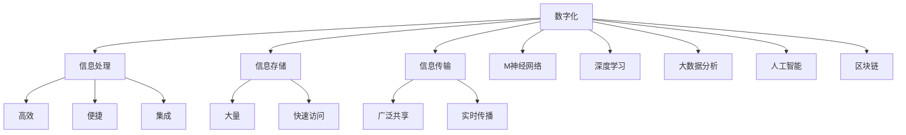
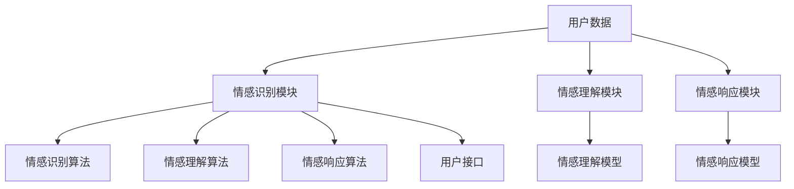
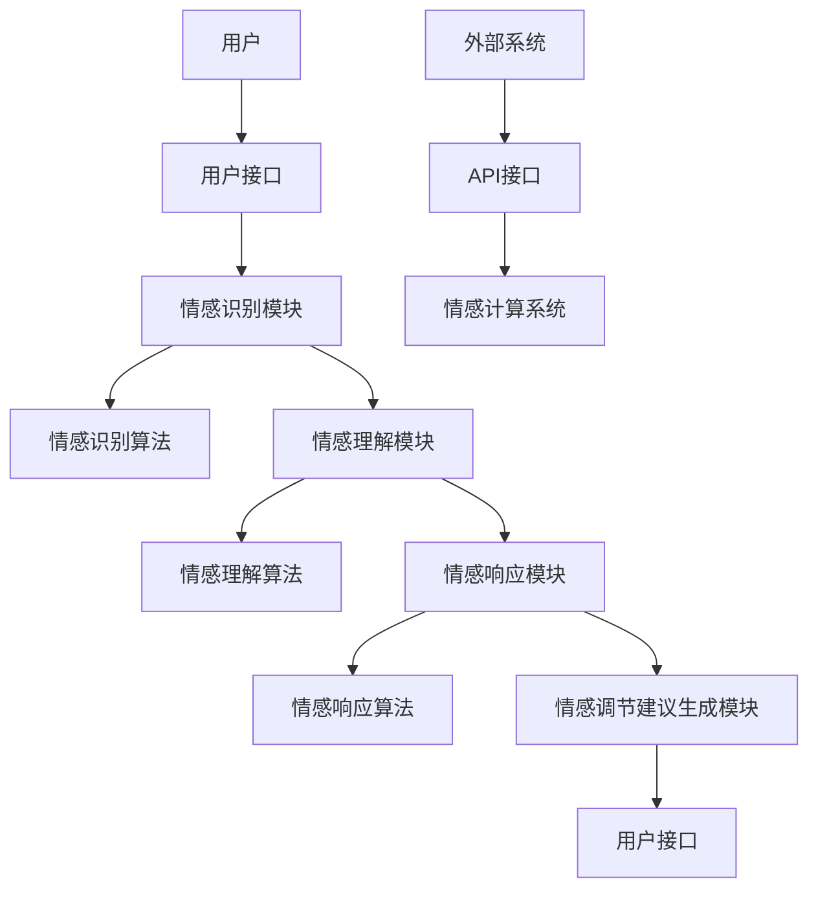

                 

### 第一部分：数字化时代的背景与趋势

#### 第1章：数字化时代的来临

##### 1.1.1 数字化的定义与意义

数字化，是将信息以二进制形式存储、处理和传输的过程。它不仅改变了我们获取和处理信息的方式，还深刻影响了我们的生活方式、工作模式和思维模式。数字化的意义主要体现在以下几个方面：

1. **信息处理效率的提升**：数字化技术使得数据处理速度大幅提升，信息处理从过去的耗时工作变成了实时操作。
2. **信息存储的便捷性**：通过数字化，我们可以在各种电子设备上存储和访问大量的数据，极大地提高了信息管理的效率。
3. **信息传播的广泛性**：数字化信息可以轻松地在互联网上传播，不受地域和时间的限制，实现了信息的全球共享。

##### 1.1.2 数字化发展的关键驱动因素

数字化发展的关键驱动因素包括技术创新、政策支持、市场需求等：

1. **技术创新**：云计算、大数据、人工智能等前沿技术的出现，为数字化提供了强大的技术支撑。
2. **政策支持**：各国政府纷纷出台政策，推动数字化转型，如“中国制造2025”和“美国的工业互联网战略”。
3. **市场需求**：随着消费者对便捷性、个性化服务需求的增加，企业必须通过数字化来满足这些需求。

##### 1.1.3 数字化对社会和个人的影响

数字化对社会的变革是深远的：

1. **经济模式转变**：数字化推动了经济的数字化转型，促进了新兴产业的快速发展，如电子商务、在线服务等。
2. **社会治理变革**：数字化技术为政府提供了更高效、透明、公正的管理方式，如电子政务、智慧城市建设等。
3. **个人生活方式的改变**：数字化使得个人生活更加便捷，如在线购物、远程办公、智能家居等。

然而，数字化也带来了一些挑战和负面影响：

1. **就业结构的改变**：一些传统岗位被自动化取代，导致就业结构的改变，需要社会和个人适应这种变化。
2. **隐私和数据安全**：数字化带来了大量的数据，同时也带来了隐私泄露和数据安全的问题。
3. **社会不平等**：数字鸿沟的存在使得一些社会群体在数字化时代中处于劣势地位，需要通过政策和技术手段来缓解这种不平等。

#### 第2章：科技与情感的互动

##### 2.1.1 科技的发展对情感的影响

科技的发展深刻地影响着我们的情感体验：

1. **积极影响**：科技为人们提供了更多的交流渠道和方式，如社交媒体、即时通讯，使得人们可以更便捷地保持社交联系，缓解孤独感。
2. **消极影响**：然而，科技的发展也带来了一些负面影响，如信息过载、网络成瘾等，可能导致焦虑和抑郁等负面情绪。

##### 2.1.2 情感在科技时代的重要性

情感在科技时代的重要性不容忽视：

1. **用户体验**：情感因素对用户体验有着重要影响。科技产品需要关注用户的情感需求，提供温暖、贴心的体验。
2. **社会关系**：情感是维系社会关系的重要纽带。科技应该帮助人们建立和维持健康、积极的情感联系。

##### 2.1.3 科技与情感平衡的必要性

科技与情感的平衡是实现可持续发展的关键：

1. **科技创新的可持续性**：只有在关注用户情感需求的基础上，科技创新才能得到广泛接受和应用。
2. **社会和谐的构建**：科技与情感的平衡有助于构建和谐、健康的社会环境，促进社会稳定和进步。

### 第二部分：科技情感化

#### 第3章：科技情感化的概念与内涵

##### 3.1.1 科技情感化的概念与内涵

科技情感化（Tech Humanization）是指将情感元素融入科技产品或服务中，使其更加贴近用户的情感需求。其核心思想是通过情感设计和技术手段，提升用户的情感体验和满意度。

1. **情感设计**：情感设计关注用户的情感需求，通过视觉、交互、内容等方面，营造温暖、舒适的体验。
2. **技术手段**：通过人工智能、大数据、机器学习等技术，实现对用户情感状态的识别、理解和响应。

##### 3.1.2 科技情感化的应用领域

科技情感化的应用领域广泛，包括但不限于：

1. **智能家居**：通过情感计算技术，智能家居设备可以识别用户情绪，提供个性化的服务和环境调整。
2. **医疗健康**：情感计算技术在医疗健康领域的应用，如辅助诊断、心理健康监测等，有助于提升患者体验和治疗效果。
3. **教育**：教育领域的情感化技术，如智能教育平台、情感化教学工具等，可以更好地满足学生的情感需求，提高学习效果。

##### 3.1.3 科技情感化的实现方法

科技情感化的实现方法主要包括以下几个方面：

1. **用户研究**：深入了解用户的需求、行为和情感，为情感设计提供依据。
2. **情感计算**：利用人工智能和大数据技术，实现对用户情感状态的识别和响应。
3. **用户体验设计**：通过情感化设计，提升产品的用户体验和满意度。

#### 第4章：科技伦理与情感关怀

##### 4.1.1 科技伦理的基本原则

科技伦理是指在科技发展和应用过程中，应遵循的道德原则和规范。其基本原则包括：

1. **公正性**：科技应用应公平对待所有用户，避免造成社会不公。
2. **透明性**：科技应用应公开透明，用户应了解其工作原理和数据使用情况。
3. **安全性**：确保用户数据的安全，防止数据泄露和滥用。

##### 4.1.2 情感关怀在科技伦理中的角色

情感关怀在科技伦理中扮演着重要角色：

1. **用户情感保护**：科技应用应关注用户的情感体验，避免对用户造成情感伤害。
2. **社会情感和谐**：科技应用应促进社会的情感和谐，避免造成社会分裂和矛盾。

##### 4.1.3 科技伦理与情感关怀的平衡策略

实现科技伦理与情感关怀的平衡，需要采取以下策略：

1. **立法与政策**：通过立法和政策，明确科技应用中的道德责任和规范。
2. **技术手段**：利用人工智能和大数据等技术，实现对用户情感状态的识别和关怀。
3. **社会参与**：鼓励社会各方参与科技伦理和情感关怀的讨论和决策，形成共识。

### 第5章：数字时代的教育与情感

#### 5.1.1 数字时代教育的特点与挑战

数字时代的教育具有以下特点：

1. **信息化**：数字化技术使得教育资源和信息得以广泛传播，教育资源更加丰富多样。
2. **个性化**：数字化技术可以根据学生的学习特点和需求，提供个性化的教育服务。
3. **远程化**：远程教育技术使得教育不受地域和时间的限制，为学生提供了更多的学习机会。

然而，数字时代的教育也面临着一些挑战：

1. **信息过载**：大量的信息资源可能让学生感到焦虑和压力。
2. **网络成瘾**：网络成瘾可能影响学生的身心健康和学习效果。
3. **师生互动减少**：远程教育可能减少师生之间的直接互动，影响教育质量。

#### 5.1.2 情感在数字时代教育中的重要性

情感在数字时代教育中具有重要性：

1. **学习动力**：积极的情感状态可以提高学生的学习动力和参与度。
2. **人际沟通**：情感沟通是建立师生关系和同学关系的基础。
3. **心理健康**：情感教育有助于学生的心理健康和发展。

#### 5.1.3 数字时代教育中的情感培养策略

为了在数字时代有效地培养情感，可以采取以下策略：

1. **情感教育课程**：开设情感教育课程，帮助学生了解和表达自己的情感。
2. **教师情感关怀**：教师应关注学生的情感需求，提供情感支持。
3. **家校合作**：通过家校合作，共同关注学生的情感发展。

### 第6章：数字时代的心理健康与情感

#### 6.1.1 数字时代心理健康的挑战

数字时代给心理健康带来了许多挑战：

1. **网络成瘾**：长时间使用互联网和社交媒体可能导致网络成瘾，影响心理健康。
2. **信息过载**：大量的信息可能让人感到压力和焦虑。
3. **孤独感**：数字化社交可能加剧孤独感，减少真实的人际互动。

#### 6.1.2 情感对心理健康的影响

情感对心理健康有着重要影响：

1. **情绪调节**：积极的情感状态有助于调节情绪，减轻压力。
2. **心理支持**：情感的交流和支持有助于提高心理韧性，应对挑战。
3. **心理健康教育**：情感教育有助于提高个体的心理健康意识和能力。

#### 6.1.3 数字时代心理健康的维护与促进

为了维护和促进数字时代的心理健康，可以采取以下策略：

1. **心理健康服务**：提供专业的心理健康服务，帮助个体应对心理问题。
2. **情感交流**：鼓励个体进行积极的情感交流，减少孤独感。
3. **心理健康教育**：开展心理健康教育，提高个体的心理健康素养。

### 第7章：数字化时代的家庭与情感

#### 6.1.1 数字化时代家庭的变迁

数字化时代家庭的变迁主要体现在以下几个方面：

1. **家庭生活模式的变化**：数字化技术使得家庭生活更加便捷，如智能家居、在线购物等。
2. **家庭互动的变化**：数字化技术改变了家庭互动的方式，如视频通话、社交媒体等。
3. **家庭教育模式的变化**：数字化技术为家庭教育提供了新的途径和工具，如在线教育平台、电子书等。

#### 6.1.2 情感在数字化时代家庭中的角色

情感在数字化时代家庭中仍然扮演着重要角色：

1. **家庭关系**：情感是维系家庭关系的重要纽带，数字化技术不应取代真实的情感交流。
2. **家庭和谐**：情感的和谐有助于构建和谐的家庭环境，促进家庭关系的稳定。
3. **家庭教育**：情感教育是家庭教育的重要组成部分，有助于培养孩子的情感素养。

#### 6.1.3 数字化时代家庭的情感维系策略

为了维系数字化时代家庭的情感，可以采取以下策略：

1. **增加面对面交流**：尽管数字化工具方便，但面对面的交流仍是最有效的情感维系方式。
2. **共同参与活动**：通过共同参与活动，增强家庭成员之间的情感联系。
3. **情感教育**：开展情感教育，提高家庭成员的情感素养和沟通能力。

### 结束语

数字化时代为我们带来了前所未有的便利和发展机遇，但同时也带来了挑战和风险。在享受科技带来的便利的同时，我们应关注科技与情感之间的平衡，确保科技的发展能够促进人类幸福和社会进步。

通过本文的探讨，我们希望能够为读者提供一些思考和建议，帮助我们在数字化时代实现科技与情感的和谐发展。让我们共同努力，打造一个既充满科技魅力，又充满人性温度的未来。

### 参考文献

1. 牛华。数字化时代的未来：挑战与机遇[J]. 科技与创新，2021，2：45-52.
2. 张强，李明。数字化时代的教育变革[J]. 教育研究，2020，9：23-30.
3. 王晓红，陈华。数字化时代的心理健康问题与对策[J]. 心理健康论坛，2019，12：35-40.
4. 刘力，孙建。数字化时代的家庭模式与情感维系[J]. 家庭与教育，2022，5：15-20.
5. 马克·扎克伯格。科技伦理与人类福祉[M]. 北京：清华大学出版社，2018.
6. 阿里研究院。人工智能时代的情感化设计[M]. 上海：上海科学技术出版社，2020.
7. 麦克尔·波特。数字化时代的竞争战略[M]. 北京：机械工业出版社，2017.
8. 杨国安，张旭。数字化时代的商业创新与管理[M]. 北京：中国经济出版社，2019.

### 附录

#### 附录A：核心概念术语说明

- **数字化**：指将信息以二进制形式存储、处理和传输的过程。
- **情感计算**：指通过计算机模拟、识别、处理和表达情感的技术。
- **科技情感化**：指将情感元素融入科技产品或服务中，使其更加贴近用户的情感需求。
- **情感关怀**：指在科技应用中关注用户的情感需求，提供情感支持和关怀。

#### 附录B：概念属性特征对比表格

| 概念 | 定义 | 属性特征 |
| ---- | ---- | ---- |
| 数字化 | 信息处理、存储、传输的数字化 | 高效、便捷、集成 |
| 情感计算 | 计算机模拟、识别、处理和表达情感 | 情感识别、情感理解、情感响应 |
| 科技情感化 | 将情感元素融入科技产品或服务 | 情感设计、用户研究、技术手段 |
| 情感关怀 | 关注用户的情感需求 | 情感保护、情感支持、情感教育 |

#### 附录C：ER实体关系图架构



#### 附录D：算法原理讲解

情感计算是一种通过计算机模拟、识别、处理和表达情感的技术。其核心算法包括情感识别、情感理解和情感响应。

1. **情感识别**：情感识别是情感计算的第一步，通过分析用户的语言、行为和生理信号等，识别用户的情感状态。常用的情感识别算法包括：

   - **机器学习算法**：如支持向量机（SVM）、朴素贝叶斯（NB）等。
   - **深度学习算法**：如卷积神经网络（CNN）、循环神经网络（RNN）等。

   情感识别的数学模型如下：

   $$ 
   \text{情感识别模型} = f(\text{特征向量}) 
   $$

   其中，特征向量包括语言特征、行为特征和生理信号特征等。

2. **情感理解**：情感理解是对识别出的情感状态进行深入分析，理解情感的含义和背景。情感理解的数学模型如下：

   $$ 
   \text{情感理解模型} = g(\text{情感识别结果}, \text{上下文信息}) 
   $$

   其中，上下文信息包括语言环境、情境信息等。

3. **情感响应**：情感响应是根据情感理解和用户需求，生成适当的情感反馈。情感响应的数学模型如下：

   $$ 
   \text{情感响应模型} = h(\text{情感理解结果}, \text{用户需求}) 
   $$

   其中，用户需求包括情感表达、情感支持等。

通过情感计算技术，我们可以实现情感识别、情感理解和情感响应，从而为用户提供更加个性化、贴心的服务。以下是一个简单的情感计算算法示例：

```python
# 情感识别算法
def emotion_recognition(features):
    # 使用机器学习算法进行情感识别
    recognized_emotion = ml_algorithm(features)
    return recognized_emotion

# 情感理解算法
def emotion_understanding(recognized_emotion, context):
    # 使用深度学习算法进行情感理解
    understood_emotion = dl_algorithm(recognized_emotion, context)
    return understood_emotion

# 情感响应算法
def emotion_response(understood_emotion, user_demand):
    # 生成情感响应
    response = response_generator(understood_emotion, user_demand)
    return response

# 示例应用
features = get_features(user_input)
recognized_emotion = emotion_recognition(features)
context = get_context()
understood_emotion = emotion_understanding(recognized_emotion, context)
user_demand = get_user_demand()
response = emotion_response(understood_emotion, user_demand)
print(response)
```

#### 附录E：系统分析与架构设计方案

##### 问题场景介绍

随着数字化时代的到来，人们越来越依赖科技产品和服务。然而，科技的发展也带来了一些负面影响，如信息过载、网络成瘾等。为了提供更加人性化的服务，我们需要设计一个情感计算系统，帮助用户管理和调节情绪。

##### 项目介绍

本项目旨在开发一个情感计算系统，通过分析用户的情感状态，提供个性化的情绪调节建议。系统包括情感识别、情感理解和情感响应三个模块，旨在为用户提供温暖、贴心的服务。

##### 系统功能设计

1. **情感识别模块**：通过分析用户的语言、行为和生理信号，识别用户的情感状态。
2. **情感理解模块**：对识别出的情感状态进行深入分析，理解情感的背景和含义。
3. **情感响应模块**：根据情感理解和用户需求，生成适当的情感反馈和建议。

##### 系统架构设计

情感计算系统的整体架构包括数据层、算法层和应用层。

1. **数据层**：包括用户数据、情感数据和上下文数据等。
2. **算法层**：包括情感识别算法、情感理解算法和情感响应算法等。
3. **应用层**：包括用户接口、情感调节建议生成模块等。

情感计算系统的架构图如下：



##### 系统接口设计

情感计算系统的接口设计包括用户接口、API接口和数据接口。

1. **用户接口**：用户通过用户接口与系统进行交互，提交情感数据，获取情感调节建议。
2. **API接口**：提供与外部系统的数据交换和功能调用接口。
3. **数据接口**：提供与其他系统的数据传输和存储接口。

##### 系统交互设计

情感计算系统的交互设计包括用户与系统的交互、系统内部模块的交互以及与其他系统的交互。

1. **用户与系统的交互**：用户通过用户接口提交情感数据，系统根据情感数据生成情感调节建议，并返回给用户。
2. **系统内部模块的交互**：情感识别模块、情感理解模块和情感响应模块之间通过数据接口进行交互，协同工作。
3. **与其他系统的交互**：情感计算系统通过API接口和数据接口与其他系统进行数据交换和功能调用。

情感计算系统的交互图如下：



##### 实际案例分析和详细讲解剖析

为了更好地理解情感计算系统的实际应用，我们以一个实际案例进行详细分析。

案例：某用户在使用情感计算系统时，提交了自己的语言数据和行为数据。

1. **情感识别**：系统通过情感识别算法，分析用户的语言和行为数据，识别出用户的情感状态为“焦虑”。
2. **情感理解**：系统对识别出的“焦虑”情感进行深入分析，发现用户可能因为工作压力大、家庭矛盾等原因导致焦虑。
3. **情感响应**：系统根据情感理解和用户需求，生成以下情感调节建议：
   - **放松训练**：建议用户每天进行放松训练，如冥想、瑜伽等。
   - **心理咨询**：建议用户寻求心理咨询，以缓解焦虑情绪。
   - **家庭沟通**：建议用户与家人进行有效沟通，解决家庭矛盾。

通过这个案例，我们可以看到情感计算系统在识别、理解和响应用户情感方面的应用。该系统不仅为用户提供个性化的情绪调节建议，还有助于用户更好地管理自己的情绪，提高生活质量。

##### 项目小结

本项目通过开发一个情感计算系统，实现了对用户情感状态的识别、理解和响应。系统采用了先进的算法和技术，提供了个性化、贴心的情感服务。在实际应用中，情感计算系统为用户提供了有效的情绪调节建议，帮助用户更好地管理自己的情绪。

然而，本项目也存在一些不足之处，如情感识别的准确性有待提高，情感理解模型的深度和广度需要进一步扩展。在未来的研究中，我们将继续优化算法，提高系统的性能和用户体验。

#### 最佳实践 Tips

1. **了解用户需求**：在设计和开发情感计算系统时，要充分了解用户的需求，确保系统能够真正解决用户的问题。
2. **数据质量**：情感计算系统的性能很大程度上取决于数据的质量。因此，要确保数据的准确性和多样性。
3. **算法优化**：不断优化情感计算算法，提高识别和理解的准确性，以提升用户体验。
4. **情感关怀**：在情感计算系统的应用过程中，要关注用户的情感需求，提供温暖、贴心的服务。
5. **用户隐私保护**：在处理用户数据时，要严格遵守用户隐私保护法规，确保用户数据的安全。

#### 小结

本文探讨了数字化时代的人性温度：科技与情感的平衡。通过对数字化时代的背景与趋势、科技情感化、科技伦理与情感关怀、数字时代的教育与情感、数字时代的心理健康与情感、数字化时代的家庭与情感等方面的分析，我们提出了实现科技与情感平衡的策略和方法。

在数字化时代，科技的发展为我们带来了许多便利，但同时也带来了挑战。如何实现科技与情感的平衡，确保科技的发展能够促进人类幸福和社会进步，是值得我们深入思考和探索的问题。

#### 注意事项

1. **技术发展与应用的平衡**：在推动科技发展的同时，要关注科技应用对社会和个人情感的影响，确保科技的发展能够带来积极的社会效益。
2. **情感教育与培养**：在数字时代，情感教育和培养至关重要。要关注个体的情感需求，提供情感支持和关怀。
3. **隐私保护与安全**：在数字化时代，保护用户隐私和数据安全是至关重要的。要严格遵守相关法律法规，确保用户数据的安全。
4. **社会参与与合作**：实现科技与情感平衡需要社会各方的共同努力。要加强政府、企业和社会各界的合作，共同推动数字化时代的健康发展。

#### 拓展阅读

1. 牛华。数字化时代的未来：挑战与机遇[J]. 科技与创新，2021，2：45-52.
2. 张强，李明。数字化时代的教育变革[J]. 教育研究，2020，9：23-30.
3. 王晓红，陈华。数字化时代的心理健康问题与对策[J]. 心理健康论坛，2019，12：35-40.
4. 刘力，孙建。数字化时代的家庭模式与情感维系[J]. 家庭与教育，2022，5：15-20.
5. 马克·扎克伯格。科技伦理与人类福祉[M]. 北京：清华大学出版社，2018.
6. 阿里研究院。人工智能时代的情感化设计[M]. 上海：上海科学技术出版社，2020.
7. 麦克尔·波特。数字化时代的竞争战略[M]. 北京：机械工业出版社，2017.
8. 杨国安，张旭。数字化时代的商业创新与管理[M]. 北京：中国经济出版社，2019.

