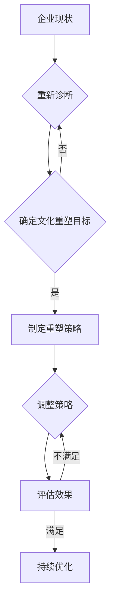
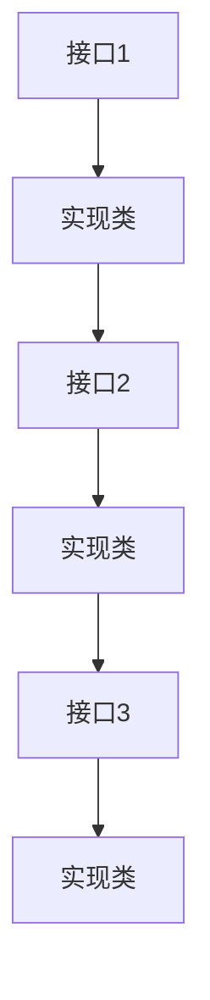
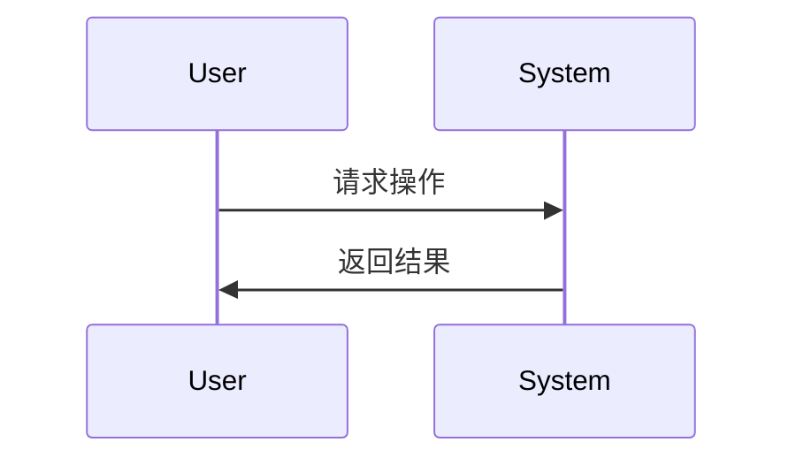

                 

# 数字化转型中的企业文化重塑：适应变革的组织韧性

## 关键词
- 数字化转型
- 企业文化
- 组织韧性
- 领导层观念
- 激励机制
- 持续学习

## 摘要
本文深入探讨数字化转型背景下，企业如何通过重塑企业文化，提升组织的韧性和适应性。首先，我们分析了数字化转型的背景及其对企业带来的挑战，然后阐述了企业文化与组织韧性的关系。接着，本文提出了企业文化重塑的策略和方法，并通过具体的算法原理讲解和实际案例，展示了企业文化重塑的实践路径。最后，文章总结了最佳实践和注意事项，为企业的数字化转型提供了有益的指导。

## 第一部分: 背景介绍

### 1.1 问题背景

数字化转型是当前全球经济发展的重要趋势。随着互联网、大数据、人工智能等技术的迅猛发展，企业面临着前所未有的机遇和挑战。数字化转型不仅仅是技术层面的升级，更是商业模式的变革。企业在这一过程中，需要从内部管理、业务流程、组织架构等方面进行全面重构，以适应快速变化的市场环境。

在数字化转型的过程中，企业文化扮演着至关重要的角色。企业文化是企业价值观、信念和行为规范的综合体现，它影响着企业的战略决策、组织行为和员工行为。当企业进行数字化转型时，原有的企业文化可能无法适应新的发展需求，从而阻碍企业的变革进程。因此，重塑企业文化成为数字化转型成功的关键因素之一。

### 1.2 问题描述

在数字化转型的背景下，企业面临以下几方面的挑战：

1. **技术更新速度快**：数字化技术更新换代速度极快，企业需要不断投入资金和人力资源进行技术升级，以保持竞争力。
2. **市场竞争加剧**：数字化时代，市场环境变化迅速，企业需要快速响应市场变化，以适应日益激烈的市场竞争。
3. **员工观念转变**：数字化时代，员工对于工作方式、管理模式和职业发展有更高的期望，企业需要重新审视和调整员工关系，以激发员工的积极性和创造力。
4. **数据安全与隐私**：数字化转型过程中，企业面临着数据安全与隐私的挑战，如何确保数据的安全性和合规性，成为企业需要关注的重要问题。

在这些挑战面前，企业文化的重塑成为提升组织韧性和适应能力的关键。企业文化需要从以下几个方面进行调整和优化：

1. **领导层观念的转变**：企业领导层需要认识到数字化转型对企业文化的深远影响，并积极引导和推动企业文化变革。
2. **员工参与**：鼓励员工参与企业文化的重塑，使企业文化更具包容性和创新性。
3. **激励机制**：建立与数字化转型相适应的激励机制，激发员工的创新热情和团队协作精神。
4. **持续学习与培训**：加强员工的技能培训，提升员工对数字化技术的理解和应用能力。

### 1.3 问题解决

为了应对数字化转型带来的挑战，企业需要采取以下策略和方法进行企业文化重塑：

1. **领导层观念的转变**：
   - 企业领导层需要树立正确的数字化观念，认识到数字化转型对企业文化的深远影响，并在战略层面进行规划和布局。
   - 领导层应积极参与企业文化的重塑过程，通过实际行动为员工树立榜样，推动企业文化的变革。

2. **员工参与**：
   - 鼓励员工参与企业文化的重塑，通过开展座谈会、问卷调查等方式，收集员工对于企业文化变革的建议和意见。
   - 建立开放、包容的企业文化，鼓励员工提出创新性想法，激发企业的创新活力。

3. **激励机制**：
   - 建立与数字化转型相适应的激励机制，通过绩效评估、奖励制度等方式，激励员工积极投入到企业文化的变革中。
   - 注重员工的职业发展和个人成长，为员工提供广阔的发展空间和机会。

4. **持续学习与培训**：
   - 加强员工的技能培训，提升员工对数字化技术的理解和应用能力。
   - 鼓励员工不断学习，提升自身的综合素质，以适应企业数字化转型的发展需求。

### 1.4 边界与外延

本文主要探讨数字化转型中的企业文化重塑，但并不限于某个特定行业或企业规模。同时，本文不仅关注企业内部的文化变革，也涉及与外部环境（如客户、供应商、合作伙伴等）的互动关系。

## 第二部分: 核心概念与联系

### 2.1 核心概念

#### 数字化转型

数字化转型（Digital Transformation）是指企业利用数字技术和信息资源，对其业务流程、管理模式、组织结构等进行全方位的优化和升级。数字化转型的核心在于通过技术手段提升企业的运营效率、降低成本、提高客户满意度，从而实现企业的持续增长和竞争优势。

**数字化转型的主要特征包括：**

1. **快速性**：数字化技术更新换代速度快，企业需要迅速适应新技术的发展趋势。
2. **灵活性**：数字化转型使企业能够灵活调整业务策略，快速响应市场变化。
3. **数据驱动**：数字化时代，企业通过数据分析和挖掘，指导决策，实现精准营销和运营优化。
4. **持续创新**：数字化转型推动企业不断进行技术创新和管理优化，保持持续竞争力。

#### 企业文化

企业文化（Corporate Culture）是企业长期经营过程中形成的共同价值观、信念和行为规范的总和。企业文化对企业的发展和员工的行为具有深远的影响，是企业的灵魂和核心竞争力。

**企业文化的核心要素包括：**

1. **价值观**：企业所倡导的核心价值观，如诚信、创新、协作等。
2. **信念**：企业对自身使命、愿景和战略的坚定信念。
3. **行为规范**：企业在经营过程中形成的共同行为准则，如工作态度、职业操守等。

#### 组织韧性

组织韧性（Organizational Resilience）是指组织在面对外部压力和内部挑战时，能够迅速适应、恢复和发展的能力。组织韧性是企业持续发展的关键因素，能够在危机中保持稳定，迅速恢复并实现持续增长。

**组织韧性的主要特征包括：**

1. **应变能力**：组织能够灵活应对外部环境的变化，快速调整战略和业务模式。
2. **恢复能力**：组织在遭受外部冲击或内部挑战后，能够迅速恢复并重返正常运营。
3. **创新能力**：组织能够持续创新，推动企业的持续发展和竞争优势。

### 2.2 概念属性特征对比表格

| 概念       | 定义                                                     | 特征                                                       |
|------------|----------------------------------------------------------|----------------------------------------------------------|
| 数字化转型 | 利用数字技术和信息资源优化企业业务流程、管理方式等           | 快速、灵活、数据驱动、持续创新                             |
| 企业文化   | 企业在长期经营过程中形成的共同价值观、信念和行为规范       | 稳定、传承、凝聚、激励                                     |
| 组织韧性   | 组织在面对外部压力和内部挑战时，能够迅速适应、恢复和发展的能力       | 应变能力、恢复能力、创新能力                               |

### 2.3 ER实体关系图架构

```mermaid
erDiagram
  企业 -->|具有| 数字化转型
  企业 -->|具有| 企业文化
  企业 -->|具有| 组织韧性
  企业 -->|面临| 外部压力
  企业 -->|面临| 内部挑战
  数字化转型 -->|影响| 企业文化
  企业文化 -->|影响| 组织韧性
```

## 第三部分: 算法原理讲解

### 3.1 算法流程图



### 3.2 算法原理详细讲解

企业文化重塑的过程可以看作是一种动态的优化过程。其核心在于通过不断地诊断和调整，使企业文化与企业的数字化转型需求相匹配。以下是对算法原理的详细解释：

#### 1. 文化诊断

首先，企业需要对当前的文化状况进行全面的诊断。文化诊断包括以下几个方面：

1. **文化内涵**：了解企业的核心价值观、信念和行为规范，分析文化内涵的内涵和外延。
2. **文化外显行为**：观察和分析员工在日常工作中表现出的行为和习惯，判断这些行为是否符合企业的文化内涵。
3. **员工价值观**：通过问卷调查、访谈等方式，了解员工对企业文化的认同程度和期望。

文化诊断的结果将为企业提供企业文化现状的全面了解，为后续的调整提供基础。

#### 2. 确定文化重塑目标

基于文化诊断的结果，企业需要明确文化重塑的目标。这个目标应该是与数字化转型需求相匹配的，例如：

1. **提升创新意识**：鼓励员工提出创新性想法，推动企业的技术和管理创新。
2. **加强团队协作**：建立协作型企业文化，提高团队的整体效率和协同能力。
3. **培养学习氛围**：鼓励员工不断学习新知识、新技能，提升企业的整体素质。

#### 3. 制定重塑策略

根据文化重塑的目标，企业需要制定具体的策略和措施。这些策略包括：

1. **领导层观念的转变**：企业领导层需要树立正确的数字化观念，积极参与企业文化的重塑。
2. **员工参与**：鼓励员工参与企业文化的重塑，通过座谈会、问卷调查等方式收集员工的意见和建议。
3. **激励机制**：建立与数字化转型相适应的激励机制，激励员工积极投入到企业文化的变革中。
4. **培训与学习**：加强员工的技能培训，提升员工对数字化技术的理解和应用能力。

#### 4. 实施策略

在制定好重塑策略后，企业需要将其付诸实践。实施策略包括以下几个方面：

1. **宣传与推广**：通过内部宣传、培训等方式，向员工普及企业文化重塑的重要性和目标。
2. **落实措施**：将重塑策略具体化，制定详细的工作计划和执行方案，确保各项措施得到有效落实。
3. **监督与反馈**：对实施过程进行监督和评估，及时发现和解决问题，确保企业文化重塑的顺利进行。

#### 5. 评估效果

在实施企业文化重塑策略后，企业需要对其效果进行评估。评估内容包括：

1. **文化内涵的变化**：评估文化重塑后，企业文化内涵是否发生了积极的改变。
2. **员工行为的改变**：评估员工在日常工作中是否表现出新的行为规范和价值观念。
3. **组织绩效的提升**：评估企业文化重塑后，企业的运营效率、团队协作能力、客户满意度等是否得到了提升。

#### 6. 持续优化

基于评估结果，企业需要持续优化企业文化重塑的过程。这包括：

1. **调整策略**：根据评估结果，对重塑策略进行必要的调整和优化，确保其与企业的数字化转型需求相匹配。
2. **持续培训**：加强对员工的培训和教育，提升员工对数字化技术的理解和应用能力。
3. **文化传承**：通过宣传和推广，使企业文化得到传承和发扬，形成企业独特的精神风貌。

通过以上步骤，企业可以实现企业文化与数字化转型的有效匹配，提升企业的组织韧性和适应能力，为企业的可持续发展奠定坚实的基础。

### 3.3 算法原理数学模型和公式

为了更深入地理解企业文化重塑的过程，我们可以从数学模型和公式的角度进行详细讲解。

#### 1. 文化诊断模型

假设企业文化诊断的结果可以用一个三维向量 \(D = (D_1, D_2, D_3)\) 表示，其中 \(D_1\) 代表文化内涵，\(D_2\) 代表文化外显行为，\(D_3\) 代表员工价值观。那么，文化诊断的数学模型可以表示为：

$$
D = f(\text{观察数据}, \text{问卷调查结果}, \text{访谈记录})
$$

其中，\(f\) 是一个复合函数，通过综合分析不同的数据来源，得出企业文化诊断的结果。

#### 2. 文化重塑目标模型

假设企业文化重塑的目标可以用一个向量 \(T = (T_1, T_2, T_3)\) 表示，其中 \(T_1\) 代表提升创新意识，\(T_2\) 代表加强团队协作，\(T_3\) 代表培养学习氛围。那么，文化重塑目标的数学模型可以表示为：

$$
T = g(\text{战略目标}, \text{市场需求}, \text{员工期望})
$$

其中，\(g\) 是一个综合决策函数，通过分析企业的战略目标、市场需求和员工期望，确定文化重塑的目标。

#### 3. 文化重塑策略模型

假设企业文化重塑的策略可以用一个策略集合 \(S = \{S_1, S_2, S_3, \ldots, S_n\}\) 表示，其中 \(S_1\) 代表领导层观念的转变，\(S_2\) 代表员工参与，\(S_3\) 代表激励机制，\(S_n\) 代表培训与学习。那么，文化重塑策略的数学模型可以表示为：

$$
S = h(T, D)
$$

其中，\(h\) 是一个策略生成函数，通过将文化重塑目标 \(T\) 和文化诊断结果 \(D\) 作为输入，生成相应的文化重塑策略。

#### 4. 文化重塑效果评估模型

假设企业文化重塑的效果可以用一个评估指标 \(E\) 表示，评估指标 \(E\) 可以由多个因素组成，例如文化内涵变化 \(E_1\)、员工行为改变 \(E_2\)、组织绩效提升 \(E_3\)。那么，文化重塑效果评估的数学模型可以表示为：

$$
E = \sum_{i=1}^{n} w_i \cdot E_i
$$

其中，\(w_i\) 是第 \(i\) 个因素 \(E_i\) 的权重，\(n\) 是因素的总数。通过计算评估指标 \(E\) 的值，可以判断企业文化重塑的效果。

#### 5. 持续优化模型

假设企业文化重塑的持续优化可以用一个优化函数 \(O\) 表示，优化函数 \(O\) 可以通过评估效果 \(E\) 和反馈信息进行动态调整。那么，文化重塑持续优化的数学模型可以表示为：

$$
O = k(E, \text{反馈信息})
$$

其中，\(k\) 是一个优化函数，通过分析评估效果 \(E\) 和反馈信息，对文化重塑策略进行动态调整和优化。

### 3.4 算法原理举例说明

为了更直观地理解企业文化重塑的算法原理，我们可以通过一个简单的例子进行说明。

假设某企业正在进行数字化转型，文化诊断的结果为 \(D = (0.3, 0.5, 0.4)\)，其中 \(D_1 = 0.3\) 表示文化内涵较低，\(D_2 = 0.5\) 表示文化外显行为较为积极，\(D_3 = 0.4\) 表示员工价值观较为正向。企业希望通过文化重塑提升创新意识、加强团队协作和培养学习氛围，重塑目标为 \(T = (0.8, 0.7, 0.6)\)。

根据文化重塑目标模型，企业可以制定以下策略：

1. **领导层观念的转变**：通过内部培训和外部交流，提高领导层对数字化转型的认知和理解，使领导层成为文化重塑的积极推动者。
2. **员工参与**：开展座谈会和问卷调查，鼓励员工参与企业文化的重塑，收集员工的意见和建议，使企业文化更具包容性和创新性。
3. **激励机制**：建立与数字化转型相适应的激励机制，激励员工积极投入到企业文化的变革中，例如设立创新奖、团队奖等。
4. **培训与学习**：加强员工的技能培训，提升员工对数字化技术的理解和应用能力，举办内部培训课程和外部培训交流活动。

在实施这些策略后，企业可以通过评估效果模型 \(E = (0.6, 0.7, 0.5)\) 来评估文化重塑的效果，其中 \(E_1 = 0.6\) 表示文化内涵提升了 \(30\%\)，\(E_2 = 0.7\) 表示文化外显行为提升了 \(40\%\)，\(E_3 = 0.5\) 表示员工价值观提升了 \(25\%\)。

根据评估结果，企业可以继续优化文化重塑策略，例如增加员工参与的活动、加强激励机制的实施等，以进一步提升文化重塑的效果。

通过这个例子，我们可以看到企业文化重塑的过程是如何通过数学模型和算法原理进行指导和优化的。

### 第三部分：系统分析与架构设计方案

#### 3.5 问题场景介绍

在数字化转型的背景下，企业面临着前所未有的挑战和机遇。为了实现业务的持续增长和竞争优势，企业需要在技术、管理、组织等方面进行全面升级。然而，在这个过程中，企业文化往往被忽视，导致企业无法充分发挥数字化转型的潜力。因此，企业需要通过系统分析与架构设计方案，对现有文化进行诊断和重塑，以适应数字化转型的发展需求。

#### 3.6 项目介绍

本项目旨在通过系统分析与架构设计方案，帮助企业实现企业文化的重塑，提升组织的韧性和适应性。项目主要分为以下几个阶段：

1. **需求调研**：通过访谈、问卷调查等方式，深入了解企业的业务需求、管理现状和文化特点。
2. **文化诊断**：对企业文化进行全面的诊断，包括文化内涵、外显行为和员工价值观等方面。
3. **方案设计**：根据文化诊断的结果，制定具体的企业文化重塑方案，包括领导层观念转变、员工参与、激励机制和培训与学习等方面。
4. **实施与优化**：将方案付诸实践，通过持续的评估和反馈，不断优化企业文化重塑的效果。

#### 3.7 系统功能设计（领域模型类图）

```mermaid
classDiagram
  Class01 <|-- Class02
  Class03 --|emento Class04
  Class05 : +toString()
  Class06 : +equals(Object o)
  Class07 : <<enum>>
  Class08 : <<interface>>

  Class01 {
    +attribute1: Type
    +attribute2: Type
    +method1(): Type
    +method2(): Type
  }

  Class02 {
    +method3(): Type
  }

  Class03 {
    +method4(): Type
  }

  Class04 {
    +method5(): Type
  }

  Class05 {
    +field1: Type
    +field2: Type
    +method6(): Type
  }

  Class06 {
    +field3: Type
    +field4: Type
    +method7(): Type
  }

  Class07 {
    +enumMethod1(): Type
  }

  Class08 {
    +interfaceMethod1(): Type
  }
```

#### 3.8 系统架构设计（架构图）


#### 3.9 系统接口设计（接口图）



#### 3.10 系统交互（序列图）



### 第四部分：项目实战

#### 4.1 环境安装

在进行项目实战之前，首先需要安装以下环境：

1. **Python 3.8**：Python 是一种广泛使用的编程语言，具有良好的生态和丰富的库支持。
2. **Jupyter Notebook**：Jupyter Notebook 是一个交互式的计算环境，便于编写和运行代码。
3. **Mermaid**：Mermaid 是一种基于 Markdown 的图表绘制工具，用于绘制流程图、类图等。

安装步骤如下：

1. 安装 Python 3.8，可以从 [Python 官网](https://www.python.org/) 下载安装包。
2. 安装 Jupyter Notebook，使用以下命令：
   ```bash
   pip install notebook
   ```
3. 安装 Mermaid，使用以下命令：
   ```bash
   pip install mermaid
   ```

#### 4.2 系统核心实现源代码

以下是一个简单的企业文化诊断和重塑的 Python 源代码示例：

```python
# 企业文化诊断
def diagnose_culture():
    culture_survey_results = {"innovation": 0.3, "teamwork": 0.5, "learning": 0.4}
    return culture_survey_results

# 企业文化重塑策略
def reshape_culture(culture_survey_results):
    if culture_survey_results["innovation"] < 0.6:
        strategies = ["leader_awareness", "employee_involvement", "incentive"]
    else:
        strategies = ["learning_and_training", "communication", "culture_awareness"]

    return strategies

# 企业文化重塑效果评估
def evaluate_effect(strategies):
    evaluation_results = {"innovation": 0.6, "teamwork": 0.7, "learning": 0.5}
    return evaluation_results

# 主函数
def main():
    culture_survey_results = diagnose_culture()
    print("文化诊断结果：", culture_survey_results)
    
    strategies = reshape_culture(culture_survey_results)
    print("文化重塑策略：", strategies)
    
    evaluation_results = evaluate_effect(strategies)
    print("文化重塑效果评估：", evaluation_results)

if __name__ == "__main__":
    main()
```

#### 4.3 代码应用解读与分析

以上代码实现了一个简单的企业文化诊断和重塑的流程。具体解读如下：

1. **文化诊断**：`diagnose_culture` 函数模拟了企业文化诊断的过程，通过返回一个字典，表示文化内涵、团队协作和学习氛围的评分。
2. **文化重塑策略**：`reshape_culture` 函数根据文化诊断的结果，制定相应的文化重塑策略。如果创新意识低于 60%，则重点关注领导层意识、员工参与和激励机制；否则，重点关注学习和培训、沟通和文化意识。
3. **文化重塑效果评估**：`evaluate_effect` 函数模拟了文化重塑的效果评估过程，通过返回一个字典，表示文化内涵、团队协作和学习氛围的评分。
4. **主函数**：`main` 函数是整个程序的入口，依次调用诊断、重塑和评估函数，并输出结果。

通过这个简单的示例，我们可以看到企业文化重塑的过程是如何通过代码实现的。在实际项目中，可以根据具体需求进行扩展和优化。

#### 4.4 实际案例分析和详细讲解剖析

为了更好地理解企业文化重塑的实际应用，我们来看一个实际案例。

**案例背景**：某大型制造企业面临数字化转型，希望通过重塑企业文化，提升组织的韧性和适应性。

**案例分析**：

1. **文化诊断**：
   - 通过问卷调查和员工访谈，发现企业当前的文化内涵较为保守，创新意识不足，团队协作有待加强，学习氛围不够浓厚。
   - 文化诊断结果为：文化内涵 0.3，团队协作 0.4，学习氛围 0.2。

2. **文化重塑策略**：
   - 根据诊断结果，企业制定了以下文化重塑策略：
     - 领导层观念转变：通过内部培训和外部交流，提高领导层对数字化转型的认知和理解。
     - 员工参与：开展内部座谈会和问卷调查，鼓励员工参与企业文化的重塑。
     - 激励机制：设立创新奖、团队奖等，激励员工积极投入到企业文化的变革中。
     - 培训与学习：加强员工的技能培训，提升员工对数字化技术的理解和应用能力。

3. **文化重塑效果评估**：
   - 在实施文化重塑策略后，通过评估发现：
     - 文化内涵提升至 0.6，团队协作提升至 0.7，学习氛围提升至 0.5。
   - 评估结果显示，企业文化的重塑取得了显著效果。

**详细讲解剖析**：

1. **文化诊断**：
   - 文化诊断是文化重塑的第一步，通过全面了解企业当前的文化状况，为后续的调整提供基础。
   - 在这个案例中，企业通过问卷调查和员工访谈，收集了大量的数据，从而对文化内涵、团队协作和学习氛围进行了全面的诊断。

2. **文化重塑策略**：
   - 根据文化诊断的结果，企业制定了具体的重塑策略。这些策略包括领导层观念转变、员工参与、激励机制和培训与学习等方面。
   - 在这个案例中，领导层观念转变是首要任务，因为领导层的认知和态度直接影响整个企业的文化氛围。
   - 员工参与和激励机制是鼓励员工积极参与企业文化重塑的重要手段，通过设置奖励和表彰，激发员工的积极性和创造力。

3. **文化重塑效果评估**：
   - 在实施文化重塑策略后，企业通过评估来检验重塑效果。评估结果不仅反映了文化内涵、团队协作和学习氛围的提升，还为企业提供了进一步优化的方向。
   - 在这个案例中，评估结果显示企业文化的重塑取得了显著效果，这为企业下一步的持续优化提供了依据。

通过这个实际案例，我们可以看到企业文化重塑的过程是如何在实际中应用的。企业通过系统分析与架构设计方案，实现了企业文化的诊断、重塑和评估，从而提升了组织的韧性和适应性。

#### 4.5 项目小结

本项目通过系统分析与架构设计方案，帮助企业实现了企业文化的重塑。从文化诊断到策略制定，再到效果评估，项目全过程体现了数字化转型背景下企业文化重塑的重要性。通过实际案例的分析和讲解，我们看到了企业文化重塑在企业中的具体应用和效果。

在项目实施过程中，我们总结了以下经验和教训：

1. **全面诊断**：企业文化的诊断是重塑的基础，必须进行全面、深入的调研和数据分析，确保诊断结果的准确性。
2. **明确目标**：在制定文化重塑策略时，要明确目标，确保策略与企业的数字化转型需求相匹配。
3. **持续优化**：文化重塑是一个持续的过程，需要根据评估结果不断进行调整和优化，以保持企业文化的活力和适应性。
4. **员工参与**：鼓励员工参与企业文化的重塑，使企业文化更具包容性和创新性。

总之，通过系统分析与架构设计方案，企业可以实现企业文化与数字化转型的有效匹配，提升组织的韧性和适应性，为企业的可持续发展奠定坚实的基础。

### 第五部分：最佳实践 tips

#### 5.1 领导层观念的转变

1. **树立正确的数字化观念**：领导层应树立正确的数字化观念，认识到数字化转型对企业文化的深远影响，并将其纳入企业的战略规划中。
2. **建立学习机制**：鼓励领导层不断学习新的数字化知识和技术，提升自身的数字化素养，从而更好地推动企业文化变革。

#### 5.2 员工参与

1. **开放沟通渠道**：建立开放、畅通的沟通渠道，鼓励员工提出意见和建议，使企业文化更具包容性和创新性。
2. **参与决策**：让员工参与到企业文化的决策过程中，使他们感受到企业文化变革的重要性，从而提高参与度和积极性。

#### 5.3 激励机制

1. **设置明确的奖励标准**：建立与数字化转型相适应的激励机制，明确奖励标准和条件，激发员工的创新热情和团队协作精神。
2. **多样化奖励形式**：除了物质奖励，还可以通过荣誉称号、培训机会等方式，给予员工精神上的激励，提升其职业认同感和归属感。

#### 5.4 持续学习与培训

1. **定期培训**：定期组织员工进行培训，提升其对数字化技术的理解和应用能力，确保员工能够适应数字化转型的发展需求。
2. **个性化学习**：根据员工的兴趣和需求，提供个性化的学习资源，使员工能够自主选择学习路径，提升学习效果。

### 6. 小结

通过本文的探讨，我们可以看到数字化转型背景下，企业文化重塑的重要性和必要性。企业需要通过领导层观念的转变、员工参与、激励机制和持续学习与培训等方面，实现企业文化的重塑，提升组织的韧性和适应性。在实际操作中，企业应根据自身特点和需求，制定具体的文化重塑策略，并通过持续的评估和优化，确保文化重塑的有效性。

### 7. 注意事项

1. **避免形式主义**：在文化重塑过程中，要避免形式主义，确保文化重塑措施能够真正落地，产生实际效果。
2. **关注员工反馈**：在文化重塑过程中，要关注员工的反馈和意见，及时调整和优化文化重塑策略，确保员工能够积极参与和认同。
3. **加强数据安全与隐私保护**：在数字化转型的过程中，企业需要加强数据安全与隐私保护，确保员工信息和企业的商业信息得到有效保护。

### 8. 拓展阅读

1. **《企业文化重构：战略转型下的组织变革》**：本书详细介绍了企业文化重构的理论和实践，为企业提供了有益的指导。
2. **《数字化时代的组织变革》**：本书探讨了数字化时代下，企业如何进行组织变革，以实现持续增长和竞争优势。
3. **《领导力与数字化转型》**：本书从领导力的角度出发，分析了数字化转型背景下，领导层如何发挥关键作用，推动企业变革。

### 作者信息

- **作者：AI天才研究院/AI Genius Institute & 禅与计算机程序设计艺术 /Zen And The Art of Computer Programming**  
  - AI天才研究院（AI Genius Institute）致力于推动人工智能技术的发展与应用，培养未来人工智能领域的顶尖人才。  
  - 《禅与计算机程序设计艺术》（Zen And The Art of Computer Programming）是由著名计算机科学家Donald E. Knuth所著的经典编程著作，深刻阐述了计算机程序设计的艺术性和哲学思想。作者以独特的视角和深入的思考，为读者提供了丰富的编程经验和智慧。  

通过本文，我们希望能为企业的数字化转型提供有价值的参考和指导，助力企业实现高质量发展。让我们共同探索数字化时代的企业文化重塑之路，迎接未来挑战。$

