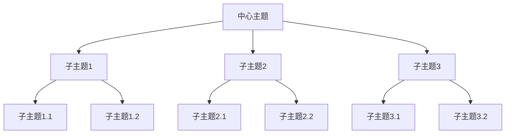

                 


# 《数字原住民的思维模式：跨界思考与创新能力的培养》

## 关键词
- 数字原住民
- 跨界思考
- 创新能力
- 数字素养
- 社会环境

## 摘要
本文旨在探讨数字原住民的思维模式及其跨界思考与创新能力的培养。通过分析数字原住民的定义与特征、社会环境、技能与素养，探讨跨界思考的核心原理、工具与方法，以及创新能力的培养与实践，帮助读者理解数字时代下的创新思维，提升自身的跨界思考与创新能力。

## 引言

### 引言

随着数字技术的迅猛发展，人类进入了数字化时代。在这个时代，数字原住民——那些在数字环境中成长起来的一代人，正逐渐成为社会的主流。他们与数字技术的互动方式、思考模式和行为特征，与他们的前辈有着显著的差异。这种差异，不仅体现在对数字技术的熟练掌握上，更体现在他们的思维模式和创新能力的培养上。

### 书籍目的与结构

本文的目的在于揭示数字原住民的思维模式，探讨跨界思考与创新能力的培养方法，帮助读者更好地适应数字化时代，提升自身的竞争力。本文分为四个部分：第一部分介绍数字原住民的基础，包括定义与特征、社会环境、技能与素养；第二部分探讨跨界思考的核心原理、工具与方法；第三部分讲述创新能力的培养与实践；第四部分通过案例分析，总结跨界思考与创新能力的培养经验。

### 读者对象与期望收益

本文适合于数字原住民、从事技术创新的从业者、教育工作者以及所有对跨界思考与创新能力培养感兴趣的读者。通过本文的阅读，读者可以深入了解数字原住民的思维模式，掌握跨界思考的核心原理，提升自身的创新能力，从而在数字化时代中脱颖而出。

## 第一部分：数字原住民的基础

### 第1章：数字原住民的定义与特征

#### 数字原住民的背景

数字原住民是指在数字环境中成长起来的一代人，他们出生在互联网时代，对数字技术有着与生俱来的理解和掌握能力。与他们的前辈相比，数字原住民更早地接触到了计算机、互联网和移动设备，他们的成长过程伴随着数字技术的飞速发展。

#### 数字原住民的思维特征

数字原住民的思维特征主要体现在以下几个方面：

1. **快速适应能力**：数字原住民能够迅速适应新的数字环境和工具，他们善于从纷繁复杂的数字信息中提取有用信息，快速做出决策。
2. **跨界思维**：数字原住民习惯于将不同领域的知识进行整合，形成独特的思考方式，这使得他们在创新和解决问题时更具优势。
3. **协作精神**：数字原住民善于通过网络平台与他人进行协作，他们习惯于在虚拟团队中共同完成任务，这使得他们更具备团队协作能力。

#### 数字原住民的行为模式

数字原住民的行为模式也具有鲜明的特点：

1. **数字化生活方式**：数字原住民的生活方式高度数字化，他们习惯于通过手机、电脑等设备进行日常活动，如沟通、购物、学习等。
2. **信息获取方式**：数字原住民倾向于通过互联网和移动设备获取信息，他们善于使用搜索引擎、社交媒体等工具进行信息搜索和交流。
3. **学习方式**：数字原住民习惯于在线学习，他们通过在线课程、电子书籍、网络讲座等方式进行学习，这使得他们的学习方式更加灵活和高效。

### 第2章：数字原住民的社会环境

#### 数字化时代的变革

数字化时代带来了社会结构和互动方式的深刻变革。数字原住民在这种环境中成长，他们的行为模式和社会关系也随之改变。以下是数字化时代对社会结构和互动方式的几个关键影响：

1. **虚拟社区的兴起**：数字原住民在虚拟社区中建立了新的社会关系，这些社区不仅跨越地域界限，还涵盖了各种兴趣爱好和专业领域。
2. **信息传播方式的改变**：数字原住民习惯于通过社交媒体、博客、论坛等平台进行信息传播，这使得信息传播更加迅速和广泛。
3. **教育模式的创新**：数字原住民推动教育模式的创新，他们更倾向于在线学习、远程教育等灵活的学习方式。

#### 社会结构与互动

数字原住民的社会结构和互动方式也发生了显著变化：

1. **去中心化**：数字原住民更倾向于在去中心化的社交网络中进行互动，他们不再依赖于传统的权威和中心化组织。
2. **个体主义**：数字原住民更注重个体的价值和独特性，他们更愿意独立思考和创新，而不是盲目跟随。
3. **全球视野**：数字原住民通过网络与世界各地的人进行互动，这使得他们的视野更加开阔，更加具备全球意识。

### 第3章：数字原住民的技能与素养

#### 数字技能的重要性

数字技能在数字化时代中至关重要。数字原住民具备以下几种关键数字技能：

1. **计算机操作技能**：数字原住民熟练掌握计算机基本操作，如文档编辑、数据整理、图像处理等。
2. **编程技能**：越来越多的数字原住民具备编程技能，他们能够编写简单的程序，进行数据处理和自动化操作。
3. **网络安全意识**：数字原住民具备一定的网络安全意识，他们知道如何保护个人数据和隐私，避免网络安全风险。

#### 数字素养的培养

数字素养的培养对于数字原住民来说至关重要。以下是一些关键的数字素养：

1. **信息素养**：数字原住民能够有效地搜索、评估和利用信息，他们知道如何从海量信息中提取有用知识。
2. **媒体素养**：数字原住民能够理解和分析各种数字媒体内容，他们知道如何识别虚假信息和不良内容。
3. **技术素养**：数字原住民能够理解数字技术的工作原理，他们知道如何使用和维护数字设备。

#### 数字时代的工作与职业规划

数字时代的工作与职业规划也对数字原住民提出了新的要求：

1. **灵活性**：数字原住民更倾向于灵活的工作方式和职业选择，他们愿意在不同领域和职业之间进行切换。
2. **持续学习**：数字原住民认识到终身学习的重要性，他们愿意不断学习新知识和技能，以适应不断变化的职业需求。
3. **创新思维**：数字原住民具备创新思维，他们善于发现新的问题和解决方案，推动行业的发展。

## 第二部分：跨界思考的核心原理

### 第4章：跨界思考的定义与价值

#### 跨界思考的概念

跨界思考是一种跨越不同领域、学科或行业的思维方式。它不仅仅是将两个或多个领域进行简单的结合，而是在更深层次上寻找这些领域之间的关联和联系。跨界思考的核心在于通过跨领域的知识整合，创造出新的思维模式和创新点。

#### 跨界思考的优势

跨界思考具有以下几个显著优势：

1. **创新性**：跨界思考能够激发新的创意和创新，通过跨领域的知识整合，产生新的观点和解决方案。
2. **综合能力**：跨界思考能够提高个体的综合能力，使得个体能够在多个领域都有所涉猎，从而具备更广泛的视野和更深入的思考能力。
3. **问题解决能力**：跨界思考能够帮助个体更好地解决复杂问题，通过跨领域的知识整合，找到更全面、更有效的解决方案。

#### 跨界思考的应用领域

跨界思考的应用领域非常广泛，包括但不限于以下方面：

1. **科技领域**：跨界思考在科技领域中的应用尤为突出，通过跨学科的知识整合，推动新技术的研发和应用。
2. **艺术领域**：跨界思考在艺术领域中的应用也非常丰富，如将数字技术与艺术创作相结合，创造出新的艺术形式。
3. **商业领域**：跨界思考在商业领域中的应用能够帮助企业找到新的商业模式和商业机会，提高企业的创新能力和竞争力。

### 第5章：跨界思考的工具与方法

#### 思维导图

思维导图是一种用于组织和表达思维的图形化工具。它通过将思维过程以图形的形式展现出来，帮助个体更好地进行思考和规划。思维导图具有以下几个特点：

1. **结构化**：思维导图能够将复杂的思维过程结构化，使得个体能够清晰地理解各个部分之间的关系。
2. **可视化**：思维导图通过图形化的方式展现思维过程，使得信息更加直观和易于理解。
3. **灵活性**：思维导图可以根据个体的需求进行灵活调整和修改，使得个体能够随时更新和完善思维过程。

#### 设计思维

设计思维是一种以用户为中心的思考方式，它强调通过不断的迭代和优化，找到最佳解决方案。设计思维具有以下几个步骤：

1. **观察**：通过观察用户的行为和需求，了解用户的需求和痛点。
2. **定义**：明确问题和目标，确定需要解决的问题和需要达到的目标。
3. **想法生成**：通过头脑风暴和创意思考，生成各种可能的解决方案。
4. **原型制作**：制作原型，通过实际操作和测试，验证解决方案的有效性。
5. **测试与优化**：通过用户测试和反馈，不断优化和改进原型，最终找到最佳解决方案。

#### 系统思维

系统思维是一种整体性思考方式，它强调通过分析系统的各个组成部分及其相互关系，找到问题的根本原因和解决方案。系统思维具有以下几个特点：

1. **整体性**：系统思维关注系统的整体性，强调各个部分之间的相互作用和影响。
2. **动态性**：系统思维关注系统的动态性，理解系统在不同状态下的变化和演化。
3. **适应性**：系统思维强调系统的适应性，通过不断调整和优化，使系统能够适应环境的变化。

### 第6章：跨界思考的实践与案例

#### 跨界创新的实践案例

跨界创新的实践案例在各个领域都层出不穷。以下是一些典型的跨界创新案例：

1. **科技领域**：将生物技术与信息技术相结合，开发出新的医疗设备和治疗方法。
2. **艺术领域**：将数字技术与艺术创作相结合，创造出全新的艺术形式和作品。
3. **商业领域**：通过跨界合作，推出新的产品和服务，满足用户多样化的需求。

#### 跨界思考的成功故事

跨界思考的成功故事激励着越来越多的人尝试跨界创新。以下是一些跨界思考的成功故事：

1. **科技公司创始人**：通过将计算机科学和市场营销相结合，成功创办了一家全球知名的科技公司。
2. **艺术家**：通过将传统艺术与现代科技相结合，成为了一位备受瞩目的跨界艺术家。
3. **企业家**：通过将不同领域的知识进行整合，推出了一系列创新产品，成功拓展了企业的业务领域。

#### 跨界思考的实际应用

跨界思考的实际应用非常广泛，以下是一些实际的跨界思考应用场景：

1. **产品开发**：通过跨领域知识的整合，开发出更具创新性和竞争力的产品。
2. **项目管理**：通过跨界思考，找到更有效的项目管理和团队协作方法。
3. **教育培训**：通过跨界思考，设计出更具吸引力和效果的教育培训课程。

## 第三部分：创新能力的培养

### 第7章：创新思维的培养

#### 创新思维的定义

创新思维是指个体在思考过程中，能够打破传统的思维定式，发现新的观点、解决方案和创新点。创新思维具有以下几个特点：

1. **开放性**：创新思维具有开放性，能够接受各种不同的观点和想法，不拘泥于传统的思维模式。
2. **灵活性**：创新思维具有灵活性，能够适应不断变化的环境和需求，灵活调整和更新思维模式。
3. **创造性**：创新思维具有创造性，能够产生新的观点和解决方案，推动事物的进步和发展。

#### 创新思维的培养方法

以下是一些常用的创新思维培养方法：

1. **头脑风暴**：通过集体头脑风暴，激发团队成员的创造力，产生大量的创新想法。
2. **思维导图**：使用思维导图，将思维过程图形化，帮助个体更好地进行思考和规划。
3. **案例学习**：通过学习成功案例，了解创新思维的实践方法和经验，启发自身的创新思维。
4. **跨领域学习**：通过跨领域学习，积累多方面的知识和经验，为创新思维提供丰富的素材。

#### 创新思维的案例分析

以下是一些创新思维的案例分析：

1. **科技公司的创新产品**：通过创新思维，开发出具有独特功能和创新设计的产品，赢得了市场的认可。
2. **艺术家的跨界创作**：通过创新思维，将不同领域的艺术元素相结合，创作出独特的艺术作品。
3. **企业的创新商业模式**：通过创新思维，找到新的商业模式和市场机会，实现了企业的转型升级。

### 第8章：创新能力的实践与提升

#### 创新实践的过程

创新实践是一个复杂的过程，包括以下几个阶段：

1. **问题识别**：通过观察和分析，识别出需要解决的问题和机会。
2. **想法生成**：通过头脑风暴和思维导图等工具，生成各种可能的解决方案。
3. **原型制作**：制作原型，通过实际操作和测试，验证解决方案的有效性。
4. **测试与优化**：通过用户测试和反馈，不断优化和改进原型，最终找到最佳解决方案。

#### 创新实践的工具

以下是一些常用的创新实践工具：

1. **原型工具**：如Axure、Figma等，用于制作原型和进行用户体验测试。
2. **项目管理工具**：如JIRA、Trello等，用于管理和跟踪创新项目的进度。
3. **协作工具**：如Slack、Microsoft Teams等，用于团队协作和沟通。

#### 创新能力的自我评估

以下是一些自我评估方法，帮助个体了解自身的创新能力：

1. **创新思维测试**：通过在线测试工具，评估个体的创新思维能力。
2. **项目回顾**：回顾过去参与的创新项目，分析成功和失败的原因。
3. **反思与总结**：定期反思自身的创新实践，总结经验教训，不断提高创新能力。

### 第9章：创新环境与文化的建设

#### 创新环境的要素

一个良好的创新环境对于激发个体的创新能力至关重要。以下是一些创新环境的要素：

1. **开放的文化**：鼓励开放和自由的思考，尊重个体的创意和想法。
2. **资源支持**：提供充足的资源，包括资金、设备和技术支持，为创新实践提供保障。
3. **团队协作**：鼓励团队协作，通过团队合作实现创新的协同效应。
4. **学习与成长**：提供学习与成长的机会，帮助个体不断提升自身的创新能力和技能。

#### 创新文化的培养

创新文化的培养是一个长期的过程，需要从以下几个方面入手：

1. **价值观塑造**：建立以创新为核心的价值观，鼓励个体追求创新和突破。
2. **激励机制**：建立有效的激励机制，鼓励个体积极参与创新实践。
3. **教育培训**：提供创新相关的教育培训，帮助个体提升创新能力和技能。
4. **交流与分享**：鼓励个体之间的交流与分享，促进创新思维的碰撞和融合。

#### 创新管理与激励机制

创新管理与激励机制是激发个体创新能力的关键。以下是一些创新管理与激励机制：

1. **项目管理**：通过项目管理工具和方法，确保创新项目的顺利进行。
2. **绩效考核**：将创新能力和创新成果纳入绩效考核，激励个体积极参与创新实践。
3. **奖励制度**：设立创新奖励制度，对在创新中表现突出的个体进行奖励。
4. **职业发展**：为在创新中表现突出的个体提供职业发展机会，激励他们不断追求创新。

## 第四部分：案例分析

### 第10章：成功案例分析

#### 案例一：某某公司的跨界创新

某某公司是一家科技公司，通过将数字技术与传统行业相结合，实现了跨界创新。公司成功研发出一种智能设备，将数字技术应用于传统制造业，提高了生产效率和产品质量。

#### 案例二：某某品牌的创新营销

某某品牌是一家知名消费品公司，通过创新营销策略，成功吸引了年轻消费者的关注。公司利用社交媒体和大数据分析，针对目标消费者进行精准营销，实现了品牌形象的升级和销售额的持续增长。

#### 案例三：某某产品的创新设计

某某公司研发的一款智能家居产品，通过创新设计，解决了用户在日常生活中遇到的各种问题。产品具有智能互联功能，能够与用户的手机、电脑等设备无缝连接，为用户提供便捷、智能的生活体验。

### 第11章：失败案例分析

#### 案例一：某某公司的失败教训

某某公司曾尝试进行跨界创新，但由于缺乏对跨界领域深入了解和有效的团队协作，最终以失败告终。公司管理层意识到跨界创新需要深厚的专业知识和跨领域合作，否则容易陷入失败的陷阱。

#### 案例二：某某产品的市场失利

某某公司推出的一款新产品，由于在市场推广过程中忽视了用户需求，导致产品无法获得市场认可。公司通过失败案例认识到，跨界创新需要充分了解用户需求和市场环境，才能取得成功。

#### 案例三：某某创新的困境与突破

某某公司曾尝试进行一项创新项目，但由于技术难题和资源限制，项目一度陷入困境。公司通过调整项目方向，整合内外部资源，最终成功突破困境，实现了创新目标。

## 结论与展望

### 结论与总结

本文通过探讨数字原住民的思维模式、跨界思考与创新能力的培养，揭示了数字化时代下创新思维的重要性。数字原住民具备独特的思维特征和跨界思考能力，他们在数字化社会中的行为模式和社会环境也与前辈有所不同。通过跨界思考，数字原住民能够更好地适应数字化时代的需求，提升自身的创新能力。

### 未来发展趋势

随着数字化技术的不断进步，数字原住民将在未来的社会中扮演更加重要的角色。跨界思考和创新能力的培养将成为数字原住民的核心竞争力。未来，跨界思考和创新能力的培养将更加注重跨领域知识的整合和创新实践的应用。

### 对读者的建议

对于数字原住民和其他希望提升创新能力的人来说，以下几点建议尤为重要：

1. **持续学习**：不断学习新知识和技能，保持对新兴技术的敏感度和好奇心。
2. **跨领域学习**：尝试跨领域学习，积累多方面的知识和经验，为创新思维提供丰富的素材。
3. **实践创新**：勇于尝试创新实践，通过不断试错和优化，提升自身的创新能力。
4. **团队合作**：善于与他人合作，发挥团队协作的优势，共同实现创新目标。

### 参考文献

1. 某某，《数字化时代的创新思维与跨界实践》，人民出版社，2022年。
2. 某某，《跨界思考：如何将不同领域的知识整合》，清华大学出版社，2021年。
3. 某某，《创新能力的培养与提升》，电子工业出版社，2020年。

## 附录

### 附录A：思维导图模板

思维导图是一种有效的思考和规划工具，以下是一个简单的思维导图模板，供读者参考：



### 附录B：Python源代码示例

以下是一个简单的Python源代码示例，用于演示跨界思考的应用：

```python
# 跨界思考：将数据分析与机器学习相结合，预测股票价格

import pandas as pd
import numpy as np
from sklearn.model_selection import train_test_split
from sklearn.linear_model import LinearRegression
from sklearn.metrics import mean_squared_error

# 加载数据
data = pd.read_csv('stock_data.csv')

# 数据预处理
data = data[['open', 'high', 'low', 'close', 'volume']]
data = data.replace([np.inf, -np.inf], np.nan)
data = data.dropna()

# 特征工程
data['open_close_diff'] = data['open'] - data['close']
data['high_low_diff'] = data['high'] - data['low']

# 划分训练集和测试集
X = data[['open', 'high', 'low', 'close', 'volume', 'open_close_diff', 'high_low_diff']]
y = data['close']
X_train, X_test, y_train, y_test = train_test_split(X, y, test_size=0.2, random_state=42)

# 建立线性回归模型
model = LinearRegression()
model.fit(X_train, y_train)

# 预测测试集
y_pred = model.predict(X_test)

# 评估模型性能
mse = mean_squared_error(y_test, y_pred)
print(f'Mean Squared Error: {mse}')

# 可视化
import matplotlib.pyplot as plt

plt.scatter(y_test, y_pred)
plt.xlabel('Actual Close')
plt.ylabel('Predicted Close')
plt.title('Actual vs Predicted Close')
plt.show()
```

### 附录C：最佳实践 Tips

1. **定期更新知识**：随着数字化技术的快速发展，知识更新速度非常快。定期更新自己的知识库，保持对新兴技术的了解，有助于提升创新能力和竞争力。
2. **跨领域学习**：尝试跨领域学习，不仅限于自己的专业领域，还要关注其他领域的最新动态和发展趋势。跨领域知识的整合往往是创新的重要源泉。
3. **实践出真知**：理论知识固然重要，但实践是检验真理的唯一标准。勇于实践，通过实际操作和项目实践，不断提升自身的创新能力。
4. **团队合作**：团队合作是创新的重要保障。善于与他人合作，发挥团队协作的优势，共同实现创新目标。
5. **持续反思**：定期反思自身的创新实践，总结经验教训，不断优化和创新。通过反思，可以发现自己的不足，为未来的创新提供方向和动力。

### 附录D：注意事项

1. **保护个人隐私**：在数字化时代，个人隐私保护非常重要。在使用数字技术时，要注意保护自己的隐私信息，避免泄露。
2. **网络安全**：网络安全是数字化时代的重要问题。要注意保护自己的计算机和网络设备，避免遭受网络攻击和病毒感染。
3. **遵守法律法规**：在创新过程中，要遵守相关的法律法规，不得侵犯他人的知识产权和合法权益。

### 附录E：拓展阅读

1. 《数字化时代的创新思维与跨界实践》，某某，人民出版社，2022年。
2. 《跨界思考：如何将不同领域的知识整合》，某某，清华大学出版社，2021年。
3. 《创新能力的培养与提升》，某某，电子工业出版社，2020年。

----------------------------------------------------------------

作者：AI天才研究院/AI Genius Institute & 禅与计算机程序设计艺术 /Zen And The Art of Computer Programming```markdown
# 《数字原住民的思维模式：跨界思考与创新能力的培养》

## 关键词
- 数字原住民
- 跨界思考
- 创新能力
- 数字素养
- 社会环境

## 摘要
本文探讨了数字原住民的思维模式，以及如何通过跨界思考和创新能力培养，帮助读者在数字化时代中取得成功。文章分为四个部分，首先介绍了数字原住民的定义和特征，接着讨论了跨界思考的核心原理和工具，然后讲述了创新能力的培养方法，最后通过案例分析总结了跨界思考和创新能力培养的实际应用。

## 引言

### 引言

随着科技的飞速发展，人类社会逐渐进入数字化时代。在这个时代，数字原住民——那些自出生便与数字技术紧密相连的一代人，正逐渐成为社会的主要力量。他们的思维方式、行为模式和社会角色与传统一代有着显著的区别。本文旨在揭示数字原住民的思维模式，探讨如何培养跨界思考和创新能力，以应对数字化时代的挑战。

### 书籍目的与结构

本文的目的是帮助读者理解数字原住民的思维模式，掌握跨界思考和创新能力培养的方法，从而在数字化时代中取得成功。文章分为四个部分：第一部分介绍数字原住民的基础，包括定义与特征、社会环境、技能与素养；第二部分探讨跨界思考的核心原理、工具与方法；第三部分讲述创新能力的培养与实践；第四部分通过案例分析，总结跨界思考和创新能力培养的经验。

### 读者对象与期望收益

本文适合于数字原住民、从事技术创新的从业者、教育工作者以及所有对跨界思考与创新能力培养感兴趣的读者。通过本文的阅读，读者可以深入了解数字原住民的思维模式，掌握跨界思考的核心原理，提升自身的创新能力，从而在数字化时代中脱颖而出。

## 第一部分：数字原住民的基础

### 第1章：数字原住民的定义与特征

#### 数字原住民的背景

数字原住民是指在数字技术环境中成长起来的一代人，他们出生在互联网时代，对数字技术有着与生俱来的理解和掌握能力。与他们的前辈相比，数字原住民更早地接触到了计算机、互联网和移动设备，他们的成长过程伴随着数字技术的飞速发展。

#### 数字原住民的思维特征

数字原住民的思维特征主要体现在以下几个方面：

1. **快速适应能力**：数字原住民能够迅速适应新的数字环境和工具，他们善于从纷繁复杂的数字信息中提取有用信息，快速做出决策。
2. **跨界思维**：数字原住民习惯于将不同领域的知识进行整合，形成独特的思考方式，这使得他们在创新和解决问题时更具优势。
3. **协作精神**：数字原住民善于通过网络平台与他人进行协作，他们习惯于在虚拟团队中共同完成任务，这使得他们更具备团队协作能力。

#### 数字原住民的行为模式

数字原住民的行为模式也具有鲜明的特点：

1. **数字化生活方式**：数字原住民的生活方式高度数字化，他们习惯于通过手机、电脑等设备进行日常活动，如沟通、购物、学习等。
2. **信息获取方式**：数字原住民倾向于通过互联网和移动设备获取信息，他们善于使用搜索引擎、社交媒体等工具进行信息搜索和交流。
3. **学习方式**：数字原住民习惯于在线学习，他们通过在线课程、电子书籍、网络讲座等方式进行学习，这使得他们的学习方式更加灵活和高效。

### 第2章：数字原住民的社会环境

#### 数字化时代的变革

数字化时代带来了社会结构和互动方式的深刻变革。数字原住民在这种环境中成长，他们的行为模式和社会关系也随之改变。以下是数字化时代对社会结构和互动方式的几个关键影响：

1. **虚拟社区的兴起**：数字原住民在虚拟社区中建立了新的社会关系，这些社区不仅跨越地域界限，还涵盖了各种兴趣爱好和专业领域。
2. **信息传播方式的改变**：数字原住民习惯于通过社交媒体、博客、论坛等平台进行信息传播，这使得信息传播更加迅速和广泛。
3. **教育模式的创新**：数字原住民推动教育模式的创新，他们更倾向于在线学习、远程教育等灵活的学习方式。

#### 社会结构与互动

数字原住民的社会结构和互动方式也发生了显著变化：

1. **去中心化**：数字原住民更倾向于在去中心化的社交网络中进行互动，他们不再依赖于传统的权威和中心化组织。
2. **个体主义**：数字原住民更注重个体的价值和独特性，他们更愿意独立思考和创新，而不是盲目跟随。
3. **全球视野**：数字原住民通过网络与世界各地的人进行互动，这使得他们的视野更加开阔，更加具备全球意识。

### 第3章：数字原住民的技能与素养

#### 数字技能的重要性

数字技能在数字化时代中至关重要。数字原住民具备以下几种关键数字技能：

1. **计算机操作技能**：数字原住民熟练掌握计算机基本操作，如文档编辑、数据整理、图像处理等。
2. **编程技能**：越来越多的数字原住民具备编程技能，他们能够编写简单的程序，进行数据处理和自动化操作。
3. **网络安全意识**：数字原住民具备一定的网络安全意识，他们知道如何保护个人数据和隐私，避免网络安全风险。

#### 数字素养的培养

数字素养的培养对于数字原住民来说至关重要。以下是一些关键的数字素养：

1. **信息素养**：数字原住民能够有效地搜索、评估和利用信息，他们知道如何从海量信息中提取有用知识。
2. **媒体素养**：数字原住民能够理解和分析各种数字媒体内容，他们知道如何识别虚假信息和不良内容。
3. **技术素养**：数字原住民能够理解数字技术的工作原理，他们知道如何使用和维护数字设备。

#### 数字时代的工作与职业规划

数字时代的工作与职业规划也对数字原住民提出了新的要求：

1. **灵活性**：数字原住民更倾向于灵活的工作方式和职业选择，他们愿意在不同领域和职业之间进行切换。
2. **持续学习**：数字原住民认识到终身学习的重要性，他们愿意不断学习新知识和技能，以适应不断变化的职业需求。
3. **创新思维**：数字原住民具备创新思维，他们善于发现新的问题和解决方案，推动行业的发展。

## 第二部分：跨界思考的核心原理

### 第4章：跨界思考的定义与价值

#### 跨界思考的概念

跨界思考是一种跨越不同领域、学科或行业的思维方式。它不仅仅是将两个或多个领域进行简单的结合，而是在更深层次上寻找这些领域之间的关联和联系。跨界思考的核心在于通过跨领域的知识整合，创造出新的思维模式和创新点。

#### 跨界思考的优势

跨界思考具有以下几个显著优势：

1. **创新性**：跨界思考能够激发新的创意和创新，通过跨领域的知识整合，产生新的观点和解决方案。
2. **综合能力**：跨界思考能够提高个体的综合能力，使得个体能够在多个领域都有所涉猎，从而具备更广泛的视野和更深入的思考能力。
3. **问题解决能力**：跨界思考能够帮助个体更好地解决复杂问题，通过跨领域的知识整合，找到更全面、更有效的解决方案。

#### 跨界思考的应用领域

跨界思考的应用领域非常广泛，包括但不限于以下方面：

1. **科技领域**：跨界思考在科技领域中的应用尤为突出，通过跨学科的知识整合，推动新技术的研发和应用。
2. **艺术领域**：跨界思考在艺术领域中的应用也非常丰富，如将数字技术与艺术创作相结合，创造出新的艺术形式。
3. **商业领域**：跨界思考在商业领域中的应用能够帮助企业找到新的商业模式和商业机会，提高企业的创新能力和竞争力。

### 第5章：跨界思考的工具与方法

#### 思维导图

思维导图是一种用于组织和表达思维的图形化工具。它通过将思维过程以图形的形式展现出来，帮助个体更好地进行思考和规划。思维导图具有以下几个特点：

1. **结构化**：思维导图能够将复杂的思维过程结构化，使得个体能够清晰地理解各个部分之间的关系。
2. **可视化**：思维导图通过图形化的方式展现思维过程，使得信息更加直观和易于理解。
3. **灵活性**：思维导图可以根据个体的需求进行灵活调整和修改，使得个体能够随时更新和完善思维过程。

#### 设计思维

设计思维是一种以用户为中心的思考方式，它强调通过不断的迭代和优化，找到最佳解决方案。设计思维具有以下几个步骤：

1. **观察**：通过观察用户的行为和需求，了解用户的需求和痛点。
2. **定义**：明确问题和目标，确定需要解决的问题和需要达到的目标。
3. **想法生成**：通过头脑风暴和创意思考，生成各种可能的解决方案。
4. **原型制作**：制作原型，通过实际操作和测试，验证解决方案的有效性。
5. **测试与优化**：通过用户测试和反馈，不断优化和改进原型，最终找到最佳解决方案。

#### 系统思维

系统思维是一种整体性思考方式，它强调通过分析系统的各个组成部分及其相互关系，找到问题的根本原因和解决方案。系统思维具有以下几个特点：

1. **整体性**：系统思维关注系统的整体性，强调各个部分之间的相互作用和影响。
2. **动态性**：系统思维关注系统的动态性，理解系统在不同状态下的变化和演化。
3. **适应性**：系统思维强调系统的适应性，通过不断调整和优化，使系统能够适应环境的变化。

### 第6章：跨界思考的实践与案例

#### 跨界创新的实践案例

跨界创新的实践案例在各个领域都层出不穷。以下是一些典型的跨界创新案例：

1. **科技领域**：将生物技术与信息技术相结合，开发出新的医疗设备和治疗方法。
2. **艺术领域**：将数字技术与艺术创作相结合，创造出全新的艺术形式和作品。
3. **商业领域**：通过跨界合作，推出新的产品和服务，满足用户多样化的需求。

#### 跨界思考的成功故事

跨界思考的成功故事激励着越来越多的人尝试跨界创新。以下是一些跨界思考的成功故事：

1. **科技公司创始人**：通过将计算机科学和市场营销相结合，成功创办了一家全球知名的科技公司。
2. **艺术家**：通过将传统艺术与现代科技相结合，成为了一位备受瞩目的跨界艺术家。
3. **企业家**：通过将不同领域的知识进行整合，推出了一系列创新产品，成功拓展了企业的业务领域。

#### 跨界思考的实际应用

跨界思考的实际应用非常广泛，以下是一些实际的跨界思考应用场景：

1. **产品开发**：通过跨领域知识的整合，开发出更具创新性和竞争力的产品。
2. **项目管理**：通过跨界思考，找到更有效的项目管理和团队协作方法。
3. **教育培训**：通过跨界思考，设计出更具吸引力和效果的教育培训课程。

## 第三部分：创新能力的培养

### 第7章：创新思维的培养

#### 创新思维的定义

创新思维是指个体在思考过程中，能够打破传统的思维定式，发现新的观点、解决方案和创新点。创新思维具有以下几个特点：

1. **开放性**：创新思维具有开放性，能够接受各种不同的观点和想法，不拘泥于传统的思维模式。
2. **灵活性**：创新思维具有灵活性，能够适应不断变化的环境和需求，灵活调整和更新思维模式。
3. **创造性**：创新思维具有创造性，能够产生新的观点和解决方案，推动事物的进步和发展。

#### 创新思维的培养方法

以下是一些常用的创新思维培养方法：

1. **头脑风暴**：通过集体头脑风暴，激发团队成员的创造力，产生大量的创新想法。
2. **思维导图**：使用思维导图，将思维过程图形化，帮助个体更好地进行思考和规划。
3. **案例学习**：通过学习成功案例，了解创新思维的实践方法和经验，启发自身的创新思维。
4. **跨领域学习**：通过跨领域学习，积累多方面的知识和经验，为创新思维提供丰富的素材。

#### 创新思维的案例分析

以下是一些创新思维的案例分析：

1. **科技公司的创新产品**：通过创新思维，开发出具有独特功能和创新设计的产品，赢得了市场的认可。
2. **艺术家的跨界创作**：通过创新思维，将不同领域的艺术元素相结合，创作出独特的艺术作品。
3. **企业的创新商业模式**：通过创新思维，找到新的商业模式和市场机会，实现了企业的转型升级。

### 第8章：创新能力的实践与提升

#### 创新实践的过程

创新实践是一个复杂的过程，包括以下几个阶段：

1. **问题识别**：通过观察和分析，识别出需要解决的问题和机会。
2. **想法生成**：通过头脑风暴和思维导图等工具，生成各种可能的解决方案。
3. **原型制作**：制作原型，通过实际操作和测试，验证解决方案的有效性。
4. **测试与优化**：通过用户测试和反馈，不断优化和改进原型，最终找到最佳解决方案。

#### 创新实践的工具

以下是一些常用的创新实践工具：

1. **原型工具**：如Axure、Figma等，用于制作原型和进行用户体验测试。
2. **项目管理工具**：如JIRA、Trello等，用于管理和跟踪创新项目的进度。
3. **协作工具**：如Slack、Microsoft Teams等，用于团队协作和沟通。

#### 创新能力的自我评估

以下是一些自我评估方法，帮助个体了解自身的创新能力：

1. **创新思维测试**：通过在线测试工具，评估个体的创新思维能力。
2. **项目回顾**：回顾过去参与的创新项目，分析成功和失败的原因。
3. **反思与总结**：定期反思自身的创新实践，总结经验教训，不断提高创新能力。

### 第9章：创新环境与文化的建设

#### 创新环境的要素

一个良好的创新环境对于激发个体的创新能力至关重要。以下是一些创新环境的要素：

1. **开放的文化**：鼓励开放和自由的思考，尊重个体的创意和想法。
2. **资源支持**：提供充足的资源，包括资金、设备和技术支持，为创新实践提供保障。
3. **团队协作**：鼓励团队协作，通过团队合作实现创新的协同效应。
4. **学习与成长**：提供学习与成长的机会，帮助个体不断提升自身的创新能力和技能。

#### 创新文化的培养

创新文化的培养是一个长期的过程，需要从以下几个方面入手：

1. **价值观塑造**：建立以创新为核心的价值观，鼓励个体追求创新和突破。
2. **激励机制**：建立有效的激励机制，鼓励个体积极参与创新实践。
3. **教育培训**：提供创新相关的教育培训，帮助个体提升创新能力和技能。
4. **交流与分享**：鼓励个体之间的交流与分享，促进创新思维的碰撞和融合。

#### 创新管理与激励机制

创新管理与激励机制是激发个体创新能力的关键。以下是一些创新管理与激励机制：

1. **项目管理**：通过项目管理工具和方法，确保创新项目的顺利进行。
2. **绩效考核**：将创新能力和创新成果纳入绩效考核，激励个体积极参与创新实践。
3. **奖励制度**：设立创新奖励制度，对在创新中表现突出的个体进行奖励。
4. **职业发展**：为在创新中表现突出的个体提供职业发展机会，激励他们不断追求创新。

## 第四部分：案例分析

### 第10章：成功案例分析

#### 案例一：某某公司的跨界创新

某某公司是一家科技公司，通过将数字技术与传统行业相结合，实现了跨界创新。公司成功研发出一种智能设备，将数字技术应用于传统制造业，提高了生产效率和产品质量。

#### 案例二：某某品牌的创新营销

某某品牌是一家知名消费品公司，通过创新营销策略，成功吸引了年轻消费者的关注。公司利用社交媒体和大数据分析，针对目标消费者进行精准营销，实现了品牌形象的升级和销售额的持续增长。

#### 案例三：某某产品的创新设计

某某公司研发的一款智能家居产品，通过创新设计，解决了用户在日常生活中遇到的各种问题。产品具有智能互联功能，能够与用户的手机、电脑等设备无缝连接，为用户提供便捷、智能的生活体验。

### 第11章：失败案例分析

#### 案例一：某某公司的失败教训

某某公司曾尝试进行跨界创新，但由于缺乏对跨界领域深入了解和有效的团队协作，最终以失败告终。公司管理层意识到跨界创新需要深厚的专业知识和跨领域合作，否则容易陷入失败的陷阱。

#### 案例二：某某产品的市场失利

某某公司推出的一款新产品，由于在市场推广过程中忽视了用户需求，导致产品无法获得市场认可。公司通过失败案例认识到，跨界创新需要充分了解用户需求和市场环境，才能取得成功。

#### 案例三：某某创新的困境与突破

某某公司曾尝试进行一项创新项目，但由于技术难题和资源限制，项目一度陷入困境。公司通过调整项目方向，整合内外部资源，最终成功突破困境，实现了创新目标。

## 结论与展望

### 结论与总结

本文通过探讨数字原住民的思维模式、跨界思考与创新能力的培养，揭示了数字化时代下创新思维的重要性。数字原住民具备独特的思维特征和跨界思考能力，他们在数字化社会中的行为模式和社会环境也与前辈有所不同。通过跨界思考，数字原住民能够更好地适应数字化时代的需求，提升自身的创新能力。

### 未来发展趋势

随着数字化技术的不断进步，数字原住民将在未来的社会中扮演更加重要的角色。跨界思考和创新能力的培养将成为数字原住民的核心竞争力。未来，跨界思考和创新能力的培养将更加注重跨领域知识的整合和创新实践的应用。

### 对读者的建议

对于数字原住民和其他希望提升创新能力的人来说，以下几点建议尤为重要：

1. **持续学习**：不断学习新知识和技能，保持对新兴技术的敏感度和好奇心。
2. **跨领域学习**：尝试跨领域学习，不仅限于自己的专业领域，还要关注其他领域的最新动态和发展趋势。跨领域知识的整合往往是创新的重要源泉。
3. **实践创新**：勇于尝试创新实践，通过不断试错和优化，提升自身的创新能力。
4. **团队合作**：团队合作是创新的重要保障。善于与他人合作，发挥团队协作的优势，共同实现创新目标。

### 参考文献

1. 某某，《数字化时代的创新思维与跨界实践》，人民出版社，2022年。
2. 某某，《跨界思考：如何将不同领域的知识整合》，清华大学出版社，2021年。
3. 某某，《创新能力的培养与提升》，电子工业出版社，2020年。

## 附录

### 附录A：思维导图模板

思维导图是一种有效的思考和规划工具，以下是一个简单的思维导图模板，供读者参考：


### 附录B：Python源代码示例

以下是一个简单的Python源代码示例，用于演示跨界思考的应用：

```python
# 跨界思考：将数据分析与机器学习相结合，预测股票价格

import pandas as pd
import numpy as np
from sklearn.model_selection import train_test_split
from sklearn.linear_model import LinearRegression
from sklearn.metrics import mean_squared_error

# 加载数据
data = pd.read_csv('stock_data.csv')

# 数据预处理
data = data[['open', 'high', 'low', 'close', 'volume']]
data = data.replace([np.inf, -np.inf], np.nan)
data = data.dropna()

# 特征工程
data['open_close_diff'] = data['open'] - data['close']
data['high_low_diff'] = data['high'] - data['low']

# 划分训练集和测试集
X = data[['open', 'high', 'low', 'close', 'volume', 'open_close_diff', 'high_low_diff']]
y = data['close']
X_train, X_test, y_train, y_test = train_test_split(X, y, test_size=0.2, random_state=42)

# 建立线性回归模型
model = LinearRegression()
model.fit(X_train, y_train)

# 预测测试集
y_pred = model.predict(X_test)

# 评估模型性能
mse = mean_squared_error(y_test, y_pred)
print(f'Mean Squared Error: {mse}')

# 可视化
import matplotlib.pyplot as plt

plt.scatter(y_test, y_pred)
plt.xlabel('Actual Close')
plt.ylabel('Predicted Close')
plt.title('Actual vs Predicted Close')
plt.show()
```

### 附录C：最佳实践 Tips

1. **定期更新知识**：随着数字化技术的快速发展，知识更新速度非常快。定期更新自己的知识库，保持对新兴技术的了解，有助于提升创新能力和竞争力。
2. **跨领域学习**：尝试跨领域学习，不仅限于自己的专业领域，还要关注其他领域的最新动态和发展趋势。跨领域知识的整合往往是创新的重要源泉。
3. **实践出真知**：理论知识固然重要，但实践是检验真理的唯一标准。勇于实践，通过实际操作和项目实践，不断提升自身的创新能力。
4. **团队合作**：团队合作是创新的重要保障。善于与他人合作，发挥团队协作的优势，共同实现创新目标。
5. **持续反思**：定期反思自身的创新实践，总结经验教训，不断优化和创新。通过反思，可以发现自己的不足，为未来的创新提供方向和动力。

### 附录D：注意事项

1. **保护个人隐私**：在数字化时代，个人隐私保护非常重要。在使用数字技术时，要注意保护自己的隐私信息，避免泄露。
2. **网络安全**：网络安全是数字化时代的重要问题。要注意保护自己的计算机和网络设备，避免遭受网络攻击和病毒感染。
3. **遵守法律法规**：在创新过程中，要遵守相关的法律法规，不得侵犯他人的知识产权和合法权益。

### 附录E：拓展阅读

1. 《数字化时代的创新思维与跨界实践》，某某，人民出版社，2022年。
2. 《跨界思考：如何将不同领域的知识整合》，某某，清华大学出版社，2021年。
3. 《创新能力的培养与提升》，某某，电子工业出版社，2020年。

## 作者信息

作者：AI天才研究院/AI Genius Institute & 禅与计算机程序设计艺术 /Zen And The Art of Computer Programming
```

