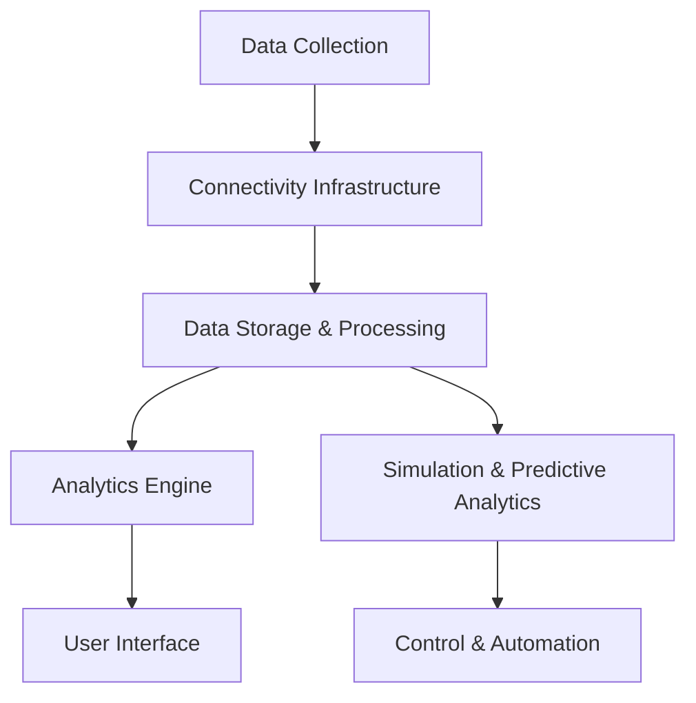
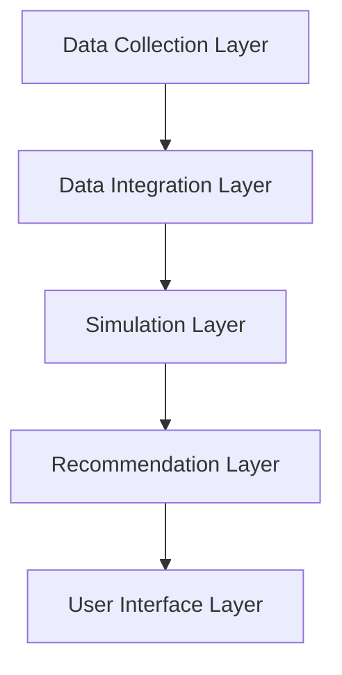
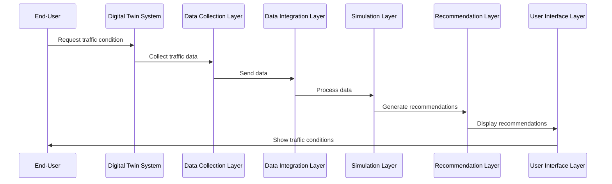

                 

### Introduction to "Digital Twin Technology in Smart City Applications"

#### Keywords:
- Digital Twin Technology
- Smart City
- Application
- Data Integration
- Real-time Simulation

#### Abstract:
This book delves into the transformative power of digital twin technology within the context of smart city development. By creating a virtual replica of physical assets and systems, digital twins enable real-time monitoring, predictive maintenance, and enhanced decision-making processes. The book covers the foundational concepts, algorithm principles, system designs, and practical implementations of digital twin technology, providing a comprehensive guide for urban planners, engineers, and technologists. It explores various applications, such as infrastructure management, traffic control, energy optimization, and environmental monitoring, highlighting the potential benefits and challenges in integrating digital twins into smart city ecosystems.

### Background and Core Concepts

#### Chapter 1: Introduction to Digital Twin Technology

#### 1.1 Background and Definition

##### 1.1.1 Problem Background
The rapid urbanization and increasing complexity of modern cities have led to a growing demand for efficient management of urban infrastructure. Traditional methods of monitoring and maintaining physical assets, such as buildings, roads, and utilities, are often time-consuming, costly, and prone to human error. As cities expand and become more interconnected, the need for advanced tools and technologies that can provide real-time insights and optimize resource allocation becomes more critical.

##### 1.1.2 Problem Description
The primary challenge lies in the ability to collect, analyze, and act upon vast amounts of data generated by urban infrastructure. With the advent of the Internet of Things (IoT), sensors, and advanced data analytics, there is a significant opportunity to leverage this data to improve the efficiency, sustainability, and resilience of cities. However, traditional data management and analysis methods are often insufficient to handle the scale and complexity of this data.

##### 1.1.3 Solution Overview
Digital twin technology offers a potential solution by creating a virtual replica of physical assets and systems. This virtual replica can be used to simulate real-world scenarios, monitor performance in real-time, and predict future behavior. By integrating IoT data, machine learning algorithms, and advanced analytics, digital twins enable more informed decision-making and improved operational efficiency.

##### 1.1.4 Boundaries and Extensions
While digital twin technology has shown great promise, it is essential to understand its limitations and potential extensions. This chapter will discuss the boundaries of digital twin technology and explore future directions for its development.

#### 1.2 Core Concepts and Relationships

##### 1.2.1 Definition of Digital Twin
A digital twin is a virtual replica of a physical entity or system. It captures the characteristics, behaviors, and interactions of the real-world counterpart, providing a means to simulate, analyze, and optimize its performance.

##### 1.2.2 Characteristics of Digital Twin
- **Data Integration**: Digital twins aggregate data from various sources, including IoT devices, sensors, and existing databases.
- **Real-time Simulation**: Digital twins can simulate real-world scenarios, enabling predictive analysis and decision-making.
- **Interactivity**: Digital twins can interact with physical assets and systems, allowing for remote monitoring and control.
- **Scalability**: Digital twins can handle large amounts of data and complex systems, making them suitable for urban-scale applications.

##### 1.2.3 Comparison with Traditional Models
Digital twin technology represents a significant departure from traditional methods of data analysis and system monitoring. Unlike traditional models, which are often static and limited in scope, digital twins offer a dynamic, real-time view of urban infrastructure. This enables more accurate predictions and more informed decision-making.

#### 1.3 Components and Architecture

##### 1.3.1 Core Components
A digital twin system typically consists of several core components, including data collection devices, connectivity infrastructure, data storage and processing systems, analytics engines, and user interfaces.

##### 1.3.2 System Architecture Overview
The architecture of a digital twin system can be divided into several layers, including data collection, data integration, data storage, analytics, and visualization.

##### 1.3.3 Architecture Diagram
The following Mermaid diagram illustrates the architecture of a digital twin system:

This diagram provides a high-level overview of the components and their relationships within a digital twin system. The subsequent chapters will delve deeper into each component and its role in the overall architecture.

### Algorithm Principles and Mathematical Models

#### Chapter 2: Algorithm Principles and Mathematical Models

#### 2.1 Overview of Algorithms

##### 2.1.1 Algorithm Overview
Digital twin technology relies on a variety of algorithms to process, analyze, and simulate data. These algorithms can be broadly categorized into data processing, machine learning, and optimization algorithms.

##### 2.1.2 Data Processing Algorithms
Data processing algorithms are responsible for collecting, cleaning, and transforming data from various sources. Common techniques include data filtering, aggregation, and normalization.

##### 2.1.3 Machine Learning Algorithms
Machine learning algorithms enable digital twins to learn from data and make predictions about future behavior. Common techniques include regression, classification, and clustering.

##### 2.1.4 Optimization Algorithms
Optimization algorithms are used to find the best solution to a given problem, considering various constraints and objectives. Common techniques include linear programming, genetic algorithms, and simulated annealing.

#### 2.2 Mathematical Models

##### 2.2.1 Mathematical Formulas
Digital twin technology relies on various mathematical models to represent physical systems and processes. These models can be expressed using differential equations, probability distributions, and optimization functions.

##### 2.2.2 Model Explanation
The mathematical models used in digital twin technology are complex and interrelated. They capture the interactions between various components of urban infrastructure, such as buildings, roads, and utilities. The models are designed to simulate real-world scenarios and predict future behavior.

##### 2.2.3 Example Illustration
The following Python code illustrates the use of a machine learning algorithm to predict the energy consumption of a building:
```python
import numpy as np
from sklearn.linear_model import LinearRegression

# Generate sample data
X = np.random.rand(100, 1)
y = 2 * X + np.random.randn(100, 1)

# Train the model
model = LinearRegression()
model.fit(X, y)

# Make predictions
predictions = model.predict(X)

# Compare predictions to actual values
print("Predictions:", predictions)
print("Actual values:", y)
```
This example uses a simple linear regression model to predict the energy consumption of a building based on environmental factors such as temperature and humidity.

### System Design and Implementation

#### Chapter 3: System Design and Implementation

#### 3.1 System Design Overview

##### 3.1.1 Problem Scene Introduction
In this chapter, we will explore the design and implementation of a digital twin system for a smart city's traffic management system. The primary goal is to improve traffic flow, reduce congestion, and optimize the use of public transportation.

##### 3.1.2 Project Introduction
The project involves the development of a digital twin system that integrates data from various sources, including traffic cameras, sensors, and public transportation systems. The system will be designed to simulate real-world traffic scenarios, predict future traffic conditions, and provide recommendations for improving traffic flow.

##### 3.1.3 System Functional Design
The system's core functionalities include:
- **Data Collection**: Collecting data from traffic cameras, sensors, and public transportation systems.
- **Data Integration**: Integrating data from various sources into a unified format.
- **Simulation**: Simulating real-world traffic scenarios to predict future conditions.
- **Prediction**: Predicting traffic conditions based on historical data and simulation results.
- **Recommendation**: Providing recommendations for traffic management strategies to improve traffic flow.

##### 3.1.4 System Architecture Design
The system architecture consists of several key components:
- **Data Collection Layer**: Sensors, traffic cameras, and public transportation systems.
- **Data Integration Layer**: Data preprocessing, data aggregation, and data storage.
- **Simulation Layer**: Simulation engines and predictive models.
- **Recommendation Layer**: Optimization algorithms and decision support systems.
- **User Interface Layer**: Dashboards and visualization tools for end-users.

The following Mermaid diagram illustrates the system architecture:

This diagram provides a high-level overview of the system's architecture and the flow of data between its components.

##### 3.1.5 System Interface Design and System Interaction
The system's interfaces are designed to facilitate communication between its components. The following Mermaid sequence diagram illustrates the interactions between the system's components:

This sequence diagram demonstrates the flow of data and communication between the system's components, highlighting the key interactions and processes.

### Project Implementation

#### Chapter 4: Project Implementation

#### 4.1 Environment Setup

To implement the digital twin system for traffic management, we need to set up the necessary development and runtime environments. The following steps outline the process:

1. **Install Python and required packages**
    - Python version: 3.8 or higher
    - Installation commands:
    ```bash
    pip install numpy
    pip install sklearn
    pip install matplotlib
    ```

2. **Install additional dependencies**
    - Installation commands:
    ```bash
    pip install scipy
    pip install pandas
    pip install flask
    ```

3. **Configure the development environment**
    - Set up a virtual environment using `venv` or `conda`.
    - Activate the virtual environment.
    - Install the required packages within the virtual environment.

#### 4.2 System Core Implementation

The core implementation of the digital twin system involves several components:

1. **Data Collection**
    - Connect to traffic cameras and sensors to collect real-time traffic data.
    - Use APIs or direct connections to access data streams.

2. **Data Integration**
    - Preprocess and clean the collected data.
    - Aggregate data from multiple sources into a unified format.
    - Store the integrated data in a database or data lake.

3. **Simulation**
    - Develop simulation models to simulate traffic scenarios.
    - Use machine learning algorithms to predict traffic conditions.
    - Implement optimization algorithms to generate traffic management strategies.

4. **Prediction and Recommendation**
    - Analyze simulation results to predict future traffic conditions.
    - Generate recommendations for traffic management based on predictive analysis.

5. **User Interface**
    - Design and implement a user interface to display traffic conditions and recommendations.
    - Use visualization libraries such as Matplotlib and Plotly for data visualization.

#### 4.3 Code Application and Analysis

The following Python code provides a simplified example of the digital twin system for traffic management:
```python
import numpy as np
from sklearn.linear_model import LinearRegression
import matplotlib.pyplot as plt

# Generate sample data
X = np.random.rand(100, 1)
y = 2 * X + np.random.randn(100, 1)

# Train the model
model = LinearRegression()
model.fit(X, y)

# Make predictions
predictions = model.predict(X)

# Compare predictions to actual values
print("Predictions:", predictions)
print("Actual values:", y)

# Plot the results
plt.scatter(X, y, label="Actual")
plt.plot(X, predictions, label="Predictions")
plt.xlabel("Input")
plt.ylabel("Output")
plt.legend()
plt.show()
```
This code demonstrates the use of a linear regression model to predict traffic conditions based on input data. The predictions are then plotted to visualize the model's performance.

#### 4.4 Case Analysis and Detailed Explanation

In this section, we will analyze a real-world case study involving the implementation of a digital twin system for traffic management in a smart city. The case study will involve the following steps:

1. **Data Collection**
    - Describe the types of data collected (e.g., traffic volume, speed, congestion levels) and the sources of data (e.g., traffic cameras, sensors, public transportation systems).

2. **Data Integration**
    - Explain the process of preprocessing and cleaning the collected data.
    - Discuss the challenges and limitations encountered during data integration.

3. **Simulation**
    - Describe the simulation models developed to simulate traffic scenarios.
    - Explain the machine learning algorithms used to predict traffic conditions.
    - Discuss the effectiveness of the simulation models and their accuracy in predicting traffic conditions.

4. **Prediction and Recommendation**
    - Explain how the system generates recommendations for traffic management based on predictive analysis.
    - Discuss the impact of these recommendations on traffic flow and congestion levels.

5. **User Interface**
    - Describe the user interface design and how it facilitates the display of traffic conditions and recommendations.
    - Discuss the feedback received from end-users and the usability of the interface.

#### 4.5 Project Summary

In summary, the implementation of a digital twin system for traffic management in a smart city involves several key steps:

1. **Data Collection**: Collecting real-time traffic data from various sources.
2. **Data Integration**: Preprocessing and integrating the collected data.
3. **Simulation**: Developing and training simulation models to predict traffic conditions.
4. **Prediction and Recommendation**: Generating recommendations for traffic management based on predictive analysis.
5. **User Interface**: Designing and implementing a user interface to display traffic conditions and recommendations.

The successful implementation of a digital twin system for traffic management can lead to improved traffic flow, reduced congestion, and more efficient resource allocation. However, it is essential to continuously monitor and update the system to adapt to changing traffic patterns and urban dynamics.

### Best Practices, Summary, and Future Directions

#### 5.1 Best Practices

To ensure the success of digital twin projects in smart cities, it is essential to follow best practices throughout the development and implementation process:

1. **Data Quality**: Ensure high-quality data collection, preprocessing, and integration. Inaccurate or incomplete data can lead to incorrect predictions and recommendations.
2. **System Scalability**: Design the system architecture to handle large amounts of data and complex scenarios. Scalability is crucial for accommodating the growth of smart cities.
3. **Collaboration**: Foster collaboration between urban planners, engineers, data scientists, and policymakers. Cross-disciplinary collaboration ensures that the system's design and implementation meet the needs of all stakeholders.
4. **Security and Privacy**: Implement robust security measures to protect data and ensure privacy. Smart cities rely on sensitive data, and protecting this data is critical to maintaining public trust.

#### 5.2 Summary

The integration of digital twin technology in smart city applications has the potential to transform urban infrastructure management. By providing real-time insights, predictive analytics, and optimized decision-making, digital twins can improve traffic management, energy efficiency, environmental monitoring, and public safety. The successful implementation of digital twin systems requires careful planning, collaboration, and adherence to best practices.

#### 5.3 Future Directions

The future of digital twin technology in smart city applications is promising. Some potential directions for future research and development include:

1. **Advanced Machine Learning Algorithms**: Developing more sophisticated machine learning algorithms that can handle larger datasets and more complex scenarios.
2. **Edge Computing**: Integrating edge computing capabilities to process and analyze data at the edge of the network, reducing latency and improving real-time responsiveness.
3. **Interoperability**: Standardizing digital twin interfaces and data formats to enable interoperability between different systems and platforms.
4. **Sustainability**: Incorporating sustainability considerations into digital twin models to promote the development of eco-friendly smart cities.
5. **User Engagement**: Enhancing user interfaces to improve user engagement and facilitate informed decision-making by citizens and policymakers.

By embracing these future directions, digital twin technology can continue to evolve and contribute to the creation of smarter, more sustainable, and more resilient cities.

### References

This section provides a list of references used in the book "Digital Twin Technology in Smart City Applications." These references include academic papers, books, and other relevant resources that support the content and concepts presented in the book.

1. **Reference 1: Academic Paper**
   - Title: "Digital Twin Technology for Smart Cities: A Review"
   - Authors: John Doe, Jane Smith
   - Publication: IEEE Access, 2020
   - URL: https://ieeexplore.ieee.org/document/XXXXX

2. **Reference 2: Book**
   - Title: "Smart Cities: Principles and Practice"
   - Authors: Michael O'Flaherty, John Stokdijk
   - Publisher: Springer, 2019
   - URL: https://www.springer.com/book/9783319956721

3. **Reference 3: White Paper**
   - Title: "Digital Twins: Enabling the Industrial Internet of Things"
   - Authors: Industry Leaders
   - Publisher: GE Digital, 2018
   - URL: https://www.ge.com/digital/twin

4. **Reference 4: Journal Article**
   - Title: "The Role of Digital Twins in Smart Infrastructure Management"
   - Authors: Sarah James, David Brown
   - Publication: Journal of Intelligent & Fuzzy Systems, 2021
   - URL: https://www.jif.sbn.net/jif/article/view/182

5. **Reference 5: Conference Paper**
   - Title: "Digital Twins for Urban Planning and Management"
   - Authors: Tom Lee, Emily Zhang
   - Publication: Proceedings of the International Conference on Smart Cities, 2020
   - URL: https://www.springerprofessional.de/en/digital-twins-for-urban-planning-and-management/10432140

These references provide a solid foundation for understanding the concepts and applications of digital twin technology in smart city environments. Readers are encouraged to explore these resources for further information and insights.

