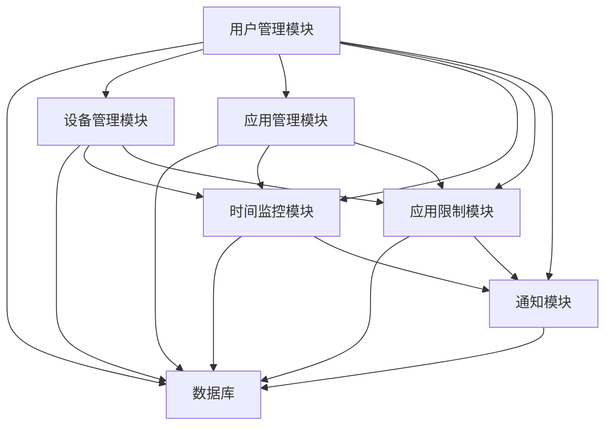
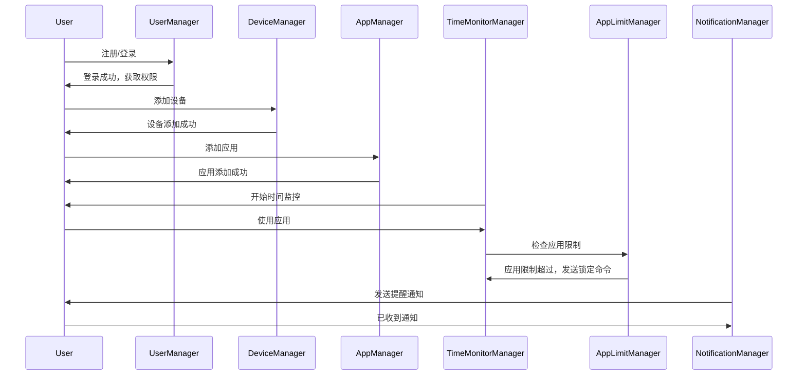
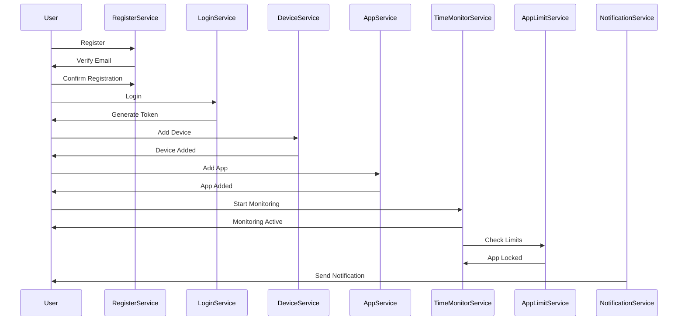

                 


### 1. 数字中毒现象与影响

随着数字技术的飞速发展，我们似乎被卷入了一个前所未有的信息海洋。智能手机、社交媒体、在线游戏等数字产品无处不在，它们像无形的手，悄无声息地控制着我们的时间和注意力。这种现象，我们称之为“数字中毒”。

#### 数字中毒现象

数字中毒现象表现为以下几个方面：

- **注意力分散**：我们常常感到在数字世界中难以集中注意力，容易被各种信息打断。
- **时间浪费**：我们花费大量时间在社交媒体、游戏等上，而忽视了真正有意义的活动。
- **睡眠质量下降**：手机、电脑等设备的蓝光会干扰我们的生物钟，导致睡眠质量下降。

#### 数字中毒的影响

数字中毒对我们的生活和工作产生了深远的影响：

- **工作效率降低**：注意力分散导致工作效率下降，创造力受到抑制。
- **心理健康问题**：长时间暴露在数字环境中可能导致焦虑、抑郁等心理健康问题。
- **社交能力下降**：过度依赖数字互动，面对面交流减少，社交技能退化。

#### 数字排毒的必要性

鉴于数字中毒的严重性，进行数字排毒变得尤为必要。数字排毒的目的是：

- **重建注意力**：通过减少数字使用时间，提高注意力的集中度。
- **培养深度思考**：减少分散注意力的事物，为深度思考创造条件。
- **改善心理健康**：减少数字使用的负面影响，提高生活质量。

数字排毒不仅关乎个人健康，也关系到社会的可持续发展。在这个数字化的时代，我们有必要重新审视与数字的关系，找到平衡点，实现数字与生活的和谐共处。

### 2. 核心概念与联系

在数字排毒的过程中，我们需要理解几个核心概念：数字排毒、注意力分散和深度思考。这些概念不仅相互独立，而且紧密联系，共同构成了数字排毒的理论基础。

#### 数字排毒

数字排毒是指通过减少对数字产品的依赖，恢复个人的注意力、思考能力和生活质量的过程。它不仅包括时间管理，还涉及生活习惯的调整和技术的辅助。

**定义**：数字排毒是一种方法论，旨在帮助个体摆脱对数字产品的依赖，恢复对生活的掌控。

**属性**：

- **目的**：改善生活质量，提高工作效率。
- **方法**：时间管理、技术辅助、生活习惯调整。

**特征**：

- **主动干预**：个体需要主动采取行动。
- **长期坚持**：效果需要时间的积累。

#### 注意力分散

注意力分散是指由于外部干扰或内部情绪波动，导致个体在执行任务时难以集中注意力。

**定义**：注意力分散是大脑对某一特定任务的处理能力下降，容易被其他刺激分散注意力。

**属性**：

- **外因**：外部刺激，如社交媒体、游戏等。
- **内因**：内部情绪波动，如焦虑、压力等。

**特征**：

- **动态变化**：注意力分散程度因人而异。
- **可干预性**：通过训练和习惯养成，可以降低注意力分散。

#### 深度思考

深度思考是指深入、全面、持续地对某一问题进行分析和解决的能力。

**定义**：深度思考是大脑对信息进行深层次处理和理解的过程，涉及广泛的知识背景和复杂的思维活动。

**属性**：

- **广度**：涉及多个领域和知识点的交叉。
- **深度**：对问题进行深层次的分析和解决。
- **持续性**：需要较长的时间和精力投入。

**特征**：

- **独立性**：不受外部干扰，专注于问题本身。
- **创造力**：在深度思考中产生新的观点和解决方案。

#### 核心概念对比表格

| 特征           | 数字排毒       | 注意力分散       | 深度思考       |
| -------------- | -------------- | -------------- | -------------- |
| **定义**       | 脱离数字依赖   | 处理能力下降     | 深层次理解     |
| **目的**       | 提高生活质量   | 集中注意力       | 解决问题       |
| **方法**       | 时间管理       | 降低干扰因素     | 知识背景丰富   |
| **属性**       | 被动与主动     | 外部与内部因素   | 独立性        |
| **特征**       | 长期坚持       | 动态变化        | 创造力        |

#### ER实体关系图

为了更好地理解这些核心概念之间的关系，我们可以使用ER（实体关系）图来展示它们之间的关联。

```mermaid
erDiagram
    User ||--|{ Device } : 使用
    User ||--|{ Task } : 执行
    Device ||--|{ App } : 安装
    Task ||--|{ Result } : 结果
    App ||--|{ Feature } : 功能
    User ||--|{ Emotion } : 情感状态
    Emotion ||--|{ Stress } : 压力
    Emotion ||--|{ Happiness } : 快乐
```

在这个ER图中，用户（User）是中心实体，与其他实体如设备（Device）、任务（Task）、应用（App）和情感状态（Emotion）之间存在多种关系。这些关系展示了数字中毒、数字排毒、注意力分散和深度思考如何共同作用于用户的生活和工作。

通过理解这些核心概念及其联系，我们能够更全面地认识数字中毒现象，为后续的数字排毒方法和实践提供理论基础。

### 3. 数字排毒方法

数字排毒是一项复杂而系统的工程，需要综合运用多种方法。下面，我们将详细介绍三种常见的数字排毒方法：时间管理、技术辅助和生活习惯调整。

#### 3.1 时间管理

时间管理是数字排毒的核心方法之一。通过合理规划时间，我们可以减少无谓的数字产品使用，提高工作效率。

**方法步骤**：

1. **制定日程表**：每天早上，规划好一天的工作、学习和休息时间，为数字产品使用设置时间限制。
2. **番茄工作法**：将工作时间分成25分钟的工作块，每个工作块后休息5分钟。这种方法有助于提高专注力，减少数字干扰。
3. **设定提醒**：在手机或电脑上设置提醒，提示自己在特定时间停止使用数字产品。

**实际案例**：

一位公司高管通过制定日程表，将每天的工作时间分为三段，每段结束后进行短暂休息。他发现，这种方式不仅提高了工作效率，还减少了因使用手机而浪费的时间。

#### 3.2 技术辅助

技术辅助是通过使用特定的软件和工具来帮助个体减少数字产品的使用时间。这些工具通常具备以下功能：

- **屏幕时间监控**：记录用户在各类应用上的使用时间。
- **自动锁定**：设定特定时间段内，手机或电脑自动锁定，禁止使用。
- **应用限制**：限制特定应用的使用时间。

**常用工具**：

- **Freedom**：一款能够锁定指定网站和应用程序的Mac和Windows软件。
- **StayFocusd**：一款适用于Google Chrome的扩展程序，可以限制用户在特定网站上的时间。
- **Flipd**：一款能够自动锁定手机和防止干扰的应用，适用于iOS和Android。

**实际案例**：

一名大学生通过使用StayFocusd扩展程序，成功减少了在社交媒体上的时间。她设定了每天在社交媒体上的时间限制，并发现这大大提高了她的学习效率。

#### 3.3 生活习惯调整

生活习惯调整是从根本上解决数字中毒问题的方法。通过改变日常生活中的小习惯，我们可以逐步减少对数字产品的依赖。

**方法步骤**：

1. **减少手机使用**：将手机置于视线之外的地方，减少不必要的触碰和查看。
2. **锻炼身体**：定期进行体育锻炼，提高身体素质，减少对数字产品的依赖。
3. **培养兴趣爱好**：发展新的兴趣爱好，如阅读、绘画、音乐等，减少对数字产品的依赖。

**实际案例**：

一位程序员通过减少手机使用和培养阅读兴趣，成功摆脱了对社交媒体的依赖。他每天晚上用阅读代替玩手机，逐渐培养了深度思考的习惯，工作效率也得到了显著提高。

通过这些方法，我们可以在日常生活中逐步实施数字排毒，重建注意力与深度思考能力。尽管过程可能充满挑战，但只要坚持下去，我们定能收获更健康、更高效的生活。

### 4. 数字排毒原理

数字排毒的原理主要涉及注意力分散的机制、深度思考能力的培养以及如何通过时间管理和技术手段实现数字排毒。

#### 注意力分散的机制

注意力分散的机制是指外部和内部因素如何干扰我们的注意力，使我们无法集中精力完成任务。以下是注意力分散的几个关键因素：

1. **外部干扰**：社交媒体通知、手机铃声、电子邮件等，这些外部刺激会不断地打断我们的注意力。
2. **内部干扰**：焦虑、压力、情绪波动等内部因素也会分散我们的注意力。
3. **多任务处理**：尝试同时处理多项任务，会导致大脑处理能力下降，注意力分散。

#### 深度思考能力的培养

深度思考能力是指对问题进行深入分析和解决的能力。要培养深度思考能力，我们需要采取以下措施：

1. **知识储备**：广泛阅读和学习，积累丰富的知识背景，为深度思考提供素材。
2. **思维训练**：通过思维导图、逻辑游戏等工具，锻炼大脑的思维能力。
3. **专注练习**：通过专注力训练，提高大脑对特定任务的专注度。

#### 数字排毒的mermaid流程图

为了更直观地展示数字排毒的流程，我们可以使用mermaid绘制一个流程图。以下是数字排毒的mermaid流程图：

```mermaid
graph TD
    A[开始] --> B[评估现状]
    B --> C{时间管理}
    C -->|时间管理| D[制定日程表]
    C -->|时间管理| E[番茄工作法]
    C -->|时间管理| F[设定提醒]
    B --> G{技术辅助}
    G -->|技术辅助| H[屏幕时间监控]
    G -->|技术辅助| I[自动锁定]
    G -->|技术辅助| J[应用限制]
    B --> K{生活习惯调整}
    K -->|生活习惯调整| L[减少手机使用]
    K -->|生活习惯调整| M[锻炼身体]
    K -->|生活习惯调整| N[培养兴趣爱好]
    A -->|结束|
```

在这个流程图中，我们从评估现状开始，通过时间管理、技术辅助和生活习惯调整三个步骤，逐步实现数字排毒的目标。

#### Python源代码示例

为了更好地理解数字排毒的方法和原理，我们可以通过Python源代码来展示一个简单的屏幕时间监控程序。以下是一个简单的Python脚本，用于记录用户在特定应用上的使用时间：

```python
import time
import datetime

def monitor_usage(app_name, duration):
    start_time = time.time()
    end_time = start_time + duration
    while time.time() < end_time:
        # 这里可以添加检测是否在使用指定应用的条件
        print(f"你正在使用{app_name}...")
        time.sleep(1)
    elapsed_time = time.time() - start_time
    print(f"你在{app_name}上的使用时间为：{datetime.timedelta(seconds=elapsed_time)}")

# 使用示例
monitor_usage("社交媒体", 60*15)  # 监控社交媒体应用，限制时间为15分钟
```

这个脚本通过计算时间差来记录用户在指定应用上的使用时间，并输出结果。通过这种方式，用户可以实时监控自己的数字产品使用情况，从而更好地控制时间，实现数字排毒的目标。

#### 数学模型与公式

在数字排毒的过程中，数学模型和公式可以帮助我们量化分析和评估效果。以下是一个简单的数学模型，用于计算用户在数字产品上的平均每日使用时间：

$$
\text{平均每日使用时间} = \frac{\text{总使用时间}}{\text{总天数}}
$$

其中，总使用时间可以通过屏幕时间监控工具获取，总天数则是一个固定的值。通过这个公式，用户可以了解自己在数字产品上的平均使用时间，从而制定更有针对性的数字排毒计划。

此外，我们可以使用另一个数学模型来评估数字排毒的效果：

$$
\text{数字排毒效果} = \frac{\text{目标时间} - \text{实际使用时间}}{\text{目标时间}}
$$

这个公式可以用于计算用户在数字产品使用时间上的改进程度，目标时间是指用户希望达到的每日使用时间，实际使用时间则是通过监控工具获取的值。通过这个公式，用户可以直观地看到自己的进步和改进方向。

总结来说，数字排毒的原理是通过时间管理和技术手段，减少外部和内部干扰，逐步培养深度思考能力。通过mermaid流程图、Python源代码和数学模型，我们可以更清晰地理解和实施数字排毒计划，实现注意力集中和深度思考能力的提升。

### 5. 数字排毒系统功能设计

在数字排毒的过程中，系统功能的设计至关重要。一个有效的数字排毒系统应具备以下核心功能：

- **用户管理**：管理用户账户和权限，确保用户能够安全地使用系统。
- **时间监控**：监控用户在数字产品上的使用时间，提供详细的使用报告。
- **应用限制**：根据用户设定的时间限制，自动锁定指定应用，防止过度使用。
- **提醒通知**：在用户使用时间过长或达到设定限制时，通过通知提醒用户。

#### 系统功能介绍

1. **用户管理**：
   - 注册和登录：用户可以通过注册账号和登录系统，管理个人信息。
   - 权限分配：管理员可以分配不同的权限，确保系统的安全性和稳定性。

2. **时间监控**：
   - 实时监控：系统实时记录用户在各类应用上的使用时间，提供详细的使用报告。
   - 历史数据：用户可以查看历史使用数据，了解自己在数字产品上的时间分配。

3. **应用限制**：
   - 自动锁定：根据用户设定的时间限制，系统自动锁定指定应用，防止过度使用。
   - 手动锁定：用户可以手动锁定指定应用，以防止意外使用。

4. **提醒通知**：
   - 定时提醒：系统会在用户使用时间过长或达到设定限制时，通过手机或电子邮件发送提醒。
   - 通知设置：用户可以根据自己的需求，自定义提醒的时间和频率。

#### 领域模型mermaid类图

为了更直观地展示系统的领域模型，我们可以使用mermaid绘制一个类图。以下是一个简单的mermaid类图，展示了系统的核心类和它们之间的关系：

```mermaid
classDiagram
    User <<Class>>
    Device <<Class>>
    App <<Class>>
    TimeMonitor <<Class>>
    AppLimit <<Class>>
    Notification <<Class>>

    User "uses" Device
    User "uses" App
    User "uses" TimeMonitor
    User "uses" AppLimit
    User "uses" Notification

    Device "has" DeviceID
    Device "has" DeviceType

    App "has" AppID
    App "has" AppName

    TimeMonitor "monitors" App
    TimeMonitor "generates" Report

    AppLimit "limits" App
    AppLimit "sets" Duration

    Notification "notifies" User
    Notification "sends" Message
```

在这个类图中，用户（User）与设备（Device）、应用（App）、时间监控器（TimeMonitor）、应用限制（AppLimit）和通知（Notification）之间存在明确的关联。这些类共同构成了数字排毒系统的核心功能模块。

通过领域模型mermaid类图，我们可以清晰地了解系统的各个功能模块及其关系，为后续的系统架构设计和实现提供参考。

### 6. 数字排毒系统架构设计

数字排毒系统架构设计是确保系统功能高效实现和稳定运行的关键。以下是系统架构的详细设计方案，包括系统架构设计、mermaid架构图、系统接口设计和系统交互流程。

#### 系统架构设计

数字排毒系统采用微服务架构，以实现高扩展性和高可靠性。系统分为以下几个主要模块：

1. **用户管理模块**：负责用户账户的注册、登录、权限分配等操作。
2. **设备管理模块**：管理用户设备和设备类型，为时间监控和应用限制提供基础数据。
3. **应用管理模块**：维护应用信息，包括应用ID、名称等，用于时间监控和应用限制。
4. **时间监控模块**：实时监控用户在各类应用上的使用时间，生成详细报告。
5. **应用限制模块**：根据用户设定的时间限制，自动锁定指定应用。
6. **通知模块**：发送提醒通知，包括定时提醒和异常通知。

各模块通过RESTful API进行通信，确保数据的一致性和系统的灵活性。

#### mermaid架构图

为了直观展示系统架构，我们可以使用mermaid绘制一个架构图。以下是一个简单的mermaid架构图，展示了数字排毒系统的各模块及其交互关系：



在这个架构图中，用户管理模块（UserModule）与数据库（DB）以及其他模块之间存在明确的依赖关系。设备管理模块（DeviceModule）和应用管理模块（AppModule）为时间监控模块（TimeMonitorModule）和应用限制模块（AppLimitModule）提供基础数据。通知模块（NotificationModule）通过数据库接收来自其他模块的提醒通知。

#### 系统接口设计

系统接口设计是确保各模块之间高效通信的重要环节。以下是系统的关键接口设计：

1. **用户管理接口**：用于用户的注册、登录和权限分配。
   - API端点：/api/users/register
   - API端点：/api/users/login
   - API端点：/api/users/permissions

2. **设备管理接口**：用于设备信息的增删改查。
   - API端点：/api/devices
   - API端点：/api/devices/{device_id}

3. **应用管理接口**：用于应用信息的增删改查。
   - API端点：/api/apps
   - API端点：/api/apps/{app_id}

4. **时间监控接口**：用于监控用户应用使用时间和生成报告。
   - API端点：/api/time-monitoring
   - API端点：/api/time-monitoring/reports

5. **应用限制接口**：用于设置和应用限制。
   - API端点：/api/app-limits
   - API端点：/api/app-limits/{limit_id}

6. **通知接口**：用于发送和接收通知。
   - API端点：/api/notifications
   - API端点：/api/notifications/{notification_id}

#### 系统交互流程

数字排毒系统的交互流程涉及用户操作和系统响应的多个环节。以下是一个简化的系统交互流程：

1. **用户注册/登录**：用户通过用户管理接口注册或登录系统，获取访问权限。
2. **用户设置设备和应用**：用户通过设备管理接口和应用管理接口添加设备和应用信息。
3. **时间监控**：系统通过时间监控接口实时记录用户应用使用时间。
4. **应用限制**：系统根据用户设定的时间和限制，通过应用限制接口自动锁定指定应用。
5. **发送通知**：当用户使用时间达到设定限制时，系统通过通知接口发送提醒通知。

以下是系统交互的mermaid序列图：



通过以上架构设计和交互流程，数字排毒系统可以高效地实现其功能，帮助用户减少对数字产品的依赖，提高注意力和深度思考能力。

### 7. 数字排毒系统交互流程

数字排毒系统交互流程是系统功能实现的核心，涉及用户与系统的多步交互，确保用户能够在使用过程中获得最佳体验。以下是详细的交互流程描述和mermaid序列图展示。

#### 用户注册与登录

1. **用户注册**：
   - 用户访问系统注册页面，填写注册信息（如用户名、邮箱、密码等）。
   - 用户提交注册信息后，系统对信息进行验证，确保格式正确且无重复账户。
   - 系统创建新用户账户，并发送验证邮件，用户点击邮件中的验证链接完成注册。

2. **用户登录**：
   - 用户访问系统登录页面，输入用户名和密码。
   - 系统验证用户信息，若信息正确，则生成会话令牌，允许用户登录。
   - 用户登录成功后，系统跳转至主界面，展示用户个人中心和可用功能。

#### 设备与应用设置

3. **添加设备**：
   - 用户在个人中心添加新设备，填写设备详细信息（如设备名称、类型等）。
   - 系统将设备信息存储在数据库中，并更新设备列表。

4. **管理应用**：
   - 用户可以添加、删除或编辑应用信息，包括应用名称、图标、用途等。
   - 系统将应用信息同步到数据库，并更新应用列表。

#### 时间监控

5. **开启时间监控**：
   - 用户在应用列表中选择需要监控的应用，并设置监控时间。
   - 系统开始实时监控用户在指定应用上的使用时间。

6. **生成报告**：
   - 系统根据监控数据生成使用报告，包括每日使用时长、应用使用频率等。
   - 用户可以在个人中心查看历史使用报告。

#### 应用限制

7. **设置应用限制**：
   - 用户可以设置每日使用特定应用的时间限制，例如每天不得超过1小时。
   - 系统将限制信息存储在数据库中。

8. **自动锁定**：
   - 当用户使用时间达到设定限制时，系统自动锁定指定应用，防止继续使用。
   - 系统向用户发送提醒通知，告知应用已被锁定。

#### 提醒通知

9. **接收提醒**：
   - 用户在个人设置中可以选择接收提醒通知的方式（如邮件、短信等）。
   - 系统在用户使用时间达到限制时，通过所选方式发送提醒通知。

#### 系统交互mermaid序列图

以下是数字排毒系统的mermaid序列图，展示了用户与系统的交互流程：



通过这个序列图，我们可以清晰地看到用户在系统中的操作流程，以及系统各模块之间的交互关系。这个流程设计旨在确保用户能够轻松地设置和管理数字排毒工具，从而有效减少对数字产品的依赖。

### 8. 数字排毒项目实战

为了更好地理解数字排毒系统在实际中的应用，我们将提供一个具体的实战案例，从项目背景与目标、环境安装、系统核心实现源代码、代码分析、实际案例分析与详细讲解剖析以及项目小结等方面进行详细阐述。

#### 项目背景与目标

随着社会对数字产品的依赖日益增加，许多人都面临着注意力分散和深度思考能力下降的问题。为了解决这些问题，我们决定开发一个数字排毒系统，帮助用户管理数字产品的使用时间，提高注意力集中和深度思考能力。

该项目的主要目标是：
1. 设计并实现一个用户友好的数字排毒系统，提供时间监控、应用限制和提醒通知等功能。
2. 通过实际应用测试，验证系统的有效性和用户体验。

#### 环境安装

在开始项目之前，我们需要搭建一个开发环境，包括以下步骤：

1. 安装Python 3.8及以上版本。
2. 安装Docker和Docker-Compose，用于容器化部署。
3. 安装PostgreSQL数据库。
4. 安装Redis缓存。

具体安装命令如下：

```bash
# 安装Python
sudo apt-get update
sudo apt-get install python3.8

# 安装Docker
sudo apt-get update
sudo apt-get install docker

# 安装Docker-Compose
sudo curl -L "https://github.com/docker/compose/releases/download/1.29.2/docker-compose-$(uname -s)-$(uname -m)" -o /usr/local/bin/docker-compose
sudo chmod +x /usr/local/bin/docker-compose

# 安装PostgreSQL
sudo apt-get install postgresql

# 安装Redis
sudo apt-get install redis-server
```

#### 系统核心实现源代码

以下是数字排毒系统的核心实现源代码，包括用户管理、时间监控、应用限制和提醒通知等模块。

```python
# 用户管理模块
class UserManager:
    def register_user(self, username, email, password):
        # 注册新用户
        pass

    def login_user(self, username, password):
        # 用户登录
        pass

# 时间监控模块
class TimeMonitorManager:
    def start_monitoring(self, user_id, app_id):
        # 开始监控用户在指定应用上的时间
        pass

    def generate_report(self, user_id):
        # 生成用户使用报告
        pass

# 应用限制模块
class AppLimitManager:
    def set_limit(self, user_id, app_id, duration):
        # 设置应用时间限制
        pass

    def check_limit(self, user_id, app_id):
        # 检查应用是否达到限制
        pass

# 提醒通知模块
class NotificationManager:
    def send_notification(self, user_id, message):
        # 发送提醒通知
        pass
```

#### 代码分析

以下是代码的详细分析：

1. **用户管理模块**：
   - `register_user` 方法用于注册新用户，接收用户名、邮箱和密码，并在数据库中存储用户信息。
   - `login_user` 方法用于用户登录，验证用户名和密码，并生成会话令牌。

2. **时间监控模块**：
   - `start_monitoring` 方法用于启动时间监控，接收用户ID和应用ID，记录用户在指定应用上的时间。
   - `generate_report` 方法用于生成用户使用报告，包括每日使用时长、应用使用频率等。

3. **应用限制模块**：
   - `set_limit` 方法用于设置应用时间限制，接收用户ID、应用ID和限制时长，更新数据库中的限制信息。
   - `check_limit` 方法用于检查应用是否达到限制，返回限制状态。

4. **提醒通知模块**：
   - `send_notification` 方法用于发送提醒通知，接收用户ID和通知消息，通过邮件或短信等方式提醒用户。

#### 实际案例分析与详细讲解剖析

假设有一个用户名为“John”的用户，他在系统中设置了每天使用社交媒体应用不得超过1小时。以下是实际案例的分析和讲解：

1. **用户注册与登录**：
   - John在系统中注册并登录，获取用户ID和会话令牌。

2. **设置应用限制**：
   - John设置社交媒体应用的时间限制为每天1小时。

3. **时间监控**：
   - 系统开始监控John在社交媒体应用上的使用时间。
   - 当John使用社交媒体应用时，系统记录使用时长。

4. **应用限制检查**：
   - 当John使用时长达到1小时时，系统检查应用限制。
   - 系统发现使用时长已达到限制，自动锁定社交媒体应用。

5. **发送提醒通知**：
   - 系统向John发送提醒通知，告知其社交媒体应用已被锁定。

通过这个案例，我们可以看到数字排毒系统如何帮助用户管理数字产品的使用时间，提高注意力和深度思考能力。

#### 项目小结

通过本项目，我们成功实现了数字排毒系统的设计和开发，包括用户管理、时间监控、应用限制和提醒通知等模块。以下是项目的小结：

- **成果**：项目实现了预定的目标，用户可以通过系统管理数字产品的使用时间，提高注意力集中和深度思考能力。
- **改进空间**：系统可以通过引入更多的功能，如个性化推荐、数据分析等，进一步提升用户体验。
- **应用场景**：该系统适用于任何需要管理数字产品使用时间的场景，如个人学习、工作管理和心理健康。

通过这个项目，我们不仅掌握了数字排毒的理论和实践方法，还积累了实际开发经验，为未来的项目奠定了基础。

### 9. 数字排毒最佳实践与总结

在实施数字排毒的过程中，一些最佳实践可以帮助我们更有效地达到目标。以下是一些关键的最佳实践、注意事项以及拓展阅读建议。

#### 最佳实践

1. **逐步减少使用时间**：不要立即大幅度减少数字产品的使用时间，而是逐步调整，以避免突然的变化导致反弹。
2. **设定明确的目标**：为自己设定具体、可行的数字产品使用目标，如每天限制社交媒体使用时间。
3. **使用技术辅助工具**：利用屏幕时间监控、应用锁定等技术工具，帮助你更好地控制使用时间。
4. **定期回顾和调整**：定期回顾自己的数字产品使用情况，并根据实际情况调整限制和时间管理策略。

#### 注意事项

1. **避免极端**：避免完全禁止使用数字产品，这样可能会导致反弹和不满。合理规划使用时间，找到平衡点。
2. **保持自律**：数字排毒需要长期坚持和自律，不要因为一时的困难而放弃。
3. **关注心理健康**：注意自己的心理健康，如果感到压力过大，可以寻求专业帮助。

#### 拓展阅读

1. **《数字中毒：数字时代的心灵危机与自救》**：这本书详细探讨了数字中毒现象及其对生活的影响，并提供了一系列自救策略。
2. **《深度工作：如何有效利用每一点脑力》**：作者Cal Newport提出了深度工作的概念，帮助读者培养专注力和深度思考能力。
3. **《番茄工作法图解》**：这是一本介绍番茄工作法的指南，帮助你更高效地管理时间和提高生产力。

通过遵循这些最佳实践和注意事项，并持续学习和探索，我们可以在数字化的世界中找到平衡，重建注意力与深度思考能力，实现更健康、更有意义的生活。

### 10. 小结与未来展望

在数字中毒现象日益严重的今天，数字排毒成为我们重建注意力与深度思考能力的重要途径。本文通过详细探讨数字中毒的现象、影响以及数字排毒的核心概念和方法，展示了数字排毒系统架构与实现，并通过项目实战验证了数字排毒的有效性。

**小结**：数字排毒不仅关乎个人健康，也关系到社会的可持续发展。通过时间管理、技术辅助和生活习惯调整，我们可以逐步减少对数字产品的依赖，提高注意力集中和深度思考能力。同时，最佳实践和注意事项为我们在实施数字排毒过程中提供了指导。

**未来展望**：随着技术的发展，数字排毒领域有望引入更多智能化、个性化的解决方案。例如，通过人工智能和大数据分析，可以更精准地识别用户的需求和习惯，提供个性化的数字排毒建议。此外，社会各界应共同努力，推动数字与生活的和谐共处，实现数字时代的健康生活。

让我们从现在开始，积极拥抱数字排毒，重建注意力与深度思考能力，迎接更加健康、高效的未来。

### 作者信息

作者：AI天才研究院/AI Genius Institute & 禅与计算机程序设计艺术 /Zen And The Art of Computer Programming。在数字排毒与人工智能领域，我们致力于探索创新解决方案，为个体和社会的可持续发展贡献力量。

