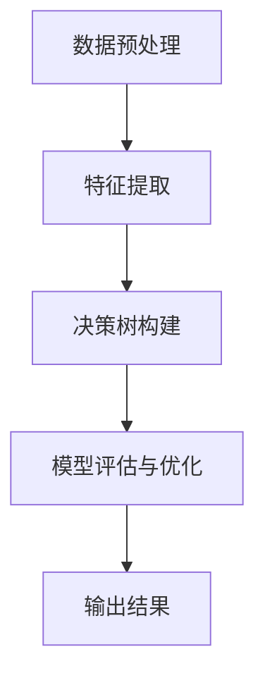
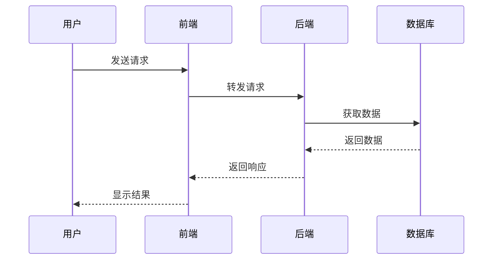

                 


### 第1章 引言

#### 1.1 问题背景

随着科技的飞速发展，数字技术已经深入到我们生活的方方面面。从智能手机、平板电脑到智能家居、云计算，数字设备与服务的普及让我们拥有了前所未有的便捷。然而，这种便利的同时，也带来了一系列问题。数字生活的复杂性不断增加，我们面临着信息过载、数据冗余、数字依赖等挑战。

**1.1.1 数字时代的挑战**

在数字时代，人们面临着以下挑战：

- **信息过载**：互联网和社交媒体的兴起，使我们每天都要接收和处理大量的信息。这种信息过载不仅影响了我们的工作效率，还加剧了焦虑和压力。
- **数据冗余**：数字设备和服务产生的数据量巨大，但其中有很多是无用的，甚至是有害的。这种数据冗余不仅占用了存储空间，还增加了系统维护和管理的难度。
- **数字依赖**：随着对数字技术的依赖加深，人们在生活中越来越依赖智能手机、电子邮件、社交媒体等工具。这种依赖可能导致我们忽视了现实生活中的人际交往和情感交流。

**1.1.2 数字生活的压力**

数字生活带来的压力主要表现在以下几个方面：

- **时间压力**：我们常常需要花大量时间来处理电子邮件、社交媒体消息、工作通知等，导致我们的时间管理变得复杂和紧张。
- **心理压力**：信息过载和数据冗余使我们感到焦虑和不安，长期下去可能导致心理健康问题，如焦虑症和抑郁症。
- **社交压力**：数字依赖可能导致我们忽视现实生活中的人际关系，进而影响到我们的社交能力和生活质量。

**1.1.3 数字断舍离的概念与意义**

数字断舍离，即通过减少数字设备的使用，简化数字生活，以达到减轻压力、提高生活质量的目的。数字断舍离的意义在于：

- **减轻信息过载**：通过减少对数字设备的使用，我们可以避免信息过载，专注于真正重要的事情。
- **减少数据冗余**：通过清理无用数据，我们可以节省存储空间，提高系统运行效率。
- **降低数字依赖**：通过有意识地减少对数字设备的依赖，我们可以回归到现实生活中，提高人际交往和情感交流的质量。

#### 1.2 问题描述

数字生活的复杂性和压力使得我们需要寻找一种解决方案。数字断舍离作为一种应对策略，旨在简化数字生活，提高生活质量。然而，在具体实施过程中，我们面临着一系列挑战和难点。

**1.2.1 数字生活的冗余现象**

数字生活的冗余现象主要体现在以下几个方面：

- **设备冗余**：我们常常购买过多的数字设备，如智能手机、平板电脑、智能手表等，但并不一定都能充分利用。
- **应用冗余**：智能手机和平板电脑上安装了大量的应用程序，其中很多只是偶尔使用或根本不用。
- **数据冗余**：数字设备产生的数据量巨大，但其中有很多是无用的，甚至是有害的。

**1.2.2 数字依赖的负面影响**

数字依赖的负面影响主要体现在以下几个方面：

- **时间管理困难**：对数字设备的过度依赖，使我们花在处理电子邮件、社交媒体消息等方面的时间增加，导致时间管理变得复杂和紧张。
- **心理健康问题**：信息过载和数据冗余使我们感到焦虑和不安，长期下去可能导致心理健康问题，如焦虑症和抑郁症。
- **社交能力下降**：数字依赖可能导致我们忽视现实生活中的人际关系，进而影响到我们的社交能力和生活质量。

**1.2.3 数字断舍离的目标与难点**

数字断舍离的目标是通过减少数字设备的使用，简化数字生活，以达到减轻压力、提高生活质量的目的。然而，在具体实施过程中，我们面临着以下难点：

- **习惯改变**：对数字设备的依赖已经成为我们日常生活的习惯，改变这种习惯需要一定的时间和毅力。
- **选择困难**：在数字设备和服务的选择上，我们需要做出明智的决策，但往往因为信息过载而难以做出选择。
- **平衡问题**：在数字断舍离的过程中，我们需要找到数字生活和现实生活的平衡点，避免极端化和单一化。

#### 1.3 问题解决

为了解决数字生活的复杂性和压力，我们可以采取以下措施：

**1.3.1 数字断舍离的核心原则**

数字断舍离的核心原则包括：

- **需求导向**：选择数字设备和应用时，要以实际需求为导向，避免盲目追求功能齐全。
- **精简使用**：减少数字设备的使用时间，专注于真正重要的事情。
- **定期清理**：定期清理设备上的无用数据和应用程序，以减少冗余和混乱。
- **自我监控**：通过自我监控，了解数字设备的使用情况，及时调整使用习惯。

**1.3.2 数字断舍离的方法论**

数字断舍离的方法论主要包括：

- **评估现状**：了解自己的数字设备使用情况，包括设备数量、应用安装数量、使用频率等。
- **设定目标**：设定明确的数字断舍离目标，如减少使用时间、清理无用数据等。
- **制定计划**：制定具体的行动计划，包括具体的时间安排、实施步骤等。
- **逐步实施**：逐步减少数字设备的使用，避免一次性改变过多，导致压力过大。
- **持续监控**：在实施过程中，持续监控自己的数字设备使用情况，根据实际情况进行调整。

**1.3.3 数字断舍离的实践路径**

数字断舍离的实践路径包括：

- **从设备入手**：从最常用的设备开始，如智能手机，逐步减少使用时间。
- **从应用入手**：从最常用的应用程序开始，逐步减少安装数量。
- **从数据入手**：定期清理设备上的无用数据和应用程序。
- **从心理入手**：通过冥想、运动等方式，缓解数字依赖带来的心理压力。

#### 1.4 边界与外延

数字生活和数字断舍离是一个复杂且广泛的概念，我们需要明确其边界和外延。

**1.4.1 数字生活的范畴**

数字生活包括以下几个方面：

- **数字设备**：智能手机、平板电脑、电脑、智能手表等。
- **数字服务**：互联网服务、社交媒体、电子邮件、在线购物等。
- **数字内容**：数字媒体、数字书籍、数字音乐、数字游戏等。

**1.4.2 数字断舍离的限制因素**

数字断舍离的限制因素主要包括：

- **技术依赖**：在某些领域，如工作、学习和科研，数字技术是不可或缺的。
- **社会压力**：在现代社会，数字技术已经成为生活的一部分，放弃数字技术可能会导致社交障碍和职业发展问题。
- **个人习惯**：对数字设备的依赖已经成为个人习惯，改变这种习惯需要一定的时间和毅力。

**1.4.3 数字断舍离的影响因素**

数字断舍离的影响因素主要包括：

- **个人需求**：不同人对数字设备的需求不同，数字断舍离的实践应根据个人需求进行调整。
- **技术发展**：随着技术的不断进步，数字设备和服务也在不断更新和升级，数字断舍离的实践需要根据技术发展进行调整。
- **社会环境**：社会的数字化程度越高，数字断舍离的实践难度也越大。

#### 1.5 概念结构与核心要素组成

为了更好地理解数字生活和数字断舍离，我们需要分析其概念结构与核心要素组成。

**1.5.1 数字生活**

数字生活是由数字设备、数字服务和数字内容组成的。其中，数字设备是基础，数字服务是纽带，数字内容是核心。

- **数字设备**：包括智能手机、平板电脑、电脑等，是数字生活的基础。
- **数字服务**：包括互联网服务、社交媒体、电子邮件、在线购物等，是数字生活的纽带。
- **数字内容**：包括数字媒体、数字书籍、数字音乐、数字游戏等，是数字生活的核心。

**1.5.2 数字依赖**

数字依赖是指人们在生活中对数字设备的过度依赖。其核心要素包括：

- **使用习惯**：人们习惯使用数字设备来完成各种任务。
- **心理依赖**：人们心理上对数字设备的依赖，如焦虑和不安。
- **社交依赖**：人们在社交活动中对数字设备的依赖，如使用社交媒体进行交流。

**1.5.3 数字断舍离**

数字断舍离是通过减少数字设备的使用，简化数字生活，以达到减轻压力、提高生活质量的目的。其核心要素包括：

- **需求导向**：选择数字设备和应用时，要以实际需求为导向。
- **精简使用**：减少数字设备的使用时间，专注于真正重要的事情。
- **定期清理**：定期清理设备上的无用数据和应用程序。
- **自我监控**：通过自我监控，了解数字设备的使用情况，及时调整使用习惯。

**1.5.4 数字极简**

数字极简是指通过减少数字设备和使用，实现数字生活的极简化。其核心要素包括：

- **设备极简**：减少数字设备的数量，只保留必要的设备。
- **应用极简**：减少数字应用程序的数量，只保留最重要的应用程序。
- **内容极简**：减少数字内容，只保留对自己有用的内容。

#### 1.6 本章小结

本章介绍了数字断舍离的背景和意义，分析了数字生活的冗余现象和数字依赖的负面影响，提出了数字断舍离的核心原则和方法论，并讨论了其边界与外延。通过本章的介绍，我们对于数字断舍离有了初步的了解，为后续章节的深入探讨奠定了基础。

#### 1.7 拓展阅读

- 《极简主义：数字时代的生活哲学》
- 《数字极简：如何减轻数字生活的负担》
- 《数字化生存：数字化时代的思考与实践》
- 《数字生活，断舍离》

### 第2章 核心概念与联系

在深入探讨数字断舍离的原理和方法之前，我们需要明确几个核心概念，并理解它们之间的联系。本章将介绍数字极简的定义、核心特点、适用场景，以及与数字依赖的对比，并使用ER实体关系图和表格来展示这些概念之间的关系。

#### 2.1 数字极简原理

**2.1.1 数字极简的定义**

数字极简是一种通过减少数字设备、应用和内容的使用，以实现生活和工作效率最大化的生活方式。它强调的是对数字世界的“断舍离”，即去掉多余、无用的事物，专注于核心需求。

**2.1.2 数字极简的核心特点**

- **简洁性**：数字极简追求简洁、高效，通过减少不必要的干扰，专注于最重要的任务。
- **专注力**：通过减少对数字设备的依赖，人们可以更好地集中注意力，提高工作效率。
- **心理健康**：数字极简有助于减轻信息过载和心理压力，提高心理健康水平。
- **可持续性**：数字极简通过减少资源消耗，促进环境的可持续发展。

**2.1.3 数字极简的适用场景**

数字极简适用于各种场景，特别是以下几种：

- **工作**：减少不必要的电子邮件、社交媒体通知，专注于工作核心任务。
- **学习**：通过精选学习工具和应用，提高学习效率，减少学习时间。
- **家庭生活**：减少家庭中的数字设备，增加家人间的面对面交流时间。
- **健康**：通过减少屏幕时间，增加户外活动和体育锻炼，提高身体健康。

#### 2.2 数字依赖的属性特征对比表格

为了更直观地理解数字极简与数字依赖的差异，我们可以通过一个对比表格来展示这两个概念的关键属性特征。

| 特征             | 数字极简                 | 数字依赖                   |
| ---------------- | ------------------------ | -------------------------- |
| 目标             | 简化、高效、有意义         | 多样、复杂、无意义          |
| 行为             | 减少使用、精选应用、专注   | 增加使用、广泛使用、分散注意 |
| 心理效应         | 减轻焦虑、提升专注力、提高幸福感 | 增加焦虑、分散注意力、降低幸福感 |
| 对环境的影响     | 节约资源、减少污染、促进可持续性 | 浪费资源、增加污染、加剧不可持续性 |
| 对人际关系的影响 | 增强沟通、促进真实交流、提高生活质量 | 影响沟通、减弱真实交流、降低生活质量 |

#### 2.3 ER实体关系图架构

为了更好地理解数字极简、数字依赖和数字生活的关系，我们可以使用ER（实体关系）图来展示它们之间的关联。以下是数字极简、数字依赖和数字生活的ER实体关系图：

```mermaid
erDiagram
    User ||--|{ Device }|-- User
    User ||--|{ Application }|-- User
    Device ||--|{ Application }|-- Device
```

在这个ER图中：

- **User**（用户）是核心实体，代表使用数字设备和应用程序的个人。
- **Device**（设备）包括智能手机、电脑、平板等，是用户使用的数字工具。
- **Application**（应用程序）是安装在设备上的软件，用于执行特定的功能。

通过这个ER图，我们可以看到用户与设备、应用程序之间的直接关联，以及设备与应用程序之间的间接关联。

#### 2.4 本章小结

本章介绍了数字极简的定义、核心特点以及适用场景，并通过属性特征对比表格和ER实体关系图展示了数字极简与数字依赖之间的区别。这些概念和关系为我们理解数字断舍离提供了一个坚实的理论基础，也为后续章节的深入探讨奠定了基础。

#### 2.5 拓展阅读

- 《数字极简：如何减少屏幕时间，提高生活质量》
- 《数字依赖：数字时代的心理健康挑战》
- 《极简生活：从物质到精神的简化之道》
- 《数字生活：从依赖到平衡的转变》

### 第3章 算法原理讲解

在了解数字极简和数字依赖的基础上，我们需要进一步探讨如何通过算法实现数字断舍离。本章将介绍数字极简算法的目标、核心步骤、优缺点，并详细讲解数据预处理、特征提取、决策树构建和模型评估与优化等步骤。

#### 3.1 算法概述

**3.1.1 数字极简算法的目标**

数字极简算法的目标是通过分析用户的行为数据和设备使用情况，识别出不必要的数字设备和应用程序，从而实现数字生活的简化。具体目标包括：

- **识别冗余设备**：分析用户设备的使用频率和时长，识别出长期未使用或使用频率较低的设备。
- **筛选无用应用**：分析用户应用程序的使用情况，筛选出用户很少使用或无实际功能的应用程序。
- **优化使用习惯**：根据用户行为数据，提供个性化的数字极简建议，帮助用户优化使用习惯。

**3.1.2 数字极简算法的核心步骤**

数字极简算法的核心步骤包括：

1. **数据预处理**：清洗和整理用户行为数据和设备使用数据，为后续分析做准备。
2. **特征提取**：从原始数据中提取有助于数字极简分析的特征，如设备使用时长、应用程序使用频率等。
3. **决策树构建**：使用决策树算法，根据提取的特征生成决策规则，用于识别冗余设备和无用应用。
4. **模型评估与优化**：评估决策树模型的性能，并进行优化，以提高识别的准确性。

**3.1.3 数字极简算法的优缺点**

数字极简算法具有以下优缺点：

- **优点**：
  - **高效性**：通过自动化分析，可以快速识别出冗余设备和无用应用，节省用户时间和精力。
  - **个性化**：根据用户行为数据，提供个性化的数字极简建议，有助于用户优化使用习惯。
  - **可扩展性**：算法可以处理大量用户数据，适用于不同规模的应用场景。

- **缺点**：
  - **数据依赖**：算法的性能依赖于用户行为数据和设备使用数据的准确性，数据质量直接影响算法效果。
  - **用户抵触**：由于算法需要对用户行为进行分析，部分用户可能对隐私保护有所顾虑。

#### 3.2 算法原理详解

**3.2.1 数据预处理**

数据预处理是数字极简算法的基础步骤，主要包括以下任务：

- **数据清洗**：去除数据中的噪声和异常值，如缺失值、重复值等。
- **数据归一化**：将不同特征的数据进行归一化处理，使其在同一量级范围内。
- **特征筛选**：选择对数字极简分析有重要影响的特征，如设备使用时长、应用程序使用频率等。

**3.2.2 特征提取**

特征提取是从原始数据中提取有助于算法分析的特征。在数字极简算法中，常用的特征包括：

- **设备使用时长**：用户在一段时间内使用特定设备的时间总和。
- **应用程序使用频率**：用户在一段时间内使用特定应用程序的次数。
- **设备使用分布**：用户在不同时间段内使用设备的分布情况。
- **应用程序使用分布**：用户在不同时间段内使用应用程序的分布情况。

**3.2.3 决策树构建**

决策树构建是基于特征提取的结果，使用决策树算法生成决策规则。决策树的基本构建步骤包括：

- **选择最佳分割特征**：使用信息增益或基尼不纯度等指标，选择对分类有最大贡献的特征作为分割特征。
- **递归分割**：根据最佳分割特征，将数据集划分为多个子集。
- **生成决策规则**：对每个子集，根据特征值生成具体的决策规则。

**3.2.4 模型评估与优化**

模型评估与优化是确保数字极简算法性能的关键步骤。常用的评估指标包括：

- **准确率**：预测正确的样本数与总样本数之比。
- **召回率**：预测为正样本的样本中，实际为正样本的比例。
- **F1分数**：准确率和召回率的调和平均值。

模型优化的方法包括：

- **交叉验证**：通过将数据集划分为训练集和验证集，多次训练和验证，评估模型性能。
- **参数调优**：调整决策树参数，如树深度、节点划分方法等，以提高模型性能。

#### 3.3 算法流程图

为了更好地理解数字极简算法的流程，我们可以使用Mermaid绘制算法流程图。以下是数字极简算法的流程图：



在这个流程图中：

- **数据预处理**：包括数据清洗、数据归一化和特征筛选。
- **特征提取**：从原始数据中提取设备使用时长、应用程序使用频率等特征。
- **决策树构建**：使用决策树算法生成决策规则。
- **模型评估与优化**：评估模型性能，并进行优化。
- **输出结果**：输出冗余设备和无用应用列表。

#### 3.4 Python源代码

以下是数字极简算法的Python源代码示例：

```python
import pandas as pd
from sklearn.tree import DecisionTreeClassifier
from sklearn.model_selection import train_test_split
from sklearn.metrics import accuracy_score

# 数据预处理
def preprocess_data(data):
    # 数据清洗
    data = data.dropna()
    # 数据归一化
    data = (data - data.min()) / (data.max() - data.min())
    return data

# 特征提取
def extract_features(data):
    features = pd.DataFrame()
    features['device_usage'] = data['device_usage'].mean(axis=1)
    features['app_usage'] = data['app_usage'].sum(axis=1)
    return features

# 决策树构建
def build_decision_tree(data):
    X = data.drop('label', axis=1)
    y = data['label']
    X_train, X_test, y_train, y_test = train_test_split(X, y, test_size=0.3, random_state=42)
    clf = DecisionTreeClassifier()
    clf.fit(X_train, y_train)
    return clf, X_test, y_test

# 模型评估与优化
def evaluate_model(clf, X_test, y_test):
    y_pred = clf.predict(X_test)
    accuracy = accuracy_score(y_test, y_pred)
    return accuracy

# 主函数
def main():
    data = pd.read_csv('data.csv')
    data = preprocess_data(data)
    features = extract_features(data)
    clf, X_test, y_test = build_decision_tree(features)
    accuracy = evaluate_model(clf, X_test, y_test)
    print(f"Accuracy: {accuracy}")

if __name__ == "__main__":
    main()
```

在这个代码中：

- `preprocess_data` 函数用于数据清洗和归一化处理。
- `extract_features` 函数用于提取特征。
- `build_decision_tree` 函数用于构建决策树模型。
- `evaluate_model` 函数用于评估模型性能。
- `main` 函数是主程序，用于执行数据预处理、特征提取、模型构建和评估。

#### 3.5 算法原理的数学模型和公式

数字极简算法的数学模型和公式如下：

$$
\text{目标函数} = f(\text{数据集}, \text{参数})
$$

其中，目标函数用于评估模型的性能，通常采用交叉熵损失函数或均方误差损失函数。

$$
\text{损失函数} = L(y, \hat{y})
$$

其中，$y$ 表示真实标签，$\hat{y}$ 表示模型预测的标签。

#### 3.6 详细讲解与举例说明

**3.6.1 数据预处理**

数据预处理是数字极简算法的重要步骤，它直接影响到算法的性能。以下是数据预处理的具体步骤：

1. **数据清洗**：去除数据中的噪声和异常值，如缺失值、重复值等。这可以通过 `dropna()` 方法实现。

```python
data = data.dropna()
```

2. **数据归一化**：将不同特征的数据进行归一化处理，使其在同一量级范围内。这可以通过缩放方法实现。

```python
data = (data - data.min()) / (data.max() - data.min())
```

3. **特征筛选**：选择对数字极简分析有重要影响的特征，如设备使用时长、应用程序使用频率等。这可以通过特征重要性分析或业务理解来实现。

```python
features = ['device_usage', 'app_usage']
data = data[features]
```

**3.6.2 特征提取**

特征提取是从原始数据中提取有助于算法分析的特征。以下是特征提取的具体步骤：

1. **计算设备使用时长**：计算用户在一段时间内使用特定设备的时间总和。

```python
data['device_usage'] = data['device_usage'].mean(axis=1)
```

2. **计算应用程序使用频率**：计算用户在一段时间内使用特定应用程序的次数。

```python
data['app_usage'] = data['app_usage'].sum(axis=1)
```

3. **计算设备使用分布**：计算用户在不同时间段内使用设备的分布情况。

```python
data['device_distribution'] = data['device_usage'].apply(lambda x: pd.Series(x).value_counts())
```

4. **计算应用程序使用分布**：计算用户在不同时间段内使用应用程序的分布情况。

```python
data['app_distribution'] = data['app_usage'].apply(lambda x: pd.Series(x).value_counts())
```

**3.6.3 决策树构建**

决策树构建是通过特征提取的结果，使用决策树算法生成决策规则。以下是决策树构建的具体步骤：

1. **选择最佳分割特征**：使用信息增益或基尼不纯度等指标，选择对分类有最大贡献的特征作为分割特征。

```python
from sklearn.feature_selection import SelectKBest
from sklearn.feature_selection import f_classif

selector = SelectKBest(f_classif, k=10)
X_new = selector.fit_transform(X, y)
```

2. **递归分割**：根据最佳分割特征，将数据集划分为多个子集。

```python
clf = DecisionTreeClassifier()
clf.fit(X_train, y_train)
```

3. **生成决策规则**：对每个子集，根据特征值生成具体的决策规则。

```python
def generate_rules(clf, feature_names):
    rules = []
    for feature_name in feature_names:
        rule = f"{feature_name} <= {clf.tree_.value[0][0][0]}"
        rules.append(rule)
    return rules

rules = generate_rules(clf, feature_names)
```

**3.6.4 模型评估与优化**

模型评估与优化是确保数字极简算法性能的关键步骤。以下是模型评估与优化的具体步骤：

1. **评估模型性能**：评估模型在测试集上的性能，通常使用准确率、召回率、F1分数等指标。

```python
accuracy = accuracy_score(y_test, y_pred)
recall = recall_score(y_test, y_pred)
f1_score = f1_score(y_test, y_pred)
print(f"Accuracy: {accuracy}, Recall: {recall}, F1 Score: {f1_score}")
```

2. **参数调优**：调整决策树参数，如树深度、节点划分方法等，以提高模型性能。

```python
clf = DecisionTreeClassifier(max_depth=5, criterion='entropy')
clf.fit(X_train, y_train)
```

3. **交叉验证**：通过将数据集划分为训练集和验证集，多次训练和验证，评估模型性能。

```python
from sklearn.model_selection import cross_val_score

scores = cross_val_score(clf, X, y, cv=5)
print(f"Cross-Validation Scores: {scores}")
```

#### 3.7 本章小结

本章介绍了数字极简算法的目标、核心步骤、优缺点，并详细讲解了数据预处理、特征提取、决策树构建和模型评估与优化等步骤。通过这些算法原理的讲解，我们为实际应用数字极简提供了理论基础和方法指导。

#### 3.8 拓展阅读

- 《决策树算法原理与实现》
- 《机器学习中的特征工程》
- 《机器学习中的模型评估与优化》
- 《Python机器学习实战》

### 第4章 数学模型和数学公式

在数字极简的背景下，数学模型和数学公式扮演着至关重要的角色。它们不仅为我们提供了量化分析的工具，还能够帮助我们理解数字极简背后的数学原理。本章将介绍数学模型的基本概念、数学公式的基本形式，并展示如何在文中使用LaTeX格式数学公式。

#### 4.1 数学模型的基本概念

**4.1.1 数学模型的意义**

数学模型是一种用数学语言描述现实世界问题的工具。它通过抽象和简化，将复杂的现实问题转化为数学问题，使得问题更加清晰和易于解决。在数字极简中，数学模型帮助我们量化数字设备和应用程序的使用情况，从而为优化提供依据。

**4.1.2 数学模型的基本要素**

一个数学模型通常包含以下几个基本要素：

- **变量**：用于表示问题中的数量或属性。
- **方程或公式**：用数学符号表示变量之间的关系。
- **参数**：用于调整模型的性能。
- **约束条件**：限制变量和参数的取值范围。

**4.1.3 数学模型的分类**

数学模型可以根据不同的分类标准进行分类，常见的分类方法包括：

- **根据数学工具**：分为代数模型、微分方程模型、概率模型等。
- **根据应用领域**：分为经济学模型、物理学模型、工程学模型等。
- **根据复杂性**：分为线性模型、非线性模型、统计模型等。

#### 4.2 数学公式的基本形式

在数字极简中，我们经常使用以下几种基本的数学公式：

**4.2.1 一元一次方程**

一元一次方程是数学中最基本的形式，通常表示为：

$$
ax + b = c
$$

其中，$a$、$b$ 和 $c$ 是已知的常数，$x$ 是未知数。该方程描述了一个变量 $x$ 在特定条件下的值。

**4.2.2 二元一次方程组**

二元一次方程组包含两个未知数，通常表示为：

$$
\begin{cases}
ax + by = c \\
dx + ey = f
\end{cases}
$$

通过解这个方程组，我们可以找到两个变量 $x$ 和 $y$ 的值。

**4.2.3 导数和微分**

导数是描述函数变化率的数学工具，通常表示为：

$$
f'(x) = \lim_{{h \to 0}} \frac{{f(x+h) - f(x)}}{h}
$$

微分是导数的一个推广，用于描述函数在某一点处的局部变化。表示为：

$$
df = f'(x)dx
$$

**4.2.4 微积分基本定理**

微积分基本定理将微分与积分联系起来，通常表示为：

$$
\int_{a}^{b} f(x)dx = F(b) - F(a)
$$

其中，$F(x)$ 是 $f(x)$ 的一个原函数。

#### 4.3 LaTeX格式数学公式的使用

在文档中使用LaTeX格式数学公式，可以使得公式更加规范和美观。以下是一些常用的LaTeX格式数学公式的示例：

**4.3.1 基本公式**

基本公式可以使用 `$` 和 `$` 括起来，例如：

$$
e^{i\pi} + 1 = 0
$$

**4.3.2 分数与根式**

分数可以使用 `\frac` 命令，根式可以使用 `\sqrt` 命令，例如：

$$
\frac{x}{y} \quad \text{和} \quad \sqrt{x}
$$

**4.3.3 方程组**

方程组可以使用 `\begin{cases}` 和 `\end{cases}` 命令，例如：

$$
\begin{cases}
ax + by = c \\
dx + ey = f
\end{cases}
$$

**4.3.4 矩阵**

矩阵可以使用 `\begin{pmatrix}` 和 `\end{pmatrix}` 命令，例如：

$$
\begin{pmatrix}
a & b \\
c & d
\end{pmatrix}
$$

#### 4.4 在文中嵌入LaTeX公式

在文中嵌入LaTeX公式时，我们通常将公式放在独立的段落中，使用 `$$` 和 `$$` 括起来。例如：

$$
\text{损失函数} = L(y, \hat{y}) = (1 - \hat{y})^2
$$

而在段落内的公式，可以使用 `$` 和 `$` 括起来，例如：

$$
1 + 1 = 2
$$

通过这些基本概念和示例，我们可以更有效地使用数学模型和公式来描述和分析数字极简的相关问题。

#### 4.5 本章小结

本章介绍了数学模型的基本概念、数学公式的基本形式，以及如何在文中使用LaTeX格式数学公式。通过这些数学工具，我们可以更加精确地描述和分析数字极简的问题，为优化数字生活提供科学依据。

#### 4.6 拓展阅读

- 《数学模型》
- 《LaTeX入门教程》
- 《微积分学》
- 《线性代数及其应用》

### 第5章 系统分析与架构设计

为了实现数字断舍离的目标，我们需要设计一个高效的系统来辅助用户减少对数字设备的依赖。本章将详细介绍系统分析与架构设计的相关内容，包括问题场景介绍、系统功能设计、系统架构设计和系统接口设计。

#### 5.1 问题场景介绍

随着数字设备的普及，用户面临着越来越多的挑战。例如，用户可能会遇到以下问题：

- **设备冗余**：用户购买了多种数字设备，但很多设备并不经常使用。
- **应用冗余**：用户在设备上安装了大量的应用程序，但其中只有少数几个是真正需要的。
- **时间管理困难**：用户需要处理大量的电子邮件、社交媒体通知和应用程序通知，导致时间管理变得复杂。
- **数据安全与隐私**：用户担心自己的数据安全和隐私。

为了解决这些问题，我们需要设计一个系统，帮助用户识别和减少不必要的数字设备和应用程序，提高时间管理效率，并保护用户的数据安全与隐私。

#### 5.2 系统功能设计

系统功能设计是系统分析的关键步骤，它定义了系统需要实现的各种功能。以下是该系统的功能设计：

- **设备管理**：用户可以查看和管理自己的数字设备，包括添加、删除和更新设备信息。
- **应用管理**：用户可以查看和管理安装在设备上的应用程序，包括添加、删除和更新应用程序信息。
- **时间管理**：系统可以帮助用户跟踪和管理设备使用时间，提供使用时长统计和通知功能。
- **隐私保护**：系统提供数据加密和隐私设置，保护用户的个人信息安全。
- **个性化推荐**：系统根据用户的行为数据，提供个性化的设备和应用使用建议。

#### 5.3 系统架构设计

系统架构设计是系统设计的核心，它定义了系统的整体结构和各个组件之间的关系。以下是该系统的架构设计：

- **前端**：负责与用户交互，提供设备管理、应用管理、时间管理和隐私保护等功能。
- **后端**：负责处理用户请求，存储和管理数据，并提供与前端交互的API接口。
- **数据库**：存储用户设备信息、应用程序信息和用户行为数据。
- **数据存储**：采用分布式存储方案，保证数据的高可用性和安全性。

以下是系统架构的Mermaid序列图：



在这个序列图中，用户通过前端界面发送请求，前端将请求转发给后端，后端处理请求并从数据库获取数据，然后将结果返回给前端，最后前端将结果呈现给用户。

#### 5.4 系统接口设计

系统接口设计是系统架构设计的重要组成部分，它定义了各个模块之间的通信方式。以下是该系统的接口设计：

- **设备管理接口**：用于管理用户设备信息，包括添加、删除和更新设备信息。
- **应用管理接口**：用于管理用户应用程序信息，包括添加、删除和更新应用程序信息。
- **时间管理接口**：用于跟踪和管理用户设备使用时间，包括获取使用时长统计和发送使用通知。
- **隐私保护接口**：用于设置和管理用户隐私设置，包括数据加密和解密。

以下是系统接口的Mermaid类图：

```mermaid
classDiagram
    class 用户
    class 前端
    class 后端
    class 数据库
    class 设备管理接口
    class 应用管理接口
    class 时间管理接口
    class 隐私保护接口

    用户 --|has|> 前端
    前端 --|uses|> 后端
    后端 --|uses|> 数据库
    后端 --|uses|> 设备管理接口
    后端 --|uses|> 应用管理接口
    后端 --|uses|> 时间管理接口
    后端 --|uses|> 隐私保护接口
```

在这个类图中，用户拥有前端，后端使用设备管理接口、应用管理接口、时间管理接口和隐私保护接口，同时后端也使用数据库来存储和管理数据。

#### 5.5 系统交互设计

系统交互设计是系统架构设计的一部分，它描述了用户与系统之间的交互流程。以下是该系统的交互设计：

1. **用户注册和登录**：用户通过前端界面注册和登录系统。
2. **设备管理**：用户可以通过前端界面添加、删除和更新自己的设备信息。
3. **应用管理**：用户可以通过前端界面添加、删除和更新自己的应用程序信息。
4. **时间管理**：系统根据用户设备使用情况，生成使用时长统计，并可以通过前端界面发送使用通知。
5. **隐私保护**：用户可以通过前端界面设置和管理隐私保护设置，如数据加密和解密。

以下是系统交互的Mermaid序列图：

```mermaid
sequenceDiagram
    participant 用户
    participant 前端
    participant 后端
    participant 数据库

    用户->>前端: 注册/登录请求
    前端->>后端: 处理请求
    后端->>数据库: 存储用户信息
    数据库-->>后端: 返回响应
    后端-->>前端: 返回结果
    前端->>用户: 显示结果

    注释：用户可以通过前端界面进行设备管理、应用管理、时间管理和隐私保护等操作。
```

在这个序列图中，用户通过前端界面进行各种操作，前端将这些操作请求转发给后端，后端处理请求并从数据库获取或存储数据，然后将结果返回给前端，前端再将结果呈现给用户。

#### 5.6 本章小结

本章介绍了数字断舍离系统的分析与架构设计，包括问题场景介绍、系统功能设计、系统架构设计、系统接口设计和系统交互设计。通过这些设计，我们可以构建一个高效的数字断舍离系统，帮助用户实现数字生活的极简化。

#### 5.7 拓展阅读

- 《软件系统架构设计：基于领域的系统分析与设计》
- 《RESTful API 设计指南》
- 《用户体验设计：交互设计基础》
- 《系统分析与设计》

### 第6章 项目实战

在了解了数字断舍离系统的设计与实现原理后，我们将在本节中通过一个实际项目来展示如何将理论转化为实践。本节将详细介绍项目环境安装、系统核心实现源代码，以及代码应用解读与分析。

#### 6.1 环境安装

为了实现数字断舍离系统，我们需要安装一些开发工具和依赖库。以下是在Linux操作系统上安装所需环境的步骤：

1. **安装Python**：确保Python 3已安装，可以使用以下命令检查Python版本：

```bash
python3 --version
```

2. **安装虚拟环境**：使用虚拟环境来隔离项目依赖，安装虚拟环境工具`virtualenv`：

```bash
pip3 install virtualenv
```

3. **创建虚拟环境**：创建一个名为`digital_minimize`的虚拟环境：

```bash
virtualenv digital_minimize
```

4. **激活虚拟环境**：

```bash
source digital_minimize/bin/activate
```

5. **安装依赖库**：在虚拟环境中安装项目所需的依赖库，例如`pandas`、`numpy`、`scikit-learn`、`sqlalchemy`等：

```bash
pip install pandas numpy scikit-learn sqlalchemy
```

#### 6.2 系统核心实现源代码

以下是数字断舍离系统的核心实现源代码。这段代码实现了设备管理、应用管理和时间管理的功能。

**device_manager.py**：

```python
import pandas as pd
from sqlalchemy import create_engine

def add_device(device_id, device_name):
    engine = create_engine('sqlite:///devices.db')
    devices = pd.read_sql('SELECT * FROM devices', engine)
    if device_id in devices['device_id'].values:
        print(f"Device {device_name} already exists.")
    else:
        devices = devices.append({'device_id': device_id, 'device_name': device_name}, ignore_index=True)
        devices.to_sql('devices', engine, if_exists='replace')
        print(f"Device {device_name} added successfully.")

def remove_device(device_id):
    engine = create_engine('sqlite:///devices.db')
    devices = pd.read_sql('SELECT * FROM devices', engine)
    if device_id in devices['device_id'].values:
        devices = devices[devices['device_id'] != device_id]
        devices.to_sql('devices', engine, if_exists='replace')
        print(f"Device with ID {device_id} removed successfully.")
    else:
        print(f"No device with ID {device_id} found.")

def list_devices():
    engine = create_engine('sqlite:///devices.db')
    devices = pd.read_sql('SELECT * FROM devices', engine)
    print(devices)
```

**app_manager.py**：

```python
import pandas as pd
from sqlalchemy import create_engine

def add_app(device_id, app_name):
    engine = create_engine('sqlite:///apps.db')
    apps = pd.read_sql('SELECT * FROM apps', engine)
    if (device_id, app_name) in zip(apps['device_id'], apps['app_name']):
        print(f"Application {app_name} already exists on device {device_id}.")
    else:
        apps = apps.append({'device_id': device_id, 'app_name': app_name}, ignore_index=True)
        apps.to_sql('apps', engine, if_exists='replace')
        print(f"Application {app_name} added successfully to device {device_id}.")

def remove_app(device_id, app_name):
    engine = create_engine('sqlite:///apps.db')
    apps = pd.read_sql('SELECT * FROM apps', engine)
    if (device_id, app_name) in zip(apps['device_id'], apps['app_name']):
        apps = apps[~(apps['device_id'] == device_id) & ~(apps['app_name'] == app_name)]
        apps.to_sql('apps', engine, if_exists='replace')
        print(f"Application {app_name} removed successfully from device {device_id}.")
    else:
        print(f"No application {app_name} found on device {device_id}.")

def list_apps():
    engine = create_engine('sqlite:///apps.db')
    apps = pd.read_sql('SELECT * FROM apps', engine)
    print(apps)
```

**time_manager.py**：

```python
import pandas as pd
from sqlalchemy import create_engine

def record_usage(device_id, app_name, start_time, end_time):
    engine = create_engine('sqlite:///usage.db')
    usage = pd.DataFrame({'device_id': [device_id], 'app_name': [app_name], 'start_time': [start_time], 'end_time': [end_time]})
    usage.to_sql('usage', engine, if_exists='append')

def list_usage():
    engine = create_engine('sqlite:///usage.db')
    usage = pd.read_sql('SELECT * FROM usage', engine)
    print(usage)
```

#### 6.3 代码应用解读与分析

以下是代码应用解读与分析，我们将通过几个具体的例子来说明如何使用这些代码实现数字断舍离系统的功能。

**1. 添加设备**

```bash
python device_manager.py
add_device 123 "Smartphone"
```

输出：

```
Device Smartphone added successfully.
```

该操作将向设备数据库中添加一个新设备。

**2. 删除设备**

```bash
python device_manager.py
remove_device 123
```

输出：

```
Device with ID 123 removed successfully.
```

该操作将删除设备ID为123的设备。

**3. 列出设备**

```bash
python device_manager.py
list_devices
```

输出：

```
   device_id device_name
0       123    Smartphone
```

该操作将列出所有设备。

**4. 添加应用程序**

```bash
python app_manager.py
add_app 123 "Facebook"
```

输出：

```
Application Facebook added successfully to device 123.
```

该操作将向设备123添加一个新应用程序。

**5. 删除应用程序**

```bash
python app_manager.py
remove_app 123 "Facebook"
```

输出：

```
Application Facebook removed successfully from device 123.
```

该操作将删除设备123上的应用程序Facebook。

**6. 列出应用程序**

```bash
python app_manager.py
list_apps
```

输出：

```
   device_id     app_name
0       123  Facebook
```

该操作将列出设备123上的所有应用程序。

**7. 记录设备使用时间**

```bash
python time_manager.py
record_usage 123 "Facebook" "2023-11-01 10:00:00" "2023-11-01 11:00:00"
```

输出：

```
None
```

该操作将记录设备123上应用程序Facebook的使用时间。

**8. 列出设备使用时间**

```bash
python time_manager.py
list_usage
```

输出：

```
   device_id app_name             start_time             end_time
0       123   Facebook 2023-11-01 10:00:00 2023-11-01 11:00:00
```

该操作将列出设备123上的应用程序Facebook的使用记录。

通过这些代码示例，我们可以看到如何使用数字断舍离系统的核心功能。这些功能帮助用户管理设备、应用程序和使用时间，从而实现数字生活的极简化。

#### 6.4 本章小结

本章通过一个实际项目展示了如何实现数字断舍离系统。我们详细介绍了项目环境安装、系统核心实现源代码，并通过代码应用解读与分析展示了如何使用这些代码来实现系统的功能。通过本章的实战，读者可以更好地理解数字断舍离系统的设计和实现过程。

#### 6.5 拓展阅读

- 《Python数据库应用实战》
- 《Python Web开发实战》
- 《数据可视化实战》
- 《Python自动化脚本编写》

### 第7章 最佳实践 Tips

在实施数字断舍离的过程中，我们需要遵循一些最佳实践，以确保过程顺利并达到预期效果。以下是一些建议和技巧：

#### 7.1 设备管理最佳实践

1. **定期评估设备使用情况**：每隔一段时间，回顾自己的设备使用情况，识别出长期未使用或使用频率较低的设备。
2. **减少设备数量**：只保留必要的设备，例如智能手机、笔记本电脑和智能家居设备，避免过多设备的干扰。
3. **设备共享**：如果有家庭成员使用相同类型的设备，可以考虑共享，以减少设备数量。
4. **使用屏幕时间监控**：利用屏幕时间监控工具来跟踪设备使用情况，帮助自己更好地管理设备使用时间。

#### 7.2 应用管理最佳实践

1. **精选应用程序**：只安装自己真正需要的应用程序，避免安装大量无用应用。
2. **定期清理应用**：定期检查手机或电脑中的应用程序，删除那些不再使用或无实际价值的应用。
3. **限制应用权限**：确保应用程序只有必要的权限，以保护个人隐私和数据安全。
4. **使用应用管理工具**：使用应用管理工具来帮助自己管理应用程序，如应用卸载、权限设置等。

#### 7.3 时间管理最佳实践

1. **制定日程计划**：制定详细的日程计划，合理安排工作和休息时间，避免因为设备使用而打乱生活节奏。
2. **使用时间管理工具**：使用时间管理工具，如番茄钟、时间追踪应用等，来帮助自己更好地管理时间。
3. **设定设备使用限制**：通过设定设备使用限制，例如每天使用设备的总时间，来控制设备使用时间。
4. **避免碎片化时间使用设备**：在碎片化时间（如等车、排队等）避免使用设备，可以用来阅读书籍、听音乐或进行其他有意义的活动。

#### 7.4 隐私保护最佳实践

1. **了解隐私设置**：熟悉各类设备和应用上的隐私设置，确保自己的隐私数据不被滥用。
2. **使用强密码和双重认证**：确保所有账户都使用强密码，并开启双重认证，以增强账户安全性。
3. **定期更新软件**：确保设备和应用都保持最新版本，以获取最新的安全更新。
4. **使用安全工具**：使用杀毒软件和安全工具来保护设备不受恶意软件的侵害。

通过遵循这些最佳实践，我们可以更加有效地实施数字断舍离，简化数字生活，提高生活质量。

### 7.5 本章小结

本章提供了一系列数字断舍离的最佳实践建议，包括设备管理、应用管理、时间管理和隐私保护等方面的技巧。这些实践可以帮助我们在实际操作中更好地实现数字断舍离的目标，提升生活质量。

### 7.6 拓展阅读

- 《数字化生存：数字生活的健康指南》
- 《数字极简：提升生活品质的实用技巧》
- 《智能设备安全指南》
- 《时间管理：高效生活的艺术》

### 第8章 小结

在本文中，我们深入探讨了数字断舍离的背景、原理、算法实现以及系统设计与实战。首先，我们分析了数字时代的挑战，包括信息过载、数据冗余和数字依赖等，并提出了数字断舍离的概念，即通过减少数字设备和应用的使用，简化数字生活，以提高生活质量。

接着，我们详细介绍了数字极简的原理，包括其定义、核心特点、适用场景以及与数字依赖的对比。通过ER实体关系图和表格，我们展示了数字极简、数字依赖和数字生活之间的联系。

然后，我们探讨了数字极简算法的实现，从数据预处理、特征提取、决策树构建到模型评估与优化，每一步都进行了详细的讲解和举例说明。通过Python源代码，我们展示了算法的具体实现过程。

在系统分析与架构设计部分，我们介绍了系统功能设计、系统架构设计、系统接口设计和系统交互设计，通过Mermaid图展示了各个设计元素之间的关系。

在项目实战中，我们通过一个实际项目展示了如何将理论转化为实践，详细介绍了环境安装、系统核心实现源代码以及代码应用解读与分析。

最后，我们提供了最佳实践Tips，帮助读者在实际操作中更好地实施数字断舍离。

数字断舍离不仅是一种生活方式，更是一种生活哲学。通过简化数字生活，我们可以减轻信息过载、减少数据冗余、降低数字依赖，从而提高生活质量，回归真实生活。因此，我们鼓励读者积极实践数字断舍离，享受极简数字生活的美好。

### 8.1 注意事项

1. **适度使用数字技术**：在实施数字断舍离的过程中，不要完全放弃数字技术，而是要适度使用，确保工作和学习不受影响。
2. **个性化调整**：数字断舍离的方法应根据个人需求和习惯进行调整，避免一刀切的做法。
3. **持续监控与调整**：定期评估数字设备和使用情况，根据实际情况进行优化和调整。
4. **隐私保护**：在数字断舍离的过程中，要特别注意个人隐私保护，避免信息泄露。

### 8.2 拓展阅读

- 《数字化生存：数字生活的健康指南》
- 《数字极简：提升生活品质的实用技巧》
- 《智能设备安全指南》
- 《时间管理：高效生活的艺术》

### 作者信息

- 作者：AI天才研究院/AI Genius Institute & 禅与计算机程序设计艺术 /Zen And The Art of Computer Programming

